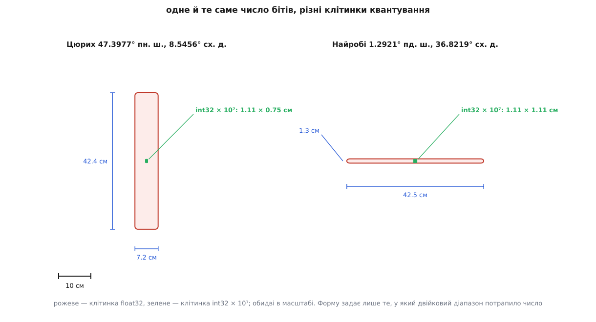
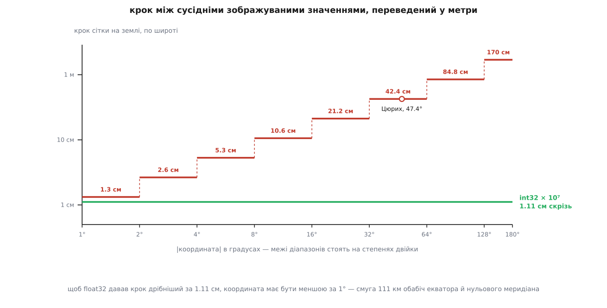

# 🧮 Скільки метрів коштує тип поля: float32 проти цілих градусів × 10⁷

У записі місії під кожну вісь координати відведено чотири байти, і в ці чотири байти влазять два різні способи записати градус: число з рухомою комою одинарної точності або ціле, помножене на 10⁷. Тут пораховано, скільки метрів на землі коштує кожен зі способів — і з арифметики вийде, що річ не в тім, ніби «ціле точніше за дробове», а у відношенні між величиною самого числа й дрібністю, якої від цього числа вимагають.

### Скільки дрібності треба вимагати

Число в протоколі не мусить бути точнішим за все інше в системі — але й не сміє бути найгрубішою ланкою. Тож почнімо з того, що вміє решта ланцюжка.

Приймач із поправками реального часу (RTK) дає горизонтальну похибку близько **2 сантиметрів**. Звичайний приймач у відкритому небі — близько **3 метрів**. Це два різні класи задач, і план місії має пережити гірший для себе, тобто перший: якщо запис координати грубший за 2 см, усі гроші за RTK викинуто на смітник, бо точка, у яку апарат летить, відома гірше, ніж місце, де він насправді є.

Другий замовник дрібності — знімання. Розмір пікселя на землі рахують з геометрії камери:

```
GSD = (ширина матриці · висота польоту) / (фокусна відстань · пікселів упоперек)
      усі довжини в міліметрах

матриця 1"    13.2 мм        фокусна 8.8 мм        5472 пікселі впоперек
H = 100 м:    GSD = 13.2 · 100000 / (8.8 · 5472) = 27.4 мм/піксель
H =  10 м:    GSD = 13.2 ·  10000 / (8.8 · 5472) =  2.74 мм/піксель
```

Похибка координати в сорок сантиметрів — це **15 пікселів** на висоті сто метрів і **155 пікселів** на десяти. Для повторного проходу тим самим маршрутом (порівняти те саме поле через тиждень) це прямий зсув усього шару.

Отже, ціль: крок сітки координат **порядку сантиметра**. Тепер порахуймо, що дає кожен із двох типів.

### Крок сітки float32 і чому він різний по осях

[Число з рухомою комою](topic:hw-arch/floating-point) — це ціла мантиса, помножена на степінь двійки. Для одинарної точності мантиса має 24 двійкові розряди, тож будь-яке нормальне значення записується як

```
x = m · 2^(e − 23),    де  2²³ ≤ m < 2²⁴,   e = ⌊log₂|x|⌋
```

Мантиса ціла, отже сусідні зображувані значення відрізняються рівно на `2^(e − 23)`. Цю відстань звуть **ulp** (англ. *unit in the last place* — одиниця останнього розряду), і вона повністю задає сітку: жодного числа між двома сусідніми вузлами тип не має.

Щоб перевести градуси в метри, потрібні дві головні величини еліпсоїда [WGS-84](topic:math-geometry/wgs84-datum) — тієї моделі Землі, у градусах якої записано координату. Земля не куля, тому довжина градуса різна для двох осей і для різних широт:

```
a = 6378137 м,   f = 1/298.257223563,   e² = f(2 − f) = 0.00669438

M(φ) = a(1 − e²) / (1 − e² sin²φ)^(3/2)      радіус кривини меридіана
N(φ) = a / √(1 − e² sin²φ)                   радіус кривини поперек меридіана

метрів на градус широти:   M(φ) · π/180
метрів на градус довготи:  N(φ) · cos φ · π/180
```

Множник `cos φ` — це вся геометрія збіжності меридіанів: паралель на широті φ — коло не навколо центру Землі, а навколо осі обертання, і її радіус тим менший, чим ближче до полюса. На екваторі градус довготи коштує 111 320 метрів, на широті Цюриха — вже 75 490, на вісімдесятій — 19 393.

Візьмімо конкретну точку — 47.3977419° північної широти, 8.5455940° східної довготи.

```
широта  47.3977419°   →  47.4 лежить у [32, 64),  e = 5
                         ulp = 2^(5−23) = 3.8147·10⁻⁶ °
                         3.8147·10⁻⁶ · 111179 = 0.4241 м

довгота  8.5455940°   →   8.5 лежить у [8, 16),   e = 3
                         ulp = 2^(3−23) = 9.5367·10⁻⁷ °
                         9.5367·10⁻⁷ ·  75490 = 0.0720 м
```

Сорок два сантиметри на північ і сім на схід. Клітинка квантування — не квадрат, а витягнута смужка з відношенням сторін майже шість до одного, і витягнута вона не тому, що така геометрія Землі, а тому, що два числа впали в різні двійкові проміжки: широта 47° — у `[32, 64)`, довгота 8.5° — у `[8, 16)`, а між ними два подвоєння кроку.

Найкраще це видно, коли поруч поставити точку, де числа розподілені навпаки.


*У Цюриха мала довгота й велика широта, у Найробі — навпаки, і клітинка перевертається на бік. Форму задає лише те, у який двійковий проміжок потрапило число; ціла сітка дає в обох місцях однакову клітинку близько сантиметра.*

Той самий підрахунок для трьох точок планети, уже програмою:

```c
#include <stdio.h>
#include <math.h>

static const double PI = 3.14159265358979323846;
static const double A  = 6378137.0;                /* велика піввісь WGS-84 */
static const double FL = 1.0 / 298.257223563;      /* стиснення             */

static double mpd_lat(double phi_deg) {            /* метрів на градус широти */
    double e2 = FL * (2.0 - FL);
    double s  = sin(phi_deg * PI / 180.0);
    return A * (1.0 - e2) / pow(1.0 - e2 * s * s, 1.5) * PI / 180.0;
}

static double mpd_lon(double phi_deg) {            /* метрів на градус довготи */
    double e2 = FL * (2.0 - FL);
    double s  = sin(phi_deg * PI / 180.0);
    return A / sqrt(1.0 - e2 * s * s) * cos(phi_deg * PI / 180.0) * PI / 180.0;
}

static double ulp32(double x) {                    /* крок сітки float32 біля x */
    int e = (int)floor(log2(fabs(x)));
    return ldexp(1.0, e - 23);                     /* 2^(e−23) */
}

int main(void) {
    struct { const char *name; double lat, lon; } p[] = {
        { "Цюрих",    47.3977419,   8.5455940 },
        { "Найробі",  -1.2921000,  36.8219000 },
        { "Сідней",  -33.8688000, 151.2093000 },
    };

    for (int i = 0; i < 3; i++) {
        double ml = mpd_lat(p[i].lat);             /* метрів на градус, обидві осі */
        double mo = mpd_lon(p[i].lat);
        printf("%s\n", p[i].name);
        printf("  широта  %11.7f°  ulp32 = %.3e°  -> %7.2f см     int32: %5.2f см\n",
               p[i].lat, ulp32(p[i].lat), ulp32(p[i].lat) * ml * 100, 1e-7 * ml * 100);
        printf("  довгота %11.7f°  ulp32 = %.3e°  -> %7.2f см     int32: %5.2f см\n",
               p[i].lon, ulp32(p[i].lon), ulp32(p[i].lon) * mo * 100, 1e-7 * mo * 100);
    }
    return 0;
}
```

```
Цюрих
  широта   47.3977419°  ulp32 = 3.815e-06°  ->   42.41 см     int32:  1.11 см
  довгота   8.5455940°  ulp32 = 9.537e-07°  ->    7.20 см     int32:  0.75 см
Найробі
  широта   -1.2921000°  ulp32 = 1.192e-07°  ->    1.32 см     int32:  1.11 см
  довгота  36.8219000°  ulp32 = 3.815e-06°  ->   42.45 см     int32:  1.11 см
Сідней
  широта  -33.8688000°  ulp32 = 3.815e-06°  ->   42.31 см     int32:  1.11 см
  довгота 151.2093000°  ulp32 = 1.526e-05°  ->  141.18 см     int32:  0.93 см
```

У Найробі широта менша за два градуси — і float32 дає там сантиметр із третиною, майже нарівні з цілою сіткою. Та сама точка по довготі має 42 сантиметри. У Сіднея довгота перевалила за 128°, тож крок подвоївся ще раз: метр сорок один.

### Сходинка через усю планету

Крок `2^(e − 23)` подвоюється щоразу, коли значення переходить через степінь двійки. Це не плавне погіршення, а сходинка: широта 31.9° і широта 32.1° лежать за двадцять два кілометри одна від одної, а крок сітки між ними змінюється удвічі.

```
проміжок       e     ulp, °          крок на землі (широта)
[  1,   2)     0     1.1921·10⁻⁷      1.3 см
[  2,   4)     1     2.3842·10⁻⁷      2.6 см
[  4,   8)     2     4.7684·10⁻⁷      5.3 см
[  8,  16)     3     9.5367·10⁻⁷     10.6 см
[ 16,  32)     4     1.9073·10⁻⁶     21.2 см
[ 32,  64)     5     3.8147·10⁻⁶     42.4 см
[ 64, 128)     6     7.6294·10⁻⁶     84.8 см
[128, 180]     7     1.5259·10⁻⁵    169.6 см
```


*Сходинка — крок float32, рівна лінія — крок цілої сітки з масштабом 10⁷. Ліворуч від позначки 1° float32 виграє, праворуч програє, і що далі праворуч, то більше.*

Звідси одразу видно межу, за якою float32 дає крок дрібніший за сантиметр із чвертю: `2^(e−23) · 111132 ≤ 0.0111` дає `e ≤ −1`, тобто `|x| < 1°`. Один градус — це смуга завширшки 111 кілометрів обабіч екватора для широти й така сама смуга обабіч нульового меридіана для довготи. За межами цих двох смуг ціла сітка дрібніша **завжди**.

Два менш очевидні наслідки сходинки.

**Відстані квантуються теж.** Різниця двох чисел з одного двійкового проміжку — точне кратне кроку цього проміжку. Замовивши на широті Цюриха дванадцять метрів між точками спрацювання камери, дістати можна лише 28 кроків сітки або 29:

```
12.00 / 0.4241 = 28.29
28 · 0.4241 = 11.875 м        29 · 0.4241 = 12.299 м
```

Похибка не накопичується вздовж галса — кожна точка сідає на свій найближчий вузол незалежно, — але й ніколи не зникає: відстань між сусідами гуляє на 42 сантиметри, а рівно 12 метрів не буває взагалі.

**Дуже близькі точки зливаються.** Якщо дві точки на одному меридіані відрізняються за широтою менш ніж на один ulp, після запису вони стають одним числом. У Цюриху це поріг 42 сантиметри, на довготі Сіднея — метр сорок один. Місія з кроком спрацювання менше цього порогу віддає на борт менше точок, ніж у неї було.

### Ціла сітка: чому саме 10⁷

Другий спосіб — [фіксована кома](topic:hw-arch/fixed-point): зберігати не саме число, а його кратність наперед домовленому кроку. Домовленість — 10⁻⁷ градуса; на дроті лежить ціле `i = град · 10⁷`, і крок між сусідніми значеннями скрізь той самий:

```
крок 10⁻⁷° по широті:   10⁻⁷ · 110574  = 1.106 см   на екваторі
                        10⁻⁷ · 111179  = 1.112 см   на 47°
                        10⁻⁷ · 111694  = 1.117 см   на полюсі

крок 10⁻⁷° по довготі:  10⁻⁷ · 111319  = 1.113 см   на екваторі
                        10⁻⁷ ·  75490  = 0.755 см   на 47°
                        10⁻⁷ ·  19393  = 0.194 см   на 80°
```

Різниця по широті — пів відсотка на всю планету; по довготі крок стискається разом із паралеллю, тобто стає тільки дрібнішим. Ніде й ніколи він не гірший за 1.12 см.

Тепер — чому множник саме 10⁷, а не 10⁶ чи 10⁸. Обидві межі затиснуті, і жодного вибору насправді не лишається.

Зверху тисне [розрядність типу](topic:sf-lang/overflow-wraparound): найбільше значення `int32` — `2³¹ − 1 = 2 147 483 647`, а найбільша координата за модулем — 180°. Отже

```
180 · S ≤ 2 147 483 647    →    S ≤ 11 930 464.7
```

Найбільший степінь десяти, який сюди влазить, — рівно 10⁷. Наступний, 10⁸, дав би `180 · 10⁸ = 18 000 000 000` — більш ніж увосьмеро за місткість типу; поле переповнилося б уже на 21.47°, тобто все, що північніше тропіка Рака, поїхало б у південну півкулю.

Знизу тисне вимога дрібності: 10⁶ дав би крок `10⁻⁶ · 111132 = 11.1 см` — удесятеро грубше за поставлену ціль у сантиметр і навіть грубше за той крок, який float32 дає біля самого екватора.

Обраний множник лишає запас: `180 · 10⁷ = 1 800 000 000` проти `2 147 483 647`, тобто зайнято 84 % місткості типу, а поле фізично сягає ±214.748°. Цей запас — просто те, що лишилося між двома числами: більший множник уже не влазить, менший коштує десятикратної втрати дрібності, і нічого посередині степені десяти не пропонують.

Перевірмо це з іншого боку. Скільки взагалі бітів потрібно, щоб накрити всю планету сіткою в один сантиметр?

```
360° · 111132 м/° / 0.01 м = 4.00·10⁹ вузлів
log₂(4.00·10⁹) = 31.90 біта
```

Тридцять два біти — найменше поле, у якому сантиметрова сітка на всю Землю взагалі можлива, і вона там ледве вміщається. Той самий спосіб працює й для локальної системи відліку, де ті самі поля несуть метри, помножені на 10⁴: крок 0.1 мм, діапазон ±214.748 км — знову «стільки, скільки треба, і рівно стільки, скільки влазить».

### Округлення чи відкидання

Кодувальник місії тримає координату як `double` і множить її на 10⁷ перед записом у поле `int32`. Приведення типу в C і C++ не округлює — воно **відкидає дробову частину**, зсуваючи значення до нуля:

```c
double  lat = 47.3977419;

int32_t x_cast  = (int32_t)(lat * 1e7);         /* відкидання: до нуля      */
int32_t x_round = (int32_t)lround(lat * 1e7);   /* до найближчого вузла     */
```

Різниця арифметично проста. Округлення дає симетричну похибку `±q/2`; відкидання дає похибку, яка сягає цілого кроку `q` і завжди дивиться в бік нуля, тобто до екватора й до нульового меридіана. Найгірший випадок подвоївся, а середня похибка перестала бути нулем — вона тепер дорівнює половині кроку зі сталим знаком.

Цікавіше, що це зачіпає навіть координати, які вже точно лежать на сітці, — а саме такі приходять із борту, з файлу плану чи з попереднього завантаження. Число `k/10⁷` здебільшого не має точного двійкового запису, тож добуток `(k/10⁷)·10⁷` іноді сідає на волосину нижче за `k`, і відкидання забирає цілий крок:

```
вузлів сітки перебрано:   200 001   (широти навколо 47.39°)
зсунуто на один крок:      16 116   = 8.06 %
максимальний зсув:              1 крок = 1.11 см
```

Один крок — сантиметр із чвертю, і повторення циклу «завантажити з борту → відправити назад» цього не роздуває: після одного-двох обертів значення потрапляє в нерухому точку перетворення й перестає рухатися взагалі, з'їхавши щонайбільше на два кроки. Тобто це не дрейф, а разова втрата, і `lround` її прибирає. На тлі того, що вміє апарат у повітрі, пів сантиметра — ніщо; варта уваги тут сама звичка порахувати, а не вгадати.

### Винен не тип, а відношення

Тепер головне, і воно пояснює, чому те саме повідомлення тримає широту в цілому полі, а висоту — у полі з рухомою комою, і це не непослідовність.

Рухома кома дає **сталу відносну** дрібність: крок біля числа завжди становить від `2⁻²⁴` до `2⁻²³` самого числа. Ціла сітка дає **сталу абсолютну** дрібність. Тож питання «чи вистачить типу» — це одне ділення: узяти потрібний крок, поділити на найбільше значення, яке поле мусить нести, і порівняти з `2⁻²³`.

```
широта:   потрібно 10⁻⁷°,  найбільше 90°
          10⁻⁷ / 90 = 1.11·10⁻⁹        →  log₂(1/1.11·10⁻⁹) = 29.7 біта
          float32 дає 24 біти мантиси  →  бракує майже 6 біт: крок у 107 разів грубший

висота:   потрібно 0.1 м,  найбільше ~8848 м
          0.1 / 8848 = 1.13·10⁻⁵       →  log₂(1/1.13·10⁻⁵) = 16.4 біта
          float32 дає 24                →  запас у 7 біт
```

Тому висота в тому самому записі спокійно лишається `float`: на тисячі метрів крок float32 становить `2^(9−23) = 61 мікрометр`, на вершині Евересту — міліметр. Не тому, що висота «менш важлива», а тому, що вона мале число, від якого вимагають грубого кроку, тоді як широта — велике число, від якого вимагають дрібного.

> 🔧 **Навіщо це.** Перевірка з двох рядків годиться для будь-якого поля протоколу, не лише для координати: поділи потрібний крок на найбільше значення поля й порівняй з `2⁻²³` для `float` та `2⁻⁵²` для `double`. Класичний провал тієї самої перевірки — час: мітка «секунд від 1970 року» — це число близько 1.7·10⁹, воно лежить у проміжку `[2³⁰, 2³¹)`, і крок float32 там `2^(30−23) = 128 секунд`. Мітка часу з рухомою комою одинарної точності округлює події до двох хвилин — тому в MAVLink час і несуть цілим `uint64` у мікросекундах, тією самою фіксованою комою, що й координату.

Це видно й у самій кількості місць, які кожен тип уміє розрізнити. Порахуймо, скільки різних значень має float32 у смузі координат від 1° до 180°: сім повних двійкових проміжків по `2²³` значень плюс частина восьмого.

```
7 · 2²³ + (180 − 128)/128 · 2²³ = 58 720 256 + 3 407 872 = 62 128 128

ціла сітка на тій самій смузі:  179 · 10⁷ = 1 790 000 000
```

Ті самі 32 біти — і в 28.8 раза більше розрізнюваних місць. Куди ж поділася решта кодів float32? Із приблизно 1.12 мільярда його значень, менших за 180°, **94.4 % лежать нижче за 1°**, а **79.5 % — нижче за `2⁻²⁰` градуса**, тобто ближче ніж 11 сантиметрів до екватора або до нульового меридіана. Чотири п'ятих місткості типу витрачено на смужку завширшки в долоню.

### Що сорок два сантиметри значать на землі

Лишилося поставити крок сітки поруч із величинами, серед яких він працює.

```
                                   величина поруч   крок float32
                                                    на 47° (42.4 см)

приймач RTK                          2 см           у 21 раз більший
звичайний приймач GNSS             1–3 м            у 2–7 разів менший
піксель знімка з висоти 100 м        2.7 см         15 пікселів
піксель знімка з висоти  10 м        2.7 мм         155 пікселів
посадковий майданчик Ø 1 м          50 см радіус    майже весь радіус
```

Зі звичайним приймачем 42 сантиметри тонуть у трьох метрах власної похибки вимірювання — саме тому координати з рухомою комою роками нікому не заважали. Але кожна задача, заради якої взагалі варто ставити RTK, — посадка на майданчик, повторний проліт тим самим галсом, зйомка з прив'язкою без наземних точок — потрапляє в рядки, де крок сітки стає найгрубішою ланкою й перекреслює точність, за яку вже заплачено.

Ціла сітка з масштабом 10⁷ знімає обидва закиди відразу. Крок 1.11 сантиметра майже вдвічі дрібніший за найкраще, що дає RTK, — і він однаковий у Найробі, у Цюриху й у Сіднеї. У float32 та сама місія коштує сантиметр із третиною в одному місці й метр сорок один в іншому, причому в самому маршруті ця різниця ніяк не видна: два однакові з вигляду числа несуть точність, що різниться в сто разів.
