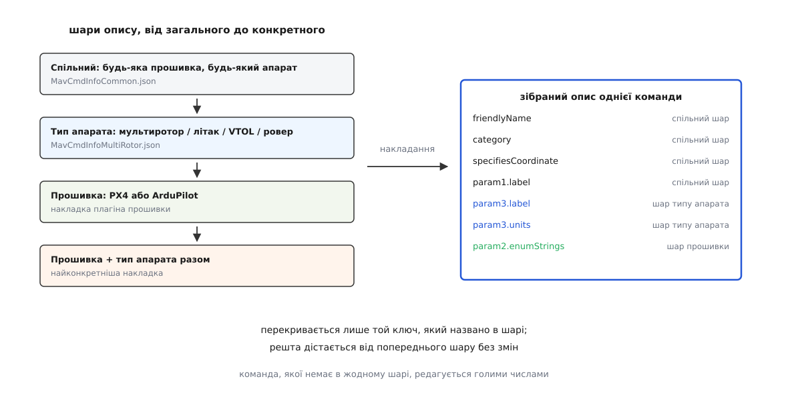
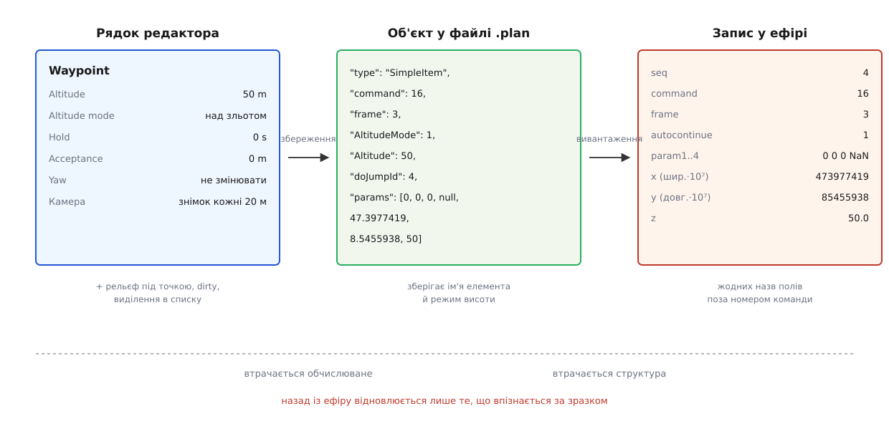
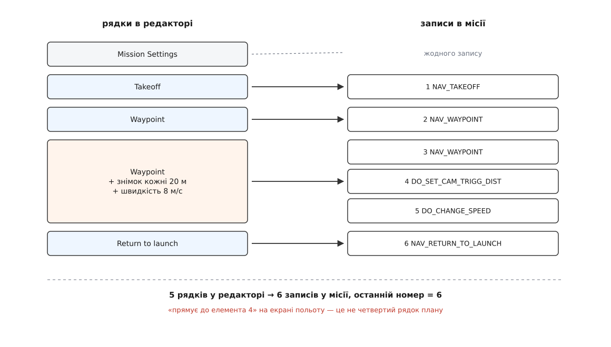
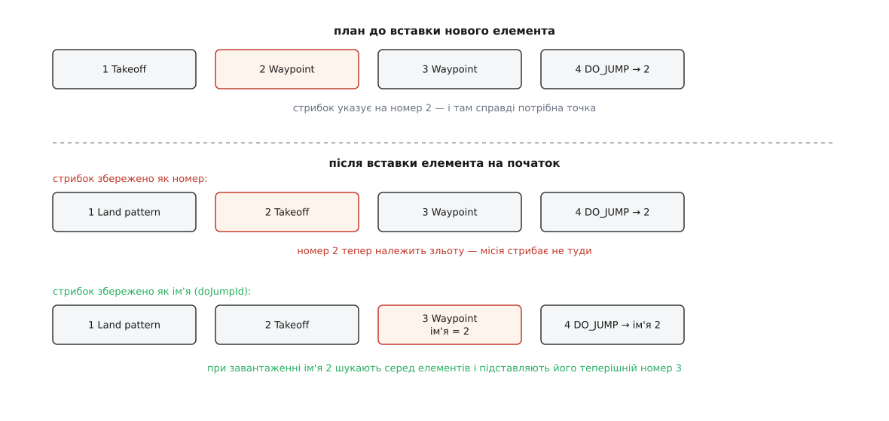

# Елементи місії й команди

<preknowlist>
- [MAVLink: місія й команди польоту](topic:sys-dron/mavlink-mission-items) — місія передається як список однотипних записів, у кожному номер команди `MAV_CMD` і сім числових параметрів.
- [Протокол місій MAVLink](topic:sys-dron/mavlink-mission-protocol) — діалог «ось скільки елементів → надішли мені №N → підтвердження», яким список потрапляє на борт.
- [Координати й одиниці](topic:com-protocol/coordinate-frames-units) — що таке система відліку (frame) і чому висота без указаної бази взагалі не число.
- [FactSystem](topic:sys-dron/fact-system) — факт як значення разом із метаданими: назвою, одиницями, межами, набором іменованих варіантів.
- [Vehicle](topic:sys-dron/vehicle-object) — об'єкт апарата в застосунку, який володіє менеджерами окремих протоколів.
</preknowlist>

У редакторі плану точка маршруту виглядає як рядок зі зрозумілими полями: назва «Waypoint», висота 50 м, «Hold 0 s», «Acceptance 0 m», а нижче — розкритий блок камери з написом «Take photo every 20 m». В ефір натомість іде запис, у якому немає жодного з цих слів:

```text
MISSION_ITEM_INT
  seq          = 4
  frame        = 3
  command      = 16
  current      = 0
  autocontinue = 1
  param1       = 0.0
  param2       = 0.0
  param3       = 0.0
  param4       = NaN
  x            = 473977419
  y            = 85455938
  z            = 50.0
```

Між цими двома картинами немає відповідності ані за назвами полів, ані навіть за кількістю: один рядок редактора дає в ефір два записи, бо галочка про знімок теж мусить стати окремою командою. А коли план завантажують назад із борту, приходить рівний список таких записів — і редактор має якось відновити з нього свої рядки з назвами й галочками.

Різниця не випадкова й не є наслідком неохайності. Вона починається з того, як свідомо збіднений сам запис у протоколі, і далі тягнеться через увесь застосунок.

## Сім чисел без імен

Місія в MAVLink — це масив записів однакової форми. Форма одна на всі команди: чи то «летіти в точку», чи то «змінити режим камери», чи то «повернутися додому». У записі є номер за порядком (`seq`), номер команди (`command` — значення переліку `MAV_CMD`), система відліку координат (`frame`), прапорець «продовжувати автоматично» (`autocontinue`), прапорець «це поточний елемент» (`current`) і сім чисел `param1`…`param7`.

Сім чисел не мають імен. Протокол не каже, що означає `param1`: для команди `MAV_CMD_NAV_WAYPOINT` (номер 16) це час утримання в точці в секундах, для `MAV_CMD_NAV_LOITER_TIME` (19) — час кружляння, для `MAV_CMD_DO_JUMP` (177) — номер елемента, на який стрибнути, для `MAV_CMD_DO_SET_CAM_TRIGG_DIST` — відстань між знімками в метрах. Одна й та сама комірка щоразу означає інше.

Це не недогляд, а плата за розширюваність. Якби кожна команда мала власне повідомлення з іменованими полями, поява нової команди вимагала б нової версії протоколу й нового коду в кожній наземній станції та в кожному автопілоті. Із безіменними параметрами автопілот, який уміє нову команду, просто починає її розуміти, а всі інші учасники передають її наскрізь, нічого про неї не знаючи. Станція, яка про команду не чула, все одно здатна її прийняти, зберегти й вивантажити назад без спотворень.

Ціна теж очевидна: **знання про те, що означають ці числа, живе поза протоколом**. Хтось мусить його мати — інакше редактор плану може показати користувачеві щонайбільше сім полів із написами «Param 1»…«Param 7».

Тільки дві з семи комірок мають фіксовану роль, і то за домовленістю, а не за протоколом: `param5` і `param6` віддані під широту й довготу, `param7` — під висоту, коли команда взагалі стосується місця в просторі. У повідомленні `MISSION_ITEM_INT` перші дві з них навіть виведені в окремі поля `x` та `y` цілого типу. Ось як застосунок пакує запис перед відправленням:

```cpp
mavlink_msg_mission_item_int_pack_chan(
    MAVLinkProtocol::instance()->getSystemId(),
    MAVLinkProtocol::getComponentId(),
    sharedLink->mavlinkChannel(),
    &messageOut,
    _vehicle->id(),                 // кому: система апарата
    MAV_COMP_ID_AUTOPILOT1,         // кому: компонент-автопілот
    missionRequestSeq,              // seq — номер, який попросив борт
    item->frame(),
    item->command(),
    missionRequestSeq == 0,         // current: лише нульовий елемент
    item->autoContinue(),
    item->param1(), item->param2(), item->param3(), item->param4(),
    item->frame() == MAV_FRAME_MISSION ? item->param5() : item->param5() * 1e7,
    item->frame() == MAV_FRAME_MISSION ? item->param6() : item->param6() * 1e7,
    item->param7(),
    _planType);
```

Два тернарні вирази посередині — це і є вся «геодезія» протоколу. Широта й довгота всередині застосунку зберігаються звичайними градусами з дробовою частиною, а в ефір ідуть цілими числами, помноженими на 10⁷: 47.3977419° стає 473977419. Виняток — система відліку `MAV_FRAME_MISSION`, яка означає «ця команда взагалі не про місце»; тоді `param5` і `param6` — просто числа, і множити їх було б безглуздо.

Множення на 10⁷ — не косметика. Число з рухомою комою одинарної точності просто не має стількох значущих цифр, скільки потрібно широті, і саме тому старіше повідомлення `MISSION_ITEM` із дробовими координатами вважають застарілим. Скільки саме метрів коштує ця різниця — [окремий підрахунок](topic:sys-dron/mission-items/math-coordinate-precision.md): крок між сусідніми зображуваними числами на широті близько 47° дає похибку порядку пів метра, тобто рівно тієї величини, яка псує посадку в точку й зшивання аерофотознімків.

## Словник, який повертає числам імена

Отже, застосунку потрібна таблиця: для кожної команди — людська назва, опис, і для кожного з семи параметрів — підпис, одиниці, розумне початкове значення, кількість знаків після коми, межі. Таку таблицю не можна вивести з протоколу; її доводиться тримати як окремі дані.

У QGroundControl вона лежить у файлах `MavCmdInfo*.json` і завантажується класом `MissionCommandTree`. Ось як у ній описано звичайну точку маршруту:

```json
{
    "id":                   16,
    "rawName":              "MAV_CMD_NAV_WAYPOINT",
    "friendlyName":         "Waypoint",
    "description":          "Travel to a position in 3D space.",
    "specifiesCoordinate":  true,
    "friendlyEdit":         true,
    "category":             "Basic",
    "param1": {
        "label":            "Hold",
        "units":            "secs",
        "default":          0,
        "decimalPlaces":    0,
        "min":              0,
        "userMin":          0,
        "userMax":          600,
        "advanced":         true
    },
    "param4": {
        "label":            "Yaw",
        "units":            "deg",
        "nanUnchanged":     true,
        "default":          null,
        "decimalPlaces":    1,
        "userMin":          -180,
        "userMax":          180,
        "advanced":         true
    }
}
```

Кожен ключ тут відповідає за конкретну поведінку інтерфейсу, і це варто прочитати саме як опис поведінки, а не як перелік полів.

`friendlyName` — те, що видно в списку елементів замість «команда 16». `category` («Basic», «Loiter», «Advanced», «Camera») задає, у якій групі команда з'явиться, коли користувач тисне «змінити тип елемента». `specifiesCoordinate` каже, що команда має місце в просторі, — отже, для неї треба намалювати маркер на карті й дозволити тягти його мишею; для `MAV_CMD_DO_JUMP` цього ключа немає, і елемент існує лише в списку. Споріднений із ним `standaloneCoordinate` описує команди, які мають координату, але апарат крізь неї не летить, — маркер є, а лінія маршруту через нього не проходить.

`nanUnchanged` у параметрі «Yaw» — тонший випадок. Значення `NaN` у MAVLink домовлено означає «не чіпай, лиши як є», і саме тому `default` тут `null`, а не нуль: нуль наказав би апаратові розвернутися на північ, тоді як користувач хотів «байдуже». Інтерфейс через цей ключ малює біля поля окрему галочку, яка перемикає між «залишити без змін» і конкретним числом.

`enumStrings` і `enumValues`, яких у цій команді немає, перетворюють числове поле на список вибору. У команді `MAV_CMD_NAV_LOITER_TIME` четвертий параметр описано так:

```json
"param4": {
    "label":            "Exit loiter from",
    "enumStrings":      "Center,Tangent",
    "enumValues":       "0,1",
    "default":          1,
    "decimalPlaces":    0
}
```

Користувач бачить «Center» і «Tangent», а в ефір іде 0 або 1. Пара `advanced` й `userMin`/`userMax` довершує картину: перший ключ ховає параметр за перемикачем «показати додаткові», другий обмежує повзунок, не забороняючи ввести інше значення вручну (на відміну від `min`/`max`, які є жорсткими межами).

Далі відбувається найголовніше. Ці описи не читаються інтерфейсом напряму — з них будуються **метадані факту**, ті самі `FactMetaData`, якими описані параметри апарата. Кожен із семи параметрів елемента стає фактом із назвою, одиницями, точністю й переліком варіантів, і будь-яке поле редактора вміє намалювати такий факт, нічого не знаючи ні про місії, ні про MAVLink. Тому редактор елемента місії в QGroundControl майже не має власного коду під конкретні команди: форма **породжується** зі словника. Повний перелік ключів словника та порядок їхнього застосування зібрано в [довідці про формат опису команд](topic:sys-dron/mission-items/api-mission-command-json.md).

> 🔧 **Навіщо це.** Коли в редакторі елемент показує голі підписи «Param 1»…«Param 7» замість людських назв, це не збій інтерфейсу, а відсутність запису про цю команду в словнику — типово після того, як автопілот отримав нову команду, а станція лишилася старою. Лікується не в коді редактора, а додаванням запису в `MavCmdInfo`-файл; і навпаки, поки запису немає, елемент усе одно можна відредагувати числами й вивантажити на борт без спотворень.

## Чому словник не один

Одного файлу мало б вистачити, якби всі апарати розуміли команди однаково. Не розуміють. Мультикоптер уміє зависати, і для нього «Loiter» означає стояти на місці; літак під тією ж назвою кружлятиме по колу заданого радіуса, і в його версії команди параметр «Radius» має сенс, а для коптера — ні. ArduPilot та PX4 по-різному тлумачать окремі параметри й мають власні команди, яких немає в спільній частині.

Тому словник — не таблиця, а невисоке дерево: по одній осі клас прошивки (спільний, PX4, ArduPilot), по другій — клас апарата (спільний, мультиротор, літак, VTOL, ровер/катер, підводний). Кожна клітинка може мати свій файл, і всі файли, що стосуються конкретного апарата, зливаються в одну таблицю накладанням:



*Кожен наступний шар не замінює попередній цілком, а перекриває лише ті ключі, які в ньому названо.*

У коді це кілька рядків, які варто побачити, бо вони пояснюють семантику накладання точніше за будь-який опис:

```cpp
for (const MAV_CMD command: cmdList->commandIds()) {
    MissionCommandUIInfo *const uiInfo = cmdList->getUIInfo(command);
    if (uiInfo) {
        if (collapsedTree.contains(command)) {
            collapsedTree[command]->_overrideInfo(uiInfo);   // команда вже є — перекриваємо ключі
        } else {
            collapsedTree[command] = new MissionCommandUIInfo(*uiInfo);  // команда нова — беремо цілком
        }
    }
}
```

Шари накладаються в порядку зростання конкретності: спільний для всіх → спільний для прошивки з урахуванням типу апарата → специфічний для прошивки → специфічний для прошивки й типу разом. Наслідок — файли конкретних прошивок короткі: щоб змінити для літака підпис одного параметра, не треба переписувати весь опис команди, достатньо назвати цей один ключ. Файли-накладки постачає не сам `MissionCommandTree`, а [плагін прошивки](topic:sys-dron/firmware-plugin) — той самий об'єкт, який ховає від решти застосунку різницю між автопілотами.

Зібране дерево дає інтерфейсу дві відповіді: `categoriesForVehicle()` — які групи команд узагалі показувати для цього апарата, `getCommandsForCategory()` — які команди в групі. Апарат ще не під'єднано? Тоді береться найзагальніша гілка, і користувач планує місію проти спільного словника; після під'єднання набір може змінитися. Це, до речі, найчастіша причина здивування «у мене вдома цієї команди в списку не було».

## Дві речі на одну точку

Тепер видно, чому в застосунку не може бути одного класу «елемент місії».

Запис протоколу представлений класом `MissionItem` — «Represents a Mavlink mission command», як сказано в його заголовку. У ньому рівно те, що піде в ефір: `_sequenceNumber`, команда, система відліку, сім параметрів, `autoContinue`. Нічого більше в нього покласти не можна, бо кожне зайве поле нікуди було б передати.

А редакторові потрібно зберігати про ту саму точку речі, яких у записі немає **місця** тримати:

- як користувач задав висоту — над точкою зльоту, над рівнем моря чи над рельєфом (сам номер `frame` цього не покриває, бо режим «порахувати абсолютну висоту з рельєфу» дає в ефір звичайний абсолютний frame; що означає кожен із режимів, розібрано в темі про [рельєф і режими висоти](topic:sys-dron/terrain-and-altitude));
- яка висота рельєфу під цією координатою (число прийшло з сервера рельєфу й потрібне, щоб намалювати профіль польоту, але в місію не йде);
- чи змінено елемент від останнього збереження (`dirty`);
- чи він зараз виділений у списку (`isCurrentItem`);
- які додаткові дії до нього причеплено — знімок, зміна швидкості, поворот підвісу.

Тому над записом стоїть окремий шар — `VisualMissionItem`, «abstract base class for all Simple and Complex visual mission objects». Від нього походять `SimpleMissionItem` («A SimpleMissionItem is used to represent a single MissionItem to the ui») і `ComplexMissionItem`. Перший — обгортка над одним записом протоколу плюс усе перелічене вище. Другий — щось, що взагалі не має одного запису за собою: полігон зйомки, коридор, сканування споруди.



*Ліворуч зберігається все, що потрібно для редагування; праворуч — лише те, що можна передати; посередині — файл, який мусить пережити закриття застосунку.*

Ключова властивість шару подання названа в базовому класі одним методом: `appendMissionItems()` — «converts visual item to actual MissionItem objects», у множині. Один візуальний елемент **дописує** в загальний список стільки записів, скільки йому треба: жодного, один або сорок.

## Номер — це позиція, а не ім'я

Оскільки візуальний елемент може дати кілька записів, номери в списку неможливо роздати заздалегідь. Їх перераховують після кожної зміни, і робиться це найпростішим із можливих способів:

```cpp
int sequenceNumber = 0;
for (int i = 0; i < _visualItems->count(); i++) {
    VisualMissionItem* item = qobject_cast<VisualMissionItem*>(_visualItems->get(i));
    item->setSequenceNumber(sequenceNumber);
    sequenceNumber = item->lastSequenceNumber() + 1;
}
```

Кожен елемент отримує свій початковий номер і сам повідомляє, яким номером він закінчується. Для простої точки без додаткових дій кінець дорівнює початку. А якщо до точки причеплено дії — ні:

```cpp
int SimpleMissionItem::lastSequenceNumber(void) const
{
    return sequenceNumber()
         + (_cameraSection ? _cameraSection->itemCount() : 0)
         + (_speedSection  ? _speedSection->itemCount()  : 0);
}
```

Блок камери й блок швидкості — це не поля запису, а **окремі команди**, які застосунок дописує одразу після основної. Поставили в елементі «знімати кожні 20 м» — після точки з'явиться `MAV_CMD_DO_SET_CAM_TRIGG_DIST` з параметром 20. Поставили «нахилити підвіс на −90°» — з'явиться `MAV_CMD_DO_MOUNT_CONTROL`. Вибрали режим камери «фото» — `MAV_CMD_SET_CAMERA_MODE`. Задали швидкість — `MAV_CMD_DO_CHANGE_SPEED`. Про самі ці команди й про те, що вони роблять на борту, є [окрема тема протоколу камери й підвісу](topic:sys-dron/mavlink-camera-gimbal); тут важлива лише арифметика.

**Порахуймо реальний план: злетіти, пройти дві точки (на другій — знімок і зміна швидкості), повернутися.** У списку редактора це п'ять рядків, вважаючи нульовий рядок налаштувань місії.

```text
рядок 0  Mission Settings        →  0 записів               seq  0 .. 0  (порожній)
рядок 1  Takeoff                 →  1 запис                 seq  1 .. 1
рядок 2  Waypoint                →  1 запис                 seq  2 .. 2
рядок 3  Waypoint + камера + V   →  1 + 1 + 1 = 3 записи     seq  3 .. 5
рядок 4  Return to launch        →  1 запис                 seq  6 .. 6

усього рядків у редакторі  = 5
усього записів у ефір      = 0 + 1 + 1 + 3 + 1 = 6
номер останнього елемента  = 6
```

П'ять рядків — шість записів, і номери зсунулися вже на третьому рядку. Звідси практичний наслідок, який щоразу спантеличує: коли на екрані стану польоту написано «прямує до елемента 4», це **не** четвертий рядок вашого плану.



*Номер елемента рахується від початку списку записів, а не від порядку рядків у редакторі.*

## Зворотний шлях: як плаский список знову стає рядками

Місію можна завантажити з борту — свою власну, покладену туди годину тому, або чужу, покладену іншою станцією. Приходить рівний список записів. Якби застосунок показував його як є, кожна дописана команда камери стала б окремим рядком, і план, який ви самі щойно склали з чотирьох точок, повернувся б у вигляді дев'яти незрозумілих рядків.

Тому після завантаження виконується зворотна операція — сканування. Кожен елемент, ставши `SimpleMissionItem`, дивиться на записи, що йдуть **одразу за ним**, і питає своїх блоків: «це твоє?». Блок камери порівнює номер команди й набір параметрів із тим, що він сам умів би згенерувати, і якщо збігається — **поглинає** запис: забирає його значення собі, а зайвий рядок зі списку прибирає.

```cpp
if (_cameraSection->available()) {
    sectionFound |= _cameraSection->scanForSection(visualItems, scanIndex);
}
if (_speedSection->available()) {
    sectionFound |= _speedSection->scanForSection(visualItems, scanIndex);
}
```

Тут проходить чітка, але непомітна для користувача межа. Розпізнавання побудоване на **зразку**: та сама команда, ті самі позиції параметрів, безпосереднє сусідство. Варто чомусь не збігтися — інший порядок команд, зайвий елемент між ними, значення параметра, якого блок не генерує, — і поглинання не відбудеться. Запис лишиться окремим рядком у списку. Місія при цьому цілком робоча й вивантажиться назад байт у байт; просто редактор показує її дрібніше, ніж ви її складали. Це і є пояснення того, чому план, складений у Mission Planner і завантажений у QGroundControl, зазвичай виглядає «розсипаним» на елементарні команди.

## Складені елементи: один рядок, десятки записів

`ComplexMissionItem` доводить цю ідею до краю. Полігон зйомки — це один рядок у редакторі й один об'єкт, який користувач редагує як фігуру: тягне вершини, крутить кут галсів, змінює перекриття знімків. Записів у ефір він дає стільки, скільки вийшло галсів, — легко сорок або сто. Метод `lastSequenceNumber()` тут просто повертає номер останнього згенерованого запису, а `appendMissionItems()` дописує всю послідовність цілком; решта застосунку різниці не помічає.

Асиметрія, яка з цього випливає, вже не косметична. У файлі плану складений елемент зберігається **своїми параметрами** — координатами вершин полігона, кроком між галсами, кутом, висотою, — а не результатом розгортання. Тому, відкривши файл завтра, ви знову тягтимете вершини. На борт же йде тільки розгортання. Завантаживши цю саму місію з апарата, ви отримаєте сто окремих точок і **не отримаєте назад полігона**: даних, з яких він будувався, у місії просто немає й ніде було б їх тримати. Як саме будується розгортання для різних патернів — [окрема тема про патерни зйомки](topic:sys-dron/survey-patterns).

Звідси незвичне для новачків правило роботи: файл плану — це джерело, місія на борту — похідне. Втратили файл — план у первісному вигляді втрачено, навіть якщо апарат стоїть поруч і місія в ньому ціла.

## Нульовий рядок, який майже нічого не передає

Перший рядок у редакторі не є точкою маршруту. Це `MissionSettingsItem` — теж складений елемент, але зі спеціальною роллю: він тримає **заплановану домашню позицію**, дію після завершення місії й початкові налаштування камери та швидкості для всього плану.

Заплановану домашню позицію видно на карті як маркер «H», і у словнику команд під неї навіть заведено псевдозапис:

```json
{
    "comment":              "MAV_CMD_NAV_LAST: Used for mission settings / planned home position waypoint",
    "id":                   95,
    "rawName":              "HomeRaw",
    "friendlyName":         "Home Position",
    "specifiesCoordinate":  true,
    "category":             "Basic"
}
```

Номер 95 (`MAV_CMD_NAV_LAST`) — не команда польоту, а місцевий трюк: він потрібен лише для того, щоб домашня позиція мала опис у словнику й малювалася тим самим кодом, що й решта елементів. У файлі плану вона зберігається окремим ключем `plannedHomePosition` — масивом із широти, довготи й абсолютної висоти, — а не елементом масиву `items`.

Чи піде домашня позиція в ефір нульовим елементом місії — залежить від автопілота, і застосунок не вирішує це сам, а питає плагін прошивки: `_vehicle->firmwarePlugin()->sendHomePositionToVehicle()`. Одні прошивки чекають, що елемент 0 — це дім, інші вважають нульовим елементом першу справжню команду. Саме тому в пакувальному коді прапорець `current` виставляється як `missionRequestSeq == 0`: нульовий елемент завжди особливий, хоч би що в ньому лежало.

Сам же `MissionSettingsItem` у ефір дає, як правило, **нуль записів** — крім одного випадку. Якщо в налаштуваннях обрано дію після завершення місії, він дописує відповідну команду в самий кінець списку:

```cpp
MissionSettingsItem* settingsItem = visualMissionItems->value<MissionSettingsItem*>(0);
if (settingsItem) {
    endActionSet = settingsItem->addMissionEndAction(rgMissionItems, lastSeqNum + 1, missionItemParent);
}
```

Елемент, що стоїть у списку першим, дописує свій запис останнім — бо його зміст стосується не місця в маршруті, а всього плану загалом. Що ще входить у план, крім місії — геозона й точки збору, які їдуть окремими списками, — розібрано в [моделі плану](topic:sys-dron/plan-model).

## Стрибок за номером і чому номера мало

Команда `MAV_CMD_DO_JUMP` перетворює місію на щось із циклом: у першому параметрі — номер елемента, на який стрибнути, у другому — скільки разів це зробити.

```json
{
    "id":           177,
    "rawName":      "MAV_CMD_DO_JUMP",
    "friendlyName": "Jump to item",
    "description":  "Mission will continue at the specified item.",
    "param1": { "label": "Item #",  "default": 1,  "decimalPlaces": 0, "min": 0 },
    "param2": { "label": "Repeat",  "default": 10, "decimalPlaces": 0, "min": 0 }
}
```

Параметр «Item #» — номер, тобто **позиція**. А позиції, як уже видно, обчислювані: вставили точку вище, дописали до якогось елемента знімок, змінили тип елемента — і всі наступні номери поїхали. Стрибок після цього вказує туди ж, куди й указував, — на номер, — але за цим номером тепер стоїть інший елемент.

Усередині сеансу редагування це проблема користувача: застосунок перераховує `seq`, але не переписує чуже значення параметра, бо не може відрізнити «номер елемента» від будь-якого іншого числа в комірці. А от перенести стрибок через збереження й відкриття файлу застосунок мусить — інакше план ламався б сам від себе, адже при завантаженні елементи можуть розгорнутися в іншу кількість записів (інша прошивка, інший тип апарата, інший набір блоків).

Розв'язок — дати кожному елементу **власне ім'я**, окреме від позиції. При збереженні кожен запис отримує в файлі ключ `doJumpId`:

```cpp
json[_jsonFrameKey]        = frame();
json[_jsonCommandKey]      = command();
json[_jsonAutoContinueKey] = autoContinue();
json[_jsonDoJumpIdKey]     = _sequenceNumber;   // «як мене звали, коли зберігали»
json[_jsonParamsKey]       = QJsonArray { param1(), param2(), …, param7() };
```

А при завантаженні стрибок переадресовують: беруть число з `param1`, шукають серед елементів той, чий `doJumpId` дорівнює цьому числу, і підставляють у `param1` **його теперішній** номер.

```cpp
if (doJumpItem->command() == MAV_CMD_DO_JUMP) {
    int findDoJumpId = static_cast<int>(doJumpItem->missionItem().param1());
    for (int j = 0; j < visualItems->count(); j++) {
        SimpleMissionItem* targetItem = visualItems->value<SimpleMissionItem*>(j);
        if (targetItem->missionItem().doJumpId() == findDoJumpId) {
            doJumpItem->missionItem().setParam1(targetItem->sequenceNumber());
        }
    }
}
```



*Позиція елемента обчислюється щоразу заново, тому посилатися можна лише на те, що не обчислюється.*

Це той самий прийом, який у базах даних зветься сурогатним ключем, а у форматах файлів — стабільним ідентифікатором: **посилатися можна тільки на те, що не перераховується**. У ефір, звісно, все одно йде номер — інакше автопілот не зрозуміє; ім'я живе лише у файлі плану, рівно там, де воно потрібне.

## Три обличчя й три різні втрати

Один елемент місії існує в трьох виглядах, і кожен перехід між ними щось втрачає — але щоразу інше.

**Рядок редактора → файл плану.** Втрачається обчислюване: номери за порядком, висота рельєфу під точкою, поточне виділення. Усе це відновлюється при відкритті, тому втрата безболісна. Складені елементи зберігаються параметрами, тому редагованість фігури зберігається повністю.

**Файл плану → записи в ефір.** Втрачається структура: складені елементи розсипаються на точки, причеплені дії відриваються в окремі команди, імена `doJumpId` замінюються номерами, заплановану домашню позицію або відкидають, або вкладають нульовим елементом. Апарат летить правильно, але зворотної дороги від цього списку до плану вже немає.

**Записи з ефіру → рядки редактора.** Відновлюється лише те, що вдалося впізнати за зразком: сусідні команди камери й швидкості вертаються у свої точки, решта лишається окремими рядками. Полігон не повертається ніколи.

Практично весь набір типових непорозумінь із плануванням — «номер елемента на екрані не той», «мій план після завантаження виглядає інакше», «зникла зйомка полігона», «стрибок веде не туди», «команди немає в списку» — це та сама помилка в різних одежах: одне з трьох облич сплутано з іншим. Знаючи, які саме дані живуть на кожному боці, симптом читається одразу, без здогадів. Як конкретно список записів долає останній метр до борту — з підтвердженнями, повторами й звіркою — розібрано в темі про [обмін планом із апаратом](topic:sys-dron/plan-exchange); практична ж збірка «файл плану → готовий список записів» разом із переадресацією стрибків доведена до робочого коду в [окремому розборі](topic:sys-dron/mission-items/proj-plan-to-items.md).
