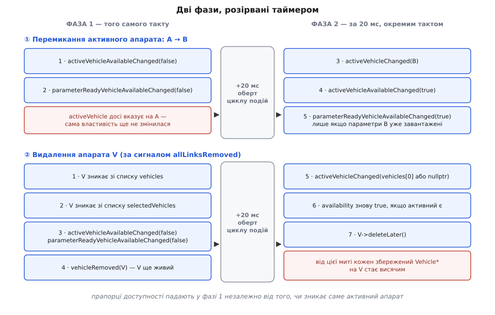

# 🧩 Контракт багатоапаратності: `MultiVehicleManager` і `VehicleLinkManager`

Тут зібрано те, що менеджер багатоапаратності й менеджер каналів апарата віддають назовні — у декларативний інтерфейс і в код розширень: властивості, сигнатури, сигнали і, найважливіше, **порядок**, у якому ці сигнали приходять. Порядок тут не подробиця реалізації, а частина контракту: обидві головні дії розірвані таймером надвоє, і прив'язка, написана без огляду на цей розрив, чудово працює на одному апараті й розсипається на другому.

Сигнатури — з головної гілки джерел станом на час письма: `src/Vehicle/MultiVehicleManager.h`, `src/Vehicle/VehicleLinkManager.h`, `src/Vehicle/Vehicle.h`. Це застосунок із випусками, тож імена звіряйте зі своїм тегом.

## Звідки взяти об'єкт

| Звідки | Вираз |
|---|---|
| декларативний інтерфейс | `QGroundControl.multiVehicleManager` |
| код C++ | `MultiVehicleManager::instance()` |
| канали конкретного апарата | `vehicle.vehicleLinkManager` · `vehicle->vehicleLinkManager()` |

Ім'я `QGroundControl` у першому рядку — не назва застосунку, а зареєстрований синглтон-обгортка (`QML_NAMED_ELEMENT(QGroundControl)` плюс `QML_SINGLETON` на класі `QGroundControlQmlGlobal`), який віддає менеджер звичайною властивістю:

```cpp
Q_PROPERTY(MultiVehicleManager* multiVehicleManager READ multiVehicleManager CONSTANT)
```

Позначка `CONSTANT` тут і всюди далі означає рівно одне: **вказівник** ніколи не змінюється, тож сигналу зміни в нього немає й не буде. Прив'язатися до самого об'єкта можна раз і назавжди — змінюється те, що всередині нього.

## Властивості менеджера багатоапаратності

```cpp
Q_PROPERTY(bool                activeVehicleAvailable         READ activeVehicleAvailable         NOTIFY activeVehicleAvailableChanged)
Q_PROPERTY(bool                parameterReadyVehicleAvailable READ parameterReadyVehicleAvailable NOTIFY parameterReadyVehicleAvailableChanged)
Q_PROPERTY(Vehicle*            activeVehicle                  READ activeVehicle WRITE setActiveVehicle NOTIFY activeVehicleChanged)
Q_PROPERTY(QmlObjectListModel* vehicles                       READ vehicles                       CONSTANT)
Q_PROPERTY(QmlObjectListModel* selectedVehicles               READ selectedVehicles               CONSTANT)
Q_PROPERTY(Vehicle*            offlineEditingVehicle          READ offlineEditingVehicle          CONSTANT)
```

| Властивість | Тип | Запис | Що означає |
|---|---|---|---|
| `vehicles` | `QmlObjectListModel*` | — | усі помічені апарати; порядок появи |
| `selectedVehicles` | `QmlObjectListModel*` | — | підмножина, позначена оператором для групових дій |
| `activeVehicle` | `Vehicle*` | так | єдиний апарат, яким керують прилади й джойстик; може бути `nullptr` |
| `activeVehicleAvailable` | `bool` | — | «активним апаратом зараз можна користуватися» |
| `parameterReadyVehicleAvailable` | `bool` | — | те саме плюс «його параметри вже завантажені» |
| `offlineEditingVehicle` | `Vehicle*` | — | несправжній апарат для редагування плану без з'єднання |

За чотирма рядками цієї таблиці ховається поведінка, якої з короткого опису не видно, а саме вона й ламає прив'язки.

**Обидва списки — `CONSTANT`.** Сигнал `vehiclesChanged` не існує, тож обробник `on…Changed` на них ніколи не спрацює. Реагувати можна двома способами: віддати список у модель подання й далі не думати про нього, або стежити за довжиною — `QmlObjectListModel` успадковує `Q_PROPERTY(int count READ count NOTIFY countChanged)`. У делегаті сам об'єкт приходить роллю `object`.

**`activeVehicleAvailable` — це не `activeVehicle !== null`.** Прапорець падає в `false` **раніше**, ніж змінюється сам вказівник, і саме заради цього розриву він і заведений: інтерфейс за ним знімає прив'язки, поки старий об'єкт іще живий і цілий.

**`parameterReadyVehicleAvailable` — окремий, суворіший прапорець.** Він стає `true` лише тоді, коли в активного апарата є [менеджер параметрів](topic:sys-dron/parameter-manager) із завантаженою таблицею — той тримає кеш параметрів апарата й повідомляє про готовність окремим сигналом. Усе, що читає параметри, мусить чекати саме цей прапорець, а не `activeVehicleAvailable`: на повільному радіоканалі між ними хвилини.

**`offlineEditingVehicle` існує завжди.** Це [порожній об'єкт](topic:sf-apps/null-object) у чистому вигляді — повноцінний апарат без жодного каналу, який позбавляє решту коду розсипу перевірок на `nullptr`. Створюється він двома сторожовими значеннями, що навмисно лежать за межами перелічень MAVLink:

```cpp
static const MAV_AUTOPILOT MAV_AUTOPILOT_TRACK = MAV_AUTOPILOT_ENUM_END;
static const MAV_TYPE      MAV_TYPE_TRACK      = MAV_TYPE_ENUM_END;

_offlineEditingVehicle = new Vehicle(Vehicle::MAV_AUTOPILOT_TRACK, Vehicle::MAV_TYPE_TRACK, this);
```

Значення `TRACK` читається як «стеж за налаштуваннями офлайнового редагування»: тип і прошивку цей апарат бере не з ефіру, а з того, що оператор вибрав у налаштуваннях плану.

## Методи

```cpp
Q_INVOKABLE Vehicle *getVehicleById(int vehicleId) const;
Q_INVOKABLE void     selectVehicle(int vehicleId);
Q_INVOKABLE void     deselectVehicle(int vehicleId);
Q_INVOKABLE void     deselectAllVehicles();

void setActiveVehicle(Vehicle *vehicle);   // не Q_INVOKABLE: із QML — присвоєнням властивості
```

| Виклик | Повертає | Поведінка |
|---|---|---|
| `getVehicleById(id)` | `Vehicle*` або `nullptr` | лінійний обхід списку зі звірянням `vehicle->id()` |
| `selectVehicle(id)` | — | ідемпотентний: уже вибраного не додає вдруге |
| `deselectVehicle(id)` | — | немає такого — мовчки нічого не робить |
| `deselectAllVehicles()` | — | очищає список вибраних цілком |
| `setActiveVehicle(v)` | — | **асинхронний**; при `v == activeVehicle` не робить нічого |

`id` в усіх цих викликах — це номер системи MAVLink, і властивість `Q_PROPERTY(int id READ id CONSTANT)` в апарата теж `CONSTANT`: у межах життя об'єкта номер незмінний. Пошуку за індексом чи за іменем каналу немає — тільки за номером.

`selectVehicle` кладе в список результат `getVehicleById` **без перевірки на `nullptr`**. Номер, узятий не зі списку апаратів, а звідкись іще, потрапляє в модель вибраних порожнім вказівником, а наступна ж перевірка «чи вибраний» розіменовує його. Передавайте лише той `id`, який щойно прочитали з `vehicles`. (Твердження — з читання джерел головної гілки; поведінка вузька й може бути залатана.)

`setActiveVehicle` **не набирає чинності негайно**. Прочитаний одразу після присвоєння, `activeVehicle` усе ще віддає старий апарат: нове значення стає на місце через двадцять мілісекунд, окремим тактом.

## Сигнали

```cpp
void vehicleAdded(Vehicle *vehicle);
void vehicleRemoved(Vehicle *vehicle);
void activeVehicleChanged(Vehicle *activeVehicle);
void activeVehicleAvailableChanged(bool activeVehicleAvailable);
void parameterReadyVehicleAvailableChanged(bool parameterReadyVehicleAvailable);
```

| Сигнал | Коли | Стан об'єкта в обробнику |
|---|---|---|
| `vehicleAdded(v)` | після додавання в `vehicles` | `v` живий, уже в списку, підписки менеджера вже зроблені |
| `vehicleRemoved(v)` | одразу після викидання зі списку | `v` **іще живий**; його вже немає ні в `vehicles`, ні в `selectedVehicles` |
| `activeVehicleChanged(v)` | у другій фазі перемикання | `v` — новий активний або `nullptr` |
| `activeVehicleAvailableChanged` | по краях розриву | див. порядок нижче |
| `parameterReadyVehicleAvailableChanged` | те саме плюс окремо, коли параметри дочиталися | — |

`vehicleAdded` приходить після того, як менеджер уже підписався на потрібні сигнали апарата й додав його в список, — тобто в обробнику апарат повністю споряджений. Це єдина надійна точка, щоб причепити до нового апарата свою підсистему.

`vehicleRemoved` — дзеркальна й теж єдина: об'єкт іще цілий, з нього ще можна прочитати `id()` і будь-який стан, а знищення станеться пізніше. Усе прибирання за апаратом має статися саме тут.

## Порядок сигналів: дві фази, розірвані таймером

І перемикання активного апарата, і видалення апарата розбиті на дві частини з паузою `QTimer::singleShot(20, …)` між ними. Пауза потрібна, щоб елементи інтерфейсу, які відв'язалися в першій фазі, встигли знищитися: їхнє знищення відкладене й стається, коли керування повернеться в [цикл подій](topic:sf-tasks/event-loop) — у ту саму чергу, з якої й спрацює таймер.


*Порядок сигналів для перемикання активного апарата й для видалення апарата. Червоним — те, що в цей момент неправда, хоч виглядає правдою.*

**Перемикання з A на B** (`setActiveVehicle(B)`):

```
такт 0:   activeVehicleAvailableChanged(false)
          parameterReadyVehicleAvailableChanged(false)
          ← activeVehicle усе ще == A
+20 мс:   activeVehicleChanged(B)
          activeVehicleAvailableChanged(true)
          parameterReadyVehicleAvailableChanged(true)   ← лише якщо B->parameterManager()->parametersReady()
```

Якщо активного апарата не було, першої пари сигналів не буде взагалі — код першої фази виконується лише за наявного `_activeVehicle`.

**Видалення апарата V** (запускається сигналом `allLinksRemoved` від менеджера каналів):

```
такт 0:   V викинуто з vehicles
          deselectVehicle(V->id())        ← V викинуто й зі списку вибраних
          activeVehicleAvailableChanged(false)
          parameterReadyVehicleAvailableChanged(false)
          vehicleRemoved(V)               ← V іще живий
+20 мс:   activeVehicleChanged(vehicles[0]) або activeVehicleChanged(nullptr)
          activeVehicleAvailableChanged(true)   ← якщо список не порожній
          V->deleteLater()
```

Зверніть увагу на третій рядок: прапорці доступності падають **незалежно від того, чи видаляють саме активний апарат**. Зникнення третього борта, поки керують першим, усе одно змушує весь інтерфейс відв'язатися й прив'язатися заново — з блиманням на 20 мс. Новим активним завжди береться нульовий елемент списку, а не якийсь «найкращий».

> 🔧 **Навіщо це.** Якщо ваш елемент інтерфейсу під час перемикання апаратів моргає, показує чужі дані на частку секунди або падає на розіменуванні — шукайте причину не в самому перемиканні, а в цих двадцяти мілісекундах. Правило просте: у момент `activeVehicleAvailable == false` вважайте, що активного апарата немає, навіть якщо `activeVehicle` віддає непорожній вказівник. Читати з нього щось у цьому вікні — читати з об'єкта, від якого інтерфейс уже відрікся.

## Менеджер каналів апарата

Об'єкт живе всередині кожного апарата й описує, якими каналами цей апарат чутно. Він же — джерело події «апарат треба прибрати».

```cpp
Q_PROPERTY(QString     primaryLinkName          READ primaryLinkName          WRITE setPrimaryLinkByName        NOTIFY primaryLinkChanged)
Q_PROPERTY(QStringList linkNames                READ linkNames                                                  NOTIFY linkNamesChanged)
Q_PROPERTY(QStringList linkStatuses             READ linkStatuses                                               NOTIFY linkStatusesChanged)
Q_PROPERTY(bool        communicationLost        READ communicationLost                                          NOTIFY communicationLostChanged)
Q_PROPERTY(bool        communicationLostEnabled READ communicationLostEnabled WRITE setCommunicationLostEnabled NOTIFY communicationLostEnabledChanged)
Q_PROPERTY(bool        autoDisconnect           MEMBER _autoDisconnect                                          NOTIFY autoDisconnectChanged)
```

| Властивість | Що в ній |
|---|---|
| `linkNames` | імена налаштувань каналів апарата, у внутрішньому порядку |
| `linkStatuses` | для кожного каналу `"Comm Lost"` або порожній рядок |
| `primaryLinkName` | ім'я каналу, яким ідуть **усі** вихідні повідомлення |
| `communicationLost` | `true` лише коли замовкли **всі** канали |
| `communicationLostEnabled` | вимикач самого механізму стеження за тишею |
| `autoDisconnect` | чи закривати апарат самотужки, коли зв'язок утрачено повністю |

`linkNames` і `linkStatuses` — **паралельні масиви**: індекс `i` в одному відповідає індексові `i` в другому. Обидва щоразу перераховуються з одного й того самого внутрішнього списку, тож прочитана пара завжди узгоджена. Але сповіщення в них **різні**, і це має практичний наслідок: індикатор, що показує стан, мусить прив'язуватися до `linkStatuses`, бо `linkNames` при появі напису «Comm Lost» не змінюється й нічого не оголосить.

Назва сигналу для `primaryLinkName` — `primaryLinkChanged()`, без аргументу й **без слова `Name`**. У C++ підписуватися треба саме на нього; `primaryLinkNameChanged` не існує.

Запис у `primaryLinkName` — прохання, а не замок. Менеджер переобирає головний канал сам — під час секундної перевірки тиші й коли міняється склад каналів, — за сталим порядком переваги: пряме USB без утраченого зв'язку → звичайний канал без утраченого зв'язку → чинний канал високої затримки → будь-який канал високої затримки. Звідки береться ознака високої затримки й чим супутниковий канал відрізняється від радіомодема — у [типах каналів](topic:sys-dron/link-types), де розібрано самі різновиди з'єднань станції.

Сталі, за якими рахується тиша (обидві приватні `static constexpr int`):

```
_commLostCheckTimeoutMSecs = 1000    ← як часто перевіряти
_heartbeatMaxElpasedMSecs  = 3500    ← скільки тиші на каналі = «Comm Lost»
```

У другому імені в джерелах є друкарська помилка (`Elpased`) — зважайте, шукаючи по коду. Для тестів заведено окремі публічні сталі `kTestHeartbeatTimeoutMs = 1500`, `kTestCommLostCheckTimeoutMs = 250` і похідну від них `kTestCommLostDetectionTimeoutMs`; на них спираються модульні тести, щоб не чекати реальних секунд.

Сигнали менеджера каналів:

```cpp
void primaryLinkChanged();
void linkNamesChanged();
void linkStatusesChanged();
void communicationLostChanged(bool communicationLost);
void communicationLostEnabledChanged(bool communicationLostEnabled);
void autoDisconnectChanged(bool autoDisconnect);
void allLinksRemoved(Vehicle *vehicle);
```

Останній — стик між двома менеджерами. Підписку на нього менеджер багатоапаратності робить одразу після народження апарата, і саме цей сигнал запускає видалення:

```cpp
(void) connect(vehicle->vehicleLinkManager(), &VehicleLinkManager::allLinksRemoved,
               this, &MultiVehicleManager::_deleteVehiclePhase1);
```

## Закриття апарата

Апарат прибирають з єдиної точки — `closeVehicle()`, — але заходів до неї три.

| Хто ініціює | Виклик |
|---|---|
| інтерфейс, кнопка «Disconnect» | `vehicle.closeVehicle()` — `Q_INVOKABLE` на самому апараті |
| код C++ | `vehicle->vehicleLinkManager()->closeVehicle()` |
| механізм тиші | сам, коли `communicationLost && autoDisconnect` |

Перший — тонка обгортка: `void Vehicle::closeVehicle() { _vehicleLinkManager->closeVehicle(); }`. Далі однаково для всіх трьох: канали знімаються по одному, список чиститься, обробка команд зупиняється, і оголошується `allLinksRemoved` — звідки вже йдуть ті сім кроків видалення. Що таке сам апарат як об'єкт і що ще в ньому гине разом із ним, розібрано в [моделі апарата](topic:sys-dron/vehicle-object).

Закриття **не заважає апаратові з'явитися знову**: наступне серцебиття з тим самим номером створить новий об'єкт із порожніми параметрами й порожньою місією.

## Мінімальні прив'язки

Чотири типові випадки: прив'язка до активного апарата, до всього списку, групова дія над вибраними й власна підсистема, що живе рівно стільки, скільки апарат.

```qml
// до активного: через прапорець доступності, а не через сам вказівник
QGCLabel {
    property var _v: QGroundControl.multiVehicleManager.activeVehicle
    visible: QGroundControl.multiVehicleManager.activeVehicleAvailable
    text:    visible ? qsTr("Апарат %1 · %2 · %3").arg(_v.id).arg(_v.flightMode)
                            .arg(_v.armed ? qsTr("озброєний") : qsTr("роззброєний"))
                     : qsTr("апарата немає")
}

// до всіх: модель віддається поданню один раз, бо вказівник на неї CONSTANT
Repeater {
    model: QGroundControl.multiVehicleManager.vehicles

    delegate: Rectangle {
        property var  vehicle:  object          // роль моделі — саме "object"
        property bool isActive: QGroundControl.multiVehicleManager.activeVehicle === vehicle

        width:  ScreenTools.defaultFontPixelWidth * 24
        height: ScreenTools.defaultFontPixelHeight * 3
        color:  isActive ? qgcPal.buttonHighlight : qgcPal.button

        QGCLabel {
            anchors.centerIn: parent
            text: qsTr("Апарат %1 · %2").arg(vehicle.id).arg(vehicle.flightMode)
        }

        MouseArea {
            anchors.fill:   parent
            onClicked:      QGroundControl.multiVehicleManager.activeVehicle = vehicle
            onPressAndHold: QGroundControl.multiVehicleManager.selectVehicle(vehicle.id)
        }
    }
}
```

```cpp
// групова дія над вибраними: послідовно, кожному своя команда, без відкоту
MultiVehicleManager *const mvm = MultiVehicleManager::instance();
QmlObjectListModel *const selected = mvm->selectedVehicles();

for (int i = 0; i < selected->count(); i++) {
    Vehicle *const vehicle = qobject_cast<Vehicle*>(selected->get(i));
    if (vehicle) {
        vehicle->setArmed(true, true /* showError */);
    }
}
```

```cpp
// власна підсистема, що живе рівно стільки, скільки апарат
connect(mvm, &MultiVehicleManager::vehicleAdded,   this, &MyWatcher::_attach);
connect(mvm, &MultiVehicleManager::vehicleRemoved, this, &MyWatcher::_detach);

void MyWatcher::_detach(Vehicle *vehicle)
{
    // об'єкт іще живий: id() читається, підписки знімаються, стан зберігається
    _stateById.remove(vehicle->id());
}
```

## Підводні камені

**Об'єкт може зникнути просто під час прив'язки.** Між `vehicleRemoved` і справжнім знищенням — двадцять мілісекунд і один оберт циклу подій. Збережений сирий `Vehicle*` після цієї межі стає висячим, і кожне читання через нього — читання з пам'яті, якої вже немає. У C++ тримайте від апарата лише `id` або підписуйтеся на `QObject::destroyed`; порівнювати збережений вказівник із чинним активним небезпечно — ту саму адресу може вже зайняти інший об'єкт.

**Присвоєння `activeVehicle` не діє одразу.** Рядок `mvm.activeVehicle = v; console.log(mvm.activeVehicle === v)` надрукує `false`. Робіть висновки лише в обробнику `activeVehicleChanged`.

**Два присвоєння поспіль не скасовують одне одного.** Кожен виклик ставить у чергу свій відкладений виклик другої фази, і обидва спрацюють: спершу проміжний апарат, потім останній. Хто підписаний на `activeVehicleChanged`, побачить обидва переходи.

**`activeVehicleAvailable == false` не означає `activeVehicle == nullptr`.** Ці дві величини розходяться саме в ті двадцять мілісекунд, коли їх найлегше сплутати. Перевіряйте прапорець.

**Параметри готові пізніше за апарат.** `activeVehicleAvailable` каже, що апарат є; таблиця параметрів у цю мить може бути порожня. Для будь-якого читання параметрів прапорець інший — `parameterReadyVehicleAvailable`.

**Прапорці падають і на чужому видаленні.** Зникнення будь-якого апарата зі списку кладе доступність у `false` на 20 мс, навіть якщо активним лишається той самий борт. Обробник, який на кожен такий перепад робить щось дороге — перечитує параметри, перебудовує подання, пише в налаштування, — робитиме це щоразу, коли з ефіру пропав хтось сторонній.

**Список вибраних чиститься сам.** Знятий апарат менеджер сам прибирає з `selectedVehicles` у першій фазі видалення. Дублювати це своїм кодом не треба — а от розраховувати, що вибір переживе перезапуск апарата, не можна.

**Багатоапаратності може не бути.** Складання має право вимкнути другий апарат повністю, і тоді `vehicles` ніколи не переросте одного елемента. Код, який ви пишете під станцію, не повинен припускати ні протилежного, ні того, що список апаратів узагалі показують оператору.
