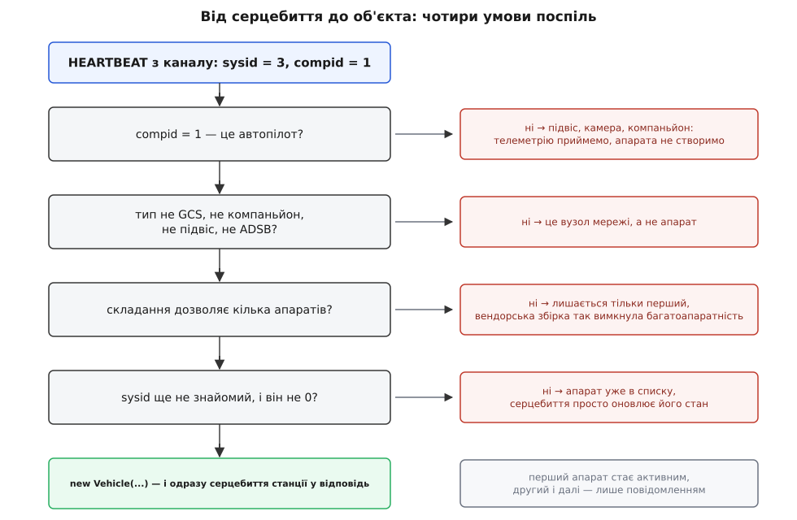
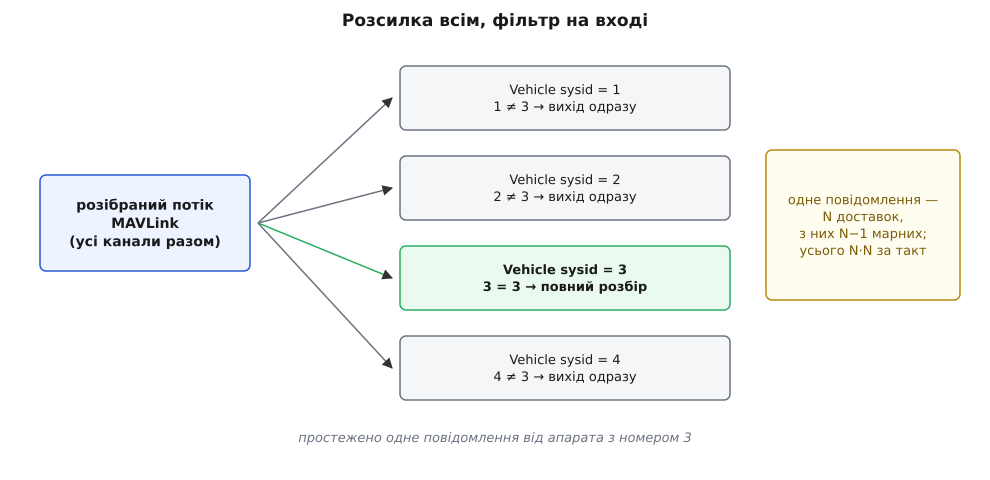
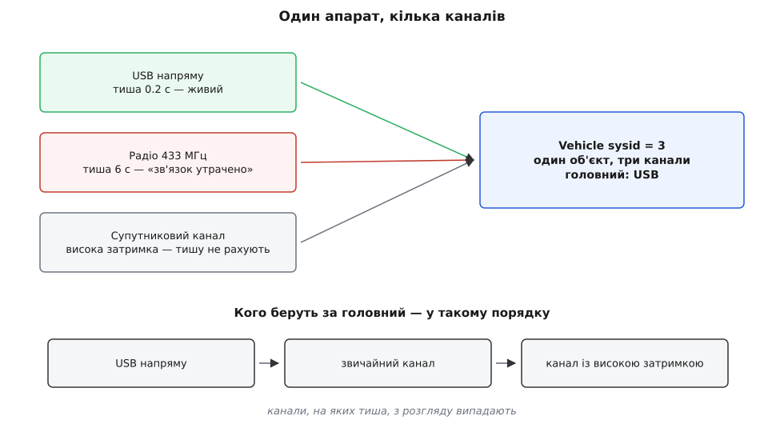
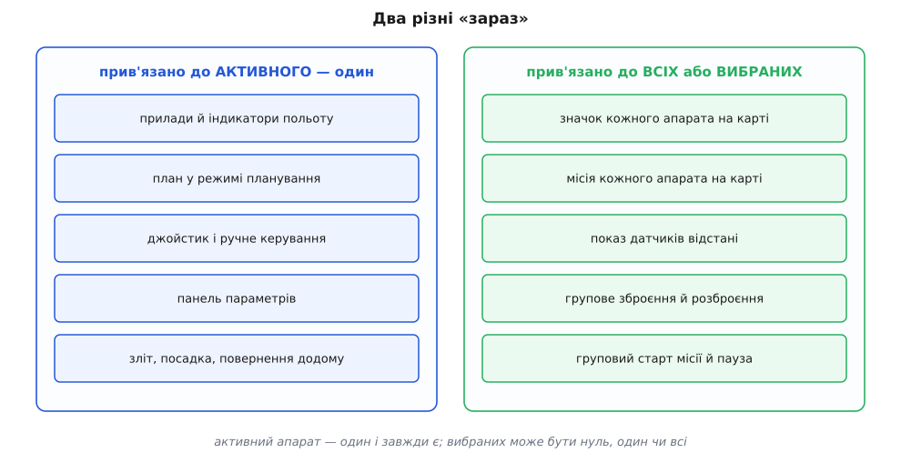

# Кілька апаратів в одному застосунку

<preknowlist>
- [Пакет MAVLink](root:sys-dron/mavlink-packet) — у заголовку кожного пакета стоїть номер системи (sysid) і номер вузла (compid) відправника, а повідомлення HEARTBEAT іде приблизно раз на секунду й означає «я живий».
- [Vehicle: модель апарата всередині застосунку](root:sys-dron/vehicle-object) — об'єкт, який тримає весь стан одного апарата: телеметрію, режими, менеджери параметрів і місій.
- [З чого складається застосунок: шари й запуск](root:sys-dron/app-composition) — ланцюг «канал зв'язку → розбір пакетів → модель апарата → екран».
- [Спостерігач](root:sf-apps/observer) — розсилка події всім підписаним одразу: хто оголошує, хто слухає й чому підписник дізнається про подію незалежно від інших.
</preknowlist>

На землі стоїть ноутбук, у небі — три борти. Радіомодем один, потік байтів один, і в тому потоці немає жодного слова про те, що бортів стало три. Є тільки пакети, а в заголовку кожного — однобайтовий номер системи, який каже, хто це говорить.

З цього однобайтового числа й доводиться будувати все інше. Станція мусить сама помітити, що з'явився новий апарат: ніхто їй про це не доповість. Мусить тримати три незалежні набори стану так, щоб параметри одного борта не потрапили в таблицю другого. І мусить лишити оператору однозначну відповідь на питання «а зараз я керую ким?» — бо прилад висоти показує одну висоту, а джойстик хилить один апарат. Кожна з цих трьох вимог тягне за собою окреме конструктивне рішення, і разом вони пояснюють, чому багатоапаратність у станції виглядає саме так, як виглядає.

## Апарат не реєструється — його помічають

У MAVLink немає сеансу. Апарат не з'єднується зі станцією, не вітається, не питає дозволу — він просто вмикається й починає говорити в ефір, незалежно від того, слухає його хтось чи ні. Отже, у станції немає події «під'єднався апарат», яку можна було б обробити. Єдине, що вона бачить, — потік чужих повідомлень, серед яких раз на секунду трапляється серцебиття з якимось номером.

Тому виявлення тут пасивне: розбирач пакетів після кожного серцебиття оголошує «прийшов пульс від sysid X, вузол Y, автопілот Z, тип апарата T», а окремий менеджер багатоапаратності слухає це оголошення й вирішує, чи народжувати новий об'єкт. Це та сама ідея, що й [виявлення сервісів](root:sf-distributed/service-discovery) через самооголошення, тільки зведена до мінімуму: жодного реєстру, жодного підтвердження, лише «я тут» раз на секунду.

Рішення народжувати чи ні складається з чотирьох перевірок поспіль, і порядок у них не випадковий.


*Шлях від пакета до об'єкта. Кожна умова відсіює свій клас відправників, і те, що не пройшло, лишається просто телеметрією — станція його чує, але апаратом не вважає.*

**Перша перевірка — це автопілот?** Номер вузла має дорівнювати одиниці: у MAVLink `MAV_COMP_ID_AUTOPILOT1` — саме 1. Під одним номером системи живе цілий гурт вузлів: підвіс, камера, бортовий комп'ютер, і кожен з них теж шле власне серцебиття зі своїм типом і своїм автопілотом. Без цієї умови об'єкт апарата міг би народитися від того, хто заговорив першим, і успадкувати від підвісу тип «підвіс» замість «квадрокоптер» — а від типу апарата залежить усе далі: набір польотних режимів, вигляд приладів, доступні команди.

**Друга — це взагалі апарат?** Типи `MAV_TYPE_GCS`, `MAV_TYPE_ONBOARD_CONTROLLER`, `MAV_TYPE_GIMBAL`, `MAV_TYPE_ADSB` відкидаються прямо. Найпромовистіший тут перший: інша наземна станція в тій самій мережі теж шле серцебиття, і теж зі своїм номером системи. Без цього рядка два ноутбуки, під'єднані до одного UDP-порту, побачили б один одного як «апарати» й слухняно намалювали б значки на карті.

**Третя — а чи дозволено взагалі мати другий апарат?** Прапорець належить ядровому розширенню, і вендорська збірка може вимкнути багатоапаратність повністю: тоді після першого апарата всі інші серцебиття мовчки ігноруються. Виробник, який продає станцію разом зі своїм дроном, часто саме цього й хоче — щоб чужий борт у тому ж ефірі не з'являвся на екрані. Як складання перевизначає таку поведінку, розібрано в [ядровому розширенні](root:sys-dron/core-plugin).

**Четверта — цей номер уже знайомий?** Якщо об'єкт із таким sysid уже є, серцебиття просто оновлює його стан. Номер нуль відкидається окремо: у MAVLink нуль в адресному полі означає «всім», тож джерелом він бути не може.

Після всіх чотирьох умов створюється об'єкт апарата й додається у список, а станція негайно, не чекаючи свого секундного таймера, відповідає власним серцебиттям. Причина записана коментарем прямо в коді: PX4 починає приймати команди лише тоді, коли чує наземну станцію в ефірі. Далі — маленька, але важлива деталь поведінки: активним новий апарат стає **тільки якщо він перший**. Другий і всі наступні дають лише повідомлення «під'єднано апарат 2» у стрічці, і жоден з них не перехоплює екран. Уявіть протилежне: оператор веде посадку, у ефір влітає чужий борт — і прилади перед очима раптом починають показувати не той апарат.

Є в цьому каскаді й слід реального життя. Свіжопрошитий ArduCopter не має заданого класу рами й тому оголошує себе типом `MAV_TYPE_GENERIC` — тобто «щось». Станція в цьому єдиному випадку (автопілот ArduPilot плюс невідомий тип) припускає квадрокоптер, аби показати хоч якісь осмислені прилади. Це не принцип, а свідомий підпір під конкретну ваду прошивки, і в коді він так і підписаний.

## Число, за яким усе тримається

Тотожність апарата в станції — це його номер системи, і більше нічого. Не серійник, не адреса, не канал — однобайтове число від 1 до 255. Усе, що станція далі робить із апаратом, спирається на збіг цього числа.

Звідси випливає незручна властивість. І PX4 (параметр `MAV_SYS_ID`), і ArduPilot (`SYSID_THISMAV`, у новіших випусках перейменований на `MAV_SYSID`) із коробки віддають номер 1. Два дрони, узяті зі складу й увімкнені поруч, — це два «апарати номер один». Станція побачить **один** об'єкт, у який зіллються обидва потоки телеметрії: координата стрибатиме між двома точками, заряд батареї мигатиме між двома значеннями, а запит параметрів отримає відповіді від обох бортів упереміш і складе з них таблицю, якої немає в жодного.

Найгірше тут те, що станція не може цього виявити. На рівні протоколу два однакові номери виглядають **точно** як один апарат, що суперечить сам собі, — жодного сигналу «тут конфлікт» у потоці немає. Тому й ліки не програмні, а організаційні: номери роздають до вильоту, і роздають людина або скрипт розгортання.

Дзеркальний випадок конфлікту станція таки ловить, бо в неї є власний номер — за замовчуванням 255, той самий діапазон 1–255, налаштування `gcsMavlinkSystemID`. Коли серцебиття приходить із номером, що дорівнює номеру самої станції, вона показує попередження «апарат використовує той самий номер системи, що й QGroundControl» — і все одно створює об'єкт. Тобто це попередження, а не заборона. Ламається ж від такого збігу ось що: усі вихідні повідомлення станції несуть 255 як номер **відправника**, і будь-який учасник, що розкладає трафік за номерами — ретранслятор, друга станція, роутер MAVLink, — більше не відрізняє команду станції від телеметрії апарата. А там, де потік повертається до станції (широкомовний UDP, увімкнена пересилка), об'єкт апарата з номером 255 почне приймати за телеметрію апарата власні ж повідомлення станції.

> 🔧 **Навіщо це.** Перед груповим вильотом номери систем роздають так само уважно, як позивні: `MAV_SYS_ID` = 1, 2, 3… і жодного 255. Якщо на екрані апарат «смикається» між двома точками або таблиця параметрів після завантаження виглядає безглуздо — перше, що варто перевірити, це не радіозв'язок, а чи не злетіли два борти з однаковим номером. Станція про такий збіг не скаже нічого.

## Чому кілька апаратів узагалі можливі

Багатоапаратність у застосунку тримається не на якомусь окремому механізмі, а на відсутності одного: у ньому немає глобального стану апарата.

Усе, що стосується конкретного борта, належить його власному об'єкту й живе рівно стільки, скільки живе цей об'єкт: [менеджер параметрів](root:sys-dron/parameter-manager) із власним кешем і власним станом завантаження, менеджери місії, геозони й точок збору, менеджер каналів цього апарата, менеджер камер, клієнт передавання файлів, контролер підвісу, стан підпису повідомлень. Жоден з них не одинак. Саме тому другий апарат нічого не псує першому: він просто отримує свій комплект.

Перевірити цю думку легко від протилежного. Якби кеш параметрів був один на застосунок, то другий борт, дозавантажуючи свої параметри, потихеньку затирав би значення першого — і оператор, відкривши налаштування, побачив би суміш двох машин без жодної ознаки, що щось не так. Те саме з місією: спільний контролер плану означав би, що вивантаження маршруту на другий апарат стерло б маршрут першого з екрана.

Глобальним лишилося тільки те, що глобальним і є насправді: налаштування застосунку, кеш тайлів карти, розбирач пакетів і [менеджер каналів](root:sys-dron/link-manager) — канали належать застосунку, а не апарату, бо один канал може вести до кількох апаратів.

> 🔧 **Навіщо це.** Коли ви додаєте до станції свою підсистему — свій індикатор, свій протокол, свій журнал, — питання «одинак чи поле в об'єкті апарата» вирішується одним критерієм: цей стан описує **конкретний борт**? Якщо так, він мусить жити в об'єкті апарата, навіть якщо ви абсолютно впевнені, що апарат у вашому застосуванні буде один. Одинак тут ламається не одразу, а в момент, коли хтось під'єднає другий борт — і зламається тихо.

## Розсилка всім і фільтр на вході

Об'єкти апаратів є, повідомлення надходять — лишається доставити кожне повідомлення тому, кому воно належить. Тут станція обирає найпростіше з можливого: маршрутизації як окремого механізму немає взагалі.

Розбирач пакетів оголошує кожне розібране повідомлення одним сигналом, і на цей сигнал підписані **всі** об'єкти апаратів одразу. Кожен отримує кожне повідомлення й сам вирішує, чи його це.

```cpp
void Vehicle::_mavlinkMessageReceived(LinkInterface* link, mavlink_message_t message)
{
    if (message.sysid != _systemID && message.sysid != 0) {
        // We allow RADIO_STATUS messages which come from a link the vehicle is using to pass through and be handled
        if (!(message.msgid == MAVLINK_MSG_ID_RADIO_STATUS && _vehicleLinkManager->containsLink(link))) {
            return;
        }
    }

    // We give the link manager first whack since it it reponsible for adding new links
    _vehicleLinkManager->mavlinkMessageReceived(link, message);
    ...
```

Три рядки умови варті уваги кожен. Збіг номера — головний критерій. Нуль пропускають, бо це широкомовна адреса: повідомлення, адресоване всім, стосується й цього апарата. А виняток для `RADIO_STATUS` — плата за фізику: [наземний радіомодем](root:cat-hw-connect/fpv-telemetry-ground) доповідає про якість радіоканалу від **свого** імені, зі своїм номером системи, і за загальним правилом його доповідь відкинув би кожен апарат. Але рівень сигналу описує канал, на якому висить конкретний борт, тому повідомлення пропускають туди, чий канал збігся.

Другий рівень відсіву працює вже всередині об'єкта: більшість обробників телеметрії починається з порівняння `message.compid != _defaultComponentId` і мовчки виходить, якщо номер вузла не той. Це те, що не дає підвісу з тим самим sysid підмінити собою дані автопілота. Поглиблено про обидва рівні — у [маршрутизації за sysid і compid](root:sys-dron/message-routing).

Схема гранично проста, але не безкоштовна.


*Кожне повідомлення доставляється всім об'єктам, а не одному. Корисна доставка завжди одна, решта завершується першим порівнянням — і зростає ця «решта» як квадрат кількості апаратів.*

**Умова: п'ять апаратів, кожен віддає 100 повідомлень за секунду.**

```
апаратів N                    = 5
повідомлень від одного        = 100 /с
надходить у застосунок        = 5 · 100      = 500 /с
доставок в об'єкти            = 500 · 5      = 2500 /с
з них корисних                                = 500 /с
відкинуто першим порівнянням  = 2500 − 500   = 2000 /с
частка марних доставок        = 2000 / 2500  = 80 %
```

Оцінімо ціну. Виклик підписника з порівнянням і поверненням коштує порядку 50 нс — це оцінка порядку, не вимір:

```
2000 · 50 нс = 100 мкс за секунду ≈ 0.01 % одного ядра
```

Тобто ніщо. Але залежність квадратична, бо росте і число джерел, і число одержувачів:

```
N = 50:  доставок = 50 · (50 · 100) = 250000 /с
         марних   ≈ 245000 /с
         ціна     ≈ 245000 · 50 нс  ≈ 12 мс/с ≈ 1.2 % ядра
```

Навіть на п'ятдесяти апаратах це відсоток ядра — прикро, але не смертельно. Висновок звідси не «схема погана», а «схема обрана під свій масштаб»: станція розрахована на одиниці бортів під одним оператором, і на такому N простота розсилки перемагає будь-яку економію. Як виглядав би обхідний варіант із таблицею «номер → об'єкт», що він насправді дає й де перестає допомагати, розібрано разом із кодом і вимірами в [окремому розборі вартості доставки](root:sys-dron/multi-vehicle/proj-vehicle-lookup.md).

## Один апарат, кілька каналів

Оскільки тотожність апарата — це номер, а не дріт, зв'язок між апаратом і каналом виходить вільним у обидва боки. Один канал може вести до кількох апаратів: усі борти рою сидять на одному UDP-порту через наземний роутер. І один апарат може бути чутний на кількох каналах одночасно: USB-кабель на столі перед вильотом, радіомодем у польоті, супутниковий канал як запасний.

Виявляється це так само пасивно, як і сама поява апарата: перше ж повідомлення з цим номером, що прийшло новим каналом, додає канал до списку каналів цього апарата. Ніякого оголошення «тепер я ще й тут» апарат не робить, бо в протоколі й нема чим його зробити.


*Кожен канал має власний лічильник тиші й власний стан. Апарат уважається втраченим лише тоді, коли замовкли всі канали, а команди йдуть завжди рівно одним — головним.*

Менеджер каналів апарата тримає на кожен канал три речі: сам канал, прапорець «зв'язок утрачено» й таймер від останнього повідомлення. Раз на секунду він обходить список: канал, що мовчить довше за 3500 мс, позначається як утрачений. Канали з високою затримкою з цієї перевірки виключені — супутниковий може законно мовчати хвилинами, і рахувати йому тишу немає сенсу. Коли каналів більше за один, голосове сповіщення уточнює, який саме замовк: «Vehicle 3 communication lost on primary link» — номер апарата в озвучку підставляється лише тоді, коли апаратів справді кілька.

Вихідний трафік іде **рівно одним** каналом — головним. Інакше апарат отримував би кожну команду двічі й тричі, а механіка підтверджень рахувала б відповіді на власні дублікати. Вибір головного — сходинка з трьох щаблів: пряме USB-з'єднання найкраще, далі звичайний канал, і аж останнім — канал із високою затримкою; канали, на яких тиша, з розгляду випадають. Переобрання стається двічі: коли головний замовк і коли ожив кращий, — і обидва рази оператор чує «switching communication to secondary link». Перехід на канал із високою затримкою й з нього супроводжується явною командою `MAV_CMD_CONTROL_HIGH_LATENCY` з нулем або одиницею: супутниковому модему прямо кажуть замовкнути або заговорити, бо кожен його байт коштує грошей. Про самі різновиди каналів і про те, звідки береться ознака високої затримки, — у [типах каналів](root:sys-dron/link-types).

Повна втрата зв'язку настає тільки тоді, коли втрачені всі канали. І ось що важливо: **втрата зв'язку не видаляє апарат**. Об'єкт лишається живий, з останнім відомим станом — оператор далі бачить, де апарат був востаннє, у якому режимі й з яким зарядом. Це не недогляд: викинути апарат з екрана в момент, коли він найпотрібніший, було б найгіршим з можливих рішень.

Видалення настає з іншої причини — коли з апарата зникли всі канали як такі: канал закрився, кабель висмикнули, або оператор натиснув «Disconnect». До речі, ця кнопка з'являється в панелі лише під час утрати зв'язку, і причина суто механічна: поки серцебиття надходить, закритий апарат відродився б наступної ж секунди тим самим каскадом умов.

## Активний апарат: єдиний вказівник, який лишили

Список апаратів рівноправний, але не все в застосунку вміє бути множинним. Прилад висоти показує одну висоту. Джойстик хилить один борт. Кнопка «злетіти» злітає кимось конкретним. Тому поряд зі списком живе один вказівник — активний апарат.

Перемикання цього вказівника виявляється найтоншим місцем усієї конструкції, і виглядає воно дивно, аж поки не зрозумієш причину:

```cpp
void MultiVehicleManager::setActiveVehicle(Vehicle *vehicle)
{
    if (vehicle != _activeVehicle) {
        if (_activeVehicle) {
            // The sequence of signals is very important in order to not leave Qml elements connected
            // to a non-existent vehicle.

            // First we must signal that there is no active vehicle available. This will disconnect
            // any existing ui from the currently active vehicle.
            _setActiveVehicleAvailable(false);
            _setParameterReadyVehicleAvailable(false);
        }

        QTimer::singleShot(20, this, [this, vehicle]() {
            _setActiveVehiclePhase2(vehicle);
        });
    }
}
```

Чому не можна просто присвоїти новий вказівник? Тому що декларативний інтерфейс тримає живі посилання не лише на сам об'єкт апарата, а й на його підоб'єкти — на менеджер параметрів, на менеджер каналів, на факти телеметрії. Елементи екрана самі підписані на їхні сигнали. Присвоїти новий вказівник одним рухом означає перерахувати всі ці прив'язки в той момент, коли частина з них ще дивиться на старий об'єкт.

Тому спершу оголошується «активного апарата немає» — і інтерфейс за цим сигналом сам знімає прив'язки та вивантажує елементи. Але вивантажені елементи знищуються не миттєво: їхнє знищення відкладене й стається, коли керування повернеться в [цикл подій](root:sf-tasks/event-loop). Саме на це й дано затримку у 20 мс, після якої друга фаза ставить новий активний апарат. Ті самі дві фази й на видаленні: спершу апарат прибирають зі списку й оголошують «апарат зникає», а через 20 мс беруть новим активним нульовий елемент списку й лише тоді знищують об'єкт із відкладенням. Чесно кажучи, 20 мс тут нічого не доводять — це прагматична пауза «дати циклу подій прокрутитися», а не гарантія; вона тримається на тому, що обидві фази йдуть у тому самому потоці, де крутиться інтерфейс (див. [модель потоків](root:sys-dron/threading-model)).

За активним апаратом тягнеться більше, ніж підсвітка. Найпомітніше — [план](root:sys-dron/plan-model): контролер плану на зміну активного апарата відписується від менеджерів місії, геозони й точок збору старого борта, підписується на менеджери нового й перечитує план уже з нього. І тут виникає ситуація, яку не можна розв'язати мовчки: якщо оператор саме редагував маршрут і той не збережений, перемикання апарата знищило б роботу. Тому контролер не вирішує сам, а питає, що робити з наявним планом.

Той самий підхід дає й несподівано елегантну відповідь на питання «а що показувати, коли не під'єднано нікого». Замість розсипу перевірок на порожній вказівник створюється **апарат для офлайнового редагування** — цілком справжній об'єкт апарата, тільки без жодного каналу, з умовним типом. План редагується проти нього, набираючи з нього типові значення й перелік доступних команд. Це прямий наслідок того, що весь стан живе в об'єкті апарата: «апарата немає» дешевше зобразити порожнім апаратом, ніж особливим режимом усього застосунку.

## Вибрані — це не активний

Активний апарат один і завжди є. Але групові дії — озброїти чотири борти, запустити місію на трьох — вимагають чогось іншого, і в застосунку живе **другий** список: вибрані апарати.


*Керування прив'язане до одного апарата, географія — до всіх, групові дії — до вибраних. Три різні відповіді на питання «до кого це стосується».*

Наповнюється список вибраних клацанням по картці апарата в багатоапаратній панелі, і на цю саму панель виводяться картки з номером, компасом, режимом польоту й станом озброєння кожного борта. Групова дія працює найпростішим способом з можливих: обійти список і кожному вибраному відправити свою команду.

Ця простота варта того, щоб її назвати вголос, бо вона визначає межу застосовності. Команди йдуть **послідовно**, кожна власним головним каналом свого апарата, кожна зі своїм підтвердженням і своїми перепитуваннями ([команди MAVLink](root:sys-dron/mavlink-commands)). Ніякої одночасності не гарантовано: між першим і четвертим озброєнням проходять десятки мілісекунд плюс різна затримка каналів. Ніякого відкоту теж немає: якщо третій апарат відмовив у команді, перші два вже озброєні. Тобто це зручність для оператора, а не керування роєм — синхронний старт кількох машин розв'язують на борту, а не в наземному застосунку.

Географію ж застосунок показує без вибірковості. Карта малює значок кожного апарата зі списку, показує датчики відстані кожного й — окремою деталлю, яку легко проґавити — створює контролер плану **на кожен апарат**, щоб на карті лежали маршрути всіх бортів одночасно, а не лише активного. Прилади, індикатори, панель телеметрії та кнопки керування натомість дивляться рівно на активний апарат. Що саме з цього стирчить назовні як властивості й методи, доступні з інтерфейсу й зі свого коду, зібрано в [контракті менеджера багатоапаратності](root:sys-dron/multi-vehicle/api-multivehiclemanager.md).

## Де конструкція протікає

Чесно перелічимо, чим заплачено за цю простоту.

**Апарат не можна прибрати, поки він говорить.** Закриття апарата прибирає канали, але наступне серцебиття створить його заново — тими самими чотирма умовами. Список ігнорованих номерів у менеджері формально є, та в чинному коді його ніхто не наповнює: це слід давнішої поведінки, і покладатися на нього не варто. (Твердження — з читання джерел головної гілки на час письма; у застосунку з випусками таке змінюється.)

**Тотожність не переживає видалення.** Об'єкт прив'язаний до числа, а не до конкретної машини. Борт, який перезавантажився й повернувся з тим самим номером, буде «тим самим» апаратом, лише якщо його об'єкт устиг дожити до повернення. Якщо ні — параметри, місія й геозона завантажаться з нуля, а це на повільному радіоканалі хвилини.

**Багатоапаратності може не бути взагалі.** Вендорська збірка вимикає і саму можливість другого апарата, і показ багатоапаратної панелі окремо. Код, який ви пишете під станцію, не має права припускати, що список апаратів доступний користувачеві.

**Квадратична розсилка.** На одиницях бортів вона невидима, на десятках — помітна у профілі, і це та межа, за якою просту схему довелося б замінювати.

Уся багатоапаратність тут виростає з одного рішення й однієї поступки. Рішення: стан апарата не має глобального дому — жоден менеджер, жоден кеш, жоден контролер не одинак, і тому другий борт нічого не псує першому. Поступка: інтерфейс людини все одно однозначний, тож поверх рівноправного списку лишили єдиний вказівник на активний апарат. Усе решта — пасивне народження з серцебиття, фільтр за номером на вході кожного об'єкта, кілька каналів на один апарат, дві фази перемикання, окремий список вибраних — це вже наслідки, які з цих двох речей виводяться.
