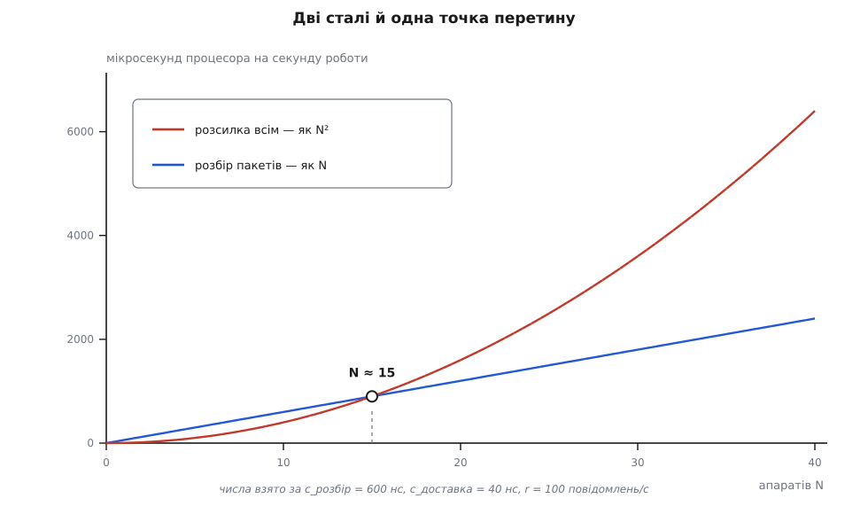
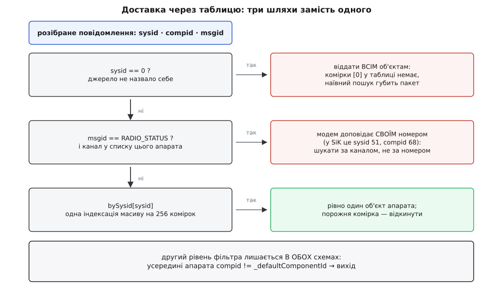

# ⚙️ Що коштує доставка повідомлення, коли бортів кілька

Зберемо обидві схеми доставки робочим кодом — чинну «віддати всім і хай кожен сам відсіється» та її замінник «таблиця номер системи → об'єкт апарата», — зміряємо ціну однієї доставки й вирахуємо число апаратів, після якого заміна перестає бути передчасною. Відповідь виявиться не там, де її шукають: найдорожче в цій схемі не зайвий виклик, а те, що передають у цей виклик.

## Задача

У застосунок заходить один потік розібраних повідомлень. Об'єктів апаратів — N. Кожне повідомлення належить рівно одному з них (майже завжди), а визначити кому — можна за однобайтовим номером системи в заголовку ([пакет MAVLink](root:sys-dron/mavlink-packet) несе номер системи й номер вузла відправника в перших дев'яти байтах).

Є два способи це зробити.

**Розсилка.** Розбирач оголошує повідомлення сигналом, усі N об'єктів підписані, кожен отримує кожне повідомлення й на вході порівнює номер зі своїм. Це [спостерігач](root:sf-apps/observer) у найчистішому вигляді: відправник не знає одержувачів, одержувачі не знають один одного.

**Таблиця.** Диспетчер тримає відповідність «номер системи → об'єкт», бере номер із заголовка, знаходить одного одержувача й віддає повідомлення тільки йому.

Питання не в тому, яка схема гарніша. Питання в двох числах: скільки коштує одна доставка й скільки їх стається за секунду. Перше треба зміряти, друге — порахувати.

## Одна доставка коштує 296 байтів

Почнімо з того, що зазвичай пропускають. Слот, у який приходить повідомлення, оголошений так:

```cpp
void _mavlinkMessageReceived(LinkInterface* link, mavlink_message_t message);
```

Другий параметр — **за значенням**. Це не особливість Qt і не деталь реалізації сигналів: це правило мови. Хоч би як виклик дійшов до цієї функції, аргумент буде скопійовано в її параметр, і копія станеться **до** першого рядка тіла — до порівняння номера, до раннього виходу, до всього.

Скільки це байтів? Структура `mavlink_message_t` з бібліотеки `c_library_v2` виглядає так, і кожне поле в ній обов'язкове:

```
поле                        розмір   зсув
checksum   uint16_t             2      0
magic … compid  7 × uint8_t     7      2
           вирівнювання         3      9
msgid      uint32_t : 24        4     12
payload64  uint64_t[33]       264     16
ck         uint8_t[2]           2    280
signature  uint8_t[13]         13    282
           хвіст до кратності 8  1    295
                              ─────
sizeof(mavlink_message_t)  =  296 байтів
```

Довжина `payload64` не випадкова: `(MAVLINK_MAX_PAYLOAD_LEN + MAVLINK_NUM_CHECKSUM_BYTES + 7) / 8` = `(255 + 2 + 7) / 8` = 33 слова по 8 байтів = 264 байти. Структура завжди носить максимальний можливий корисний вантаж, навіть коли реально в пакеті дев'ять байтів серцебиття. Перевірити на своїй збірці — одним рядком:

```cpp
#include <cstdio>
#include "mavlink/common/mavlink.h"
int main() { printf("%zu\n", sizeof(mavlink_message_t)); }   // 296 на 64-бітній збірці
```

Ось звідки береться справжня ціна. «Три зайві порівняння й вихід» — це насправді **296 байтів пам'яті, скопійованих на кожного підписника, включно з тими N−1, які потім скажуть «не моє»**. Копія маленька й лежить у першому рівні кешу, тож дорогою вона не виглядає — але вона є, і множиться вона на N.

> 🔧 **Навіщо це.** Це перше, що варто перевіряти в будь-якому коді, де подія розсилається багатьом: не «скільки одержувачів», а **що саме кожному передають**. Параметр за значенням у слоті великої структури — типова тиха витрата, бо в оголошенні вона не видно, а в профілі розмазана по всіх одержувачах. Той самий рядок із `const&` не змінює нічого в поведінці й прибирає всю копію.

До копії додається сам виклик. Прямого імені функції тут немає: диспетчер тримає список одержувачів і викликає кожного через збережений вказівник — непрямий виклик, який процесор не передбачить наперед так само добре, як звичайний. Документація Qt оцінює накладні витрати сигналу приблизно в **десять невіртуальних викликів** — це витрати на пошук з'єднань, безпечний обхід списку (з перевіркою, що черговий одержувач не знищений просто зараз) і узагальнене передавання аргументів. *(Твердження з документації Qt; оцінка порядку, не вимір.)*

Складімо оцінку [на серветці](root:sf-apps/back-of-envelope), поки не маємо виміру:

```
копія 296 Б з першого рівня кешу (~32 Б/такт)  ≈ 10 тактів
непрямий виклик + два порівняння + повернення   ≈ 10 тактів
облік з'єднань у диспетчері                     ≈ 10 тактів
─────────────────────────────────────────────────────────
одна доставка                       ≈ 30 тактів ≈ 10 нс при 3 ГГц
```

Десять наносекунд — це ідеалізована нижня межа, коли все гаряче в кеші й нічого не заважає. Реально виходить у кілька разів більше, тож далі братиму **40 нс** як робоче число. Але робоче число — не привід не міряти.

## Обидві схеми, робочим кодом

Мірити доставку прямо в застосунку незручно: там усе змішано з розбором, каналами й інтерфейсом. Зберемо натомість модель, яка повторює саме те, що коштує, — без Qt і без MAVLink, одним файлом, що збирається чим завгодно.

Спершу повідомлення тієї самої ваги й апарат із тим самим фільтром на вході:

```cpp
// dispatch-bench.cpp — c++17
//   g++ -O2 -std=c++17 dispatch-bench.cpp -o dispatch-bench
#include <array>
#include <chrono>
#include <cstdint>
#include <cstdio>
#include <utility>
#include <vector>

constexpr uint32_t MSG_HEARTBEAT    = 0;
constexpr uint32_t MSG_RADIO_STATUS = 109;

// Розкладка поле-в-поле збігається з mavlink_message_t — отже, і вага.
struct Message {
    uint16_t checksum;
    uint8_t  magic, len, incompat_flags, compat_flags, seq, sysid, compid;
    uint32_t msgid : 24;
    uint64_t payload64[(255 + 2 + 7) / 8];
    uint8_t  ck[2];
    uint8_t  signature[13];
};
static_assert(sizeof(Message) == 296, "розкладка розійшлася з mavlink_message_t");

struct Vehicle {
    int         sysid              = 0;
    int         defaultComponentId = 1;      // MAV_COMP_ID_AUTOPILOT1
    const void *link               = nullptr;
    uint64_t    accepted           = 0;

    bool usesLink(const void *l) const { return l == link; }

    void onMessage(const void *l, const Message &m) {
        // Перший рівень: чи взагалі мій номер системи.
        if (m.sysid != sysid && m.sysid != 0) {
            if (!(m.msgid == MSG_RADIO_STATUS && usesLink(l))) {
                return;
            }
        }
        // Другий рівень: чи це автопілот, а не підвіс під тим самим номером.
        // У застосунку ця перевірка стоїть у кожному обробнику окремо.
        if (m.compid != defaultComponentId) {
            return;
        }
        accepted += m.len;                   // «робота» замість справжнього тіла
    }
};
```

Тепер найтонше місце всієї вимірювальної затії. Якщо викликати `onMessage` прямо, компілятор із `-O2` вбудує її в цикл, побачить, що з 296 байтів читаються три, і **викине копію разом із рештою структури** — а ми якраз копію й міряємо. У застосунку викинути її нікому: виклик іде через збережений вказівник, і компілятор у момент компіляції не знає, куди саме. Відтворімо це чесно — списком пар «одержувач + функція», тобто рівно тим, що тримає всередині себе будь-який диспетчер сигналів:

```cpp
using SlotByValue = void (*)(Vehicle *, const void *, Message);
using SlotByRef   = void (*)(Vehicle *, const void *, const Message &);

// Різниця між цими двома функціями — один символ «&» у параметрі.
void slotByValue(Vehicle *v, const void *l, Message m)         { v->onMessage(l, m); }
void slotByRef  (Vehicle *v, const void *l, const Message &m)  { v->onMessage(l, m); }

// ── Схема 1: віддати всім, хай кожен фільтрує сам ────────────────────────
struct FanoutBus {
    std::vector<std::pair<Vehicle *, SlotByValue>> byValue;
    std::vector<std::pair<Vehicle *, SlotByRef>>   byRef;

    void subscribe(Vehicle *v) {
        byValue.emplace_back(v, &slotByValue);
        byRef.emplace_back(v, &slotByRef);
    }
    void deliverByValue(const void *l, const Message &m) {
        for (const auto &c : byValue) { c.second(c.first, l, m); }   // копія кожному
    }
    void deliverByRef(const void *l, const Message &m) {
        for (const auto &c : byRef) { c.second(c.first, l, m); }     // копій нема
    }
};

// ── Схема 2: таблиця «номер системи → об'єкт» ─────────────────────────────
struct TableBus {
    std::array<Vehicle *, 256> bySysid{};    // 256 · 8 Б = 2 КБ, лізе в перший рівень кешу
    std::vector<Vehicle *>     all;          // для того, що адресоване не одному

    void add(Vehicle *v) { bySysid[v->sysid] = v; all.push_back(v); }

    void remove(Vehicle *v) {
        if (bySysid[v->sysid] == v) { bySysid[v->sysid] = nullptr; }
        for (size_t i = 0; i < all.size(); ++i) {
            if (all[i] == v) { all.erase(all.begin() + i); break; }
        }
    }

    void deliver(const void *l, const Message &m) {
        if (m.sysid == 0) {                              // джерело не назвало себе
            for (Vehicle *v : all) { v->onMessage(l, m); }
            return;
        }
        if (m.msgid == MSG_RADIO_STATUS) {               // доповідь модема про канал
            for (Vehicle *v : all) {
                if (v->usesLink(l)) { v->onMessage(l, m); }
            }
            return;
        }
        if (Vehicle *v = bySysid[m.sysid]) { v->onMessage(l, m); }
    }
};
```

Зверніть увагу на розмір таблиці: **256 комірок і жодної більше**. Номер системи — один байт, тобто ключ уже є індексом, і краще за пряме індексування тут не зробить ніщо. [Хеш-таблиця](root:sf-algorithms/hash-table) розв'язує задачу «ключів багато, простір ключів величезний, треба стиснути його в компактний масив» — тут стискати нема чого: досконала геш-функція для однобайтового ключа є, і це тотожність. Два кілобайти вказівників — це [таблиця прямого доступу](root:sf-algorithms/lookup-table), яка вміщається в [перший рівень кешу](root:hw-arch/cache) цілком і не має ні колізій, ні перебору ланцюжків, ні перебудови при зростанні.

І прогін:

```cpp
template <class Dispatch>
double nsPerMessage(Dispatch dispatch, const std::vector<Message> &stream, int rounds) {
    using clock = std::chrono::steady_clock;
    const auto t0 = clock::now();
    for (int r = 0; r < rounds; ++r) {
        for (const Message &m : stream) { dispatch(m); }
    }
    const double ns = std::chrono::duration<double, std::nano>(clock::now() - t0).count();
    return ns / (double(rounds) * double(stream.size()));
}

int main() {
    static const int radioLink = 0;          // один канал на всіх, як наземний модем
    const void *link = &radioLink;

    for (int N : {1, 2, 5, 10, 20, 50}) {
        std::vector<Vehicle> vehicles(size_t(N));
        FanoutBus fan;
        TableBus  tab;
        for (int i = 0; i < N; ++i) {
            vehicles[size_t(i)].sysid = i + 1;
            vehicles[size_t(i)].link  = link;
            fan.subscribe(&vehicles[size_t(i)]);
            tab.add(&vehicles[size_t(i)]);
        }

        std::vector<Message> stream(1024);   // потік від усіх N апаратів упереміш
        for (size_t i = 0; i < stream.size(); ++i) {
            stream[i].sysid  = uint8_t(1 + int(i) % N);
            stream[i].compid = 1;
            stream[i].msgid  = MSG_HEARTBEAT;
            stream[i].len    = 9;
        }

        const double a = nsPerMessage([&](const Message &m) { fan.deliverByValue(link, m); }, stream, 4000);
        const double b = nsPerMessage([&](const Message &m) { fan.deliverByRef  (link, m); }, stream, 4000);
        const double c = nsPerMessage([&](const Message &m) { tab.deliver       (link, m); }, stream, 4000);
        printf("N=%3d   всім, копія %7.1f нс   всім, посилання %7.1f нс   таблиця %6.1f нс\n",
               N, a, b, c);
    }
}
```

Числа тут навмисно не наведені: вони належать вашій машині, вашому компілятору й вашому рівню оптимізації, а не статті. Наведена **форма** результату, і саме за нею перевіряють, чи вимір узагалі відбувся. Перша колонка мусить рости приблизно лінійно з N; друга — теж лінійно, але з помітно меншим нахилом; третя — стояти майже на місці. Якщо перші дві колонки збіглися, копію все-таки викинули: збирайте без міжмодульної оптимізації або гляньте на асемблер. Якщо третя колонка теж поповзла вгору — ви міряєте не диспетчер, а обхід масиву `stream`, і його треба зменшити, щоб він лишався в кеші. Про те, як не наміряти власного вимірювального приладу, — у [профілюванні](root:sf-release/profiling).

## N² проти N

Тепер підрахунок, який не залежить від машини. Нехай кожен апарат віддає `r` повідомлень за секунду.

```
надходить у застосунок           = N · r
доставок у схемі «всім»          = N · r · N = N² · r
з них по суті                    = N · r
доставок у схемі «таблиця»       = N · r  (плюс одна індексація на повідомлення)
```

Квадрат тут береться з двох різних місць одразу, і в цьому вся суть: більше апаратів — це і **більше джерел**, і **більше одержувачів** на кожне повідомлення. Одна лінійність множиться на другу. Це та сама [квадратична залежність](root:computability/asymptotic-complexity), яку зазвичай ловлять у вкладених циклах, тільки тут зовнішній цикл — це час, а не код.

Підставмо `r` = 100 повідомлень/с (звичайний набір потоків телеметрії), ціну доставки 40 нс і ціну табличної індексації 3 нс:

| N | приходить, /с | доставок «всім» | марних | ціна «всім» | ціна «таблиця» |
|---|---|---|---|---|---|
| 2 | 200 | 400 | 200 | 16 мкс/с | 8.6 мкс/с |
| 5 | 500 | 2 500 | 2 000 | 100 мкс/с | 22 мкс/с |
| 10 | 1 000 | 10 000 | 9 000 | 400 мкс/с | 43 мкс/с |
| 20 | 2 000 | 40 000 | 38 000 | 1.6 мс/с | 86 мкс/с |
| 50 | 5 000 | 250 000 | 245 000 | 10 мс/с | 215 мкс/с |
| 100 | 10 000 | 1 000 000 | 990 000 | 40 мс/с | 430 мкс/с |
| 255 | 25 500 | 6 502 500 | 6 477 000 | 260 мс/с | 1.1 мс/с |

Остання колонка майже не росте, бо вона лінійна; передостання росте квадратично й на теоретичній стелі протоколу (255 номерів) з'їдає чверть ядра.

Але «чверть ядра» — погана мірка: вона нічого не каже про те, коли саме починати непокоїтися. Мірка краща — порівняти розсилку з тим, що вже й так робиться на кожному повідомленні. Розбір пакета — теж витрата: стан-машина проходить байт за байтом, накопичуючи контрольну суму, і на пакеті в кілька десятків байтів це сотні наносекунд. Позначмо ціну розбору `c_розбір`, ціну доставки `c_доставка`:

```
розбір     = N · r · c_розбір        ← лінійно: більше джерел
розсилка   = N · r · N · c_доставка  ← квадратично: ще й більше одержувачів
рівність   при  N = c_розбір / c_доставка
```

Потік `r` скорочується — і поріг виявляється **відношенням двох сталих, які ви зміряли**, і більше нічим. При `c_розбір` ≈ 600 нс і `c_доставка` ≈ 40 нс це N ≈ 15.


*До точки перетину розсилка коштує менше, ніж сам розбір, — тобто ховається в тіні роботи, яку однаково доводиться робити. Після неї вона стає найдорожчою ланкою конвеєра, і далі відрив росте як квадрат.*

Ось відповідь у зручному вигляді: **поки апаратів менше, ніж відношення ціни розбору до ціни доставки, розсилка нічого не коштує** — вона дешевша за роботу, від якої не втекти. Для типових чисел це десь півтора десятка бортів.

## Три пробоїни наївної таблиці

Перш ніж міняти, треба знати, чого таблиця не вміє. Заміна «розіслати всім» на `vehicles[m.sysid]` у три рядки — саме той випадок, коли код працює на столі й ламається в полі.


*Таблиця відповідає лише на питання «кому», і відповідає неповно: два класи повідомлень своєї комірки не мають узагалі. Фільтр за номером вузла живе рівнем нижче й від вибору схеми не залежить.*

**Пробоїна перша: номер нуль.** Умова в застосунку пропускає повідомлення з `sysid == 0` кожному апарату — нуль у MAVLink означає «всім», і джерело з таким номером фактично не назвало себе. У таблиці комірки з індексом 0 не буде ніколи, бо жоден апарат не може мати такий номер. Наївний пошук поверне порожньо, і повідомлення зникне мовчки — без помилки, без запису в журнал, без жодної ознаки. Тому широкомовний випадок мусить стояти **перед** пошуком і йти окремою гілкою — розсилкою всім, як раніше.

**Пробоїна друга: доповідь модема.** `RADIO_STATUS` описує якість радіоканалу, і шле його не апарат, а [наземний радіомодем](root:cat-hw-connect/fpv-telemetry-ground) — від свого імені, зі своїм номером системи. Прошивка SiK історично говорить із номером системи 51 і номером вузла 68 *(усталена, широко засвідчена поведінка цієї родини модемів; для нашої задачі важливо лише те, що номер — не апаратів)*. Комірки 51 у таблиці немає, бо об'єкта з таким номером теж немає, — і індикатор рівня сигналу просто згасне. Правильний ключ тут інший: доповідь стосується **каналу**, тож шукати треба серед апаратів, у чиєму списку цей канал є. Це вже не пряма індексація, а перебір — але оскільки таких повідомлень одиниці за секунду, перебір нічого не коштує.

Разом ці дві гілки означають неприємну річ: **квадратичність нікуди не зникає, вона лише перестає стосуватися звичайного трафіку**. Широкомовні повідомлення й доповіді каналів як ішли всім, так і йдуть. Просто їх одиниці на секунду проти сотень звичайних, тож понад 99 % потоку тепер бере швидкий шлях — і саме ці 99 % ми й рахували.

**Пробоїна третя: таблицю треба тримати правдивою.** Розсилка тут має перевагу, яку легко не помітити: коли об'єкт помирає, диспетчер сигналів **сам** прибирає його зі списку одержувачів — це робить каркас, і забути про це неможливо. Таблиця цю роботу забирає собі. Апарат народжується — комірку треба заповнити; апарат зникає — комірку треба звільнити, і звільнити **до** того, як об'єкт перестане існувати.

Вікно небезпеки тут цілком конкретне. Об'єкт апарата знищується з відкладенням: його прибирають зі списку, а справжнє знищення стається пізніше, коли керування повернеться в [цикл подій](root:sf-tasks/event-loop). Між цими двома моментами вказівник у таблиці ще існує — і якщо між ними встигне прийти повідомлення з тим самим номером, диспетчер викличе метод на об'єкті, який уже нічий. Ліки прості, але їх треба свідомо застосувати: очищати комірку **синхронно, у тому самому місці**, де апарат прибирають зі списку, а не в деструкторі.

**І те, чого таблиця не робить узагалі.** Фільтр за номером вузла — `message.compid != _defaultComponentId` на початку обробників — лишається **в обох схемах без жодної зміни**. Таблиця відповідає тільки на питання «який апарат», а всередині одного апарата під одним номером системи живуть автопілот, підвіс, камера, бортовий комп'ютер, і розрізняти їх однаково доводиться. Хто чекає, що таблиця прибере й цю перевірку, плутає два різні рівні адресації — про обидва разом є [маршрутизація за sysid і compid](root:sys-dron/message-routing).

## Найдешевше — не таблиця

Тепер складімо все докупи, і висновок вийде не той, з якого зазвичай починають.

Порівняння в мірилі має три колонки, а не дві, і середня — найцікавіша. Заміна `mavlink_message_t message` на `const mavlink_message_t& message` в оголошенні слота прибирає **всю** копію 296 байтів на кожного одержувача, не чіпаючи ані архітектури, ані поведінки, ані жодного іншого файлу. Квадратичність лишається — але множник при N² падає в рази, бо з трьох доданків оцінки зникає найбільший. Одна правка, нуль нового ризику, і поріг з формули `N = c_розбір / c_доставка` відсувається настільки, наскільки подешевшала доставка.

Застереження одне, і його треба назвати: це допомагає, лише коли виклик прямий. Якщо розбирач і об'єкти апаратів опиняються в різних потоках, каркас не викликає слот одразу, а кладе виклик у чергу приймача — і тоді аргумент копіюється в купу **окремою копією на кожного одержувача**, плюс виділення пам'яті на кожну. Тип параметра там уже нічого не вирішує. Чи так у конкретній збірці, видно з [моделі потоків](root:sys-dron/threading-model), і це перше, що варто з'ясувати перед будь-якою правкою: у чергованому випадку саме виділення пам'яті, а не копія, стає головною статтею витрат, і лікується воно не `const&`, а зменшенням числа одержувачів — тобто якраз таблицею.

## Коли ж міняти

Складімо всі три числа в одне правило.

Заміна **не окупається**, поки апаратів менше за `c_розбір / c_доставка` — для типових вимірів це близько п'ятнадцяти. До цієї межі розсилка ховається в тіні розбору, і вся вигода від таблиці — частки відсотка ядра, куплені за три нових гілки коду, нову інваріанту «таблиця відповідає списку» й нове вікно, у якому можна лишити мертвий вказівник. Це рівно та ціна, через яку [ранню оптимізацію](root:sf-apps/premature-optimization) й називають злом: платиш складністю зараз, за виграш, якого не видно в профілі.

Заміна **окупається** у трьох випадках, і всі три однакові по суті — у них великий добуток `N² · r`. Перший: апаратів справді десятки — ретранслятор, роутер MAVLink, оглядач рою. Другий: `r` високий — повна телеметрія на 50 Гц замість звичайних потоків множить усе на кілька разів і зсуває поріг униз пропорційно. Третій, найковарніший: **відтворення журналу телеметрії на прискореній швидкості**. Там `r` більший у десятки разів за реальний, і квадратичний доданок б'є на кількості бортів, за якої наживо він не помітний.

І порядок дій, який випливає з усього підрахунку, зворотний до звичного. Спершу — зміряти дві сталі й підставити у відношення: без цих двох чисел рішення приймати нема на чому. Потім — прибрати копію, бо це один символ і найбільший доданок ціни. І аж потім, якщо `N` таки перевалив за поріг, — таблиця, разом з усіма трьома її пробоїнами, узятими свідомо, а не виявленими в полі.

Варто знати й те, що таблиця в застосунку вже наполовину напрошується сама. Пошук апарата за номером там існує — і зроблений він прямим перебором списку. На жменьці бортів перебір нічим не гірший за індексацію, а вживається він рідко, тож ніхто його й не чіпав. Але це готове місце, куди таблиця лягає без жодного нового поняття: та сама відповідь на те саме питання, тільки за один такт замість обходу.
