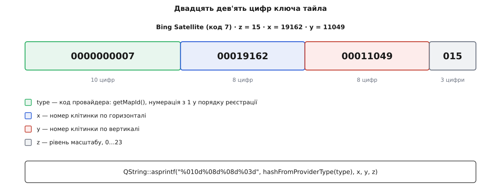

# 🗄 Схема `qgcMapCache.db`: таблиці, індекси, сталі, запити

Це структурна довідка про файл, у якому станція тримає всі свої тайли: чотири таблиці стовпець за стовпцем, розшифровка числових полів `state` і `type`, перелік індексів із запитом, який кожен обслуговує, сталі схеми — і набір готових запитів `sqlite3`, якими власний кеш можна перерахувати, перевірити на цілісність і роздивитися до окремої клітинки. Потрібен він тоді, коли на питання «чому база розрослася», «що саме вже завантажено» чи «де поділася моя клітинка» треба відповісти не з інтерфейсу, а з файлу.

Імена, типи й числа звірено з апстримом `mavlink/qgroundcontrol`, гілка `master` (лінія 5.x, серпень 2026): `src/QtLocationPlugin/QGCTileCacheDatabase.{h,cpp}`, `QGCTile.h`, `QGCMapUrlEngine.cpp`, `QGeoFileTileCacheQGC.cpp`, `Providers/MapProvider.{h,cpp}` та `src/Utilities/Database/QGCSqlHelper.cc`. Питання «а в якій версії?» тут доречне: номер схеми лежить у самому файлі, і його розбіжність не мігрує базу, а стирає її.

## Де лежить файл і що лежить поруч

Тека кеша складається так: платформна кеш-тека застосунку плюс підтека `QGCMapCache`; усередині — файл `qgcMapCache.db`.

| ОС | Типова тека |
|----|-------------|
| Linux | `~/.cache/QGroundControl/QGroundControl/QGCMapCache/` |
| Windows | `%LOCALAPPDATA%\QGroundControl\QGroundControl\cache\QGCMapCache\` |
| macOS | `~/Library/Caches/QGroundControl/QGroundControl/QGCMapCache/` |
| Android, iOS | `<APPROOT>/files/QGCMapCache/`, де `<APPROOT>` = `/data/user/0/org.mavlink.qgroundcontrol` |
| Якщо теку не вдалося створити | `~/.qgcmapscache/` |

Подвійне `QGroundControl` у настільних шляхах — це ім'я організації й ім'я застосунку; у лінії 4.4 перше з них було `QGroundControl.org`, тому стара й нова станції беруть **різні** кеші. Розгортати платформну кеш-теку в конкретний шлях — справа Qt, тож найдешевший спосіб дізнатися його напевно — рядок `Map Cache in:` у журналі запуску.

Поруч із базою лежать ще три речі, про які варто знати заздалегідь:

- **`qgcMapCache.db-wal` і `qgcMapCache.db-shm`.** З'єднання відкривається з `PRAGMA journal_mode=WAL`, тому свіжі записи якийсь час живуть у супутньому журналі, а не в основному файлі. Копіюючи кеш на іншу машину, копіюйте **всі три** файли або спершу коректно закрийте станцію — інакше привезете стан на кілька хвилин старіший, ніж думали. Що саме робить такий журнал, розібрано в [журналі попереднього запису](topic:sf-data/write-ahead-log): записи спершу дописуються в окремий файл, а в основний переносяться пізніше, пачкою.
- **Підтека `providers/`.** Це власний файловий кеш тайлового рушія Qt, до схеми нижче він не має стосунку.
- **Експортовані набори.** Файл, який станція віддає при експорті, — це та сама база з підмножиною рядків, тож усі запити з цього довідника працюють і на ньому.

Три прагми, які станція виставляє на кожному з'єднанні:

```sql
PRAGMA journal_mode = WAL;
PRAGMA synchronous  = NORMAL;
PRAGMA foreign_keys = ON;
```

Остання важлива для ручної роботи: **`sqlite3` вмикає зовнішні ключі не сам**. Якщо відкрити базу утилітою й видалити рядок із `TileSets`, каскад `ON DELETE CASCADE` не спрацює і в базі залишиться сміття, якого код не чекає.

Номер схеми зберігається не в таблиці, а в заголовку файлу:

```sql
PRAGMA user_version;   -- очікується 1
```

Значення `0` станція трактує як спадкову базу: якщо в `Tiles` є рядки, вона пише в журнал «Legacy database detected» і **видаляє всі чотири таблиці**, створюючи їх заново. Незнайоме значення (більше за очікуване) дає те саме: «Unknown schema version … Resetting cache» і повне скидання. Міграції немає ні в один бік.

## `Tiles` — самі клітинки

```sql
CREATE TABLE IF NOT EXISTS Tiles (
    tileID INTEGER PRIMARY KEY NOT NULL,
    hash   TEXT NOT NULL UNIQUE,
    format TEXT NOT NULL,
    tile   BLOB NULL,
    size   INTEGER,
    type   INTEGER,
    date   INTEGER DEFAULT 0)
```

| Стовпець | Тип | Типове | Що означає |
|----------|-----|--------|------------|
| `tileID` | INTEGER PK | — | Номер рядка. Оголошений як `INTEGER PRIMARY KEY`, тобто це псевдонім `rowid`: власного індексу не має й окремого місця не займає. Саме на нього показує `SetTiles.tileID`. |
| `hash` | TEXT, UNIQUE | — | Ключ клітинки: 29 цифр, у які склеєно провайдера й `z/x/y` (розбір нижче). Єдине поле, за яким тайл шукають під час малювання карти. |
| `format` | TEXT | — | Формат вмісту, оголошений провайдером: `png`, `jpg`, а для висотного джерела Copernicus — `bin`. |
| `tile` | BLOB, NULL | — | Байти картинки як вони прийшли від сервера. Для висотних клітинок — не картинка, а серіалізована сітка висот. |
| `size` | INTEGER | — | Довжина `tile` у байтах. Саме її підсумовують усі підрахунки обсягу — інакше довелося б читати кожен BLOB. |
| `type` | INTEGER | — | Числовий код провайдера (таблиця нижче). Дублює перші десять цифр `hash`, але у вигляді, придатному для `GROUP BY`. |
| `date` | INTEGER | `0` | Час **запису в базу**, секунди від епохи Unix. Не час зйомки й не час останнього перегляду — саме вставки. За ним іде витіснення. |

Рядок вставляється одним запитом `INSERT OR IGNORE INTO Tiles(hash, format, tile, size, type, date)`; `OR IGNORE` тут — захист від повторного збереження тієї самої клітинки, бо `hash` унікальний.

## `TileSets` — замовлення

```sql
CREATE TABLE IF NOT EXISTS TileSets (
    setID          INTEGER PRIMARY KEY NOT NULL,
    name           TEXT NOT NULL UNIQUE,
    typeStr        TEXT,
    topleftLat     REAL DEFAULT 0.0,
    topleftLon     REAL DEFAULT 0.0,
    bottomRightLat REAL DEFAULT 0.0,
    bottomRightLon REAL DEFAULT 0.0,
    minZoom        INTEGER DEFAULT 3,
    maxZoom        INTEGER DEFAULT 3,
    type           INTEGER DEFAULT -1,
    numTiles       INTEGER DEFAULT 0,
    defaultSet     INTEGER DEFAULT 0,
    date           INTEGER DEFAULT 0)
```

| Стовпець | Тип | Типове | Що означає |
|----------|-----|--------|------------|
| `setID` | INTEGER PK | — | Номер набору; на нього показують `SetTiles.setID` і `TilesDownload.setID`. |
| `name` | TEXT, UNIQUE | — | Ім'я, яке ввів оператор. Унікальність — на рівні бази, тож двох наборів з однією назвою не буде навіть при спробі. |
| `typeStr` | TEXT | NULL | Людиночитне ім'я провайдера: `Google Satellite`, `Bing Satellite`, `Copernicus`… |
| `topleftLat`, `topleftLon` | REAL | `0.0` | Північно-західний кут прямокутника в градусах. |
| `bottomRightLat`, `bottomRightLon` | REAL | `0.0` | Південно-східний кут. |
| `minZoom`, `maxZoom` | INTEGER | `3` | Діапазон рівнів масштабу включно. Стеля рівня в застосунку — 23. |
| `type` | INTEGER | `-1` | Числовий код провайдера. `-1` означає «не заданий» — саме таким лишається в типового набору, бо той збирає клітинки всіх провайдерів одразу. |
| `numTiles` | INTEGER | `0` | Скільки клітинок було **заплановано** при створенні набору. Це записана колись оцінка, а не поточний стан: у міру завантаження вона не змінюється. |
| `defaultSet` | INTEGER | `0` | `1` — це той самий типовий набір; `0` — іменований набір, створений оператором. |
| `date` | INTEGER | `0` | Час створення набору, секунди від епохи Unix. |

Рівно один рядок має `defaultSet = 1` і ім'я `Default Tile Set`; станція створює його при першому запуску запитом `INSERT INTO TileSets(name, defaultSet, date)` і далі знаходить через `SELECT setID FROM TileSets WHERE defaultSet = 1`. Прямокутник, рівні й `type` у нього лишаються типовими, бо жодного географічного замовлення за ним не стоїть.

## `SetTiles` — зв'язок

```sql
CREATE TABLE IF NOT EXISTS SetTiles (
    setID  INTEGER NOT NULL REFERENCES TileSets(setID) ON DELETE CASCADE,
    tileID INTEGER NOT NULL REFERENCES Tiles(tileID)   ON DELETE CASCADE)
```

| Стовпець | Тип | Що означає |
|----------|-----|------------|
| `setID` | INTEGER, FK → `TileSets` | Який набір тримає клітинку. |
| `tileID` | INTEGER, FK → `Tiles` | Яку саме клітинку. |

Власних полів немає, первинного ключа теж — його роль виконує унікальний індекс по парі. Обидва зовнішні ключі каскадні, тому видалення набору прибирає його рядки зв'язку, а видалення тайла — усі згадки про нього. **Кожен збережений тайл має принаймні один рядок тут**, зокрема й той, що потрапив у базу самопливом під час перегляду карти: він прив'язується до типового набору.

## `TilesDownload` — черга завантаження

```sql
CREATE TABLE IF NOT EXISTS TilesDownload (
    setID INTEGER NOT NULL REFERENCES TileSets(setID) ON DELETE CASCADE,
    hash  TEXT NOT NULL,
    type  INTEGER,
    x     INTEGER,
    y     INTEGER,
    z     INTEGER,
    state INTEGER DEFAULT 0)
```

| Стовпець | Тип | Типове | Що означає |
|----------|-----|--------|------------|
| `setID` | INTEGER, FK → `TileSets` | — | Для якого набору качається клітинка. |
| `hash` | TEXT | — | Той самий 29-цифровий ключ, що потім стане `Tiles.hash`. Зовнішнього ключа тут немає — рядок черги існує саме тоді, коли тайла в `Tiles` ще нема. |
| `type` | INTEGER | NULL | Код провайдера. |
| `x`, `y`, `z` | INTEGER | NULL | Адреса клітинки окремими числами — щоб не розбирати `hash` при формуванні мережевого запиту. Про те, звідки беруться ці три числа й чому їх саме три, — [Web Mercator і тайлова сітка](topic:math-geometry/web-mercator-tiles): проєкція ділить світ на 4ᶻ квадратів, і клітинка адресується номером стовпця, рядка й рівня. |
| `state` | INTEGER | `0` | Стан рядка в черзі. |

Рядки вставляються пачкою при створенні набору: `INSERT OR IGNORE INTO TilesDownload(setID, hash, type, x, y, z, state)` зі станом `0`.

**Значення `state`** (перелік `QGCTile::TileState`, нумерація з нуля):

| Число | Ім'я в коді | Що означає |
|-------|-------------|------------|
| `0` | `StatePending` | Чекає. Саме ці рядки вибирає завантажувач: `SELECT hash, type, x, y, z FROM TilesDownload WHERE setID = ? AND state = ? LIMIT ?`. |
| `1` | `StateDownloading` | Запит у польоті. Позначається пачкою одразу після вибірки. |
| `2` | `StateError` | Провайдер відповів помилкою. Рядок лишається в таблиці й сам собою не оживає. |
| `3` | `StateComplete` | Значення **транзитне**: отримавши його, код не оновлює рядок, а видаляє його (`DELETE FROM TilesDownload WHERE setID = ? AND hash = ?`). |

Звідси два практичні наслідки. По-перше, у справжній базі `state = 3` не трапляється: завершений набір має **нуль** рядків у `TilesDownload`, а кількість рядків, що лишилися, і є те, що ще не завантажено. По-друге, рядки в станах `1` і `2` — це «застряглі»: одиниці лишаються після виходу із застосунку посеред завантаження, двійки — після відмов провайдера. Повторних спроб для них немає; команда «продовжити» переводить усе гуртом назад у нуль одним запитом `UPDATE TilesDownload SET state = ? WHERE setID = ?`.

## Код провайдера в стовпці `type`

Числовий код не зашитий у таблицю відповідностей і не є хешем імені — це **порядковий номер провайдера в реєстрі**. Кожен об'єкт провайдера при створенні бере наступне значення лічильника, а лічильник починається з одиниці:

```cpp
int MapProvider::_mapIdIndex = 1;
// у конструкторі:  _mapId(_mapIdIndex++)
```

Порядок створення — це порядок статичного списку `_providers` у `QGCMapUrlEngine.cpp`. У поточному `master` він такий:

```
 1 GoogleStreetMapProvider          21 MapboxSatelliteMapProvider
 2 GoogleSatelliteMapProvider       22 MapboxHybridMapProvider
 3 GoogleTerrainMapProvider         23 MapboxStreetsBasicMapProvider
 4 GoogleHybridMapProvider          24 MapboxOutdoorsMapProvider
 5 GoogleLabelsMapProvider          25 MapboxBrightMapProvider
 6 BingRoadMapProvider              26 MapboxCustomMapProvider
 7 BingSatelliteMapProvider         27 MapQuestMapMapProvider
 8 BingHybridMapProvider            28 MapQuestSatMapProvider
 9 TianDiTuRoadProvider             29 VWorldStreetMapProvider
10 TianDiTuSatelliteProvider        30 VWorldSatMapProvider
11 StatkartTopoMapProvider          31 JapanStdMapProvider
12 StatkartBaseMapProvider          32 JapanSeamlessMapProvider
13 SvalbardMapProvider              33 JapanAnaglyphMapProvider
14 EniroMapProvider                 34 JapanSlopeMapProvider
15 EsriWorldStreetMapProvider       35 JapanReliefMapProvider
16 EsriWorldSatelliteMapProvider    36 LINZBasemapMapProvider
17 EsriTerrainMapProvider           37 OpenStreetMapProvider
18 MapboxStreetMapProvider          38 OpenAIPMapProvider
19 MapboxLightMapProvider           39 CustomURLMapProvider
20 MapboxDarkMapProvider            40 CopernicusElevationProvider
```

Це імена класів; у `typeStr` лягає їхнє людиночитне ім'я — `Google Satellite`, `Copernicus` і так далі, не завжди дослівно збіжне з назвою класу. Пошук за іменем лінійний: `hashFromProviderType()` перебирає список і повертає `getMapId()`, а якщо провайдера не знайдено — **`-1`**.

⚠️ Ці коди ніде не зафіксовані як стала частина формату: досить додати провайдера в середину списку — і всі наступні зсунуться на одиницю. Оскільки код входить у `hash`, тайли, збережені старою збіркою, після такого зсуву перестануть знаходитися за новообчисленим ключем, хоч і лишаться в базі. Тому надійніше не звірятися з таблицею вище, а витягти відповідність зі **своєї** бази — вона зберігає обидва подання поруч:

```sql
SELECT DISTINCT type, typeStr FROM TileSets WHERE type >= 0 ORDER BY type;
```

## Ключ `hash`: двадцять дев'ять цифр

Ключ складають одним форматуванням із фіксованими ширинами полів:

```cpp
QString UrlFactory::getTileHash(QStringView type, int x, int y, int z)
{
    const int hash = hashFromProviderType(type);
    return QString::asprintf("%010d%08d%08d%03d", hash, x, y, z);
}
```



*Ширини полів сталі, тому розібрати ключ назад можна простою нарізкою за позиціями — і так само вручну зібрати.*

| Позиції | Ширина | Поле |
|---------|--------|------|
| 1–10 | 10 | код провайдера |
| 11–18 | 8 | `x` |
| 19–26 | 8 | `y` |
| 27–29 | 3 | `z` |

Вісім цифр на координату вистачає з запасом: на стелі рівня 23 максимальний номер клітинки — 2²³ − 1 = 8 388 607, тобто сім знаків. Єдиний випадок, коли ключ виходить не з самих цифр, — невідомий провайдер: `%010d` від `-1` дає рядок `-000000001` (мінус з'їдає одну позицію), і такий тайл не збігається ні з чим осмисленим.

**Зібрати ключ для конкретної точки.** Клітинку рахують за звичайними формулами Web Mercator, потім склеюють із кодом провайдера:

```python
import math
lat, lon, z = 50.4501, 30.5234, 15          # центр Києва, рівень 15
n = 2 ** z
x = int(math.floor((lon + 180.0) / 360.0 * n))
y = int(math.floor((1.0 - math.log(math.tan(math.radians(lat))
                    + 1.0 / math.cos(math.radians(lat))) / math.pi) / 2.0 * n))
print(x, y)                                  # 19162 11049
print('%010d%08d%08d%03d' % (7, x, y, z))    # 7 = Bing Satellite
# 00000000070001916200011049015
```

**Розібрати ключ назад** можна прямо в запиті, нарізкою за позиціями:

```sql
SELECT hash,
       CAST(substr(hash,  1, 10) AS INTEGER) AS type,
       CAST(substr(hash, 11,  8) AS INTEGER) AS x,
       CAST(substr(hash, 19,  8) AS INTEGER) AS y,
       CAST(substr(hash, 27,  3) AS INTEGER) AS z
FROM Tiles LIMIT 5;
```

## Індекси

Крім `tileID` і `setID`, які є псевдонімами `rowid` і власних індексів не мають, у базі є два неявні індекси (їх створює SQLite сам під обмеження `UNIQUE`) і шість оголошених.

| Індекс | Таблиця й стовпці | Який запит обслуговує |
|--------|-------------------|-----------------------|
| неявний, `UNIQUE` | `Tiles(hash)` | Головний запит усієї підсистеми: дістати тайл за ключем при малюванні карти. Він же не дає зберегти клітинку двічі. |
| неявний, `UNIQUE` | `TileSets(name)` | Пошук набору за іменем і заборона однойменних наборів. |
| `idx_settiles_unique` | `SetTiles(tileID, setID)`, `UNIQUE` | Не дає прив'язати той самий тайл до того самого набору двічі; заміняє відсутній первинний ключ. |
| `idx_settiles_setid` | `SetTiles(setID)` | Обхід «набір → його тайли»: підрахунок обсягу набору, каскадне видалення. |
| `idx_settiles_tileid` | `SetTiles(tileID)` | Зворотний обхід «тайл → набори, які його тримають» — та половина з'єднання, на якій стоїть перевірка «чи тримає цю клітинку хоч хтось, крім типового набору». |
| `idx_tilesdownload_setid_hash` | `TilesDownload(setID, hash)`, `UNIQUE` | Точкове оновлення й видалення рядка черги за парою «набір + ключ»; заразом робить осмисленим `INSERT OR IGNORE` при повторному замовленні. |
| `idx_tilesdownload_setid_state` | `TilesDownload(setID, state)` | Вибірка чергової порції нескачаного: `WHERE setID = ? AND state = ? LIMIT ?`. |
| `idx_tiles_date` | `Tiles(date)` | Витіснення найстаріших: `ORDER BY date ASC LIMIT 128`. |

Індексу немає на `Tiles.type`, `Tiles.format` і `Tiles.size` — усі згруповані підсумки за провайдером, форматом чи обсягом читають таблицю повністю. На кеші в кілька сотень тисяч рядків це секунди, не хвилини, але знати варто: такі запити на живій базі під час завантаження набору краще не ганяти. Про те, коли індекс узагалі рятує, а коли лише дорожчає вставку, — [індекси](topic:sf-data/database-indexes): пошук по індексованому стовпцю йде по дереву замість перебору, платою є зайвий запис при кожній зміні.

## Сталі схеми

| Стала | Значення | Де діє |
|-------|----------|--------|
| `kSchemaVersion` | `1` | Записується в `PRAGMA user_version`. Розбіжність = скидання всіх чотирьох таблиць. |
| `kPruneBatchSize` | `128` | Розмір порції в `LIMIT` під час очищення: витіснення йде такими шматками, поки не звільниться потрібний обсяг. |
| `kInvalidTileSet` | `UINT64_MAX` (18 446 744 073 709 551 615) | Ознака «набору немає» в пам'яті (`QGCTile::tileSet`). У базі не зберігається — в її стовпцях ознакою «не задано» служить `-1` у `type`. |
| `kBingNoTileDoneKey` | `_deleteBingNoTileTilesDone` | Ключ у файлі налаштувань: позначка, що разова чистка порожніх заглушок Bing уже виконана. Імпорт наборів скидає її, щоб чистка пройшла ще раз. |
| `kUniqueTilesSubquery` | див. нижче | Іменований підзапит «тайли, які тримає рівно один набір». |
| `QGC_AVERAGE_TILE_SIZE` | `13652` байти | Типовий середній розмір тайла в оцінці обсягу набору; провайдер може оголосити свій. |
| `kAvgElevSize` | `2786` байти | Те саме для висотних клітинок Copernicus. |
| `QGC_MAX_MAP_ZOOM` | `23` | Стеля рівня масштабу. |

Той самий підзапит, на якому тримається все витіснення:

```sql
SELECT A.tileID FROM SetTiles A
JOIN SetTiles B ON A.tileID = B.tileID
WHERE B.setID = ?
GROUP BY A.tileID
HAVING COUNT(A.tileID) = 1
```

Читається так: беремо всі клітинки набору `?`, для кожної рахуємо, у скількох наборах вона взагалі є, і лишаємо ті, у яких ця кількість дорівнює одиниці. Підставивши сюди номер типового набору, отримуємо перелік клітинок, яких не тримає жоден іменований набір, — єдине, що станція має право викинути. Це варіант політики «викидаємо найдавніше» з обмеженим набором кандидатів; сімейство таких політик описано в [політиках витіснення кешу](topic:sf-data/cache-eviction-policies).

## Запити для огляду власного кеша

Відкривати краще тільки для читання й на закритій станції:

```bash
sqlite3 -readonly ~/.cache/QGroundControl/QGroundControl/QGCMapCache/qgcMapCache.db
```

Далі всередині зручно ввімкнути читабельний вивід:

```sql
.headers on
.mode column
```

**Скільки тайлів і байтів у кожному наборі.** Загальний огляд: заплановано, реально є, скільки місця займає.

```sql
SELECT ts.setID, ts.name, ts.defaultSet, ts.typeStr,
       ts.minZoom || '–' || ts.maxZoom          AS zoom,
       ts.numTiles                              AS planned,
       COUNT(t.tileID)                          AS have,
       COALESCE(SUM(t.size), 0) / 1048576.0     AS MiB
FROM TileSets ts
LEFT JOIN SetTiles st ON st.setID = ts.setID
LEFT JOIN Tiles    t  ON t.tileID = st.tileID
GROUP BY ts.setID
ORDER BY MiB DESC;
```

Сума стовпця `MiB` може вийти **більшою** за фізичний розмір бази, і це не помилка: клітинку зі смуги перекриття двох наборів кожен із них рахує собі. Ще одна розбіжність — навмисна в самому застосунку: для типового набору він показує в списку не його власну суму, а загальний підсумок по всій таблиці `Tiles`, тому саме для цього рядка число з інтерфейсу й число з запиту вище не збігатимуться.

**Скільки всього й скільки з того зайвого.** Перший запит дає загальний підсумок — те саме число, що станція показує в налаштуваннях; другий виділяє з нього ту частину, яку вона взагалі має право забути.

```sql
SELECT COUNT(size) AS tiles, SUM(size) / 1048576.0 AS MiB FROM Tiles;

SELECT COUNT(size) AS evictable, SUM(size) / 1048576.0 AS MiB
FROM Tiles
WHERE tileID IN (
    SELECT A.tileID FROM SetTiles A
    JOIN SetTiles B ON A.tileID = B.tileID
    WHERE B.setID = (SELECT setID FROM TileSets WHERE defaultSet = 1)
    GROUP BY A.tileID HAVING COUNT(A.tileID) = 1);
```

**Які тайли не тримає жоден іменований набір.** Формулювання «нема жодного рядка зв'язку з набором, у якого `defaultSet = 0`» дає те саме, але читається прозоріше й не залежить від того, який номер має типовий набір:

```sql
SELECT COUNT(*) AS tiles, SUM(t.size) / 1048576.0 AS MiB
FROM Tiles t
WHERE t.tileID IN (
    SELECT st.tileID
    FROM SetTiles st JOIN TileSets ts ON ts.setID = st.setID
    GROUP BY st.tileID
    HAVING SUM(ts.defaultSet = 0) = 0);
```

**Що саме забере наступне очищення.** Це дослівно запит застосунку — 128 найдавніших клітинок із дозволених до викидання:

```sql
SELECT tileID, size, hash, datetime(date, 'unixepoch') AS saved
FROM Tiles
WHERE tileID IN (
    SELECT A.tileID FROM SetTiles A
    JOIN SetTiles B ON A.tileID = B.tileID
    WHERE B.setID = (SELECT setID FROM TileSets WHERE defaultSet = 1)
    GROUP BY A.tileID HAVING COUNT(A.tileID) = 1)
ORDER BY date ASC
LIMIT 128;
```

**Розподіл по рівнях і по провайдерах.** Обидва запити читають `Tiles` повністю — індексу тут нема.

```sql
SELECT CAST(substr(hash, 27, 3) AS INTEGER) AS z,
       COUNT(*) AS tiles, SUM(size) / 1048576.0 AS MiB
FROM Tiles GROUP BY z ORDER BY z;

SELECT type, format, COUNT(*) AS tiles, SUM(size) / 1048576.0 AS MiB
FROM Tiles GROUP BY type, format ORDER BY MiB DESC;
```

**Знайти конкретну клітинку за обчисленим хешем** — і, якщо треба, витягти картинку у файл, щоб подивитися очима:

```sql
SELECT tileID, format, size, datetime(date, 'unixepoch') AS saved
FROM Tiles WHERE hash = '00000000070001916200011049015';

SELECT writefile('tile.png', tile)
FROM Tiles WHERE hash = '00000000070001916200011049015';
```

Порожній квадрат на карті при живому інтернеті найчастіше означає збережену заглушку «немає зображення»: рядок є, `size` підозріло маленький і однаковий у сусідів, а витягнута картинка — сірий прямокутник із написом.

**Хто тримає цю клітинку** — відповідь на питання, чи зникне вона при видаленні набору:

```sql
SELECT ts.setID, ts.name, ts.defaultSet
FROM SetTiles st JOIN TileSets ts ON ts.setID = st.setID
WHERE st.tileID = (SELECT tileID FROM Tiles WHERE hash = '00000000070001916200011049015');
```

**Застряглі рядки черги.** Скільки в кожному наборі лишилося чекати, скільки повисло в польоті й скільки впало з помилкою:

```sql
SELECT ts.name,
       SUM(d.state = 0) AS pending,
       SUM(d.state = 1) AS downloading,
       SUM(d.state = 2) AS error,
       COUNT(*)         AS rows_left,
       ts.numTiles      AS planned
FROM TilesDownload d JOIN TileSets ts ON ts.setID = d.setID
GROUP BY d.setID;
```

Набір, у якого `rows_left` дорівнює нулю (тобто в `TilesDownload` про нього взагалі немає рядків), завантажено повністю. Ненульові `downloading` і `error` самі не зникнуть — у роботу їх повертає тільки команда «продовжити».

**Перевірка цілісності.** Осиротілі рядки — надійна ознака того, що базу колись правили ззовні, з вимкненими зовнішніми ключами:

```sql
PRAGMA integrity_check;
PRAGMA foreign_key_check;

SELECT COUNT(*) AS tiles_without_set FROM Tiles t
WHERE NOT EXISTS (SELECT 1 FROM SetTiles st WHERE st.tileID = t.tileID);

SELECT COUNT(*) AS queue_without_set FROM TilesDownload d
WHERE NOT EXISTS (SELECT 1 FROM TileSets ts WHERE ts.setID = d.setID);
```

**Фізичний розмір проти логічного.** Після видалення набору файл не меншає сам: місце переходить у список вільних сторінок і чекає нових тайлів.

```sql
PRAGMA page_count;      -- сторінок у файлі
PRAGMA page_size;       -- байтів у сторінці
PRAGMA freelist_count;  -- з них вільних
```

Добуток перших двох — розмір файлу; третє, помножене на `page_size`, — скільки з нього порожнечі. Ущільнити файл може `VACUUM`, але це **запис**: робіть його тільки на копії й тільки при закритій станції.

## Пастки при ручному читанні

- **Не пишіть у живу базу.** Робітник кеша тримає своє з'єднання і свій стан; сторонній запис під час роботи станції в кращому разі дасть `database is locked`, у гіршому — розбіжність між тим, що в базі, і тим, що станція вважає завантаженим.
- **`sqlite3` не вмикає зовнішні ключі.** Будь-яке ручне `DELETE FROM TileSets` без `PRAGMA foreign_keys = ON;` лишить осиротілі рядки в `SetTiles` і `TilesDownload`.
- **Копіюйте файли журналу разом із базою** — інакше найсвіжіші тайли лишаться позаду.
- **`numTiles` — не лічильник прогресу**, а записана при створенні оцінка. Прогрес рахують за кількістю рядків, що залишилися в `TilesDownload`.
- **Змінили `PRAGMA user_version` — втратили кеш.** Станція не мігрує схему; будь-яке значення, крім очікуваного, означає повне перестворення таблиць при наступному запуску.
