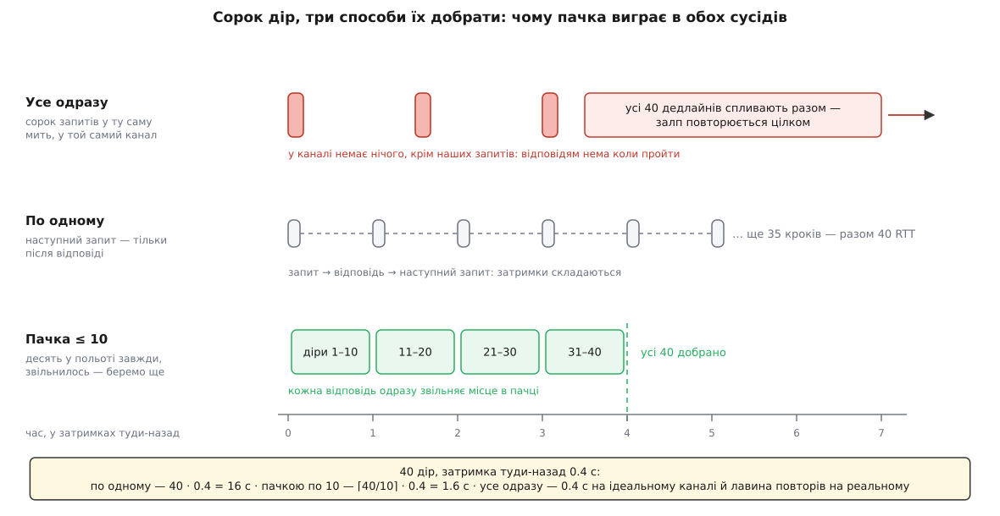

# ⚙️ Добірник параметрів: чеклист, таймер тиші й пачка на десять

Ось повний робочий код, який із потоку без підтверджень робить **або повний набір параметрів, або чесний список номерів, яких дістати не вдалося** — за скінченний час і не забиваючи канал. Написати щось таке доводиться кожному, хто робить власну наземну станцію, скрипт передпольотної перевірки чи міст між апаратом і хмарою; і майже кожен спершу пише одну з двох крайніх версій, які не працюють.

## Задача

Сформулюймо точно, бо добра половина складності живе саме у формулюванні.

**Дано.** Канал, який губить кадри й доставляє їх із затримкою в сотні мілісекунд. Борт, якому можна сказати «вивали все» або «дай он той». І потік відповідей, у кожній із яких, крім імені, значення й типу, є ще два числа: **скільки всього** параметрів (`param_count`) і **котрий це** (`param_index`). Механіка самих повідомлень — [протокол параметрів](topic:sys-dron/mavlink-param-tuning-and-diagnostics): запит списку, потік `PARAM_VALUE`, точкове читання `PARAM_REQUEST_READ`.

**Треба.** Карту «ім'я → значення», повну; а якщо повної не вийшло — перелік втрачених номерів. Плюс три жорсткі умови:

- **скінченність** — процедура мусить закінчитися на будь-якому каналі, зокрема на такому, що губить половину кадрів;
- **чесність** — не можна оголосити набір повним, коли він неповний: на неповному наборі станція показуватиме числа, яких на апараті немає;
- **лагідність до каналу** — телеметрія й керування йдуть тим самим лінком, і добір параметрів не має права їх витіснити.

Чого протокол не дає: підтверджень, повторів, маркера кінця потоку. Ніщо не каже «це було останнє повідомлення». Мовчання борту так само означає і «все віддав», і «я тебе не чую».

## Ідея: три деталі, кожна закриває одну умову

**Чеклист із `param_count`.** З першого ж отриманого повідомлення відомо, скільки всього комірок. Заводимо на компонент карту «номер → скільки разів ми його просили», спочатку всі номери від 0 до `count−1` з нулем. Кожне отримане значення викреслює свій номер. Порожня карта — набір повний; непорожня — маємо точний список дір. Це закриває **чесність**: повнота стає перевірною властивістю, а не здогадом.

**Таймер тиші, що перезапускається.** Один таймер на три секунди, який скидається на **кожному** отриманому значенні. Поки потік іде, він не спрацьовує ніколи; спрацював — потік справді вичерпався. Це єдина доступна ознака «борт замовк», і саме вона вмикає добір.

**Пачка з лічильником спроб.** Діри добираємо точковими запитами за номером, тримаючи в польоті не більш як десять одночасно. На кожен номер — власний лічильник; після п'ятої невдалої спроби номер викидаємо в список провалених. Лічильник закриває **скінченність**, обмеження пачки — **лагідність**.

### Чому не «все одразу»

Спокуса очевидна: у нас сорок дір — пошлімо сорок запитів. Здається, це найшвидше: одна затримка туди-назад замість чотирьох.

На ідеальному каналі так і є. Але діри існують саме тому, що канал не ідеальний, — і схема ламається не в перший момент, а в другий. Усі сорок запитів пішли в ту саму мить, отже, усі сорок дедлайнів спливають теж в одну мить. Хай навіть половина відповідей повернулася — за секунду в канал іде новий залп на двадцять. Потім ще один. Обсяг повторів не спадає плавно, а стрибає цілими залпами, і кожен залп займає той самий вузький канал, яким борт зараз намагається відповідати.

Гірше того: на типовому телеметричному модемі радіо фізично напівдуплексне, а двобічність йому робить поділ часу — передавач і приймач по черзі беруть ефір (так влаштована, зокрема, прошивка SiK, на якій стоїть більшість модемів 433/915 МГц). Кожен байт, посланий угору, забирає час у байтів, які мали йти вниз. Тобто залп запитів не додається до потоку відповідей, а **витісняє** його. Класичний [колапс від перевантаження](topic:com-transport/flow-control): що гірше йде, то більше ми шлемо, а що більше шлемо, то гірше йде.

### Чому не «по одному»

Протилежна крайність безпечна для каналу й нікуди не годиться за часом. Запит — очікування — відповідь — наступний запит: затримки не перекриваються, а складаються.

**Сорок дір на каналі із затримкою туди-назад 0.4 с**

```
по одному:      40 · 0.4              = 16.0 с
пачкою по 10:   ⌈40 / 10⌉ · 0.4       =  1.6 с
усе одразу:     1 · 0.4               =  0.4 с   ← лише якщо нічого не втрачено
```

Десять — не магічне число, а верхня межа кількості запитів **у польоті**: рівно та сама ідея, що й [вікно в протоколах із повторами](topic:com-transport/sliding-window-sizing-bdp). Канал зайнятий постійно, але не завалений; втрата однієї відповіді коштує одну секунду й зачіпає один номер, а не весь фронт.

Ще одна деталь на користь малої пачки — розмір кадрів. Запит за номером крихітний: у MAVLink 2 нульові байти в хвості корисних даних обрізають перед відправленням, а коли просиш за номером, поле імені лишається нульовим цілком. Обгортка кадру й розкладка полів — [пакет MAVLink](topic:sys-dron/mavlink-packet).

**Що летить у кожен бік**

```
PARAM_REQUEST_READ, запит за номером (поле імені порожнє):
  поля на дроті   param_index 2 + target_system 1 + target_component 1 + param_id 16 = 20 Б
  MAVLink 2 обрізає хвіст із нулів — 16 нульових байтів імені зникають         →     4 Б
  кадр разом з обгорткою                                              12 + 4   =    16 Б

PARAM_VALUE, відповідь:
  поля на дроті   4 + 2 + 2 + 16 + 1                                            =    25 Б
  кадр разом з обгорткою                                              12 + 25  =    37 Б
```

Десять запитів у польоті — це 160 байтів угору. Обмеження пачки береже не пропускну здатність (її вистачає з запасом), а **порядок**: воно не дає загубити контроль над тим, скільки повторів зараз у повітрі.



*Час скрізь міряється в затримках туди-назад, канал у всіх трьох однаковий. Верхня доріжка виграє на ідеальному каналі й програє на реальному: усі дедлайни спливають разом, тож повтор — це знову цілий залп. Нижня тримає в польоті рівно десять запитів, і кожна отримана відповідь одразу звільняє місце для наступної діри.*

## Робочий код

Основна мова — C++ із бібліотекою MAVLink C: це те, чим станцію й пишуть. Друга вкладка — Python із `pymavlink`, коли добірник потрібен усередині скрипта передпольотної перевірки чи стенда.

Межа відповідальності одразу: цей код не читає з порту й не розбирає кадри. Йому дають уже розібране `PARAM_VALUE` разом із номером компонента-відправника, а він відповідає лише за те, **коли й що просити повторно**.

### Стан і сталі

:::tabs
```cpp
#include <mavlink/common/mavlink.h>

#include <chrono>
#include <cstring>
#include <map>
#include <set>
#include <string>
#include <utility>

using Clock = std::chrono::steady_clock;
using Ms    = std::chrono::milliseconds;

// Куди складаємо готові кадри: у справжній станції це черга каналу.
struct MavlinkOut { void send(const mavlink_message_t& msg); };

constexpr uint8_t kGcsSysId  = 255;                          // звичний номер станції
constexpr uint8_t kGcsCompId = MAV_COMP_ID_MISSIONPLANNER;   // 190

constexpr int kListSilenceMs   = 5000;  // тиша у відповідь на запит списку
constexpr int kStreamSilenceMs = 3000;  // тиша посеред потоку = борт замовк
constexpr int kReadAckMs       = 1000;  // тиша у відповідь на точковий запит
constexpr int kListRetries     = 4;     // повторів запиту всього списку
constexpr int kTriesPerIndex   = 5;     // спроб на ОДИН номер, далі здаємось
constexpr int kBatchSize       = 10;    // точкових запитів у польоті одночасно

struct Param { float value; uint8_t type; };

// Усе, що ведемо на ОДИН компонент: під одним апаратом їх кілька (автопілот,
// підвіс, камера), і в кожного свій param_count і своя незалежна нумерація.
struct Comp {
    bool     seen  = false;               // чи прийшло хоч одне значення
    uint16_t total = 0;                   // param_count із першого повідомлення
    std::map<uint16_t, uint8_t>  waiting; // номер → скільки разів просили
    std::set<uint16_t>           failed;  // номери, на яких здалися
    std::map<std::string, Param> got;     // ім'я → значення
};

using Key = std::pair<uint8_t, uint16_t>;   // компонент + номер

class ParamFetcher {
public:
    ParamFetcher(MavlinkOut& out, uint8_t sysId, uint8_t defaultComp)
        : _out(out), _sysId(sysId), _defaultComp(defaultComp) {}

    void   start(Clock::time_point now) {
        _sendRequestList();
        _listAttempts = 1;
        _awaitingList = true;
        _listDeadline = now + Ms(kListSilenceMs);
    }

    void   onParamValue(uint8_t compId, const mavlink_param_value_t& pv,
                        Clock::time_point now);
    void   tick(Clock::time_point now);
    bool   complete() const;
    double progress() const;

    bool aborted() const { return _giveUp; }    // борт не озвався жодного разу
    // Назовні віддаємо все разом: і зібрані значення, і номери, на яких здалися.
    const std::map<uint8_t, Comp>& components() const { return _comps; }

private:
    void _ask(uint8_t compId, uint16_t idx, Clock::time_point now);
    void _refill(Clock::time_point now);
    void _sendRequestList();
    void _sendRequestRead(uint8_t compId, uint16_t idx);

    MavlinkOut& _out;
    uint8_t     _sysId, _defaultComp;

    std::map<uint8_t, Comp>          _comps;
    std::map<Key, Clock::time_point> _inFlight;  // що в польоті й доки чекаємо

    bool _awaitingList = false;   // чекаємо першої відповіді на запит списку
    bool _batchOn      = false;   // потік вичерпався, працює добір
    bool _giveUp       = false;   // борт не озвався зовсім
    int  _listAttempts = 0;
    Clock::time_point _listDeadline{}, _silenceDeadline{};
};
```
```python
import time
from collections import defaultdict
from pymavlink import mavutil

LIST_SILENCE, STREAM_SILENCE, READ_ACK = 5.0, 3.0, 1.0   # секунди
LIST_RETRIES, TRIES_PER_INDEX, BATCH   = 4, 5, 10


class ParamFetcher:
    """Добірник параметрів: чеклист номерів, таймер тиші, пачка точкових запитів."""

    def __init__(self, conn, target_sys, default_comp):
        self.conn, self.sys, self.default_comp = conn, target_sys, default_comp

        # Під одним апаратом кілька компонентів (автопілот, підвіс, камера),
        # і в кожного свій param_count та своя незалежна нумерація.
        self.total     = {}                 # компонент → param_count
        self.waiting   = {}                 # компонент → {номер: скільки разів просили}
        self.failed    = defaultdict(set)   # компонент → номери, на яких здалися
        self.got       = defaultdict(dict)  # компонент → {ім'я: (значення, тип)}
        self.in_flight = {}                 # (компонент, номер) → дедлайн

        self.awaiting_list = False          # чекаємо першої відповіді на запит списку
        self.batch_on      = False          # потік вичерпався, працює добір
        self.give_up       = False          # борт не озвався зовсім
        self.silence_deadline = 0.0

    def start(self):
        self._send_request_list()
        self.list_attempts = 1
        self.awaiting_list = True
        self.list_deadline = time.monotonic() + LIST_SILENCE
```
:::

Дві речі в цьому стані варто пояснити окремо.

Перша — чому все ведеться **на компонент**, а не на апарат. Під одним номером системи в MAVLink живуть кілька компонентів, і кожен має власний набір параметрів із власною загальною кількістю й власною нумерацією. Усі вони приходять одним потоком, і розрізняє їх лише поле відправника в кадрі. Один спільний чеклист на всіх зіпсувався б від першого ж повідомлення підвіса: номер 7 автопілота й номер 7 камери — різні комірки.

Друга — чому `_inFlight` окремо від `waiting`. У `waiting` лежить те, чого **бракує**; у `_inFlight` — те, що **зараз у повітрі**, разом із дедлайном. Одне без одного не працює: із самого `waiting` не видно, скільки запитів уже в каналі, а із самого `_inFlight` не видно, що ще треба взяти.

### Приймання значення

:::tabs
```cpp
void ParamFetcher::onParamValue(uint8_t compId, const mavlink_param_value_t& pv,
                                Clock::time_point now)
{
    // ArduPilot ллє незапитані значення ще ДО відповіді на запит списку, і номера
    // в них немає — поле дорівнює 65535. Будувати на них чеклист не можна.
    if (pv.param_index == UINT16_MAX && _awaitingList) return;

    Comp& c = _comps[compId];              // компонент міг з'явитися щойно
    if (!c.seen) {                         // перше значення від нього — будуємо чеклист
        c.seen  = true;
        c.total = pv.param_count;
        for (uint16_t i = 0; i < c.total; ++i) c.waiting[i] = 0;
    }

    // param_id — рівно 16 байтів і БЕЗ завершального нуля, якщо ім'я займає всі 16.
    char name[17] = {};
    std::memcpy(name, pv.param_id, 16);
    c.got[name] = { pv.param_value, pv.param_type };

    _awaitingList    = false;
    _silenceDeadline = now + Ms(kStreamSilenceMs);   // таймер тиші — з нуля

    if (pv.param_index < c.total) {                  // викреслюємо комірку
        c.waiting.erase(pv.param_index);
        _inFlight.erase(Key{compId, pv.param_index});
    }
    if (_batchOn) _refill(now);   // місце звільнилося — одразу беремо наступну діру
}
```
```python
    def on_param_value(self, comp_id, m, now):
        # ArduPilot ллє незапитані значення ще ДО відповіді на запит списку,
        # і номера в них немає — поле дорівнює 65535.
        if m.param_index == 65535 and self.awaiting_list:
            return

        if comp_id not in self.total:                   # перше значення від компонента
            self.total[comp_id] = m.param_count
            self.waiting[comp_id] = {i: 0 for i in range(m.param_count)}

        # pymavlink уже зібрав ім'я з 16 байтів і прибрав хвіст із нулів
        self.got[comp_id][m.param_id] = (m.param_value, m.param_type)

        self.awaiting_list = False
        self.silence_deadline = now + STREAM_SILENCE    # таймер тиші — з нуля

        if m.param_index < self.total[comp_id]:         # викреслюємо комірку
            self.waiting[comp_id].pop(m.param_index, None)
            self.in_flight.pop((comp_id, m.param_index), None)

        if self.batch_on:
            self._refill(now)   # місце звільнилося — одразу беремо наступну діру
```
:::

Останній рядок — те, завдяки чому пачка не працює ривками. Якби добір дозаповнювався лише за таймером, після кожної отриманої відповіді в каналі було б дев'ять запитів замість десяти, потім вісім, і так до чергового спрацювання таймера. Дозаповнення прямо в обробнику тримає вікно повним весь час.

### Таймери, повтори й здавання

:::tabs
```cpp
void ParamFetcher::tick(Clock::time_point now)
{
    if (_awaitingList) {                        // борт ще не озвався жодного разу
        if (now < _listDeadline) return;
        if (_listAttempts > kListRetries) { _giveUp = true; return; }
        _sendRequestList();
        ++_listAttempts;
        _listDeadline = now + Ms(kListSilenceMs);
        return;
    }

    if (!_batchOn) {
        if (now < _silenceDeadline) return;     // потік іде — таймер тиші відсунуто
        _batchOn = true;                        // замовк: вмикаємо добір
    }

    // Прострочені запити: місце в пачці звільняється, номер іде на нову спробу.
    // _ask дописує в _inFlight, але вставка в std::map не псує чинних ітераторів,
    // а новий запис має дедлайн у майбутньому — цей самий обхід його не зачепить.
    for (auto it = _inFlight.begin(); it != _inFlight.end(); ) {
        if (now < it->second) { ++it; continue; }
        const Key key = it->first;
        it = _inFlight.erase(it);
        _ask(key.first, key.second, now);
    }
    _refill(now);
}

// Спробувати номер ще раз — або здатися на ньому назавжди.
void ParamFetcher::_ask(uint8_t compId, uint16_t idx, Clock::time_point now)
{
    Comp& c  = _comps.at(compId);
    auto  it = c.waiting.find(idx);
    if (it == c.waiting.end()) return;          // уже приїхав, поки ми чекали

    if (++it->second > kTriesPerIndex) {        // шоста спроба — досить
        c.failed.insert(idx);
        c.waiting.erase(it);
        return;
    }
    _sendRequestRead(compId, idx);
    _inFlight[Key{compId, idx}] = now + Ms(kReadAckMs);
}

// Дотягти пачку до десяти запитів у польоті, беручи діри в порядку номерів.
void ParamFetcher::_refill(Clock::time_point now)
{
    for (auto& entry : _comps) {
        const uint8_t compId = entry.first;
        Comp&         c      = entry.second;
        for (auto it = c.waiting.begin(); it != c.waiting.end(); ) {
            if (_inFlight.size() >= kBatchSize) return;       // пачка повна
            const uint16_t idx = it->first;
            ++it;                                            // _ask може стерти запис
            if (_inFlight.count(Key{compId, idx})) continue;  // уже в польоті
            _ask(compId, idx, now);
        }
    }
}

void ParamFetcher::_sendRequestList()
{
    mavlink_message_t msg;
    mavlink_msg_param_request_list_pack(kGcsSysId, kGcsCompId, &msg,
                                        _sysId, MAV_COMP_ID_ALL);
    _out.send(msg);
}

void ParamFetcher::_sendRequestRead(uint8_t compId, uint16_t idx)
{
    // param_index тут int16_t: −1 означає «шукай за іменем», тож за номером
    // доступні лише перші 32768 параметрів.
    mavlink_message_t msg;
    mavlink_msg_param_request_read_pack(kGcsSysId, kGcsCompId, &msg,
                                        _sysId, compId, "", static_cast<int16_t>(idx));
    _out.send(msg);
}
```
```python
    def tick(self, now):
        if self.awaiting_list:                        # борт ще не озвався жодного разу
            if now < self.list_deadline:
                return
            if self.list_attempts > LIST_RETRIES:
                self.give_up = True
                return
            self._send_request_list()
            self.list_attempts += 1
            self.list_deadline = now + LIST_SILENCE
            return

        if not self.batch_on:
            if now < self.silence_deadline:           # потік іде — таймер тиші відсунуто
                return
            self.batch_on = True                      # замовк: вмикаємо добір

        for key, deadline in list(self.in_flight.items()):
            if now >= deadline:
                del self.in_flight[key]               # місце в пачці звільнилося
                self._ask(key[0], key[1], now)
        self._refill(now)

    def _ask(self, comp_id, index, now):
        """Спробувати номер ще раз — або здатися на ньому назавжди."""
        tries = self.waiting[comp_id].get(index)
        if tries is None:
            return                                    # уже приїхав, поки ми чекали

        tries += 1
        if tries > TRIES_PER_INDEX:                   # шоста спроба — досить
            self.failed[comp_id].add(index)
            del self.waiting[comp_id][index]
            return

        self.waiting[comp_id][index] = tries
        self._send_request_read(comp_id, index)
        self.in_flight[(comp_id, index)] = now + READ_ACK

    def _refill(self, now):
        """Дотягти пачку до десяти запитів у польоті, беручи діри за номерами."""
        for comp_id in list(self.waiting):
            for index in sorted(self.waiting[comp_id]):   # копія: _ask може стерти запис
                if len(self.in_flight) >= BATCH:
                    return                                # пачка повна
                if (comp_id, index) in self.in_flight:
                    continue                              # уже в польоті
                self._ask(comp_id, index, now)

    def _send_request_list(self):
        self.conn.mav.param_request_list_send(self.sys, mavutil.mavlink.MAV_COMP_ID_ALL)

    def _send_request_read(self, comp_id, index):
        # param_index тут int16: −1 означає «шукай за іменем», тож за номером
        # доступні лише перші 32768 параметрів.
        self.conn.mav.param_request_read_send(self.sys, comp_id, b"", index)
```
:::

Три таймери тут навмисно різні за суттю, і плутати їх не можна. Перший ловить **повну відсутність відповіді** на запит списку — тоді має сенс повторити запит цілком. Другий ловить **кінець потоку** й нічого не повторює: він лише перемикає режим. Третій ловить **втрату однієї відповіді** — і тільки він породжує повтори точкових запитів. Обмежені повтори з чіткою межею — окрема тема сама по собі: [скільки разів і як довго пробувати](topic:sf-distributed/retries-backoff).

> 🔧 **Навіщо це.** Здавання на номері виглядає як поразка, а насправді це єдине, що робить добірник придатним. Без лічильника спроб на поганому каналі процедура не закінчується ніколи, і станція вічно висить у стані «майже готово» — стані, у якому не можна ні показати налаштування, ні чесно сказати, що їх немає. Із лічильником з'являється третій, правильний вихід: «ось набір, а ось перелік того, чого бракує».

### Завершення, поступ і цикл

:::tabs
```cpp
// Порожні карти очікування — ще НЕ все: параметри підвіса можуть приїхати
// першими, а головного компонента не бути взагалі.
bool ParamFetcher::complete() const
{
    for (const auto& entry : _comps)
        if (!entry.second.waiting.empty()) return false;
    return _comps.count(_defaultComp) != 0;
}

double ParamFetcher::progress() const
{
    uint32_t total = 0, left = 0;
    for (const auto& entry : _comps) {
        total += entry.second.total;
        left  += static_cast<uint32_t>(entry.second.waiting.size());
    }
    return total ? static_cast<double>(total - left) / static_cast<double>(total) : 0.0;
}
```
```python
    def complete(self):
        # Порожні карти очікування — ще НЕ все: параметри підвіса можуть приїхати
        # першими, а головного компонента не бути взагалі.
        if any(self.waiting.values()):
            return False
        return self.default_comp in self.total

    def progress(self):
        total = sum(self.total.values())
        left  = sum(len(w) for w in self.waiting.values())
        return (total - left) / total if total else 0.0


def fetch(conn, target_sys, default_comp):
    f = ParamFetcher(conn, target_sys, default_comp)
    f.start()
    while not (f.complete() or f.give_up):
        m = conn.recv_match(type="PARAM_VALUE", blocking=True, timeout=0.2)
        now = time.monotonic()
        if m is not None and m.get_srcSystem() == target_sys:
            f.on_param_value(m.get_srcComponent(), m, now)
        f.tick(now)          # 0.2 с без кадрів — таймери все одно треба крутити
    return f
```
:::

У C++ такого циклу немає навмисно: там `onParamValue()` кличе обробник каналу, а `tick()` — таймер застосунку, не рідше ніж раз на сто мілісекунд. Важливий лише інваріант, спільний для обох мов: **`tick()` мусить викликатися і тоді, коли не прийшло нічого** — саме тиша й є тією подією, заради якої він існує.

## Скільки це коштує

**Пам'ять.** Один запис на параметр у чеклисті. У C++ вузол `std::map<uint16_t, uint8_t>` займає десятки байтів разом зі службовими полями — для тисячі двохсот параметрів це близько шістдесяти кілобайтів на рівному місці. На настільній станції це ніщо; на мосту, що крутиться на роутері, варто взяти масив лічильників завдовжки `param_count` (тисяча двісті байтів) і бітову карту отриманих. Логіка не змінюється — змінюється лише сховище.

**Час.** Поки потік іде, робота на кожне повідомлення — одне викреслення, тобто O(log N). Щойно вмикається добір, `_refill` обходить діри: O(H) на кожну подію, де H — скільки їх лишилося, і O(H²) за весь добір. Для сорока дір це півтори тисячі дешевих кроків, непомітно; для набору, де діряве геть усе, — понад мільйон, усе ще менше за мілісекунду на звичайному процесорі, але вже видно на слабкому залізі. Окрема черга дір замість повторного обходу карти зводить це до O(H log H).

**Найгірший час до завершення.** Ось число, яке варто порахувати перед тим, як ставити сталі:

**Тисяча двісті параметрів, з яких не приходить жоден**

```
запитів усього:   1200 · 5 спроб                    = 6000
темп добору:      пачка 10 / дедлайн 1 с            = 10 запитів/с
до здавання:      6000 / 10                         = 600 с = 10 хвилин
```

Десять хвилин — це скінченно, як і обіцяно, але для людини це вічність. Тому розмір пачки й дедлайн точкового запиту — не косметичні сталі, а саме ті дві ручки, якими регулюють, коли добірник здасться; і тому серйозна станція завжди дає операторові окрему кнопку «припинити».

## Пастки

**Номер 65535 замість справжнього.** ArduPilot починає сипати параметрами ще до того, як відповість на запит списку, і в таких незапитаних повідомленнях номер дорівнює 65535 — «номера немає». Прийняти їх до відповіді на запит списку означає побудувати чеклист на випадкових даних. Але фільтр мусить мати виняток: PX4 відповідає на псевдопараметр `_HASH_CHECK` теж без номера, і якщо відкидати за самим номером, хеш-звірка не спрацює ніколи. У чинному коді QGroundControl умова так і записана — «номер 65535 **і** ім'я не `_HASH_CHECK` **і** ще чекаємо відповіді на запит списку».

**Ім'я без завершального нуля.** Поле імені — рівно шістнадцять байтів, і якщо ім'я займає всі шістнадцять, нуля в кінці немає. `strlen` на такому полі читає далі за буфер, а `std::string(pv.param_id)` прихопить сусідні байти структури. Копія у власний буфер на сімнадцять байтів, заповнений нулями, — єдиний надійний спосіб. `pymavlink` це вже робить сам, тож у скриптовій версії пастка не видна — і саме тому портування коду зі скрипта в C++ регулярно її народжує.

**Стеля 32767 на запит за номером.** Загальна кількість — беззнакове шістнадцятибітове число, тобто до 65535. А номер у `PARAM_REQUEST_READ` — **знакове** шістнадцятибітове, бо значення −1 зайняте під «шукай за іменем». Параметри з номерами від 32768 не запитати за номером узагалі — а за іменем теж ні, бо імені ми не знаємо: воно було рівно в тому повідомленні, яке загубилося. Живі набори до цієї межі не дотягують, але вона існує й вона жорстка.

**Номери живуть один сеанс.** Додали параметр у прошивку — усі номери після нього зсунулися. Кешувати між сеансами можна лише пари «ім'я → значення»; кешований номер після оновлення прошивки вкаже на чужий параметр, і жодна перевірка цього не помітить, бо у відповідь прийде саме те, що просили, — просто не те, що малося на увазі. Тому чеклист будують заново на кожне завантаження, від щойно отриманого `param_count`.

**Що саме вважати спробою.** Тут лічильник росте в момент **надсилання**. Це означає, що номер, який раз по раз потрапляє в пачку, вигорить п'ять спроб швидко. Альтернатива — рахувати в момент **прострочення**: тоді «п'ять спроб» справді означає п'ять невдач, а добір триває довше. Обидва варіанти захищають від нескінченності, але вибір треба зробити свідомо: від нього прямо залежить, як швидко станція здасться на поганому каналі.

**«Не більш як десять» легко перетворюється на одинадцять.** У чинному коді QGroundControl умова виходу з циклу дозаповнення записана як `count() > maxBatchSize` — строга нерівність перед додаванням, тож черга встигає дорости до одинадцяти. Нічого не ламається, але випадок повчальний: розмір пачки — політика, а не закон, і перевіряти її треба саме там, де додають, і саме тією нерівністю, яку мали на увазі.

**Смужка поступу вміє з'їжджати назад.** У знаменнику — сума кількостей усіх компонентів, які **вже озвалися**. Підвіс, що прокинувся посеред завантаження, додає туди свої дві сотні, і поступ із 0.9 з'їжджає на 0.7. Це не помилка рахунку, а чесний показ того, що роботи справді побільшало: скільки компонентів на апараті, наперед не знає ніхто, тож зафіксувати знаменник на початку ні з чого.

**Порожні карти — ще не готовність.** На самому старті вони теж порожні. І підвіс цілком може відповісти першим, поки автопілот мовчить. Саме тому умова завершення подвійна: усі карти очікування порожні **і** серед компонентів є головний. Одна половина без другої дає готовність там, де набору немає.

**Тиша на відтворенні логу — не помилка.** Читаючи записану телеметрію, запитувати нікого: з'єднання однобічне. Там спрацювання таймера тиші означає «у логу було стільки, скільки було», а всі повтори треба вимкнути цілком — інакше добірник чесно відпрацює п'ять спроб на кожну діру в порожнечу й витратить хвилини на файл, який давно дочитано.
