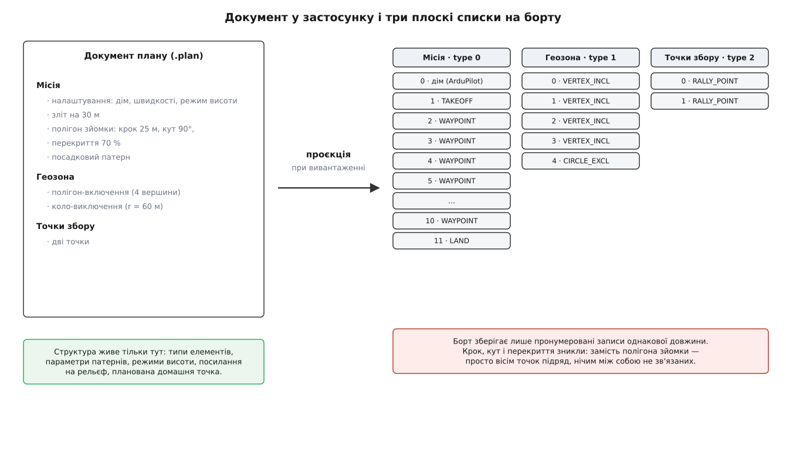

# Обмін планом із апаратом: вивантаження й звірка

<preknowlist>
- [Модель плану: місія, геозона, точки збору](topic:sys-dron/plan-model) — з чого складається план у застосунку і які три частини в ньому живуть.
- [Елементи місії й команди](topic:sys-dron/mission-items) — що таке пункт місії та які в нього поля.
- [Vehicle: модель апарата всередині застосунку](topic:sys-dron/vehicle-object) — об'єкт апарата, якому належать менеджери плану й канал до борту.
- [Пакет MAVLink](topic:sys-dron/mavlink-packet) — кадр, яким станція й борт розмовляють, і те, що доставка ним не гарантована.
</preknowlist>

Намалюй у редакторі плану полігон зйомки: чотири вершини, крок двадцять п'ять метрів, кут дев'яносто градусів. Натисни «Вивантажити» — станція скаже, що план на борту. Тепер натисни «Завантажити» й подивись, що приїде назад: вісім точок підряд і більше нічого. Ані полігона, ані кроку, ані кута.

Нічого не загубилося в каналі й ніхто не помилився в коді. Просто на борт поїхало не те, що ти намалював, а слід від намальованого. З цієї нерівности виростає вся підсистема обміну планом.

## Два значення слова «план»

У станції слово «план» означає дві різні речі, і плутати їх — головне джерело здивування.

**У застосунку** план — це документ. У ньому три частини: місія, геозона й точки збору. Місія — не просто перелік координат, а набір об'єктів різного типу: пункт налаштувань, звичайні пункти, [патерни зйомки](topic:sys-dron/survey-patterns) зі своїми параметрами, посадкові патерни, [режими висоти](topic:sys-dron/terrain-and-altitude) з посиланням на рельєф.

**На борту** план — це три пронумеровані масиви однакових записів. У кожному записі номер, команда, рамка координат і рівно сім чисел. Жодного типу об'єкта, жодної вкладености, жодного поля під «це шоста точка галса зйомки з кроком двадцять п'ять метрів».

Тож вивантаження — не передавання документа, а його **проєкція** (лат. *proiectio* — кидання вперед): зведення до плоского списку записів наперед відомої форми. Проєкція за визначенням щось відкидає.

*Одна й та сама місія у двох формах. Ліворуч типи об'єктів і їхні параметри; праворуч — дванадцять однакових записів, з яких вісім є розгорнутим полігоном зйомки, але жоден із них про це не знає.*

## Чому борт не тримає документа

Місію виконує польотний контролер — той самий мікроконтролер, який у тому ж циклі рахує стабілізацію, читає давачі й крутить моторами. Робота з місією має бути для нього дешевою й передбачуваною за часом. Звідси три вимоги до формату.

Пункт має діставатися **за номером**: команда `DO_JUMP` каже «перейди на пункт номер 3 і повтори тричі», а після перезапуску місія має продовжитися з місця, записаного одним цілим числом. Це працює, лише коли пункти лежать масивом однакового розміру.

Розмір запису має бути **сталим**: пам'ять на контролері виділяють наперед, і місія на кількасот пунктів мусить або поміститися, або чесно не поміститися.

Формат має бути **спільним**: ту саму місію може залити інша наземна станція, скрипт чи бортовий комп'ютер. Тому в записі є лише те, що всі учасники розуміють однаково.

Так і народився пункт місії: номер, команда, рамка координат, сім чисел. Місця під «структуру» в ньому немає не через недогляд — структура є поняттям редактора, а не виконавця. Як формат дійшов до нинішнього вигляду, від перших дробових координат до типів планів, розібрано окремо: [історія протоколу обміну планом](topic:sys-dron/plan-exchange/hist-mission-protocol-evolution.md).

> 🔧 **Навіщо це.** Звідси правило, яке рятує реальні польоти: борт не є сховищем плану. Якщо на майданчику ти правиш місію в станції, вивантажуєш і не зберігаєш файл — назавтра з борту приїде плоский список, у якому полігони доведеться відновлювати руками. Файл плану бережи як вихідний код, а борт вважай зібраним бінарником.

## Обміном керує той, хто приймає

Канал до апарата губить кадри й нічого про це не каже відправникові. Значить, потрібні підтвердження — але окреме підтвердження на кожен пункт подвоїло б трафік заради службової інформації.

Протокол розв'язує це одним зсувом ролі: **питає той, хто приймає**. Приймач — єдиний, хто напевно знає, якого запису йому бракує, а його запит одночасно є підтвердженням попереднього.

Вивантаження виглядає так. Станція шле кількість пунктів. Борт просить пункт нуль — станція віддає нульовий. Борт просить перший — станція віддає перший. І так до кінця, після чого борт закриває розмову підтвердженням. Завантаження дзеркальне: станція просить список, борт називає кількість, станція питає пункти по одному.

Плата за надійність — один оберт по каналу на кожен пункт: на телеметричному радіо із затримкою 150 мс місія на сто пунктів іде близько п'ятнадцяти секунд.

З того, що порядок запитів визначає борт, випливають дві звички станції. Вона тримає не курсор, а список ще не відданих номерів, бо борт має право попросити шостий пункт удруге. І вона міряє мовчання таймером: не дочекалася — повторює, а після кількох невдач скасовує обмін. Місія на борту при цьому лишається старою, бо борт застосовує нову лише після повного успішного приймання.

## Дім, якого в PX4 немає

ArduPilot тримає домашню точку пунктом місії з номером нуль, тож перша команда польоту має в нього номер один. PX4 так не робить: у нього дім живе окремо від місії.

Розбіжність не косметична, бо на номери пунктів посилаються — той самий `DO_JUMP` містить номер цілі. Тому станція, віддаючи місію апаратові, який чекає дім нульовим пунктом, додає цей пункт наперед і зсуває всі посилання на одиницю, а при читанні робить зворотне. Рішення приймає не менеджер плану, а [плагін прошивки](topic:sys-dron/firmware-plugin) — шар, де застосунок тримає всі розбіжності конкретних автопілотів в одному місці й віддає решті застосунку однакову поведінку.

## Коли проєкція оборотна

Утрата структури — не закон природи. Геозона їде тим самим протоколом і теж стає плоским списком: кожна вершина полігона — окремий пункт. Але в кожну вершину кладуть ще одне число — скільки вершин у полігоні, якому вона належить. Цього одного поля досить, щоб розібрати список назад: бачимо «вершин чотири», забираємо чотири підряд у полігон, беремо наступний пункт — і починаємо спочатку.

Для зйомки таке не спрацювало б навіть теоретично: щоб відновити галси, треба знати межі полігона, крок, кут і перекриття, а всі сім чисел пункту вже зайняті аргументами команди польоту. Тож станція й не намагається — вона розгортає патерн у точки й забуває про нього.

Виняток один, і він повчальний: посадковий патерн станція впізнає при читанні з борту. Не тому, що в ньому є службова мітка, а тому, що він розгортається у коротку послідовність команд строго визначеного вигляду. Станція проходить прибулий список і шукає цей підпис. Зйомка такого підпису не має — її слід невідрізненний від точок, поставлених рукою.

## Підсвічена кнопка не означає «на борту інше»

Станція вміє показати, що план на борту застарів: кнопка вивантаження підсвічується. Природно припустити, що застосунок звірив свій план із бортовим. Насправді він не звіряв нічого.

Контролер плану тримає два прапорці: «потрібно зберегти» — документ змінювався від часу останнього запису у файл; «потрібно вивантажити» — документ змінювався від часу останнього вдалого вивантаження. Це облік власних правок, а не порівняння. Пересунь точку на десять метрів і поверни назад — прапорець лишиться піднятим, хоч план став тим самим.

Чесного порівняння немає з простої причини: порівнювати довелося б **проєкції, а не документи**. Треба спроєктувати документ у список пунктів, зчитати список із борту й звірити їх — причому не побайтово, бо координати пройшли округлення, у бортовому списку може бути зайвий нульовий пункт із домом, а прошивка мала право трохи змінити рамку. Це повний цикл читання по каналу, той самий десяток секунд ефіру — задорого заради попередження «ти щось редагував».

> 🔧 **Навіщо це.** Підсвічена кнопка — це «я редагував», а не «на борту інше». Єдиний спосіб переконатися, що на борту саме те, що треба, — завантажити план назад у порожній редактор і подивитися на нього як на список команд, а не як на свій малюнок: кількість пунктів, перший і останній.

## Де живе план

Повний документ існує рівно в одному місці — у файлі `.plan` на диску: звичайний JSON із трьома об'єктами верхнього рівня, `mission`, `geoFence` і `rallyPoints`, де кожен елемент оголошує свій тип. Саме там лежать крок зйомки, кут галсів, режим висоти й планована домашня точка. Борт тримає слід цього документа — три плоскі списки, достатні, щоб політ виконати, і недостатні, щоб план відредагувати.

Звідси єдине робоче правило, з якого варто виходити щоразу: **вивантаження — це компіляція, а не збереження**. Вихідний код лишається в тебе.
