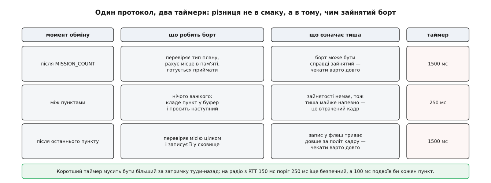
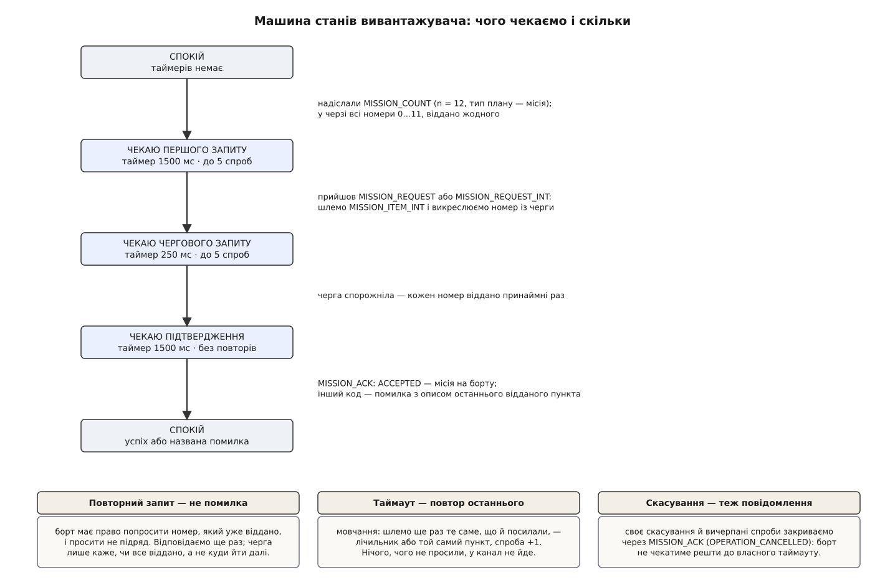

# ⚙️ Вивантажувач місії з нуля: код, що доводить план до борту

Ось повний робочий клієнт протоколу місій — приблизно двісті рядків, які беруть список пунктів і **або кладуть його на борт цілим, або називають, на якому саме пункті й чому зламалося**. Таке доводиться написати кожному, хто робить свій передпольотний скрипт, міст «хмара — апарат» чи власну наземну станцію; і майже кожна перша спроба виглядає як цикл «шлемо пункт, чекаємо, шлемо наступний» — а він не працює вже на другому втраченому кадрі.

## Задача

**Дано.** Список пунктів у нашій нумерації. Канал, який губить кадри й доставляє їх із затримкою в сотні мілісекунд, — про його влаштування описано в [пакеті MAVLink](topic:sys-dron/mavlink-packet): кадр із адресами, контрольною сумою й без жодних гарантій доставки. І борт, який в обміні **головний**: ми оголошуємо, скільки пунктів маємо, а далі лише відповідаємо на його запити.

**Треба.** Довести всі пункти до борту, і щоб результат був одним із двох: «місія на борту, стільки-то пунктів» або «не вийшло, ось причина й ось пункт, на якому вона спрацювала». Третій результат — «начебто поїхало» — заборонений: на ньому пілот злітає з місією, якої на борту немає.

Три умови роблять задачу нетривіальною.

**Нічого, чого не просили.** Приймач сам замовляє, який пункт йому потрібен. Пункт, надісланий без запиту, у кращому разі буде відкинутий, у гіршому — прошивка вважатиме нумерацію порушеною й обірве обмін. Конвеєра тут немає: [вікна з кількома кадрами в польоті](topic:com-transport/sliding-window-sizing-bdp) протокол місій не має взагалі.

**Скінченність.** На каналі, який губить помітну частину кадрів, процедура мусить закінчитися — успіхом чи відмовою, але закінчитися. Мовчання борту не має ані змісту, ані адреси: воно однаково означає і «твій пункт не долетів», і «моя відповідь не долетіла», і «я вимкнувся».

**Діагностика з адресою.** Борт відповідає кодом причини, але **не каже, на чому саме спіткнувся**. Код `MAV_MISSION_UNSUPPORTED_FRAME` у місії на двісті пунктів без прив'язки до пункту — це не діагноз, а загадка. Прив'язку доводиться робити самому.

## Ідея: три рішення, з яких виростає весь код

### Черга номерів, а не курсор

Спокуслива структура стану — одне число `next`, яке після кожного відправленого пункту збільшується на одиницю. Вона ламається на першій же особливості протоколу: **порядок запитів визначає борт**, і він не зобов'язаний питати підряд. Прошивка, у якої загубився шостий пункт, попросить шостий удруге — і курсор, що вже стоїть на сьомому, або віддасть не те, або оголосить помилку там, де все гаразд.

Тому стан обміну — це **множина номерів, яких борт іще не забирав**. Прийшов запит на `seq` — віддаємо `items[seq]` і викреслюємо `seq` із множини. Порожня множина означає рівно одне: кожен номер віддано принаймні раз, більше нам ініціювати нічого. Множина при цьому **не вирішує, що слати**: що слати, каже запит. Вона лише відповідає на питання «чи все віддано».

Різниця здається дрібною, поки не подивитися на повторний запит: із чергою він обробляється тим самим кодом, що й первинний, і не потребує жодної окремої гілки. Викреслення з множини, у якій елемента вже немає, — операція без наслідків.

### Два таймери, бо тиша означає різне

Тиша в каналі — єдина ознака біди, яку ми маємо, і питання лише в тому, скільки її терпіти. Одне значення тут не годиться, бо в різних місцях обміну мовчання борту має різні причини.


*Довгий таймер стоїть там, де борт справді щось робить; короткий — там, де він не робить нічого, тож тиша майже напевно означає втрачений кадр.*

Півтори секунди після лічильника — це запас на роботу: борт перевіряє тип плану, рахує, чи вистачить пам'яті, готує приймання. Півтори секунди після останнього пункту — запас на запис у флеш-пам'ять, який на дешевому контролері триває помітно довше за політ кадру. А чверть секунди між пунктами — це очікування в уже розігнаному обміні, де борт кладе пункт у буфер і одразу просить наступний; тут мовчання майже напевно означає втрачений кадр, і чекати довше — просто дарувати час.

Нижню межу короткого таймера задає арифметика, а не смак.

**Скільки мусить чекати короткий таймер**

```
затримка туди-назад на телеметричному радіо   RTT ≈ 150 мс
поріг 250 мс:  250 > 150 → відповідь устигає, повтор іде лише на справжню втрату
поріг 100 мс:  100 < 150 → таймер спрацьовує ЗАВЖДИ, кожен пункт іде двічі,
               канал забитий удвічі, втрат стає більше — і так по колу
```

> 🔧 **Навіщо це.** Якщо між станцією й апаратом стоїть не радіо, а мобільний інтернет, затримка туди-назад легко переростає 400 мс — і зашитий поріг 250 мс перетворює кожен пункт на пару дублікатів. Короткий таймер має бути налаштовним і братися **з виміряної затримки каналу**, а не з константи в коді. Виміряти її просто: `PING` або власний оберт «запит — відповідь» перед початком вивантаження.

Лічильник спроб — п'ять. Не тому, що п'ять чарівне, а тому, що добуток «спроби × таймер» задає час, після якого ми здаємося: п'ять по чверть секунди — трохи більше секунди на пункт, п'ять по півтори секунди на лічильнику — сім із половиною секунд на те, щоб борт узагалі озвався. Лічильник обнуляється на **кожному русі вперед**, тобто на кожному прийнятому запиті: п'ять спроб витрачаються на один пункт, а не на всю місію.

### Стан — це пара, а не одне число

Хвіст попередньої розмови — окремий клас неприємностей. Повільна відповідь на скасовану транзакцію приходить тоді, коли вже почалася нова, і без захисту вона зіб'є нову з ніг.

Тому стан складається з двох незалежних величин: **тип транзакції** (пишемо, читаємо, видаляємо, спокій) і **очікуване повідомлення** (запит, підтвердження, нічого). Кожне вхідне повідомлення звіряється з цією парою, і невідповідність — не помилка, а привід мовчки викинути кадр. Помилку оголошує тиша, а не несподіванка.

Тут же живе й обмеження «одна транзакція за раз». Протокол не має поля, яким можна було б розрізнити дві одночасні розмови на одну тему: якби ми вели два записи місії паралельно, ми не змогли б сказати, до котрого з них належить наступний запит. Тож друга спроба почати просто відмовляється.


*Уся машина: чотири стани, чотири переходи вперед і три правила на все інше. Таймер вибирається не станом, а тим, що ми щойно надіслали й чи спорожніла черга.*

Загальний каркас — таймаут, повтор, лічильник спроб — це та сама схема, що й у будь-якому [надійному обміні поверх ненадійного каналу](topic:com-transport/reliable-link); особливість тут лише в тому, що підтвердженням служить не окреме повідомлення, а наступний запит.

### Зсув `DO_JUMP` робиться один раз, на вході

Прошивки розходяться в тому, чи є домашня точка нульовим пунктом місії. Питання «чи вставляти дім» вирішує [плагін прошивки](topic:sys-dron/firmware-plugin), а нам лишається наслідок: коли дім вставлено, **усі номери поїхали на одиницю**, і команда `DO_JUMP`, у першому параметрі якої лежить номер цілі, мусить поїхати разом із ними.

Місце цього зсуву в коді важливіше, ніж здається. Спокуса — робити його в момент відправлення пункту: там під рукою і номер, і прапорець прошивки. Але відправлення повторюється: втратився кадр — той самий пункт іде вдруге, і другий зсув відправить `DO_JUMP` на пункт, який ніхто не планував. Тому зсув — частина **підготовки списку**, разом із вставленням дому: після `begin()` масив уже в бортовій нумерації, і надсилання стає чистою операцією без побічних наслідків.

Ціль `DO_JUMP` живе в полі, оголошеному як число з рухомою комою, — саме тому в коді нижче вона зчитується округленням, а не зведенням типу. Для номерів пунктів це нешкідливо: [точності float](topic:hw-arch/floating-point) вистачає на цілі значно більші за будь-яку реальну місію, а от відкидання дробової частини після арифметики зі зсувом могло б дати `2` там, де мало бути `3`.

## Код

Дві реалізації того самого: перша — для станції чи бортового мосту, де важать буфери й пакування кадру; друга — для скрипта, яким переливають місію на майданчику.

:::tabs
```cpp
#include <mavlink/common/mavlink.h>   // згенеровані заголовки MAVLink 2

#include <chrono>
#include <cmath>
#include <cstdint>
#include <functional>
#include <set>
#include <string>
#include <vector>

using Clock = std::chrono::steady_clock;

// Пункт у тому вигляді, у якому його тримає редактор.
struct Item {
    uint16_t command      = MAV_CMD_NAV_WAYPOINT;
    uint8_t  frame        = MAV_FRAME_GLOBAL_RELATIVE_ALT_INT;
    float    param[4]     = {0, 0, 0, 0};
    int32_t  x = 0, y = 0;          // широта й довгота, градуси · 10⁷
    float    z = 0;                 // висота, метри
    bool     autocontinue = true;
};

class MissionUploader {
public:
    using Sender = std::function<void(const uint8_t*, uint16_t)>;
    using Logger = std::function<void(const std::string&)>;

    MissionUploader(uint8_t sysId, uint8_t compId, Sender send, Logger log)
        : _sysId(sysId), _compId(compId),
          _send(std::move(send)), _log(std::move(log)) {}

    bool busy() const { return _tx != Tx::None; }

    // home != nullptr — прошивка чекає домашню точку нульовим пунктом.
    bool begin(std::vector<Item> items, uint8_t tgtSys, uint8_t tgtComp,
               const Item* home, Clock::time_point now)
    {
        if (_tx != Tx::None) {              // друга розмова на ту саму тему
            _log("транзакція вже йде");     // протокол не вміє їх розрізняти
            return false;
        }

        // Підготовка списку: дім і зсув цілей — РАЗ, до першого відправлення.
        _items.clear();
        _items.reserve(items.size() + 1);
        if (home) {
            _items.push_back(*home);
            for (Item it : items) {
                if (it.command == MAV_CMD_DO_JUMP)
                    it.param[0] += 1.0f;    // ціль поїхала разом з усіма
                _items.push_back(it);
            }
        } else {
            _items = std::move(items);
        }
        if (_items.empty() || _items.size() > 0xFFFF) {
            _log("порожня або задовга місія");
            return false;
        }
        for (size_t i = 0; i < _items.size(); ++i) {
            if (_items[i].command != MAV_CMD_DO_JUMP) continue;
            const long tgt = std::lroundf(_items[i].param[0]);
            if (tgt < 0 || size_t(tgt) >= _items.size()) {
                _log("DO_JUMP у пункті " + std::to_string(i) +
                     " цілить у неіснуючий " + std::to_string(tgt));
                return false;
            }
        }

        _tgtSys = tgtSys;
        _tgtComp = tgtComp;
        _pending.clear();
        for (uint16_t i = 0; i < uint16_t(_items.size()); ++i)
            _pending.insert(i);             // черга ще не відданих номерів
        _tx = Tx::Write;
        _retry = 0;
        _lastSent = -1;
        _sendCount(now);
        return true;
    }

    // Байти з каналу: розбираємо в кадри й годуємо машину.
    void feed(const uint8_t* data, size_t n, Clock::time_point now) {
        mavlink_message_t msg;
        mavlink_status_t  st;
        for (size_t i = 0; i < n; ++i)
            if (mavlink_parse_char(MAVLINK_COMM_0, data[i], &msg, &st))
                onMessage(msg, now);
    }

    void onMessage(const mavlink_message_t& msg, Clock::time_point now) {
        if (_tx != Tx::Write)     return;   // нас це не стосується
        if (msg.sysid != _tgtSys) return;   // інший апарат у тій самій мережі

        switch (msg.msgid) {
        case MAVLINK_MSG_ID_MISSION_REQUEST_INT: {
            mavlink_mission_request_int_t r;
            mavlink_msg_mission_request_int_decode(&msg, &r);
            _onRequest(r.seq, r.mission_type, now);
            break;
        }
        case MAVLINK_MSG_ID_MISSION_REQUEST: {   // застарілий варіант запиту
            mavlink_mission_request_t r;
            mavlink_msg_mission_request_decode(&msg, &r);
            _onRequest(r.seq, r.mission_type, now);   // відповідь однакова
            break;
        }
        case MAVLINK_MSG_ID_MISSION_ACK: {
            mavlink_mission_ack_t a;
            mavlink_msg_mission_ack_decode(&msg, &a);
            _onAck(a.type, a.mission_type);
            break;
        }
        default: break;
        }
    }

    void tick(Clock::time_point now) {
        if (_expect == Expect::Nothing || now < _deadline) return;

        if (_expect == Expect::Ack) {
            // Усі пункти віддано, а підтвердження немає. Повторювати останній
            // пункт не можна: борт міг уже закрити транзакцію й вважатиме його
            // позаплановим. Чесна відповідь — «невідомо».
            _fail("борт не надіслав завершального підтвердження; що зараз "
                  "на борту — невідомо, перечитай кількість пунктів", true);
            return;
        }
        if (++_retry > MAX_RETRY) {
            _fail("немає відповіді після " + std::to_string(MAX_RETRY) +
                  " спроб", true);
            return;
        }
        if (_lastSent < 0) _sendCount(now);                 // не озвався на лічильник
        else               _sendItem(uint16_t(_lastSent), now);  // та сама відповідь
    }

    void cancel() {
        if (_tx == Tx::None) return;
        _fail("скасовано користувачем", true);
    }

private:
    enum class Tx     : uint8_t { None, Write };   // місце й для Read, Clear
    enum class Expect : uint8_t { Nothing, Request, Ack };

    static constexpr int ACK_MS    = 1500;  // борт зайнятий: пам'ять, запис
    static constexpr int ITEM_MS   =  250;  // борт вільний: тиша = втрата
    static constexpr int MAX_RETRY =    5;

    void _emit(const mavlink_message_t& msg) {
        uint8_t buf[MAVLINK_MAX_PACKET_LEN];   // 280 Б для v2 — менше не можна
        const uint16_t n = mavlink_msg_to_send_buffer(buf, &msg);
        _send(buf, n);
    }

    void _arm(Clock::time_point now, int ms) {
        _deadline = now + std::chrono::milliseconds(ms);
    }

    void _sendCount(Clock::time_point now) {
        mavlink_message_t msg;
        mavlink_msg_mission_count_pack(_sysId, _compId, &msg,
            _tgtSys, _tgtComp, uint16_t(_items.size()),
            _missionType, /*opaque_id*/ 0);
        _emit(msg);
        _expect = Expect::Request;
        _arm(now, ACK_MS);
    }

    void _sendItem(uint16_t seq, Clock::time_point now) {
        const Item& it = _items[seq];
        mavlink_message_t msg;
        mavlink_msg_mission_item_int_pack(_sysId, _compId, &msg,
            _tgtSys, _tgtComp, seq, it.frame, it.command,
            /*current*/ 0, it.autocontinue ? 1 : 0,
            it.param[0], it.param[1], it.param[2], it.param[3],
            it.x, it.y, it.z, _missionType);
        _emit(msg);
        _lastSent = int32_t(seq);
        _pending.erase(seq);                   // повторне викреслення нешкідливе
        if (_pending.empty()) { _expect = Expect::Ack;     _arm(now, ACK_MS); }
        else                  { _expect = Expect::Request; _arm(now, ITEM_MS); }
    }

    void _sendAck(uint8_t code) {
        mavlink_message_t msg;
        mavlink_msg_mission_ack_pack(_sysId, _compId, &msg,
            _tgtSys, _tgtComp, code, _missionType, /*opaque_id*/ 0);
        _emit(msg);
    }

    void _onRequest(uint16_t seq, uint8_t type, Clock::time_point now) {
        if (type != _missionType) return;      // запит на інший тип плану
        if (_expect != Expect::Request && _expect != Expect::Ack) {
            _log("запит поза чергою — викидаємо");   // хвіст старої розмови
            return;
        }
        if (seq >= _items.size()) {            // межа масиву — з мережевих даних!
            _fail("борт просить пункт " + std::to_string(seq) +
                  ", а їх усього " + std::to_string(_items.size()), true);
            return;
        }
        _retry = 0;                            // рух є — спроби обнуляємо
        _sendItem(seq, now);
    }

    void _onAck(uint8_t code, uint8_t type) {
        if (type != _missionType || _expect == Expect::Nothing) return;

        if (code == MAV_MISSION_ACCEPTED) {
            if (!_pending.empty()) {
                _fail("борт підтвердив місію, не забравши " +
                      std::to_string(_pending.size()) + " пунктів", false);
                return;
            }
            _log("готово: на борту " + std::to_string(_items.size()) + " пунктів");
            _reset();
            return;
        }
        _fail(_explain(code), false);   // борт уже закрив розмову
    }

    static const char* _blamedField(uint8_t code) {
        switch (code) {
        case MAV_MISSION_INVALID_PARAM1:   return "param1";
        case MAV_MISSION_INVALID_PARAM2:   return "param2";
        case MAV_MISSION_INVALID_PARAM3:   return "param3";
        case MAV_MISSION_INVALID_PARAM4:   return "param4";
        case MAV_MISSION_INVALID_PARAM5_X: return "x (широта)";
        case MAV_MISSION_INVALID_PARAM6_Y: return "y (довгота)";
        case MAV_MISSION_INVALID_PARAM7:   return "z (висота)";
        default:                           return nullptr;
        }
    }

    static const char* _resultName(uint8_t code) {
        switch (code) {
        case MAV_MISSION_ERROR:
            return "MAV_MISSION_ERROR — борт зараз не приймає місій";
        case MAV_MISSION_UNSUPPORTED_FRAME:
            return "MAV_MISSION_UNSUPPORTED_FRAME — невідома рамка координат";
        case MAV_MISSION_UNSUPPORTED:
            return "MAV_MISSION_UNSUPPORTED — невідома команда";
        case MAV_MISSION_NO_SPACE:
            return "MAV_MISSION_NO_SPACE — пунктів більше, ніж уміщає пам'ять";
        case MAV_MISSION_INVALID:
            return "MAV_MISSION_INVALID — недозволене значення в пункті";
        case MAV_MISSION_INVALID_SEQUENCE:
            return "MAV_MISSION_INVALID_SEQUENCE — номер приїхав не в тому порядку";
        case MAV_MISSION_DENIED:
            return "MAV_MISSION_DENIED — від цього відправника місій не беруть";
        case MAV_MISSION_OPERATION_CANCELLED:
            return "MAV_MISSION_OPERATION_CANCELLED — борт перервав обмін";
        default:
            return "невідомий код завершення";
        }
    }

    // Головне тут — прив'язка коду до конкретного пункту.
    std::string _explain(uint8_t code) const {
        std::string s = "борт відмовив: ";
        if (const char* f = _blamedField(code))
            s += std::string("недозволене значення в полі ") + f;
        else
            s += _resultName(code);

        if (_lastSent < 0)
            return s + "; жодного пункту ще не віддано — причина стосується "
                       "самого лічильника (" + std::to_string(_items.size()) +
                       " пунктів)";

        const Item& it = _items[size_t(_lastSent)];
        return s + "; останній відданий пункт " + std::to_string(_lastSent) +
               ": команда " + std::to_string(it.command) +
               ", рамка "   + std::to_string(int(it.frame)) +
               ", param1 "  + std::to_string(it.param[0]) +
               ", x "       + std::to_string(it.x) +
               ", y "       + std::to_string(it.y) +
               ", z "       + std::to_string(it.z);
    }

    void _fail(const std::string& why, bool tellVehicle) {
        // Своє скасування — теж повідомлення: інакше борт чекатиме решти
        // пунктів до власного таймауту й не прийме нової спроби.
        if (tellVehicle) _sendAck(MAV_MISSION_OPERATION_CANCELLED);
        _log("зірвалося: " + why);
        _reset();
    }

    void _reset() {
        _tx = Tx::None;
        _expect = Expect::Nothing;    // усе, що прийде далі, вже не наше
        _pending.clear();
        _items.clear();
        _lastSent = -1;
        _retry = 0;
    }

    uint8_t _sysId, _compId;
    Sender  _send;
    Logger  _log;

    uint8_t _tgtSys = 0, _tgtComp = 0;
    uint8_t _missionType = MAV_MISSION_TYPE_MISSION;

    Tx      _tx     = Tx::None;
    Expect  _expect = Expect::Nothing;
    std::vector<Item>  _items;
    std::set<uint16_t> _pending;
    int32_t _lastSent = -1;
    int     _retry    = 0;
    Clock::time_point _deadline{};
};

// ── застосування ───────────────────────────────────────────────────────────
void run(Link& link, const std::vector<Item>& mission, bool homeAsItemZero)
{
    MissionUploader up(255, MAV_COMP_ID_MISSIONPLANNER,
        [&link](const uint8_t* b, uint16_t n) { link.write(b, n); },
        [](const std::string& s) { std::puts(s.c_str()); });

    Item home;
    home.command = MAV_CMD_NAV_WAYPOINT;
    home.frame   = MAV_FRAME_GLOBAL;              // дім — абсолютна висота
    home.x = 504500000; home.y = 305230000; home.z = 148.0f;

    up.begin(mission, /*tgtSys*/ 1, MAV_COMP_ID_AUTOPILOT1,
             homeAsItemZero ? &home : nullptr, Clock::now());

    uint8_t rx[512];
    while (up.busy()) {
        const auto now = Clock::now();
        up.feed(rx, link.read(rx, sizeof rx, /*timeout_ms*/ 20), now);
        up.tick(now);
    }
}
```
```py
#!/usr/bin/env python3
"""Мінімальний вивантажувач місії поверх pymavlink."""
import time
from pymavlink import mavutil

mav = mavutil.mavlink                  # простір імен констант і переліків

ACK_S, ITEM_S, MAX_RETRY = 1.5, 0.25, 5

BLAMED = {
    mav.MAV_MISSION_INVALID_PARAM1:   'param1',
    mav.MAV_MISSION_INVALID_PARAM2:   'param2',
    mav.MAV_MISSION_INVALID_PARAM3:   'param3',
    mav.MAV_MISSION_INVALID_PARAM4:   'param4',
    mav.MAV_MISSION_INVALID_PARAM5_X: 'x (широта)',
    mav.MAV_MISSION_INVALID_PARAM6_Y: 'y (довгота)',
    mav.MAV_MISSION_INVALID_PARAM7:   'z (висота)',
}


class UploadFailed(Exception):
    pass


def prepare(items, home=None):
    """Дім нульовим пунктом і зсув цілей DO_JUMP — раз, до першого кадру."""
    if home is not None:
        shifted = []
        for it in items:
            it = dict(it)
            if it['command'] == mav.MAV_CMD_DO_JUMP:
                p = list(it['params'])
                p[0] += 1                  # ціль поїхала разом з усіма
                it['params'] = p
            shifted.append(it)
        items = [home] + shifted

    for i, it in enumerate(items):
        if it['command'] != mav.MAV_CMD_DO_JUMP:
            continue
        tgt = round(it['params'][0])
        if not 0 <= tgt < len(items):
            raise UploadFailed(f'DO_JUMP у пункті {i} цілить у неіснуючий {tgt}')
    return items


def explain(code, items, last_sent):
    """Код завершення + пункт, на якому він спрацював."""
    entry = mav.enums['MAV_MISSION_RESULT'].get(code)
    head = f'{entry.name} — {entry.description}' if entry else f'невідомий код {code}'
    if code in BLAMED:
        head += f'; винне поле {BLAMED[code]}'
    if last_sent is None:
        return (f'борт відмовив: {head}; жодного пункту ще не віддано — '
                f'причина стосується самого лічильника ({len(items)} пунктів)')
    it = items[last_sent]
    cmd = mav.enums['MAV_CMD'].get(it['command'])
    return (f'борт відмовив: {head}; останній відданий пункт {last_sent}: '
            f'команда {cmd.name if cmd else it["command"]}, '
            f'рамка {it["frame"]}, params={it["params"]}, '
            f'x={it["x"]}, y={it["y"]}, z={it["z"]}')


def upload(conn, items, home=None,
           mission_type=mav.MAV_MISSION_TYPE_MISSION, log=print):
    items = prepare(items, home)
    tsys, tcomp = conn.target_system, conn.target_component

    def send_count():
        conn.mav.mission_count_send(tsys, tcomp, len(items), mission_type)

    def send_item(seq):
        it = items[seq]
        p = it['params']
        conn.mav.mission_item_int_send(
            tsys, tcomp, seq, it['frame'], it['command'],
            0, int(it.get('autocontinue', True)),
            p[0], p[1], p[2], p[3], it['x'], it['y'], it['z'], mission_type)

    def cancel():
        conn.mav.mission_ack_send(tsys, tcomp,
                                  mav.MAV_MISSION_OPERATION_CANCELLED,
                                  mission_type)

    pending = set(range(len(items)))       # черга ще не відданих номерів
    last_sent, retry, expect = None, 0, 'request'

    send_count()
    deadline = time.monotonic() + ACK_S

    while True:
        left = deadline - time.monotonic()
        msg = conn.recv_match(
            type=['MISSION_REQUEST', 'MISSION_REQUEST_INT', 'MISSION_ACK'],
            blocking=True, timeout=left) if left > 0 else None

        if msg is None:                                    # тиша
            if expect == 'ack':
                cancel()
                raise UploadFailed(
                    'борт не надіслав завершального підтвердження; що зараз '
                    'на борту — невідомо, перечитай кількість пунктів')
            retry += 1
            if retry > MAX_RETRY:
                cancel()
                raise UploadFailed(f'немає відповіді після {MAX_RETRY} спроб')
            if last_sent is None:
                send_count()                               # не озвався на лічильник
                deadline = time.monotonic() + ACK_S
            else:
                send_item(last_sent)                       # та сама відповідь ще раз
                deadline = time.monotonic() + ITEM_S
            continue

        if msg.get_srcSystem() != tsys:
            continue
        if getattr(msg, 'mission_type', mission_type) != mission_type:
            continue

        if msg.get_type() in ('MISSION_REQUEST', 'MISSION_REQUEST_INT'):
            seq = msg.seq                       # обидва запити — один обробник,
            if seq >= len(items):               # відповідь завжди _INT
                cancel()
                raise UploadFailed(
                    f'борт просить пункт {seq}, а їх усього {len(items)}')
            retry = 0
            send_item(seq)
            last_sent = seq
            pending.discard(seq)
            if pending:
                expect, deadline = 'request', time.monotonic() + ITEM_S
            else:
                expect, deadline = 'ack', time.monotonic() + ACK_S
            continue

        code = msg.type                                    # MISSION_ACK
        if code != mav.MAV_MISSION_ACCEPTED:
            raise UploadFailed(explain(code, items, last_sent))
        if pending:
            raise UploadFailed(
                f'борт підтвердив місію, не забравши {sorted(pending)}')
        log(f'готово: на борту {len(items)} пунктів')
        return


if __name__ == '__main__':
    conn = mavutil.mavlink_connection(
        'udpout:127.0.0.1:14550', source_system=255,
        source_component=mav.MAV_COMP_ID_MISSIONPLANNER)
    conn.wait_heartbeat()

    def wp(lat, lon, alt):
        return {'command': mav.MAV_CMD_NAV_WAYPOINT,
                'frame': mav.MAV_FRAME_GLOBAL_RELATIVE_ALT_INT,
                'params': [0, 0, 0, 0],
                'x': int(lat * 1e7), 'y': int(lon * 1e7), 'z': alt}

    mission = [
        {'command': mav.MAV_CMD_NAV_TAKEOFF,
         'frame': mav.MAV_FRAME_GLOBAL_RELATIVE_ALT_INT,
         'params': [0, 0, 0, 0], 'x': 0, 'y': 0, 'z': 30},
        wp(50.4501, 30.5234, 60),
        wp(50.4520, 30.5260, 60),
        {'command': mav.MAV_CMD_DO_JUMP, 'frame': mav.MAV_FRAME_MISSION,
         'params': [1, 3, 0, 0], 'x': 0, 'y': 0, 'z': 0},   # ціль — пункт 1
        {'command': mav.MAV_CMD_NAV_LAND,
         'frame': mav.MAV_FRAME_GLOBAL_RELATIVE_ALT_INT,
         'params': [0, 0, 0, 0], 'x': 0, 'y': 0, 'z': 0},
    ]
    home = {'command': mav.MAV_CMD_NAV_WAYPOINT, 'frame': mav.MAV_FRAME_GLOBAL,
            'params': [0, 0, 0, 0],
            'x': int(50.4500 * 1e7), 'y': int(30.5230 * 1e7), 'z': 148.0}

    upload(conn, mission, home=home)   # home=None — нумерація без домашнього пункту
```
:::

У Python-варіанті машину станів згорнуто в цикл: `recv_match` із розрахованим залишком до дедлайну робить те саме, що явний таймер у C++, а повернене `None` і є спрацюванням таймера. Обидві версії однаково беруть час із **монотонного годинника**, а не з настінного: [настінний час стрибає](topic:sf-apps/monotonic-vs-wall-time) при синхронізації з супутниками чи мережею, і стрибок назад посеред вивантаження заморозив би дедлайн на невизначений час.

## Що це коштує

Ціна протоколу — один оберт по каналу на кожен пункт, і саме вона визначає, скільки триває кнопка «Вивантажити».

**Сто пунктів на телеметричному радіо**

```
кадр MISSION_ITEM_INT      12 Б обгортки MAVLink 2 + 38 Б полів   =  50 Б
кадр MISSION_REQUEST_INT   12 Б обгортки + 5 Б полів              =  17 Б
на один пункт                                     50 + 17         =  67 Б

N = 100 пунктів
трафік                     100 · 67                               ≈  6.7 кБ
ефір на 57600 бод (≈ 5760 Б/с)                                    ≈  1.2 с
обертів по каналу          N + 2                                  =  102
час                        102 · 0.150 с                          ≈  15 с
```

П'ятнадцять секунд проти однієї — тобто **дванадцять частин часу з тринадцяти витрачено на очікування, а не на передавання**. Вузьке місце тут не швидкість каналу, а його затримка, і збільшення швидкості радіо вдвічі майже нічого не змінить.

Утрати додають до цього рівно те, що коштує повтор.

**Той самий обмін на каналі, який губить десяту частину кадрів**

```
утрата в один бік              p = 0.10
оберт удався                   q = (1 − p)² = 0.81
обертів на пункт у середньому  1 / q ≈ 1.23
доплата часу на пункт          0.23 · 250 мс ≈ 58 мс
час на сто пунктів             15 + 100 · 0.058 ≈ 21 с
```

Двадцять одна секунда замість п'ятнадцяти — місія доїде. А тепер підставмо в ту саму формулу короткий таймер 1500 мс замість 250: доплата стає 0.23 · 1500 ≈ 345 мс на пункт, і ті самі сто пунктів ідуть майже п'ятдесят секунд. Ось звідки взялася потреба в **двох** таймерах, а не в одному обережному.

## Підводні камені

**Курсор замість черги.** Найпоширеніша помилка першої реалізації. Вона не виявляється на локальному з'єднанні через симулятор, де нічого не губиться й борт питає підряд, — і вилазить на майданчику при першому ж повторному запиті.

**`seq` із запиту — це індекс у наш масив.** Він приїхав по мережі, тобто його значення нам ніхто не гарантував. У C++ звертання `_items[seq]` без перевірки межі — це читання за межами буфера з даних, які надіслав хтось інший; у Python — виняток посеред обміну. Перевірка `seq >= _items.size()` у коді стоїть не для порядку.

**Відповідь завжди `MISSION_ITEM_INT`.** Старий `MISSION_REQUEST` і новий `MISSION_REQUEST_INT` обробляє один код, але відповідь на обидва — цілочислова. Відповісти дробовим `MISSION_ITEM` означало б віддати координату з кроком близько сорока сантиметрів там, де прошивка вміє прийняти крок в одинадцять міліметрів.

**`mission_type` — у кожному повідомленні обміну.** Тип плану розділяє три незалежні простори номерів: місія, геозона, точки збору. Забути його в одному повідомленні з десятка означає, що геозона поїде як місія й затре маршрут. Нуль у цьому полі — не «не вказано», а «місія»: розширені поля MAVLink 2 приймач добиває нулями, тож «поля немає» й «поле дорівнює нулю» на дроті нерозрізненні. Що саме кладуть у пункти геозони й чому її, на відміну від зйомки, можна зібрати назад, — окрема історія [геозони в автопілоті](topic:sys-dron/geofence).

**Подвійний зсув `DO_JUMP`.** Якщо зсув робиться під час відправлення, а не під час підготовки, будь-який повтор пункту зсуває ціль удруге. Помилка тиха: місія вивантажиться, борт її прийме, і апарат стрибне на пункт, сусідній із задуманим. У ArduPilot цього класу бід можна уникнути зовсім — команди `JUMP_TAG` і `DO_JUMP_TAG` посилаються на мітку, а не на номер, і зсув їх не зачіпає.

**Скасування — це повідомлення, а не мовчанка.** Просто перестати відповідати означає лишити борт у напіврозмові: він чекатиме решти пунктів до власного таймауту й може відкинути нашу нову спробу як спробу вести дві транзакції одразу. `MISSION_ACK` із кодом `MAV_MISSION_OPERATION_CANCELLED` закриває розмову з обох боків одразу.

**Пізні кадри скасованої транзакції.** Фільтр за парою «тип транзакції + очікуване повідомлення» ловить їх усі, поки таймер — це перевірка дедлайну в циклі. Щойно таймер стає викликом за подією, з'являється ще одна діра: колбек скасованого таймера вже стоїть у черзі й спрацює після скидання стану. Проти цього допомагає лічильник поколінь — номер транзакції, який колбек порівнює з поточним і при розбіжності мовчки виходить. Той самий прийом, що й у будь-якому [автоматі станів](topic:sf-apps/state-machine-model) з асинхронними подіями.

**Розбір байтів у C++ має глобальний стан.** `mavlink_parse_char` тримає незавершений кадр у статичному буфері **на канал** (`MAVLINK_COMM_0`, `MAVLINK_COMM_1`, …). Два потоки, що розбирають один канал, псують один одному кадри; два з'єднання, які помилково користуються одним номером каналу, склеюють свої байти в кашу. Один канал — один номер, один потік. І буфер відправлення мусить бути щонайменше `MAVLINK_MAX_PACKET_LEN`: у MAVLink 2 з підписом кадр доходить до 280 байтів, а зашитих «64 — усім вистачить» вистачає рівно до першого довгого повідомлення.

**Перекіс версій згенерованих заголовків.** Поля `opaque_id` у `MISSION_COUNT` і `MISSION_ACK` додали пізніше за решту, тому в старіших заголовках останнього аргументу в `..._pack` просто немає, а в pymavlink відрізняється список параметрів у `..._send`. Це ловиться на першій же збірці; лікується або оновленням заголовків, або прибиранням аргументу — а в Python перевіряється одним рядком `help(conn.mav.mission_count_send)`.

**Провалена спроба лишає невизначеність.** Протокол не обіцяє, у який момент борт застосовує нову місію, і після обірваного вивантаження ми не знаємо, що там лежить, — саме тому код у такому разі каже «невідомо», а не «на борту стара». Єдина чесна перевірка — прочитати з борту `MISSION_COUNT` і подивитися на кількість. Тому в бойовому скрипті вивантаження завжди йде в парі зі зворотним читанням: тридцять секунд ефіру дешевші за зліт із чужим маршрутом.
