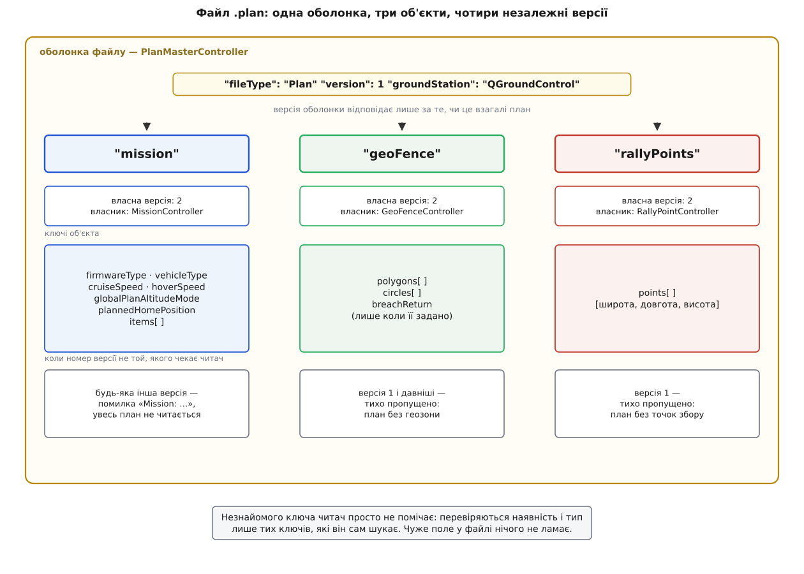

# 🗂 Формат файлу `.plan`: ключі, версії, поля елемента

Це структурна довідка формату `.plan`: які ключі стоять на верхньому рівні, які поля має кожен із трьох вкладених об'єктів, з чого складається один елемент маршруту — і що станеться, коли номер версії у файлі не той, на який читач розраховував. Потрібна вона тоді, коли план треба розібрати або скласти стороннім інструментом — скриптом, конвертером, власною наземною станцією, — не вгадуючи назв полів із чужих прикладів.

Імена й числа звірено з апстримом `mavlink/qgroundcontrol`, гілка `master` (лінія 5.x, серпень 2026), і з довідником розробника `qgc-dev-guide`. Там, де лінія `Stable_V4.4` називає те саме інакше, це сказано окремо. Формат — звичайний [JSON](topic:sf-data/json-format): текстове подання об'єктів і масивів, у якому порядок ключів не значить нічого, а дробові числа пишуться через крапку. QGroundControl записує ключі за абеткою, але читає в будь-якому порядку.

## Оболонка: шість ключів верхнього рівня

| Ключ | Тип | Обов'язковий | Значення |
|------|-----|--------------|----------|
| `fileType` | рядок | так | Завжди `"Plan"` |
| `version` | ціле | так | Версія оболонки; чинна — `1` |
| `groundStation` | рядок | так | Хто створив файл; QGroundControl пише `"QGroundControl"` |
| `mission` | об'єкт | так | Маршрут разом із шапкою плану |
| `geoFence` | об'єкт | так | Геозона; може бути порожньою |
| `rallyPoints` | об'єкт | так | Точки збору; можуть бути порожні |

Слово «необов'язковий» у довіднику розробника про геозону й точки збору стосується **вмісту, а не ключа**. Сам ключ мусить бути: під час читання станція перевіряє наявність усіх трьох об'єктів і лише потім віддає кожен своєму контролерові. План без геозони записується не як відсутній ключ, а як `{"circles": [], "polygons": [], "version": 2}` — порожній об'єкт із проставленою версією.

Ключ `groundStation` теж не декоративний: це єдине, чим зовнішній файл плану відрізняється від внутрішніх службових файлів станції, побудованих на тій самій оболонці. Перевірка зовнішнього файлу вимагає його наявності окремим кроком, до всього іншого.

## Чотири номери версій, а не один

| Рівень | Де стоїть `version` | Чинне значення | Хто ним відає |
|--------|---------------------|----------------|---------------|
| файл | верхній рівень | `1` | `PlanMasterController` |
| маршрут | `mission.version` | `2` | `MissionController` |
| геозона | `geoFence.version` | `2` | `GeoFenceController` |
| точки збору | `rallyPoints.version` | `2` | `RallyPointController` |
| одна межа | `geoFence.polygons[].version`, `geoFence.circles[].version` | `1` | клас межі |
| складений елемент | `mission.items[].version` | своє в кожного різновиду | клас елемента |

Версій насправді більше за чотири: вкладені об'єкти всередині геозони й усередині складених елементів мають ще й власні. Правило скрізь однакове — **номер версії стоїть рівно там, де закінчується відповідальність одного класу**. Той, хто пише шматок файлу, той і піднімає його номер, і нікого більше це не обходить. Такий поділ — звичайна практика [версіювання формату](topic:com-protocol/api-versioning), де незалежні частини змінюються з різною швидкістю; тут вона доведена до кінця й видна прямо у файлі.



*Оболонка відповідає лише за те, чи це взагалі план; усе решта — справа трьох контролерів, кожен зі своїм номером версії.*

## Об'єкт `mission` (версія 2)

| Ключ | Тип | Значення |
|------|-----|----------|
| `version` | ціле | `2` |
| `firmwareType` | ціле | Значення переліку `MAV_AUTOPILOT` — під який автопілот складали план |
| `vehicleType` | ціле | Значення переліку `MAV_TYPE` — під який тип апарата |
| `cruiseSpeed` | число | Крейсерська швидкість літака чи VTOL між точками, м/с |
| `hoverSpeed` | число | Швидкість мультикоптера, м/с |
| `globalPlanAltitudeMode` | ціле | Режим висоти на весь план (таблиця нижче) |
| `plannedHomePosition` | масив із 3 | `[широта, довгота, висота над рівнем моря]` |
| `items` | масив | Елементи маршруту: `SimpleItem` і `ComplexItem` упереміш |

Чотири з цих полів — не частина маршруту, а **умови, за яких його складали**. `firmwareType` і `vehicleType` кажуть, під що план розраховано: набір доступних команд у літака й мультикоптера різний, і станція за цими двома числами вирішує, який словник команд показувати, коли апарат не під'єднано. `cruiseSpeed` і `hoverSpeed` не потрапляють на борт узагалі — вони потрібні лише редакторові, щоб порахувати очікуваний час польоту.

`plannedHomePosition` — заплановане положення дому, а не домашня точка апарата: справжній дім автопілот визначає сам при зброєнні. Третє число тут — висота над середнім рівнем моря, тобто над [геоїдом](topic:math-geometry/geoid-and-amsl), а не над еліпсоїдом, який видає GPS-приймач.

## Елемент маршруту: `SimpleItem`

| Ключ | Тип | Значення |
|------|-----|----------|
| `type` | рядок | `"SimpleItem"` |
| `command` | ціле | Номер команди з переліку `MAV_CMD` |
| `frame` | ціле | Система координат, значення `MAV_FRAME` |
| `params` | масив із 7 | `param1`…`param4`, `x`, `y`, `z` — зміст залежить від команди |
| `autoContinue` | булеве | Чи переходити до наступного елемента самому |
| `doJumpId` | ціле | Стала тотожність елемента; нумерується з `1` |
| `Altitude` | число | Висота, як її бачить користувач у редакторі |
| `AltitudeMode` | ціле | Режим висоти цього елемента (таблиця нижче) |
| `AMSLAltAboveTerrain` | число або `null` | Абсолютна висота, порахована з рельєфу; `null`, коли даних рельєфу нема |

Перші шість ключів — це рівно те, що поїде на борт: вони один в один лягають на поля повідомлення `MISSION_ITEM_INT`. Що саме означають сім параметрів для кожної команди, розібрано в [елементах місії MAVLink](topic:sys-dron/mavlink-mission-items); загальний перелік номерів команд — у [командах MAVLink](topic:sys-dron/mavlink-commands).

| Позиція в `params` | Ім'я в MAVLink | Що звичайно вміщає |
|--------------------|----------------|--------------------|
| 0 | `param1` | Своє в кожної команди: витримка, кут, швидкість |
| 1 | `param2` | Своє в кожної команди |
| 2 | `param3` | Своє в кожної команди |
| 3 | `param4` | Часто курс; `null`, коли байдуже |
| 4 | `x` | Широта, градуси (у файлі — дробове число, не ціле ×10⁷) |
| 5 | `y` | Довгота, градуси |
| 6 | `z` | Висота в системі, заданій `frame` |

Останні три ключі — `Altitude`, `AltitudeMode`, `AMSLAltAboveTerrain` — **на борт не їдуть**. Це пам'ять редактора про те, як саме користувач задав висоту, і вона ширша за те, що вміщає `frame`. Число, яке людина набрала в полі, лежить в `Altitude`, а `params[6]` містить уже перерахований результат; якщо режим вимагає знання рельєфу, порахована абсолютна висота осідає в `AMSLAltAboveTerrain`. Записуються ці три ключі лише для команд, які взагалі задають висоту. Коли їх у файлі нема, читач відступає на запасний шлях: бере висоту з `params[6]`, а режим виводить із `frame`.

| Значення | Ім'я в лінії 4.4 | Ім'я в лінії 5.x | Що означає |
|----------|------------------|------------------|------------|
| `0` | `AltitudeModeMixed` | `AltitudeFrameMixed` | План не нав'язує режиму — кожен елемент має свій |
| `1` | `AltitudeModeRelative` | `AltitudeFrameRelative` | Від точки дому; `MAV_FRAME_GLOBAL_RELATIVE_ALT` |
| `2` | `AltitudeModeAbsolute` | `AltitudeFrameAbsolute` | Над рівнем моря; `MAV_FRAME_GLOBAL` |
| `3` | `AltitudeModeCalcAboveTerrain` | `AltitudeFrameCalcAboveTerrain` | Станція сама рахує абсолютну висоту з карти рельєфу |
| `4` | `AltitudeModeTerrainFrame` | `AltitudeFrameTerrain` | Над рельєфом, рахує борт; `MAV_FRAME_GLOBAL_TERRAIN_ALT` |
| `5` | `AltitudeModeNone` | `AltitudeFrameNone` | Відстань, не пов'язана із землею — наприклад, до стіни споруди |

Перелік у лінії 5.x перейменовано з `AltMode` на `AltitudeFrame`, а всі його імена — з `AltitudeMode…` на `AltitudeFrame…`. **Числа при цьому лишилися ті самі**, тому файли між лініями сумісні: перейменування зачепило код, не формат. Той самий перелік обслуговує й `globalPlanAltitudeMode`, і поле `AltitudeMode` окремого елемента, але значення `0` в них читається по-різному: у плані воно означає «режими мішані, дивись кожен елемент», а в елемента такого сенсу мати не може. Чому режимів аж шість і що коштує кожен, розібрано в [рельєфі й режимах висоти](topic:sys-dron/terrain-and-altitude).

Окремої уваги вартий `doJumpId`. Це не номер елемента в списку, а **його стала тотожність**: видається один раз і не змінюється, скільки б разів елемент не пересували. Порядкові номери в маршруті обчислювані й «пливуть» при кожній вставці, тому команда переходу посилається саме на `doJumpId`, а справжній номер підставляється в останню мить — коли модель перетворюється на список для борту.

## Елемент маршруту: `ComplexItem`

Складений елемент — це один запис у файлі, який при завантаженні на борт розгортається в десятки звичайних команд. Спільних у нього лише три ключі, решта залежить від різновиду.

| Ключ | Тип | Значення |
|------|-----|----------|
| `type` | рядок | `"ComplexItem"` |
| `complexItemType` | рядок | Різновид: `"survey"`, `"CorridorScan"`, `"StructureScan"`, `"fwLandingPattern"`, `"VTOLLandingPattern"` |
| `version` | ціле | Власна версія цього різновиду |

| `complexItemType` | Головні власні ключі |
|-------------------|----------------------|
| `"survey"` | `angle`, `entryLocation`, `flyAlternateTransects`, `polygon`, `TransectStyleComplexItem` |
| `"CorridorScan"` | `CorridorWidth`, `EntryPoint`, `polyline`, `TransectStyleComplexItem` |
| `"StructureScan"` | `Altitude`, `altitudeRelative`, `StructureHeight`, `Layers`, `polygon`, `CameraCalc` |

Вкладений об'єкт `TransectStyleComplexItem` збирає те, що спільне для всіх зйомок галсами: `CameraCalc` із параметрами камери, `CameraTriggerInTurnAround`, `FollowTerrain`, `HoverAndCapture`, `Refly90Degrees`, `TurnAroundDistance`, а також `Items` і `VisualTransectPoints` — уже пораховані команди й лінії для показу на карті.

Номери версій складених елементів рухаються **незалежно від решти формату й найчастіше за все**: у чинному довіднику розробника для `survey` стоїть `4`, для `StructureScan` — `2`, а для `CorridorScan` таблиця й приклад розходяться між собою. Саме тому зашивати ці числа в сторонній розбирач не варто — читайте `version` із файлу. Як із одного контуру народжуються галси, показано в [патернах зйомки](topic:sys-dron/survey-patterns).

## Об'єкт `geoFence` (версія 2)

| Ключ | Тип | Значення |
|------|-----|----------|
| `version` | ціле | `2` |
| `polygons` | масив | Полігональні межі |
| `circles` | масив | Кругові межі |
| `breachReturn` | масив із 3 | `[широта, довгота, висота]` — куди вертатися при порушенні межі |

`breachReturn` записується, **лише коли точку задано**; у плані без неї ключа просто нема, і це не помилка. У довіднику розробника цього ключа не описано взагалі — його існування видно з коду контролера, який пише його при збереженні й читає при завантаженні.

| Елемент `polygons[]` | Тип | Значення |
|----------------------|-----|----------|
| `version` | ціле | `1` |
| `inclusion` | булеве | `true` — «лише всередині»; `false` — «сюди не можна» |
| `polygon` | масив пар | `[[широта, довгота], …]` — вершини |

| Елемент `circles[]` | Тип | Значення |
|---------------------|-----|----------|
| `version` | ціле | `1` |
| `inclusion` | булеве | Те саме, що в полігона |
| `circle.center` | масив із 2 | `[широта, довгота]` |
| `circle.radius` | число | Радіус у метрах |

Прапорець `inclusion` перевертає зміст межі цілком: увімкнений — це огорожа, за яку не можна вийти, вимкнений — заборонена зона, у яку не можна зайти. Один план вільно вміщає обидва різновиди водночас. Що з цим робить борт, коли межу порушено, — у [геозоні автопілота](topic:sys-dron/geofence).

## Об'єкт `rallyPoints` (версія 2)

| Ключ | Тип | Значення |
|------|-----|----------|
| `version` | ціле | `2` |
| `points` | масив трійок | `[[широта, довгота, висота над домом], …]` |

Найпростіший із трьох об'єктів: жодних вкладених версій, жодних прапорців, самі координати. Висота тут відлічується від дому, а не від рівня моря — на відміну від третього числа в `plannedHomePosition`.

## Повний невеликий файл

Один зліт, одна точка маршруту, одна кругова межа, одна точка збору:

```json
{
    "fileType": "Plan",
    "groundStation": "QGroundControl",
    "version": 1,
    "mission": {
        "version": 2,
        "firmwareType": 12,
        "vehicleType": 2,
        "cruiseSpeed": 15,
        "hoverSpeed": 5,
        "globalPlanAltitudeMode": 1,
        "plannedHomePosition": [49.8397, 24.0297, 296.0],
        "items": [
            {
                "type": "SimpleItem",
                "command": 22,
                "frame": 3,
                "params": [0, 0, 0, null, 49.8399, 24.0300, 40],
                "autoContinue": true,
                "doJumpId": 1,
                "Altitude": 40,
                "AltitudeMode": 1,
                "AMSLAltAboveTerrain": null
            },
            {
                "type": "SimpleItem",
                "command": 16,
                "frame": 3,
                "params": [0, 0, 0, null, 49.8412, 24.0335, 60],
                "autoContinue": true,
                "doJumpId": 2,
                "Altitude": 60,
                "AltitudeMode": 1,
                "AMSLAltAboveTerrain": null
            }
        ]
    },
    "geoFence": {
        "version": 2,
        "polygons": [],
        "circles": [
            {
                "version": 1,
                "inclusion": true,
                "circle": {
                    "center": [49.8397, 24.0297],
                    "radius": 500.0
                }
            }
        ]
    },
    "rallyPoints": {
        "version": 2,
        "points": [
            [49.8390, 24.0280, 50]
        ]
    }
}
```

Команда `22` — це `MAV_CMD_NAV_TAKEOFF`, команда `16` — `MAV_CMD_NAV_WAYPOINT`, `frame` `3` — `MAV_FRAME_GLOBAL_RELATIVE_ALT`, тобто висота відлічується від дому. `firmwareType` `12` означає PX4, `vehicleType` `2` — мультикоптер. `geoFence` тут має порожній масив полігонів, але сам ключ присутній; `breachReturn` не задано, тому його нема.

## Сумісність версій: що робить читач

| Що не збігається | Поведінка QGroundControl |
|------------------|--------------------------|
| `fileType` ≠ `"Plan"` | `Incorrect file type key expected:%1 actual:%2` — файл не читається |
| `version` оболонки новіша за підтримувану | `File version %1 is newer than current supported version %2` |
| `version` оболонки надто давня | `File version %1 is no longer supported` |
| нема ключа `groundStation` | Помилка перевірки зовнішнього файлу |
| `mission.version` ≠ `2` | Помилка з префіксом `Mission: ` — увесь план не читається |
| `geoFence.version` ≤ `1` | **Тихо пропущено**: план читається, геозони в ньому не буде |
| `geoFence.version` інша, ніж `2` | `GeoFence supports version %1` — увесь план не читається |
| `rallyPoints.version` = `1` | **Тихо пропущено**: план читається, точок збору не буде |
| `rallyPoints.version` інша, ніж `2` | `Rally Points supports version %1` — увесь план не читається |
| незнайомий ключ в об'єкті | Не помічається: перевіряються лише ті ключі, яких читач шукає |

У цій таблиці три різні відповіді на одне питання, і різниця між ними важить більше, ніж здається.

**Давня версія — тиха втрата.** Геозона версії `1` і точки збору версії `1` не спричиняють помилки: читач мовчки пропускає такий об'єкт і йде далі. Файл відкривається, план на карті виглядає цілим — а межі в ньому вже нема. Це навмисна поблажливість до старих файлів, і коштує вона рівно того, що втрату не видно.

> 🔧 **Навіщо це.** План, збережений давньою станцією, відкриється без жодного попередження — і поїде на борт без геозони, яка в ньому колись була. Після відкриття чужого чи старого `.plan` межі варто передивитися очима, а не покластися на те, що файл прочитався без помилки.

**Новіша версія — відмова цілком.** Якщо номер об'єкта більший за очікуваний, читач не намагається розібрати те, чого не розуміє: він зупиняє читання всього плану. Логіка тут не в суворості, а в чесності — прочитати новий формат старим кодом означало б мовчки втратити ті самі поля, заради яких версію й підняли, і віддати користувачеві план, який виглядає правильним, але ним не є.

**Незнайомий ключ — байдужість.** Перевірка дивиться лише на ті ключі, які сама шукає: чи є потрібні й чи того вони типу. Зайве поле поруч нікого не турбує. Це дає стороннім інструментам просту й надійну свободу: до плану можна дописати власні метадані — ім'я оператора, ідентифікатор завдання, підпис — і QGroundControl прочитає такий файл без заперечень. Зберегти їх він, щоправда, не збереже: при записі план складається наново з моделі редактора, і все, чого модель не знає, зникає. Сувора перевірка, яка лається на кожен невідомий ключ (`Unknown key: %1`), у коді теж є, але для плану її не вживають.

Практичний висновок для стороннього розбирача звідси один: перевіряйте `fileType`, читайте `version` кожного об'єкта **з файлу**, а не з пам'яті, і трактуйте номер, більший за очікуваний, як відмову, а не як привід «спробувати все одно».
