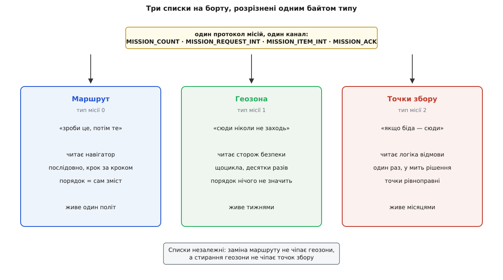
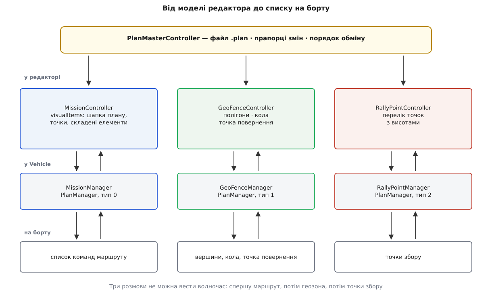
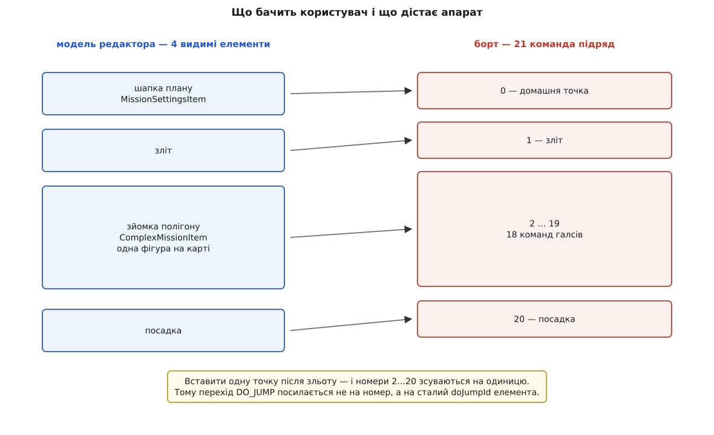
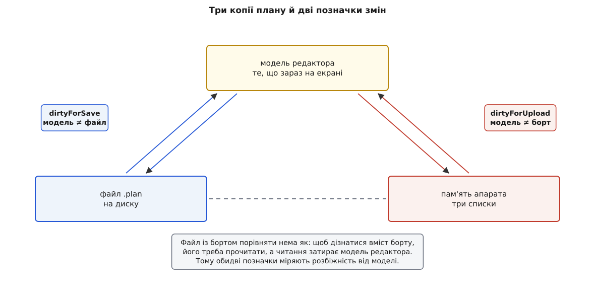

# Модель плану: місія, геозона, точки збору

<preknowlist>
- [Протокол місій MAVLink](root:sys-dron/mavlink-mission-protocol) — діалог «скільки елементів → дай номер N → ось він → підтвердження», з якого складається передавання списку по радіо.
- [MAVLink: місія й команди польоту](root:sys-dron/mavlink-mission-items) — з чого складається один елемент: номер команди, система координат (frame), сім числових параметрів.
- [Геозона в автопілоті](root:sys-dron/geofence) — межа, за яку апаратові виходити не можна, і що автопілот робить, коли її порушено.
- [Vehicle](root:sys-dron/vehicle-object) — об'єкт застосунку, що відповідає одному апаратові й володіє окремим менеджером під кожен протокол.
- [JSON](root:sf-data/json-format) — текстове подання об'єктів і масивів; у ньому записано файл плану.
</preknowlist>

На екрані планування користувач бачить одну річ. Він клацає по карті маршрут, обводить полігон, ставить пару запасних точок посадки, натискає «Зберегти» — і дістає **один файл**. Натискає «Завантажити на борт» — і бачить **одну** смужку поступу. Усе поводиться так, ніби план — це документ, цілісний і неподільний.

На борту такого документа немає. Автопілот не має пам'яті під «план». Він має **три окремі списки**, кожен зі своїм номером типу, своїм лічильником елементів і своїм незалежним життям. Завантаження нового маршруту не чіпає геозону; стирання геозони не чіпає точок збору; апарат може мати маршрут і не мати геозони взагалі. Цілісність плану — вигадка наземної станції, і вся модель планування в QGroundControl побудована навколо того, щоб цю вигадку тримати чесно: показувати користувачеві один документ, а спілкуватися з бортом трьома різними розмовами.

Розібратися варто саме з цієї межі, бо майже кожна дивина в поведінці планувальника — від двох різних позначок «не збережено» до полігону, що після завантаження з борту розпався на невідомі команди, — виростає рівно з неї.

## Чому списків три, а не один

Питання не риторичне: маршрут, межа й запасні точки — усе це «географія завдання», і скласти їх в один список технічно нескладно. Проте кожен із трьох відповідає на **своє питання**, і питання ці автопілот ставить у різні моменти й різними частинами коду.

**Маршрут — це наказ.** Список кроків, які апарат виконує один за одним: злети, лети сюди, покрути камерою, лети туди, сідай. Читає його навігатор, і читає **послідовно**: у кожен момент є поточний елемент, і вся суть списку в тому, який елемент іде після якого. Порядок тут — сам зміст.

**Геозона — це обмеження.** Не «зроби», а «ніколи не опиняйся». Її читає не навігатор, а сторож безпеки, і читає він її **щоцикла**, десятки разів на секунду, незалежно від того, що зараз робить апарат — летить за маршрутом, слухається пульта чи висить на місці. Порядок полігонів у геозоні не значить нічого: усі обмеження діють водночас.

**Точки збору — це таблиця відповідей.** Ані наказ, ані обмеження: перелік місць, куди апаратові розумно повертатися, якщо щось пішло не так. Читає їх [логіка відмовобезпеки](root:sys-dron/failsafe) — і читає **один раз, у момент рішення**: сталася біда, треба обрати найближчу з відомих точок. Поза цим моментом список лежить мертвим вантажем.

Три різні читачі, три різні ритми читання. Але вирішальний аргумент за поділ — не це, а **різна тривалість життя**.

Маршрут міняється щополіт, а часто й кілька разів за політ. Геозона задається раз на майданчик і живе тижнями. Точки збору задаються раз на район і живуть іще довше. Якби все лежало в одному списку, то передавання нового маршруту неминуче означало б передавання всього — бо протокол уміє замінювати список тільки цілком, а не редагувати його по шматочку. Пілот, який на полі поміняв дві точки маршруту, щоразу перезаливав би й геозону, і точки збору; будь-який збій посеред цієї передачі лишав би апарат без захисту, який до того працював. Розділені списки роблять неможливим цілий клас таких аварій: те, чого ти не чіпав, не могло зіпсуватися.

Тому в MAVLink у кожного елемента списку є поле **типу місії**: `MAV_MISSION_TYPE_MISSION` (0) — маршрут, `MAV_MISSION_TYPE_FENCE` (1) — геозона, `MAV_MISSION_TYPE_RALLY` (2) — точки збору. Поле стоїть у кожному повідомленні протоколу — і в лічильнику `MISSION_COUNT`, і в запиті `MISSION_REQUEST_INT`, і в самому елементі, і в підтвердженні `MISSION_ACK`. Фактично це не одне сховище з трьома розділами, а **три сховища, до яких ведуть три однакові двері**.



*Один діалог протоколу, розрізнений полем типу місії, обслуговує три незалежні списки з різними читачами й різною тривалістю життя.*

## Той самий протокол, тричі

Наслідок для застосунку прямий: якщо на дроті три однакові розмови, то в коді має бути **один** клас розмови з параметром.

Так і зроблено. У QGroundControl є `PlanManager` — реалізація протоколу місій, конструктор якої приймає тип: `PlanManager(Vehicle* vehicle, MAV_MISSION_TYPE planType)`. Від нього успадковані `MissionManager`, `GeoFenceManager` і `RallyPointManager`, і всі троє живуть усередині `Vehicle` — по одному примірнику на апарат, як і решта протокольних менеджерів.

Усередині `PlanManager` — машина стану з таймаутами, бо радіо губить пакети, а протокол побудований на черзі «запит — відповідь». Кожен крок розмови чекає підтвердження **1500 мс**; якщо очікуваний елемент не прийшов, менеджер перепитує через **250 мс** і робить щонайбільше **п'ять** спроб, після чого здається з помилкою. Стан розмови описано двома невеликими переліками: чого саме зараз чекають (`AckMissionCount`, `AckMissionItem`, `AckMissionRequest`, `AckMissionClearAll`) і що взагалі відбувається (`TransactionRead`, `TransactionWrite`, `TransactionRemoveAll`). Одна з можливих помилок зветься `MissionTypeMismatch` — вона спрацьовує, коли апарат відповідає елементом чужого типу.

Ця помилка виглядає параноєю, поки не згадати, що всі три розмови йдуть **одним каналом і одним протоколом**, розрізняючись єдиним байтом. Автопілот зі старою або недбалою реалізацією здатен відповісти на запит вершини геозони елементом маршруту — і без перевірки типу вершина полігону тихо стала б точкою маршруту. Байт типу тут не формальність, а єдине, що відділяє один список від іншого.

> 🔧 **Навіщо це.** Коли з борту не читається геозона, а маршрут читається чудово, шукати поломку в каналі чи в розборі MAVLink немає сенсу: дорога до самого байта в обох випадках спільна, і розходяться вони аж на полі типу. Дивитися треба або на біти можливостей апарата, або на те, що прошивка відповідає на `MISSION_REQUEST_LIST` із типом 1.

## Дзеркало в застосунку

Три менеджери на боці апарата — це нижня половина. Верхня половина живе в редакторі й влаштована **симетрично**: `MissionController`, `GeoFenceController`, `RallyPointController`. Кожен контролер тримає модель, з якою працює екран, і знає, як перекласти її в елементи для свого менеджера й назад.

Над трьома контролерами стоїть `PlanMasterController` — той самий, що створює для користувача ілюзію єдиного документа. Володіє він усіма трьома як звичайними полями, а назовні виставляє їх окремими властивостями (`missionController`, `geoFenceController`, `rallyPointController`), бо екранам потрібні саме вони: карта маршруту звертається до одного, редактор полігону — до другого.



*Кожен рівень має по три незалежні примірники; єдиною річчю план стає лише в господарі — у файлі, у прапорцях змін і в кнопці завантаження.*

Постає розумне питання: якщо всі три дороги незалежні, навіщо взагалі господар? Відповідь у трьох речах, які тільки він і робить.

**Файл.** Три моделі треба записати в один `.plan` і прочитати з нього назад.

**Прапорці змін.** Користувач має бачити одну позначку «не збережено», а не три.

**Порядок обміну.** Три розмови не можна вести водночас — вони йдуть **одним каналом до одного апарата**. Тому `sendToVehicle()` шле маршрут, і лише в обробнику завершення бере геозону, а після неї — точки збору; читання побудоване так само, ланцюжком зворотних викликів `_loadMissionComplete → _loadGeoFenceComplete → _loadRallyPointsComplete`. Прапорці `_sendGeoFence` і `_sendRallyPoints` у господаря — це пам'ять про те, що ланцюжок ще не добіг до кінця. Що саме відбувається під час самого обміну — черга запитів, звірка, поведінка при обриві — розібрано в темі про [обмін планом із апаратом](root:sys-dron/plan-exchange).

Далі кожну з трьох доріг варто пройти окремо, бо перекладають вони по-різному, і саме в різниці перекладу ховається все цікаве.

## Маршрут: список, який не збігається сам із собою

Маршрут — єдина з трьох частин, де модель редактора **принципово не така**, як список на борту. Дві інші перекладаються майже механічно; ця — ні.

Причина проста: борт розуміє лише плаский перелік елементарних команд, а користувач мислить осмисленими цілями. «Зняти цей полігон галсами з перекриттям 70 %» — одна дія в голові й одна фігура на карті, але тридцять чотири команди на борту. Якби редактор працював у термінах борту, користувач мусив би рухати тридцять чотири точки замість одного контуру, а поняття «перекриття» не існувало б узагалі — воно розчинилося б у координатах.

Тому `MissionController` тримає **дві різні речі**. Модель `visualItems` — те, що видно на екрані й чим користувач керує. І окремо — перелік елементів місії, який народжується з неї в момент завантаження на борт або запису у файл. У моделі три різновиди елементів:

- `MissionSettingsItem` — завжди перший, завжди рівно один. Не команда, а **шапка плану**: заплановане положення дому, швидкості, початкові налаштування камери, дія по завершенні місії.
- `SimpleMissionItem` — одна команда MAVLink як вона є: летіти до точки, зависнути, зробити знімок, змінити швидкість.
- `ComplexMissionItem` — складений елемент, що на екрані виглядає однією фігурою, а на борт вивантажується десятками команд: зйомка полігону, коридорна зйомка, обліт споруди, схема посадки літака. Про них — окрема тема про [патерни зйомки](root:sys-dron/survey-patterns).

Перший різновид заслуговує на увагу окремо, бо він розв'язує незручність самого протоколу. У списку місії MAVLink елемент **з номером 0 — це домашня точка**: не наказ, а довідка про те, звідки апарат злетів і куди повертатиметься. Домашню точку не можна ані видалити, ані пересунути в середину списку. Редакторові потрібна річ, яку не можна видалити й яка завжди стоїть першою, — саме нею й є `MissionSettingsItem`. Заразом до неї причеплено все, що стосується плану **загалом**, а не окремого кроку: у моделі редактора цим налаштуванням є де жити, а на борту вони або розчиняються в командах, або лягають у ту саму нульову позицію.

### Нумерація, яка перераховується щоразу

Номер елемента в списку місії — не декорація. Автопілот доповідає ним про поточний крок, за ним працює відновлення місії з середини, і на нього посилається команда переходу `DO_JUMP`, яка робить із маршруту цикл.

Але номер не належить елементові — він **обчислюється з позиції**. Складені елементи розгортаються в різну кількість команд залежно від своїх налаштувань: підкрутили перекриття зйомки — галсів стало більше, і всі номери після нього поїхали. Тому `MissionController` після кожної зміни викликає `_recalcSequence()` і роздає номери наново.

**Умова.** Маршрут із чотирьох видимих елементів: шапка, зліт, зйомка полігону (розгортається в 18 команд), посадка.

```
видимий елемент          номер на борту      скільки команд
шапка (домашня точка)    0                   1
зліт                     1                   1
зйомка полігону          2 … 19              18
посадка                  20                  1
                                             ──
усього на борту                              21
```

Тепер користувач вставляє одну точку між зльотом і зйомкою:

```
шапка                    0
зліт                     1
нова точка               2                   ← вставлено
зйомка полігону          3 … 20              усі номери зсунулися на 1
посадка                  21
```

Одна вставка посунула вісімнадцять номерів. Якби команда `DO_JUMP` десь у маршруті зберігала ціль числом «21», після цієї вставки вона вказувала б уже не на посадку, а на останній галс зйомки — і апарат зациклився б у зйомці назавжди.

Саме тому в моделі редактора кожен елемент має **сталий власний ідентифікатор** `doJumpId`, який видається один раз і не змінюється від пересувань. Команди переходу посилаються на нього, а справжній номер підставляється лише в останню мить, коли модель перетворюється на список для борту. Це класичний прийом: **стала тотожність усередині, обчислена позиція назовні** — і без нього редагувати маршрут із циклами було б неможливо.

> 🔧 **Навіщо це.** Із цього поділу випливає практичне правило: усе, що бачить користувач, живе в `visualItems`, а все, що бачить апарат, народжується заново під час вивантаження. Якщо на борту опинилося не те, чого ви чекали, дивитися треба не на модель — вона майже напевно правильна, — а на перетворення. Побачити його цілком, від файлу до плаского списку з номерами, можна в [розборі перетворення плану](root:sys-dron/plan-model/proj-plan-json-roundtrip.md).

Повний перелік команд, доступних у маршруті, і те, як кожна лягає в сім параметрів елемента, — тема про [елементи місії й команди](root:sys-dron/mission-items). Окремої розмови варта висота: у моделі вона може бути задана над точкою зльоту, над рівнем моря або над рельєфом, і від цього залежить, що саме потрапить у параметри команди — це тема про [рельєф і режими висоти](root:sys-dron/terrain-and-altitude).



*Видимих елементів чотири, команд на борту двадцять одна; вставка однієї точки перенумеровує половину списку, тому переходи посилаються не на номери, а на сталі ідентифікатори.*

## Геозона: список, що лише прикидається списком команд

Геозона в моделі — три різні речі: **полігони**, **кола** й **точка повернення при порушенні**. Полігон і коло бувають двох ґатунків: **включні** (апарат мусить лишатися всередині) і **виключні** (апарат не має права заходити). Полігонів і кіл може бути скільки завгодно й у будь-якому поєднанні; точка повернення — одна, і це місце, куди апаратові прямувати, якщо межу таки перетнуто.

Складність починається на дроті. Протокол місій уміє передавати **лише елементи місії** — команду з номером, системою координат і сімома параметрами. Іншого способу передати геозону в ньому немає. Тому геометрію доводиться вкладати у форму команди, хоча жодною командою вона не є:

| що передається | команда | ключові параметри |
|---|---|---|
| вершина включного полігону | `MAV_CMD_NAV_FENCE_POLYGON_VERTEX_INCLUSION` (5001) | param1 — **скільки всього вершин у цьому полігоні**; param5, param6 — широта й довгота вершини |
| вершина виключного полігону | `MAV_CMD_NAV_FENCE_POLYGON_VERTEX_EXCLUSION` (5002) | те саме |
| включне коло | `MAV_CMD_NAV_FENCE_CIRCLE_INCLUSION` (5003) | param1 — радіус у метрах; param5, param6 — центр |
| виключне коло | `MAV_CMD_NAV_FENCE_CIRCLE_EXCLUSION` (5004) | те саме |
| точка повернення | `MAV_CMD_NAV_FENCE_RETURN_POINT` (5000) | param5, param6, param7 — широта, довгота, висота |

Коло вкладається природно: одна фігура — один елемент. Полігон — ні. **Одна вершина — один елемент**, а вершин у полігоні може бути десяток, і жодного способу сказати «наступні вісім елементів — це одна фігура» протокол не має. Групування доводиться відновлювати з двох підказок: **порядку** й **лічильника вершин у param1**, який повторено в кожній вершині полігону.

Ось як це виглядає, коли геозона з двох фігур їде на борт:

```
seq  команда                              param1   широта     довгота
 0   FENCE_POLYGON_VERTEX_INCLUSION (5001)   4    50.450100  30.523400
 1   FENCE_POLYGON_VERTEX_INCLUSION (5001)   4    50.450100  30.528900
 2   FENCE_POLYGON_VERTEX_INCLUSION (5001)   4    50.446800  30.528900
 3   FENCE_POLYGON_VERTEX_INCLUSION (5001)   4    50.446800  30.523400
 4   FENCE_CIRCLE_EXCLUSION         (5004)  35.0  50.448300  30.525700
 5   FENCE_RETURN_POINT             (5000)   0    50.449000  30.526000
```

Читаючи це назад, `GeoFenceManager` бачить у нульовому елементі команду вершини й число 4. Отже, він відкриває новий полігон і **чекає рівно чотирьох** вершин цієї самої команди з тим самим числом. Набравши четверту, полігон закриває. Наступний елемент іншої команди — коло, воно самодостатнє. Далі точка повернення.

І тут стає видно, наскільки крихке це кодування. Якщо в потоці забракло вершини — полігон лишиться недобраним, і менеджер повідомить про неповну фігуру. Якщо в сусідніх вершин розійшлися лічильники — межа між полігонами не визначена, і це теж помилка. Якщо серед елементів трапиться незнайома команда — весь список сумнівний, бо порядок є єдиною структурою, а незрозумілий елемент рве саме порядок. Тому перевірки на читанні тут суворі до прискіпливості: краще чесно відмовитися показати геозону, ніж намалювати на карті фігуру не тієї форми, довіряючи якій пілот полетить за реальну межу.

> 🔧 **Навіщо це.** Звідси випливає корисна звичка: після вивантаження геозони на апарат варто **прочитати її назад** і подивитися на карту. Це не забобон — саме зворотне читання ловить втрату вершини, яку вивантаження показало як успішне. Тим більше що успіх вивантаження означає лише «борт прийняв список», а не «борт зрозумів фігуру так само, як ви».

Є ще одна межа, яку легко сплутати з геозоною, і від цього виникає найчастіше непорозуміння. Крім плану, у прошивок є **проста кругова межа, задана параметром**: `GF_MAX_HOR_DIST` у PX4, `FENCE_RADIUS` разом із `FENCE_ENABLE` і `FENCE_TYPE` у ArduPilot. Це не список і до плану не належить — це звичайні параметри апарата, які живуть своїм життям і доїжджають на борт зовсім іншим протоколом. `GeoFenceController` читає їх окремою властивістю `paramCircularFence` і показує саме як **параметр**, а не як частину плану. Плутанина небезпечна практично: стерти геозону з плану й не помітити, що радіус у параметрі досі діє, — цілком робочий спосіб отримати незрозумілу відмову посеред польоту.

## Точки збору: найпростіший зі списків

Після геозони точки збору здаються дрібницею — і справді нею є. Модель — просто перелік точок, кожна з координатою й висотою. На дроті кожна точка стає одним елементом `MAV_CMD_NAV_RALLY_POINT` (5100) з широтою, довготою й висотою в параметрах 5, 6 і 7. Ані групування, ані лічильників, ані порядку, що щось означає: точки рівноправні, і апарат просто обере з них найдоречнішу, коли настане час. За яким правилом він обирає і чим точка збору відрізняється від дому — тема про [точки збору в автопілоті](root:sys-dron/rally-points); станції це правило не належить, вона лише передає перелік.

Саме на цій простоті добре видно, що поділ на три списки — не про складність даних, а про **різницю призначення**. Список із трьох координат заслуговує на власний тип місії не тому, що його складно передати, а тому, що його читає інший читач і в інший момент.

## Коли апарат не вміє

Не кожен автопілот підтримує всі три списки. Прошивка може знати маршрут і не знати геозони; може знати геозону й не знати точок збору. Питати про це навмання неможливо: спроба прочитати непідтримуваний список у кращому разі закінчиться таймаутом за півтори секунди, у гіршому — незрозумілою помилкою.

Тому апарат повідомляє про свої вміння сам. У повідомленні `AUTOPILOT_VERSION` є бітове поле можливостей, і в ньому два потрібні біти: `MAV_PROTOCOL_CAPABILITY_MISSION_FENCE` і `MAV_PROTOCOL_CAPABILITY_MISSION_RALLY`. Контролери геозони й точок збору дивляться саме на них — і, якщо біт не піднято, розділ у редакторі просто не з'являється, а обмін для нього не заводиться.

Тонкість у тому, що **модель від цього не порожніє**. Геозона, складена для одного апарата, лишається у файлі й у пам'яті редактора, навіть коли підключено апарат, який геозон не розуміє: біт можливостей вимикає обмін, а не дані. Інакше під'єднання чужого апарата тихо знищувало б частину чужої роботи.

## План без апарата

Найпоширеніший спосіб складати план — за столом, коли жодного апарата поруч немає. Але вся модель дотепер спиралася на `Vehicle`: менеджери живуть у ньому, набір доступних команд залежить від прошивки, оцінка тривалості польоту — від крейсерської швидкості.

Розв'язано це не другим, «безапаратним» шляхом, а несправжнім апаратом. `PlanMasterController` тримає **два** покажчики на `Vehicle`:

- `controllerVehicle` — апарат, **для якого** складається план. Коли справжнього немає, це створений застосунком офлайновий `Vehicle` без каналу, з типом апарата, класом прошивки й швидкостями, узятими з налаштувань.
- `managerVehicle` — апарат, **з яким** зараз ідуть розмови. Коли зв'язку немає, це той самий офлайновий об'єкт; щойно з'явився справжній, обидва покажчики починають вказувати на нього.

Поділ на два покажчики виглядає надлишковим, поки не станеться очевидне: користувач складав план для коптера, а під'єднав літак. Об'єкт, **для якого** складено план, і об'єкт, **з яким** зараз говорить застосунок, розійшлися по суті — набір команд у літака інший, схема посадки інша, швидкості інші. Мовчки перемкнути план на новий апарат означало б непомітно спотворити його; мовчки не перемикати — показувати пілотові чужий план як план під'єднаної машини. Тому `PlanMasterController` у такій ситуації шле сигнал `promptForPlanUsageOnVehicleChange` і питає користувача, що робити з тим, що зараз у редакторі. Це один із небагатьох випадків, коли застосунок свідомо відмовляється вирішувати сам, — бо жоден із варіантів не є безпечним за замовчуванням.

## Файл `.plan`

Файл — місце, де три списки нарешті стають одним. Це звичайний JSON із трьома вкладеними об'єктами:

```json
{
  "fileType": "Plan",
  "version": 1,
  "groundStation": "QGroundControl",
  "mission":     { "version": 2, "items": [ ... ], "plannedHomePosition": [ ... ] },
  "geoFence":    { "version": 2, "polygons": [ ... ], "circles": [ ... ] },
  "rallyPoints": { "version": 2, "points": [ ... ] }
}
```

Найцікавіше тут — **чотири незалежні номери версій**. Зовнішня версія файлу (`kPlanFileVersion = 1`) відповідає лише за оболонку: чи є взагалі три ключі й чи це справді план. Кожен із трьох об'єктів має власну версію (усі три зараз — 2), і за неї відповідає **свій контролер**: `MissionController` читає й пише свій об'єкт, `GeoFenceController` — свій, `RallyPointController` — свій.

Чому не одна версія на все — видно з того самого поділу відповідальности. Формат опису маршруту змінюється часто: додався різновид складеного елемента, змінився спосіб запису висоти. Формат опису точок збору не змінювався роками. Спільна версія змушувала б підіймати номер усім трьом через зміну в одному й перевіряти сумісність там, де нічого не рухалося. Роздільні версії дають кожному контролерові право розвивати свій шматок формату самостійно — і водночас дозволяють старому файлу зі старим маршрутом і новою геозоною читатися без ритуальних перетворень. Повний перелік ключів усіх чотирьох рівнів, разом із полями окремого елемента, зібрано в [довідці формату плану](root:sys-dron/plan-model/api-plan-file.md).

Один файл замість трьох — рішення не первісне. До версії 3.2 QGroundControl зберігав маршрут, геозону й точки збору **окремими файлами** з розширеннями `.mission`, `.fence` і `.rally`; об'єднання в один `.plan` з'явилося саме тоді. Причина суто практична: три файли, які треба тримати разом і які легко розгубити або переплутати між майданчиками, — гірша річ, ніж один файл, у якому щось із трьох може бути порожнім.

Варто помітити ще одну асиметрію. У файлі є `plannedHomePosition` — та сама заплановане положення дому з шапки маршруту. Це **не** домашня точка апарата: справжній дім автопілот визначає сам у момент зброєння, за своїм GPS. Заплановане положення потрібне лише редакторові — щоб намалювати лінію від старту до першої точки, оцінити відстань і час, показати, звідки все почнеться. Плутати їх — розповсюджена помилка: пересунути заплановану точку в редакторі й чекати, що апарат повернеться саме туди, марно.

## Три копії плану й дві позначки змін

Тепер видно всю картину, і з неї випливає остання, найпрактичніша частина моделі. План у будь-який момент існує в **трьох місцях**: у моделі редактора, у файлі на диску, у пам'яті апарата. Розходитися вони можуть як завгодно, а користувачеві треба показати щось просте й правдиве.

`PlanMasterController` тримає **дві** булеві властивості:

- `dirtyForSave` — модель редактора розійшлася з файлом;
- `dirtyForUpload` — модель редактора розійшлася з тим, що на борту.



*Дві незалежні розбіжності — «не збережено» й «не завантажено»; третя, між файлом і бортом, застосункові невідома.*

Прапорців саме два, а не один, бо дії користувача рухають ці розбіжності **незалежно**:

```
дія                             dirtyForSave   dirtyForUpload
відкрито файл                       ні              ТАК
прочитано план з борту              ні               ні
змінено елемент у редакторі        ТАК              ТАК
збережено у файл                    ні              ТАК
завантажено на борт                ТАК               ні
```

Два рядки в цій таблиці варті окремого погляду.

**Відкрито файл — і план одразу «не завантажений».** Це не помилка: щойно прочитаний із диска план збігається з файлом ідеально, але про борт нічого не відомо, а мовчазне припущення «там те саме» — саме те припущення, яке в польотах коштує апаратів. Тому невідомість трактується як розбіжність.

**Збережено у файл — а «не завантажено» лишилося.** Збереження на диск не має жодного стосунку до борту, і показувати після нього чистий стан означало б брехати.

Прапорця «файл розійшовся з бортом» немає, і не могло бути. Застосунок не знає, що лежить на борту, поки не прочитає його, — а читання затирає модель редактора. Порівняти файл із бортом, не чіпаючи роботи користувача, просто нема як. Тому обидві позначки міряють розбіжність **від моделі редактора**: вона єдина завжди під рукою.

Поряд із ними є `syncInProgress` — правда, якщо хоч один із трьох контролерів зараз розмовляє з апаратом. Властивість спільна навмисне: розмови йдуть одна за одною одним каналом, і починати другу, поки не скінчилася перша, не можна.

Є й четвертий стан, який легко проґавити: план буває **тимчасово незбережним**. Метод `readyForSaveState()` обходить елементи й питає кожного, чи готовий той записатися. Найчастіша причина неготовности — висоти рельєфу, яких елемент запросив і ще не дочекався: записати такий елемент означало б записати невідому висоту. Кнопка збереження в цей момент неактивна не через збій, а тому, що плану ще нема чого сказати про себе повністю.

## Що з цього виходить

Модель плану в QGroundControl цілком продиктована формою протоколу — і це не вада, а чесність. На борту немає плану, є три списки; отже, у застосунку три контролери, три менеджери, три об'єкти у файлі й три незалежні номери версій. Усе, що зводить їх докупи, зібрано в одному місці — у `PlanMasterController`, і його роль неважко назвати одним словом: він робить **документ** із трьох речей, які документом не є.

Ціна такого рішення видна в дрібницях, і кожну з них варто впізнавати. Полігон, який на дроті існує лише як послідовність вершин із повтореним лічильником, — крихкий, і його треба перечитувати. Номери елементів маршруту — обчислювані, тому посилання всередині плану ведуться не на них. Дві позначки змін замість однієї — бо розбіжностей справді дві, і зливати їх було б брехнею. Заплановане положення дому — річ редактора, а не апарата. Кругова межа з параметра — не частина плану взагалі.

Знизу до цієї моделі підходить [обмін планом із апаратом](root:sys-dron/plan-exchange): черга запитів, повтори, звірка після запису, поведінка при обриві на середині списку. Збоку — [елементи місії й команди](root:sys-dron/mission-items), де розібрано, що саме вміщає одна команда й чому сім параметрів. Зверху — [патерни зйомки](root:sys-dron/survey-patterns), тобто те, як з одного контуру на карті народжуються десятки галсів, і [рельєф і режими висоти](root:sys-dron/terrain-and-altitude), де вирішується, від чого відлічувати висоту кожної точки.
