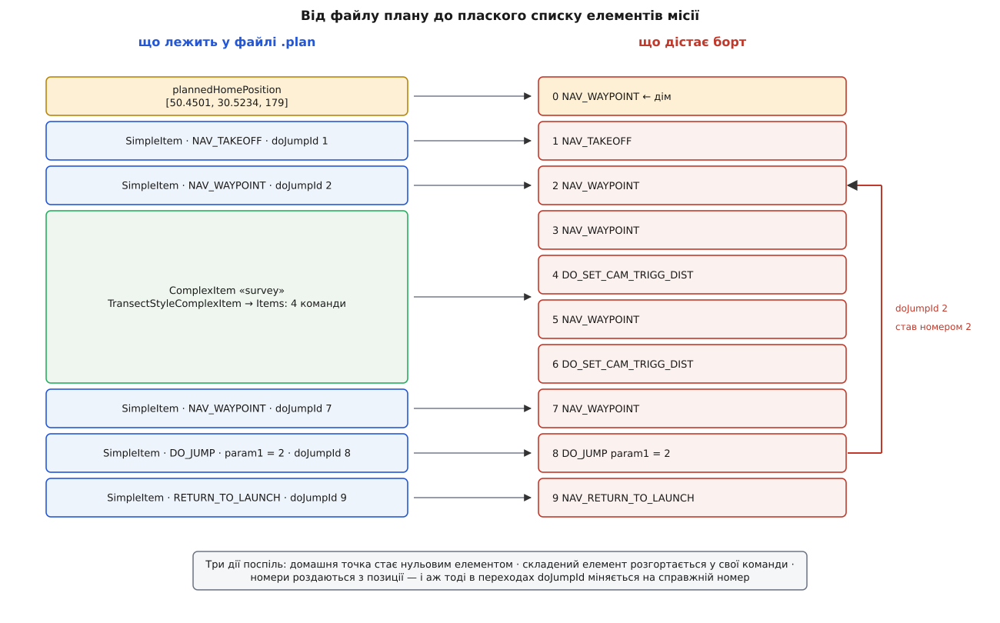
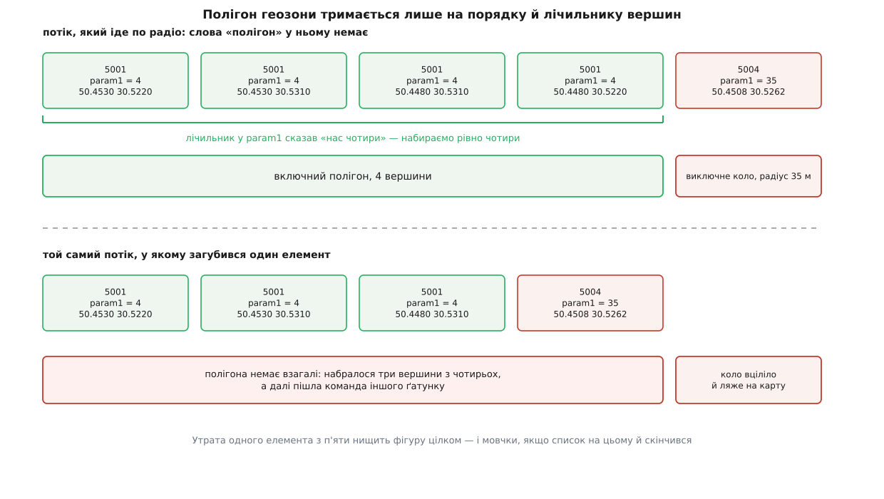

# ⚙️ Файл `.plan` очима борту: розбір із робочим кодом

Це невелика програма, яка перетворює збережений `.plan` на той самий плаский список команд, що його автопілот дістане по радіо, — щоб подивитися на план очима апарата, не піднімаючи ані станції, ані самого апарата. Дорогою стане видно, чому номера елемента у файлі немає взагалі, звідки він береться й що це робить із переходами.

## Задача

На вході — файл. На виході — список, у якому кожен рядок є одним елементом місії MAVLink: номер, команда, система координат, сім числових параметрів. Що вміщає один такий елемент і чому параметрів саме сім — тема про [елементи місії й команди](root:sys-dron/mission-items); тут вони цікавлять нас як готова форма, у яку все врешті лягає. Сам файл — звичайний [JSON](root:sf-data/json-format), текстове дерево об'єктів і масивів.

П'ять речей, які треба зробити правильно:

1. **Домашня точка.** У файлі вона лежить окремим ключем `plannedHomePosition`, поза списком елементів. На дроті вона — звичайний нульовий елемент.
2. **Прості елементи** переносяться майже як є — з однією тонкістю в параметрах, через яку легко змінити наказ, не помітивши цього.
3. **Складений елемент** — одна фігура у файлі — розгортається у стільки команд, скільки в ньому насправді.
4. **Наскрізна нумерація.** Номерів у файлі немає; вони обчислюються з позиції в готовому списку.
5. **Переходи.** Команда `DO_JUMP` у файлі посилається не на номер, а на сталу тотожність `doJumpId`; справжній номер підставляється в останню мить.

Навіщо це поза станцією: звірити план із тим, що вже лежить на борту; прогнати перевірку плану в складанні, не піднімаючи вікон; згодувати список симуляторові; зрозуміти, чому апарат після зйомки пішов не туди.

## Що у файлі є і чого в ньому немає

Ось місія з невеликого плану — зліт, точка, зйомка полігону, ще точка, перехід і повернення додому:

```json
{
  "fileType": "Plan", "version": 1, "groundStation": "QGroundControl",
  "mission": {
    "version": 2, "firmwareType": 12, "vehicleType": 2,
    "cruiseSpeed": 15, "hoverSpeed": 5, "globalPlanAltitudeMode": 1,
    "plannedHomePosition": [50.4501, 30.5234, 179],
    "items": [
      { "type": "SimpleItem", "command": 22, "frame": 3, "autoContinue": true, "doJumpId": 1,
        "params": [15, 0, 0, null, 50.4501, 30.5234, 50],
        "Altitude": 50, "AltitudeMode": 1, "AMSLAltAboveTerrain": null },

      { "type": "SimpleItem", "command": 16, "frame": 3, "autoContinue": true, "doJumpId": 2,
        "params": [0, 0, 0, null, 50.4509, 30.5241, 50],
        "Altitude": 50, "AltitudeMode": 1, "AMSLAltAboveTerrain": null },

      { "type": "ComplexItem", "complexItemType": "survey", "version": 5,
        "angle": 0, "entryLocation": 0,
        "polygon": [[50.4520, 30.5240], [50.4520, 30.5290], [50.4495, 30.5290], [50.4495, 30.5240]],
        "TransectStyleComplexItem": {
          "version": 2, "CameraShots": 24,
          "Items": [
            { "type": "SimpleItem", "command": 16,  "frame": 3, "autoContinue": true, "doJumpId": 3,
              "params": [0, 0, 0, null, 50.4519, 30.5243, 50] },
            { "type": "SimpleItem", "command": 206, "frame": 2, "autoContinue": true, "doJumpId": 4,
              "params": [25, 0, 0, 0, 0, 0, 0] },
            { "type": "SimpleItem", "command": 16,  "frame": 3, "autoContinue": true, "doJumpId": 5,
              "params": [0, 0, 0, null, 50.4497, 30.5243, 50] },
            { "type": "SimpleItem", "command": 206, "frame": 2, "autoContinue": true, "doJumpId": 6,
              "params": [0, 0, 0, 0, 0, 0, 0] }
          ]
        } },

      { "type": "SimpleItem", "command": 16, "frame": 3, "autoContinue": true, "doJumpId": 7,
        "params": [0, 0, 0, null, 50.4506, 30.5252, 50],
        "Altitude": 50, "AltitudeMode": 1, "AMSLAltAboveTerrain": null },

      { "type": "SimpleItem", "command": 177, "frame": 2, "autoContinue": true, "doJumpId": 8,
        "params": [2, 2, 0, 0, 0, 0, 0] },

      { "type": "SimpleItem", "command": 20, "frame": 2, "autoContinue": true, "doJumpId": 9,
        "params": [0, 0, 0, 0, 0, 0, 0] }
    ]
  }
}
```

Числа команд тут справжні: 22 — зліт, 16 — політ до точки, 206 — умикання знімання через задану відстань, 177 — перехід, 20 — повернення до старту. Число `frame` — система координат: 3 означає висоту над домашньою точкою, 2 — що координат у команді немає взагалі.

У цьому масиві шість елементів; на борт поїде десять команд. А номера — того самого, яким автопілот доповідає про поточний крок, — у файлі немає ніде.

Три розбіжності між файлом і дротом видно одразу.

**Дім стоїть осторонь.** `plannedHomePosition` — не крок маршруту, а довідка «звідки все почнеться», і в редакторі вона живе в шапці плану. У списку ж MAVLink домашня точка займає нульову позицію як звичайний елемент — тож її треба зліпити самому.

**Складений елемент — одна річ.** Об'єкт `"type": "ComplexItem"` описує зйомку полігону так, як її задав користувач: контур, кут галсів, точка входу. Те, у що це перетворюється — окремі галси й команди камери, — лежить усередині, у вкладеному `TransectStyleComplexItem` під ключем `Items`. Станція зберігає туди вже розгорнуті команди навмисно: щоб не перераховувати геометрію [зйомки](root:sys-dron/survey-patterns) щоразу, коли файл відкривають. Для нашої задачі це подарунок — розгортати нічого не треба, досить узяти готове.

**Номерів немає, є тотожності.** Замість номера кожен елемент несе `doJumpId`, а команда переходу тримає цю тотожність у своєму першому параметрі: `"params": [2, 2, …]` означає «перейти на елемент із тотожністю 2, повторити двічі». Це не примха формату, а єдиний спосіб пережити редагування: досить укинути одну точку перед зйомкою — і всі номери після неї поїдуть, а тотожність не зрушить.

> 🔧 **Навіщо це.** Звідси випливає порядок дій, який не можна переставити. Нумерувати можна лише після розгортання — доти невідомо, скільки позицій займе складений елемент. Підставляти номери в переходи можна лише після нумерації — доти невідомо, який номер має ціль. Тому проходів рівно три, і саме в такому порядку.



*Шість об'єктів у файлі стають десятьма командами; перехід, що у файлі вказував на тотожність 2, на дроті вказує на номер 2 — збіг тут випадковий і зникне після першої ж вставки.*

## Код

Мова — C++, як і в самій станції: програма повторює її рішення крок у крок, і тримати обидві сторони однією мовою простіше, ніж щоразу звіряти переклад. Розбір JSON — `nlohmann/json`, один заголовний файл. Друга вкладка — те саме на Python, коли треба швидко зазирнути в чужий файл і нічого не збирати.

:::tabs
```cpp
// plan_flatten.cpp — .plan → список елементів місії, як його побачить борт.
// збірка: c++ -std=c++17 plan_flatten.cpp -o plan_flatten

#include <nlohmann/json.hpp>

#include <cmath>
#include <cstdio>
#include <fstream>
#include <limits>
#include <map>
#include <stdexcept>
#include <string>
#include <vector>

using json = nlohmann::json;

constexpr int kNavWaypoint = 16;    // MAV_CMD_NAV_WAYPOINT
constexpr int kDoJump      = 177;   // MAV_CMD_DO_JUMP
constexpr int kFrameGlobal = 0;     // MAV_FRAME_GLOBAL — висота над рівнем моря

struct Item {
    int         seq      = 0;       // номер, якого у файлі немає: він обчислюється
    int         command  = 0;
    int         frame    = 0;
    bool        autoCont = true;
    double      p[7]     = {};
    std::string origin;             // звідки взявся елемент — лише для звіту
};

struct FlatMission {
    std::vector<Item>  items;
    std::map<int, int> seqOfJumpId;  // doJumpId → номер, лише прості елементи
};

// У JSON немає способу записати NaN, тому станція пише замість нього null.
// «Не задано» і «нуль» — різні накази: нуль у куті означає «дивитися на північ».
static double num(const json& value)
{
    return value.is_null() ? std::numeric_limits<double>::quiet_NaN()
                           : value.get<double>();
}

static Item itemFromJson(const json& object, std::string origin)
{
    const json& params = object.at("params");
    if (params.size() != 7) {
        throw std::runtime_error("елемент має " + std::to_string(params.size()) +
                                 " параметрів замість семи");
    }
    Item item;
    item.command  = object.at("command").get<int>();
    item.frame    = object.at("frame").get<int>();
    item.autoCont = object.value("autoContinue", true);
    for (int i = 0; i < 7; ++i) {
        item.p[i] = num(params[i]);
    }
    item.origin = std::move(origin);
    return item;
}

// Домашня точка: у файлі окремий ключ, на дроті — звичайний елемент у позиції 0.
static Item homeItem(const json& mission)
{
    const json& home = mission.at("plannedHomePosition");  // [широта, довгота, висота]
    Item item;
    item.command = kNavWaypoint;
    item.frame   = kFrameGlobal;
    item.p[4]    = num(home[0]);
    item.p[5]    = num(home[1]);
    item.p[6]    = num(home[2]);
    item.origin  = "plannedHomePosition";
    return item;
}

// Прохід перший — розгортання, прохід другий — нумерація.
static FlatMission flatten(const json& mission)
{
    FlatMission flat;
    flat.items.push_back(homeItem(mission));

    for (const json& object : mission.at("items")) {
        const std::string type = object.at("type").get<std::string>();

        if (type == "SimpleItem") {
            if (object.contains("doJumpId")) {
                // простий елемент займе рівно одну позицію — ту, що зараз наприкінці
                flat.seqOfJumpId[object["doJumpId"].get<int>()] =
                        static_cast<int>(flat.items.size());
            }
            flat.items.push_back(itemFromJson(object, "SimpleItem"));
        } else if (type == "ComplexItem") {
            const std::string kind = object.at("complexItemType").get<std::string>();
            const auto inner = object.find("TransectStyleComplexItem");
            if (inner == object.end() || !inner->contains("Items")) {
                throw std::runtime_error("складений елемент «" + kind +
                                         "» не тримає у файлі готових команд");
            }
            for (const json& sub : inner->at("Items")) {
                flat.items.push_back(itemFromJson(sub, kind));
            }
        } else {
            throw std::runtime_error("невідомий тип елемента: " + type);
        }
    }

    for (std::size_t i = 0; i < flat.items.size(); ++i) {
        flat.items[i].seq = static_cast<int>(i);
    }
    return flat;
}

// Прохід третій: тотожність → номер. Раніше його зробити не було з чого.
static void resolveJumps(FlatMission& flat)
{
    for (Item& item : flat.items) {
        if (item.command != kDoJump) {
            continue;
        }
        const int targetId = static_cast<int>(std::lround(item.p[0]));
        const auto found = flat.seqOfJumpId.find(targetId);
        if (found == flat.seqOfJumpId.end()) {
            throw std::runtime_error("DO_JUMP веде на doJumpId " + std::to_string(targetId) +
                                     ", якого в плані немає");
        }
        item.p[0] = found->second;
    }
}

// PX4 не бере домашньої точки в нульовій позиції, ArduPilot бере.
static void dropHome(std::vector<Item>& items)
{
    items.erase(items.begin());
    for (Item& item : items) {
        item.seq -= 1;
        if (item.command == kDoJump) {
            item.p[0] -= 1;
        }
    }
}

static const char* commandName(int command)
{
    switch (command) {
    case 16:  return "NAV_WAYPOINT";
    case 20:  return "NAV_RETURN_TO_LAUNCH";
    case 21:  return "NAV_LAND";
    case 22:  return "NAV_TAKEOFF";
    case 177: return "DO_JUMP";
    case 178: return "DO_CHANGE_SPEED";
    case 206: return "DO_SET_CAM_TRIGG_DIST";
    default:  return "?";
    }
}

static void show(const std::vector<Item>& items, const char* title)
{
    std::printf("%s\n", title);
    std::printf("seq  команда                frame     p1     широта    довгота  висота  джерело\n");
    for (const Item& item : items) {
        std::printf("%3d  %-22s %5d %6.0f  %9.4f  %9.4f  %6.1f  %s\n",
                    item.seq, commandName(item.command), item.frame,
                    item.p[0], item.p[4], item.p[5], item.p[6], item.origin.c_str());
    }
    std::printf("\n");
}

int main(int argc, char** argv)
{
    if (argc != 2) {
        std::fprintf(stderr, "вжиток: plan_flatten <файл.plan>\n");
        return 2;
    }
    try {
        std::ifstream file(argv[1]);
        if (!file) {
            throw std::runtime_error("файл не відкривається");
        }
        const json plan = json::parse(file);
        if (plan.value("fileType", std::string()) != "Plan") {
            throw std::runtime_error("це не файл плану");
        }

        FlatMission flat = flatten(plan.at("mission"));
        resolveJumps(flat);

        show(flat.items, "ArduPilot: домашня точка лишається номером 0");
        dropHome(flat.items);
        show(flat.items, "PX4: домашньої точки на дроті немає, решта зсунулася на одиницю");
    } catch (const std::exception& error) {
        std::fprintf(stderr, "план не розібрано: %s\n", error.what());
        return 1;
    }
    return 0;
}
```
```python
# -*- coding: utf-8 -*-
"""plan_flat.py — той самий розбір коротко: чим саме стане .plan на дроті."""
import json, math, sys

NAV_WAYPOINT, DO_JUMP, FRAME_GLOBAL = 16, 177, 0

NAMES = {16: "NAV_WAYPOINT", 20: "NAV_RETURN_TO_LAUNCH", 21: "NAV_LAND",
         22: "NAV_TAKEOFF", 177: "DO_JUMP", 178: "DO_CHANGE_SPEED",
         206: "DO_SET_CAM_TRIGG_DIST"}


def num(value):
    return math.nan if value is None else float(value)      # null у файлі — це NaN


def one(obj, origin):
    params = obj["params"]
    if len(params) != 7:
        raise ValueError("елемент має %d параметрів замість семи" % len(params))
    return dict(seq=0, command=obj["command"], frame=obj["frame"],
                p=[num(x) for x in params], origin=origin)


def flatten(mission):
    lat, lon, alt = (num(x) for x in mission["plannedHomePosition"])
    flat = [dict(seq=0, command=NAV_WAYPOINT, frame=FRAME_GLOBAL,
                 p=[0, 0, 0, 0, lat, lon, alt], origin="plannedHomePosition")]
    seq_of_id = {}

    for obj in mission["items"]:
        if obj["type"] == "SimpleItem":
            if "doJumpId" in obj:
                seq_of_id[obj["doJumpId"]] = len(flat)
            flat.append(one(obj, "SimpleItem"))
        elif obj["type"] == "ComplexItem":
            kind = obj["complexItemType"]
            inner = obj.get("TransectStyleComplexItem", {})
            if "Items" not in inner:
                raise ValueError("складений «%s» не тримає у файлі готових команд" % kind)
            flat += [one(sub, kind) for sub in inner["Items"]]
        else:
            raise ValueError("невідомий тип елемента: %s" % obj["type"])

    for seq, item in enumerate(flat):
        item["seq"] = seq
    for item in flat:
        if item["command"] == DO_JUMP:
            target = int(item["p"][0])
            if target not in seq_of_id:
                raise ValueError("DO_JUMP веде на doJumpId %d, якого в плані немає" % target)
            item["p"][0] = seq_of_id[target]
    return flat


def drop_home(flat):
    del flat[0]
    for item in flat:
        item["seq"] -= 1
        if item["command"] == DO_JUMP:
            item["p"][0] -= 1


def show(flat, title):
    print(title)
    print("seq  команда                frame     p1     широта    довгота  висота  джерело")
    for it in flat:
        print("%3d  %-22s %5d %6.0f  %9.4f  %9.4f  %6.1f  %s" % (
            it["seq"], NAMES.get(it["command"], "?"), it["frame"],
            it["p"][0], it["p"][4], it["p"][5], it["p"][6], it["origin"]))
    print()


plan = json.load(open(sys.argv[1], encoding="utf-8"))
flat = flatten(plan["mission"])
show(flat, "ArduPilot: домашня точка лишається номером 0")
drop_home(flat)
show(flat, "PX4: домашньої точки на дроті немає, решта зсунулася на одиницю")
```
:::

На нашому файлі це друкує:

```
ArduPilot: домашня точка лишається номером 0
seq  команда                frame     p1     широта    довгота  висота  джерело
  0  NAV_WAYPOINT               0      0    50.4501    30.5234   179.0  plannedHomePosition
  1  NAV_TAKEOFF                3     15    50.4501    30.5234    50.0  SimpleItem
  2  NAV_WAYPOINT               3      0    50.4509    30.5241    50.0  SimpleItem
  3  NAV_WAYPOINT               3      0    50.4519    30.5243    50.0  survey
  4  DO_SET_CAM_TRIGG_DIST      2     25     0.0000     0.0000     0.0  survey
  5  NAV_WAYPOINT               3      0    50.4497    30.5243    50.0  survey
  6  DO_SET_CAM_TRIGG_DIST      2      0     0.0000     0.0000     0.0  survey
  7  NAV_WAYPOINT               3      0    50.4506    30.5252    50.0  SimpleItem
  8  DO_JUMP                    2      2     0.0000     0.0000     0.0  SimpleItem
  9  NAV_RETURN_TO_LAUNCH       2      0     0.0000     0.0000     0.0  SimpleItem
```

Колонка «джерело» — не прикраса: рядки 3–6 узялися з одного об'єкта у файлі, і саме вони роз'їдуться, щойно користувач поворухне контур зйомки.

## Останній крок робить не файл, а прошивка

Список готовий — але одне число в ньому ще може змінитися, і файл до цього непричетний. Автопілоти не згодні між собою, чи має домашня точка їхати по дроту. ArduPilot чекає її нульовим елементом; PX4 не хоче її взагалі й вимагає, щоб маршрут починався з першої справжньої команди. Станція розв'язує це на самому виході, у спільній для трьох списків машині обміну:

```cpp
bool skipFirstItem = _planType == MAV_MISSION_TYPE_MISSION &&
                     !_vehicle->firmwarePlugin()->sendHomePositionToVehicle();
// …
    if (skipFirstItem) {
        // Home is in sequence 0, remainder of items start at sequence 1
        item->setSequenceNumber(item->sequenceNumber() - 1);
        if (item->command() == MAV_CMD_DO_JUMP) {
            item->setParam1((int)item->param1() - 1);
        }
    }
```

Дві дії в одному місці варті уваги. Номер зсувається на одиницю — це очевидно. Але разом із ним зсувається `param1` у кожному переході, бо той уже не тотожність, а номер; забути про нього означало б відправити апарат на сусідній крок. Ось той самий план для PX4:

```
PX4: домашньої точки на дроті немає, решта зсунулася на одиницю
seq  команда                frame     p1     широта    довгота  висота  джерело
  0  NAV_TAKEOFF                3     15    50.4501    30.5234    50.0  SimpleItem
  1  NAV_WAYPOINT               3      0    50.4509    30.5241    50.0  SimpleItem
  2  NAV_WAYPOINT               3      0    50.4519    30.5243    50.0  survey
  3  DO_SET_CAM_TRIGG_DIST      2     25     0.0000     0.0000     0.0  survey
  4  NAV_WAYPOINT               3      0    50.4497    30.5243    50.0  survey
  5  DO_SET_CAM_TRIGG_DIST      2      0     0.0000     0.0000     0.0  survey
  6  NAV_WAYPOINT               3      0    50.4506    30.5252    50.0  SimpleItem
  7  DO_JUMP                    2      1     0.0000     0.0000     0.0  SimpleItem
  8  NAV_RETURN_TO_LAUNCH       2      0     0.0000     0.0000     0.0  SimpleItem
```

Практичний висновок неприємний: питання «який номер має третя точка мого маршруту» не має відповіді без назви прошивки. Той самий файл дає два різні списки, і апарат у польоті доповідатиме про поточний крок числами з тієї версії, яку прийняв. Як цей список їде на борт елемент за елементом — тема про [обмін планом із апаратом](root:sys-dron/plan-exchange).

## Зворотний бік: геозона з плаского потоку

Маршрут ми розгортали з файлу. Геозона цікава протилежним напрямком — тим, як її **збирають назад**, коли список прочитано з борту. [Геозона](root:sys-dron/geofence) — межа, за яку апаратові виходити не можна; у файлі вона лежить готовими фігурами:

```json
"geoFence": {
  "version": 2,
  "polygons": [
    { "version": 1, "inclusion": true,
      "polygon": [[50.4530, 30.5220], [50.4530, 30.5310], [50.4480, 30.5310], [50.4480, 30.5220]] }
  ],
  "circles": [
    { "version": 1, "inclusion": false,
      "circle": { "center": [50.4508, 30.5262], "radius": 35 } }
  ]
}
```

А протокол місій уміє передавати лише елементи — команду з номером і сімома параметрами. Коло вкладається в один елемент природно: центр у параметрах координат, радіус у першому. Полігон не вкладається ніяк: одна вершина — один елемент, і сказати «наступні чотири елементи є однією фігурою» протокол не вміє. Тому в кожну вершину кладуть **лічильник**: скільки всього вершин у полігоні, якому вона належить. Уся структура фігури тримається на цьому числі й на порядку елементів.

Ця програма проходить коло цілком: бере геозону з файлу, робить із неї потік елементів — точно як менеджер геозони перед вивантаженням, — а потім складає фігури назад із того потоку.

```cpp
// fence_roundtrip.cpp — геозона з .plan → потік елементів → геозона назад.
// збірка: c++ -std=c++17 fence_roundtrip.cpp -o fence_roundtrip

#include <nlohmann/json.hpp>

#include <cmath>
#include <cstdio>
#include <fstream>
#include <string>
#include <vector>

using json = nlohmann::json;

constexpr int kFenceReturnPoint   = 5000;   // MAV_CMD_NAV_FENCE_RETURN_POINT
constexpr int kFenceVertexInclude = 5001;   // …POLYGON_VERTEX_INCLUSION
constexpr int kFenceVertexExclude = 5002;   // …POLYGON_VERTEX_EXCLUSION
constexpr int kFenceCircleInclude = 5003;   // …CIRCLE_INCLUSION
constexpr int kFenceCircleExclude = 5004;   // …CIRCLE_EXCLUSION

struct FenceItem {
    int    command = 0;
    double p1  = 0.0;    // у вершині — скільки вершин у фігурі; у колі — радіус
    double lat = 0.0;
    double lon = 0.0;
};

struct Vertex  { double lat = 0.0, lon = 0.0; };

struct Polygon {
    bool                inclusion = true;
    std::vector<Vertex> path;
};

struct Circle {
    bool   inclusion = true;
    double lat = 0.0, lon = 0.0, radius = 0.0;
};

struct Fence {
    std::vector<Polygon>     polygons;
    std::vector<Circle>      circles;
    bool                     hasReturnPoint = false;
    Vertex                   returnPoint;
    std::vector<std::string> complaints;
};

// Напрям «на борт»: фігури → плаский потік.
static std::vector<FenceItem> fenceToItems(const json& geoFence)
{
    std::vector<FenceItem> items;

    for (const json& polygon : geoFence.value("polygons", json::array())) {
        const json& path      = polygon.at("polygon");
        const bool  inclusion = polygon.at("inclusion").get<bool>();
        for (const json& vertex : path) {
            FenceItem item;
            item.command = inclusion ? kFenceVertexInclude : kFenceVertexExclude;
            item.p1  = static_cast<double>(path.size());  // єдине, що тримає фігуру купи
            item.lat = vertex[0].get<double>();
            item.lon = vertex[1].get<double>();
            items.push_back(item);
        }
    }
    for (const json& circle : geoFence.value("circles", json::array())) {
        const json& shape = circle.at("circle");
        FenceItem item;
        item.command = circle.at("inclusion").get<bool>() ? kFenceCircleInclude
                                                          : kFenceCircleExclude;
        item.p1  = shape.at("radius").get<double>();
        item.lat = shape.at("center")[0].get<double>();
        item.lon = shape.at("center")[1].get<double>();
        items.push_back(item);
    }
    return items;
}

// Напрям «з борту»: потік → фігури. Стан набору — три змінні на весь розбір.
static Fence itemsToFence(const std::vector<FenceItem>& items)
{
    Fence fence;
    std::vector<Vertex> pending;         // вершини фігури, яка ще набирається
    int expectedCount   = 0;
    int expectedCommand = 0;

    auto dropUnfinished = [&](const std::string& where) {
        if (!pending.empty()) {
            fence.complaints.push_back("недобраний полігон: " +
                                       std::to_string(pending.size()) + " вершин із " +
                                       std::to_string(expectedCount) + ", " + where);
            pending.clear();
        }
    };

    for (std::size_t i = 0; i < items.size(); ++i) {
        const FenceItem&  item = items[i];
        const std::string at   = "елемент " + std::to_string(i) + ": ";

        if (item.command == kFenceVertexInclude || item.command == kFenceVertexExclude) {
            const int count = static_cast<int>(std::lround(item.p1));

            if (pending.empty()) {
                expectedCount   = count;
                expectedCommand = item.command;
                if (expectedCount < 3) {
                    fence.complaints.push_back(at + "полігон із " +
                                               std::to_string(expectedCount) + " вершин");
                    continue;
                }
            } else if (count != expectedCount) {
                fence.complaints.push_back(at + "лічильник вершин змінився посеред полігону");
                pending.clear();
                continue;
            } else if (item.command != expectedCommand) {
                fence.complaints.push_back(at + "ґатунок полігону змінився, поки він набирався");
                pending.clear();
                continue;
            }

            pending.push_back(Vertex{item.lat, item.lon});
            if (static_cast<int>(pending.size()) == expectedCount) {
                Polygon polygon;
                polygon.inclusion = (expectedCommand == kFenceVertexInclude);
                polygon.path      = pending;
                fence.polygons.push_back(polygon);
                pending.clear();
            }
        } else if (item.command == kFenceCircleInclude || item.command == kFenceCircleExclude) {
            dropUnfinished("а далі вже коло");
            Circle circle;
            circle.inclusion = (item.command == kFenceCircleInclude);
            circle.lat       = item.lat;
            circle.lon       = item.lon;
            circle.radius    = item.p1;
            fence.circles.push_back(circle);
        } else if (item.command == kFenceReturnPoint) {
            dropUnfinished("а далі вже точка повернення");
            fence.hasReturnPoint = true;
            fence.returnPoint    = Vertex{item.lat, item.lon};
        } else {
            fence.complaints.push_back(at + "незнайома команда " +
                                       std::to_string(item.command));
            break;    // порядок — єдина структура; після незрозумілого елемента її вже немає
        }
    }
    dropUnfinished("а список уже скінчився");
    return fence;
}

static void report(const Fence& fence, const char* title)
{
    std::printf("%s\n", title);
    for (const Polygon& polygon : fence.polygons) {
        std::printf("  полігон %s, вершин %zu\n",
                    polygon.inclusion ? "включний" : "виключний", polygon.path.size());
    }
    for (const Circle& circle : fence.circles) {
        std::printf("  коло %s, радіус %.0f м, центр %.4f %.4f\n",
                    circle.inclusion ? "включне" : "виключне",
                    circle.radius, circle.lat, circle.lon);
    }
    if (fence.hasReturnPoint) {
        std::printf("  точка повернення %.4f %.4f\n",
                    fence.returnPoint.lat, fence.returnPoint.lon);
    }
    for (const std::string& complaint : fence.complaints) {
        std::printf("  ! %s\n", complaint.c_str());
    }
    std::printf("\n");
}

int main(int argc, char** argv)
{
    if (argc != 2) {
        std::fprintf(stderr, "вжиток: fence_roundtrip <файл.plan>\n");
        return 2;
    }
    std::ifstream file(argv[1]);
    if (!file) {
        std::fprintf(stderr, "файл не відкривається\n");
        return 1;
    }
    const json plan = json::parse(file);

    const std::vector<FenceItem> wire = fenceToItems(plan.at("geoFence"));
    std::printf("на дріт іде %zu елементів:\n", wire.size());
    for (const FenceItem& item : wire) {
        std::printf("  %4d  p1=%-6.1f %9.4f  %9.4f\n",
                    item.command, item.p1, item.lat, item.lon);
    }
    std::printf("\n");

    report(itemsToFence(wire), "зібралося назад:");

    if (wire.size() > 3) {
        std::vector<FenceItem> lossy = wire;   // хай один елемент не долетить
        lossy.erase(lossy.begin() + 3);
        report(itemsToFence(lossy), "той самий потік без однієї вершини:");
    }
    return 0;
}
```

Вивід:

```
на дріт іде 5 елементів:
  5001  p1=4.0      50.4530    30.5220
  5001  p1=4.0      50.4530    30.5310
  5001  p1=4.0      50.4480    30.5310
  5001  p1=4.0      50.4480    30.5220
  5004  p1=35.0     50.4508    30.5262

зібралося назад:
  полігон включний, вершин 4
  коло виключне, радіус 35 м, центр 50.4508 30.5262

той самий потік без однієї вершини:
  коло виключне, радіус 35 м, центр 50.4508 30.5262
  ! недобраний полігон: 3 вершин із 4, а далі вже коло
```

Останні три рядки — уся суть цього кодування. Загублений елемент не робить полігон трохи меншим; він знищує його цілком, і на карті лишається саме коло.



*Чотири вершини з однаковим лічильником складаються в полігон; три вершини з чотирьох не складаються ні в що.*

Інші дві скарги ловлять решту способів зіпсувати той самий потік. Лічильник, що змінився посеред набору, означає, що межа між фігурами стала невизначеною: перші вершини вже прийнято під одне число, наступні прийшли з іншим — і сказати, де кінчається перша фігура, вже нема з чого. Незнайома команда спиняє розбір цілком, бо порядок є єдиною структурою цього списку, а незрозумілий елемент рве саме порядок. Окремо варто перевіряти й сам лічильник: нуль або одиниця в `param1` — це не полігон, і чесна скарга тут краща за набір, який ніколи не завершиться.

У самій станції цей розбір написано так само — і з двома дірками, які варто знати. Перевірку «а чи не лишилося недобраних вершин» там роблять лише перед колом; ані перед точкою повернення, ані наприкінці списку її немає, тож потік, що обірвався на середині полігону, зникає **мовчки**. Друга дірка тонша: змінна `loadFailed`, за якою мала б іти очистка після помилки, оголошена й перевіряється, але їй ніде не присвоюють `true` — тож навіть після скарги частково зібрані фігури доходять до контролера й лягають на карту. Обидві поведінки видно в чинному коді `GeoFenceManager::_planManagerLoadComplete()`; звідси й практичне правило перечитувати геозону після вивантаження та дивитися на карту, а не на повідомлення про успіх.

## Складність і пастки

Розбір лінійний: один прохід по файлу, один по готовому списку для нумерації, один для переходів; словник тотожностей робить пошук цілі логарифмічним. Станція шукає ціль вкладеним циклом по видимих елементах — квадратично, — і це нормально, бо видимих елементів десятки, а не тисячі; повторювати цей вибір у програмі, яка працює вже з розгорнутим списком у тисячі команд, не варто.

Що ламається на практиці:

**`doJumpId` у щойно збереженому файлі дорівнює номеру.** Станція, зберігаючи елемент, кладе туди його теперішній номер — тому спокуса взяти `param1` переходу за номер напряму спрацює майже завжди. І перестане спрацьовувати рівно тоді, коли файл прийде з іншої програми або хтось допише елемент руками. Зіставлення за тотожністю коштує один словник і не ламається ніколи.

**Перехід усередину складеного елемента неможливий.** Станція, читаючи файл, шукає тотожність цілі лише серед **простих** елементів верхнього рівня — команди всередині зйомки для неї невидимі. Файл із переходом на галс не відкриється взагалі: розбір спиниться з помилкою «Could not find doJumpId». Наш код розгортає все підряд і міг би таку ціль знайти, але робити цього не варто — вийшов би список, якого станція не покаже.

**Розгорнуті команди у файлі — кеш, а не істина.** Якщо правити `polygon` зйомки текстовим редактором і не чіпати `Items`, на борт поїде стара геометрія: станція після завантаження бере збережені елементи як є й перераховує їх лише тоді, коли щось у налаштуваннях складеного елемента справді зміниться.

**Не всі складені елементи кешують свої команди.** Готовий список тримають лише елементи галсової породи — зйомка полігону, коридорна зйомка. Схеми посадки зберігають параметри, з яких команди народжуються заново, і розгорнути їх без повторення тієї самої геометрії неможливо. Тому в коді тут виняток, а не мовчазний пропуск: краще відмовитися, ніж віддати неповний список як повний.

**`null` у параметрах — це NaN, а не нуль.** У JSON немає способу записати не-число, тому станція пише `null`, і в четвертому параметрі точки це означає «кут лишити як є». Наївне читання перетворить його на нуль — тобто на наказ «розвернутися на північ», який ніхто не давав. Чим NaN відрізняється від будь-якого числа й чому його не можна порівнювати звичним способом — тема про [числа з рухомою комою](root:hw-arch/floating-point).

**Старі файли влаштовані інакше.** У першій версії формату елемент мав чотири параметри й окремий ключ `coordinate`; нинішні сім параметрів зібрані з них. Файли тієї доби ще трапляються, і читач, який вимагає рівно семи параметрів, на них спіткнеться — з чесною помилкою, а не з тихим сміттям, і це правильний бік для помилки.

**Домашня точка у файлі — запланована.** Справжній дім автопілот визначає сам у момент зброєння, за своїм приймачем. Нульовий елемент, який ми зліпили з `plannedHomePosition`, потрібен станції, щоб намалювати лінію від старту й порахувати відстань; апарат може прийняти його й одразу перезаписати власним. Чекати, що апарат повернеться саме в цю точку, підстав немає.
