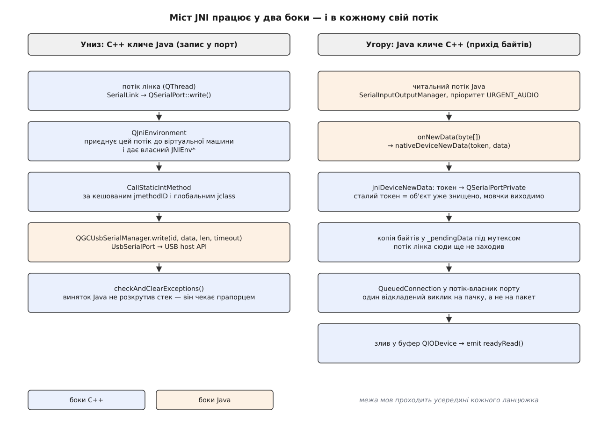
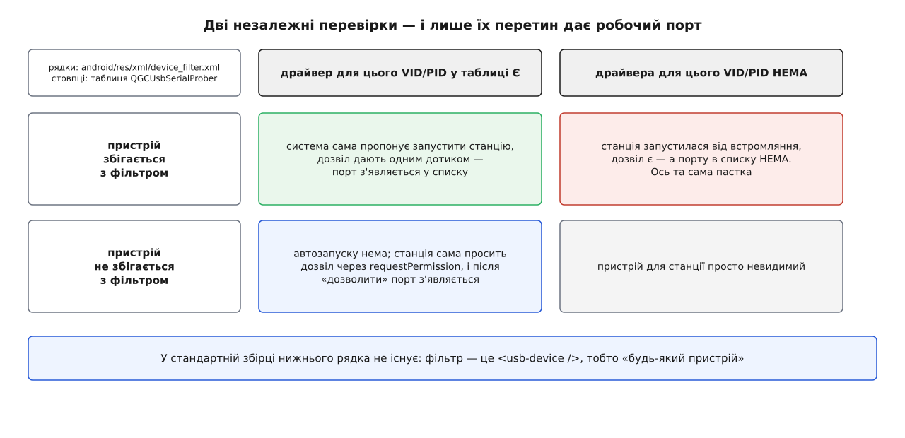

# ⚙️ Міст JNI: як станція дістає USB-порт на Android

Це розбір робочого коду, яким QGroundControl на планшеті відкриває послідовний порт через Java: реєстрація нативних методів, відповідність двох боків, асинхронний діалог дозволу — і те, що діється, коли кабель висмикують посеред запису. Розбір потрібен тому, що на Android жоден рядок станції не має права відкрити пристрій самотужки, а обіцянка «`QSerialPort` працює як завжди» мусить лишитися чинною; уся вага цієї обіцянки лежить на кількох сотнях рядків мосту.

## Задача: інтерфейс лишається, ґрунт зникає

Спільний код станції поводиться однаково скрізь. `SerialLink` створює `QSerialPort`, ставить швидкість, кличе `write()`, підписується на `readyRead()`. На настільній системі під цим інтерфейсом лежить дескриптор файла, і кожен виклик — це системний виклик до ядра.

На Android дескриптор теж існує, але взяти його застосунок не може: вузол `/dev/bus/usb/…` належить системі, а програма працює під власним ідентифікатором користувача без прав на нього. Єдиний шлях до перехідника йде через **USB host API** — набір класів Java, які віддає система після того, як користувач натиснув «дозволити».

Звідси задача мосту, і вона з трьох частин. По-перше, покликати Java **звідси**: `write()`, `setParameters()`, `close()` починаються у C++ і мусять дійти до Java-об'єкта. По-друге, дістати дані **звідти**: байти з порту приходять у Java, а чекають на них у C++. По-третє — і це найважче — пережити те, що Java кличе назад **у довільну мить із чужого потоку**, зокрема й тоді, коли об'єкта, якому адресовано виклик, уже не існує.

Це класичний [виклик рідного коду з іншої мови](topic:sf-lang/foreign-function-interface) — механізм, яким програма однією мовою запускає функції, написані іншою, узгоджуючи типи, володіння пам'яттю й час життя об'єктів. На Android його конкретне втілення зветься JNI, і три частини задачі вище — це три різні його грані.

## Ідея: дві таблиці й один токен

Міст тримається на трьох рішеннях, кожне з яких відповідає одній частині задачі.

**Виклик униз** — таблиця методів Java, розв'язана один раз. Клас `QGCUsbSerialManager` має два десятки статичних методів; C++ знаходить клас, бере на нього глобальне посилання й кешує `jmethodID` кожного методу. Далі кожен `write()` — це вже не пошук за іменем, а прямий виклик за готовим ідентифікатором.

**Виклик угору** — таблиця нативних функцій, зареєстрована один раз. У Java оголошено три методи зі словом `native` і без тіла; C++ під час завантаження бібліотеки прив'язує до них три свої функції.

**Ідентичність об'єкта** — не вказівник, а **токен**. Це рішення найменш очевидне, тому варте окремої уваги. Спокуса тут проста: передати Java-боку `reinterpret_cast<jlong>(this)` і в зворотному виклику перетворити назад. Спокуса й смертельна: Java кличе назад із власного потоку, а `QSerialPort` тим часом міг бути знищений — наприклад, оператор роз'єднався за пів секунди до того, як прийшла остання пачка байтів. Зворотний виклик зі старим вказівником — це звертання до звільненої пам'яті, яке нічим не відрізнити від правильного. Тому C++ віддає Java **випадкове 64-бітне число** й тримає власну таблицю «токен → об'єкт»:

```cpp
static QReadWriteLock s_ptrLock;
static QHash<jlong, QSerialPortPrivate*> s_tokenToPtr;
static QHash<QSerialPortPrivate*, jlong> s_ptrToToken;

void registerPointer(QSerialPortPrivate* ptr)
{
    QWriteLocker locker(&s_ptrLock);

    jlong token;
    do {
        token = static_cast<jlong>(QRandomGenerator::global()->generate64());
    } while (token == 0 || s_tokenToPtr.contains(token));

    s_tokenToPtr.insert(token, ptr);
    s_ptrToToken.insert(ptr, token);
}
```

Різниця в тому, що токен можна **знецінити**. Закриття порту прибирає пару з обох таблиць; пізній зворотний виклик із тим самим числом просто не знаходить нічого й тихо виходить, записавши рядок у журнал. Замок тут читально-записний, бо читають таблицю набагато частіше, ніж пишуть: механіка того, чому одночасний доступ до спільної структури взагалі потребує замка, розібрана в темі про [перегони даних і замки](topic:sf-tasks/data-races-locks) — коротко: без нього два потоки можуть побачити хеш-таблицю в середині перебудови.

> 🔧 **Навіщо це.** Правило переносне за межі цього мосту: **щойно чужа мова або чужий потік має адресувати ваш об'єкт, віддавайте йому не адресу, а ключ**. Адреса не має способу застаріти — вона або правильна, або веде в нікуди, і розрізнити це неможливо. Ключ у таблиці застаріває явно, і перевірка коштує одного пошуку в хеші.



*Кожен ланцюжок перетинає межу мов один раз, але потоки в них різні — і саме звідси беруться всі складнощі далі.*

## Реєстрація: як три функції C++ стають методами Java

Java-бік оголошує три порожні методи, які нічого не важать, поки їх ні з чим не зв'язано:

```java
private static native void nativeDeviceHasDisconnected(final long classPtr);
private static native void nativeDeviceException(final long classPtr, final String message);
private static native void nativeDeviceNewData(final long classPtr, final byte[] data);
```

C++-бік зв'язує їх зі своїми функціями в момент завантаження бібліотеки. Точка входу — `JNI_OnLoad`, яку віртуальна машина кличе сама, щойно `System.loadLibrary` підвантажив `.so`:

```cpp
void AndroidSerial::setNativeMethods()
{
    const JNINativeMethod javaMethods[]{
        {"nativeDeviceHasDisconnected", "(J)V",  reinterpret_cast<void*>(jniDeviceHasDisconnected)},
        {"nativeDeviceNewData",         "(J[B)V", reinterpret_cast<void*>(jniDeviceNewData)},
        {"nativeDeviceException",       "(JLjava/lang/String;)V",
                                                  reinterpret_cast<void*>(jniDeviceException)},
    };

    QJniEnvironment env;
    if (!env.registerNativeMethods(kJniUsbSerialManagerClassName,
                                   javaMethods, std::size(javaMethods))) {
        qCWarning(AndroidSerialLog) << "Failed to register native methods";
        return;
    }

    if (!getSerialManagerClass()) {          // тут-таки кешують клас і всі jmethodID
        qCWarning(AndroidSerialLog) << "Failed to cache JNI method IDs";
        return;
    }
}
```

Середній рядок кожного запису — **дескриптор підпису**, і читати його треба зліва направо: у дужках типи аргументів, після дужок — тип результату. `J` — 64-бітне ціле, `[B` — масив байтів, `V` — «нічого не повертає», а посилальні типи пишуться повним іменем класу з крапкою з комою на кінці. Тож `(J[B)V` означає «приймає `long` і `byte[]`, не повертає нічого» — рівно те, що оголошено в Java.

Чому реєстрація явна, а не за іменем? JNI має й другий спосіб: назвати функцію C за схемою `Java_org_mavlink_qgroundcontrol_QGCUsbSerialManager_nativeDeviceNewData` і експортувати цей символ — віртуальна машина знайде її сама. Явна реєстрація краща з двох причин. Символи лишаються прихованими, тобто не роздувають таблицю експорту бібліотеки. І, головне, **помилка стає гучною й ранньою**: якщо Java-бік перейменував метод або змінив тип аргументу, `registerNativeMethods` поверне невдачу під час запуску, а не мовчазне `UnsatisfiedLinkError` у мить, коли оператор уперше під'єднує модем.

Одна деталь тут не декоративна. `FindClass`, викликаний із нативного потоку, шукає клас **системним** класозавантажувачем, який класів застосунку не бачить узагалі. Qt обходить це власним класозавантажувачем, збереженим при старті, тож `QJniEnvironment::findClass` знаходить `org/mavlink/qgroundcontrol/…`, а голий `env->FindClass` із чужого потоку — ні. Це найчастіша причина загадкового `ClassNotFoundException` у нативному коді Android.

## Відповідність боків перевіряють один раз

Другий напрямок — виклики вниз. Кожній функції простору імен `AndroidSerial` відповідає рівно один статичний метод Java, і вся відповідність зведена в одну таблицю:

```cpp
const MethodDef defs[] = {
    {&s_methods.availableDevicesInfo, "availableDevicesInfo", "()[Ljava/lang/String;"},
    {&s_methods.open,                 "open",                 "(Ljava/lang/String;J)I"},
    {&s_methods.close,                "close",                "(I)Z"},
    {&s_methods.read,                 "read",                 "(III)[B"},
    {&s_methods.write,                "write",                "(I[BII)I"},
    {&s_methods.writeAsync,           "writeAsync",           "(I[BI)I"},
    {&s_methods.setParameters,        "setParameters",        "(IIIII)Z"},
    // …ще півтора десятка: лінії керування, потік, буфери
};

for (const auto& def : defs) {
    *def.target = env->GetStaticMethodID(javaClass, def.name, def.sig);
    if (!*def.target) {
        qCWarning(AndroidSerialLog) << "Failed to cache method:" << def.name << def.sig;
        (void)QJniEnvironment::checkAndClearExceptions(env);
        return false;
    }
}
```

Наслідок практичний: **розбіжність двох боків виявляється один раз, під час старту, і вся одразу**. Перейменували `write` у Java — при першому ж під'єднанні в журналі буде точний рядок із іменем і підписом, а не падіння всередині польоту.

Сам `jclass` при цьому переводять із локального посилання в глобальне через `NewGlobalRef`. Причина в тому, що локальне посилання живе лише до повернення у Java і дійсне лише в тому потоці, де його одержано; кешувати таке — гарантована аварія. Глобальне посилання живе, доки його явно не звільнити, і його можна вживати з будь-якого потоку. Ідентифікатори `jmethodID` кешувати можна: вони не є посиланнями й не прив'язані ні до потоку, ні до кадру.

## Java-бік: відкриття пристрою

Тепер найцікавіше з боку Java. `open()` бере ім'я пристрою, знаходить драйвер, дістає в системи з'єднання й відкриває порт:

```java
private static boolean openDriver(final UsbSerialPort port, final UsbDevice device,
                                  final int deviceId, final long classPtr) {
    if (port.isOpen()) {
        return true;
    }

    UsbDeviceConnection connection = usbManager.openDevice(device);
    if (connection == null) {
        QGCLogger.w(TAG, "No Usb Device Connection");
        emitDeviceException(classPtr, "No USB device connection for device: " + device.getDeviceName());
        return false;
    }

    try {
        port.open(connection);
    } catch (final IOException ex) {
        emitDeviceException(classPtr, "Error opening driver: " + ex.getMessage());
        connection.close();
        return false;
    }

    UsbDeviceResources resources = deviceResourcesMap.get(deviceId);
    if (resources != null) {
        resources.fileDescriptor = connection.getFileDescriptor();
    }
    return true;
}
```

Уся суть Android-моделі стиснута в один рядок: `usbManager.openDevice(device)` повертає `null`, якщо дозволу немає. Не кидає виняток, не питає нічого, не чекає — просто `null`. Дескриптор файла, який далі кладуть у `resources.fileDescriptor`, з'являється лише після цього моменту: він існує, його навіть можна дістати з C++, але **одержала його система, а не застосунок**, і саме тому шлях мусив пройти через Java.

Далі відкритому порту дають читальний конвеєр. `SerialInputOutputManager` із бібліотеки `usb-serial-for-android` заводить власний потік, який безперервно вибирає байти з кінцевої точки USB і віддає їх слухачеві:

```java
QGCSerialListener listener = new QGCSerialListener(classPtr);
SerialInputOutputManager ioManager = new SerialInputOutputManager(port, listener);

int readBufferSize = READ_BUF_SIZE;
final UsbEndpoint readEndpoint = port.getReadEndpoint();
if (readEndpoint != null) {
    readBufferSize = Math.max(readEndpoint.getMaxPacketSize(), READ_BUF_SIZE);
}
ioManager.setReadBufferSize(readBufferSize);

ioManager.setReadTimeout(0);
ioManager.setReadQueue(2);
ioManager.setWriteTimeout(0);
ioManager.setThreadPriority(Process.THREAD_PRIORITY_URGENT_AUDIO);
```

Пріоритет потоку тут не випадковий. `THREAD_PRIORITY_URGENT_AUDIO` — це той самий рівень, який Android дає звуковим конвеєрам, де запізнення чути вухом. Телеметрія в польоті має ту саму властивість: пачка байтів, що спізнилася на 200 мс, — це індикатор, який бреше про висоту.

## Дозвіл, який висить

Дозвіл на конкретний пристрій дає користувач, і дає його **не тоді, коли код цього хоче**. Виклик `requestPermission` повертається негайно, а відповідь приходить згодом окремим широкомовним повідомленням. Це наскрізна властивість [моделі застосунку Android](topic:sf-apps/android-app-model): застосунок описує себе маніфестом, чутливі дозволи система видає окремим підтвердженням під час роботи, а спілкування з системою йде намірами й приймачами, а не викликами, що чекають на результат.

Спершу готують «намір-конверт», який система віддасть назад разом із відповіддю:

```java
private static void setupUsbPermissionIntent(Context context) {
    Intent permissionIntent = new Intent(ACTION_USB_PERMISSION).setPackage(context.getPackageName());
    int flags = PendingIntent.FLAG_UPDATE_CURRENT;
    if (Build.VERSION.SDK_INT >= Build.VERSION_CODES.M) {
        flags |= PendingIntent.FLAG_IMMUTABLE;
    }
    usbPermissionIntent = PendingIntent.getBroadcast(context, 0, permissionIntent, flags);
}
```

`FLAG_IMMUTABLE` тут не осторога, а вимога: застосунок, який націлений на Android 12 чи новіший, зобов'язаний явно оголосити намір незмінним або змінним, інакше система кидає виняток просто при створенні. Незмінний означає, що чужий код не допише в конверт своїх полів.

Відповідь ловить приймач:

```java
private static void handleUsbPermission(final Intent intent) {
    UsbDevice device = getUsbDevice(intent);
    if (device == null) {
        return;
    }
    if (intent.getBooleanExtra(UsbManager.EXTRA_PERMISSION_GRANTED, false)) {
        addOrUpdateDevice(device);                       // дозволили — заводимо драйвер
    } else {
        for (final Integer resourceId : findResourceIdsForPhysicalDevice(device.getDeviceId())) {
            final UsbDeviceResources resources = deviceResourcesMap.get(resourceId);
            if (resources != null) {
                emitDeviceException(resources.classPtr, "USB Permission Denied");
            }
        }
    }
}
```

Тепер головне питання: **що робити, поки діалог висить?** Відповідь станції — нічого не робити й нічого не блокувати. Пристрій потрапляє у список `availableDevicesInfo()` тільки через `addDriver`, а той викликається лише після позитивної відповіді. Тобто до натискання «дозволити» порту в переліку **просто немає**, і код станції не має чого відкривати. Жодного очікування, жодного тайм-ауту, жодного заблокованого потоку — просто список, який поповнюється пізніше.

Це рішення варте того, щоб його побачити як рішення. Альтернатива — синхронно чекати на дозвіл усередині `QSerialPort::open()` — виглядає зручнішою рівно доти, доки не згадати, звідки цей `open()` кличуть: із робочого потоку каналу, який у той самий час обслуговує інші з'єднання. Заблокувати його на невизначений час, доки користувач шукає планшет у кишені, — значить підвісити всю станцію.

Відмову ж перетворюють на **помилку конкретного порту**, а не на мовчання: рядок «USB Permission Denied» доходить до `QSerialPort::errorString()` тим самим каналом, що й будь-який інший збій із Java.

## Шлях байта вгору: з читального потоку Java в `readyRead()`

Байти приходять у слухача, у потоці бібліотеки:

```java
@Override
public void onNewData(final byte[] data) {
    if (data == null || data.length == 0) {
        return;
    }
    if (data.length <= MAX_NATIVE_CALLBACK_DATA_BYTES) {   // 16 КіБ
        emitDeviceNewData(classPtr, data);
        return;
    }
    int offset = 0;
    while (offset < data.length) {
        final int end = Math.min(offset + MAX_NATIVE_CALLBACK_DATA_BYTES, data.length);
        emitDeviceNewData(classPtr, Arrays.copyOfRange(data, offset, end));
        offset = end;
    }
}
```

`emitDeviceNewData` кличе `nativeDeviceNewData(token, data)` — і виконання опиняється в C++, **усе ще в потоці Java**. Оце й є ключ до решти:

```cpp
static void jniDeviceNewData(JNIEnv* env, jobject, jlong token, jbyteArray data)
{
    const jsize len = env->GetArrayLength(data);
    const jsize cappedLen = qMin<jsize>(len, static_cast<jsize>(MAX_READ_SIZE));

    QByteArray payload(cappedLen, Qt::Uninitialized);
    env->GetByteArrayRegion(data, 0, cappedLen, reinterpret_cast<jbyte*>(payload.data()));
    if (QJniEnvironment::checkAndClearExceptions(env)) {
        return;
    }

    QReadLocker locker(&s_ptrLock);
    QSerialPortPrivate* const p = s_tokenToPtr.value(token, nullptr);
    if (!p) {
        qCWarning(AndroidSerialLog) << "stale token, object already destroyed";
        return;
    }
    p->newDataArrived(payload.constData(), payload.size());
}
```

Замок тримають **протягом усього передавання**, а не лише під час пошуку. Інакше між «знайшли вказівник» і «скористалися ним» встигне пройти закриття порту в іншому потоці — і токен урятував би від нічого.

А `newDataArrived` не має права торкатися буферів `QIODevice`: вони належать потоку, у якому живе `QSerialPort`, і це не той потік, що зараз виконується. Тому байти лягають у власний буфер під мутексом, а сам сигнал відкладають:

```cpp
void QSerialPortPrivate::newDataArrived(const char* bytes, int length)
{
    qint64 droppedBytes = 0;

    QMutexLocker locker(&_readMutex);
    int bytesToRead = length;
    if (readBufferMaxSize) {                       // переповнення відсікають ТУТ
        const qint64 totalBuffered = _pendingSizeLocked()
                                   + _bufferBytesEstimate.load(std::memory_order_relaxed);
        const qint64 headroom = readBufferMaxSize - totalBuffered;
        if (bytesToRead > headroom) {
            bytesToRead = static_cast<int>(qMax(qint64(0), headroom));
            droppedBytes = static_cast<qint64>(length - bytesToRead);
        }
    }

    if (bytesToRead > 0) {
        _pendingData.append(bytes, bytesToRead);
        _readWaitCondition.wakeAll();
    }
    locker.unlock();

    if (droppedBytes > 0) {
        qCWarning(AndroidSerialPortLog) << "Read buffer full, dropping" << droppedBytes << "bytes";
    }
    if (bytesToRead <= 0) {
        return;
    }

    _scheduleReadyRead();
}

void QSerialPortPrivate::_scheduleReadyRead()
{
    Q_Q(QSerialPort);
    if (!_readyReadPending.exchange(true)) {          // ← вся суть в одному рядку
        QPointer<QSerialPort> guard(q);
        QMetaObject::invokeMethod(q, [this, guard]() {
            if (!guard || !guard->isOpen()) { _readyReadPending.store(false); return; }
            QMutexLocker locker(&_readMutex);
            _drainPendingDataLocked();                 // злив у буфер QIODevice
            const bool more = (_pendingSizeLocked() > 0);
            _readyReadPending.store(false);
            locker.unlock();
            emit guard->readyRead();
            if (more) { _scheduleReadyRead(); }
        }, Qt::QueuedConnection);
    }
}
```

Атомарний обмін у `_readyReadPending` розв'язує задачу, яка інакше з'їдає станцію живцем. Радіомодем на 57 600 бод сипле десятки дрібних пачок за час одного оберту циклу подій; без прапорця кожна з них поставила б у чергу власну лямбду, і потік-власник займався б винятково розбором черги. З прапорцем **одна відкладена дія обслуговує всю пачку, скільки б викликів не прийшло**, а якщо під час зливання надійшло ще — наприкінці ставлять рівно одну наступну. Механіка самої черги — у темі про [цикл подій](topic:sf-tasks/event-loop): відкладений виклик означає, що лямбду покладено в чергу потоку-власника й виконано, коли той дійде до неї.

Те, у якому саме потоці живе порт станції і хто його туди переніс, — окремий сюжет [моделі потоків QGroundControl](topic:sys-dron/threading-model); тут досить знати, що це **не** потік інтерфейсу й **не** потік Java.

## Навіщо приєднувати потік до віртуальної машини

Дотепер напрямок був знизу вгору, і потік був Java-потоком — такий потік віртуальній машині відомий, `JNIEnv*` у нього вже є, його передають першим аргументом нативної функції.

Тепер зворотний бік. `QSerialPort::write()` виконується в робочому потоці каналу — звичайному `QThread`, який породив C++ і про який віртуальна машина не знає нічого. А `JNIEnv*` — **не глобальний об'єкт, а прив'язаний до потоку**: це, по суті, покажчик на таблицю функцій разом із локальним станом саме цього потоку. Для потоку, не приєднаного до машини, його не існує.

Приєднанням і займається `QJniEnvironment`: його конструктор приєднує поточний потік до віртуальної машини й видає дійсний `JNIEnv*`. Тому в кожній функції мосту вона створюється **на місці**, а не береться з поля:

```cpp
int write(int deviceId, const char* data, int length, int timeout, bool async)
{
    JniContext ctx;                     // всередині — QJniEnvironment, тобто приєднання
    if (!getContext(ctx, "write")) {
        return -1;
    }

    AndroidInterface::JniLocalRef<jbyteArray> jarray(
        ctx.env.jniEnv(), ctx.env->NewByteArray(static_cast<jsize>(length)));
    ctx.env->SetByteArrayRegion(jarray.get(), 0, static_cast<jsize>(length),
                                reinterpret_cast<const jbyte*>(data));
    if (ctx.env.checkAndClearExceptions()) {
        return -1;
    }

    jint result;
    if (async) {
        result = ctx.env->CallStaticIntMethod(ctx.cls, s_methods.writeAsync,
                                              static_cast<jint>(deviceId), jarray.get(),
                                              static_cast<jint>(timeout));
    } else {
        result = ctx.env->CallStaticIntMethod(ctx.cls, s_methods.write,
                                              static_cast<jint>(deviceId), jarray.get(),
                                              static_cast<jint>(length), static_cast<jint>(timeout));
    }
    if (ctx.env.checkAndClearExceptions()) {
        return -1;
    }
    return static_cast<int>(result);
}
```

Тут-таки видно другу пастку, через яку падають нативні бібліотеки Android. `NewByteArray` повертає **локальне посилання**, і в звичайному нативному методі воно звільнилося б само — при поверненні у Java. Але потік лінка у Java не повертається ніколи: він приєднався й далі просто працює. Локальні посилання в такому потоці накопичуються, і таблиця в ART жорстко обмежена **512 записами** — переповнення валить процес із записом `JNI ERROR (app bug): local reference table overflow (max=512)`. Тому кожне локальне посилання загорнуте в `JniLocalRef` — крихітну обгортку, яка кличе `DeleteLocalRef` у деструкторі.

Підсумок трьох правил, які тут не декоративні: **`JNIEnv*` не кешувати й не передавати між потоками; локальні посилання звільняти явно; кешувати можна лише `jmethodID` і глобальні посилання.**

## Як Java-виняток стає помилкою `QSerialPort`

Слово «виняток» тут означає дві різні речі, і плутати їх дорого.

**Перше** — виняток, що стався всередині JNI-виклику. Ключова властивість, яка ламає інтуїцію: **JNI не розкручує стек**. `CallStaticIntMethod` повертається нормально, з якимось значенням, а виняток лишається висіти прапорцем на потоці. Далі будь-який наступний виклик JNI при піднятому прапорці — невизначена поведінка. Саме тому в коді після кожного звертання стоїть `checkAndClearExceptions()`. Це рівно протилежне до звичок C++, де кинутий виняток сам згортає кадри до найближчого перехоплювача — про той механізм є окрема тема, [винятки: кидання, розкрутка стека, перехоплення](topic:sys-plang-cpp/exceptions-mechanism); у JNI від нього не лишилося нічого, крім назви.

**Друге** — виняток, який Java-бік упіймав і **навмисно переказав** униз. Ланцюжок короткий і повністю простежуваний:

```java
@Override
public void onRunError(Exception e) {
    QGCLogger.e(TAG, "Runner stopped.", e);
    emitDeviceException(classPtr, "Runner stopped: " + e.getMessage());
}
```

```cpp
static void jniDeviceException(JNIEnv*, jobject, jlong token, jstring message)
{
    const QString exceptionMessage = QJniObject(message).toString();
    // …пошук за токеном, потім перехід у потік-власник…
    p->exceptionArrived(exceptionMessage);
}

void QSerialPortPrivate::exceptionArrived(const QString& ex)
{
    setError(QSerialPortErrorInfo(QSerialPort::UnknownError, ex));
}
```

Наслідок цікавий і практичний: `QSerialPort::errorString()` на Android **дослівно несе текст із Java**. Коли в журналі станції видно «Runner stopped: …» або «USB Permission Denied» — це не переклад і не інтерпретація, це рядок, складений за півтори мови звідси. Ціна такого рішення — код помилки лишається `UnknownError`, бо жодного розумного відображення винятків Java на перелік `QSerialPort::SerialPortError` не існує; уся конкретика живе в тексті.

## Кабель висмикнули посеред запису

Це найгірший момент, і корисно бачити, що при ньому відбувається не одна подія, а **три, майже одночасно й у трьох різних потоках**.

*Перше.* Виклик `port.write()`, що саме був у польоті, впаде з `IOException`. Java повертає `-1`, C++ ставить `WriteError` — звичайний шлях помилки запису, нічого особливого.

*Друге.* Читальний потік бібліотеки помирає й кличе `onRunError` — це вже розібраний вище шлях винятку.

*Третє, і головне.* Система розсилає широкомовне повідомлення про від'єднання:

```java
private static void handleUsbDeviceDetached(final Intent intent) {
    UsbDevice device = getUsbDevice(intent);
    if (device == null) {
        return;
    }
    for (final Integer resourceId : findResourceIdsForPhysicalDevice(device.getDeviceId())) {
        final UsbDeviceResources resources = deviceResourcesMap.get(resourceId);
        if (resources == null) {
            continue;
        }
        final long classPtr = resources.classPtr;   // ← знімають ДО close()
        close(resourceId);
        emitDeviceHasDisconnected(classPtr);
    }
}
```

Порядок двох рядків тут не косметичний: `close()` прибирає запис із таблиці ресурсів, тож токен беруть **до** нього, інакше повідомляти було б нікому.

А на боці C++ цей зворотний виклик мусить дійти до потоку, де живе порт, — і робить це не звичайним відкладеним викликом, а блокувальним:

```cpp
template <typename Functor>
static bool dispatchToPortObject(QSerialPort* serialPort, Functor&& func, const char* context)
{
    QThread* const targetThread = serialPort->thread();
    if (targetThread == QThread::currentThread()) {
        std::forward<Functor>(func)();               // уже там, кличемо прямо
        return true;
    }
    if (targetThread && targetThread->eventDispatcher()) {
        // Блокувальний перехід: JNI-виклик не повернеться у Java,
        // доки порт справді не закрито в потоці-власнику.
        return QMetaObject::invokeMethod(serialPort, std::forward<Functor>(func),
                                         Qt::BlockingQueuedConnection);
    }
    std::forward<Functor>(func)();                   // потік без циклу подій — запасний шлях
    return true;
}
```

Різниця з приходом даних принципова. Дані можна віддати відкладено — вони нікуди не подінуться. Від'єднання відкладати **не можна**: щойно нативна функція повернеться, Java піде прибирати свої ресурси далі, а C++ ще вважатиме порт відкритим і може спробувати щось у нього записати. `BlockingQueuedConnection` тримає Java-потік, доки `port->close()` справді не відпрацював у потоці-власнику. Ціна — короткий блок читального потоку Java; вигода — неможливість стану, у якому два боки мають різну думку про те, чи порт живий.

Запасна гілка «потік без циклу подій» теж не зайва: зворотний виклик може прийти в момент згортання застосунку, коли потік-власник уже зупинив свій цикл. Тоді краще виконати очищення просто тут, ніж не виконати ніде.

## Пастка: перехідник у фільтрі є, а порту нема

Найчастіша скарга на Android звучить так: «планшет показав повідомлення про USB, станція навіть сама відкрилася, а в списку портів порожньо». Причина в тому, що перехідник проходить **дві незалежні перевірки**, і люди зазвичай знають лише про першу.

Перша — `android/res/xml/device_filter.xml`. Він відповідає на питання «чи запускати станцію, коли це встромили, і чи дати їй дозвіл разом із запуском». У QGroundControl там стоїть:

```xml
<resources>
    <!-- Allow anything connected -->
    <usb-device />
</resources>
```

Елемент без жодного атрибута збігається з **будь-яким** USB-пристроєм. Тобто ця перевірка в стандартній збірці не відсіює нічого й ніколи не буває причиною відмови.

Друга перевірка — таблиця розпізнавання в `QGCUsbSerialProber`. Вона відповідає на зовсім інше питання: «чи вміє цей застосунок **розмовляти** з мікросхемою всередині перехідника». Тут збіг уже точний, за парою «постачальник — виріб»:

```java
final ProbeTable probeTable = UsbSerialProber.getDefaultProbeTable();

probeTable.addProduct(QGCUsbId.VENDOR_PX4,       QGCUsbId.DEVICE_PX4FMU_V6X,   CdcAcmSerialDriver.class);
probeTable.addProduct(QGCUsbId.VENDOR_CUBEPILOT, QGCUsbId.DEVICE_CUBE_ORANGE,  CdcAcmSerialDriver.class);
probeTable.addProduct(QGCUsbId.VENDOR_HOLYBRO,   QGCUsbId.DEVICE_PIXHAWK4,     CdcAcmSerialDriver.class);
probeTable.addProduct(QGCUsbId.VENDOR_UBLOX,     QGCUsbId.DEVICE_UBLOX_8,      CdcAcmSerialDriver.class);
// …далі ArduPilot, DragonLink, CUAV, VRBrain
```

Різниця між двома драйверами в цих рядках варта уваги. `CdcAcmSerialDriver` — це реалізація стандартного класу USB для послідовного зв'язку: пристрій сам оголошує себе таким у своїх дескрипторах, і будь-який хост знає, як із ним говорити. Мікросхеми на кшталт FTDI чи CP210x стандарту не дотримуються — вони вимагають фірмового драйвера з власними керівними запитами, тому для кожної потрібен окремий запис. Про це розділення — тема [класи USB](topic:com-devices/usb-device-classes): пристрій, що належить до стандартного класу, працює з готовим драйвером хоста, а той, що не належить, потребує свого.



*Оскільки фільтр збігається з будь-яким пристроєм, реальна причина «пристрій є, а порту нема» майже завжди одна — VID:PID перехідника відсутній у таблиці розпізнавання.*

Практичний висновок: діагностику треба починати не з дозволів. Дізнайтеся VID:PID перехідника й перевірте, чи є він у таблиці — самотужки або через стандартну таблицю бібліотеки. Немає — жоден дозвіл не допоможе, потрібен рядок у `getQGCProbeTable()`.

## Ціна мосту

Наостанок — те, у що все це обходиться, бо міст не безкоштовний і його вартість треба тримати в голові.

**Кожен байт із порту копіюють двічі.** Перший раз — `GetByteArrayRegion` із масиву Java в `QByteArray`; другий — зі списку відкладених байтів у буфер `QIODevice`. Уникнути першої копії теоретично можна (`GetByteArrayElements` іноді віддає пряме посилання), але тоді довелося б тримати масив Java закріпленим у пам'яті, поки з ним працює C++, — а це блокує ущільнення купи збирачем сміття в найгірший момент. Дві копії дрібних пачок дешевші за одне закріплення.

**Кожен перехід у потік-власник — це подія в черзі.** Атомарний прапорець стискає цілу пачку зворотних викликів до однієї події, тож вартість росте не з кількістю пакетів, а з кількістю оборотів циклу подій.

**Переповнення обрізають, а не накопичують.** Якщо читальний потік Java випереджає споживача, `newDataArrived` відкидає зайве понад `readBufferMaxSize` і пише попередження. Рішення жорстке й правильне для наземної станції: краще втратити пачку телеметрії, ніж повільно з'їсти пам'ять планшета — застаріла телеметрія все одно нічого не варта.

**Стеля пачки — 16 КіБ з обох боків.** Java ріже більші масиви перед зворотним викликом, C++ незалежно обрізає їх до `MAX_READ_SIZE`. Однакове число з двох боків тут не збіг: воно тримає обидві перевірки узгодженими навіть тоді, коли одну з них хтось змінить, не глянувши на іншу — тоді розбіжність одразу з'явиться попередженням у журналі, а не мовчазною втратою хвоста пачки.

Разом виходить, що ціна мосту — це один зайвий перехід межі мов на виклик, дві копії на пачку прийнятих байтів і одна подія в черзі на пачку. За це станція отримує право не знати нічого про Android у жодному з тисяч рядків, що працюють із портом.
