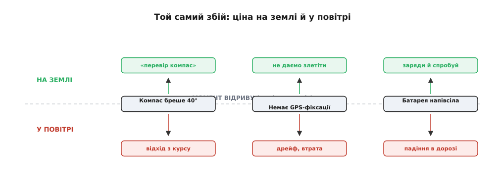
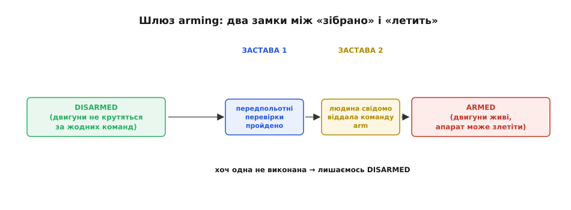
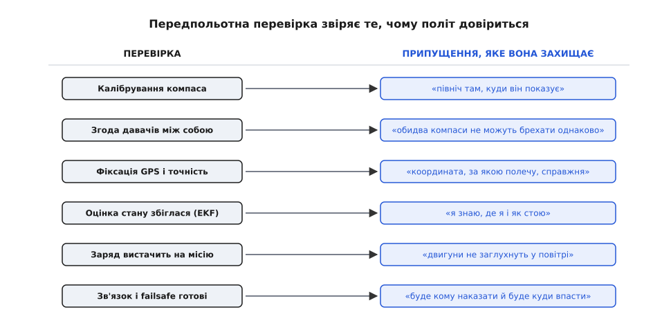

# Безпека до польоту

Уявіть той самий несправний компас у двох різних моментах. Апарат стоїть на землі, ще нерухомий, і магнітометр показує північ на сорок градусів убік від справжньої — через шматок арматури під бетоном чи ненавмисне намагнічування. І той самий апарат уже в повітрі з тією самою похибкою: автопілот вважає, що летить прямо на маршрут, а насправді забирає вбік, доки не піде «кудись у нікуди» (це й називають *flyaway* — некерований відхід апарата). Несправність одна. Але на землі вона коштує рядка тексту «перевір компас», а в небі — втраченого апарата й, можливо, чиєїсь шкоди. Уся суть безпеки до польоту тримається на цій різниці: **на землі помилка ще дешева, у повітрі — вже ні, тож найкраще місце спіймати збій — до відриву.**


*Одна й та сама несправність по різні боки моменту відриву. Угорі, на землі, наслідок керований — повідомлення й друга спроба. Унизу, у повітрі, той самий збій обертається відходом з курсу, дрейфом чи падінням. Momentum відриву перетворює дешеве на катастрофічне.*

## Чому земля — особливе місце

За цією різницею стоїть проста фізика, а не везіння. Апарат на землі майже безсилий нашкодити: двигуни або стоять, або крутяться на малих обертах, енергії в русі — нуль, і будь-яка помилка лишається на місці. Тієї ж миті, коли гвинти беруть тягу під автономним керуванням, ситуація перевертається: тепер у системі є кінетична енергія, апарат сам приймає рішення й рухається, а кожна хибна цифра в його голові одразу стає рухом у реальному просторі. Між цими двома станами лежить **поріг незворотності**: до нього ти ще можеш усе спокійно виправити, після нього — уже наздоганяєш події.

Звідси випливає інженерний хід, на якому все й будується. Раз до порога виправляти дешево, а після — дорого, то весь тягар перевірок треба перенести на **перед** порогом — і не просто перевірити, а **не дати переступити поріг**, доки апарат не довів свою придатність. Не «злітаємо й сподіваємось, що давачі справні», а «злетіти не можна, поки давачі не підтвердили, що справні». Безпека до польоту — це не набір побажань перед стартом, а **шлюз**: керована брама між станом «зібрано на столі» і станом «летить», крізь яку систему пропускають лише тоді, коли вона готова.

> 🔧 **Навіщо це.** Кожен апарат, здатний рухатися сам, має цей поріг — і питання не в тім, чи він є, а в тім, хто його стереже. Якщо шлюзу немає, першою «перевіркою» стає сам політ: злетіли — і тільки в повітрі дізналися, що компас бреше. Свідомо поставлений шлюз переносить це відкриття на землю, де ціною є повідомлення, а не апарат. Це найдешевша страховка в усій розробці: код, що просто **відмовляється стартувати**, коштує кількох перевірок, а рятує від найдорожчих аварій.

## Шлюз arming: єдиний охоронюваний перехід

Той поріг у прошивці має конкретне ім'я — **arming** (англ. *to arm* — озброїти, приготувати до дії; від латинського *arma* — зброя). Слово й ідея прийшли з військової техніки: у боєприпасах ставили окремий пристрій безпеки-й-взводу (*safe-and-arm*), що доти механічно розривав електричний ланцюг між джерелом і запалом, — і апарат перебував у безпеці, доки цей розрив не знято свідомо. [Ця ордонансна лінія — від механічного запобіжника до цифрового `arm` дрона — має власну повчальну історію](root:sys-dron/preflight-safety/hist-safe-and-arm.md). Дрон запозичив і термін, і саму ідею: доки апарат **обеззброєний** (*disarmed*), його двигуни не закрутяться за жодною командою — керуючий сигнал до них просто не доходить. Це стан безпечний **за побудовою**, а не за домовленістю: щоб гвинт крутнувся, спершу треба свідомо перевести систему в *armed*.

Саме тому arming — **єдиний перехід**, який варто стерегти по-справжньому. Уся небезпека апарата починається в одну мить: коли обеззброєний стає озброєним. Захистиш цей перехід — і все, що ти хочеш перевірити перед польотом, зводиться до одного питання: **чи можна зараз пройти крізь шлюз?** А стереже його не один замок, а два, і кожен відповідає на своє питання.


*Обеззброєний апарат безпечний за побудовою: двигуни мертві. Перехід у стан «озброєно» стережуть дві застави — система має бути придатна (передпольотні перевірки пройдено) і людина має свідомо цього захотіти (команда arm). Не виконана хоч одна — лишаємось обеззброєними.*

Перша застава питає: **чи система придатна?** Це передпольотні перевірки — автоматична ревізія стану апарата, яку прошивка проганяє сама. Друга застава питає інше: **чи цього справді хтось захотів?** Бо апарат, що озброюється сам собою від випадкового збою чи шуму в каналі, небезпечний навіть зі справними давачами. Тому команда `arm` — свідома, помітна дія: витримане положення стіка, окрема кнопка, апаратний запобіжний вимикач на платі. Дві застави незалежні: перевірки боронять від несправного апарата, свідома команда — від ненавмисного запуску справного. Пройти треба обидві.

## Передпольотна перевірка: підтвердь припущення, яким довіриш

Тепер найважливіше — що саме перевіряти й **чому саме це**. Тут криється думка, яка відрізняє осмислений список перевірок від випадкового. Політний код у повітрі спирається на цілу гору мовчазних припущень: що північ там, куди показує компас; що координата з GPS справжня; що заряду вистачить; що канал керування живий. У польоті він цим припущенням **сліпо довіряє** — перевіряти їх щомиті нема коли, та й нема як. Передпольотна перевірка — це і є те єдине місце, де кожне таке припущення **підтверджують наперед**, поки недовіра ще нічого не коштує.


*Ліва колонка — що перевіряємо, права — яке мовчазне припущення політного коду ця перевірка захищає. На землі невиконане припущення дає відмову; у повітрі — сліпу довіру до брехні. Перевірка перетворює «сподіваюсь, що так» на «переконався, що так».*

Пройдімося ключовими перевірками, і логіка проступить сама — бо кожна боронить конкретне припущення.

**Давачі справні й скалібровані.** Компас має бути скалібрований — інакше «північ» зсунута, і весь маршрут поїде вбік. Акселерометри й гіроскопи мають бути виміряні (їхні нулі зняті), інакше апарат хибно оцінює, як він стоїть. Прошивка перевіряє не лише наявність калібрування, а й **здоров'я** давача: чи він узагалі відповідає, чи не видає сталого сміття. Мертвий давач, якому система довіряє, гірший за відсутній.

**Давачі згодні між собою.** Це тонший і потужніший хід. Якщо на борту два компаси, вони мають показувати приблизно **одне й те саме**; якщо розходяться більш ніж на якийсь поріг — один із них бреше, і невідомо котрий. Одиничний давач може тихо збрехати, і ти цього не помітиш; двоє незгодних **самі виказують** несправність — бо правда не може суперечити сама собі. Це та сама ідея, що лежить в основі [надлишковості](root:sf-devices/redundancy): кілька незалежних джерел ловлять брехню одного порівнянням, а не вірою.

> 🔧 **Навіщо це.** Згода давачів — найдешевший детектор прихованої несправності, який у вас є. Один магнітометр, що з'їхав від намагніченого гвинта поруч, показуватиме «правдоподібну» цифру — і в польоті ви підете вбік, певні, що летите прямо. Але **два** магнітометри в тому самому апараті на з'їзд одного зреагують розбіжністю, і передпольотна перевірка спіймає це на землі. Тому навіть скромний апарат часто везе більше давачів, ніж мінімально треба: зайвий давач — не про точність, а про **можливість помітити брехню** до відриву.

**Оцінка стану збіглася.** Автопілот не тримає координати «сирими» — він зводить GPS, барометр, компас і гіроскопи в єдину внутрішню оцінку «де я і як стою» (цим займається фільтр стану, EKF). Ця оцінка потребує кількох секунд, щоб **збігтися** — усталитися на несуперечливих числах. Злетіти до того, як вона збіглася, означає віддати керування системі, що сама ще не знає свого стану. Тож окрема перевірка чекає, поки оцінка не стане певною.

**Позиція надійна.** Для режимів, що тримають точку чи летять маршрутом, потрібна не абияка, а **достовірна** фіксація GPS: об'ємна (3D), із достатньою кількістю супутників і малою похибкою. Летіти «за координатою», якій сам не довіряєш, — пряма дорога в дрейф.

**Енергії вистачить.** Напруга батареї має бути вище порога аварії ще до старту. Злетіти на напівсілому акумуляторі — це запрограмувати падіння на півдорозі; тут корисно наперед прикинути [бюджет батареї](root:hw-power/battery-budget) на всю місію, а не лише на зліт.

**Є кому наказати й куди впасти.** Канал керування має бути живий, а сценарії [безпечного відмову](root:sys-dron/failsafe) — налаштовані. Немає сенсу пускати апарат, який у разі втрати зв'язку не знатиме, що робити. Готовність failsafe — теж передумова зльоту, а не турбота «на потім».

Списки конкретних перевірок різняться між автопілотами, але зібрані не з голови: у ArduPilot, наприклад, передпольотні перевірки (*pre-arm checks*) прямо звіряють калібрування й узгодженість компасів, наявність 3D-фіксації GPS та її точність (HDOP), каліброваність і здоров'я акселерометрів, напругу батареї відносно порога failsafe, барометр, канали RC та стан апаратного запобіжного вимикача — і **блокують arming**, доки бодай одна не пройшла. Це усталена, задокументована практика, а не окремий винахід; за нею стоїть та сама думка — підтвердити на землі кожне припущення, яким політ довіриться в повітрі.

## Головне правило: відмовляй, а не попереджай

Тепер — рішення, що визначає весь характер шлюзу. Помітивши негаразд перед стартом, система може зробити дві дуже різні речі: **попередити** («увага, компас підозрілий, але вирішуй сам») або **відмовити** («arming заборонено, поки не полагодиш»). Різниця здається дрібною, а насправді вона вирішальна, і ось чому. Попередження **можна проігнорувати** — і під тиском моменту, поспіху чи звички його якраз і ігнорують: «та злетимо, воно завжди так пише». Відмова проігнорувати **не можна за побудовою**: доки причина не усунена, апарат просто не озброїться. Тому для всього, що загрожує безпекою, шлюз має саме **відмовляти**, а не радити.

Тут і проступає, чим безпека до польоту відрізняється від логіки в повітрі. У польоті діє протилежний принцип — [деградація з гідністю](root:sf-devices/graceful-degradation): апарат навмисно **не зупиняється** від часткової відмови, бо зупинити двигуни в небі означає впасти, і краще летіти на резервному давачі чи сідати керовано, ніж завмерти. А на землі все навпаки: тут зупинка нічого не коштує, апарат стоїть безпечно, і в тебе є **розкіш твердого «ні»**, якої в повітрі немає. Той самий поганий компас: у польоті — привід перейти в обережніший режим і чесно позначити деградацію; на землі — привід просто не пустити в політ. Один принцип для землі, інший для повітря — і межа між ними проходить рівно по моменту відриву.

З цього ж випливає, що відмова мусить **говорити**. Мовчазне «не озброюється, а чому — незрозуміло» доводить оператора до сліпого перебору й спокуси обійти захист. Тому кожна невиконана перевірка називає **саму причину**: «компас не скалібровано», «немає фіксації GPS», «низька напруга». Це та сама вимога, що й скрізь у надійному коді: [жодна помилка не мовчить](root:sf-apps/error-handling) — вона має бути гучною, названою й дієвою. Наземна станція (GCS) для того й показує текст причини відмови, щоб оператор одразу знав, що саме полагодити.

## Реальний код: шлюз arming

Складімо серце шлюзу в робочий C. Ідея пряма, як і в усіх надійних перевірок: список передпольотних умов, де кожна вміє сказати «я в нормі» чи «я ні» і **чому**; спроба озброїтися проходить лише тоді, коли **всі** умови виконані; а сама функція `arm()` — це і є той охоронюваний перехід, за який далі оживають двигуни.

Спершу — окрема перевірка. Кожна має однакову форму: подивитися на свій шматок стану й повернути присуд разом із причиною.

:::tabs
```c
typedef struct {
    bool        pass;         // умова виконана?
    const char *reason;       // якщо ні — що саме сказати оператору
} prearm_result_t;

// Кожна перевірка звіряє ОДНЕ припущення, яким політ потім довіриться.
prearm_result_t check_compass(void) {
    if (!compass_calibrated())  return (prearm_result_t){ false, "компас не скалібровано" };
    if (!compass_healthy())     return (prearm_result_t){ false, "компас не відповідає" };
    if (compass_disagree_deg() > 45.0f)                 // два компаси — згода?
        return (prearm_result_t){ false, "компаси не згодні між собою" };
    return (prearm_result_t){ true, NULL };
}

prearm_result_t check_gps(void) {
    if (gps_fix_type() < GPS_FIX_3D)
        return (prearm_result_t){ false, "немає 3D-фіксації GPS" };
    if (gps_hdop() > 2.0f)                               // точність позиції
        return (prearm_result_t){ false, "низька точність GPS" };
    return (prearm_result_t){ true, NULL };
}

prearm_result_t check_battery(void) {
    if (battery_voltage() < FS_BATT_VOLTAGE)            // поріг failsafe
        return (prearm_result_t){ false, "низька напруга батареї" };
    return (prearm_result_t){ true, NULL };
}
```
```cpp
struct PrearmResult {
    bool        pass;         // умова виконана?
    const char *reason;       // якщо ні — що саме сказати оператору
};

// Кожна перевірка звіряє ОДНЕ припущення, яким політ потім довіриться.
PrearmResult check_compass() {
    if (!compass_calibrated())  return { false, "компас не скалібровано" };
    if (!compass_healthy())     return { false, "компас не відповідає" };
    if (compass_disagree_deg() > 45.0f)                 // два компаси — згода?
        return { false, "компаси не згодні між собою" };
    return { true, nullptr };
}

PrearmResult check_gps() {
    if (gps_fix_type() < GPS_FIX_3D)
        return { false, "немає 3D-фіксації GPS" };
    if (gps_hdop() > 2.0f)                               // точність позиції
        return { false, "низька точність GPS" };
    return { true, nullptr };
}

PrearmResult check_battery() {
    if (battery_voltage() < FS_BATT_VOLTAGE)            // поріг failsafe
        return { false, "низька напруга батареї" };
    return { true, nullptr };
}
```
```python
from dataclasses import dataclass

@dataclass
class PrearmResult:
    passed: bool               # умова виконана?
    reason: str | None = None  # якщо ні — що саме сказати оператору

# Кожна перевірка звіряє ОДНЕ припущення, яким політ потім довіриться.
def check_compass() -> PrearmResult:
    if not compass_calibrated():  return PrearmResult(False, "компас не скалібровано")
    if not compass_healthy():     return PrearmResult(False, "компас не відповідає")
    if compass_disagree_deg() > 45.0:                   # два компаси — згода?
        return PrearmResult(False, "компаси не згодні між собою")
    return PrearmResult(True)

def check_gps() -> PrearmResult:
    if gps_fix_type() < GPS_FIX_3D:
        return PrearmResult(False, "немає 3D-фіксації GPS")
    if gps_hdop() > 2.0:                                # точність позиції
        return PrearmResult(False, "низька точність GPS")
    return PrearmResult(True)

def check_battery() -> PrearmResult:
    if battery_voltage() < FS_BATT_VOLTAGE:            # поріг failsafe
        return PrearmResult(False, "низька напруга батареї")
    return PrearmResult(True)
```
:::

Зверніть увагу на **форму**: перевірка не «щось робить», а лише **звітує про придатність** свого припущення, і в разі «ні» одразу дає текст, який побачить оператор. Складність не в кожній окремій перевірці — вона тривіальна, — а в тому, що їх **багато й вони незалежні**. Тож зберімо їх у таблицю й проженімо всі:

:::tabs
```c
// Таблиця передпольотних умов. Додати нову перевірку — дописати рядок.
static prearm_result_t (*const PREARM_CHECKS[])(void) = {
    check_compass,
    check_gps,
    check_battery,
    check_ekf_converged,   // оцінка стану збіглася?
    check_rc_link,         // канал керування живий?
    // ... решта перевірок апарата
};
#define NUM_CHECKS (sizeof(PREARM_CHECKS) / sizeof(PREARM_CHECKS[0]))

// Прогнати всі; повернути ПЕРШУ причину відмови (або NULL, якщо все гаразд).
const char *prearm_first_failure(void) {
    for (size_t i = 0; i < NUM_CHECKS; i++) {
        prearm_result_t r = PREARM_CHECKS[i]();
        if (!r.pass) {
            gcs_send_text("PreArm: %s", r.reason);   // назвати причину оператору
            return r.reason;
        }
    }
    return NULL;   // усі припущення підтверджені
}
```
```cpp
#include <array>

// Таблиця передпольотних умов. Додати нову перевірку — дописати рядок.
static constexpr std::array PREARM_CHECKS = {
    check_compass,
    check_gps,
    check_battery,
    check_ekf_converged,   // оцінка стану збіглася?
    check_rc_link,         // канал керування живий?
    // ... решта перевірок апарата
};

// Прогнати всі; повернути ПЕРШУ причину відмови (або nullptr, якщо все гаразд).
const char *prearm_first_failure() {
    for (auto check : PREARM_CHECKS) {
        PrearmResult r = check();
        if (!r.pass) {
            gcs_send_text("PreArm: %s", r.reason);   // назвати причину оператору
            return r.reason;
        }
    }
    return nullptr;   // усі припущення підтверджені
}
```
```python
# Таблиця передпольотних умов. Додати нову перевірку — дописати рядок.
PREARM_CHECKS = (
    check_compass,
    check_gps,
    check_battery,
    check_ekf_converged,   # оцінка стану збіглася?
    check_rc_link,         # канал керування живий?
    # ... решта перевірок апарата
)

# Прогнати всі; повернути ПЕРШУ причину відмови (або None, якщо все гаразд).
def prearm_first_failure() -> str | None:
    for check in PREARM_CHECKS:
        r = check()
        if not r.passed:
            gcs_send_text(f"PreArm: {r.reason}")   # назвати причину оператору
            return r.reason
    return None   # усі припущення підтверджені
```
:::

Тепер сам **шлюз** — функція, що вирішує долю переходу. Вона крихітна саме тому, що вся її суть — це два незалежні замки з нашого шлюзу, зведені в один `if`:

:::tabs
```c
static bool s_armed = false;

// Спроба озброїтися. Обидві застави мусять пропустити.
bool try_arm(bool operator_requested) {
    // Застава 2: чи цього СВІДОМО хтось захотів (стік/кнопка/вимикач)?
    if (!operator_requested)         return false;
    if (!safety_switch_pressed())    return false;   // апаратний запобіжник

    // Застава 1: чи система ПРИДАТНА (усі передпольотні перевірки)?
    const char *why = prearm_first_failure();
    if (why != NULL) {
        // Відмова — не попередження: лишаємось обеззброєними, причина названа.
        return false;                // s_armed НЕ змінюємо
    }

    s_armed = true;                  // єдине місце, де апарат стає озброєним
    motors_enable();                 // тільки тепер двигуни можуть крутитися
    gcs_send_text("Armed");
    return true;
}

bool is_armed(void) { return s_armed; }
```
```cpp
static bool s_armed = false;

// Спроба озброїтися. Обидві застави мусять пропустити.
bool try_arm(bool operator_requested) {
    // Застава 2: чи цього СВІДОМО хтось захотів (стік/кнопка/вимикач)?
    if (!operator_requested)         return false;
    if (!safety_switch_pressed())    return false;   // апаратний запобіжник

    // Застава 1: чи система ПРИДАТНА (усі передпольотні перевірки)?
    const char *why = prearm_first_failure();
    if (why != nullptr) {
        // Відмова — не попередження: лишаємось обеззброєними, причина названа.
        return false;                // s_armed НЕ змінюємо
    }

    s_armed = true;                  // єдине місце, де апарат стає озброєним
    motors_enable();                 // тільки тепер двигуни можуть крутитися
    gcs_send_text("Armed");
    return true;
}

bool is_armed() { return s_armed; }
```
```python
_armed = False

# Спроба озброїтися. Обидві застави мусять пропустити.
def try_arm(operator_requested: bool) -> bool:
    global _armed
    # Застава 2: чи цього СВІДОМО хтось захотів (стік/кнопка/вимикач)?
    if not operator_requested:       return False
    if not safety_switch_pressed():  return False   # апаратний запобіжник

    # Застава 1: чи система ПРИДАТНА (усі передпольотні перевірки)?
    why = prearm_first_failure()
    if why is not None:
        # Відмова — не попередження: лишаємось обеззброєними, причина названа.
        return False                 # _armed НЕ змінюємо

    _armed = True                    # єдине місце, де апарат стає озброєним
    motors_enable()                  # тільки тепер двигуни можуть крутитися
    gcs_send_text("Armed")
    return True

def is_armed() -> bool:
    return _armed
```
:::

Розгляньмо, **чому код саме такий**. Прапорець `s_armed` міняється рівно **в одному місці** — і тільки після того, як обидві застави пропустили; це робить перехід передбачуваним і таким, що його легко перевірити очима. Порядок теж не випадковий: спершу дешевий замок наміру (`operator_requested`, `safety_switch_pressed`), і лише потім дорожчий прогін усіх передпольотних перевірок — не варто ганяти давачі, поки ніхто й не просив злітати. А `motors_enable()` стоїть **після** `s_armed = true`, а не деінде: доступ двигунів до тяги — прямий наслідок озброєння, а не окрема, розсинхронізована з ним дія.

Головне ж — те, чого в коді **немає**: жодна гілка не озброює апарат «попри» невиконану перевірку. Немає «попередити й пустити». `prearm_first_failure()` повернув причину — `try_arm` мовчки лишає систему обеззброєною. Саме ця відсутність обхідного шляху й перетворює перевірки з поради на справжній шлюз.

> 🔧 **Навіщо це.** Ця структура — «таблиця незалежних перевірок → єдиний охоронюваний перехід» — повторюється далеко за межами дронів. Заміните перевірки давачів на «двері зачинені», «тиск у нормі», «оператор натиснув обома руками» — і дістанете інтерлок промислового преса. Форма та сама: машина не стартує, поки **всі** передумови не підтверджені, і кожна вміє назвати, чому вона не пускає. Освоївши один такий шлюз, ви впізнаєте його в кожній машині, яка має право нашкодити.

Списки перевірок зазвичай ще й **налаштовні**: якісь можна послабити чи вимкнути для стендового тесту без гвинтів через [параметри й наземну станцію](root:sys-dron/params-gcs). Це зручність — і водночас пастка: вимкнена «на секунду» перевірка легко лишається вимкненою назавжди. Тому послаблення захисту саме має бути помітним і свідомим рішенням, а не тихою галочкою.

## Де це живе: від квадрокоптера до будь-якої машини

Безпека до польоту — не примха дронів; це окремий випадок наскрізного принципу **інтерлока** (англ. *interlock* — блокування, що не дає машині діяти, поки не виконані умови). Скрізь, де машина здатна нашкодити, між станом «вимкнено» і станом «діє» ставлять охоронюваний перехід, крізь який не пройти, доки не підтверджені передумови.

Придивіться, і ви побачите той самий шлюз повсюди. Промисловий верстат не запускає шпиндель, поки не зачинений захисний кожух і оператор не натиснув пуск обома руками одночасно (щоб руки були свідомо подалі від різця). Мікрохвильова піч не вмикає магнетрон, поки дверцята відчинені, — і це не порада, а блокування: контакт розімкнено, живлення до магнетрона не доходить. Медичний інфузійний насос не почне подачу, доки не підтверджені параметри й не пройдений самотест. Верстат із ЧПК не рушить осі, поки не взято реферес і не знято аварійний стоп. Різні машини, різні небезпеки — але думка одна: **не дай почати, поки не переконався, що безпечно почати.**

Спільне в усіх цих випадках — та сама логіка, що й у дрона перед зльотом. Є поріг незворотності, за яким помилка стає дорогою. Є набір передумов, які треба підтвердити **до** порога. Є тверде «ні» замість м'якого «увага». І є свідома дія людини як окремий, незалежний замок. Дрон лише робить цей принцип особливо наочним, бо його поріг — momentum відриву — видно неозброєним оком: ось апарат стояв безпечно, а ось уже несе кінетичну енергію й приймає рішення сам.

Підсумуймо. Безпека до польоту тримається на одній думці: **перенести ціну помилки з повітря, де вона катастрофічна, на землю, де вона дешева** — відмовляючись озброюватися, поки апарат не довів свою придатність. Механізм — шлюз arming із двома незалежними заставами: передпольотні перевірки, що підтверджують кожне припущення, яким політ потім сліпо довіриться, і свідома команда людини, що боронить від ненавмисного запуску. А правило, яке робить шлюз шлюзом, а не порадою, — **відмовляти, а не попереджати**, гучно називаючи причину. Закладений у код **до** відриву, цей шлюз перетворює найдорожчі аварії на найдешевше з можливого — рядок тексту на екрані, поки апарат ще стоїть на землі.
