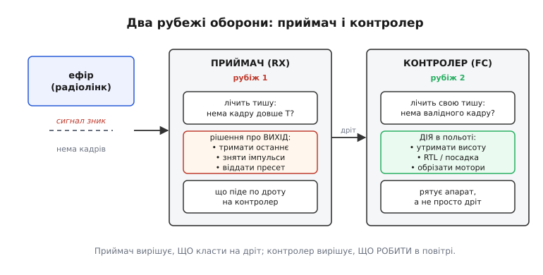
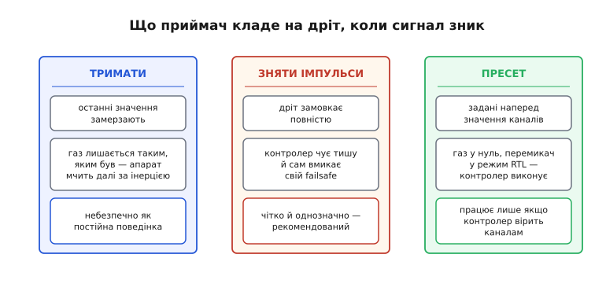
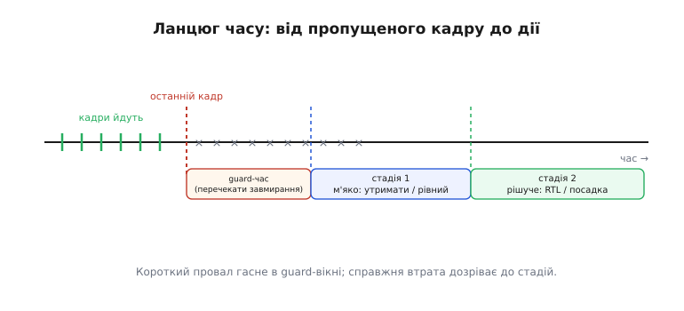
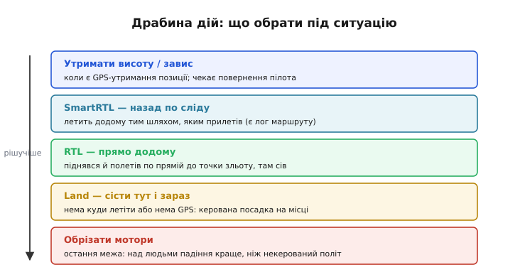

# Режими failsafe RC: що робити, коли керування зникло

Радіокероване — означає кероване доти, доки долітає радіо. А радіо колись не долетить: апарат вийде за межу дальності, хтось заглушить діапазон, сяде батарея пульта, зламається антена. Питання не «чи», а «коли» — і головне, **що станеться тієї миті**. Без заздалегідь заданого плану приймач далі згодовує польотному контролеру останню команду, і апарат летить обраним курсом, поки не впаде. **Failsafe** (англ. *fail-safe* — «безпечний за відмови») — це і є той план: наперед описана поведінка на випадок, коли керування розірвалося. Тема здається дрібною галочкою в налаштуваннях, аж поки не з'ясовується, що failsafe буває **кількох різних видів на кількох рівнях**, і сплутати їх — це різниця між «дрон сам повернувся» і «дрон полетів у ліс».

Сама ідея старша за дрони на століття. У ранній залізниці гальма зробили так, що **розрив** магістралі сам їх **вмикає**: обірвалася гальмівна труба — тиск упав — колодки притислися, і поїзд став. Відмова тут веде не в аварію, а в безпечний стан. Той самий принцип живе в кожному сучасному приймачі: втрата зв'язку має вести до безпечного, а не до випадкового.

> 🔧 **Навіщо це.** Failsafe — не «на всяк випадок», а обов'язковий крок передполітної підготовки. Пілоти-початківці, що пропустили його, найчастіше й гублять апарати: перший же провал зв'язку за деревами перетворює керований політ на некерований. Правильно налаштований failsafe рятує не лише апарат, а й людей унизу.

Ідея «розрив веде в безпечний стан» — не винахід дронів, вона прийшла зі старої інженерії безпеки; [звідки взявся сам термін і принцип](topic:sys-dron/rc-failsafe-modes/hist-failsafe-origin.md), варто знати окремо, бо це пояснює, чому «безпечний за замовчуванням» стан узагалі має існувати.

### Два рубежі, які легко сплутати

Перша й найважливіша річ: failsafe спрацьовує **у двох різних місцях**, і це два різні механізми з різними обов'язками.


*Коли сигнал зникає, спершу реагує приймач (RX): він вирішує, ЩО класти на дріт до контролера. Потім реагує польотний контролер (FC): він вирішує, ЩО РОБИТИ в польоті. Перший рубіж — про сигнал на дроті, другий — про долю апарата. Налаштовувати треба обидва, і вони мусять узгоджуватися.*

**Рубіж приймача.** [Приймач на борту](topic:sys-dron/rc-link) отримує кадри з пульта. Коли кадри перестають надходити, приймач сам мусить вирішити, що видавати на дріт польотному контролеру далі. Це рішення локальне й «тупе»: приймач не знає, летить апарат чи стоїть, є GPS чи ні — він лише формує сигнал на виході.

**Рубіж контролера.** Польотний контролер отримує канали від приймача й теж стежить за втратою — але вже **осмислено**. Він знає стан апарата: висоту, координати, режим, заряд. Тому його реакція не «який сигнал видати», а «яку **дію** виконати»: утримати висоту, повернутися додому, сісти. Це і є те, що рятує апарат.

Плутанина цих двох рубежів — джерело найгірших історій. Класична пастка: приймач налаштований **утримувати** останні значення, а газ у момент розриву був не на нулі. Приймач слухняно шле контролеру «газ 60 %», контролер бачить нібито валідний сигнал і **не вмикає** свій failsafe — апарат на повному ходу йде за горизонт. Обидва рубежі спрацювали «як налаштовано», а результат — катастрофа. Тому їх завжди узгоджують: або приймач чесно сигналізує втрату, або віддає такі значення, за якими контролер сам вирішить рятувати.

### Три способи приймача: тримати, замовкнути, віддати пресет

Що саме приймач кладе на дріт при втраті сигналу — це вибір з трьох, і він визначальний.


*Три відповіді приймача. «Тримати» — заморозити останні значення каналів; небезпечно як стала поведінка, бо газ лишається таким, яким був. «Зняти імпульси» — дріт замовкає, контролер чує тишу й вмикає власний failsafe; чітко й однозначно. «Пресет» — приймач віддає наперед задані значення (газ у нуль, перемикач у RTL), і контролер їх виконує.*

**Тримати (hold).** Приймач заморожує останні прийняті значення й повторює їх, ніби нічого не сталося. Єдине, для чого це годиться, — перекрити **дуже короткий провал**: під час [багатопроменевого завмирання](topic:com-medium/multipath-fading) сигнал може зникнути на десятки мілісекунд і повернутися. Тут утримання рятує від сіпання. Але як **постійна** реакція на справжню втрату — це найгірший вибір: замерзлий газ жене апарат геть.

**Зняти імпульси (no pulses).** Приймач просто **перестає** щось видавати — дріт замовкає. На перший погляд дивно: хіба не гірше зовсім нічого не слати? Навпаки. Тиша **однозначна**: контролер не сплутає її з валідною командою, миттєво розуміє «зв'язку нема» й вмикає власний, розумніший failsafe. Саме тому для апаратів із польотним контролером цей режим — **рекомендований за замовчуванням**. Сучасні цифрові лінки на кшталт [CRSF](topic:sys-dron/crsf-protocol) роблять саме так: на втрату зв'язку приймач знімає вихід, і контролер бере кермо.

**Пресет (preset / preset failsafe).** Приймач віддає **наперед задані** значення кожного каналу — ті, що ти під час налаштування «записав» у нього. Класика: газ у нуль (мотори в холостий хід), перемикач режиму — в положення RTL. Контролер отримує ці канали як звичайну команду й виконує її. Спосіб потужний, але з умовою: він працює, лише якщо контролер **довіряє** каналам і не має власного, суворішого failsafe, що перехопить керування раніше.

Тонкість, через яку губляться апарати: у старих аналогових лінках (PWM, PPM) вибору «зняти імпульси» майже не буває — приймач фізично мусить щось видавати, тож там або hold, або пресет, і налаштовувати їх треба руками, часто **в пульті**. У цифрових лінках приймач може чесно сигналізувати втрату окремим прапорцем — і це набагато надійніше.

### Як приймач каже «це failsafe»: приклад SBUS

Найкращі протоколи не змушують контролер здогадуватися про втрату — вони **прямо** її позначають. Подивімося на це на конкретному [цифровому протоколі приймача SBUS](topic:sys-dron/rc-link): у кожному його кадрі є два спеціальні біти-прапорці.

Кадр SBUS — це 25 байтів. Шістнадцять каналів по 11 бітів займають байти 1–22, а в байті 23 ховаються два прапорці стану: **frame lost** (біт 5, маска 0x20) — «цей кадр загубився, дані застарілі» — і **failsafe** (біт 4, маска 0x10) — «приймач уже перейшов у failsafe, довго нема зв'язку». Контролеру лишається їх прочитати.

**Умова.** З приймача прийшов байт прапорців SBUS `flags = 0x10`. Що це означає для польотного контролера й що він має зробити?

:::tabs
```cpp
// SBUS: байт 23 кадру містить прапорці стану
#define SBUS_FLAG_FRAME_LOST  (1u << 5)   // 0x20: окремий кадр загублено
#define SBUS_FLAG_FAILSAFE    (1u << 4)   // 0x10: приймач у режимі failsafe

// повертає true, якщо контролер мусить вмикати польотний failsafe
bool rc_link_lost(uint8_t flags) {
    if (flags & SBUS_FLAG_FAILSAFE)   return true;   // явна втрата зв'язку
    if (flags & SBUS_FLAG_FRAME_LOST) return false;  // один поганий кадр — ще не втрата
    return false;                                    // усе гаразд
}

// flags = 0x10:
//   0x10 & SBUS_FLAG_FAILSAFE  = 0x10 → істина  → rc_link_lost() == true
//   → контролер запускає свою дію failsafe (RTL / посадку)
```
```python
# SBUS: байт 23 кадру містить прапорці стану
SBUS_FLAG_FRAME_LOST = 1 << 5   # 0x20: окремий кадр загублено
SBUS_FLAG_FAILSAFE   = 1 << 4   # 0x10: приймач у режимі failsafe

# повертає True, якщо контролер мусить вмикати польотний failsafe
def rc_link_lost(flags: int) -> bool:
    if flags & SBUS_FLAG_FAILSAFE:   return True    # явна втрата зв'язку
    if flags & SBUS_FLAG_FRAME_LOST: return False   # один поганий кадр — ще не втрата
    return False                                    # усе гаразд

# flags = 0x10:
#   0x10 & SBUS_FLAG_FAILSAFE  = 0x10 → істина  → rc_link_lost() == True
#   → контролер запускає свою дію failsafe (RTL / посадку)
```
:::

Різниця між двома прапорцями — саме та, що й між «завадою» і «втратою». Одинокий `frame lost` — це проковтнутий кадр, яких у польоті чимало; на нього не реагують, бо наступний кадр прийде за мілісекунди. А `failsafe` виставляється, **лише** коли приймач втратив зв'язок надовго, — і оце вже сигнал до дії. Мудрий контролер розрізняє ці два стани й не панікує від кожного шуму. Той, хто плутає їх, або сіпається на кожен збій, або, навпаки, пізно помічає реальну втрату.

### Не миттєво, а стадіями

Друга велика ідея: розумний failsafe спрацьовує **не одразу** й **не одним стрибком**. Між останнім кадром і рішучою дією лежить продуманий ланцюг у часі.


*Часова вісь. Поки кадри йдуть — усе гаразд. Після останнього кадру починається guard-час: коротке вікно, щоб перечекати випадкове завмирання, не зчиняючи тривоги. Якщо тиша триває — вмикається стадія 1 (м'яка: утримати висоту, вирівняти). Якщо не відпускає й далі — стадія 2 (рішуча: повернення додому чи посадка).*

Чому стадіями, а не миттєво? Бо провали зв'язку **різні за природою**. Коротке завмирання за секунду мине саме — реагувати на нього поверненням додому було б безглуздо: апарат сахатувався б від кожного дерева. А довга втрата — це вже реальність, на неї треба діяти. Стадійність розрізняє одне від одного **часом**: скільки триває тиша.

Спершу — **guard-час** (англ. *guard time*, «сторожовий час»): невелике вікно, протягом якого контролер терпить тишу, чекаючи, чи не повернеться сигнал. Провалилося на мить — вікно поглинуло, ніхто й не помітив. Далі, якщо тиша не відпускає, — **стадія 1**, м'яка: утримати позицію, вирівняти апарат, попередити пілота. Це ще не порятунок, а пауза «дай сигналу шанс повернутися, але вже без ризику». І аж коли й вона проходить намарне — **стадія 2**, рішуча: повернення додому або посадка.

Ця сходинковість — не абстракція, а прямо закладена в автопілоти. У відкритому ArduPilot для літаків є **коротке** й **довге** failsafe: коротке настає за задані секунди після втрати й може, наприклад, закружляти на місці, даючи сигналу відновитися; довге настає, якщо втрата затягнулася, і виконує остаточну дію. Мультикоптерна прошивка робить по суті те саме іншими словами.

Поріг тут — тонке налаштування. Візьмеш замалий — апарат кидатиметься в failsafe від кожної завади; завеликий — надто пізно помітить справжню біду. Орієнтир простий: поріг має бути **набагато довшим за період кадрів**. Якщо кадри керування приходять кожні 20 мс, то поріг у 500 мс — це десятки пропущених кадрів поспіль, тобто справжня втрата, а не одна проковтнута посилка. Механіку самого лічильника — щотактну перевірку «скільки минуло від останнього валідного кадру» — розібрано в [лінії керування й телеметрії](topic:sys-dron/control-telemetry).

### Драбина дій: від м'якого до рішучого

Коли контролер таки вирішив, що зв'язок утрачено по-справжньому, лишається головне питання: **що робити**. І відповідей теж кілька — вони складаються в драбину від найм'якшого до найрішучішого.


*Драбина дій контролера. Утримати висоту чи завис — коли є GPS-утримання позиції й є надія, що пілот повернеться. SmartRTL — повернутися додому тим самим шляхом, яким прилетів. RTL — піднятися й летіти прямо до точки зльоту. Land — сісти тут і зараз, коли летіти нікуди чи нема GPS. Обрізати мотори — остання межа, коли навіть падіння безпечніше за некерований політ.*

**Утримати / завис.** Найм'якша дія: якщо є супутникове утримання позиції, апарат просто зависає на місці й чекає. Розрахунок на те, що втрата тимчасова й пілот от-от повернеться. Годиться, поки вистачає заряду.

**SmartRTL — назад по сліду.** Апарат летить додому **тим самим шляхом**, яким прилетів, розмотуючи збережений лог маршруту. Розумно там, де по прямій дорогу перекривають перешкоди: пройдений шлях уже відомо безпечним. Потребує накопиченого сліду й пам'яті під нього.

**RTL — прямо додому.** Найпоширеніша дія: апарат піднімається на задану безпечну висоту й летить **по прямій** до точки зльоту, де сідає. Спирається на GPS і на те, що прямий шлях додому вільний. Це і є класичне [«повернення до точки зльоту» (return to launch)](topic:sys-dron/rc-link).

**Land — сісти тут і зараз.** Коли летіти нікуди — нема GPS, мало заряду, апарат близько, — найбезпечніше **сісти на місці**: контрольований спуск прямо вниз. Не так ефектно, зате надійно й без ризику полетіти не туди.

**Обрізати мотори.** Остання межа. Здається дикою, але має сенс у виняткових умовах: якщо некерований апарат над людьми, **кероване падіння** камінцем інколи безпечніше, ніж політ невідомо куди на повному газі. Це аварійний вихід, не звичайний вибір.

Головне правило вибору — **дія має відповідати ситуації й типу апарата**. Мультикоптер над відкритим полем — RTL. Мультикоптер у приміщенні без GPS — Land, бо RTL там наосліп небезпечний. Літак — політ по колу чи планування, а не «завис», якого він фізично не вміє. Тому єдиного «правильного» failsafe немає: є правильний **для цього апарата в цих умовах**, і саме його налаштовують під конкретний політ.

Окрема ланка, про яку легко забути, — **втрата наземної станції**. Коли апаратом керує не пульт, а телеметрійний зв'язок із наземною станцією, розрив цього зв'язку теж мусить мати свій план: це [failsafe на стороні GCS](topic:sys-dron/gcs-failsafe), окремий від радіо-failsafe пульта. Обидва існують незалежно, і продумати треба обидва.

### Як це складається докупи

Отже, failsafe RC — не одна галочка, а **система з двох рубежів і кількох рівнів вибору**. Приймач вирішує, що покласти на дріт: тримати останнє (лише проти коротких провалів), замовкнути (чітко й рекомендовано) чи віддати пресет. Найкращі протоколи, як SBUS, ще й прямо позначають втрату окремим прапорцем, щоб контролер не гадав. Контролер, отримавши сигнал утрати, реагує не миттєво, а стадіями — крізь guard-час і м'яку стадію до рішучої, — і обирає дію по драбині від утримання висоти до обрізання моторів, під конкретний апарат і момент. Усе це — окремий випадок загального принципу [надійної лінії зв'язку](topic:com-transport/reliable-link), що завжди передбачає поведінку на випадок розриву: тиша в каналі теж має бути обробленою, а не проігнорованою.

Тому налаштування failsafe — не формальність, а власне те, що відрізняє апарат, який **пробачає** втрату зв'язку, від апарата, який її **не переживає**. Один раз продумати обидва рубежі, узгодити їх між собою й перевірити на землі — і перший же провал сигналу за деревами стане не катастрофою, а рядком у логу.
