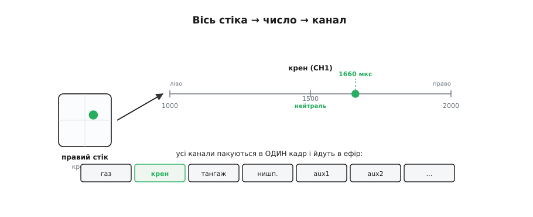
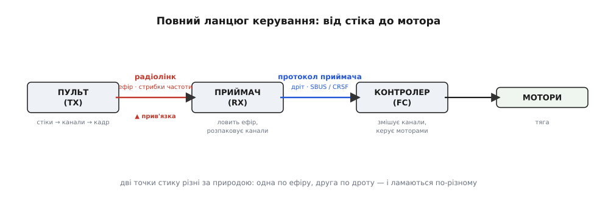
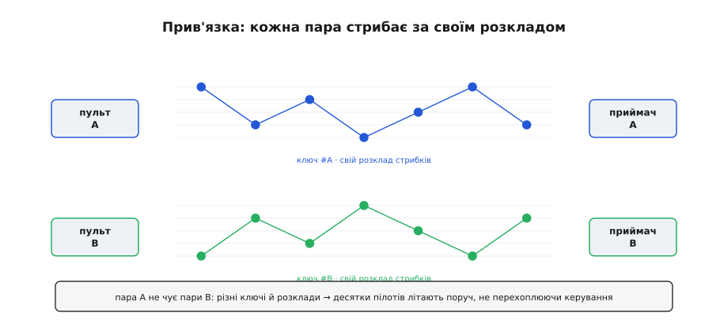
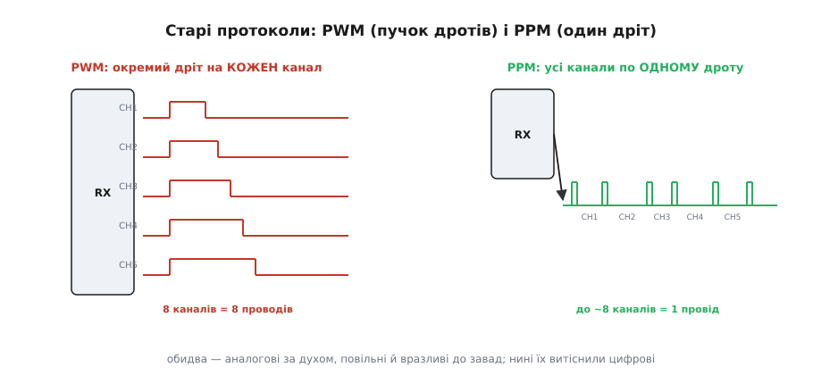
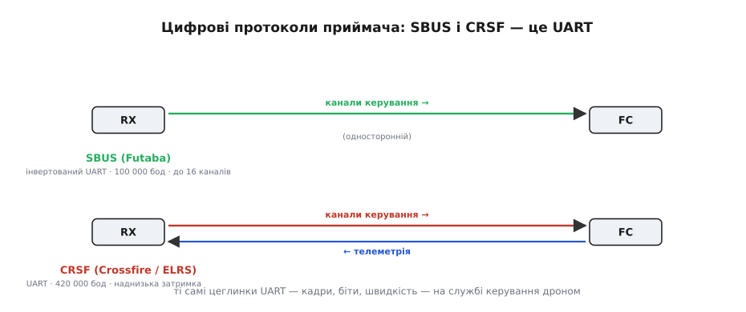
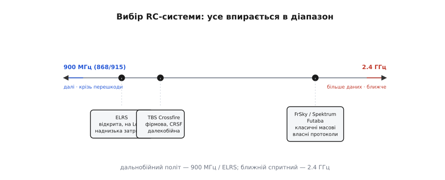
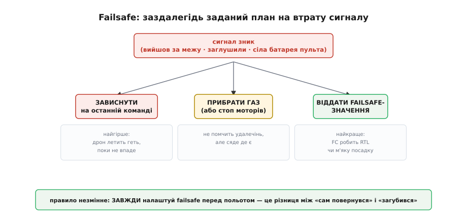

# RC-лінк: канали, прив'язка, протоколи приймача

Рухаєш стік — апарат реагує. Між цим рухом і обертом мотора лежить ланцюг перетворень: рука пілота стає числами, числа летять в ефір, приймач на борту вертає їх назад і віддає польотному контролеру своїм окремим протоколом. Цей ланцюг — **RC-лінк** (англ. *radio control*, керування по радіо), і саме в його ланках ховаються налаштування, типові поломки й сам вибір апаратури. Варто розкласти лінію керування по ланках, бо діагностувати її можна лише розуміючи, де що стається.

Лінія керування — це половина розмови з апаратом: окремий [потік телеметрії](root:sys-dron/telemetry-stream) несе дані у зворотний бік. Поділ на «священну» лінію керування та інформаційну телеметрію закладено в [саму архітектуру каналів зв'язку з апаратом](root:sys-dron/control-telemetry).

### Рух стіків стає «каналами»

Кожна окрема команда пілота — це окремий **канал**, і канал — це просто число.


*Кожна вісь стіка сидить на потенціометрі й дає число; за традицією його виражають у мікросекундах — від 1000 (край) до 2000 (інший край), 1500 посередині. Чотири основні канали: газ, крен, тангаж, нишпорення; плюс допоміжні (перемикачі режимів, підвіс). Передавач пакує всі канали в один кадр і шле в ефір; приймач розпаковує й віддає польотному контролеру.*

Механіка проста. Вісь стіка крутить потенціометр, той дає напругу, а вона перетворюється на **число**. Чому саме мікросекунди й чому 1000–2000? Це спадок старого [керування сервомашинкою](root:hw-motion/hobby-servo): її кутом керує [ШІМ-імпульс](root:hw-arch/pwm-on-mcu) завдовжки 1000–2000 мкс, і коли з тих самих сервоприводів складали перші моделі, число каналу й було тривалістю такого імпульсу. Відтоді 1000–2000 мкс живе як спільна валюта каналів, хоч усередині все давно цифрове.

Чотири основні канали — **газ** (англ. *throttle*), **крен** (англ. *roll*), **тангаж** (англ. *pitch*) і **нишпорення** (англ. *yaw*, нишпорити — крутитися навколо вертикальної осі). До них додають **допоміжні** (англ. *auxiliary*, скорочено aux): перемикачі режимів польоту, керування підвісом камери, скидання вантажу. Сучасні пульти мають 8, 16 і більше каналів. Передавач **пакує всі канали в один кадр** і безперервно шле його в ефір; приймач на борту **розпаковує** кадр назад у канали й передає польотному контролеру.

### Повний ланцюг: від стіка до мотора

Канал — лише початок шляху. Весь шлях команди складається в чітку картину з двома різними за природою точками стику.


*Пульт (TX) перетворює стіки на канали й кадр; радіолінк несе кадр по ефіру, зазвичай стрибками по діапазону; приймач (RX) розпаковує канали; польотний контролер (FC) змішує їх і керує моторами. Між RX і FC — окремий дротовий протокол приймача. А пульт із приймачем пов'язує одноразова прив'язка.*

Ланцюг такий: **пульт (TX)** → **радіолінк** → **приймач (RX)** → **польотний контролер (FC)** → мотори. Дві точки стику варті уваги, бо вони різні фізично й ламаються по-різному. Перша — **радіолінк** між пультом і приймачем: він іде по ефіру, зазвичай зі [стрибками частоти](root:com-modulation/spread-spectrum), і вимагає **прив'язки**. Друга — з'єднання **приймач→контролер**: воно дротове, всередині апарата, і йде окремим **протоколом приймача**. Коли керування поводиться дивно, перше питання — на якій із цих двох ділянок проблема: в ефірі чи в дроті.

### Прив'язка: пульт і приймач упізнають одне одного

Як приймач знає, що слухати саме твій пульт, а не сусідський? Через **прив'язку** (англ. *binding*, «зв'язування»).


*Під час прив'язки пульт і приймач одноразово домовляються про спільний унікальний ключ і послідовність стрибків частоти. Відтоді пара говорить лише між собою; інша пара поряд має інший ключ — і вони не заважають одне одному. Це й дає змогу десяткам пілотів літати поруч.*

Прив'язка — одноразова процедура, у якій пульт і приймач домовляються про **спільний секрет**: унікальний ідентифікатор пари й **послідовність стрибків** по частотах. Спираючись на [розширений спектр](root:com-modulation/spread-spectrum), кожна прив'язана пара стрибає за **своїм** псевдовипадковим розкладом — тож приймач реагує лише на «свій» пульт, а сусідські сигнали для нього шум. У сучасних системах цей секрет породжують прямо з **bind-фрази**: однакову фразу вписують у пульт і приймач, з неї обчислюється і спільний ключ, і розклад стрибків. Саме тому **десятки пілотів** літають поруч на тому самому діапазоні, не перехоплюючи керування один в одного. Роблять прив'язку раз — кнопкою на приймачі, перемичкою-bind-plug або bind-фразою, — і далі вона тримається.

### Старі протоколи приймача: PWM і PPM

Друга точка стику — як приймач віддає канали контролеру. Історично перші способи аналогові за духом: **PWM** і **PPM**.


*PWM: окремий дріт на кожен канал, кожен — імпульс 1000–2000 мкс, як сервокерування; багато дротів. PPM (CPPM): усі канали йдуть один за одним по одному дроту як серія імпульсів (до ~8 каналів). Обидва повільні й вразливі до завад.*

**PWM** (англ. *pulse-width modulation*, широтно-імпульсна) — найстаріший: **окремий дріт** на кожен канал, і по кожному йде імпульс 1000–2000 мкс, точно як керування сервомашинкою. Просто, але дротів стільки ж, скільки каналів: для 8 каналів це 8 проводів до контролера. **PPM** (англ. *pulse-position modulation*, фазоімпульсна; інколи CPPM) розумніший: усі канали шлють **один за одним по одному дроту** як серію імпульсів-кадр, і вистачає **одного** дроту приблизно на 8 каналів. Обидва вразливі до завад і повільні: значення каналу закодоване самою тривалістю, тож будь-яка наводка спотворює його напряму. Тому їх витіснили **цифрові** протоколи, де канал — це число в кадрі з перевіркою, а не довжина імпульсу.

### Цифрові протоколи: SBUS і CRSF

Сучасні приймачі віддають канали **цифровим серійним потоком**, і в його основі лежить добре відомий [послідовний інтерфейс UART](root:com-devices/async-serial).


*SBUS (Futaba): інвертований UART на 100 000 бод, до 16 каналів в одному кадрі, односторонній. CRSF (Crossfire/ELRS): UART на 420 000 бод, що несе канали вниз і телеметрію вгору, з наднизькою затримкою. Це той самий послідовний UART, лише застосований до керування.*

І SBUS, і CRSF — звичайний **UART**, застосований до керування. **SBUS** (від Futaba) — інвертований UART на **100 000 бод**: кадр у 25 байтів пакує **16 каналів по 11 бітів** кожен плюс два прапорці — «кадр загублено» і «failsafe». Інвертований означає, що рівні напруги перевернуті проти звичайного UART, тож контролер потребує або апаратної інверсії на порту, або вміння її ввімкнути. SBUS став **де-факто стандартом** приймачів, хоча й односторонній — несе лише канали вниз.

**CRSF** (англ. *Crossfire protocol*, від TBS Crossfire; його ж вживає ELRS) — швидший, на **420 000 бод**, і, головне, **двосторонній**: одним дротом несе канали керування вниз **і** телеметрію вгору, ще й з наднизькою затримкою. Усі базові цеглинки UART — [кадри й біти](root:com-devices/uart-frame), швидкість, контрольна сума — тут працюють «по-дорослому» на службі керування: ті самі прості елементи складаються в реальну техніку.

Корисно побачити, що «11-бітний канал» — не абстракція, а конкретні числа на дроті. SBUS не шле 1000–2000 безпосередньо: він пакує сирі значення приблизно від 192 до 1792, а прошивка вже розгортає їх у звичні мікросекунди.

**Умова.** Приймач прислав сире значення каналу `raw = 992` (це середина діапазону SBUS). У які мікросекунди його перевести?

:::tabs
```cpp
// SBUS: сире 11-бітне значення → мкс (лінійне відображення)
// узгоджені опорні точки: 192 → 1000 мкс, 1792 → 2000 мкс
int sbus_to_us(uint16_t raw) {
    // нахил = (2000 − 1000) / (1792 − 192) = 1000 / 1600 = 0.625 мкс/крок
    return 1000 + (int)((raw - 192) * 1000L / 1600);
}

// raw = 992:
//   (992 − 192) = 800
//   800 × 1000 / 1600 = 500
//   1000 + 500 = 1500 мкс  → рівно нейтраль
```
```python
# SBUS: сире 11-бітне значення → мкс (лінійне відображення)
# узгоджені опорні точки: 192 → 1000 мкс, 1792 → 2000 мкс
def sbus_to_us(raw):
    # нахил = (2000 − 1000) / (1792 − 192) = 1000 / 1600 = 0.625 мкс/крок
    return 1000 + (raw - 192) * 1000 // 1600

# raw = 992:
#   (992 − 192) = 800
#   800 × 1000 / 1600 = 500
#   1000 + 500 = 1500 мкс  → рівно нейтраль
```
```js
// SBUS: сире 11-бітне значення → мкс (лінійне відображення)
// узгоджені опорні точки: 192 → 1000 мкс, 1792 → 2000 мкс
function sbusToUs(raw) {
    // нахил = (2000 − 1000) / (1792 − 192) = 1000 / 1600 = 0.625 мкс/крок
    return 1000 + Math.trunc((raw - 192) * 1000 / 1600);
}

// raw = 992:
//   (992 − 192) = 800
//   800 × 1000 / 1600 = 500
//   1000 + 500 = 1500 мкс  → рівно нейтраль
```
:::

Сире 992 дає **1500 мкс** — центр, як і має бути для відпущеного стіка. Тонкощів дві: множення роби в 32-бітному типі (`1000L`), бо `800 × 1000` переповнює 16 бітів; і не плутай сирий діапазон SBUS (192–1792) зі звичним 1000–2000 — це різні шкали, і відображення між ними якраз і є робота прошивки. Покроковий розбір самого кадру SBUS — у вставці нижче.

> 🧮 Декодування кадру SBUS: розпаковка 16 каналів по 11 бітів
> [Кадр SBUS у коді](root:sys-dron/rc-link/proj-sbus-decode.md)

### RC-системи: чим лінкують сьогодні

Самі **радіосистеми** керування вибирають під задачу, і вибір майже завжди впирається в діапазон.


*ExpressLRS (ELRS) — відкрита система на LoRa: наднизька затримка й велика дальність. TBS Crossfire/Tracer — фірмова, на CRSF, далекобійна. FrSky / Spektrum / Futaba — класичні масові 2.4 ГГц із власними протоколами. Головний компроміс: 900 МГц бере далі, 2.4 ГГц дає більше даних.*

Найцікавіше сьогодні — **ExpressLRS (ELRS)**: відкрита система на чипах [LoRa](root:com-modulation/lora) від Semtech, що поєднує [розширений спектр](root:com-modulation/spread-spectrum) і дає наднизьку затримку й велику дальність за невеликі гроші. Поряд — фірмова **TBS Crossfire/Tracer** на CRSF, теж далекобійна й надійна. Класичні масові системи — **FrSky, Spektrum, Futaba** — переважно на 2.4 ГГц зі своїми протоколами. Головний компроміс у [виборі діапазону](root:com-medium/frequency-bands): **900 МГц** (868/915) бере **далі** й краще крізь перешкоди, а **2.4 ГГц** дає **більше** каналів і даних, зате меншу дальність. Звідси й правило вибору: дальнобійний політ — 900 МГц/ELRS; ближній спритний — 2.4 ГГц.

> 🔧 **Навіщо це.** Налаштовуєш чи лагодиш керування — шукай проблему по ланках. Дрон не реагує? Перевір **прив'язку** (світлодіод приймача підкаже, чи пов'язана пара). Реагує дивно? Глянь **протокол приймача** й порт контролера: SBUS потребує інвертованого UART, CRSF — свого порту й швидкості. Бракує **дальності**? Це або діапазон (перейди на 900 МГц/ELRS), або [антена приймача](root:com-medium/antenna) — її поляризація, розміщення, зона без металу поряд. А головне — налаштуй **failsafe**, бо без нього втрата сигналу означає падіння. Знаючи ланцюг «стік → канали → радіолінк → приймач → протокол → контролер», ти діагностуєш керування свідомо, а не навмання.

### Що робить приймач, коли сигнал зник: failsafe

Найважливіше для безпеки — **failsafe** (англ. «безпечний за відмови»). [Лінія керування «священна»](root:sys-dron/control-telemetry), тож на **втрату сигналу** має бути заздалегідь заданий план.


*Коли сигнал зникає (вийшов за межу, заглушили, сіла батарея пульта), приймач не має «зависати» з останньою командою назавжди. Варіанти: коротко утримати останнє; прибрати газ, щоб апарат не полетів геть; або віддати задані failsafe-значення, за якими контролер виконує повернення додому (RTL) чи м'яку посадку.*

Без failsafe сценарій страшний: сигнал зник, а приймач далі шле контролеру **останню** команду — і апарат летить геть, поки не впаде. Тому грамотний приймач на втрату сигналу робить **заздалегідь налаштоване**, і відповіді три. Найгірша — **утримувати** останні значення: годиться хіба на [короткий провал через багатопроменеве завмирання](root:com-medium/multipath-fading), але як постійна поведінка небезпечна. Безпечніша — **прибрати газ**, щоб дрон не помчав удалечінь, а сів там, де є. Найкраща — віддати **спеціальні failsafe-значення**, за якими польотний контролер запускає **повернення додому** (англ. *return to launch*, RTL) чи контрольовану **посадку**. Тому сучасні приймачі радше **зовсім перестають слати канали** на втрату сигналу: контролер сам помічає тишу й вмикає власний, розумніший failsafe. Це конкретне втілення загальної ідеї [надійної лінії зв'язку](root:com-transport/reliable-link), що передбачає поведінку на випадок розриву. Правило незмінне: **завжди налаштовуй failsafe** перед польотом — це різниця між «дрон сам повернувся» і «дрон загубився».

Так замикається лінія керування: стіки стають каналами, радіолінк несе їх стрибками частоти, приймач розпаковує їх і віддає контролеру своїм протоколом, а failsafe стереже момент розриву. У зворотний бік тече [телеметрія](root:sys-dron/telemetry-stream), якою борт **розповідає про себе**, — і там розгортається структурований [протокол MAVLink](root:sys-dron/mavlink-packet).

---
