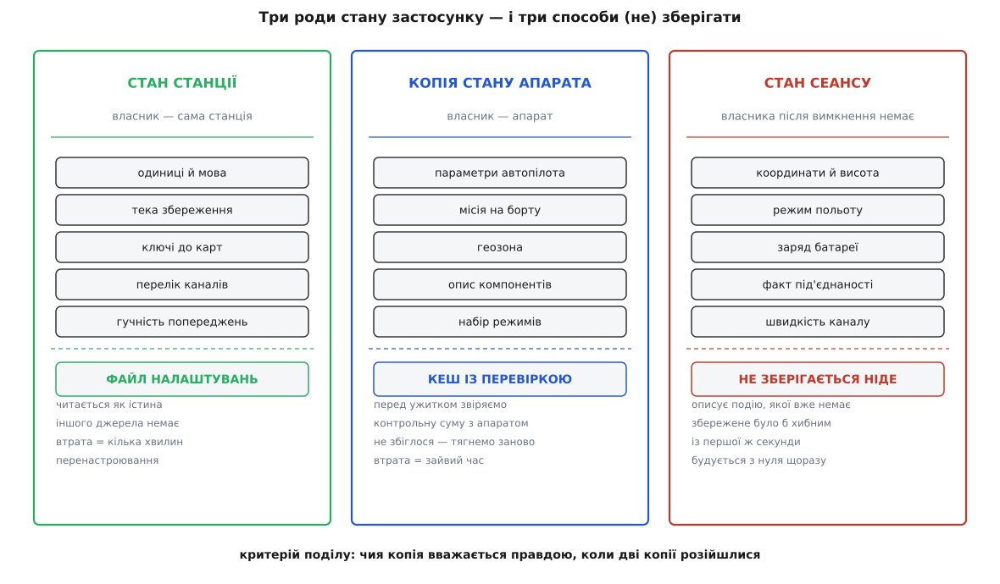

# Налаштування й що переживає перезапуск

<preknowlist>
- [Конфігурація](root:sf-apps/config-design) — навіщо програмі окремий шар налаштувань і як зовнішнє значення перекриває вбудоване типове.
- [Кеш](root:hw-arch/cache) — копія даних заради швидкості; вона ніколи не є джерелом істини й мусить уміти перевірити свою свіжість.
- [Енергонезалежне зберігання](root:hw-arch/persistent-storage) — що фізично означає «пережити вимкнення»: запис на носій і момент, коли запис зафіксовано.
- [FactSystem станції](root:sys-dron/fact-system) — факт як пара «значення + метадані»: тип, межі, одиниці, підпис, опис.
</preknowlist>

Вечір після польотів. За день ви перемкнули одиниці на метричні, вписали ключ до платних карт, додали канал через радіомодем на COM7, накачали тайли карти, підкрутили сорок параметрів автопілота й склали місію на завтра. Станцію закрито. Питання, з якого росте вся ця підсистема, звучить просто: **що з переліченого застосунок зобов'язаний пам'ятати завтра вранці?**

Відповідь «усе» хибна. І хибна не через ощадливість, а через правду. Сорок параметрів автопілота живуть не в станції — їх тримає апарат у своїй пам'яті. Якщо станція збереже копію й завтра покаже її як стан апарата, вона збреше тієї самої миті, коли хтось перепрошив автопілот, крутнув налаштування з іншої станції чи натиснув «скинути до заводських». Показати чуже старе значення як нинішній стан машини, яка зараз злетить, — не турбота про зручність, а готовність до біди.

Тому перше питання тут не «як записати», а **чиє це значення**.

## Три роди стану

Розкладімо все, що застосунок тримає в пам'яті, за одним критерієм: **хто власник значення** — чия копія вважається правдою, коли дві копії розійшлися.

**Стан станції.** Одиниці, мова, тека збереження, ключі до карт, перелік каналів, розмір кеша, гучність попереджень. Власник — сама станція. Іншого джерела немає: не запишеш — зникне безслідно, бо апарат про це нічого не знає. Цей рід мусить пережити перезапуск.

**Копія чужого стану.** Параметри автопілота, залита на борт місія, геозона. Власник — апарат. Станція має право зберегти копію на диск лише як кеш — прискорювач, що щоразу доводить свою свіжість, перш ніж ним скористатися.

**Стан сеансу.** Координати, висота, режим польоту, заряд, факт під'єднаності. У цього роду власника після вимкнення немає взагалі: значення описує подію, якої вже нема. Зберігати його безглуздо — при наступному запуску воно хибне з першої секунди.

*Один критерій ділить увесь стан застосунку на три роди, і кожному відповідає свій спосіб зберігання. Ліва колонка йде у файл налаштувань і читається як істина. Середня — у кеш, і читається лише після доведення свіжості. Права не зберігається ніде. Помилка проєктування майже завжди одна: значення із середньої колонки записали як ліве.*

## Налаштування

Візьмімо гучність звукових попереджень. Про це одне число застосунок мусить знати три різні речі: як його **показати** (підпис, одиниці, повзунок від 0 до 100), як **перевірити** введене (150 — не гучність) і як **записати**. Розкидані по трьох місцях коду, ці обов'язки й роблять просте додавання налаштування правкою чотирьох файлів, з яких один забувають.

У станції для цього вже є готова конструкція — [факт](root:sys-dron/fact-system), пара «значення + метадані про нього». Параметр апарата — факт, телеметрична величина — факт, отже й налаштування може бути фактом. Тоді інтерфейс однаково малює редактор і для параметра, і для гучності: обидва прийшли до нього в тій самій формі.

Лишається додати зв'язок із диском, і його додає окремий різновид факту: при народженні він бере значення зі сховища, а якщо збереженого немає — типове з метаданих; при кожній зміні негайно пише назад. Самі метадані описані не в коді, а в JSON-файлах усередині застосунку: ім'я, тип, типове значення, межі, одиниці, підписи.

Факти народжуються **ліниво** — не всі на старті, а тоді, коли до налаштування вперше звернулися. Звідси головна властивість файлу: **він не є повним знімком конфігурації, у ньому лише те, чого хтось торкався.** Решта живе у вбудованих метаданих. Практичний наслідок: нова версія станції може змінити типове значення, і воно застосується до всіх, хто цього налаштування не чіпав, — а в того, хто колись посунув повзунок, у файлі є свій запис, і він далі житиме зі старим числом.

> 🔧 **Навіщо це.** Скарга «на моєму ноутбуці станція поводиться інакше» розбирається трьома питаннями за хвилину. Чи є цей ключ у файлі взагалі — якщо ні, поведінку задає вбудоване типове значення й залежить вона лише від версії. Якщо є — чи не лишився він від часів, коли типове було іншим. І чи не працює людина з [вендорською збіркою](root:sys-dron/custom-build), де це налаштування сховане і тому примусово тримає типове.

Кнопки «Зберегти» в станції немає: кожна зміна лягає на диск одразу, тож падіння застосунку не забирає налаштувань із собою.

## Файл

Сховище дає інструментарій, на якому побудовано застосунок: він сам знає, куди на кожній системі класти налаштування користувача. Але станція робить один свідомий вибір понад цю типову поведінку — **примусово вмикає текстовий ini-формат** навіть там, де типовим сховищем є системний реєстр. Причина суто експлуатаційна: файл можна попросити надіслати, прочитати очима, скопіювати на інший комп'ютер, покласти в баг-репорт і видалити однією дією. Запис у реєстрі не має жодної з цих властивостей.

Шлях складається з двох рядків, зашитих у збірку, — імені організації та імені застосунку. Звідси `~/.config/QGroundControl/QGroundControl.ini` на Linux і `%APPDATA%\QGroundControl\QGroundControl.ini` на Windows. Денна збірка додає до імені слово `Daily` і тим отримує **власний** файл: її можна ставити поруч зі стабільною, не боячись за робочу конфігурацію, але й налаштувань із робочої вона не підхопить. Вендорська збірка міняє обидва рядки на свої, тому фірмова й апстримна станції на одній машині живуть, не помічаючи одна одної. Точні шляхи та ключі зібрано в [довіднику файлів і ключів станції](root:sys-dron/settings-persistence/api-settings-file.md).

Перший ключ у файлі — `SettingsVersion`, число формату (не версія застосунку). При старті станція звіряє його зі своїм і при розбіжності **стирає всі налаштування**, повідомивши про це користувача. Не переносить, а стирає — навмисно. Утрата налаштувань коштує кількох хвилин, а документів чистка не зачіпає взагалі. Неправильно ж перенесена конфігурація каналу коштує польоту: станція мовчки під'єднається не туди або з чужою швидкістю. Дешева й гучна втрата краща за дорогу й тиху помилку саме тому, що гучна: людина одразу бачить, що конфігурацію треба зробити наново.

## Кеш параметрів

Параметри автопілота належать апарату, а тягнути їх щоразу дорого: повне вичитування півтори тисячі параметрів через радіомодем — це десятки секунд, а на поганому каналі й хвилини, протягом яких налаштувати апарат неможливо.

Кеш тут чесний лише тому, що має **дешевий спосіб довести свіжість**. В автопілотів сімейства PX4 такий спосіб убудовано в протокол: апарат тримає службовий параметр із [контрольною сумою](root:com-protocol/crc-in-firmware) по іменах і значеннях усіх своїх нелетких параметрів. Станція запитує один цей параметр, рахує таку саму суму по своєму кешу й порівнює. Збіглося — кеш чинний. Не збіглося — кеш просто відкидається, і йде повний запит.

Тут важлива асиметрія: помилка кеша може коштувати **часу**, але не може коштувати **правильності** — жодна розбіжність не веде до показу застарілого значення. Це і є критерій придатного кеша. Лежить він окремими двійковими файлами поруч із налаштуваннями, з версією формату просто в назві: зміниться формат — старі файли ніхто не відкриє. Як ведеться це господарство, описано в [менеджері параметрів](root:sys-dron/parameter-manager).

## Канали, документи, тайли

У каналах зв'язку дві половини потрапляють у різні колонки. **Конфігурація** — ім'я, тип, порт COM7, швидкість 57600, ознака автопід'єднання — це стан станції, і вона зберігається у своїй секції файлу. **Саме з'єднання** — стан сеансу, і воно не зберігається ніяк. Файл зберігає **намір**: «спробуй під'єднатися сюди», а не «ти був під'єднаний». Перше при старті перевіряється реальністю (порт може бути зайнятий, апарат вимкнений), друге було б твердженням про світ, якого станція знати не може. Канал, який станція створила сама — знайшла плату на USB, — до файлу не потрапляє: записують те, що людина свідомо створила, інакше за місяць перелік каналів став би цвинтарем випадкових портів.

Найбільше з того, що переживає перезапуск, у налаштуваннях узагалі не лежить. Місії, [записана телеметрія](root:sys-dron/telemetry-logging), журнали, знімки, набори параметрів — звичайні файли в теці документів. Файл налаштувань знає про них рівно одне: шлях до кореня цієї теки. Так і має бути: документи мусять пережити не лише перезапуск, а й перевстановлення застосунку. Звідси правило переїзду на новий комп'ютер: скопіювати файл налаштувань і теку документів. Тайли карти — третє місце: база даних у системній теці кеша, яку має право прибрати навіть операційна система, бо втрата тайлів не є втратою даних.

Ці три місця й пояснюють, що робити з новим значенням, яке хочеться зберегти. Спитайте, хто його власник. Станція — оголосіть налаштуванням, і запис із читанням дістанете задарма. Апарат — це щонайбільше кеш, і спершу знайдіть дешеву перевірку свіжості; немає перевірки — немає й кеша. Власника немає — не зберігайте нічого: [модель апарата](root:sys-dron/vehicle-object) щоразу будується наново з того, що прийшло по каналу, і це її сила.
