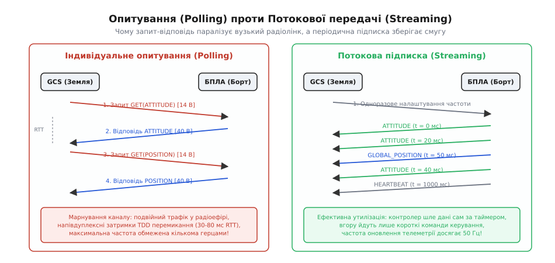
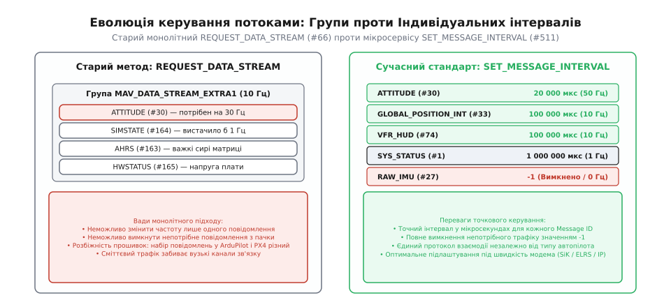
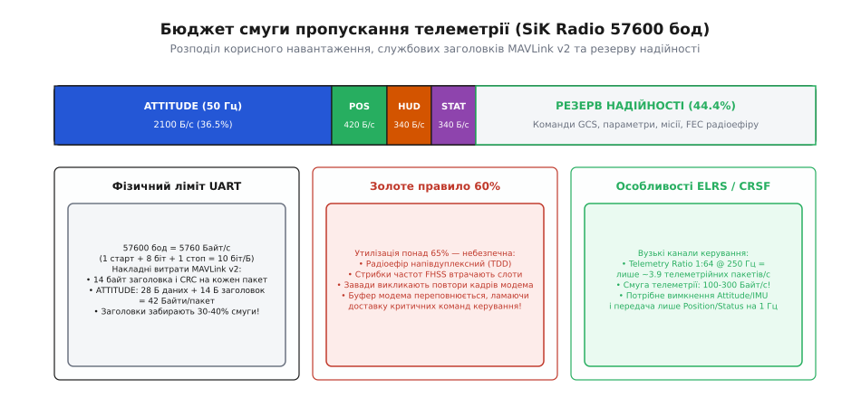
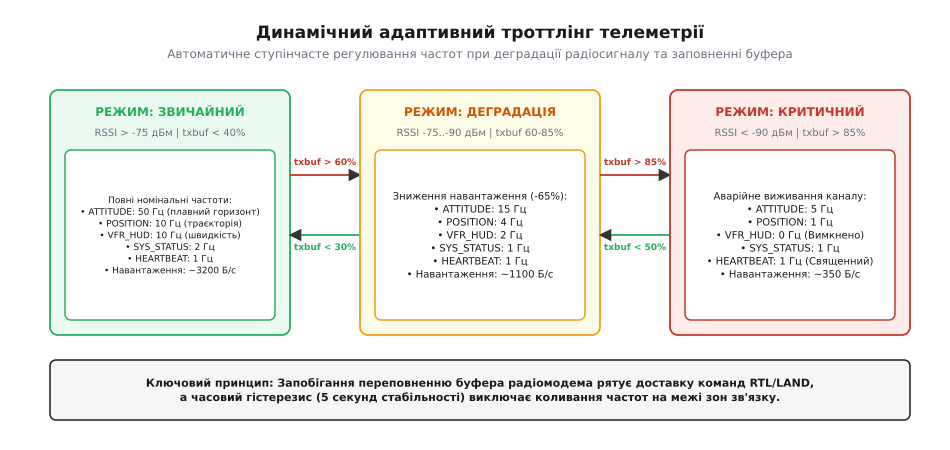

# Частоти телеметрії та керування смугою пропускання

<preknowlist>
- [Телеметрія: двосторонній потік](root:sys-dron/telemetry-stream) — пара бортового й наземного радіомодулів як прозорий міст.
- [Пакет MAVLink](root:sys-dron/mavlink-packet) — структура заголовків v1 та v2, корисне навантаження та CRC.
- [Команди MAVLink](root:sys-dron/mavlink-commands) — протокол виконання команд через COMMAND_LONG та відповіді COMMAND_ACK.
- [Керування потоком даних](root:com-transport/flow-control) — буфери FIFO, апаратний контроль RTS/CTS та наслідки переповнення.
- [Смуга пропускання і пропускна здатність](root:math-information/bandwidth-capacity) — теоретична ємність каналу та накладні витрати передачі.
</preknowlist>

Польотний контролер із прошивкою ArduPilot або PX4 з'єднано з радіомодемом SiK Telemetry через послідовний порт [UART](root:com-devices/uart) на швидкості 57600 бод. Оператор налаштовує в наземній станції отримання штучного горизонту ATTITUDE на 50 Гц, координат GLOBAL_POSITION_INT на 20 Гц, сирих даних гіроскопів RAW_IMU на 50 Гц та стану живлення SYS_STATUS на 10 Гц. Протягом перших секунд польоту все працює бездоганно, але щойно безпілотник відлітає на 800 метрів і рівень сигналу RSSI падає з −60 дБм до −88 дБм, радіомодем вмикає внутрішні повторні передачі кадрів, його апаратний вихідний FIFO-буфер переповнюється, і затримка доставки телеметрії раптово стрибає з 30 мілісекунд до 4.5 секунд. Наземна станція перестає вчасно отримувати пакети перевірки зв'язку HEARTBEAT, оголошує аварійний стан втрати радіозв'язку, а відправлена оператором команда негайного повернення додому застрягає в черзі за сотнями застарілих пакетів кутів крену.

Ця аварійна ситуація виникає через фундаментальний конфлікт: бажання оператора бачити максимально плавні графіки на екрані розбивається об фізичні ліміти радіоефіру. Радіоканал безпілотника — це не гігабітний Ethernet і не широкосмуговий Wi-Fi, а вкрай обмежене за швидкістю середовище з напівдуплексним поділом часу та неминучими втратами пакетів. Щоб літальний апарат залишався керованим і безпечним за будь-якої дистанції та рівня завад, інженер зобов'язаний точно розраховувати бюджет каналу, розуміти внутрішні механізми генерації потоків повідомлень та впроваджувати динамічне регулювання частот.

### Фізична природа вузького горла радіоліній

Головна омана розробників-початківців полягає в ототожненні швидкості послідовного порту UART зі швидкістю радіоефіру. Якщо польотний контролер налаштовано на швидкість 57600 бод, він здатний фізично виштовхувати в дріт до 5760 байтів на секунду (з урахуванням 10 бітів на байт у форматі 8N1). Проте радіомодем (наприклад, класичний SiK Telemetry 433/915 МГц на чипах Silicon Labs Si1000 або далекобійний RFD900) зовсім не передає ці байти безперервним суцільним потоком.

Радіомодем працює в режимі напівдуплексу (лат. *duplex* — подвійний) з часовим розділенням передачі й прийому — TDD (*Time Division Duplexing*). Бортовий і наземний модулі по черзі займають одну й ту саму радіочастоту. Кожен радіокадр обростає службовими преамбулами для синхронізації приймача, заголовками адресації та контрольними сумами. Крім того, модем постійно стрибає між п'ятдесятьма частотними каналами за алгоритмом FHSS (*Frequency-Hopping Spread Spectrum*), витрачаючи дорогоцінні мікросекунди на переналаштування синтезатора частоти під час кожного стрибка.

Якщо в ефірі увімкнено пряме виправлення помилок — FEC (*Forward Error Correction*, наприклад код Голея), кожен байт даних супроводжується надлишковими бітами корекції, що зменшує чисту швидкість корисних даних удвічі. У результаті «повітряна» швидкість ефіру 64 кбіт/с після вирахування TDD-пауз, витрат FHSS та кодування дає реальну пропускну здатність лише близько 2500–3200 байтів на секунду. Будь-яка спроба прошивки видати у порт 4500 байтів телеметрії на секунду призводить до того, що байти накопичуються у внутрішній пам'яті модема швидше, ніж летять в антену.

Ще жорсткіші обмеження діють у сучасних інтегрованих системах радіокерування, таких як ExpressLRS (ELRS) або TBS Crossfire (CRSF). У цих протоколах пріоритет віддано мінімальній затримці передачі стиків керування з пульта на дрон (пакети летять із частотою 100–500 Гц). Телеметрія (грец. *tēle* — далеко + *metron* — міра) повертається назад лише у спеціально виділених слотах часу за коефіцієнтом мультиплексування Telemetry Ratio (наприклад, 1:64 або 1:32). При частоті оновлення 250 Гц та коефіцієнті 1:64 зворотний телеметрійний пакет відправляється лише 3.9 раза на секунду. Загальна швидкість телеметрії в таких каналах стискається до мізерних 100–300 байтів на секунду.

```
+-------------------------------------------------------------------------------+
|     Порівняння фізичної пропускної здатності каналів телеметрії               |
+----------------------+--------------------+-----------------------------------+
| Тип радіолінії       | Швидкість інтерфейсу| Корисна смуга телеметрії в ефірі |
+----------------------+--------------------+-----------------------------------+
| Прямий кабель / USB  | 115200..921600 бод | 11.5 .. 92.0 кБ/с (необмежена)    |
| Wi-Fi / UDP-міст     | 1..54 Мбіт/с       | 50.0 .. 500.0 кБ/с (надлишкова)   |
| SiK Radio 57600      | 57600 бод (UART)   | 2.5 .. 3.2 кБ/с (вузьке горло)    |
| RFD900 Long Range    | 57600..115200 бод  | 3.5 .. 7.0 кБ/с (середня смуга)   |
| ExpressLRS (1:64)    | 115200..460800 бод | 0.15 .. 0.30 кБ/с (критично мала) |
| TBS Crossfire (1:32) | 115200 бод         | 0.25 .. 0.50 кБ/с (критично мала) |
+----------------------+--------------------+-----------------------------------+
```

### Концепція потоків проти індивідуального опитування

Коли архітектори [протоколу MAVLink](root:sys-dron/control-telemetry) обирали спосіб доставки телеметричних параметрів, перед ними постала класична дилема мережевої взаємодії: модель індивідуального опитування за запитом (*Request-Response / Polling*) проти моделі безперервної потокової публікації за підпискою (*Publish-Subscribe / Streaming*).

В архітектурі опитування наземна станція повинна була б явно запитувати кожен потрібний параметр: надіслати запит «дай мені кути орієнтації», дочекатися відповіді, потім надіслати запит «дай мені координати GPS», знову дочекатися відповіді. На локальній шині комп'ютера цей підхід працює бездоганно, але на напівдуплексній радіолінії він стає катастрофічним.


*Порівняння підходів доставки телеметрії: послідовне опитування марнує смугу на подвійний трафік і простоює під час затримок RTT, тоді як потокова передача утилізує канал повністю завдяки автономній генерації повідомлень автопілотом.*

При опитуванні на кожен пакет телеметрії припадає подвійна затримка поширення сигналу в ефірі (RTT, *Round-Trip Time*), час перемикання трансивера з прийому на передачу (turnaround time) та паразитичний розмір самого запиту (щонайменше 14 байтів у MAVLink v2). Якщо час повного обороту RTT на модемі становить 50 мс, станція фізично не зможе опитати датчики частіше ніж 20 разів на секунду сумарно для всіх систем апарата.

Тому стандарт телеметрії безпілотників побудовано на **потоковій моделі (Streaming)**:
1. Наземна станція керування (GCS) або бортовий комп'ютер надсилає конфігураційну команду **один раз** під час ініціалізації сесії зв'язку. У цій команді вказується перелік потрібних повідомлень та їхня бажана частота оновлення (інтервал передачі).
2. Польотний контролер зберігає ці параметри у своєму внутрішньому планувальнику завдань (*Scheduler*).
3. Періодичний диспетчер прошивки (наприклад, модуль `GCS_MAVLink` в ArduPilot або `mavlink_stream` у PX4) автономно генерує свіжі пакети з актуальними даними датчиків за власним апаратним таймером і ставить їх у чергу передачі UART.
4. Радіоканал навантажується виключно в один бік — від апарата до землі, забезпечуючи максимальну щільність пакування даних без жодних порожніх простоїв.

Зворотний канал (від землі до борта) залишається практично вільним. Ним лише зрідка проходять поодинокі керуючі команди [COMMAND_LONG](root:sys-dron/mavlink-commands), пакети навігаційних місій або запити на зміну параметрів конфігурації.

### Еволюція керування: від груп REQUEST_DATA_STREAM до мікросервісу інтервалів

Історично в першій версії протоколу MAVLink v1 частоти телеметрії налаштовувалися за допомогою групового повідомлення `REQUEST_DATA_STREAM` (#66). Інженери розбили весь масив телеметрії на десяток фіксованих категорій — перелік `MAV_DATA_STREAM`. Наземна станція вказувала ідентифікатор групи (наприклад, `MAV_DATA_STREAM_POSITION`) та загальну частоту в Герцах (наприклад, 10 Гц), після чого контролер починав транслювати всі повідомлення, приписані до цієї групи.


*Еволюція налаштування потоків: негнучкий монолітний підхід MAV_DATA_STREAM не дозволяв розділити частоти всередині пачки, тоді як сучасний мікросервіс MAV_CMD_SET_MESSAGE_INTERVAL дає точковий контроль кожного повідомлення за числовим ID.*

Груповий механізм швидко виявив критичні архітектурні недоліки:
- **Жорстке зв'язування:** Неможливо налаштувати різну частоту для повідомлень однієї категорії. Наприклад, у групі `EXTRA1` знаходилися повідомлення `ATTITUDE` (кути крену й тангажу) та `SIMSTATE` (стан симулятора). Якщо пілоту були потрібні кути на 30 Гц, автопілот був змушений гнати на 30 Гц і непотрібний `SIMSTATE`, марнуючи смугу.
- **Розбіжність прошивок:** Склад груп у різних польотних стеках відрізнявся. У прошивці ArduPilot до групи `EXTRA2` входив `VFR_HUD`, а в PX4 той самий потік міг містити інші діагностичні структури. Наземні програми мусили підтримувати окремі таблиці відповідності для кожного виробника автопілота.
- **Неможливість вибіркового вимкнення:** Щоб позбутися важкого повідомлення, оператор мав вимкнути всю групу цілком, втрачаючи інші корисні параметри.

Повний опис полів повідомлення `REQUEST_DATA_STREAM` та детальний склад кожної групи переліку `MAV_DATA_STREAM` наведено в довідковій вставці [📋 Специфікація мікросервісу Message Interval та груп MAV_DATA_STREAM](root:sys-dron/stream-rates/api-message-interval.md).

Щоб подолати ці обмеження, у сучасному MAVLink v2 було впроваджено офіційний стандарт — **Message Interval Protocol** (мікросервіс інтервалів повідомлень). Він повністю відмовився від абстрактних груп на користь індивідуального налаштування кожного конкретного повідомлення за його числовим ідентифікатором `Message ID`.

Керування здійснюється універсальною командою автопілота `MAV_CMD_SET_MESSAGE_INTERVAL` (#511), яка передається всередині кадру `COMMAND_LONG`:
- **`param1` (Message ID):** Числовий ідентифікатор повідомлення (наприклад, `30` для ATTITUDE або `33` для GLOBAL_POSITION_INT).
- **`param2` (Interval):** Бажаний період відправки в мікросекундах (`1 000 000 / частота_Гц`). Наприклад, для отримання 50 Гц задається `20000` мкс, для 10 Гц — `100000` мкс, для 1 Гц — `1000000` мкс.
- **Спеціальне значення `-1`:** Повністю зупиняє та вимикає генерацію даного повідомлення (0 Гц).
- **Спеціальне значення `0`:** Скидає частоту повідомлення на заводське значення за замовчуванням, зашите в конфігурації прошивки.
- **`param7` (Target):** Дозволяє вказати, куди саме спрямувати потік: транслювати у загальний радіолінк (0) чи надсилати виключно тому каналу/порту, з якого надійшов запит (1).

Зворотна команда `MAV_CMD_GET_MESSAGE_INTERVAL` (#512) змушує автопілот відповісти пакетом `MESSAGE_INTERVAL` (#299), де повертається фактично встановлений інтервал `interval_us`. Це дозволяє наземній станції контролювати реальний стан черги автопілота.

### Бюджет смуги пропускання та накладні витрати

Складання розрахункового балансу радіоканалу — обов'язковий інженерний етап проєктування безпілотного комплексу. Смуга пропускання розподіляється між повідомленнями залежно від фізичної динаміки процесів літального апарата.

```
+-------------------------------------------------------------------------------+
|         Розподіл потоків телеметрії за динамікою фізичних процесів            |
+---------------------+-------------------+-------------------------------------+
| Категорія динаміки  | Типові повідомлення| Фізичне обґрунтування частоти       |
+---------------------+-------------------+-------------------------------------+
| Швидка динаміка     | ATTITUDE (#30),   | 30 .. 50 Гц (радіо) / 100 Гц (дріт).|
| (кутова орієнтація) | AHRS (#163)       | Плавна візуалізація авіагоризонту,  |
|                     |                   | відсутність смикання шкали пілота   |
+---------------------+-------------------+-------------------------------------+
| Середня динаміка    | GLOBAL_POS (#33), | 5 .. 10 Гц. Швидкість оновлення     |
| (навігація й рух)   | VFR_HUD (#74),    | карти, відстеження треку польоту та |
|                     | LOCAL_POS (#32)   | динаміки набору висоти              |
+---------------------+-------------------+-------------------------------------+
| Повільна динаміка   | SYS_STATUS (#1),  | 1 .. 2 Гц. Температура, напруга й   |
| (стан систем)       | BATTERY (#147),   | струм батареї, пам'ять MCU змінюються|
|                     | GPS_RAW (#24)     | плавно, висока частота не потрібна  |
+---------------------+-------------------+-------------------------------------+
| Моніторинг зв'язку  | HEARTBEAT (#0),   | Рівно 1 Гц (суворий стандарт).      |
| (живучість каналу)  | RADIO_STATUS(#109)| Контроль наявності зв'язку, діагнос-|
|                     |                   | тика аварійного тайм-ауту (failsafe)|
+---------------------+-------------------+-------------------------------------+
```

Під час розрахунку трафіку критично важливо враховувати **накладні витрати протоколу**. Розмір корисного навантаження (Payload) повідомлення — це лише частина байтів, що летять у провід. Кожен пакет MAVLink v2 додає рівно 12 байтів службового заголовка та контрольної суми CRC (1 байт STX `0xFD`, 1 байт довжини, 2 байти прапорців сумісності, 1 байт лічильника послідовності, 1 байт системного ID, 1 байт компонентного ID, 3 байти ID повідомлення та 2 байти CRC).


*Розподіл смуги радіомодема 57600 бод: сумарний телеметричний трафік утримується в межах 55–60% ємності каналу, залишаючи недоторканний 40% резерв під команди, повтори помилкових кадрів та вичитування місій.*

Наприклад, повідомлення `ATTITUDE` містить 28 байтів даних (час у мікросекундах `time_boot_ms`, кути `roll`, `pitch`, `yaw` та кутові швидкості `rollspeed`, `pitchspeed`, `yawspeed` у форматі `float`). Разом із заголовком MAVLink v2 повний кадр займає `28 + 12 = 40` байтів. Якщо передавати його з частотою 50 Гц, лише один цей потік споживає:

```
Потік ATTITUDE
= 50 Гц · 40 Байт
= 2000 Байт/с                   [або 20 000 біт/с на рівні кадру UART]
```

Для каналу SiK Radio на 57600 бод (теоретичний максимум UART 5760 Б/с) один лише штучний горизонт забирає `2000 / 5760 = 34.7%` всієї доступної смуги!

Повний математичний апарат розрахунку бюджету смуги для всіх типів повідомлень, порівняння накладних витрат MAVLink v1/v2 та формули розрахунку сверхвузьких радіоканалів ExpressLRS детально виведено у вставці [🧮 Математичний розрахунок бюджету смуги пропускання телеметрії](root:sys-dron/stream-rates/math-bandwidth-budget.md).

> 🔧 **Золоте правило 60% утилізації каналу.**
> Розрахункове сумарне навантаження телеметрії ніколи не повинно перевищувати **60–65%** від номінальної пропускної здатності фізичного каналу зв'язку.
> 
> Резервні 35–40% смуги є обов'язковим буфером безпеки. Вони необхідні для:
> 1. **Передачі команд керування:** Щоб надіслана оператором команда зміни режиму або точки місії пройшла миттєво, не чекаючи черги.
> 2. **Обміну місіями та параметрами:** Вичитування точок місії під час польоту породжує сплески трафіку (*Bursts*).
> 3. **Компенсації радіозавад:** За наявності спотворень ефіру радіомодем витрачає частину смуги на повторні спроби передачі зіпсованих пакетів (Retransmissions). Якщо канал завантажений на 95%, перша ж радіозавада призведе до миттєвого переповнення буферів і зриву зв'язку.

### Деградація сигналу та динамічний троттлінг

У реальному польоті безпілотник постійно змінює відстань до станції та просторову орієнтацію антен. Коли дрон розвертається на віражі, вуглепластиковий фюзеляж, силові акумулятори або двигуни можуть затіняти антену, спричиняючи різке падіння рівня сигналу RSSI (*Received Signal Strength Indicator*) на 15–25 дБ.

У цей момент фізичний радіоканал деградує: частка помилкових бітів (BER, *Bit Error Rate*) зростає, модем витрачає більше часу на виправлення помилок або повторну передачу пакетів. Реальна пропускна здатність ефіру падає з 3000 Б/с до 800 Б/с.

Якщо польотний контролер продовжує штовхати в UART номінальні 3300 Б/с, виникає явище **заторного колапсу (Congestion Collapse)**:
1. Вхідний буфер FIFO радіомодема заповнюється до 100%.
2. Модем починає відкидати нові байти (Buffer Overflow Drops) або розривати MAVLink-пакети навпіл.
3. Черга повідомлень усередині буфера модема утворює часову затримку в кілька секунд. Наземна станція показує штучний горизонт із запізненням у 4 секунди, що робить ручне пілотування за приладами неможливим.
4. Пакет `HEARTBEAT` не встигає пройти крізь чергу, через що наземна станція фіксує аварійний тайм-аут і вмикає звукову сигналізацію тривоги.


*Трирівневий автомат адаптивного регулювання: заповнення вихідного буфера модема або падіння сигналу миттєво знижує частоти другорядних потоків, а часовий гістерезис захищає від хитання частот під час маневрів.*

Щоб запобігти цьому колапсу, застосовується **динамічний адаптивний троттлінг (Dynamic Telemetry Throttling)** (англ. *throttle* — душити, регулювати заслінкою). Це алгоритм зворотного зв'язку, що реалізується на борті БПЛА або на наземній станції.

Основним джерелом даних для троттлінгу є діагностичне повідомлення `RADIO_STATUS` (#109), яке радіомодем SiK транслює у польотний контролер та станцію з частотою 1–2 Гц. У цьому повідомленні передається поле `txbuf` — відсоток заповненості вихідного буфера передавача модема (0–100%), а також рівні сигналу `rssi`, фонового шуму `noise` та лічильник помилок `rxerrors`.

#### Логіка трирівневого автомата станів
Алгоритм динамічного троттлінгу керує перемиканням трьох режимів навантаження:

1. **Режим NORMAL (Звичайний зв'язок):**
   - *Умови:* Рівень сигналу відмінний (`RSSI > -75` дБм), буфер передавача вільний (`txbuf < 40%`).
   - *Конфігурація:* Повні частоти телеметрії (ATTITUDE 50 Гц, POSITION 10 Гц, HUD 10 Гц, STATUS 2 Гц).
   - *Трафік:* ~3300 Байт/с.

2. **Режим DEGRADED (Помірна деградація / затор):**
   - *Умови активації:* Заповнення буфера `txbuf > 60%` або рівень сигналу впав нижче −75 дБм.
   - *Дія:* Ступінчасте зниження частот швидких потоків на 60–70% (ATTITUDE знижується до 15 Гц, POSITION до 4 Гц, HUD до 2 Гц).
   - *Трафік:* Знижується до ~1100 Байт/с. Це миттєво розвантажує буфер модема й ліквідує чергу.

3. **Режим CRITICAL (Критичний стан / дальня межа зв'язку):**
   - *Умови активації:* Заповнення буфера `txbuf > 85%` або сигнал нижче −90 дБм (на межі обриву).
   - *Дія:* Аварійне виживання каналу. ATTITUDE стискається до 5 Гц, POSITION до 1 Гц, другорядні потоки (HUD, сирі дані сенсорів) вимикаються повністю (`-1`).
   - *Недоторканний мінімум:* Повідомлення `HEARTBEAT` (1 Гц) та `SYS_STATUS` (1 Гц) **не вимикаються ніколи**.
   - *Трафік:* Спадає до рятівних ~350 Байт/с, дозволяючи зберегти радіолінк навіть на дистанціях 15–20 км.

#### Захист від коливань (Часовий гістерезис)
Найнебезпечніша помилка під час реалізації троттлінгу — перемикання частот на кожному кроці вимірювання. Якщо літак виконує віраж, рівень сигналу може коливатися щосекунди. Без захисту контролер почне бомбардувати радіоканал десятками команд `SET_MESSAGE_INTERVAL`, створюючи шторм службового трафіку.

Для стабілізації застосовується принцип несиметричного гістерезису (грец. *hysterēsis* — відставання):
- Перехід **вниз** (погіршення частот) відбувається **миттєво** — безпека вимагає негайного скидання навантаження при переповненні буфера.
- Повернення **вгору** (відновлення високих частот) дозволяється лише тоді, коли радіоканал залишається ідеально стабільним (`txbuf < 30%`) протягом щонайменше **5 секунд поспіль**.

Повну програмну реалізацію автомата адаптивного троттлінгу мовами C та C++ з фільтрацією черг та обробкою подій наведено у практичній вставці [⚙️ Практична реалізація динамічного троттлінгу телеметрії](root:sys-dron/stream-rates/proj-dynamic-throttling.md).

### Практика налаштування в польотних стеках (ArduPilot та PX4)

В інженерній практиці керування частотами телеметрії реалізується як через параметри конфігурації прошивки, так і через алгоритми наземних станцій.

#### 1. Екосистема ArduPilot
В автопілотах ArduPilot (Plane, Copter, Rover) для кожного послідовного порту телеметрії виділено набір параметрів `SRx_*` (де `x` — номер порту телеметрії, наприклад `SR1` для першого модема Telem1, `SR2` для Telem2):
- `SR1_EXTRA1` — частота генерації орієнтації ATTITUDE (типово 4–10 Гц для радіо, 20–50 Гц для USB).
- `SR1_EXTRA2` — частота приладової швидкості та висоти VFR_HUD (типово 4–10 Гц).
- `SR1_POSITION` — частота навігаційних координат GLOBAL_POSITION_INT (типово 2–5 Гц).
- `SR1_EXT_STAT` — стан систем та GPS SYS_STATUS, GPS_RAW_INT (типово 1–2 Гц).
- `SR1_RAW_SENS` — сирі дані гіроскопів та акселерометрів (типово 0 Гц для радіоліній; вмикається лише для калібрування).

Параметр `SERIAL1_BAUD` задає швидкість порту UART (за замовчуванням `57` = 57600 бод).

#### 2. Екосистема PX4 Autopilot
У прошивці PX4 керування потоками реалізовано модулем `mavlink`. Конфігурація здійснюється через параметри порту:
- `MAV_1_CONFIG` — призначає апаратний UART (наприклад, `TELEM 1`).
- `MAV_1_MODE` — задає типовий профіль навантаження:
  - `Normal` (стандартна телеметрія для радіомодемів SiK, оптимізована під 57600 бод);
  - `Custom` (ручне налаштування окремих потоків через команди консолі `mavlink stream`);
  - `Onboard` (високошвидкісний потік для зв'язку з бортовим комп'ютером Companion Computer на швидкості 921600 бод, де кути генеруються на 50–100 Гц);
  - `ExtVision` (спеціальний профіль для одометрії та комп'ютерного зору).
- `MAV_1_RATE` — максимальний ліміт сумарного потоку байтів на секунду (Data Rate Limit), який планувальник PX4 гарантовано не перевищує, відкидаючи низькопріоритетні пакети у разі перевищення ліміту.

#### 3. Поведінка наземних станцій (QGroundControl та Mission Planner)
Сучасна станція QGroundControl автоматично визначає тип підключення. Якщо станція бачить пряме USB-з'єднання, вона запитує максимальні частоти (50 Гц ATTITUDE) для плавної анімації інтерфейсу. Якщо підключення відбувається через радіомодем (визначається за наявністю пакетів `RADIO_STATUS` або явним вибором каналу 57600 бод), QGroundControl автоматично обмежує запитувані частоти до 10–15 Гц, зберігаючи смугу каналу для безпечного польоту.

---

### Підсумок

Керування частотами телеметрії — це фундаментальний компроміс між свіжістю інформації на екрані оператора та надійністю радіозв'язку. Послідовний порт 57600 бод забезпечує фізичну смугу лише близько 3.0 кБ/с чистої телеметрії. 

Грамотно спроєктована система розподіляє цей ресурс за динамікою процесів: швидкі кути орієнтації отримують 30–50 Гц, координати — 5–10 Гц, стан систем — 1–2 Гц, а моніторинг зв'язку HEARTBEAT закріплюється на строгому 1 Гц. Загальна утилізація каналу не повинна перевищувати 60%, а впровадження мікросервісу `MAV_CMD_SET_MESSAGE_INTERVAL` разом із динамічним троттлінгом гарантує, що безпілотник збереже стійкий контроль навіть за критичного падіння радіосигналу на далеких дистанціях.
