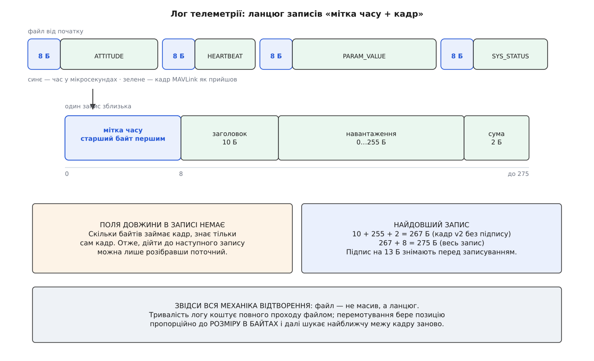
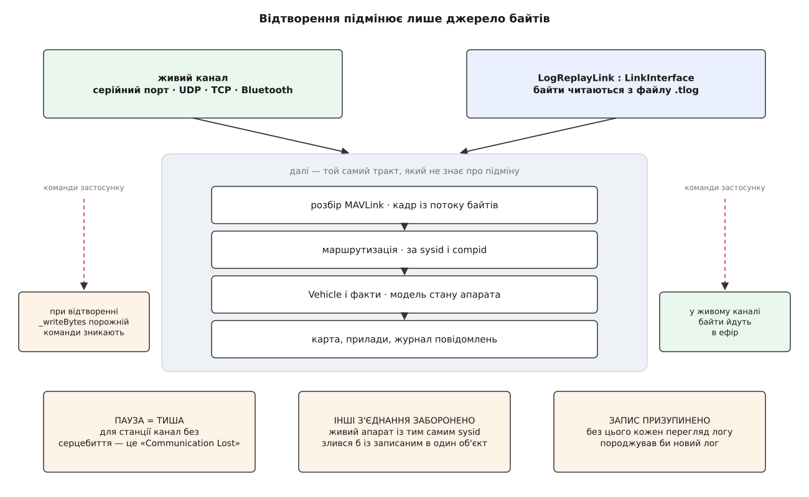

# Запис телеметрії й відтворення логів

<preknowlist>
- [Пакет MAVLink](topic:sys-dron/mavlink-packet) — з чого складається кадр: стартовий байт, довжина, ідентифікатори відправника, навантаження, контрольна сума.
- [Обробка MAVLink](topic:sys-dron/mavlink-handling) — де саме потік байтів з каналу перетворюється на цілі кадри.
- [Менеджер каналів](topic:sys-dron/link-manager) — що таке канал зв'язку в застосунку, як він з'являється й зникає.
- [Байти й порядок байтів](topic:sf-algorithms/bits-bytes-endianness) — старший-перший і молодший-перший, і чому одне й те саме число в пам'яті двох машин лежить по-різному.
</preknowlist>

На екрані станції завжди лише останнє значення. Поле висоти показує ту висоту, яка прийшла щойно; попередня зникла тієї миті, коли її перезаписали.

А питання, заради яких наземну станцію взагалі тримають, майже всі про минуле. Чому апарат перекинувся на злеті. Коли зник зв'язок і що показували останні кадри. Який режим стояв за секунду до падіння. З поточного стану на таке не відповісти — його вже нема.

Отже, потік повідомлень треба відкладати у файл. І перше ж рішення визначає все інше: складати туди розібрані **значення** чи самі **кадри**?

Значення зручні: висота, крен, напруга, час — готова таблиця. Але це означає вирішити наперед, які поля колись знадобляться, а розслідування майже завжди впирається саме в те поле, про яке ніхто не думав. Тому станція складає у файл кадри — байт у байт такими, як вони прийшли. Що вони означають, вирішить той, хто читатиме файл, і вирішить тоді, коли знатиме, що шукає.

У цього рішення є друга властивість, ненавмисна й важливіша за першу. Файл із кадрів дає те саме, що дає канал зв'язку: послідовність кадрів. Отже, такий файл можна не тільки читати аналізатором, а й підсунути застосункові **замість каналу**.

## Кран стоїть після перевірки

Здається природним писати сирі байти прямо з порту. Станція так не робить, і причина в тому, що лізе з дроту насправді: сміття від увімкнення живлення, обірвані на середині кадри, кадри з розбитою контрольною сумою.

Тому кран стоїть далі — у циклі розбору, **після** вердикту «кадр цілий». Наслідок прямий: у лозі телеметрії немає биття. Якщо кадр там лежить, він був цілим, коли станція його прийняла. Ціна теж пряма: того, що не долетіло або долетіло зіпсованим, у лозі немає взагалі. Лог не показує, наскільки поганим був радіоканал, — він показує лише те, що крізь той канал пробилося.

У той самий файл лягає й вихідний бік — усе, що станція надіслала апаратові. Обидва напрямки лежать вперемішку й без позначки напрямку; розрізнити їх можна тільки за ідентифікатором системи у кадрі.

> 🔧 **Навіщо це.** Розслідуючи невиконану команду, перше, що варто зробити з логом, — переконатися, що команда в ньому взагалі є. Кадру немає — станція його не надсилала, і апарат ні до чого. Кадр є, а відповіді за ним немає — команда не долетіла або її відкинув автопілот.

## Запис: вісім байтів часу і кадр

Кадр не несе часу свого прибуття. У деяких повідомленнях є поле з часом від запуску автопілота, у деяких немає нічого, і жодне з них не каже, коли станція про подію дізналася. А для розслідування потрібне саме це.

Тому одиниця файлу — **запис** із двох частин:

```
[ 8 байтів: мікросекунди від початку епохи Unix, старший байт першим ]
[ кадр MAVLink як є: від стартового байта до контрольної суми        ]
```

Мітка стоїть **перед** кадром: читач файлу спершу дізнається час і лише потім вирішує, чи розбирати кадр узагалі.

Час беруть настінний — той, що показує календарну дату й який користувач може перевести. Рівний лічильник був би точнішим для вимірювання проміжків, зате нікчемним для головного: зіставити подію з відео, з бортовим логом, із радіожурналом того самого дня. Ціна відома — перевели годинник посеред сеансу, і мітки стрибнуть разом із ним.

Поле оголошене в мікросекундах, а значення береться з точністю до мілісекунди. Кілька кадрів, прийнятих в одну мілісекунду, отримають **однакову** мітку, і порядок між ними зберігає тільки порядок у файлі.

І головне, чого у форматі **немає**: поля довжини запису. Скільки байтів займає кадр, знає лише сам кадр. Отже, дійти до наступного запису можна єдиним способом — розібрати поточний до кінця. Файл телеметрії не масив, а ланцюг: сотий запис недосяжний, доки не пройдено дев'яносто дев'ять попередніх.



*Довжину запису знає тільки кадр усередині нього, тож перехід до наступного запису коштує повного розбору поточного.*

Файл росте передбачувано. **Умова: телеметрія по USB, 120 повідомлень за секунду, середній кадр 45 байтів.**

```
один запис    = 45 + 8        = 53 Б
потік на диск = 53 · 120      = 6360 Б/с ≈ 6.2 КіБ/с
година польоту = 6360 · 3600  ≈ 21.8 МіБ
```

## Коли файл починається і коли закривається

Запис відкривається на першому серцебитті — мінімальній ознаці того, що на іншому кінці хтось є. Закривається тоді, коли зникає останній апарат у переліку. Прив'язка саме до апаратів, а не до каналів, дає потрібну поведінку: апарат, який чути одночасно через модем і через мережу, лишається одним апаратом, а апарат, який замовк, зникає через тайм-аут навіть при формально відкритому каналі.

Увесь політ станція пише в тимчасовий файл. Уже при закритті вирішується його доля: якщо апарат хоч раз був зброєний, файл переносять у теку телеметрії, якщо ні — викидають. За цим стоїть проста арифметика: апарат під'єднують у сто разів частіше, ніж піднімають у повітря, і без такого фільтра тека за місяць мала б сотні файлів, з яких три-чотири містять політ. Кому потрібні й наземні сеанси, вимикають фільтр у налаштуваннях.

Тимчасовий файл дає ще одне, важливіше. У нього лише дописують у кінець, тож у будь-яку мить це коректний файл, просто коротший за задуманий. Якщо застосунок упаде посеред польоту, записане залишиться на диску, і наступний запуск запропонує його зберегти. Зіпсованим буде щонайбільше останній запис, обірваний на середині.

## Відтворення: лог, що прикидається каналом

Тепер повертається властивість, яка з'явилася сама собою на початку. Програвач логу оголошено спадкоємцем того самого інтерфейсу, що й серійний порт чи сокет, — і цим задачу закрито. Він реєструється в менеджері каналів як звичайне з'єднання, віддає байти тим самим сигналом, ті байти йдуть у той самий розбирач, звідти в ту саму маршрутизацію, звідти в той самий об'єкт апарата. Ніщо вище рівня каналу не знає, що апарата не існує; у переліку [типів каналів](topic:sys-dron/link-types) просто з'являється ще один — файловий.



*Програвач стає в чергу на місце каналу, тому решта застосунку працює зі станом апарата так само, як у польоті.*

Звідси й дивацтва, які інакше здавалися б помилками. Команди застосунку нікуди не йдуть: у файлового каналу відправлення порожнє. Пауза для решти застосунку — просто тиша в каналі, тому за кілька секунд станція чесно повідомляє про втрату зв'язку. І поки лог відтворюють, власний запис телеметрії призупинено, інакше кожен перегляд породжував би новий файл.

Перемотування впирається в те, що файл — ланцюг. Індексу «час → зсув» станція не будує: він коштував би повного проходу файлом при кожному відкритті. Тому програвач стрибає **пропорційно до розміру у байтах**, скидає стан розбирача й дає йому знайти найближчий кадр, чия контрольна сума зійшлася. Наближення чесне, але наближення: щільність повідомлень нерівномірна, тож половина файлу — це не обов'язково середина за часом.

Темп програвач тримає за розкладом від початку файлу, а не додаванням пауз одна до одної. Інакше похибка кожного кроку накопичувалася б, і до кінця запису відтворення відставало б від справжніх міток на секунди.

## Лог станції — не лог апарата

Апарат веде **власний бортовий лог** на своїй картці пам'яті: з частотою внутрішніх циклів керування, з виходами регуляторів, сирими показниками давачів і внутрішніми оцінками фільтра. Назовні ці сигнали не передаються ніколи.

У лозі станції лежить рівно те, що апарат погодився надсилати, з тими [частотами потоків](topic:sys-dron/stream-rates), які станція замовила. Крен, який автопілот рахує тисячу разів за секунду, потрапить у файл десять разів за секунду. Тому там, де питання про поведінку регулятора чи давача, лог станції не допоможе — треба забирати [бортовий лог](topic:sys-dron/vehicle-logs), а це окрема робота з окремим протоколом.
