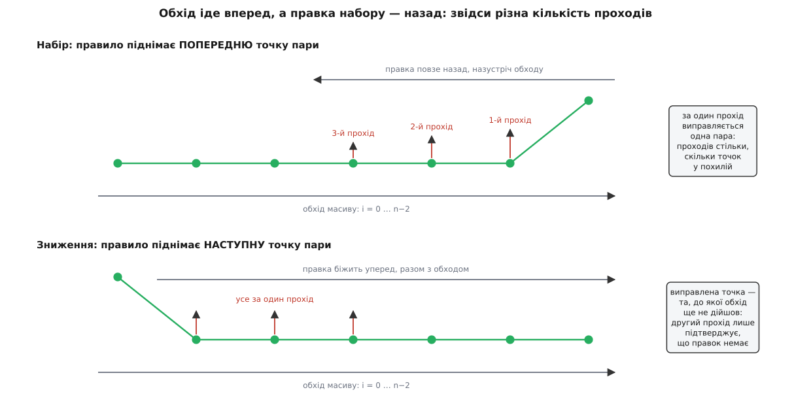
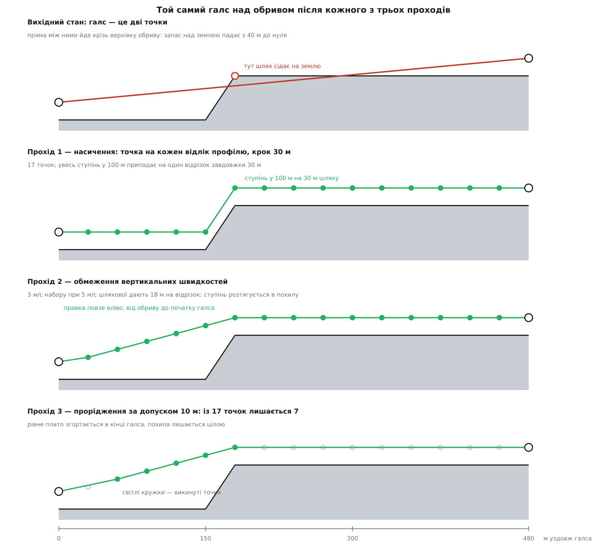

# ⚙️ Три проходи: як зйомка розкладає галс на шлях за рельєфом

Галс площинної зйомки — це два числа: координата початку й координата кінця. Щоб такий галс пройшов над схилом на сталій відстані до землі, застосунок мусить сам перетворити пряму на ламану з десятків точок — і робить це трьома послідовними проходами по одному масиву, де кожен прохід розв'язує рівно одну задачу й псує роботу попереднього рівно настільки, наскільки має право.

## Що дано і чого треба досягти

[Патерни зйомки](root:sys-dron/survey-patterns) зводяться до однієї внутрішньої структури — списку галсів:

```cpp
QList<QList<CoordInfo_t>>                   _transects;
QList<TerrainPathQuery::PathHeightInfo_t>   _rgPathHeightInfo;
QList<CoordInfo_t>                          _rgFlightPathCoordInfo;
```

Кожен галс — список точок; у площинній зйомці їх зазвичай дві, у коридорній чи з увімкненими розворотними хвостами більше. Точка несе координату й позначку свого походження:

```cpp
enum CoordType {
    CoordTypeInterior,              ///< Interior waypoint for flight path only
    CoordTypeInteriorHoverTrigger,  ///< Interior waypoint for hover and capture trigger
    CoordTypeInteriorTerrainAdded,  ///< Interior waypoint added for terrain
    CoordTypeSurveyEntry,           ///< Waypoint at entry edge of survey polygon
    CoordTypeSurveyExit,            ///< Waypoint at exit edge of survey polygon
    CoordTypeTurnaround,            ///< Turnaround extension waypoint
};
```

Позначка `CoordTypeInteriorTerrainAdded` — єдина, яку ставить сам механізм рельєфу, і саме вона потім дає третьому проходу право викинути точку. Решта позначок — це геометрія зйомки, недоторканна.

Тепер вимоги. Їх три, і жодна формула не задовольняє всі разом.

**Точність.** Ламана має триматися заданої відстані до поверхні. Дрібніше за крок моделі рельєфу — приблизно 30 метрів — триматися нема з чого: [цифрова модель рельєфу](root:sf-visual/terrain-elevation-model) просто не знає, що там між сусідніми вузлами сітки.

**Здійсненність.** Модель уміє змінюватися на сто метрів між двома сусідніми вузлами. Апарат — ні. Ламана, яка вимагає шістнадцяти метрів на секунду набору від апарата, здатного на три, не є планом польоту: апарат почне відставати від заданої висоти й фактично полетить не тим шляхом, який показала станція.

**Ціна.** Кожна точка, що дожила до кінця, стає окремим елементом місії. Це видно з підрахунку довжини складного елемента: гілка `CoordTypeInteriorTerrainAdded` дає рівно `itemCount++`, тобто одну точку маршруту. Галс завдовжки в кілометр при кроці 30 метрів дає 34 елементи; тридцять галсів — понад тисячу, і це вже за межами того, що влізе в пам'ять багатьох автопілотів і що розумно вивантажувати по радіо.

Три вимоги тягнуть у різні боки: точність вимагає більше точок, здійсненність — змінити їхні висоти, ціна — точок менше. Тому й проходів три.

## Звідки береться профіль

Перед будь-яким проходом потрібні висоти землі вздовж усього візерунка. Їх беруть одним запитом на весь елемент — усі галси зшивають у єдину ламану:

```cpp
// Append all transects into a single PolyPath query
QList<QGeoCoordinate> transectPoints;
for (const QList<CoordInfo_t>& transect: _transects) {
    for (const CoordInfo_t& coordInfo: transect) {
        transectPoints.append(coordInfo.coord);
    }
}

if (transectPoints.count() > 1) {
    _currentTerrainPolyPathQuery = new TerrainPolyPathQuery(true /* autoDelete */);
    connect(_currentTerrainPolyPathQuery, &TerrainPolyPathQuery::terrainDataReceived,
            this, &TransectStyleComplexItem::_polyPathTerrainData);
    _currentTerrainPolyPathQuery->requestData(transectPoints);
}
```

Відповідь — список профілів, по одному на кожну послідовну пару точок зшитої ламаної:

```cpp
struct TerrainPathHeightInfo {
    double          distanceBetween;        ///< Distance between each height value
    double          finalDistanceBetween;   ///< Distance between final two height values
    QList<double>   heights;                ///< Terrain heights along path
};
```

Звідси головний інваріант усього механізму: **порядок профілів у відповіді повторює порядок відрізків у зшитій ламаній**, включно з відрізками між кінцем одного галса й початком наступного. Той, хто читає відповідь, зобов'язаний іти тим самим порядком і нічого не пропустити — інакше висоти поїдуть на один відрізок і шлях буде побудований за чужим профілем. Ніякого ключа чи ідентифікатора у відповіді немає: порядок — єдиний зв'язок між профілем і відрізком, якому він належить.

Запит іде після паузи в секунду (`_terrainQueryTimeoutMsecs = 1000`), щоб перетягування полігона мишею не породило зливу звернень, і доки відповідь не прийшла, `_rgPathHeightInfo` порожній, а елемент вважається неготовим до збереження.

## Точка входу

Усе, що відбувається далі, вкладено в один `switch` — і в ньому одразу видно, що три проходи потрібні тільки одному режиму:

```cpp
case QGroundControlQmlGlobal::AltitudeFrameRelative:
case QGroundControlQmlGlobal::AltitudeFrameAbsolute:
    // No additional work needed
    return;
case QGroundControlQmlGlobal::AltitudeFrameCalcAboveTerrain:
    _buildFlightPathCoordInfoFromPathHeightInfoForCalcAboveTerrain();
    _adjustForMaxRates();
    _adjustForTolerance();
    _minAMSLAltitude = qQNaN();
    _maxAMSLAltitude = qQNaN();
    for (const CoordInfo_t& coordInfo: _rgFlightPathCoordInfo) {
        _minAMSLAltitude = std::fmin(_minAMSLAltitude, coordInfo.coord.altitude());
        _maxAMSLAltitude = std::fmax(_maxAMSLAltitude, coordInfo.coord.altitude());
    }
    emit lastSequenceNumberChanged(lastSequenceNumber());
    break;
```

Дрібниця, яку легко проминути: межі висот засівають значенням `qQNaN()`. Це працює, бо `std::fmin` і `std::fmax` за стандартом повертають не-NaN аргумент, коли другий NaN, — тобто NaN тут нейтральний елемент, а не отрута. Зі звичайним `<` така засівка мовчки зіпсувала б обидва числа. Якщо ж шлях виявився порожнім, обидві межі лишаються NaN, і це чесна відповідь «невідомо».

Останній рядок гілки — `emit lastSequenceNumberChanged(...)` — каже, що кількість елементів місії стає відома лише після третього проходу. До нього застосунок не знає, скільки місця займе зйомка в плані.

## Прохід перший: насичення

```cpp
void TransectStyleComplexItem::_buildFlightPathCoordInfoFromPathHeightInfoForCalcAboveTerrain(void)
{
    double distanceToSurface = _cameraCalc.distanceToSurface()->rawValue().toDouble();

    _rgFlightPathCoordInfo.clear();
    int pathHeightIndex = 0;
    for (int transectIndex=0; transectIndex<_transects.count(); transectIndex++) {
        const QList<CoordInfo_t>& transect = _transects[transectIndex];

        // Build flight path for transect
        for (int transectCoordIndex=0; transectCoordIndex<transect.count() - 1; transectCoordIndex++) {
            CoordInfo_t fromCoordInfo   = transect[transectCoordIndex];
            CoordInfo_t toCoordInfo     = transect[transectCoordIndex+1];

            const auto& pathHeightInfo = _rgPathHeightInfo[pathHeightIndex++];

            fromCoordInfo.coord.setAltitude(distanceToSurface + pathHeightInfo.heights.first());
            toCoordInfo.coord.setAltitude(distanceToSurface + pathHeightInfo.heights.last());

            if (transectCoordIndex == 0) {
                _rgFlightPathCoordInfo.append(fromCoordInfo);
            }

            // Add interstitial points at max resolution of our terrain data
            int cHeights = pathHeightInfo.heights.count();

            double azimuth  = fromCoordInfo.coord.azimuthTo(toCoordInfo.coord);
            double distance = fromCoordInfo.coord.distanceTo(toCoordInfo.coord);

            for (int interstitialIndex=1; interstitialIndex<cHeights - 1; interstitialIndex++) {
                double interstitialTerrainHeight = pathHeightInfo.heights[interstitialIndex];
                double percentTowardsTo = (1.0 / (cHeights - 1)) * interstitialIndex;

                CoordInfo_t interstitialCoordInfo;
                interstitialCoordInfo.coordType = CoordTypeInteriorTerrainAdded;
                interstitialCoordInfo.coord     = fromCoordInfo.coord.atDistanceAndAzimuth(distance * percentTowardsTo, azimuth);
                interstitialCoordInfo.coord.setAltitude(interstitialTerrainHeight + distanceToSurface);

                _rgFlightPathCoordInfo.append(interstitialCoordInfo);
            }

            _rgFlightPathCoordInfo.append(toCoordInfo);
        }
        ...
    }
}
```

Читається просто, але в ньому три речі, кожна з яких важить.

**Кінці відрізка беруть свої висоти з країв профілю**, а не з проміжного циклу — тому внутрішній цикл і йде від `1` до `cHeights - 2`. Кінці галса лишаються рівно там, де їх поставила геометрія зйомки, зі своїми початковими позначками `CoordTypeSurveyEntry` / `CoordTypeSurveyExit`; висота — єдине, що їм міняють. Проміжна точка додається тільки як `CoordTypeInteriorTerrainAdded`, і дублювання на стиках немає: точка `toCoordInfo` попереднього відрізка вже в списку, а `fromCoordInfo` наступного додається лише при `transectCoordIndex == 0`.

**`pathHeightIndex` іде вручну й наскрізно**, через усі галси, і те саме продовження функції додатково зсуває його на розворотному відрізку між галсами:

```cpp
// Add terrain interstitial points to the turn segment if not the last transect
if (transectIndex != _transects.count() - 1) {
    const auto& pathHeightInfo = _rgPathHeightInfo[pathHeightIndex++];
    ...
}
```

Це і є той інваріант зі зшитої ламаної, тільки записаний у вигляді лічильника. Розворот між галсами насичується так само, як сам галс, — апарат і між рядами йде за рельєфом. Після останнього галса розвороту немає, тож і профілю зайвого не беруть.

**Проміжні точки розставляють рівномірно за часткою `(1.0 / (cHeights − 1)) · i`**, а поля `distanceBetween` і `finalDistanceBetween` не використовують узагалі. Профіль же відлічений із рівним кроком, і лише останній проміжок коротший — інакше друге поле не мало б сенсу. Отже там, де довжина відрізка не кратна кроку профілю, план ставить точку трохи ближче до початку, ніж місце, звідки взято її висоту. Розбіжність обмежена одним кроком сітки, тобто тими самими тридцятьма метрами, на яких модель і так усе згладжує, — але існує вона реально.

Результат проходу: роздільність шляху дорівнює роздільності даних. Далі точнішого шляху вже нізвідки взяти.

> 🔧 **Навіщо це.** Якщо в елементі зйомки над рельєфом видно неправдоподібний профіль — висоти ніби зсунуті на один ряд, — перше, що варто перевірити, це не якість даних, а лічильник профілів: галси й розвороти беруть висоти з одного спільного списку в жорсткому порядку, і будь-яка зміна набору галсів між запитом і відповіддю робить весь цей порядок недійсним. Саме тому `_rgPathHeightInfo` очищають на кожній перебудові галсів, а не намагаються перевикористати.

## Прохід другий: обмеження вертикальних швидкостей

```cpp
void TransectStyleComplexItem::_adjustForMaxRates(void)
{
    double maxClimbRate     = _terrainAdjustMaxClimbRateFact.rawValue().toDouble();
    double maxDescentRate   = _terrainAdjustMaxDescentRateFact.rawValue().toDouble();
    double flightSpeed      = _vehicleSpeed;

    if (qIsNaN(flightSpeed) || (maxClimbRate == 0 && maxDescentRate == 0)) {
        if (qIsNaN(flightSpeed)) {
            qWarning() << "TransectStyleComplexItem::_adjustForMaxRates called with flightSpeed = NaN";
        }
        return;
    }
    if (maxClimbRate <= 0 && maxDescentRate <= 0) {
        return;
    }

    if (maxClimbRate > 0) {
        bool climbRateAdjusted;
        do {
            climbRateAdjusted = false;
            for (int i=0; i<_rgFlightPathCoordInfo.count() - 1; i++) {
                QGeoCoordinate& fromCoord   = _rgFlightPathCoordInfo[i].coord;
                QGeoCoordinate& toCoord     = _rgFlightPathCoordInfo[i+1].coord;

                double altDifference    = toCoord.altitude() - fromCoord.altitude();
                double distance         = fromCoord.distanceTo(toCoord);
                double seconds          = distance / flightSpeed;
                double climbRate        = altDifference / seconds;

                if (climbRate > 0 && climbRate - maxClimbRate > 0.1) {
                    double maxAltitudeDelta = maxClimbRate * seconds;
                    fromCoord.setAltitude(toCoord.altitude() - maxAltitudeDelta);
                    climbRateAdjusted = true;
                }
            }
        } while (climbRateAdjusted);
    }

    if (maxDescentRate > 0) {
        bool descentRateAdjusted;
        maxDescentRate = -maxDescentRate;
        do {
            descentRateAdjusted = false;
            for (int i=0; i<_rgFlightPathCoordInfo.count() - 1; i++) {
                QGeoCoordinate& fromCoord   = _rgFlightPathCoordInfo[i].coord;
                QGeoCoordinate& toCoord     = _rgFlightPathCoordInfo[i+1].coord;

                double altDifference    = toCoord.altitude() - fromCoord.altitude();
                double distance         = fromCoord.distanceTo(toCoord);
                double seconds          = distance / flightSpeed;
                double descentRate      = altDifference / seconds;

                if (descentRate < 0 && descentRate - maxDescentRate < -0.1) {
                    double maxAltitudeDelta = maxDescentRate * seconds;
                    toCoord.setAltitude(fromCoord.altitude() + maxAltitudeDelta);
                    descentRateAdjusted = true;
                }
            }
        } while (descentRateAdjusted);
    }
}
```

Час прольоту відрізка беруть із його довжини й шляхової швидкости: `seconds = distance / flightSpeed`. Сама швидкість приходить не з налаштувань елемента, а з накопиченого стану всього плану — `setMissionFlightStatus` кладе туди швидкість, з якою апарат підійде саме до цього місця маршруту, — і зберігається у файл плану окремим ключем, щоб при повторному відкритті шлях вийшов той самий, а не перерахований від нової швидкости.

Тепер найважливіше в цих двох циклах, і воно не написане в коді жодним коментарем: **обидві правки піднімають точку, жодна не опускає**.

У наборі порушення означає `toCoord.altitude() − fromCoord.altitude() > maxAltitudeDelta`, а нове значення — `toCoord.altitude() − maxAltitudeDelta`, тобто строго більше за старе `fromCoord`. У зниженні `maxDescentRate` перед циклом стає від'ємним, порушення означає, що `altDifference` іще від'ємніший за `maxAltitudeDelta`, і нове `toCoord` — `fromCoord.altitude() + maxAltitudeDelta` — знову строго більше за старе. Звідси інваріант, на який спирається вся безпека проходу: **виправлений шлях ніде не нижчий за той, що вийшов із насичення**. Запас над землею після цього проходу може тільки зрости. Прохід, який рівняв би висоти в обидва боки, був би точнішим за формою, але міг би підрізати запас — і тоді ціна помилки була б не «фото не того масштабу», а зіткнення.

### Куди повзе правка

Набір і зниження виправляють різні кінці пари — і саме тому працюють по-різному.

Набір піднімає **попередню** точку. Обхід масиву йде вперед, тобто в момент правки індекс `i − 1` уже пройдено, і нове порушення на парі `(i−1, i)` буде помічене лише наступним проходом циклу `do/while`. Правка повзе назад, назустріч обходу, по одній точці за прохід.

Зниження піднімає **наступну** точку. Її обхід ще не бачив: на наступній ітерації того самого `for` вона стане `fromCoord`, порушення виявиться одразу й покотиться далі вперед. Увесь каскад укладається в один прохід, а другий лише підтверджує, що правок більше немає.



*Напрям правки відносно напряму обходу визначає, скільки разів доведеться перебрати масив: назустріч — стільки, скільки точок у похилій; за обходом — один раз.*

### Чому цикл узагалі зупиняється

`do/while` без лічильника ітерацій виглядає підозріло, але тут збіжність доводиться в два кроки.

По-перше, висоти лише зростають, і жодна не піднімається вище за найбільшу в масиві: нове значення завжди строго менше за висоту сусіда, від якої його порахували. Монотонна обмежена зверху послідовність збігається — це звичайна [ітерація до нерухомої точки](root:math-numeric/fixed-point-iteration).

По-друге, збіжности замало — потрібна скінченність, а її дає мертва зона `0.1`. Правку роблять тільки тоді, коли швидкість перевищує дозволену більш ніж на 0.1 м/с, отже кожна правка піднімає точку більш ніж на `0.1 · seconds` метра. При тридцятиметрових відрізках і п'яти метрах на секунду це понад пів метра за раз, а загальний запас підйому обмежений розмахом висот у масиві. Без мертвої зони порівняння `climbRate > maxClimbRate` на числах із рухомою комою могло б смикатися нескінченно на останньому розряді.

## Прохід третій: прорідження за допуском

```cpp
void TransectStyleComplexItem::_adjustForTolerance(void)
{
    QList<CoordInfo_t>  adjustedFlightPath;
    double              tolerance           = _terrainAdjustToleranceFact.rawValue().toDouble();
    CoordInfo_t&        lastCoordInfo       = _rgFlightPathCoordInfo.first();

    adjustedFlightPath.append(lastCoordInfo);

    int coordIndex = 1;
    while (coordIndex < _rgFlightPathCoordInfo.count()) {
        // Walk forward until we fall out of tolerence. When we fall out of tolerance add that point.
        // We always add non-interstitial points no matter what.
        const CoordInfo_t& nextCoordInfo = _rgFlightPathCoordInfo[coordIndex];
        if (nextCoordInfo.coordType != CoordTypeInteriorTerrainAdded ||
                qAbs(lastCoordInfo.coord.altitude() - nextCoordInfo.coord.altitude()) > tolerance) {
            adjustedFlightPath.append(nextCoordInfo);
            lastCoordInfo = nextCoordInfo;
        }
        coordIndex++;
    }

    _rgFlightPathCoordInfo = adjustedFlightPath;
}
```

Це жадібне прорідження з храповиком: тримають одну опорну точку й викидають усе, що відрізняється від неї за висотою не більш ніж на допуск; щойно різниця перевищила допуск, точку лишають, і вона сама стає новою опорою. Один прохід, без рекурсії, без пам'яті.

**Точки не свого походження не викидають ніколи** — умова `coordType != CoordTypeInteriorTerrainAdded` стоїть першою й закорочує решту перевірки. Формально це збереження геометрії зйомки: кінці галсів, розворотні хвости, точки зі спуском камери мають лишитися на місці, бо з них будують команди зйомки. Фактично ж вони роблять іще одну, тихішу річ — тримають обмеження швидкостей, яке щойно виставив другий прохід.

Аргумент такий. Викидання проміжної точки `B` між `A` і `C` замінює два відрізки одним. Проміжні точки лежать **на прямій** між кінцями свого відрізка, тому відстані додаються: `|AC| = |AB| + |BC|`. Тоді швидкість на новому відрізку —

```
Δh_AC / t_AC = (Δh_AB + Δh_BC) / (t_AB + t_BC)
```

— це середнє зважене двох швидкостей, кожна з яких уже не перевищує дозволену. Середнє зважене не буває більшим за найбільший із доданків, отже й нова швидкість у межах. Заламується цей аргумент лише на кутах, де відстані не додаються, — а кути це рівно кінці галсів і розвороти, тобто не проміжні точки. Правило «не проміжні лишаємо завжди» й правило «прорідження не ламає швидкостей» — це одне й те саме правило.

**Пастка читання коду:** `lastCoordInfo` оголошено як **посилання** на `_rgFlightPathCoordInfo.first()`, а не як значення. Присвоєння `lastCoordInfo = nextCoordInfo` посилання не перепризначує — воно щоразу записує кандидата **в нульовий елемент вихідного списку**. Поводиться це так само, як звичайна змінна, бо нульовий елемент після початку циклу вже ніколи не читають, а сам список наприкінці замінюють цілком. Але це міна для того, хто колись вирішить перечитати щось із початку списку.

Ще одна річ, що тримається на домовленості з викликачем: `first()` на порожньому списку — невизначена поведінка. Гарантія приходить не звідси, а згори: сюди потрапляють лише після успішної відповіді з профілями, а профілі запитують, тільки коли галси є.

**Чого цей прохід не вміє.** Критерій — різниця висот від останньої залишеної точки, а не відхилення від хорди. На рівномірному схилі, який хорда описала б точно двома точками, храповик усе одно лишить точку на кожен допуск набраної висоти. Класичні алгоритми [спрощення ламаної](root:sf-algorithms/polyline-simplification) міряють саме відхилення від хорди й на такому схилі дали б удвічі-втричі менше точок за ту саму похибку — але коштували б рекурсії й повного перегляду відрізка. Тут свідомо взято найдешевше, що не порушує безпеки: помилка храповика завжди в бік зайвих точок, а не втраченого запасу.

## Що виходить на обриві й на рівнині

Візьмімо галс завдовжки 480 метрів із кроком профілю 30 метрів — сімнадцять відліків. Під галсом рівне плато, потім стінка у сто метрів, потім знову рівне. Задана відстань до поверхні — 40 метрів, шляхова швидкість — 5 м/с, максимальний набір — 3 м/с, допуск — 10 метрів.



*Вихідна пряма між двома точками галса сідає на верхівку обриву; насичення робить із неї ступінь, обмеження швидкостей розтягує ступінь у похилу, прорідження прибирає рівні ділянки.*

Другий прохід у числах:

```
відрізок 30 м при шляховій 5 м/с      →  seconds = 30 / 5 = 6 с
дозволений перепад на відрізок        →  3 · 6 = 18 м

після насичення   40 40 40 40  40  40 | 140 140 …
пара (5,6): Δ = 100 м → 16.7 м/с > 3  →  alt[5] = 140 − 18 = 122
пара (4,5): Δ =  82 м → 13.7 м/с > 3  →  alt[4] = 122 − 18 = 104
пара (3,4): Δ =  64 м → 10.7 м/с > 3  →  alt[3] = 104 − 18 =  86
пара (2,3): Δ =  46 м →  7.7 м/с > 3  →  alt[2] =  86 − 18 =  68
пара (1,2): Δ =  28 м →  4.7 м/с > 3  →  alt[1] =  68 − 18 =  50
пара (0,1): Δ =  10 м →  1.7 м/с ≤ 3  →  зупинка

після проходу     40 50 68 86 104 122 | 140 140 …
```

Кожен із цих п'яти рядків — окремий прохід циклу `do/while`, бо правка повзе назустріч обходу; шостий прохід нічого не міняє й виходить. Довжина похилої видна й без перебору: щоб набрати сто метрів при трьох метрах на секунду, треба 33.3 секунди, а за них апарат пройде `33.3 · 5 ≈ 167` метрів — заокруглено вгору до вузлів сітки це шість відрізків.

Третій прохід із допуском 10 метрів:

```
i=0   кінець галса, не проміжна        →  лишити,  опора = 40
i=1   |50 − 40|  = 10  ≤ 10            →  викинути
i=2   |68 − 40|  = 28  > 10            →  лишити,  опора = 68
i=3   |86 − 68|  = 18  > 10            →  лишити,  опора = 86
i=4   |104 − 86| = 18  > 10            →  лишити,  опора = 104
i=5   |122 −104| = 18  > 10            →  лишити,  опора = 122
i=6   |140 −122| = 18  > 10            →  лишити,  опора = 140
i=7…15  різниця 0                      →  викинути дев'ять точок плато
i=16  кінець галса, не проміжна        →  лишити завжди
```

Сімнадцять точок стали сімома, і викинуто саме те, що нічого не несло. Викинута точка `i=1` перетворила два відрізки на один: перепад 28 метрів на 60 метрах шляху — 2.3 м/с, у межах.

Звідси й відповідь на питання «скільки коштує рельєф»: **на рівнині — нічого**. Насичення поставить точки, обмеження швидкостей нічого не змінить, прорідження зімкне все назад до кінців галса. Витрати в елементах місії ростуть не з довжини маршруту, а з нерівности рельєфу під ним, і рівно там, де вони справді потрібні.

## Чому проходи саме в такому порядку

Насичення першим — очевидно: два наступні тільки міняють і викидають точки, створити їх нема кому.

Прорідження **останнім** — бо воно наближає шлях, і наближати треба остаточний. Якби воно йшло другим, рішення «викинути» ухвалювали б за висотами, які потім зсуне обмеження швидкостей: точка, зайва до розтягування ступеня, може виявитися потрібною після нього, а повернути її вже нема звідки.

Обмеження швидкостей **після насичення, а не замість нього** — бо йому потрібні точки, які можна піднімати. Прохід не додає нічого, він лише переставляє висоти вже наявних точок. На рідкому шляху з двох точок він і зробить те, що вміє: підніме початок галса до `кінець − 18`, тобто на сотню метрів над плато. Похила з проміжних точок можлива лише тоді, коли ці точки є.

## Складність і крайні випадки

| Прохід | Робота | Що визначає ціну |
|---|---|---|
| Насичення | O(m), m — усі відліки профілю | довжина візерунка ÷ 30 м |
| Обмеження швидкостей | O(n) на прохід; проходів — довжина найдовшої похилої в точках (набір) і два (зниження) | найгірший випадок — обрив у кінці довгого рівного галса, O(n²) |
| Прорідження | O(n), один прохід | — |

**Швидкість польоту NaN.** Прохід виходить одразу з попередженням у журнал. Шлях лишається таким, яким його зробило насичення, — геометрично правильним, але, можливо, нездійсненним. Пастка тиха: у плані все виглядає ідеально, розбіжність вилізе тільки в польоті, коли апарат почне відставати від заданої висоти на схилі.

**Нульові ліміти.** Перша перевірка ловить випадок «обидва рівно нуль», друга — «обидва не додатні»; перша повністю вкладається в другу, тобто в коді є зайвий рядок. Змістовно ж це вимкнення проходу: нуль означає «не обмежувати».

**Один із лімітів нульовий.** Тоді працює лише свій цикл. Шлях, обмежений тільки за набором, ітиме вниз як завгодно різко — для апарата, який добре падає й погано лізе, це саме те, що треба.

**Збіжні точки.** Якщо два сусідні відліки дали ту саму координату, `distance` нульова, `seconds` теж, а швидкість — нескінченність. Порівняння `climbRate − maxClimbRate > 0.1` для нескінченности істинне, `maxAltitudeDelta` дорівнює нулю, і точка отримує висоту сусіда. На наступному проході різниця висот теж нульова, `0 / 0` дає NaN, а будь-яке порівняння з NaN хибне — цикл не зациклюється. Виходить самолікування, хоч і випадкове: `NaN` тут спрацював як [значення-ознака](root:sf-lang/sentinel-values) «порівнювати нема чого».

**Розворотні відрізки.** `_rgFlightPathCoordInfo` — один суцільний список на весь візерунок, і жодних меж між галсами обмеження швидкостей не бачить. Обрив на початку сьомого ряду підніме хвіст шостого й розворот між ними: шостий ряд буде знято вище, ніж просив користувач, а отже з іншим масштабом знімка. Якщо ж обрив припадає на самий початок візерунка, підйому нема куди повзти — піднімається нульова точка, і зйомка починається на висоті, яку ніхто явно не задавав. Саме тому одразу після проходів застосунок переобчислює й розсилає висоти входу та виходу елемента: вони, на відміну від заданої відстані до поверхні, не сталі.

**Допуск як бюджет.** Допуск у метрах — насправді ручка кількости елементів місії. Один метр на пересіченій місцевості дасть точку майже на кожен вузол сітки й тисячі елементів; двадцять метрів дадуть десяток точок і шлях, який на схилі йде то ближче, то далі від землі на ці двадцять метрів. Розумна межа не в застосунку, а в тому, скільки елементів приймає автопілот і скільки часу займе вивантаження по радіо.

І остання властивість, спільна для всіх трьох проходів: вони працюють один раз, на землі, за моделлю рельєфу, що була в кеші в момент планування. Ламана, яку вони збудували, летить на борт звичайними абсолютними висотами й далі живе своїм життям — жоден із трьох проходів у польоті не повториться.
