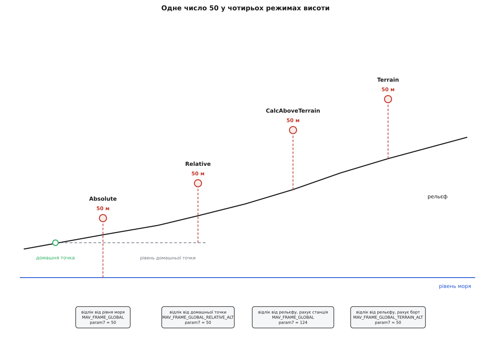
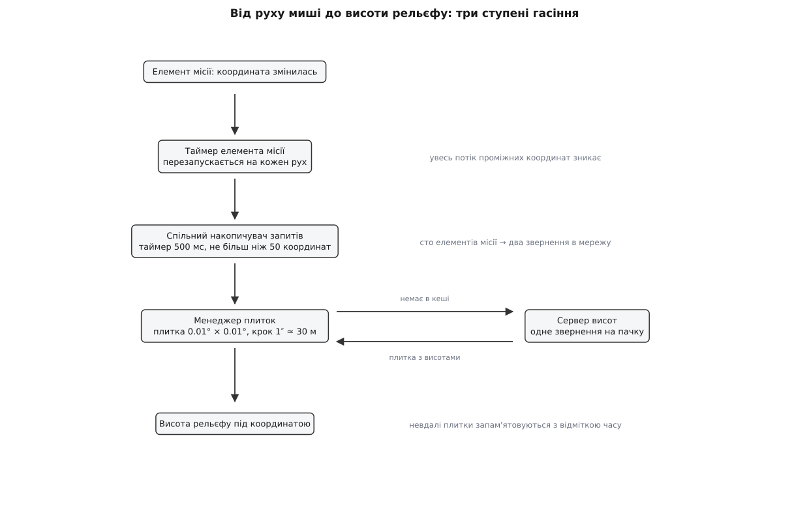
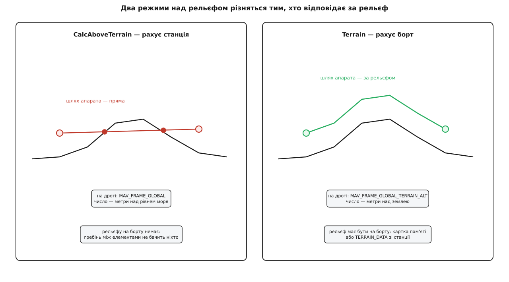
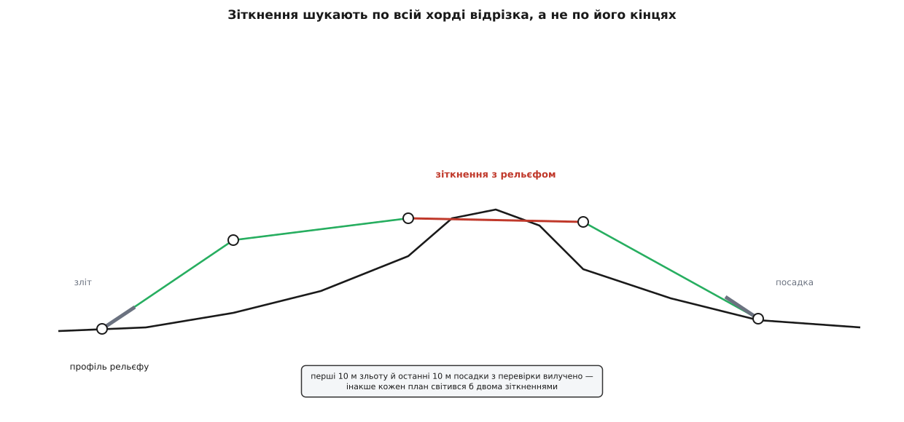

# Рельєф і режими висоти в плані

<preknowlist>
- [Модель плану: місія, геозона, точки збору](topic:sys-dron/plan-model) — з чого складається план у застосунку й що в ньому таке домашня точка.
- [Елементи місії MAVLink](topic:sys-dron/mavlink-mission-items) — будова елемента місії: команда, сім параметрів, поле системи відліку.
- [Системи координат і одиниці MAVLink](topic:com-protocol/coordinate-frames-units) — що означає поле `MAV_FRAME` і які значення воно приймає.
- [Геоїд, AMSL і висота над еліпсоїдом](topic:math-geometry/geoid-and-amsl) — від якої саме поверхні відлічують «метри над рівнем моря» й чим вона відрізняється від еліпсоїда.
- [Цифрова модель рельєфу і профіль висот](topic:sf-visual/terrain-elevation-model) — рельєф як правильна сітка висот, профіль уздовж маршруту, різниця між моделлю поверхні й моделлю твердої землі.
- [FactSystem: факт, метадані й зв'язок зі станом](topic:sys-dron/fact-system) — величина в застосунку живе як факт із метаданими, а не як голе число.
</preknowlist>

У полі висоти елемента місії стоїть `50`. Це число піде на борт, апарат за ним полетить — і поки під маршрутом рівне поле, питати більше нема про що. Але щойно маршрут виходить на схил, з'ясовується, що саме число `50` не описує жодного польоту, доки не сказано, **від чого** ці п'ятдесят метрів відлічені.

Розумних відповідей є три, і кожна з них — не примха інтерфейсу, а окрема інженерна задача.

**Від рівня моря.** Так говорить авіація і так підписані карти: «ешелон 1500» означає одне й те саме для всіх, хто в повітрі, незалежно від того, звідки хто злітав. Це єдина відповідь, яка дозволяє двом апаратам розійтися по висоті, і єдина, яку можна безпечно записати в план і віддати комусь іншому.

**Від точки зльоту.** Так думає пілот, який щойно поставив апарат на землю й хоче, щоб той піднявся на п'ятдесят метрів над ним. Ця відповідь не потребує ні карти, ні знання місцевости: апарат сам запам'ятовує свою висоту в момент зброєння й далі рахує від неї.

**Від землі просто під апаратом.** Так думає той, хто знімає місцевість камерою чи лідаром: масштаб знімка задає саме відстань до поверхні, і вона має лишатися сталою, хоч би як гуляв рельєф (фр. *relief* — опуклість). Ця відповідь найкорисніша й водночас найдорожча: вона вимагає знати висоту землі в кожній точці маршруту.

Три відповіді дають три різні польоти над тим самим схилом. Над рівнем моря апарат іде горизонтально й врізається в гребінь. Над точкою зльоту — теж горизонтально, просто на іншій абсолютній висоті, і теж врізається. Над землею — повторює профіль схилу. Тому вибір відліку не оформлення, а зміст завдання, і станція мусить тримати його **явно** — окремим полем поруч із числом.

## Що з цього уміє сказати протокол

Елемент місії MAVLink — це команда, сім числових параметрів і поле `frame`. Координати лежать у п'ятому й шостому параметрах, висота — у сьомому, а `frame` каже, у якій системі відліку прочитати ці три числа. З усього набору значень `MAV_FRAME` до польоту за глобальними координатами стосуються три:

```
MAV_FRAME_GLOBAL              = 0    param7 — метри над рівнем моря
MAV_FRAME_GLOBAL_RELATIVE_ALT = 3    param7 — метри над домашньою точкою
MAV_FRAME_GLOBAL_TERRAIN_ALT  = 10   param7 — метри над рельєфом
```

(Кожне має ще й варіант із суфіксом `_INT`, де широта й довгота передані цілими в десятимільйонних частках градуса замість чисел із рухомою комою; на зміст висоти це не впливає.)

Отже на борт летить не число, а **пара**: система відліку й значення. Три системи протоколу точно відповідають трьом розумним відповідям — здавалося б, застосунку лишається дати користувачеві вибір із трьох, і на цьому все.

## Чому в застосунку режимів чотири

Третій рядок цього списку коштує дорожче за два перших, і не станції, а апаратові.

`MAV_FRAME_GLOBAL_RELATIVE_ALT` апарат уміє прочитати завжди: домашню висоту він знає сам. А `MAV_FRAME_GLOBAL_TERRAIN_ALT` він прочитати не може, доки не має **власної** моделі рельєфу: щоб перевести «сорок метрів над землею» в команду двигунам, треба знати, де тут земля. Тому цю систему відліку підтримують не всі прошивки: ArduPilot тримає на борту базу рельєфу й в автоматичних режимах витримує задану відстань до нього, а PX4 такої бази не має й польоту за рельєфом у місії не підтримує.

Виникає розрив. Користувач хоче зняти схил зі сталої відстані до поверхні; станція має рельєф — вона його бачить на карті; а апарат цієї системи відліку не розуміє. Обійти розрив можна арифметикою на землі: якщо станція знає, що під елементом місії земля на висоті 312 метрів над рівнем моря, а користувач попросив 40 метрів над землею, то на борт можна відправити `MAV_FRAME_GLOBAL` із числом 352. Апарат виконає це як звичайну абсолютну висоту й ніколи не дізнається, що ці 352 метри народилися з відліку від землі.

Саме тому режимів висоти в застосунку **чотири**, а не три: до трьох систем відліку протоколу додано один, якого в протоколі немає:

```cpp
enum AltitudeFrame {
    AltitudeFrameMixed,              // у плані змішані режими
    AltitudeFrameRelative,           // MAV_FRAME_GLOBAL_RELATIVE_ALT
    AltitudeFrameAbsolute,           // MAV_FRAME_GLOBAL
    AltitudeFrameCalcAboveTerrain,   // абсолютна висота, порахована станцією з рельєфу
    AltitudeFrameTerrain,            // MAV_FRAME_GLOBAL_TERRAIN_ALT
    AltitudeFrameNone,               // число не про землю (напр. відстань до споруди)
};
```

Два значення з шести — не режими висоти, а мітки станів: `Mixed` каже, що в плані елементи з різними режимами й спільного режиму немає, `None` — що це число взагалі не висота (наприклад, відстань до стіни в скануванні споруди).

Робочих режимів, отже, чотири, і різняться вони двома незалежними ознаками: **від чого** відлічена висота і **хто** робить перерахунок.

| Режим | Система відліку на дроті | Що в `param7` | Хто рахує рельєф |
|---|---|---|---|
| `Relative` | `GLOBAL_RELATIVE_ALT` | над домашньою точкою | ніхто |
| `Absolute` | `GLOBAL` | над рівнем моря | ніхто |
| `CalcAboveTerrain` | `GLOBAL` | над рівнем моря | станція, один раз при плануванні |
| `Terrain` | `GLOBAL_TERRAIN_ALT` | над рельєфом | апарат, безперервно в польоті |



*Одне й те саме число 50 у чотирьох режимах дає чотири різні точки в просторі; праворуч — те, що насправді летить на борт.*

## Дві висоти в одному елементі

З таблиці видно неприємне: у двох режимах із чотирьох те, що ввів користувач, і те, що піде на борт, — різні числа. Значить, зберігати треба обидва.

Так і зроблено. Елемент місії тримає окремий факт `altitude` — це рівно те, що бачить і редагує користувач, у вибраному режимі. І тримає `param7` — сире поле протоколу. Коли режим не потребує перерахунку, вони збігаються. Коли потребує, зв'язок такий:

```cpp
void SimpleMissionItem::_terrainAltChanged(void)
{
    if (_altitudeFrame == AltitudeFrameCalcAboveTerrain || _altitudeFrame == AltitudeFrameTerrain) {
        if (qIsNaN(terrainAltitude())) {
            // NaN — ознака того, що рельєф ще не приїхав
            if (_altitudeFrame == AltitudeFrameCalcAboveTerrain) {
                _missionItem._param7Fact.setRawValue(qQNaN());
            }
            _amslAltAboveTerrainFact.setRawValue(qQNaN());
        } else {
            double newAboveTerrain = terrainAltitude() + _altitudeFact.rawValue().toDouble();
            ...
        }
    }
}
```

Тут видно три речі одразу.

Перша: `terrainAltitude()` — висота землі під координатою цього елемента, окрема величина, яку станція десь бере. Друга: сума `terrainAltitude() + altitude` лягає в `param7` тільки в режимі `CalcAboveTerrain` — бо тільки там на борт іде абсолютне число. У режимі `Terrain` `param7` лишається тим, що ввів користувач, а сума кладеться в допоміжний факт `amslAltAboveTerrain` — вона потрібна лише для того, щоб намалювати елемент на правильній висоті на екрані.

Третя, і найважливіша: поки рельєф не відомий, у `param7` записано `NaN`. Це не помилка й не нуль — це [значення-ознака](topic:sf-lang/sentinel-values), яке означає «відповіді ще немає». Вибір саме `NaN` тут не декоративний: будь-яка арифметика з ним дає `NaN`, тому недостовірне число не може мовчки просочитися в суму, у довжину маршруту чи в оцінку часу польоту — воно всюди лишається помітним.

І з нього ж росте захист від вивантаження недоробленого плану. Готовність елемента до збереження перевіряється однією умовою:

```cpp
bool terrainReady = !specifiesAltitude() || !qIsNaN(_missionItem._param7Fact.rawValue().toDouble());
return terrainReady ? ReadyForSave : NotReadyForSaveTerrain;
```

> 🔧 **Навіщо це.** Коли план у режимі над рельєфом не вивантажується, а кнопка вивантаження неактивна — шукати треба не в місії й не в каналі зв'язку. Це `NaN` у сьомому параметрі бодай одного елемента, тобто станція не отримала висоту землі під ним: немає мережі, немає даних на цей квадрат, або запит іще в дорозі.

## Звідки станція бере рельєф

`terrainAltitude()` не береться нізвідки — за ним стоїть окрема підсистема, і її будова диктується двома обставинами, які тягнуть у різні боки.

Обставина перша: рельєф лежить на сервері в мережі, і запит до нього коштує сотні мілісекунд. Обставина друга: користувач тягне елемент місії мишею, і координата змінюється десятки разів на секунду. Прямий запит на кожну зміну дав би зливу звернень, з якої корисним був би лише останній.

Тому шлях від координати до висоти складається з трьох ступенів гасіння.

**Ступінь перший — затримка на самому елементі.** Кожен елемент місії, що чекає рельєфу, тримає власний таймер і перезапускає його на кожну зміну координати; запит іде лише тоді, коли рух припинився. Це звичайне [гасіння частих подій](topic:sf-apps/debouncing-throttling), і воно вирізає весь потік проміжних координат від перетягування.

**Ступінь другий — злиття запитів у пачки.** Запити від усіх елементів плану сходяться в один спільний накопичувач. Той тримає таймер на 500 мілісекунд і, коли той спрацьовує, склеює всі накопичені координати в одне звернення — щонайбільше 50 координат за раз:

```cpp
while (!_requestQueue.isEmpty()) {
    const QueuedRequestInfo_t requestInfo = _requestQueue.dequeue();
    const SentRequestInfo_t sentRequestInfo = { requestInfo.terrainAtCoordinateQuery,
                                                requestInfo.coordinates.count() };
    _sentRequests.append(sentRequestInfo);
    coords += requestInfo.coordinates;
    if (coords.count() > 50) {
        break;
    }
}
```

Разом із координатами накопичувач запам'ятовує, **скільки** координат прислав кожен замовник. Відповідь приходить одним пласким списком висот — і розрізається назад по тих самих довжинах, кожному своя частина. Це класичне [злиття запитів](topic:sf-distributed/request-coalescing): план на сотню елементів дає два звернення до мережі замість сотні. Поки попередня пачка ще не повернулася, таймер просто перезапускається, тож відкритим одночасно лишається не більш ніж одне звернення.

**Ступінь третій — кеш плиток.** Висоти приходять не по одній точці, а плитками (англ. *tile* — плитка): квадрат 0.01° × 0.01°, усередині якого висоти лежать сіткою з кроком в одну кутову секунду, тобто приблизно через 30 метрів. Плитка, що вже приїхала, лишається в пам'яті, і будь-яка наступна координата в її межах відповідається без мережі взагалі — саме тому дрібне посування елемента місії відпрацьовує миттєво. Плитки, яких сервер не дав, теж запам'ятовуються — з відміткою часу, щоб не довбати сервер тим самим невдалим запитом у циклі.



*Три ступені гасіння між рухом миші й запитом у мережу; повернення відповіді розрізає спільний список висот назад по замовниках.*

Джерело даних за замовчуванням — сервер із моделлю Copernicus DEM, побудованою на радарних знімках місії TanDEM-X 2011–2015 років; висоти в ній віднесені до геоїда EGM2008, тобто це справді метри над рівнем моря, а не над еліпсоїдом. Провайдер даних задається в налаштуваннях і замінюється на свій.

Дві властивості цього джерела варто тримати в голові, бо вони проступають саме в польоті над рельєфом. По-перше, Copernicus DEM — модель **поверхні**, а не твердої землі: у ній є будинки й полог лісу. «Двадцять метрів над рельєфом» над лісом означає двадцять метрів над кронами, якими вони були на момент зйомки. По-друге, крок сітки в 30 метрів згладжує все дрібніше за себе: щогла, вежа чи вузька ущелина в такій моделі просто відсутні.

Програмний інтерфейс, яким усе це дістається з коду застосунку — запит висот у точках, профілю вздовж відрізка й килима висот над прямокутником, — розібраний окремо: [як запитати рельєф із коду](topic:sys-dron/terrain-and-altitude/api-terrain-query.md). Там же — синхронний варіант, що відповідає лише з кешу й не ходить у мережу.

## Дві різні відповіді на «лети над рельєфом»

Тепер видно, чому режимів над рельєфом два, і чим саме вони відрізняються. Різниця не в тому, що показує екран — на екрані вони виглядають однаково. Різниця в тому, **хто відповідає за рельєф**, і кожна відповідь ламається по-своєму.

**`CalcAboveTerrain` — відповідає станція, один раз.** У момент планування станція питає висоту землі під кожним елементом місії, додає задану відстань до поверхні й відправляє суму як абсолютну висоту. На борт іде звичайний `MAV_FRAME_GLOBAL`; апарат не знає, що ця висота якось пов'язана з землею.

Звідси два наслідки. Перший: рельєф **заморожено** на момент планування. Другий, важливіший: апарат між елементами місії летить **по прямій**. Якщо два елементи стоять по різні боки гребеня, станція порахувала висоту в обох правильно — а апарат сумлінно пройде від одного до другого по хорді, тобто крізь гребінь. Захисту на борту немає, бо на борту немає рельєфу.

**`Terrain` — відповідає апарат, безперервно.** На борт іде `MAV_FRAME_GLOBAL_TERRAIN_ALT` із числом, яке ввів користувач. Апарат сам, у кожен момент польоту, додає до нього висоту землі під собою й тримає результат. Прямої між елементами місії тут немає: апарат повторює профіль.

Ціна — рельєф на борту. Апарат бере його з двох джерел: із власної картки пам'яті, якщо туди заздалегідь записано плитки, або **зі станції по радіо**. Друге джерело й робить наземну станцію не тільки планувальником, а й сервером рельєфу для апарата.

Обмін іде трьома повідомленнями [протоколу рельєфу MAVLink](topic:sys-dron/mavlink-terrain-protocol). Апарат шле `TERRAIN_REQUEST` із південно-західним кутом потрібної області, кроком сітки й 64-бітовою маскою, у якій кожен біт означає один блок 4×4 точки з сітки 8×7 блоків. Станція обробляє запит просто: іде маскою, знаходить перший установлений біт, рахує координати шістнадцяти точок його блоку, бере на них висоти й шле `TERRAIN_DATA`. Далі — таймер:

```cpp
_terrainDataSendTimer->setInterval(1000.0/12.0);
```

Дванадцять блоків на секунду — навмисно повільно: канал до апарата в польоті ділять телеметрія й команди, і залити його рельєфом означає втратити керування. Апарат у відповідь шле `TERRAIN_REPORT` із двома лічильниками — скільки блоків уже завантажено й скільки ще чекає, — і станція показує їх як факти, тож видно, коли рельєф на борту доїхав.

Тут же — власна пастка. Апарат, у якого ще немає позиції від супутників, здатний прислати `TERRAIN_REQUEST` із нульовими координатами; послухатися такого запиту означає тягнути з сервера плитки перетину нульового меридіана й екватора в Гвінейській затоці. Станція такий запит відкидає явно.



*Ліворуч рельєф порахований на землі й заморожений, тому гребінь між двома елементами місії лишається непоміченим; праворуч рельєф є на борту, і профіль повторюється безперервно.*

## Відрізок між елементами місії як окремий об'єкт

Хорда через гребінь — не гіпотетична проблема, і станція вміє її показати. Для цього кожна пара сусідніх елементів місії обертається в окремий об'єкт — відрізок польотного шляху. Він знає дві координати, дві абсолютні висоти на кінцях і сам замовляє профіль рельєфу вздовж себе.

Отримавши профіль, відрізок порівнює його з прямою між своїми кінцями й виставляє ознаку зіткнення. Порівняння не наївне: у нього вбудовані винятки за типом відрізка.

```cpp
enum SegmentType {
    SegmentTypeTakeoff,       // ігнорує початок відрізка
    SegmentTypeGeneric,       // враховує весь відрізок
    SegmentTypeLand,          // ігнорує кінець відрізка
    SegmentTypeTerrainFrame,  // шлях між точками йде за рельєфом
};
```

Причина винятків очевидна, щойно її назвати: зліт починається на землі, посадка на землі закінчується, і без винятку кожен план світився б двома зіткненнями з рельєфом. Тому перші й останні десять метрів відповідного відрізка з перевірки випадають. Окремий тип для режиму `Terrain` потрібен з іншої причини: там прямої між елементами місії немає, і перевіряти хорду безглуздо.

Ці ж відрізки живлять профіль висот — смугу під планом, де на одній картинці видно рельєф уздовж усього маршруту й лінію польоту над ним. Відрізок, у якому виявлено зіткнення, підсвічується, і причина видна одразу: не «десь у місії помилка», а ось цей проміжок ось між цими двома елементами.



*Обидва елементи місії по краях червоного відрізка стоять на потрібній відстані від землі, а відрізок між ними — ні: перевірка йде по всій хорді, а не по її кінцях.*

## Зйомка над схилом: коли елементів місії мало

Профіль показує проблему, але не розв'язує її. Розв'язок очевидний і незручний: між двома елементами місії треба поставити ще елементи — стільки, щоб ламана достатньо близько повторила рельєф. Робити це руками на площинній зйомці, де галсів десятки, неможливо.

Тому складні елементи плану — зйомка полігона, коридору, споруди — будують такий шлях самі, і роблять це у три проходи, кожен зі своєю метою.

**Прохід перший — насичення.** Уздовж кожного галса береться профіль рельєфу, і в кожній його точці ставиться проміжна точка шляху з висотою «рельєф плюс задана відстань до поверхні». Роздільність шляху стає рівною роздільності даних, тобто близько 30 метрів.

**Прохід другий — обмеження вертикальних швидкостей.** Насичений шлях може вимагати від апарата вертикальної швидкости, якої в нього немає: обрив під галсом дасть перепад у сотню метрів на тридцяти метрах шляху. Прохід перебирає пари сусідніх точок, ділить перепад висоти на час прольоту відрізка й, де швидкість набору чи зниження перевищила задану, зсуває висоту сусідньої точки. Зсув однієї пари може порушити сусідню, тому прохід повторюється, доки лишаються порушення.

**Прохід третій — прорідження.** Після двох перших проходів точок усе одно надто багато: на рівній ділянці двадцять точок підряд мають майже однакову висоту й нічого не додають. Прохід іде шляхом і викидає проміжну точку, якщо її висота відрізняється від висоти останньої залишеної менше ніж на заданий допуск. Точки, поставлені не заради рельєфу, а самою геометрією зйомки — кінці галсів, розвороти, — не викидаються ніколи.

Три числа, якими це керується, доступні користувачеві прямо в елементі зйомки: допуск, максимальна швидкість набору, максимальна швидкість зниження. Повний розбір проходів із кодом і крайніми випадками — окремо: [як будується шлях за рельєфом](topic:sys-dron/terrain-and-altitude/proj-terrain-follow-path.md).

Варто помітити, що всі три проходи потрібні лише в режимі `CalcAboveTerrain`. У режимі `Terrain` шлях лишається рідким: борт сам тримає відстань до землі, і насичувати ламану проміжними точками нема потреби.

## Домашня точка: відлік, який визначено двічі

Відносний режим на вигляд найпростіший: ні рельєфу, ні арифметики. Саме в ньому й ховається неоднозначність, якої в решті немає.

У плані домашня точка — це елемент нульового номера, і її висота станції потрібна: без неї неможливо намалювати відносні елементи місії на карті й у профілі на правильній абсолютній висоті. Береться ця висота звідти ж, звідки решта: запитом рельєфу під координатою домашньої точки.

```cpp
void MissionSettingsItem::_setHomeAltFromTerrain(double terrainAltitude)
{
    if (!qIsNaN(terrainAltitude)) {
        _plannedHomePositionAltitudeFact.setRawValue(terrainAltitude);
    }
}
```

А в польоті апарат бере домашню висоту не з плану. Він бере власну оцінку висоти в момент зброєння — з супутникового приймача й барометра, зведених фільтром. Це число не зобов'язане збігатися з моделлю рельєфу: модель має похибку в кілька метрів, апарат може стояти на даху чи на естакаді, а барометр повзе з погодою.

Отже у відносному режимі план і політ рахують від **двох різних** відліків: план — від моделі рельєфу, політ — від того, що апарат виміряв на старті. Числа на екрані від цього не змінюються — п'ятдесят метрів лишаються п'ятдесятьма, — але абсолютна висота польоту й абсолютна висота, яку станція намалювала в профілі, розходяться рівно на різницю цих відліків. Там, де запас над рельєфом малий, цю різницю треба закладати.

## Що переживає збереження, а що ні

Режим висоти — властивість застосунку, а не протоколу: на дроті його немає, є тільки `MAV_FRAME`. Тому доля режиму залежить від того, куди план поїхав.

**У файл плану** режим записується явно, окремим ключем поруч із висотою, разом із порахованою абсолютною висотою над рельєфом. Файл, відкритий назад, відновлює план один в один — включно з тим, який режим був вибраний. Записується й спільний режим усього плану, якщо він був спільний.

**На борт** режим не їде — їде тільки система відліку. І коли план читають назад із апарата, відновлювати режим доводиться з неї:

```cpp
const struct MavFrame2AltFrame_s rgMavFrame2AltFrame[] = {
    { MAV_FRAME_GLOBAL_TERRAIN_ALT,     AltitudeFrameTerrain    },
    { MAV_FRAME_GLOBAL,                 AltitudeFrameAbsolute   },
    { MAV_FRAME_GLOBAL_RELATIVE_ALT,    AltitudeFrameRelative   },
};
```

У таблиці три рядки на чотири режими, і бракує саме `CalcAboveTerrain`. Інакше й бути не може: він іде на борт як `MAV_FRAME_GLOBAL`, тобто нерозрізненно від справжньої абсолютної висоти. План, знятий із апарата, повернеться абсолютним — з правильними числами й утраченим наміром. Ті самі 352 метри, які означали «сорок над землею», стануть просто 352 метрами, і всяке подальше редагування — зсув галса вбік, зміна висоти зйомки — рельєфу вже не перерахує.

Звідси й обережність застосунку з планом, що прийшов з апарата: спільний режим усього плану виставляється в `Mixed`, тобто «спільного немає», і новий елемент місії успадковує режим не з глобального налаштування, а від сусіда зверху. Станція не вдає, ніби знає намір, якого їй не передали.

Кожен із чотирьох режимів — це, по суті, відповідь на одне питання: хто володіє знанням про землю. У відносному й абсолютному ним не володіє ніхто, і безпека маршруту цілком лежить на тому, хто його склав. У `CalcAboveTerrain` знанням володіє станція, але одноразово — і разом зі знанням до неї переїжджає відповідальність за все, що зміниться після планування. У `Terrain` знання переїжджає на борт, а разом із ним туди переїжджає й обов'язок цей рельєф на борт доставити. Місце, де план може розвалитися, у кожному з режимів різне — і саме тому вибір режиму робиться свідомо, а не лишається на значенні за замовчуванням.
