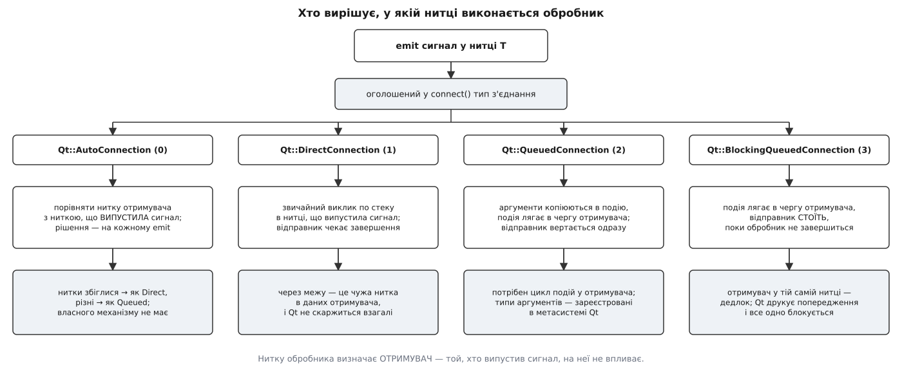

# 📋 Контракт переходу між нитками: типи з'єднань, прив'язка об'єктів, безпечні виклики

Довідка на один погляд: який тип з'єднання виконає обробник у чиїй нитці й чи чекатиме відправник, від чого залежить, у якій нитці живе об'єкт, які методи застосунку законно кликати з чужої нитки — і що насправді означає кожне попередження Qt про неправильну нитку. Сигнатури й рядкові літерали звірені з деревом `mavlink/qgroundcontrol`, гілка `master`, станом на 2 серпня 2026 року, і з джерелами Qt 6.11 — узяті з самих заголовків та реалізацій, не з переказів.

## Де що лежить

| Що | Файл |
| --- | --- |
| Інтерфейс каналу, `writeBytesThreadSafe` | `src/Comms/LinkInterface.h` · `.cc` |
| Серійний канал і його робітник | `src/Comms/SerialLink.h` · `.cc` |
| Облік каналів і м'ютекс списку | `src/Comms/LinkManager.h` · `.cc` |
| Розбір MAVLink | `src/Comms/MAVLinkProtocol.h` · `.cc` |
| Апарат і його `…ThreadSafe`-методи | `src/Vehicle/Vehicle.h` · `.cc` |
| Опитування джойстика у власній нитці | `src/Joystick/Joystick.h` · `.cc` |
| Механізм з'єднань і прив'язки (Qt) | `qtbase/src/corelib/kernel/qobject.cpp` |
| Виклик методу за іменем (Qt) | `qtbase/src/corelib/kernel/qmetaobject.cpp` |
| Заборона крос-ниткових прив'язок QML | `qtdeclarative/src/qml/qml/qqmlnotifier.cpp` |

## Типи з'єднань сигнал-обробник

Тип задають п'ятим аргументом `connect()` або третім аргументом `QMetaObject::invokeMethod()`. Він визначає рівно дві речі: у чиїй нитці виконається обробник і чи стоятиме відправник, поки той працює.

| Константа | Число | Обробник виконується | Відправник чекає | Коли вирішується |
| --- | --- | --- | --- | --- |
| `Qt::AutoConnection` | 0 | як `Direct` або як `Queued` — залежно від ниток | залежно від того, чим обернулося | **на кожному `emit`** |
| `Qt::DirectConnection` | 1 | у нитці, що випустила сигнал | так — це звичайний виклик по стеку | під час `connect()` |
| `Qt::QueuedConnection` | 2 | у нитці отримувача, коли черга дійде | ні — повертається одразу | під час `connect()` |
| `Qt::BlockingQueuedConnection` | 3 | у нитці отримувача | **так** — стоїть до кінця обробника | під час `connect()` |
| `Qt::UniqueConnection` | 0x80 | прапорець до будь-якого з типів вище: повторний `connect()` не створює дубля | — | — |
| `Qt::SingleShotConnection` | 0x100 | прапорець: після першого спрацювання з'єднання саме розривається | — | — |



*Оголошений тип — не поведінка, а вказівка, як її вивести; для `Auto` вивід робиться заново при кожному випуску сигналу.*

Три деталі цієї таблиці варті окремого рядка, бо саме на них будується решта контракту.

**`Auto` порівнює нитку отримувача з ниткою, що випустила сигнал, а не з ниткою відправника.** У `qobject.cpp` це буквально одне порівняння ідентифікаторів:

```cpp
receiverInSameThread = currentThreadId == td->threadId.loadRelaxed();
if ((c->connectionType == Qt::AutoConnection && !receiverInSameThread)
    || (c->connectionType == Qt::QueuedConnection)) {
    queued_activate(sender, signal_index, c, argv);
```

`currentThreadId` — нитка, у якій зараз виконується `emit`. Тому один і той самий об'єкт, сигнал якого випускають то з головної нитки, то з робочої, отримає то прямий виклик, то чергу — без жодної зміни в коді `connect()`.

**`Direct` через межу ниток Qt не ловить узагалі.** Якщо отримувач живе в іншій нитці, а з'єднання оголошене прямим, обробник просто виконається в чужій нитці й правитиме чужі дані. Ані попередження, ані запису в журнал не буде: це не помилка механізму, а домовленість, якою користуються свідомо там, де об'єкт справді потокобезпечний зсередини (роботу такого коду вже мусить захищати м'ютекс — див. [потокову безпеку](root:sf-tasks/thread-safety): «потокобезпечний» означає, що метод коректно працює, коли його одночасно кличуть кілька ниток).

**`BlockingQueued` в межах однієї нитки — гарантований дедлок**, і Qt це помічає:

```
Qt: Dead lock detected while activating a BlockingQueuedConnection: Sender is X(0x…), receiver is Y(0x…)
```

Попередження надрукується, але заблокується застосунок однаково: подія лягла у власну чергу нитки, яка щойно стала на очікування й тому цю чергу вже не розбирає ([дедлок](root:sf-tasks/deadlock) — це цикл очікування, і тут він найкоротший із можливих, довжиною в одну ланку).

## Що саме перетинає межу

Чергове з'єднання не передає посилання — воно **копіює аргументи в об'єкт-подію** і кладе цю подію в чергу нитки отримувача.

| Аргумент | Що потрапить до обробника |
| --- | --- |
| Значення (`int`, `QByteArray`, `QString`, структура) | повноцінна копія; оригінал далі можна змінювати |
| Посилання (`const QByteArray &`) | теж копія — посилання не переживає черги |
| Покажчик (`LinkInterface *`) | копіюється **сам покажчик**; об'єкт лишається спільним |
| Тип, не зареєстрований у метасистемі | нічого: `connect()` поверне порожнє з'єднання |

Рядок про покажчик — головна пастка контракту. Механізм переходу не робить нічого, щоб уберегти об'єкт за покажчиком: він може бути знищений, поки подія лежить у черзі, і обробник дістане висяче посилання. Саме тому через межу в QGroundControl передають байти, а не `Vehicle *` чи `Fact *`.

Копіювання `QByteArray` при цьому дешеве, бо контейнери Qt неявно спільні: копія збільшує атомарний лічильник посилань, а справжнє копіювання пам'яті стається лише тоді, коли одна зі сторін почне писати ([копіювання при записі](root:sf-algorithms/copy-on-write-structures): дані спільні, доки їх тільки читають). Лічильник атомарний — тому копіювати контейнер між нитками безпечно; **правити один і той самий примірник із двох ниток — ні**.

Незареєстрований тип видно одразу — під час `connect()`, а не під час першого сигналу:

```
QObject::connect: Cannot queue arguments of type 'mavlink_message_t'
(Make sure 'mavlink_message_t' is registered using qRegisterMetaType().)
```

Сигнал `MAVLinkProtocol::messageReceived(LinkInterface*, const mavlink_message_t&)` живе цілком у головній нитці й тому працює без реєстрації. Спроба приєднати до нього обробник із робочої нитки перетворить з'єднання на чергове — і воно мовчки не встановиться, доки тип не зареєстровано.

## Прив'язка об'єкта до нитки

Обробник виконується там, де живе **отримувач**. Прив'язку самого об'єкта до нитки задають лише ці правила, і жодного прихованого механізму понад них немає.

| Правило | Наслідок |
| --- | --- |
| Новостворений `QObject` належить нитці, у якій виконався конструктор | прив'язку визначає місце `new`, а не місце оголошення поля |
| Об'єкт із батьком мусить бути в нитці батька | `setParent()` через межу відмовляє з попередженням |
| `moveToThread(target)` переносить об'єкт **разом з усіма дітьми** | переселяти треба корінь піддерева, не кожен вузол |
| Об'єкт без нитки (`moveToThread(nullptr)`) не обробляє подій узагалі | його черга не розбирається ніколи |

`moveToThread()` відмовляє в чотирьох випадках, і кожен друкує свій рядок:

| Умова | Рядок Qt |
| --- | --- |
| об'єкт має батька | `QObject::moveToThread: Cannot move objects with a parent` |
| викликано не з нитки самого об'єкта | `QObject::moveToThread: Current thread (0x…) is not the object's thread (0x…). Cannot move to target thread (0x…)` |
| це віджет | `QObject::moveToThread: Widgets cannot be moved to a new thread` |
| об'єкт бере участь у прив'язках властивостей Qt | `QObject::moveToThread: Can not move objects that contain bindings or are used in bindings to a new thread.` |

Друге правило пояснює канонічний порядок дій: об'єкт-робітник створюють у головній нитці й **звідти ж** переселяють, бо з чужої нитки переселити його вже не можна. Останнє правило — новіше й найменш очікуване: якщо об'єкт хоч раз потрапив у прив'язку властивості, переселення після цього не відбудеться.

### Чому ресурс відкривають усередині робочої нитки

Переселення об'єкта-робітника саме собою не переносить дескриптори. Порт, сокет чи файловий спостерігач реєструють свій дескриптор у диспетчері подій **тієї нитки, у якій їх відкрили**, — і сигнал про готові дані спрацює саме там. Тому в QGroundControl порт створює не конструктор каналу, а обробник запуску нитки:

```cpp
_worker->moveToThread(_workerThread);
connect(_workerThread, &QThread::started, _worker, &SerialWorker::setupPort);
_workerThread->start();
```

`setupPort()` виконується вже у робочій нитці — отже, `QSerialPort` створюється там, там реєструється й там же випускає `readyRead`. Відкрий порт у конструкторі `SerialLink` — і його сигнали приходитимуть у головну нитку, тобто читання знову блокуватиме інтерфейс, хоча робоча нитка формально є.

Формулювання документації Qt тут варте уваги: `QSerialPort` описаний як **реентерабельний**, а не потокобезпечний ([реентерабельність](root:sf-tasks/reentrancy) — властивість коду, який можна перервати посеред виконання й покликати знову, не зіпсувавши перший виклик; для класу вона означає рівно те, що різні його примірники можна вживати в різних нитках). Про один примірник, який чіпають дві нитки, реентерабельність не обіцяє нічого. Та сама дисципліна стосується `QAbstractSocket`, `QFile` і майже всього вводу-виводу Qt.

### Пастка успадкування від QThread

`Joystick` у QGroundControl оголошений як `class Joystick : public QThread` і перевизначає `run()`. Звідси наслідок, який ламає інтуїцію:

| Що | Де живе |
| --- | --- |
| код у `Joystick::run()` — цикл опитування пристрою | у **новій** нитці |
| сам об'єкт `Joystick` — його слоти, його таймери, його поля | у нитці, де об'єкт **створили** (головній) |

Тобто чергове з'єднання зі слотом `Joystick` виконається в головній нитці, а не в нитці опитування. Цикл `run()` при цьому взагалі не запускає `exec()` — він крутиться на `_update()` і `QThread::msleep()`, тож у цієї нитки **немає циклу подій**, і будь-яка подія, адресована об'єктові, що живе в ній, не буде оброблена ніколи ([цикл подій](root:sf-tasks/event-loop) — це та петля, яка виймає події з черги; без неї черга просто росте).

Саме тому цикл опитування не сигналить у бік апарата, а кличе методи прямо:

```cpp
vehicle->sendJoystickDataThreadSafe(roll, pitch, yaw, throttle,
                                    lowButtons, highButtons,
                                    pitchExtension, rollExtension,
                                    auxManualControl1, auxManualControl2,
                                    auxManualControl3, auxManualControl4,
                                    auxManualControl5, auxManualControl6);
```

## Методи, безпечні для виклику з чужої нитки

Суфікс `ThreadSafe` в назвах QGroundControl означає не «всередині є замок», а «метод сам перекладе роботу в потрібну нитку».

```cpp
// src/Comms/LinkInterface.h
void writeBytesThreadSafe(const char *bytes, int length);
void sendMessageThreadSafe(mavlink_message_t &message);

// src/Vehicle/Vehicle.h
bool sendMessageOnLinkThreadSafe(LinkInterface *link, mavlink_message_t message);
void sendJoystickDataThreadSafe(float roll, float pitch, float yaw, float thrust,
                                quint16 buttons, quint16 buttons2,
                                float pitchExtension, float rollExtension,
                                float aux1, float aux2, float aux3,
                                float aux4, float aux5, float aux6);
void sendJoystickAuxRcOverrideThreadSafe(
        const std::array<uint16_t, kAuxRcOverrideChannelCount> &channelValues,
        const std::array<bool, kAuxRcOverrideChannelCount> &channelEnabled,
        bool useRcOverride);
```

| Виклик | Що робить під капотом | Повертає | Обмеження |
| --- | --- | --- | --- |
| `LinkInterface::writeBytesThreadSafe` | `invokeMethod(this, "_writeBytes", Qt::AutoConnection, data)` | нічого | сам об'єкт каналу має бути живим |
| `LinkInterface::sendMessageThreadSafe` | підписує повідомлення, серіалізує в буфер, кличе попередній | нічого | міняє `message` на місці, підписуючи його |
| `Vehicle::sendMessageOnLinkThreadSafe` | звіряє `link->isConnected()` і лише тоді шле | `false`, якщо канал уже не під'єднано | перевірку результату не можна пропускати |
| `Vehicle::sendJoystickDataThreadSafe` | пакує стан осей і кнопок і шле апаратові | нічого | розрахований саме на нитку джойстика |
| `QMetaObject::invokeMethod(worker, "slot", Qt::QueuedConnection, …)` | кладе подію в чергу робітника | `bool` — чи метод знайдено | ім'я методу перевіряється **під час виконання** |
| `QCoreApplication::postEvent(obj, event)` | кладе подію в чергу об'єкта | нічого | подія має бути створена в купі й не видаляється вручну |
| `emit` будь-якого сигналу | розсилає за правилами таблиці типів | нічого | випускати сигнал можна з будь-якої нитки |

Реалізація тут коротка настільки, що варта повного цитування:

```cpp
void LinkInterface::writeBytesThreadSafe(const char *bytes, int length)
{
    const QByteArray data(bytes, length);
    (void) QMetaObject::invokeMethod(this, "_writeBytes", Qt::AutoConnection, data);
}

void LinkInterface::sendMessageThreadSafe(mavlink_message_t &message)
{
    if (_signingController) {
        (void) _signingController->signOutgoing(message);
    }

    uint8_t buffer[MAVLINK_MAX_PACKET_LEN];
    const int len = mavlink_msg_to_send_buffer(buffer, &message);
    writeBytesThreadSafe(reinterpret_cast<const char *>(buffer), len);
}
```

`Qt::AutoConnection` тут не випадкова: виклик із головної нитки виконається **негайно й без черги** (адже `LinkInterface` живе в головній), а виклик із чужої — стане подією. Одна назва методу, дві різні ціни залежно від того, хто кличе.

Далі `_writeBytes` уже в головній нитці перекладає роботу на робітника — і це другий, справжній перехід:

```cpp
(void) QMetaObject::invokeMethod(_worker, "writeData", Qt::QueuedConnection,
                                 Q_ARG(QByteArray, data));
```

> 🔧 **Навіщо це.** Рядкова форма `invokeMethod` шукає метод у метаоб'єкті за іменем, тож помилка в назві чи в типі аргументу не буде помічена компілятором. Вона проявиться попередженням `QMetaObject::invokeMethod: No such method Class::name(args)` під час виконання — і, що гірше, лише тоді, коли гілка коду справді відпрацює. Звідси практичне правило: метод-приймач має бути оголошений у `public slots:` або як `Q_INVOKABLE`, а перевіряти повернене `bool` варто хоча б у налагоджувальній збірці. Форма з покажчиком на метод — `invokeMethod(_worker, &SerialWorker::writeData, Qt::QueuedConnection, data)` — цієї проблеми не має взагалі: ім'я й типи звіряє компілятор. Вона з'явилася в Qt 6.7; рядкова форма зі звичайними аргументами замість `Q_ARG` — у Qt 6.5, і саме її вживає `writeBytesThreadSafe`.

## Чого не можна робити поза головною ниткою

| Дія | Що станеться |
| --- | --- |
| Створити чи знищити `Vehicle`, `LinkInterface`, `FactGroup` | об'єкт отримає прив'язку до чужої нитки; далі — падіння при першій же події |
| Прочитати або записати [факт](root:sys-dron/fact-system) | `setRawValue()` випустить `valueChanged`, і прив'язки QML перерахуються в чужій нитці |
| Торкнутися будь-чого з дерева QML або самого `QQmlEngine` | `qFatal` — застосунок завершується примусово, без шансу на продовження |
| Запустити чи спинити `QTimer` чужого об'єкта | `QObject::startTimer: Timers cannot be started from another thread` — таймер не піде |
| Створити `QObject` із батьком, що живе в іншій нитці | батьківство не встановиться, об'єкт лишиться сиротою й потече |
| Викликати `delete` на об'єкті чужої нитки | руйнування торкнеться чужих структур; правильний спосіб — `deleteLater()` |
| Відкрити чи закрити канал через [менеджер каналів](root:sys-dron/link-manager) | облік каналів і видача каналів MAVLink розраховані на одну нитку |
| Покликати `MAVLinkProtocol::receiveBytes` | глобальний стан автомата розбору не переживе двох ниток на один канал |
| Показати діалог через `QGCApplication::showAppMessage` | під ним `invokeMethod` із поверненням значення — у черзі воно неможливе |

Останній рядок має власне попередження, і воно збиває з пантелику, бо не згадує ниток узагалі:

```
QMetaObject::invokeMethod: Unable to invoke methods with return values in queued connections
```

Причина проста: чергове з'єднання асинхронне, отже повертати нема звідки й нема коли. Тому будь-який виклик, що чекає відповіді від головної нитки, з чужої нитки не працює — треба або `Qt::BlockingQueuedConnection` (з усіма ризиками дедлоку), або сигнал у зворотний бік.

Окремо про `LinkManager`: у ньому справді є `QMutex _linksMutex`, який захищає список каналів. Це не дозвіл смикати менеджер звідусіль, а вужча гарантія — сам список можна безпечно перебрати з іншої нитки, доки об'єкти в ньому чіпає лише головна.

## Попередження Qt і що кожне означає

| Рядок у журналі | Що сталося насправді | Що робити |
| --- | --- | --- |
| `QObject: Cannot create children for a parent that is in a different thread. (Parent is X(0x…), parent's thread is …, current thread is …)` | об'єкт створено в одній нитці, а батька йому дали з іншої | створювати об'єкт у тій нитці, де живе батько, або не давати батька зовсім |
| `QObject::moveToThread: Cannot move objects with a parent` | переселяють вузол усередині дерева | переселяти корінь піддерева; діти поїдуть самі |
| `QObject::moveToThread: Current thread (0x…) is not the object's thread (0x…). Cannot move to target thread (0x…)` | переселення затіяли з нитки, якій об'єкт не належить | `moveToThread()` кличуть із нитки-власника, зазвичай одразу після `new` |
| `QObject::moveToThread: Can not move objects that contain bindings or are used in bindings to a new thread.` | об'єкт уже задіяний у прив'язках властивостей Qt | переселяти до того, як прив'язки з'явилися |
| `QObject::setParent: Cannot set parent, new parent is in a different thread` | те саме, що й перший рядок, але через явний `setParent()` | привести нитки до згоди перед батьківством |
| `QObject::startTimer: Timers cannot be started from another thread` | таймер запускають для об'єкта, що живе деінде | запускати з нитки об'єкта — через `invokeMethod` або сигнал |
| `QObject::killTimer: Timers cannot be stopped from another thread` | дзеркальний випадок, часто у чужому деструкторі | знищувати об'єкт через `deleteLater()` у його нитці |
| `QObject::startTimer: current thread's event dispatcher has already been destroyed` | нитка вже згортається, а код усе ще ставить таймер | не ставити таймерів після `quit()` |
| `QObject::connect: Cannot queue arguments of type 'X' (Make sure 'X' is registered using qRegisterMetaType().)` | з'єднання чергове, а тип аргументу метасистемі невідомий | `qRegisterMetaType<X>()` до першого `connect()` |
| `QMetaObject::invokeMethod: No such method Class::name(args)` | помилка в імені методу або в типах аргументів | оголосити метод слотом чи `Q_INVOKABLE`; краще — форма з покажчиком на метод |
| `QMetaObject::invokeMethod: Unable to invoke methods with return values in queued connections` | від чергового виклику чекають результату | розвернути відповідь у зворотний сигнал |
| `Qt: Dead lock detected while activating a BlockingQueuedConnection: Sender is X(0x…), receiver is Y(0x…)` | блокувальне з'єднання спрацювало в межах однієї нитки | застосунок уже стоїть; правити треба тип з'єднання |
| `ASSERT failure in QCoreApplication::sendEvent: "Cannot send events to objects owned by a different thread. Current thread …. Receiver '…' was created in thread …"` | синхронна доставка події через межу | `postEvent()` замість `sendEvent()`: він потокобезпечний |
| `QQmlEngine: Illegal attempt to connect to X(0x…) that is in a different thread than the QML engine Y(0x…).` | QML підписується на сигнал об'єкта з чужої нитки | **це `qFatal`** — застосунок завершується; об'єкти для QML мусять жити в нитці рушія |

Останній рядок варто прочитати двічі: він єдиний у списку не попереджає, а вбиває процес. Об'єкт, відданий у QML, зобов'язаний бути в нитці рушія — без винятків і без обхідних шляхів.

## Мінімальний робочий перехід

Повний кістяк переходу через межу — п'ять обов'язкових елементів і жодного зайвого:

```cpp
class Worker : public QObject          // 1. звичайний QObject, НЕ нащадок QThread
{
    Q_OBJECT
public slots:
    void open()                        // 2. ресурс відкривається тут, уже в новій нитці
    {
        _dev = new QSerialPort(this);
        connect(_dev, &QIODevice::readyRead, this, [this] {
            emit dataReceived(_dev->readAll());   // 3. назовні йдуть ЛИШЕ байти
        });
        _dev->open(QIODevice::ReadWrite);
    }
    void write(const QByteArray &data) { if (_dev) _dev->write(data); }
    void close()                       { if (_dev) _dev->close(); }
signals:
    void dataReceived(const QByteArray &data);
private:
    QSerialPort *_dev = nullptr;
};

// власник живе в головній нитці
_thread = new QThread(this);
_worker = new Worker;                              // без батька — інакше не переселити
_worker->moveToThread(_thread);
connect(_thread, &QThread::started,  _worker, &Worker::open);
connect(_thread, &QThread::finished, _worker, &QObject::deleteLater);
connect(_worker, &Worker::dataReceived,
        this,    &Owner::_onData, Qt::QueuedConnection);   // 4. явно чергове
_thread->start();

// у бік пристрою — теж через чергу
QMetaObject::invokeMethod(_worker, "write", Qt::QueuedConnection,
                          Q_ARG(QByteArray, data));

// згортання: єдиний законний блокувальний перехід
QMetaObject::invokeMethod(_worker, "close", Qt::BlockingQueuedConnection);  // 5.
_thread->quit();
_thread->wait(3000);
```

П'ятий крок блокувальний не з ліні: одразу після нього об'єкти власника знищуються, і ресурс мусить бути вже закритим. Правило, якого дотримується весь застосунок, звучить так: блокувальні переходи допустимі лише при згортанні й лише в один бік — від власника до робітника, ніколи назустріч.

Перевірка, чи все зроблено правильно, зводиться до трьох питань. Чи ресурс справді відкрито в обробнику, що виконується в робочій нитці, — а не в конструкторі? Чи через межу проходять тільки значення, без жодного покажчика на модель? Чи блокувальний перехід у коді рівно один, і чи він при згортанні? Якщо на всі три відповідь «так», решту синхронізації робити не треба — її вже зробила прив'язка об'єктів до ниток.
