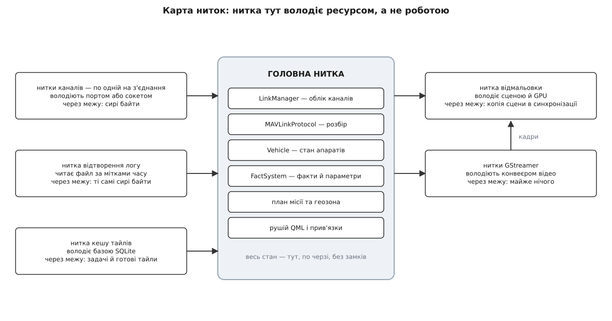
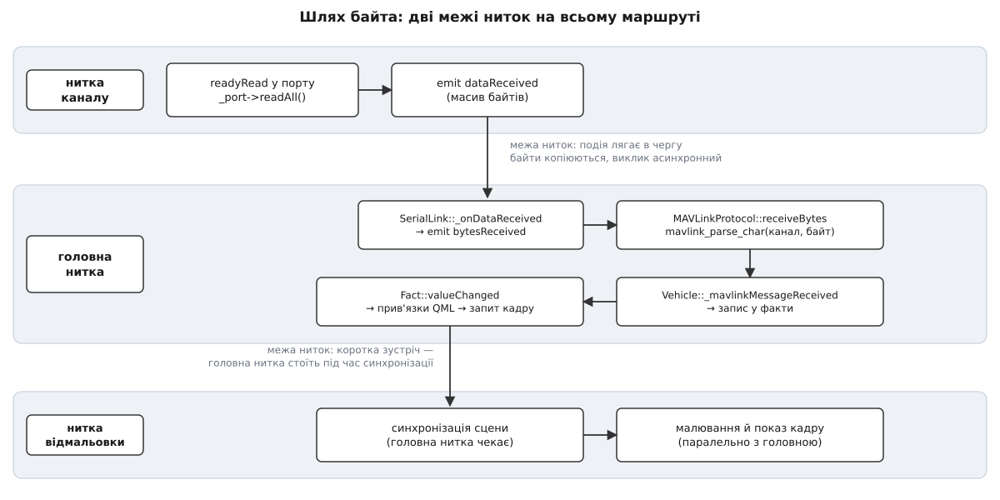
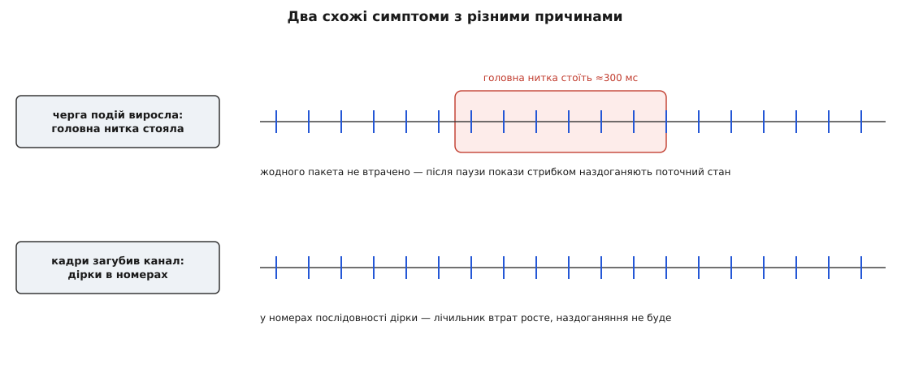

# Модель потоків: де живуть лінк, розбір і відмальовка

<preknowlist>
- [Процеси й потоки](topic:sf-os/process-vs-thread) — що таке нитка виконання, чим вона відрізняється від процесу і що нитки одного процесу бачать спільну пам'ять.
- [Цикл подій](topic:sf-tasks/event-loop) — нитка, яка по черзі виймає події з черги й викликає обробники.
- [Блокуючий і неблокуючий ввід-вивід](topic:sf-tasks/blocking-vs-nonblocking-io) — чому читання з порту чи сокета може спинити нитку на невизначений час.
- [Потокова безпека](topic:sf-tasks/thread-safety) — за яких умов до спільних даних потрібен замок.
- [Перегони даних і замки](topic:sf-tasks/data-races-locks) — що саме ламається, коли дві нитки пишуть в одне місце.
- [Пакет MAVLink](topic:sys-dron/mavlink-packet) — будова кадру телеметрії, зокрема номер послідовності й контрольна сума.
</preknowlist>

Наземна станція мусить робити одночасно дві речі, ритм яких задають різні господарі. Байти з радіомодема приходять тоді, коли апарат їх відправив, — станція на це не впливає. Екран треба перемальовувати в темпі монітора: за частоти оновлення 60 Гц на один кадр є 16.7 мс, і якщо не вкластися, оператор бачить ривок. Жодна з цих двох робіт не погоджується чекати на другу.

Найпростіше зробити все в одній нитці — і саме тому так робити не можна. Читання з послідовного порту в одній нитці з малюванням дає вибір із двох поганих варіантів: або нитка стає на системному виклику читання й екран завмирає, поки апарат мовчить, або вона крутить опитування порту в циклі, палить процесор і все одно додає затримку розміром із період опитування. Отже, введення-виведення мусить жити окремо від малювання. Це неминучий мінімум — дві нитки.

Далі починається цікаве, бо очевидне продовження («кожній підсистемі — свою нитку») в наземній станції не працює.

## Чому не «нитка на підсистему»

Стан апарата в застосунку — не набір незалежних змінних, а один зв'язаний граф. Прийшло повідомлення про орієнтацію — оновився [об'єкт Vehicle](topic:sys-dron/vehicle-object); від нього змінилися [факти](topic:sys-dron/fact-system), на які підписані індикатори; водночас контролер плану читає в того самого Vehicle точку зльоту, карта читає координати, а список параметрів чекає підтвердження запису. Одне повідомлення торкається півдесятка підсистем за мілісекунду.

Якби ці підсистеми жили в різних нитках, кожне таке читання стало б спільним доступом і вимагало б замка. Замків було б не два і не десять, а стільки, скільки зв'язків у графі, — а це найкоротший шлях до дедлоку та до гонок, які відтворюються раз на тиждень польотів. Гірше: остання ланка ланцюга — прив'язки QML. Вираз у прив'язці обчислюється тоді, коли рушій вирішить, що значення застаріло; обгорнути це обчислення замком неможливо, бо код прив'язки пише не той, хто проєктував синхронізацію.

Звідси рішення, на якому стоїть уся архітектура застосунку: **весь стан живе в одній нитці**. Не «більшість стану», не «стан із замками» — увесь. Тоді жоден із наведених зв'язків не є спільним доступом: усі вони — послідовні виклики в одній нитці, де синхронізація не потрібна за побудовою.

Але тоді нитці, яка володіє станом, категорично не можна блокуватися. З цієї пари — «весь стан в одній нитці» плюс «ця нитка ніколи не чекає» — виводиться решта моделі.

## Одна нитка стану, кілька ниток ресурсів

Модель QGroundControl у двох реченнях виглядає так. Головна нитка володіє всім, що має стан і сенс: обліком каналів, розбором MAVLink, об'єктами апаратів, фактами, планом місії, рушієм QML. Усе, що вміє блокуватися, винесено в окрему нитку, і кожна така нитка володіє **рівно одним ресурсом**: порт — своєю ниткою, база кешу тайлів — своєю, конвеєр відео — своїми, сцена й GPU — своєю.



*Кожна нитка поза головною існує не тому, що там багато роботи, а тому, що там є ресурс, який уміє змусити чекати.*

Це важлива відмінність від звичного пулу робочих ниток. У [пулі](topic:sf-tasks/thread-pool) нитка — виконавець задач, і задача може дістатися будь-якій вільній. Тут нитка — власник ресурсу, і задача завжди виконується там, де живе ресурс. Тому в застосунку немає ані пулу, ані планувальника задач: кількість ниток дорівнює кількості блокувальних ресурсів, які зараз відкриті.

## Механізм переходу через межу

Лишається питання, як байт із нитки порту потрапляє в нитку стану, не порушивши правила «жодних замків у логіці».

Кожен об'єкт застосунку приписаний до конкретної нитки — це його прив'язка. Обробник, приєднаний до сигналу, виконується не там, де сигнал випущено, а там, де живе об'єкт-отримувач. Якщо ці нитки різні, виклику не відбувається зовсім: аргументи копіюються в об'єкт-подію, подія кладеться в чергу нитки-отримувача, і нитка, що випустила сигнал, одразу повертається до своєї роботи. Згодом цикл подій отримувача вийме подію й викличе обробник — уже у своїй нитці.

З цього механізму випливають три наслідки, і кожен із них потрібен нам далі.

По-перше, перехід через межу **асинхронний за побудовою**: відправник ніколи не чекає. Нитка порту не може «загальмувати» через те, що головна нитка зайнята, — вона поклала байти в чергу й пішла читати далі.

По-друге, обробник виконується **послідовно з усім іншим** у нитці-отримувачі. Дві події з двох різних каналів ніколи не виконаються одночасно: черга сама їх упорядкує. Саме тому в коді розбору й моделі немає жодного замка — і не тому, що про них забули.

По-третє, через межу проходить **копія значення**, а не посилання на живий об'єкт. Це і є плата за модель: одне копіювання масиву байтів, одне виділення пам'яті під подію й одне пробудження нитки на кожен перехід. Для кількох кілобайтів телеметрії за секунду ця плата непомітна. Для потоку відео вона руйнівна — і саме там модель робить виняток, із суто арифметичної причини.

> Повний перелік того, що можна й чого не можна робити на межі, — [контракт переходу між нитками](topic:sys-dron/threading-model/api-thread-crossing.md): типи з'єднань сигнал-обробник, від чого залежить прив'язка об'єкта, які методи каналу безпечно кликати з чужої нитки й що станеться, якщо створити об'єкт не в тій нитці.

## Шлях байта: від дроту до пікселя

Тепер простежмо весь маршрут на живому коді. Він коротший, ніж здається.



*Від порту до пікселя маршрут перетинає межу ниток лише двічі, і обидва рази — на строго визначених даних.*

Канал у сучасному QGroundControl складається з двох об'єктів. `SerialLink` живе в головній нитці й є тим, що бачить решта застосунку. `SerialWorker` створюється в тій самій головній нитці, а потім переселяється в свою власну нитку, і саме він відкриває порт та читає з нього:

```cpp
_worker->moveToThread(_workerThread);
connect(_workerThread, &QThread::started, _worker, &SerialWorker::setupPort);
```

Порт створюється в обробнику `setupPort`, тобто **вже всередині робочої нитки**, — а отже, і сам порт приписаний до неї, і його сигнал про готові дані спрацьовує там само. Робітник читає все, що накопичилося, і випускає сигнал:

```cpp
const QByteArray data = _port->readAll();
emit dataReceived(data);
```

Ось перший і єдиний перехід у цьому напрямку — з'єднання оголошене явно як чергове, тому байти лягають у чергу головної нитки:

```cpp
connect(_worker, &SerialWorker::dataReceived,
        this,    &SerialLink::_onDataReceived, Qt::QueuedConnection);

void SerialLink::_onDataReceived(const QByteArray &data)
{
    emit bytesReceived(this, data);
}
```

Далі всі об'єкти вже в одній нитці, і сигнали перетворюються на звичайні виклики. Менеджер каналів під час створення з'єднання прив'язав канал до розбирача:

```cpp
connect(link.get(), &LinkInterface::bytesReceived,
        MAVLinkProtocol::instance(), &MAVLinkProtocol::receiveBytes);
```

`MAVLinkProtocol::receiveBytes` пропускає масив через скінченний автомат протоколу побайтово, і на кожному зібраному кадрі випускає повідомлення далі:

```cpp
void MAVLinkProtocol::receiveBytes(LinkInterface *link, const QByteArray &data)
{
    const uint8_t mavlinkChannel = link->mavlinkChannel();
    // для кожного байта: mavlink_parse_char(mavlinkChannel, byte, &message, &status);
    // якщо framing == MAVLINK_FRAMING_OK → emit messageReceived(link, message);
}
```

Об'єкт апарата підписаний на цей сигнал, і теж у головній нитці:

```cpp
connect(MAVLinkProtocol::instance(), &MAVLinkProtocol::messageReceived,
        this, &Vehicle::_mavlinkMessageReceived);
```

Далі йде звичайний ланцюг без жодної згадки про нитки: обробник розкладає повідомлення, записує значення у факти, факти повідомляють про зміну, прив'язки QML перераховують вирази, елементи інтерфейсу позначають себе брудними й просять новий кадр.

Головне у цьому маршруті — що саме перетинає межу. Через неї проходить масив байтів, який ще нічого не означає: у ньому може бути пів кадру, півтора кадри або сміття з увімкнення живлення. Жодного об'єкта застосунку, жодного покажчика на модель, жодного напівоновленого стану. Уся семантика — розбір, маршрутизація, оновлення моделі, перерахунок прив'язок — відбувається по один бік межі й тому не потребує синхронізації взагалі.

## Чому розбір саме в головній нитці

Розбір MAVLink у головній нитці спершу викликає підозру: чи не забирає він час у інтерфейсу? Порахуймо.

**Найшвидший типовий послідовний канал станції — 921600 бод, кадр 8N1 (десять бітів на байт).**

```
пропускна здатність = 921600 / 10        = 92160 байтів/с
за один кадр 60 Гц   = 92160 × 0.0167    ≈ 1539 байтів
розбір (щедро 50 нс/байт) = 1539 × 50 нс ≈ 77 мкс
частка кадрового бюджету  = 77 мкс / 16.7 мс ≈ 0.46 %
```

Половина відсотка кадру — на найшвидшому каналі, який узагалі трапляється, і за оцінки вартости розбору з великим запасом. Реальні [частоти потоків телеметрії](topic:sys-dron/stream-rates) дають одиниці кілобайтів за секунду, тобто ще на порядок менше. Розбір безкоштовний порівняно з будь-чим, що робить інтерфейс.

Друга підозра серйозніша: чи безпечно це. Розбирач MAVLink на C зберігає стан не в переданій структурі, а у **глобальних масивах, індексованих номером каналу**: недозібраний кадр, поточна фаза автомата, останній номер послідовности. Дві нитки, що розбирають у той самий канал, перемішали б свої недокадри й отримали б на виході сміття. Дві нитки в різні канали торкаються різних комірок масивів і не заважають одна одній — саме тому бібліотеку називають потокобезпечною **в межах каналу**.

QGroundControl знімає це питання, а не розв'язує: розбір є тільки в головній нитці, тож ниток-розбирачів завжди рівно одна. Але окремий канал кожному з'єднанню все одно потрібен — з іншої причини. Два фізичні канали несуть два незалежні потоки байтів: у момент, коли з радіомодема прийшло пів кадру, з USB-кабелю може прийти початок іншого. Спільний стан автомата склеїв би їх в одне. Крім того, лічильники втрат рахуються з номерів послідовности окремо для кожної трійки «канал, ідентифікатор системи, ідентифікатор компонента», щоб трафік на одному каналі не псував статистику іншого.

Канал видається з бітової маски зайнятих:

```cpp
uint8_t LinkManager::allocateMavlinkChannel()
{
    for (uint8_t ch = 0; ch < MAVLINK_COMM_NUM_BUFFERS; ch++) {
        if (_mavlinkChannelsUsedBitMask & (1 << ch)) continue;
        mavlink_reset_channel_status(ch);
        _mavlinkChannelsUsedBitMask |= (1 << ch);
        return ch;
    }
    return invalidMavlinkChannel();
}
```

Тут немає ані замка, ані атомарної операції над маскою — і це не недогляд. Канали видаються й повертаються тільки при створенні та закритті з'єднань, а ці події відбуваються виключно в головній нитці. Модель ниток тут працює як доказ коректности: якщо стан один раз оголошено власністю однієї нитки, синхронізація навколо нього стає зайвою.

`MAVLINK_COMM_NUM_BUFFERS` за замовчуванням дорівнює 16 на Windows, Linux і macOS та 4 на решті систем. Це не абстрактна константа, а жорстка стеля: більше одночасних з'єднань станція просто не відкриє, бо кожному потрібен свій стан автомата.

> 🔧 **Навіщо це.** Додаючи новий тип каналу, ви не пишете жодного рядка синхронізації — але мусите виконати три умови, інакше все розсиплеться тихо. Ресурс (порт, сокет, файл) відкривається **всередині** робочої нитки, а не в конструкторі. Сигнал із даними з'єднується явно як чергове з'єднання. Назовні віддаються тільки байти. Порушите перше — і сигнали ресурсу спрацьовуватимуть у головній нитці, тобто ви щойно повернули блокування в неї.

## Зворотний напрям

У бік апарата діє те саме правило, лише дзеркально. Будь-яка підсистема головної нитки — надсилання команди, запис параметра, вивантаження місії — врешті звертається до каналу, а канал перекладає роботу на свого робітника:

```cpp
QMetaObject::invokeMethod(_worker, "writeData", Qt::QueuedConnection,
                          Q_ARG(QByteArray, data));
```

Суфікс «ThreadSafe» у назвах методів каналу — це обіцянка не про замки, а про прив'язку: хоч звідки ви покличете такий метод, справжній запис у порт станеться в нитці порту.

Один виняток із асинхронности є, і він показовий — розрив з'єднання:

```cpp
QMetaObject::invokeMethod(_worker, "disconnectFromPort", Qt::BlockingQueuedConnection);
_workerThread->quit();
_workerThread->wait(DISCONNECT_TIMEOUT_MS);
```

Блокувальне чергове з'єднання кладе подію в чергу робітника і **чекає**, поки той її виконає. Тут це необхідно: одразу після повернення об'єкти каналу знищуються, і порт мусить бути вже закритий, інакше робітник торкнеться звільненої пам'яті. Ціна такої зустрічі — можливість [дедлоку](topic:sf-tasks/deadlock): якщо в той самий момент робітник блокувально викличе щось у головній нитці, обидві чекатимуть одна одну назавжди. Звідси правило, якого застосунок дотримується: блокувальні переходи — тільки при згортанні й тільки в один бік, від власника до робітника.

## Третя нитка: відмальовка

Сцена малюється не в головній нитці. Рушій Qt Quick тримає для цього окрему нитку, і раз на кадр обидві сходяться в короткій фазі синхронізації: головна нитка **зупиняється**, нитка відмальовки переносить у своє дерево ті зміни, які встигли статися в QML, і відпускає головну. Далі вони працюють паралельно — одна обробляє події та телеметрію, друга віддає кадр графічному процесору.

Наслідки цієї схеми не завжди очевидні.

Вартість самого малювання — шейдери, перекриття шарів, тайли карти — не з'їдає час головної нитки безпосередньо: ці роботи накладаються в часі. Але кадри прив'язані до оновлення екрана, і коли головна нитка хоче почати наступний кадр, а попередній ще не показано, вона чекає. Тому важка сцена таки гальмує обробку телеметрії — не прямо, а через темп кадрів. Це важлива деталь для діагностики: перевантажена карта проявляється не тільки в ривках картинки, а й у затримці показників.

І навпаки — торкатися структур сцени можна **лише** у фазі синхронізації, коли головна нитка гарантовано стоїть. Це вузьке вікно й пояснює, чому власних низькорівневих елементів сцени в застосунку одиниці: майже все зроблено звичайним QML, який про цю межу нічого не знає.

Одне застереження про переносність. Нитка відмальовки — типова, але не універсальна: за документацією Qt 6 вона стандартна на Windows з Direct3D 11, на Linux (крім програмного растеризатора Mesa llvmpipe), на macOS з Metal, на мобільних платформах і всюди з Vulkan; натомість на macOS з OpenGL, у WebAssembly та з деякими драйверами Linux вмикається простий цикл, де малювання відбувається **в головній нитці**. На таких конфігураціях час малювання стає часом головної нитки безпосередньо — і застосунок, який рівно працює на одній машині, помітно грузне на іншій без жодних змін у коді, бо весь [кадровий бюджет](topic:sf-visual/frame-budget) там ділиться на двох.

## Нитки, що грають за іншими правилами

Три підсистеми свідомо виламуються з описаної схеми, і кожна — зі своєї причини.

**Кеш тайлів карти.** Робітник кешу — це нитка з власним циклом, а не з циклом подій: черга задач, м'ютекс і умовна змінна, класичний [виробник-споживач](topic:sf-tasks/producer-consumer). Причина в тому, що робота тут — довгі транзакції до бази SQLite, які треба ставити в чергу з власною дисципліною пріоритетів, а не просто виконувати в порядку надходження. Черга подій такого не вміє. Тому й постановка задачі виглядає незвично:

```cpp
QMetaObject::invokeMethod(m_worker, &QGCCacheWorker::enqueueTask,
                          Qt::DirectConnection, qReturnArg(result), task);
```

Пряме з'єднання означає, що `enqueueTask` виконається **в нитці того, хто кличе**, — тобто в головній. Безпеку тут дає не межа ниток, а м'ютекс усередині методу. Це законно рівно тому, що метод свідомо написаний як потокобезпечний, і показує межу загального правила: коли ресурс має власну дисципліну черги, механізм подій відступає, але тоді синхронізацію треба писати руками й це видно з коду.

**Відтворення логу.** Канал відтворення влаштований як звичайний канал: об'єкт у головній нитці плюс робітник у своїй нитці. Робітник читає файл і **видає байти в темпі, заданому мітками часу в самому лозі**, після чого вони йдуть тим самим маршрутом, що й живий радіоканал. Наслідок фундаментальний: усе, що нижче за розбирачем — маршрутизація, об'єкт апарата, факти, карта, — не має жодного способу відрізнити запис від польоту. Це не побічний ефект, а те, заради чого [телеметричні логи](topic:sys-dron/telemetry-logging) взагалі відтворюються.

**Відео.** Тут Qt закінчується. Конвеєр GStreamer має власні нитки потоку, які нічого не знають ані про цикл подій, ані про прив'язку об'єктів. Приймач тримає ще одну нитку-робітника з чергою задач, щоб упорядкувати операції над конвеєром, а зворотні виклики шини конвеєра приходять просто в нитці потоку — асинхронно до всього іншого. Тому в цьому коді, єдиному на весь застосунок, доводиться писати синхронізацію явно: покажчик на конвеєр захищено м'ютексом, бо зворотний виклик у нитці потоку може виконуватися одночасно зі спиненням конвеєра в нитці робітника, а лічильники кадрів оголошено атомарними, бо їх пишуть у нитці потоку, а читають в інтерфейсі.

## Чому кадри не проходять через головну нитку

Відео — не просто ще один особливий випадок, а місце, де загальна модель перестала б працювати. Порахуймо, чому.

**Потік 1080p60 у форматі з [субдискретизацією кольору](topic:sf-visual/chroma-subsampling) 4:2:0 — півтора байта на піксель.**

```
розмір кадру = 1920 × 1080 × 1.5      = 3 110 400 байтів ≈ 3.1 МБ
потік        = 3.1 МБ × 60            ≈ 186 МБ/с
телеметрія   (одиниці кБ/с)           ≈ 0.01 МБ/с
співвідношення                        ≈ 20 000 разів
```

Перехід через межу ниток коштує копіювання даних плюс виділення пам'яті під подію. Для телеметрії це десяток кілобайтів за секунду — непомітно. Для відео це означало б копіювати 186 МБ щосекунди й будити головну нитку 60 разів на секунду тільки заради того, щоб вона передала масив далі. Кадри в застосунку тому й **не потрапляють у головну нитку зовсім**: декодований кадр із нитки потоку віддається приймачу сцени і йде до графічного процесора, оминаючи маршрут телеметрії. Головна нитка керує [відеотрактом](topic:sys-dron/video-pipeline) — вмикає, перемикає джерело, запускає запис, — але ніколи не тримає в руках жодного кадру.

Це і є чесна межа моделі: «одна межа, копіюємо байти» працює для потоків у кілобайти за секунду й розвалюється на потоках у сотні мегабайтів. Там, де об'єм даних робить копіювання неможливим, доводиться повертатися до спільної пам'яті, м'ютексів і атомарних змінних — з усією їхньою вартістю в увазі того, хто пише код.

## Що ламається і як це видно

Кілька несправностей станції виглядають на екрані майже однаково, а причини мають протилежні — і саме модель ниток їх розрізняє.



*Один симптом на екрані — застиглі покази — має дві різні причини, і поводяться вони після відновлення протилежно.*

**Показники відстають, а потім стрибком наздоганяють.** Головна нитка на щось стала: важкий діалог, синхронне читання файлу, перевантажена сцена. Нитка каналу тим часом читала далі й складала байти в чергу — а черга подій не має верхньої межі й нічого не викидає. Тому втрат тут немає взагалі: щойно головна нитка звільнилася, вона розібрала всю чергу підряд, і покази промайнули від старих значень до поточного. Класичний приклад того, що трапляється, коли [протитиску](topic:sf-tasks/backpressure) в системі немає: замість відмови обслуговування ви дістаєте необмежену затримку.

**Показники завмирають і після відновлення не наздоганяють, а лічильник втрат росте.** Це вже справжня втрата кадрів у радіоканалі. Лічильник рахується не з таймінгів, а з дірок у номерах послідовности MAVLink, тож він міряє саме те, чого не було в ефірі. Наздоганяти нічого — цих кадрів не існує.

**Інтерфейс не реагує, а відео йде рівно.** Найпоказовіший випадок: він доводить, що застрягла саме головна нитка, а не машина й не графічний процесор, — адже кадри до неї не заходять. Шукати треба блокувальний виклик у головній нитці. Якщо ж завмирає й відео — проблема нижча за застосунок.

**Попередження про об'єкт, створений не в тій нитці, або падіння при закритті з'єднання.** Це майже завжди одна й та сама помилка: об'єкт створили в робочій нитці, а прив'язали до батька з головної, або навпаки. Прив'язка визначається ниткою створення, тому таємничі падіння при від'єднанні кабелю варто починати шукати саме з неї.

## Правило для того, хто дописує код

З усього вище випливає короткий порядок дій, який рятує від більшости помилок у цій частині застосунку.

Пишіть у головній нитці, доки не доведено протилежне. Там уже є весь стан, там нічого не треба захищати, і будь-який винос коду звідти має бути виправданий. Виносьте лише те, що **блокується**: файл, сокет, база, довгий обчислювальний прохід. І виносьте **ресурс, а не логіку** — робітник володіє дескриптором і не знає нічого про сенс даних; головна нитка знає сенс і не володіє нічим, що вміє чекати. Через межу передавайте значення без особи: масив байтів, просту структуру, число. Ніколи — покажчик на модель.

> Робочий приклад такого каналу з нуля — [мінімальний канал на робочій нитці](topic:sys-dron/threading-model/proj-link-worker.md): робітник, переселення в нитку, чергове з'єднання, коректне згортання, а також вимірювання глибини черги, щоб під час налагодження одразу бачити, чи затримка від застряглої головної нитки, чи від каналу.

Найкоротше формулювання моделі таке: **нитка тут володіє ресурсом, а не роботою**. Це пояснює й те, чого в застосунку немає, — ані пулу ниток, ані планувальника задач, ані черг завдань поверх подій. Кількість ниток не налаштовується й не оптимізується: вона дорівнює кількості відкритих ресурсів, які вміють змусити чекати. Коли наступного разу виникне спокуса «прискорити застосунок, розпаралеливши підсистему», перевірте спершу, який саме ресурс ви цим забираєте у власника, — бо якщо жодного, ви додаєте не швидкість, а замки.
