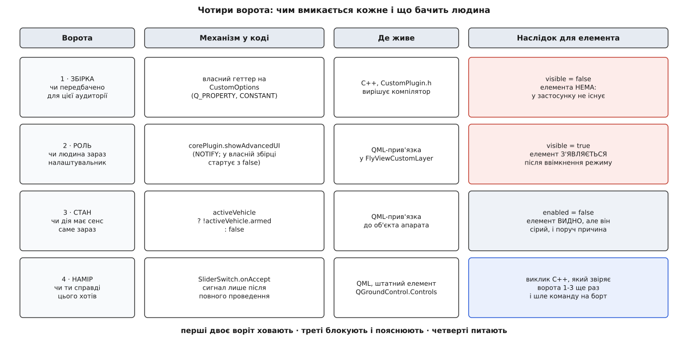
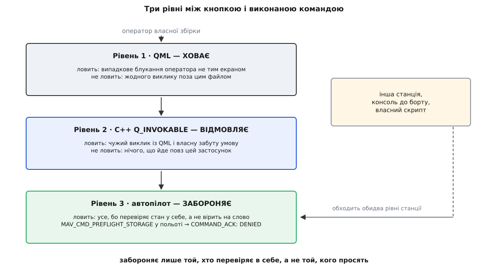

# ⚙️ Кнопка за чотирма воротами: сервісна дія у власній збірці

Проведемо один елемент керування від задачі до робочого коду: кнопку, якої пілот не побачить ніколи, налаштувальник побачить лише в поглибленому режимі, на зброєному апараті вона буде видима, але мертва, а спрацює тільки після проведення пальцем. Чотири захисти в одному елементі — і кожен доводиться вмикати окремим механізмом, бо жоден не вміє того, що вміють інші.

## Задача

Уявімо збірку «Sparrow»: наземна станція під готовий вантажний коптер, який продають комплектом із планшетом. Оператор возить посилки, борт налаштований на заводі, у налаштування оператор не ходить. Сервісна служба вендора час від часу просить його по телефону скинути параметри автопілота до заводських — це знімає половину звернень «щось поламалося після того, як я подивився налаштування».

Дія груба. Це [MAVLink-команда](topic:sys-dron/mavlink-commands) `MAV_CMD_PREFLIGHT_STORAGE` (245) з першим параметром `2` — `PARAM_RESET_FACTORY_DEFAULT: Reset parameters to default values (such as sensor calibration, safety settings, and so on)`. Після неї апарат треба калібрувати наново, тож помилкове натискання коштує оператору години роботи, а вендорові — дзвінка.

Що потрібно від елемента, який цю команду надсилає:

- у звичайній збірці для покупця його немає взагалі — навіть як сірої кнопки;
- у сервісній збірці він з'являється лише після ввімкнення поглибленого режиму;
- поки апарат [зброєний](topic:sys-dron/arming-checks), дія недоступна — але оператор має бачити і кнопку, і причину, чому вона сіра;
- натиск не рахується: потрібен рух пальцем.

Чотири вимоги — і жодну з них не вдасться виконати механізмом сусідньої.

## Ідея: чотири незалежні ворота

Спокуса тут одна й типова: звести всі умови в один вираз і поставити його у `visible`. Виходить щось на кшталт «показувати, якщо сервісна збірка, і поглиблений режим, і апарат роззброєний». Такий елемент поводиться дивно: оператор дзвонить у підтримку, йому кажуть «проведіть смужку скидання», а смужки на екрані немає — бо апарат зброєний, і про це ніхто не здогадається. Умови різні за природою, тому й наслідки в них мають бути різні.

**Перші ворота — збірка.** Питання: чи ця можливість узагалі передбачена для тієї аудиторії, якій дали цей застосунок. Відповідь дає компілятор, і в готовому застосунку її змінити нічим. Механізм — власний віртуальний геттер на похідному від `QGCOptions` класі: [ядрове розширення](topic:sys-dron/core-plugin) — єдиний об'єкт, у якого застосунок питає про свої можливості, тож туди й лягає нова властивість.

**Другі ворота — роль.** Питання: чи людина зараз працює як налаштувальник. Відповідь змінюється за життя застосунку, і механізм для неї готовий — булева властивість `showAdvancedUI` ядрового розширення, оголошена з сигналом зміни.

**Треті ворота — стан.** Питання: чи дія має сенс саме зараз. Відповідь дає не людина й не збірка, а світ: апарат під'єднаний чи ні, зброєний чи ні. Механізм — властивості самого [об'єкта апарата](topic:sys-dron/vehicle-object) в застосунку.

**Четверті ворота — намір.** Питання: чи ти справді цього хотів. Вони не знають нічого ні про людину, ні про світ і ловлять те, чого не спіймають решта, — випадковий дотик. Механізм у QGroundControl готовий: елемент `SliderSwitch`, який випромінює сигнал `accept` лише після повного проведення повзунка.

Тепер головне рішення, заради якого все це розписувалося. **Перші й другі ворота керують видимістю, треті — доступністю.**

Різниця в тому, що саме має зрозуміти людина. Коли зачинені перші або другі ворота, розуміти нема чого: у світі цієї людини такої дії не існує. Сіра кнопка тут гірша за порожнє місце, бо вона обіцяє те, чого ніколи не буде, і штовхає шукати спосіб її оживити. А коли зачинені треті, дія існує й буде доступна за хвилину — сховати її означає змусити оператора шукати зниклу кнопку замість того, щоб роззброїти апарат. Тому треті ворота лишають елемент на екрані, гасять його й пишуть поруч причину.

> 🔧 **Навіщо це.** Правило переноситься на будь-яку панель: ховай те, чого людині **не належить** знати, і блокуй те, що їй **зараз** недоступне. Помилка в перший бік дає інтерфейс, який дражнить сірими кнопками, за якими нічого не стоїть; помилка в другий — інтерфейс, елементи якого зникають без пояснень, і людина замість роботи вивчає, за яких умов вони з'являються. Обидві помилки коштують тих самих дзвінків у підтримку, від яких увесь цей захист і мав урятувати.


*Кожні ворота мають власний механізм і власний наслідок. Перші двоє стоять на видимості, треті — на доступності, а четверті взагалі не стосуються показу: вони вирішують, чи виклик станеться.*

## Код: сторона C++

Усе, що вирішує компілятор і що не має права залежати від QML, живе тут. Клас можливостей додає собі власну властивість, якої в апстримному `QGCOptions` немає:

```cpp
// CustomPlugin.h — власна збірка «Sparrow»
class CustomOptions : public QGCOptions
{
    Q_OBJECT
    /// Ворота 1. CONSTANT тут чесний: значення вирішує компілятор,
    /// і за життя застосунку воно змінитися не може.
    Q_PROPERTY(bool showServiceActions READ showServiceActions CONSTANT)

public:
    explicit CustomOptions(CustomPlugin *plugin, QObject *parent = nullptr);

    bool showServiceActions() const { return kServiceBuild; }

    // Взірець із апстримного custom-example: сторінка прошивання — теж лише для експерта.
    bool showFirmwareUpgrade() const final { return _plugin->showAdvancedUI(); }

private:
    // target_compile_definitions(Sparrow PRIVATE SPARROW_SERVICE_BUILD)
#ifdef SPARROW_SERVICE_BUILD
    static constexpr bool kServiceBuild = true;
#else
    static constexpr bool kServiceBuild = false;
#endif

    QGCCorePlugin *_plugin = nullptr;
};
```

`CONSTANT` у цьому оголошенні — не недбалість, а точне твердження. Властивість, оголошена так, читається рушієм QML один раз при побудові елемента й більше ніколи; для величини, яку вирішив компілятор, це рівно те, що треба. Якби `showServiceActions()` колись почав залежати від чогось змінного — від того самого поглибленого режиму, наприклад, — `CONSTANT` довелося б замінити на `NOTIFY` разом із сигналом, інакше елемент застиг би в стані, який був на старті, і жодного попередження ніде не з'явилося б.

Далі — саме розширення. Дві речі в конструкторі й одна публічна дія:

```cpp
// CustomPlugin.h
class CustomPlugin : public QGCCorePlugin
{
    Q_OBJECT

public:
    explicit CustomPlugin(QObject *parent = nullptr);

    QGCOptions *options() final { return _options; }

    /// Сервісна дія. Порожній рядок — надіслано; непорожній — причина відмови.
    Q_INVOKABLE QString resetParametersToFactory();

private slots:
    void _advancedChanged(bool advanced);

private:
    CustomOptions *_options = nullptr;
};
```

```cpp
// CustomPlugin.cc
CustomPlugin::CustomPlugin(QObject *parent)
    : QGCCorePlugin(parent)
    , _options(new CustomOptions(this, this))
{
    // Ворота 2 стартують ЗАЧИНЕНИМИ. Базовий клас ініціалізує це поле в true.
    _showAdvancedUI = false;
    (void) connect(this, &QGCCorePlugin::showAdvancedUIChanged,
                   this, &CustomPlugin::_advancedChanged);
}

QString CustomPlugin::resetParametersToFactory()
{
    // Ті самі ворота ще раз — там, де їх не обійде ні помилка в QML, ні чужий виклик.
    if (!_options->showServiceActions()) {
        return tr("Ця збірка не має сервісних дій.");
    }
    if (!showAdvancedUI()) {
        return tr("Потрібен поглиблений режим.");
    }

    Vehicle *vehicle = MultiVehicleManager::instance()->activeVehicle();
    if (!vehicle) {
        return tr("Апарат не під'єднаний.");
    }
    if (vehicle->armed()) {
        return tr("Апарат зброєний — спершу роззбройте його.");
    }

    vehicle->sendCommand(vehicle->defaultComponentId(),
                         MAV_CMD_PREFLIGHT_STORAGE,
                         true,   // showError: відмову від борту застосунок покаже сам
                         2);     // PREFLIGHT_STORAGE_PARAMETER_ACTION: PARAM_RESET_FACTORY_DEFAULT
    return QString();
}

void CustomPlugin::_advancedChanged(bool advanced)
{
    // Базовий QGCOptions власних сигналів не випромінює — це обов'язок похідного класу.
    emit _options->showFirmwareUpgradeChanged(advanced);
}
```

Рядок `_showAdvancedUI = false` — це не дрібниця налаштування, а те, завдяки чому другі ворота взагалі існують. Поле в базовому класі захищене саме для цього: похідний клас присвоює його прямо в конструкторі, без сигналу, бо інтерфейсу в той момент ще немає й повідомляти нема кого.

Повторна перевірка всередині `resetParametersToFactory()` виглядає надлишковою рівно доти, доки не спитати, хто ще може покликати цей метод. Позначка `Q_INVOKABLE` відкриває його всьому QML застосунку, а не одному твоєму файлу; та й сам файл ти колись перепишеш і забудеш про одну з умов. Умови у QML вирішують, **що видно**; умови в C++ вирішують, **що станеться**. Це різні питання, і відповідати на них має різний код.

## Код: сторона QML

[Власна збірка](topic:sys-dron/custom-build) підміняє інтерфейс не правкою апстримних файлів, а перехопленням шляхів: розширення ставить у рушій QML перехоплювач URL, який для кожного ресурсу `qrc:/<шлях>` перевіряє, чи існує `:/Custom/<шлях>`, і підставляє його. Тому файл треба покласти в ресурси власної збірки під тим самим іменем, під яким його шукає апстрим:

```xml
<qresource prefix="/Custom/qml">
    <file alias="QGroundControl/FlyView/FlyViewCustomLayer.qml">src/FlyViewCustomLayer.qml</file>
</qresource>
```

`FlyViewCustomLayer` — штатне місце для вендорського шару над політним екраном: апстримна версія цього файлу нічого не малює й лише пропускає крізь себе відступи, зайняті штатними панелями. Ось наш варіант:

```qml
import QtQuick
import QtQuick.Layouts

import QGroundControl
import QGroundControl.Controls
import QGroundControl.FlyView

Item {
    id: _root

    property var parentToolInsets                 // що вже зайняли штатні панелі
    property var totalToolInsets: _toolInsets     // що зайняли ми
    property var mapControl

    // ── Усі четверо воріт зібрані в одному місці ──────────────────────────
    property var  _vehicle:      QGroundControl.multiVehicleManager.activeVehicle
    property bool _serviceBuild: QGroundControl.corePlugin.options.showServiceActions  // 1
    property bool _advanced:     QGroundControl.corePlugin.showAdvancedUI              // 2
    property bool _mayReset:     _vehicle ? !_vehicle.armed : false                    // 3

    property string _reason: !_vehicle       ? qsTr("апарат не під'єднаний") :
                              _vehicle.armed ? qsTr("апарат зброєний")       : ""
    property string _refusal: ""                  // відмова, що прийшла з C++
    property real   _margin:  ScreenTools.defaultFontPixelWidth

    QGCPalette { id: qgcPal; colorGroupEnabled: true }

    QGCToolInsets {
        id:                     _toolInsets
        leftEdgeTopInset:       parentToolInsets.leftEdgeTopInset
        leftEdgeCenterInset:    parentToolInsets.leftEdgeCenterInset
        leftEdgeBottomInset:    parentToolInsets.leftEdgeBottomInset
        rightEdgeTopInset:      servicePanel.visible ? _root.width - servicePanel.x
                                                     : parentToolInsets.rightEdgeTopInset
        rightEdgeCenterInset:   parentToolInsets.rightEdgeCenterInset
        rightEdgeBottomInset:   parentToolInsets.rightEdgeBottomInset
        topEdgeLeftInset:       parentToolInsets.topEdgeLeftInset
        topEdgeCenterInset:     parentToolInsets.topEdgeCenterInset
        topEdgeRightInset:      parentToolInsets.topEdgeRightInset
        bottomEdgeLeftInset:    parentToolInsets.bottomEdgeLeftInset
        bottomEdgeCenterInset:  parentToolInsets.bottomEdgeCenterInset
        bottomEdgeRightInset:   parentToolInsets.bottomEdgeRightInset
    }

    ColumnLayout {
        id:                  servicePanel
        anchors.right:       parent.right
        anchors.top:         parent.top
        anchors.rightMargin: _margin
        anchors.topMargin:   parentToolInsets.topEdgeRightInset + _margin
        spacing:             _margin

        // Ворота 1 і 2 — саме ВИДИМІСТЬ: для пілота цього елемента не існує.
        visible: _serviceBuild && _advanced

        QGCLabel {
            text:      qsTr("Сервіс")
            font.bold: true
        }

        SliderSwitch {
            id:                    resetSlider
            Layout.preferredWidth: ScreenTools.defaultFontPixelWidth * 32
            confirmText:           qsTr("Скинути параметри до заводських")

            // Ворота 3 — саме ДОСТУПНІСТЬ: елемент видно, але він не працює.
            enabled: _mayReset
            opacity: enabled ? 1.0 : 0.5

            // Ворота 4 — сигнал приходить лише після повного проведення.
            onAccept:          _root._refusal = QGroundControl.corePlugin.resetParametersToFactory()
            onEnabledChanged:  if (enabled) _root._refusal = ""
        }

        QGCLabel {
            Layout.maximumWidth: resetSlider.width
            wrapMode:            Text.WordWrap
            color:               qgcPal.warningText
            visible:             text !== ""
            text:                _reason !== "" ? qsTr("Недоступно: %1").arg(_reason) : _refusal
        }
    }
}
```

Три властивості згори — це і є ворота, винесені з розмітки. Так їх видно всі одразу, і кожна наступна людина, що відкриє файл, прочитає політику елемента, не збираючи її по кутках дерева.

`enabled` на `SliderSwitch` вимикає елемент по-справжньому, а не візуально: у Qt Quick недоступність успадковується вниз по дереву, тож зона дотику всередині повзунка перестає приймати події, а клавіатурний шлях (`SliderSwitch` уміє й пробіл) відрізаний разом із фокусом. `opacity` поруч — суто косметика; сама по собі вона не блокує нічого, і ставити її замість `enabled` означає намалювати сірий елемент, який чудово натискається.

## Пастки

### Присвоєння замість прив'язки

Найдорожча помилка в цьому файлі пишеться так:

```qml
    Component.onCompleted: {
        servicePanel.visible = _serviceBuild && _advanced   // ✖ так робити не можна
    }
```

Виглядає як те саме. Не те саме зовсім. Рядок у декларації елемента — це **прив'язка**: вираз, який рушій перераховує щоразу, коли зміниться будь-що всередині нього. Той самий вираз в обробнику — це **присвоєння**: воно один раз обчислює значення й, головне, **знищує прив'язку назавжди**. Панель застигає в тому стані, який мала на старті: людина проходить жест, поглиблений режим вмикається, `showAdvancedUI` чесно стає `true` — а панелі немає. І не скаржиться ніхто: ні попередження в консолі, ні запису в журналі.

Правило просте: усе, що стосується воріт, живе у виразах праворуч від двокрапки. Якщо вже дуже треба обчислювати щось у коді — обчислюй функцією, яку кличе прив'язка, а не присвоюй властивість руками.

### Апарата може не бути

Рядок `property bool _mayReset: _vehicle ? !_vehicle.armed : false` виглядає перестраховкою рівно до першого від'єднання. `activeVehicle` порожній щоразу, коли апарата немає: до першого з'єднання, після втрати каналу, під час перемикання [між кількома апаратами](topic:sys-dron/multi-vehicle). Написане без перевірки

```qml
    property bool _mayReset: !_vehicle.armed    // ✖
```

не впаде — воно кине помилку типу всередині обчислення прив'язки. QML такі помилки не поширює далі: він пише рядок у консоль і **лишає властивості попереднє значення**. Тобто після від'єднання апарата в польоті смужка залишиться доступною рівно в тому стані, у якому була до того. Саме тому поруч із `_mayReset` живе `_reason`: відповідь тут не двійкова, а тризначна — доступно, недоступно через зброєння, недоступно через відсутність апарата. Кожен із двох останніх варіантів має власний текст причини, інакше оператор бачить сіру кнопку без пояснення й дзвонить.

### Що ховати не можна ніколи

Механізм воріт спокушає застосувати його до всього підряд. Є елементи, до яких він не застосовний узагалі: **аварійна зупинка моторів**. У QGroundControl для неї є окремий перемикач політних опцій (`guidedBarShowEmergencyStop`), і в апстримі він відкритий. Спокуса прибрати кнопку, «щоб оператор не зупинив мотори в повітрі», зрозуміла й хибна: аварійна зупинка — остання інстанція для випадку, коли апарат уже поводиться не так, як задумано, а всі решта способи його спинити спираються саме на те, що поводиться він правильно.

Загальніше: за поглиблений режим ховають те, що людині **не знадобиться**, а не те, що їй **не можна довірити**. Дія, потрібна в найгіршу мить, у поглиблений режим не переїжджає — вона захищається жестом наміру, а не приховуванням.

### Апстрим стартує з відчиненими другими воротами

Прапорець `showAdvancedUI` у базовому класі ініціалізовано в `true`. Це означає, що звичайний QGroundControl завжди в поглибленому режимі, а вираз `visible: _serviceBuild && _advanced` там завжди істинний за другим множником.

Наслідок для перевірки роботи прямий і неприємний: **у звичайній збірці другі ворота перевірити неможливо**. Вони там завжди відчинені. Побачити, що елемент справді ховається, можна лише у власній збірці, де конструктор поставив `false`. Перевірка, зроблена на апстримі, дасть зелене світло на рівному місці.

Там же, у власній збірці, треба пройти й сам жест увімкнення — і його варто знайти в коді своєї гілки, а не покладатися на пам'ять чи на статтю в мережі: за роки він мінявся кілька разів. У поточному `master` це не окрема кнопка, а `QGCMouseArea` поверх блоку з версією в меню вибору виду (`SelectViewDropdown.qml`): натиск із утриманим `Shift` на настільній платформі або звичайний дотик на мобільній, а далі — підтвердження попередження, текст якого віддає `showAdvancedUIMessage()` ядрового розширення. Той самий обробник із `Ctrl` перемикає зовсім інше — налагоджувальне підсвічування зон дотику.

### Прив'язка бачить не той тип

`options` оголошено як вказівник на `QGCOptions`, а `corePlugin` — на `QGCCorePlugin`. Ані `showServiceActions`, ані `resetParametersToFactory` в цих типах немає — вони є лише в наших похідних. Виконання спрацює: пошук властивості в QML іде через метаоб'єкт живого примірника, а це `CustomOptions`. Але статичний аналіз (`qmllint` і компілятор QML) цього не знає й видасть попередження про невідому властивість, а прив'язка не потрапить у скомпільований код і виконуватиметься тлумачем.

Прибрати попередження, лишивши властивість у похідному класі, неможливо — тип, який бачить QML, задає апстрим. Або приймаєш попередження, або виносиш свої прапорці в **окремий тип власного модуля QML** і звертаєшся до них по імені цього типу, а не через ланцюжок ядрового розширення. Другий шлях чистіший, коли своїх прапорців більше двох.

### Ворота в QML — це інтерфейс, а не заборона

І головне обмеження всієї конструкції. Перші троє воріт прибирають **елемент**, а не **можливість**. Код команди лишається в застосунку, а сама команда лишається досяжною іншими дверима: консоллю до борту, іншою наземною станцією на тому самому радіоканалі, зрештою — власним скриптом на п'ятдесят рядків. Тому й з'явилася повторна перевірка в C++, і тому вона теж не остання.

Справжня заборона живе на борту. `MAV_CMD_PREFLIGHT_STORAGE` у специфікації MAVLink описана словами «This command will be only accepted if in pre-flight mode» — тобто автопілот **сам** відкине її, якщо апарат у польоті, і відповість відмовою в підтвердженні команди. Це єдиний із трьох рівнів, який справді щось забороняє, бо він єдиний не покладається на добру волю того, хто надсилає.


*Кожен наступний рівень ловить те, що пройшло крізь попередній. Зовнішній інструмент оминає обидва рівні станції одразу — і впирається лише в перевірку на борту.*

Практичний висновок звідси один, і він стосується будь-якої панелі, яку ти будуєш під свій апарат. Плануючи елемент, скажи собі окремо дві речі: за якими воротами він стоїть **на екрані** — і де стоїть перевірка, яка не дасть шкоди, коли екрана взагалі не буде. Перше — питання зручності й [меж довіри](topic:sf-security/trust-boundaries) всередині твоєї збірки; друге — питання того, чи переживе апарат людину з іншим інструментом у руках.
