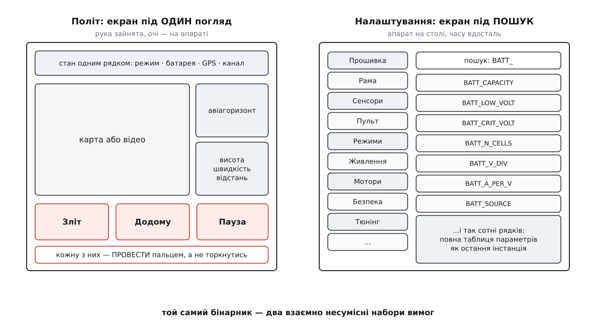
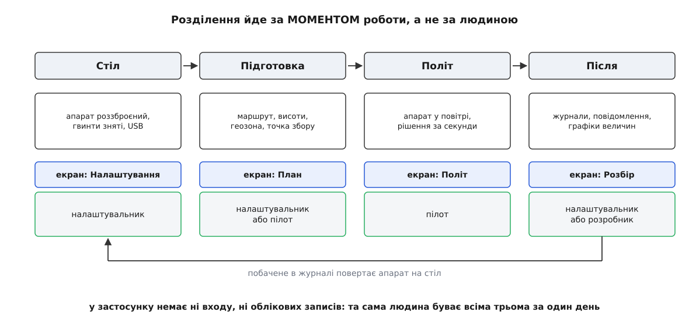
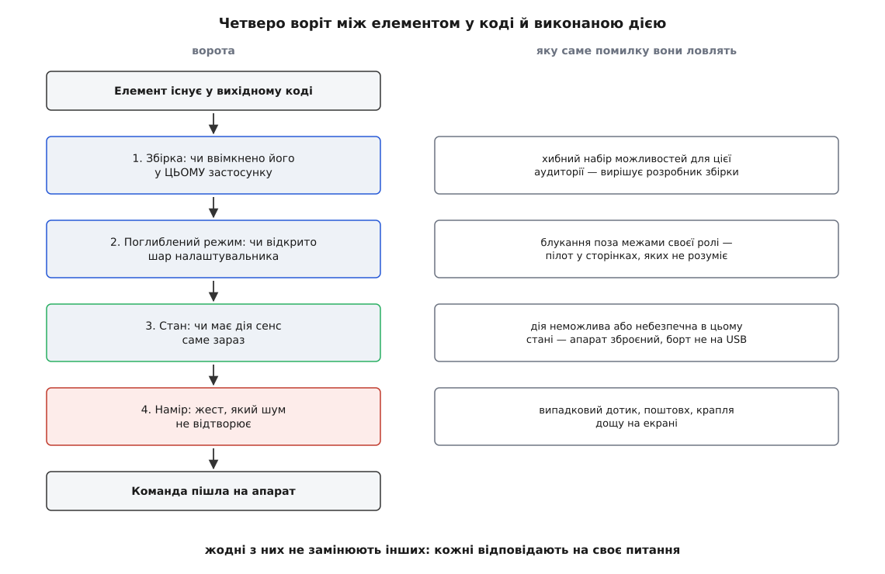

# Три користувачі станції: пілот, налаштувальник, розробник

<preknowlist>
- [Політний контролер](topic:sys-dron/flight-controller) — на борту є автопілот, який стабілізує апарат сам і виконує команди, а не віддає керування напряму людині.
- [Керування й телеметрія](topic:sys-dron/control-telemetry) — наземна станція стоїть **поза** контуром керування й спілкується з бортом рідкими повідомленнями по вузькому радіоканалу.
- [Параметри й GCS](topic:sys-dron/params-gcs) — поведінка автопілота задана сотнями іменованих числових параметрів, які станція читає з борту й записує назад.
- [Arming-перевірки](topic:sys-dron/arming-checks) — зброєння як межа між станом, коли мотори не крутнуться, і станом, коли крутнуться будь-якої миті.
</preknowlist>

Той самий виконуваний файл відкриває людина, що стоїть у полі. Апарат за двісті метрів, вітер підсилився, і на рішення в неї секунди три. Той самий файл відкриває людина за столом: апарат роззброєний, гвинти лежать поруч, у роз'ємі кабель USB, і вона третю годину з'ясовує, чому компас бреше на десять градусів. Перша хоче, щоб на екрані не було майже нічого. Друга хоче, щоб на екрані було все.

Ці дві вимоги не просто різні — вони протилежні за знаком. Кожен елемент, доданий заради другої людини, забирає місце й увагу в першої. Кожен елемент, прибраний заради першої, стає для другої стіною, крізь яку не пройти. Тому «зробити зручно» тут не означає нічого, поки не сказано — **кому і коли**.

Спокуса усереднити закінчується погано для обох. Пілотові дістається панель, де кнопка повернення додому стоїть поряд із полем коефіцієнта демпфування тангажу, і кожна дія коштує пошуку очима — саме тоді, коли очей нема чим платити. Налаштувальникові дістається дбайливо спрощений інтерфейс, який ховає від нього рівно те, по що він прийшов; він відкриває іншу програму й більше не вертається.

QGroundControl не усереднює. Він розводить ці вимоги — і майже кожне дивне на перший погляд рішення в його інтерфейсі стає прозорим, щойно спитати «для кого це і в який момент». Людей тут троє: двоє працюють із готовим застосунком у різні миті життя апарата, а третій — розробник — єдиний, хто взагалі вирішує, що перші двоє побачать.

Варто одразу відокремити цю площину від сусідньої. Наземна станція виконує кілька різних **робіт** — [налаштовує, планує, стежить, аналізує й командує](topic:sys-dron/params-gcs). Тут той самий застосунок розтинається інакше: не за роботами, а за **людьми**, які їх виконують. Одна робота може дістатися різним людям, а одна людина за день побуває всіма трьома — і саме тому розділення в застосунку виглядає так, як виглядає.

### Пілот: увага не на екрані

Головна властивість пілота не в тому, що він менше знає. Вона в тому, що **його увага в цю мить не належить застосунку**. Він дивиться на апарат у небі або на відео з борту; планшет він тримає однією рукою, часто на сонці, часто в рукавичках, часто на вітрі. Екран для нього — не робоче місце, а прилад, який треба зчитати боковим зором і не помилитися пальцем.

З цього єдиного факту випливає весь політний екран, і випливає жорстко.

Спершу — **стан має читатися одним поглядом, без пошуку**. Пілот не має часу згадувати, де живе рівень заряду. Тому положення апарата, висота, швидкість, відстань, режим польоту, якість супутникового розв'язку, стан радіоканалу й батареї сидять на постійних місцях і не переїжджають; частина з них згорнута в один рядок індикаторів згори. Питання, на яке відповідає цей екран, одне: **чи все гаразд і чи можна далі**. Не «яке значення параметра», а «чи все гаразд».

Далі — **дій мало, вони великі й завжди на тому самому місці**. Політна панель дає невеликий набір: зліт, посадка, повернення на точку старту, пауза (мультикоптер зависає, літак починає кружляти), продовження місії, «летіти сюди» й «кружляти тут» по кліку на карті, а ще аварійна зупинка моторів. Це не збіднений список — це **повний** список того, що людині взагалі має сенс наказувати апарату, який летить сам. Решта, тобто як саме він летить, вирішена задовго до зльоту.

І нарешті — **незворотні команди сховані за навмисним жестом**. У QGroundControl дія підтверджується не натиском, а рухом: смужку підтвердження треба **провести** пальцем. Різниця тут не косметична. Натиск — це одиночна подія, яку легко відтворює шум: планшет тернувся об куртку, крапля дощу впала на ємнісний екран, рука сіпнулась від пориву вітру. Проведення — це тривалий спрямований рух із початком, серединою й кінцем; шум таких не робить. Жест не перевіряє, чи **можна** так робити, і не перевіряє, чи ти розумієш наслідки. Він перевіряє одне-єдине: **чи ти справді цього хотів**.

> 🔧 **Навіщо це.** Фільтр наміру працює скрізь, де дія незворотна, а середовище шумне: «повернутись додому» посеред маршруту, зупинка моторів у повітрі, стирання журналів на борту. Проєктуючи власну панель, розділяй два різні захисти — від **незнання** (сховати те, чого людина не має чіпати) і від **випадковості** (лишити на видноті, але вимагати наміру). Плутанина тут дає інтерфейс, який і дратує, і не рятує: жест на кожному кроці навчає проводити пальцем не думаючи, а сховані аварійні дії не знайдуться тоді, коли будуть потрібні.

Ще одне: пілот майже не бачить самого MAVLink і не має бачити. Втрата зв'язку зі станцією для нього — не рядок у журналі, а поведінка апарата, яку задав автопілот наперед: [реакція на зникнення наземної станції](topic:sys-dron/gcs-failsafe) закладена в борт, а не в застосунок. Це прямий наслідок того, що станція стоїть поза контуром керування: вона може попросити — виконує й рятує борт.

### Налаштувальник: усе на столі, гвинти зняті

Другу людину теж визначає не рівень знань, а обставини. Апарат перед нею, він роззброєний, гвинти зняті, живлення від USB, і **час на її боці**. Вона може прочитати, порівняти, змінити, повернути назад і прочитати ще раз. Її бюджет — не час, а **доступ**: якщо потрібного не видно, робота стає неможливою.

Звідси інший екран — довгий перелік сторінок налаштування: прошивка, рама, сенсори, пульт, режими польоту, живлення, мотори, безпека, тюнінг. Перелік не однаковий для всіх апаратів: набір сторінок залежить від того, яка на борту прошивка, бо кожна сторінка — це не самостійна форма, а **вигляд на власну модель автопілота**, зібрану з його ж параметрів і метаданих. Як застосунок дізнається про цю модель і що робить із нею далі — окрема тема про [менеджер параметрів](topic:sys-dron/parameter-manager) і про те, як [значення з борту перетворюється на факт із метаданими](topic:sys-dron/fact-system).

Тут проступає перша неочевидна річ. Скільки б дружніх сторінок не було, кожна з них — **проєкція на підмножину** параметрів, вибрану кимось наперед. А параметрів у типовій прошивці від кількох сотень до понад тисячі, і точна кількість залежить від версії та ввімкнених функцій. Тому поруч зі сторінками неминуче стоїть сира таблиця параметрів із пошуком, збереженням у файл і завантаженням із файлу. Це **остання інстанція**: коли потрібного нема на жодній сторінці, залишається ім'я параметра й його значення. Прибрати таблицю означає замкнути людину в чужому уявленні про те, що їй може знадобитися.

Друга неочевидна річ: у налаштувальника свої небезпеки, і вони не схожі на пілотові. Він працює з апаратом, до якого дотягується рукою, і найдорожча помилка тут не «не встиг натиснути», а «зробив дію, для якої світ не готовий». Тому сторінки налаштування захищені **передумовами**, а не швидкістю.

Найяскравіша — сторінка моторів. Перш ніж повзунки почнуть крутити мотори, треба поставити позначку **«Propellers are removed — Enable slider and motors»**: гвинти зняті. Позначку ніхто не перевіряє фізично, і в цьому вся суть — вона не про технічну можливість, а про свідоме твердження людини про стан світу. Це той самий фільтр наміру, що й проведення пальцем у польоті, тільки небезпека інша: не випадковий дотик, а закручений гвинт за півметра від обличчя.

Друга така передумова — прошивання. Щоб залити нову прошивку, застосунок вимагає **відключити всі з'єднання з апаратом** (і USB, і радіо), зняти живлення від батареї й лише тоді під'єднати борт напряму до порту USB, без розгалужувача. Вимога виглядає прискіпливою, поки не згадати, що прошивальник спілкується з завантажувачем плати, а не з автопілотом: йому потрібен монопольний, короткий і стабільний канал у той момент, коли [флеш-пам'ять борту](topic:sys-ide/flashing) стирається. Жодного стосунку до польотного екрана ця умова не має — і на політному екрані її й нема.

Третє, що потрібне налаштувальникові й не потрібне пілотові, — **зворотний зв'язок після польоту**. Інструменти розбору дають перегляд журналів польоту, викачування журналів із борту, прив'язку знімків до координат за журналом, консоль до борту та інспектор MAVLink, який показує самі повідомлення й будує графіки їхніх полів. Частина цих інструментів вимагає під'єднаного апарата, частина працює з файлом на диску — і це вже маленька підказка про те, що доступність елемента залежить не лише від людини. Про те, звідки беруться самі файли й чим телеметрійний журнал відрізняється від бортового, є [окрема тема](topic:sys-dron/telemetry-logging).

Складене докупи, це дає цикл: змінив — злітав — подивився журнал — змінив ще раз. Пілот у своєму моменті циклу не має; у нього одна спроба й секунди на неї.


*Два екрани того самого застосунку розв'язують взаємно несумісні задачі: лівий має зчитуватися одним поглядом і мати мало великих цілей, правий — давати пошук по сотнях імен. Спроба звести їх в один екран псує обидва.*

### Розділення йде за моментом, а не за людиною

Тепер видно, чому вимоги примирити не вдасться в межах одного екрана — і чому їх узагалі вдається примирити. Пілот і налаштувальник **не працюють одночасно**. Вони живуть у різних точках життя апарата: стіл, підготовка маршруту, політ, розбір. Застосунок розділяє не людей, а **моменти** — і саме тому розділення в ньому втілене видами (політ, план, налаштування, розбір), між якими перемикаються, а не обліковими записами, між якими входять.


*Кожен вид застосунку відповідає своєму моменту роботи. Розбір польоту замикає коло й повертає апарат на стіл, а та сама людина за один день може побувати в усіх чотирьох моментах.*

Із цього випливає наслідок, який варто сказати прямо, бо його часто чекають іншим. **У QGroundControl немає ні входу, ні облікових записів, ні прав доступу.** Ніхто не «пілот» у сенсі облікового запису. Хто відкрив застосунок, той бачить усе, що ця збірка взагалі вміє показувати. Розділення на ролі захищає від **помилки**, а не від **людини**: воно робить так, щоб у політний момент під пальцем не опинилось те, чому там не місце, — але не заважає тому, хто свідомо йде в налаштування.

Це не недогляд, а прямий наслідок того, як станцією користуються. Аматор — усі три ролі в одній особі. У бригаді ролі розведені по людях, але апарат і планшет однаково переходять із рук у руки, а «власника» в застосунку не існує. Якщо ролі треба розвести по-справжньому, з відповідальністю й забороною, це робиться поза застосунком: організаційно або **окремою збіркою**, зробленою під конкретну аудиторію. Чим ця межа й цікава — саме тут на сцену виходить третій.

### Розробник: єдиний, хто змінює те, що бачать двоє інших

Розробник з'являється у двох подобах, і плутати їх не варто. Один вносить зміни в спільний проєкт, і його правка колись доїде до всіх; другий будує **власну станцію** з того самого коду — під свій апарат, під своїх операторів, під свій бренд. Спільне в них одне, і воно вирішальне: **тільки розробник визначає, які елементи взагалі існують** на екранах перших двох. Пілот і налаштувальник вибирають серед показаного; розробник вирішує, що потрапляє в показане.

Механізм цього вибору зібраний в одному місці — у ядровому розширенні застосунку. Це клас, який застосунок питає щоразу, коли треба знати, що дозволено; підмінивши його своєю похідною, вендор перевизначає рівно ті відповіді, які його цікавлять, і не чіпає решти. Влаштування самої точки розширення — [окрема тема](topic:sys-dron/core-plugin); тут важлива лише її роль у розділенні користувачів.

Найпростіша частина цього механізму — набір перемикачів можливостей, які застосунок читає як звичайні властивості. Кожен із них — віртуальний метод із розумним значенням за замовчуванням, тож власна збірка переписує тільки потрібне:

```cpp
// Власна збірка під готовий апарат: оператор не прошиває борт,
// не калібрує акселерометр і будує лише прості маршрути з точок.
class CustomOptions : public QGCOptions
{
public:
    explicit CustomOptions(QObject *parent = nullptr) : QGCOptions(parent) {}

    bool showFirmwareUpgrade()        const override { return false; }
    bool showSensorCalibrationAccel() const override { return false; }
    bool missionWaypointsOnly()       const override { return true;  }
};
```

Три рядки — і зі станції зникають сторінка прошивання, калібрування акселерометра й усі складні елементи місії, крім маршрутних точок. Таких перемикачів кілька десятків: від показу окремих калібрувань і вивантаження журналів до того, чи буде на політній панелі кнопка аварійної зупинки та чи вмикається робота з кількома апаратами. Поруч живуть і тонші важелі — приховати цілу групу налаштувань або підправити метадані окремого параметра, перш ніж він стане видимим фактом. Повний перелік того, що вендор може ввімкнути чи вимкнути, зібрано в [окремій довідці по цих перемикачах](topic:sys-dron/user-roles/api-visibility-knobs.md): там і сигнатури, і значення за замовчуванням, і те, який елемент інтерфейсу відповідає кожному з них.

> 🔧 **Навіщо це.** Такий вимикач — не косметика, а **звуження зобов'язань**. Прибираючи сторінку прошивання зі станції для готового апарата, вендор не «спрощує інтерфейс», а знімає з себе цілий клас звернень у підтримку й цілий клас способів зіпсувати апарат. Ціна теж реальна: те, що приховано, доведеться робити іншим інструментом, і цей шлях треба передбачити наперед.

Другий важіль — **прапорець поглибленого режиму**: одна булева властивість ядрового розширення, на яку дивиться інтерфейс, вирішуючи, показувати «експертний» шар чи ні. Тут ховається факт, який перевертає звичне уявлення. **У звичайному, апстримному QGroundControl цей прапорець від початку ввімкнений.** Стандартна станція завжди працює в поглибленому режимі — тобто розділення пілота й налаштувальника в ній існує тільки як розділення екранів, і нічого від нікого не приховано.

Приховування вмикає **власна збірка**. Вона стартує в звичайному режимі, а поглиблений відмикається жестом: п'ять швидких натисків поспіль на кнопку політного виду. Після цього з'являється попередження, текст якого теж належить ядровому розширенню; типове звучить так: *«УВАГА: ви збираєтесь увійти в поглиблений режим. Неправильне використання може призвести до несправності апарата й скасувати гарантію. Робіть це, лише якщо так сказала підтримка»*.

Дивна на вигляд комбінація — п'ять натисків замість пароля — стає очевидною, щойно назвати справжню загрозу. Оператор готового апарата не зловмисник; він людина, яка може ненароком забрести на сторінку, де одним рухом псується налаштований на заводі борт. Захист має бути **важким для випадкового влучання й легким для проходу за вказівкою підтримки по телефону**. Пароль тут гірший з обох боків: його треба десь зберігати, він витікає в перший же форум, і він нічого не додає проти єдиної реальної загрози — випадковості. П'ять натисків плюс попередження закривають рівно те, що треба закрити.

Розробник вирішує за перших двох ще дві речі, які на екрані не видно. По-перше, **яку саме збірку** вони запустять — стабільну чи щоденну, з усіма наслідками щодо свіжості й ризику; це окрема [модель релізів](topic:sys-dron/release-model). По-друге, **чий саме застосунок** — апстримний чи вендорський форк, який може відставати від нього на роки; про це є [тема про проєкт і форки](topic:sys-dron/project-and-forks). І сам вибір між різними наземними станціями — теж рішення цього рівня, [зроблене за пілота задовго до польоту](root:embedded/mission-planner-qgc).

Нарешті, у розробника є й **власна потреба бачити**, і вона не збігається з потребою налаштувальника. Інспектор MAVLink і консоль для налаштувальника — інструменти діагностики апарата; для розробника це вікно в **сам застосунок**: що станція насправді надіслала, у якому порядку, з якими ідентифікаторами. Питання різні, інструмент один — і тому він однаково доступний обом.

Коли всі три ролі треба звести докупи в живому коді — від перемикача збірки до жесту підтвердження, — це вже практична задача: [приклад із кодом, що додає елемент, видимий лише в поглибленому режимі й лише на роззброєному апараті](topic:sys-dron/user-roles/proj-role-gated-control.md), розбирає її крок за кроком разом із типовими пастками.

### Четверо воріт між кодом і пальцем

Тепер усі згадані обмеження можна поставити в один ряд — і виявиться, що вони не дублюють одне одного. Між елементом, який існує у вихідному коді, і виконаною дією стоять **четверо різних воріт**, і кожні відповідають на своє питання.

Перші — **збірка**: чи ввімкнено цю можливість у цьому застосунку взагалі. Питання тут не про людину за екраном, а про аудиторію: чи передбачено таку можливість для тих, кому цю станцію дали. Відповідь дає розробник збірки, і змінити її з інтерфейсу неможливо в принципі.

Другі — **поглиблений режим**: чи відкрито експертний шар. Питання — чи людина зараз у ролі налаштувальника. Ворота ловлять блукання поза межами своєї ролі: оператор, який відкрив сторінку, змісту якої не розуміє.

Треті — **стан**: чи має дія сенс саме зараз. Апарат зброєний — калібрування недоречне. Апарат не під'єднаний — викачувати з нього журнали нема звідки. Параметра нема в цій прошивці — редагувати нічого. Ці ворота не знають нічого про людину, зате знають усе про світ.

Четверті — **намір**: жест, який шум не відтворює. Провести смужку підтвердження, підтвердити зняті гвинти. Ці ворота нічого не знають ні про людину, ні про світ, зате ловлять те, чого не спіймають жодні інші, — випадковий дотик.


*Четверо воріт фільтрують чотири різні класи помилок і тому не заміняють одні одних: прибравши будь-які, ти лишаєш відкритим цілий клас способів зашкодити апарату.*

Практична користь із цього проста. Коли якийсь елемент QGroundControl виглядає незручним, надміру захищеним або чомусь відсутнім, безплідно питати «чому вони зробили так погано». Плідне питання складається з двох частин: **для кого це і в який момент**. А коли ти сам будуєш станцію під свій апарат, ті самі чотири рівні — набір можливостей, поглиблений шар, залежність від стану, жест наміру — стають готовим словником рішень: для кожного елемента треба свідомо сказати, за якими воротами він стоїть і чому саме за цими.
