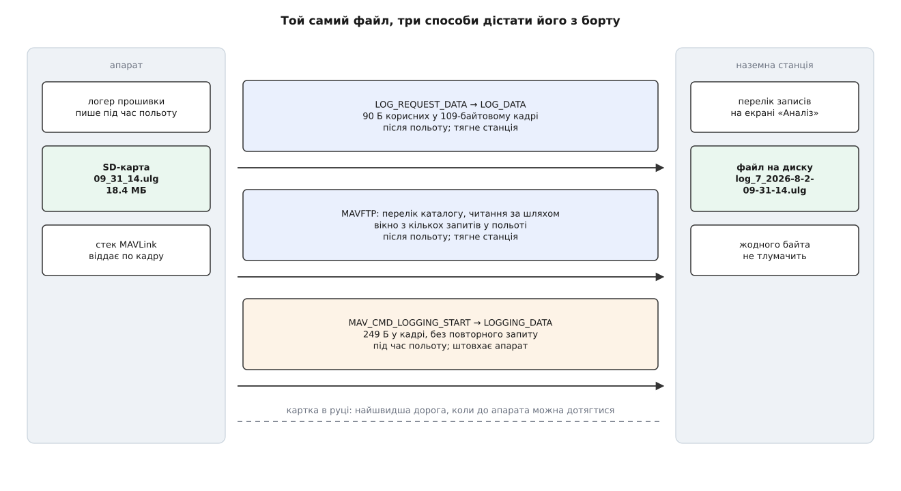
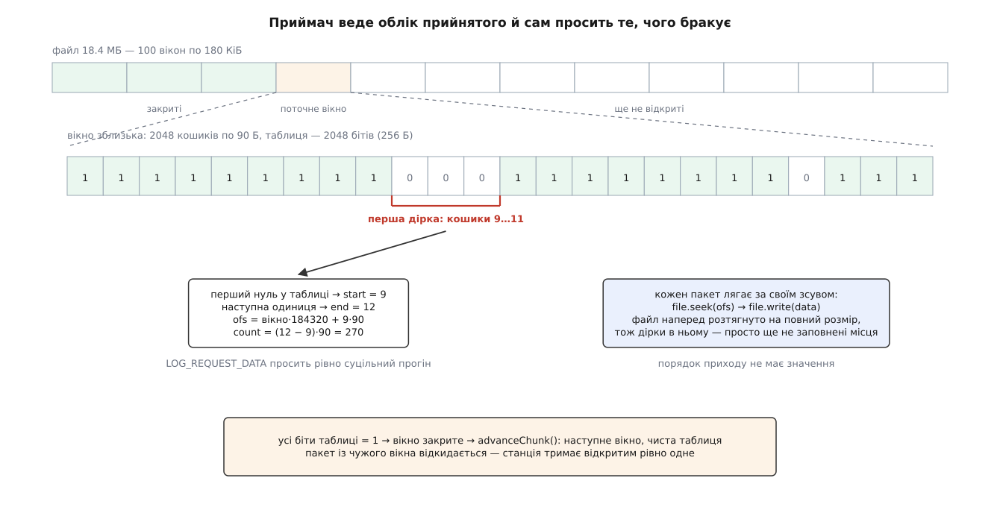
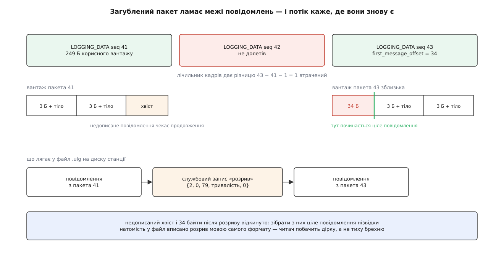

# Бортові логи апарата: завантаження й потокове передавання

<preknowlist>
- [Пакет MAVLink](root:sys-dron/mavlink-packet) — будова кадру: стартовий байт, довжина, ідентифікатори, навантаження, контрольна сума; скільки в кадрі службових байтів понад корисні.
- [Команди MAVLink](root:sys-dron/mavlink-commands) — команда як окреме повідомлення з підтвердженням, коди результату (прийнято, відмовлено, не підтримується).
- [Обробка MAVLink](root:sys-dron/mavlink-handling) — де саме потік байтів із каналу перетворюється на цілі кадри й що застосунок робить із кожним.
- [Vehicle: модель апарата](root:sys-dron/vehicle-object) — об'єкт, який тримає стан апарата й роздає сигнали про прийняті повідомлення.
- [Менеджер каналів](root:sys-dron/link-manager) — що таке канал зв'язку в застосунку, який із них первинний і як станція вирішує, що зв'язок утрачено.
- [Надійний обмін](root:com-transport/reliable-link) — підтвердження, повтори, і чому обмін «один запит — одна відповідь» упирається не в ширину каналу, а в затримку.
</preknowlist>

Наземна станція знає про апарат рівно те, що апарат встиг їй розповісти. Радіоканал на 57600 бод несе кілька десятків повідомлень за секунду; позу апарата в такому каналі оновлюють приблизно десять разів за секунду. Контур керування на борту тим часом працює в сотні разів за секунду, гіроскоп опитують ще частіше, а оцінювач стану всередині перебирає десятки величин, які назовні не виходять узагалі — бо для них немає повідомлення в протоколі, а якби й було, канал би їх не витягнув.

Тому питання «чому апарат хитнувся й перекинувся» майже ніколи не має відповіді в записі станції. [Запис телеметрії](root:sys-dron/telemetry-logging) — це кадри, що пробилися крізь радіо, з тією частотою й тим набором полів, які радіо дозволило. У ньому видно, що апарат перекинувся; у ньому не видно, яку команду отримав кожен мотор за 40 мілісекунд до того.

А апарат це знає. Прошивка пише власний журнал на SD-карту з тією частотою, з якою працює сама, і кладе туди свої внутрішні величини — уставки регуляторів, окремі екземпляри датчиків, нутрощі оцінювача. Запис уже існує; він лежить на карті. Уся підсистема, про яку тут ідеться, розв'язує рівно одну задачу: **перенести цей файл із карти на диск станції**, маючи для цього той самий вузький канал, яким летить телеметрія.

> 🔧 **Навіщо це.** Практичне правило розслідування таке: за логом станції встановлюють, **що станція надіслала й що побачила**, а за бортовим логом — **що апарат зробив і чому**. Розбіжність між ними — окремий діагноз: команда є в лозі станції, але її немає в бортовому — вона не долетіла.

## Дві протилежні дороги

Файл на карті й станція на землі. Між ними — канал. Способів перекинути байти каналом рівно два, і вони протилежні за тим, **хто починає** й **коли**.

Перший: дочекатися кінця польоту й **витягнути готовий файл**. Станція питає, які записи є, вибирає потрібний і тягне його шматками. Апарат при цьому мовчить, поки його не спитають.

Другий: увімкнути передавання **під час польоту** й приймати лог у міру того, як він пишеться. Апарат сам штовхає порції в канал, ніхто нічого не просить.

Кожна дорога куплена ціною, якої немає в іншої. Витягування після польоту вимагає, щоб апарат був живий, доступний і мав час стояти на землі з увімкненим живленням; зате воно бере файл повністю й точно. Потокове передавання не вимагає нічого після польоту — лог уже на землі, навіть якщо апарат розбився й згорів разом із карткою; зате воно їсть той самий канал, яким летить телеметрія, а кожна загублена порція зникає назавжди.

І є третя дорога, найшвидша з усіх: вийняти карту й вставити її в комп'ютер. Протоколи існують не тому, що вони кращі, а тому, що до карти часто не дотягнутися — корпус загерметизований, апарат за кілометр, лог потрібен зараз.



*Дві дороги тягне станція після польоту, третю штовхає апарат у польоті; на всіх трьох станція переносить байти, не тлумачачи їх.*

Два сімейства повідомлень, якими це робиться, живуть у протоколі окремо й геть по-різному влаштовані: `LOG_*` — це запит-відповідь про шматок файлу, `LOGGING_*` — беззапитний потік. Точні поля обох сімейств, разом із командами вмикання й підводними каменями кожного поля, зібрано в [довіднику повідомлень логу](root:sys-dron/vehicle-logs/api-log-protocol.md): там і розкладка `LOG_ENTRY`, і чому `count` у відповіді на дані може бути нулем, і що означає «розмір приблизний».

Сімейство `LOG_*` помітно старше за формати, які воно сьогодні переносить, і його дев'яностобайтова порція — слід тієї доби, коли лог писали на мікросхему флеш-пам'яті поруч із процесором, а не на карту. [Історія цих повідомлень](root:sys-dron/vehicle-logs/hist-log-protocol-origins.md) пояснює, звідки взялися і розмір порції, і нумерація записів із одиниці, і чому пізніше довелося добудовувати два інші транспорти замість того, щоб полагодити цей.

## Спершу перелік

Щоб щось витягнути, треба знати, що там є. Станція надсилає `LOG_REQUEST_LIST` із діапазоном номерів — від нуля до `0xffff`, тобто «усі» — і апарат відповідає **потоком** повідомлень `LOG_ENTRY`, по одному на запис. У кожному: номер запису, загальна кількість записів, час у секундах від початку епохи Unix і розмір у байтах.

Тут одразу видно перший опір матеріалу. Відповідей багато, вони летять пачкою, і **жодна з них не підтверджується**. Протокол не має ні нумерації відповідей у межах пачки, ні ознаки «остання». Загубився один `LOG_ENTRY` посеред пачки — станція про це не дізнається з самого потоку.

Розв'язок у застосунку прямий і вартий того, щоб його роздивитися, бо той самий прийом повториться далі ще двічі. З **першої** відповіді станція дізнається `num_logs` — скільки записів усього. І одразу створює в моделі рівно стільки порожніх рядків, кожен із прапорцем «прийнято» в нулі:

```cpp
if ((_logEntriesModel->count() == 0) && (num_logs > 0)) {
    if (_vehicle->firmwareType() == MAV_AUTOPILOT_ARDUPILOTMEGA) {
        _apmOffset = 1;   // у ArduPilot номери починаються з одиниці
    }
    for (int i = 0; i < num_logs; i++) {
        _logEntriesModel->append(new QGCOnboardLogEntry(i));
    }
}
```

Далі кожна прийнята відповідь заповнює свій рядок і ставить прапорець. Приймач більше не чекає повідомлення «кінець» — він **дивиться на власну таблицю**: усі прапорці підняті — перелік повний. А якщо ні — він бачить, яких саме рядків бракує, і просить повторно рівно їх, звузивши діапазон у новому `LOG_REQUEST_LIST` до першої знайденої дірки.

Ключовий зсув думки тут такий: **облік веде той, хто приймає**. Відправник нічого не гарантує й нічого не пам'ятає між запитами. Приймач тримає карту прийнятого й з неї виводить, чого бракує. Це єдиний спосіб побудувати надійне передавання поверх протоколу, у якому немає підтверджень, — і саме тому далі, на самих даних, усе буде влаштовано так само, лише детальніше.

Два таймери задають темп очікування, і різниця між ними теж не випадкова:

```
на першу відповідь після LOG_REQUEST_LIST   5000 мс
між сусідніми LOG_ENTRY у пачці              500 мс
```

П'ять секунд на першу — бо апаратові треба відкрити каталог на карті, а карта буває повільна й записів на ній буває багато. Пів секунди між сусідніми — бо пачка вже летить, і затримка всередині неї означає втрату, а не роздуми. Після трьох повторних запитів поспіль, які не принесли жодного нового рядка, станція здається: непрочитані рядки дістають позначку помилки, а перелік лишається неповним. Здатися тут можна — перелік не файл, його неповнота видима й нешкідлива.

Дрібниця з `_apmOffset` у коді вище — не косметика, а поступка різнобою. ArduPilot нумерує записи з одиниці, PX4 — з нуля, і сама специфікація протоколу чесно попереджає, що станція мусить розуміти обидва варіанти. Застосунок віднімає зсув на прийомі й додає його назад у кожному запиті, тримаючи всередині себе єдину нумерацію з нуля. Цікаво, що тип прошивки тут питають безпосередньо, а не через [плагін прошивки](root:sys-dron/firmware-plugin), який саме для таких розбіжностей і призначений: підсистема логів старша за плагін і досі живе поруч із ним.

## Дев'яносто байтів і арифметика, з якої все випливає

Тепер файл. Станція надсилає `LOG_REQUEST_DATA` — номер запису, зсув, кількість байтів — і апарат відповідає повідомленнями `LOG_DATA`, у кожному з яких **рівно 90 байтів** корисного вантажу плюс номер запису й зсув, щоб приймач знав, куди їх покласти.

Дев'яносто байтів — це мало, і саме звідси росте вся конструкція. Порахуймо, скільки коштує один такий пакет.

**Умова: телеметрійний радіомодем, послідовний порт 57600 бод, 8N1; запис на 18.4 МБ; канал зайнятий тільки логом.**

```
навантаження LOG_DATA  = 2 Б (номер) + 4 Б (зсув) + 1 Б (лічильник) + 90 Б = 97 Б
службові байти кадру v2 = 12 Б
кадр у каналі           = 109 Б  →  корисних 90/109 = 82.6 %

57600 бод, 10 бітів на байт = 5760 Б/с
кадрів за секунду       = 5760 / 109 = 52.8
корисний потік          = 52.8 × 90  = 4756 Б/с ≈ 4.6 КіБ/с
час на 18.4 МБ          = 18 400 000 / 4756 = 3869 с ≈ 64 хв
```

Година на один запис — і це ще оптимістична оцінка, у якій телеметрії немає взагалі. Але цифра стає по-справжньому повчальною, якщо порівняти її з тим, що вийшло б за наївної схеми «попросив — дочекався — попросив наступне».

**Умова: та сама ланка, повний оберт «запит-відповідь» займає 120 мс.**

```
за один оберт приходить  90 Б
потік                    = 90 / 0.120 = 750 Б/с
час на 18.4 МБ           = 18 400 000 / 750 = 24 533 с ≈ 6.8 год
```

Різниця в 6.3 раза — і не через канал: канал в обох випадках той самий. Просто в другому випадку **швидкість визначає затримка, а не ширина каналу** — більшу частину часу лінія стоїть порожня, поки летить запит і повертається відповідь. Отже, запит мусить покривати відразу великий шмат, а апарат — відповідати чергою пакетів без пауз. Поле `count` у запиті недарма чотирибайтове: просити можна сотнями кілобайтів.

Це й розв'язує питання, звідки береться решта механізму. Щойно ми послали один запит на сотні пакетів, ми втратили відповідність «один запит — одна відповідь»: тепер приходить черга, з якої частина може загубитися, а приймачеві треба самому зрозуміти, чого бракує, і попросити повторно — не весь шмат, бо це знову година, а рівно дірки.

## Вікно, кошики й пошук дірок

Станція ділить файл на **вікна** сталого розміру й тримає відкритим завжди рівно одне.

```
кошик       = 90 Б  (стільки, скільки несе один LOG_DATA)
кошиків у вікні = 2048
вікно       = 2048 × 90 = 184 320 Б = 180 КіБ
файл 18.4 МБ    = 18 400 000 / 184 320 = 100 вікон
таблиця вікна   = 2048 бітів = 256 Б
```

Кожен біт таблиці означає «кошик із таким номером усередині цього вікна прийнято». Прийшов пакет — станція рахує, до якого вікна й до якого кошика він належить, і піднімає біт:

```cpp
if ((ofs % MAVLINK_MSG_LOG_DATA_FIELD_DATA_LEN) != 0) {
    return;                       // зсув не кратний 90 — пакет не з нашої розкладки
}
const uint32_t chunk = ofs / OnboardLogDownloadData::kChunkSize;
if (chunk != _downloadData->current_chunk) {
    return;                       // пакет із чужого вікна
}
const uint16_t bin = (ofs - (chunk * OnboardLogDownloadData::kChunkSize))
                     / MAVLINK_MSG_LOG_DATA_FIELD_DATA_LEN;
_downloadData->chunk_table.setBit(bin);
```

Дві перевірки перед підняттям біта — це два різні захисти. Перша ловить пакет, зсув якого не лягає в сітку по 90 байтів: у таблиці для нього немає кошика, і мовчки покласти його кудись означало б зіпсувати файл. Друга відкидає пакети чужого вікна — здебільшого це запізнілі відповіді на вже закритий запит.

Чому взагалі вікна, а не одна таблиця на весь файл? Пам'ять тут ні до чого: на весь файл знадобилося б 204 445 бітів, тобто 25 кілобайтів — ніщо. Причина в **дисципліні порядку**. Вікно — це відрізок, у межах якого станція готова приймати пакети в будь-якій послідовності й доганяти пропущене; поза цим відрізком вона нічого не приймає. Вікно закривається, лише коли **всі** його біти підняті, — і аж тоді відкривається наступне, з чистою таблицею. Так робота посувається монотонно, а логіка повторів дивиться назад рівно на 180 кілобайтів, а не на весь файл. Розмір вікна — саме та ручка, якою регулюють швидкість: у коді біля числа 2048 стоїть примітка, що його зробили вчетверо більшим за попереднє заради пропускної здатності.

Пакети лягають у файл **не по порядку** — кожен за своїм зсувом. Тому файл наперед розтягують на повний оголошений розмір і потім пишуть у нього довільними місцями:

```cpp
_downloadData->file.resize(entry->size());   // до першого пакета
...
_downloadData->file.seek(ofs);               // на кожен пакет
_downloadData->file.write(data, count);
```



*Приймач тримає карту прийнятого й із неї виводить, чого бракує: перший нуль дає початок, наступна одиниця — кінець, і між ними народжується запит.*

Коли ж просити повторно? Сигналом слугує **мовчання**. Кожен успішно записаний пакет перезапускає таймер на пів секунди; таймер вистрелив — черга обірвалася, і станція шукає в таблиці першу дірку:

```cpp
for (; start < size; start++) {                       // перший нуль
    if (!_downloadData->chunk_table.testBit(start)) break;
}
for (end = start; end < size; end++) {                // наступна одиниця
    if (_downloadData->chunk_table.testBit(end)) break;
}
const uint32_t pos = (_downloadData->current_chunk * kChunkSize) + (start * 90);
const uint32_t len = (end - start) * 90;
_requestLogData(_downloadData->ID, pos, len, _retries);
```

Просять **суцільний прогін**, а не окремі кошики: у протоколі немає способу перелічити розрізнені зсуви в одному запиті, а слати по запиту на кошик — це знову затримка замість ширини каналу.

Є в цьому місці дрібна, але показова оптимізація. Коли черга вже майже добита й станція збирає уламки, пакетів приходить мало, і чекати щоразу пів секунди означало б розтягнути кінець завантаження надовго. Тому в обробнику є ще одна умова: якщо щойно прийнятий кошик стоїть **безпосередньо перед уже прийнятим**, дірку закрито до кінця — і наступний запит іде негайно, не чекаючи таймера. Дешевий спосіб відрізнити «пауза в черзі» від «кінець дірки», не заводячи жодного нового поля в протоколі.

Робочий каркас такого завантажувача — з таблицею бітів, пошуком прогону, таймером і записом за зсувом — розібрано окремо в [проєкті завантажувача](root:sys-dron/vehicle-logs/proj-log-downloader.md): там код, який можна зібрати й прогнати на підробленому джерелі з навмисними втратами, і перелік пасток, що чигають саме на цьому місці.

Про повтори варто сказати чесно й до кінця. На переліку записів станція здається після трьох безплідних спроб — на **даних вона не здається ніколи**. Лічильник спроб росте, але його ніхто не перевіряє: поки таймер б'є, запит на ту саму дірку йтиме знову й знову, аж поки користувач не натисне скасування. Це свідомий вибір на користь довгого завантаження по поганому радіо — але він має неприємну пару. Специфікація каже, що розмір у `LOG_ENTRY` **може бути приблизним**, а станція вважає завантаження завершеним лише тоді, коли заповнено всі кошики до оголошеного розміру. Якщо апарат оголосив розмір із запасом, останні кошики не заповняться ніколи, і завантаження зависне за крок до кінця з майже цілим файлом на диску. Загальні міркування про те, як влаштовувати повтори, щоб вони не оберталися вічним циклом, — у темі [про повтори](root:sf-distributed/retries-backoff).

## Сторож зв'язку мусить замовкнути

Поки триває перелік або завантаження, станція вимикає власний нагляд за втратою зв'язку:

```cpp
_vehicle->vehicleLinkManager()->setCommunicationLostEnabled(!active);
```

Причина фізична. Апарат, який качає лог, віддає каналу все, що може; серцебиття й телеметрія в цей час проріджуються або зникають зовсім. Сторож, який рахує тишу від апарата, побачив би цю тишу й оголосив би зв'язок утраченим — із усіма наслідками аж до знесення об'єкта апарата. Тому на час перекачування його вимикають: тиша тут очікувана й означає протилежне до втрати.

Тією ж логікою пояснюється й повідомлення `LOG_REQUEST_END`, яке станція шле, коли користувач скасовує роботу. Специфікація попереджає, що запит переліку на деяких системах **зупиняє бортове журналювання** до окремої команди «кінець». Не сказати цієї команди означає залишити апарат без запису наступного польоту — мовчки й непомітно.

Ще одна межа тієї ж природи: підсистема слідує за **активним** апаратом, і зміна активного апарата зносить усе на півслові — таймер спиняється, недокачаний файл видаляється, модель переліку очищається. Незавершене завантаження не переживає перемикання, і в застосунку [з кількома апаратами](root:sys-dron/multi-vehicle) це помітно одразу.

## Ім'я файлу станція вигадує сама

Протокол `LOG_*` переносить байти. Він не каже ні як файл називається на карті, ні якого він формату, ні навіть коли його записано, якщо апарат не мав часу. Тому ім'я на диску станція складає сама з того, що має:

```
log_<номер>_<yyyy-M-d-hh-mm-ss>.<розширення>
```

Час береться з `LOG_ENTRY` — а він там може бути нулем, бо апарат без прив'язки до супутників не знає дати. Тоді замість дати в імені стоїть слово `UnknownDate`, і сортувати такий запис за часом нема як. Розширення станція **вгадує за типом прошивки**: ArduPilot дає `.bin`, PX4 — `.ulg`, а якщо на PX4 параметр `SYS_LOGGER` дорівнює нулю, тобто працює старий логер, — `.px4log`. Тобто наземна станція визначає формат чужого файлу за непрямими ознаками, бо прямої ознаки в протоколі немає. Що всередині цих файлів і чим самоописовий `ULog` відрізняється від табличного бортового формату ArduPilot — тема [форматів бортових логів](root:sys-dron/flight-log-formats); станції ця різниця потрібна рівно для того, щоб дописати три букви до імені.

Якщо файл із таким іменем уже є, до основи додається номер дубліката. І це важливіше, ніж здається: два записи, зроблені без прив'язки до супутників, назвуться однаково, і без цього лічильника другий затер би перший.

## MAVFTP: те саме, але з іменами

Коли апарат оголошує в своїх можливостях підтримку файлового протоколу, станція навіть не починає з `LOG_*`. Замість цього вона **перелічує каталог**: питає вміст `@MAV_LOG` — умовного імені, яке прошивка сама відображає на справжній шлях, — а якщо такої підтримки в прошивці ще немає, пробує фізичні шляхи, кожен свій: `/fs/microsd/log` у PX4, `/APM/LOGS` у ArduPilot. Із відповіді беруться імена, розміри й, коли прошивка їх дає, час зміни; усе, що не закінчується на `.ulg` чи `.bin`, відкидається.

Виграш тут не в швидкості як такій, а в тому, що зникає ціла низка здогадок. Файл має **справжнє ім'я** з борту, а не вигадане станцією. Дата береться з файлової системи, а не з поля, яке буває нулем. І з'являється те, чого в старому сімействі немає в принципі: **вибіркове стирання**. Повідомлення `LOG_ERASE` стирає всі записи гуртом — іншого воно не вміє; видалити один файл можна лише через файловий протокол. Той самий транспорт станція використовує й для [метаданих компонента](root:sys-dron/component-information) — це загальний механізм читання файлів із борту, а не щось придумане для логів; його влаштування описано в темі [MAVFTP](root:sys-dron/mavlink-ftp).

Поведінка при відмові показова. Не вдалося перелічити каталог — станція **не наполягає**: вона позначає файловий транспорт непридатним до кінця сеансу з цим апаратом і мовчки переходить на `LOG_*`, знову з нуля. Так само після помилки завантаження. Новий транспорт пробують першим, старий лишається підлогою, на яку можна впасти, — і це єдиний спосіб додати кращий шлях до протоколу, у якому не можна вимагати від усіх прошивок його підтримувати.

## Потік: лог їде, поки апарат летить

Друга дорога починається з команди. Станція шле `MAV_CMD_LOGGING_START`, і апарат починає **сам** слати повідомлення `LOGGING_DATA` — по 249 байтів вантажу в кожному, без жодного запиту. У застосунку цей шлях доступний лише для апаратів на PX4 і може вмикатися автоматично, коли апарат ставлять на озброєння; тоді ж, при знятті, він і завершується.

Відмова тут теж передбачена й запам'ятовується. Якщо у відповіді на команду приходить «відмовлено», станція більше не пропонує вмикати передавання цьому апаратові й гасить кнопку — бо відмова означає, що прошивка зібрана без цієї можливості, і повторювати спробу немає сенсу.

Вантаж `LOGGING_DATA` — це **шматок байтового потоку**, а не готове повідомлення логу. Бортовий формат складається з повідомлень, кожне з яких починається трибайтовим заголовком: два байти довжини й один байт типу. Апарат ріже цей потік по 249 байтів, не зважаючи на межі повідомлень: у пакет може потрапити хвіст одного, кілька цілих і початок наступного.

Поки не втрачено жодного пакета, це не проблема: приймач склеює вантажі поспіль і ріже їх за довжинами із заголовків. Але щойно пакет губиться, склейка ламається. Приймач більше не знає, де в наступному вантажі починається повідомлення: він дивиться на байти, які могли бути серединою чогось, і читає з них довжину, якої там немає. Байтовий потік без міток **не вміє синхронізуватися сам**.

## Де знову починається ціле

Тому в кожному пакеті їде поле `first_message_offset` — зсув усередині вантажу, з якого починається **перше ціле повідомлення**. Значення 255 означає «у цьому пакеті жодне повідомлення не починається, тут суцільна середина».

Це і є точка відновлення. Виявивши втрату, приймач викидає недозібраний хвіст, відступає в новому вантажі рівно на `first_message_offset` байтів — і з цього місця знову читає заголовки. Утрачені байти не повернути; але місце, де потік знову стає осмисленим, відоме без жодних здогадок.

Утрату приймач помічає за наскрізним лічильником пакетів. Лічильник двобайтовий і перекочується через нуль, тому «новіший» від «переставленого» відрізняють половиною простору номерів:

```cpp
if (seq > static_cast<uint16_t>(_sequence)) {
    if ((seq - _sequence) > kSequenceSize) {   // kSequenceSize = 1 << 15
        return false;                          // це не новий, це переставлений
    }
    num_drops = seq - _sequence - 1;           // скільки пропало між ними
    _sequence = seq;
    return true;
}
```

Різниця номерів більша за пів кола означає, що номер насправді старий, — звичайне порівняння за модулем, без якого кожне перекочування лічильника виглядало б як шістдесят тисяч утрачених пакетів.

Знаючи кількість пропущених пакетів, станція не просто мовчки продовжує писати файл — вона вставляє в нього **службовий запис про розрив**, передбачений самим форматом логу:

```cpp
const uint8_t duration = static_cast<uint8_t>(num_drops) * 10;
const uint8_t bogus[] = {2, 0, 79, duration, 0};
_writeData(bogus, sizeof(bogus));
```

П'ять байтів читаються так: довжина тіла 2, тип 79 — це код літери `O`, якою у форматі позначають розрив, — і двобайтова тривалість у мілісекундах, оцінена як десять мілісекунд на кожен пропущений пакет. Оцінка груба й чесно названа оцінкою: справжньої тривалості діри приймач не знає, бо не знає, з якою частотою апарат слав.

Сенс у тому, що файл **зізнається у власних дірках мовою свого формату**. Аналізатор, який його потім відкриє, покаже розрив у графіку замість того, щоб зшити дві сусідні точки прямою й показати політ, якого не було. Приймач, що не може повернути дані, робить єдине, що ще можна зробити: не дає втраті стати непомітною.



*Утрачені байти не повертаються — але місце, де потік знову осмислений, відоме точно, а сама втрата потрапляє у файл окремим записом.*

## Не всі байти рівні

Байтовий потік логу не однорідний за важливістю. На його початку йдуть **описи**: які величини записуються, як вони називаються, з яких полів складаються. Усе, що далі, — двійкові рядки, які без цих описів прочитати неможливо. Утратити пакет у середині даних — це втратити кілька кадрів польоту; утратити пакет із описом — це втратити **весь файл після нього**.

Тому в протоколі є друге повідомлення з тим самим вантажем, `LOGGING_DATA_ACKED`, яке вимагає підтвердження. Апарат шле ним ті порції, які не має права загубити, і чекає у відповідь `LOGGING_ACK` із тим самим номером; станція відповідає негайно, ще до того, як віддати вантаж на запис. Не дочекавшись, апарат надішле порцію ще раз.

Виходить надійність **вибіркова**: витрати на підтвердження платять лише за ті байти, без яких решта не має сенсу, а масовий потік даних їде без них і мириться з утратами. Робити надійним увесь потік було б безглуздо — підтвердження кожної порції повернуло б нас до тієї самої залежності від затримки, з якої починалася арифметика завантаження, а лог однаково пишеться швидше, ніж канал його виносить.

## Куди все це дівається

Потоковий лог лягає на диск станції як `<номер апарата>-<дата й час>.ulg` і одразу після зупинки може піти далі — на сервер розбору польотів (типова адреса вивантаження — `https://logs.px4.io/upload`), куди його відправляють звичайною формою з полями «пошта», «опис», «оцінка польоту», «вітер» і прапорцем публічності. Витягнутий після польоту файл нікуди сам не йде: він просто лежить у теці логів під вигаданим станцією іменем.

І в усіх трьох дорогах станція робить те саме — **переносить байти, не тлумачачи їх**. Вона не знає, які величини записано, не читає описів, не перевіряє вмісту. Формат вона згадує рівно двічі: коли вгадує розширення за типом прошивки й коли вписує в потоковий файл службовий запис про розрив. Далі файл віддають тому, хто вміє його читати, — зовнішньому аналізаторові або [вбудованому переглядачеві логів](root:sys-dron/log-viewer).

Саме через цю сліпоту вся конструкція така, яка вона є. Не розуміючи вмісту, приймач не може ні відновити втрачене з надлишковості, ні пропустити «неважливе», ні здогадатися, де кінчається запис. Йому лишається єдина форма чесності — точний облік: карта прийнятих кошиків, з якої видно дірки; зсув, з якого потік знову осмислений; запис про розрив там, де дірку вже не закрити. Тому вибір дороги — не питання смаку, а питання того, чим ви готові ризикнути: картка в руці й обидва протоколи витягування віддають файл цілим, але тільки якщо апарат повернеться, а потік віддає діряве, зате вже на землі.
