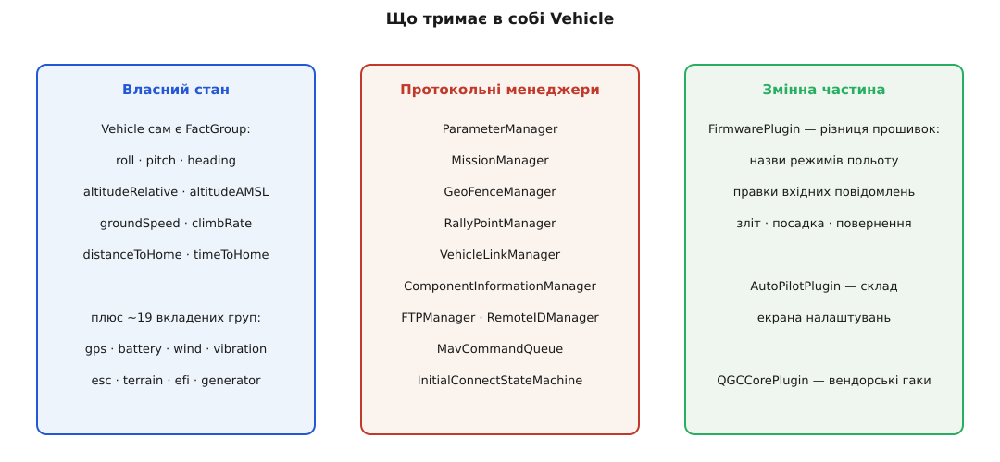
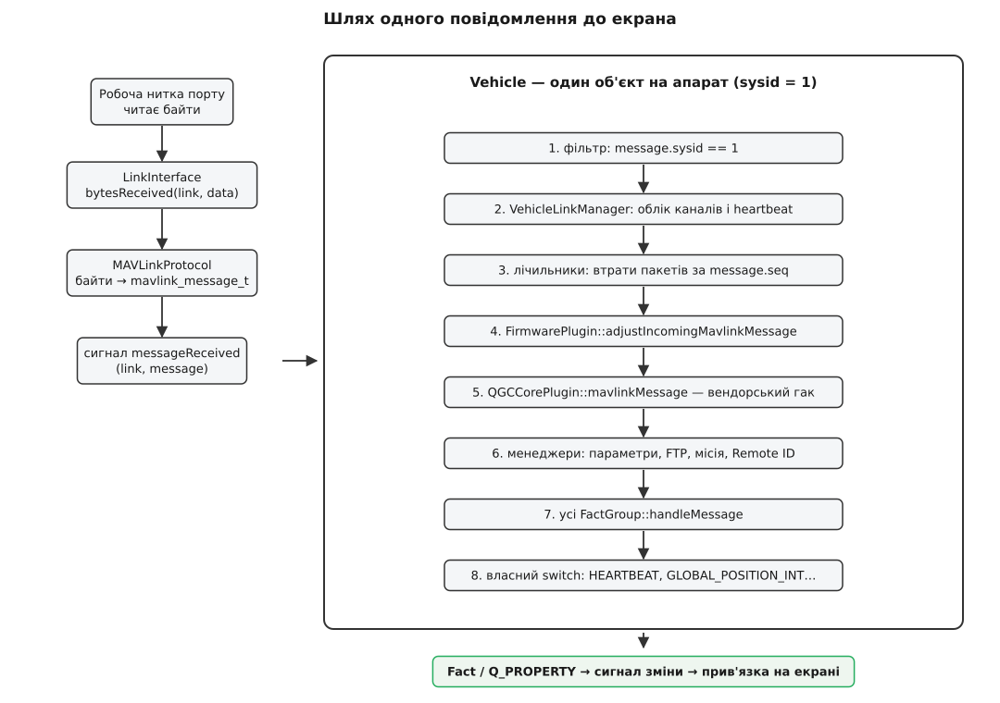
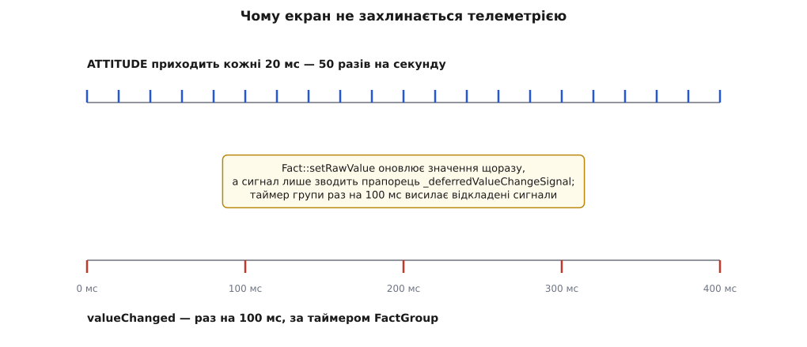
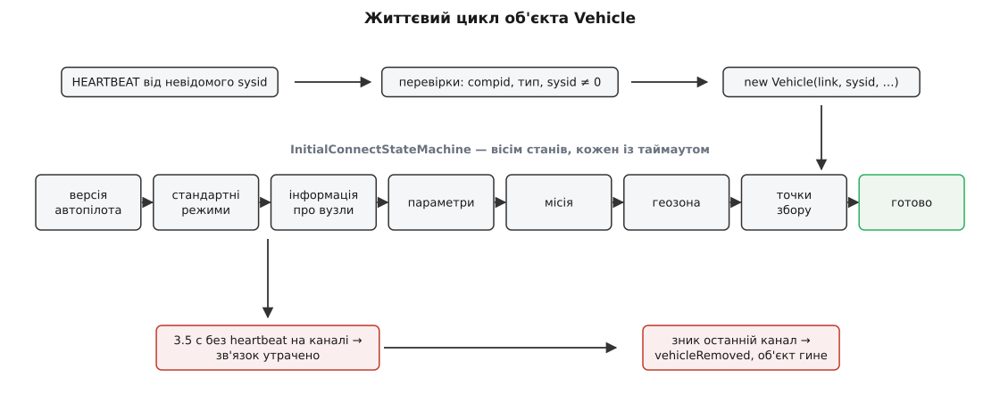

# Vehicle: модель апарата всередині застосунку

<preknowlist>
- [Пакет MAVLink](topic:sys-dron/mavlink-packet) — з чого складається кадр: ідентифікатор системи (sysid) та компонента (compid), порядковий номер, номер повідомлення.
- [Керування й телеметрія](topic:sys-dron/control-telemetry) — що таке heartbeat, який потік значень апарат безперервно шле на землю й навіщо.
- [Спостерігач](topic:sf-apps/observer) — об'єкт тримає стан і сам сповіщає підписників, коли той змінився.
- [Модель–подання–модель подання (MVVM)](topic:sf-apps/model-view-viewmodel) — стан живе в моделі, а екран лише прив'язується до неї й перемальовується на сповіщення.
</preknowlist>

Наземна станція отримує з ефіру не «стан апарата», а рівний потік дрібних, ніяк не пов'язаних між собою повідомлень. Раз на секунду приходить `HEARTBEAT` з режимом польоту. Десять разів на секунду — `GLOBAL_POSITION_INT` з широтою, довготою й висотою. П'ятдесят разів на секунду — `ATTITUDE` з кутами крену й тангажу. Окремо й нерегулярно — `SYS_STATUS` із напругою, `GPS_RAW_INT` із кількістю супутників, `BATTERY_STATUS`, `VIBRATION`, `STATUSTEXT` із текстовим рядком помилки. Кожне з них — самодостатній кадр, який нічого не знає ні про попередній, ні про наступний.

А на екрані пілот бачить щось цілком інше: одне число висоти, яке плавно змінюється; напис «Position» у кутку; маркер на карті; смужку заряду. Це не повідомлення — це **стан однієї речі**, що триває в часі. Хтось між ефіром і екраном мусить зшити потік кадрів у цю тривалу річ.

## Чому не можна обійтися без окремого об'єкта

Найпростіше рішення напрошується саме собою: хай кожен показник на екрані сам підписується на потрібне повідомлення й сам його розбирає. Індикатор висоти чекає на `GLOBAL_POSITION_INT`, індикатор режиму — на `HEARTBEAT`. Ніякого зайвого шару, менше коду.

Це рішення розсипається на чотирьох різних місцях, і кожне з них варте того, щоб його побачити окремо.

**Перше: показник, який щойно з'явився, порожній.** Пілот відкриває вкладку налаштувань — індикатор висоти створюється заново і не має жодного значення, аж поки не прилетить наступний кадр. Для висоти це десята секунди, для рідкісного `SYS_STATUS` — кілька секунд порожнечі. Значить, значення все одно доводиться десь **зберігати між кадрами**, а не тільки передавати.

**Друге: одне значення приходить із кількох різних повідомлень.** Висота над точкою зльоту є і в `GLOBAL_POSITION_INT`, і в спеціалізованому `ALTITUDE`, і в старому `VFR_HUD`. Різні прошивки й різні налаштування шлють різні набори. Хтось мусить знати правило: якщо є `ALTITUDE`, беремо звідти й ігноруємо решту. Це правило не належить індикаторові — воно про апарат, а не про віджет.

**Третє: одне значення взагалі не приходить готовим.** «Відстань до дому» ніде в протоколі немає — її треба порахувати з поточних координат і координат точки дому, які прийшли іншим повідомленням і колись давно. «Час у польоті» рахується від моменту зброєння. Таких похідних величин у станції десятки, і всі вони вимагають місця, де вже лежить і координата, і дім, і момент зброєння **водночас**.

**Четверте: апаратів може бути кілька.** У повітрі два дрони — sysid 1 і sysid 2. Індикатор, який слухає всі `GLOBAL_POSITION_INT` підряд, показуватиме двох дронів по черзі, смикаючись між ними.

Усі чотири проблеми мають один спільний корінь: **потік повідомлень моментальний, а стан — тривалий**, і належить він конкретній машині в повітрі. Отже, у застосунку має бути об'єкт, який відповідає одному апаратові, накопичує його стан і віддає його назовні як набір іменованих величин. У QGroundControl цей об'єкт зветься `Vehicle`, живе у `src/Vehicle/Vehicle.cc` і є, без перебільшення, центром усього застосунку: майже кожен екран станції починається з фрази «візьми активний Vehicle».

> 🔧 **Навіщо це.** Коли значення на екрані «застигло» або показує дурницю, питання завжди звучить однаково: воно не оновилося у `Vehicle` чи не дійшло з `Vehicle` на екран? Це дві геть різні поломки з різними місцями пошуку, і межа між ними проходить рівно по цьому об'єкту.

## Хто вирішує, що апарат з'явився

`Vehicle` не створюється при запуску застосунку — станція наперед не знає, скільки апаратів побачить і чи побачить бодай один. Об'єкт народжується з першого heartbeat.

Розбором байтів займається `MAVLinkProtocol` — один на весь застосунок. Зібравши цілий кадр, він шле сигнал `messageReceived(link, message)`. На цей сигнал підписаний `MultiVehicleManager` — реєстр усіх відомих апаратів. Він дивиться тільки на heartbeat і питає: чи знаю я вже систему з таким sysid? Якщо ні — можливо, час створити для неї `Vehicle`.

«Можливо» тут не випадкове слово. Heartbeat шле не лише автопілот. Його шле бортовий комп'ютер, підвіс камери, ретранслятор ADS-B, і навіть сама станція шле свій heartbeat у ефір. Якби `Vehicle` створювався на кожен новий sysid, на карті виникали б фантомні апарати. Тому перед створенням стоїть кілька фільтрів, і кожен відсіює свій різновид самозванця:

```cpp
// відповідає за апарат тільки перший автопілот; підвіс і камера мають свої compid
if (componentId != MAV_COMP_ID_AUTOPILOT1) {
    return;
}

switch (vehicleType) {
case MAV_TYPE_GCS:                 // інша наземна станція в мережі
case MAV_TYPE_ONBOARD_CONTROLLER:  // бортовий комп'ютер поруч з автопілотом
case MAV_TYPE_GIMBAL:              // підвіс
case MAV_TYPE_ADSB:                // приймач чужого трафіку
    return;
default:
    break;
}

if (_ignoreVehicleIds.contains(vehicleId) || getVehicleById(vehicleId) || vehicleId == 0) {
    return;
}
```

Останні три перевірки — про повторення й про сміття: sysid 0 у MAVLink означає «широкомовно, до всіх» і не може позначати конкретну систему; про вже відомий апарат нічого створювати не треба; а до чорного списку `_ignoreVehicleIds` потрапляють ті, від яких користувач свідомо відмовився. Окремо станція перевіряє, чи не збігається sysid апарата з її власним, і, якщо збігається, попереджає користувача: два учасники мережі з однаковим ідентифікатором — це гарантована плутанина в маршрутизації, яку годі помітити з симптомів.

Пройшли фільтри — з'являється `new Vehicle(link, vehicleId, componentId, …)`, `MultiVehicleManager` кладе його у свій список, шле сигнал `vehicleAdded`, і, якщо апарат був першим, робить його **активним**. Активний апарат — це той, чиї показники зараз на екрані; уся однодронова частина інтерфейсу знає лише про нього. Як застосунок живе з кількома апаратами водночас і чому перемикання активного зроблено через відкладений виклик, а не прямо, — окрема тема про [кілька апаратів в одному застосунку](topic:sys-dron/multi-vehicle).

## Що тримає в собі Vehicle

Далі корисно один раз побачити, з чого об'єкт складається, бо надалі все крутитиметься навколо цих трьох груп.



*Власний стан, набір менеджерів під кожен протокол і змінна частина, винесена в плагіни.*

**Власний стан** — це власне телеметрія: кути, висоти, швидкості, відстані, похідні величини. Він зберігається не в звичайних полях, а у **фактах** — об'єктах, які, крім числа, несуть одиниці вимірювання, точність, назву й підказку. Сам `Vehicle` успадкований від `VehicleFactGroup`, тобто **є групою фактів**, а всередині тримає ще близько двох десятків вкладених груп: `gps`, `battery`, `wind`, `vibration`, `esc`, `terrain`, `efi`, `generator` і решту. Навіщо факт замість простого `double` — окрема тема про [FactSystem](topic:sys-dron/fact-system); тут важливо, що завдяки метаданим індикатор здатний намалювати значення й підписати одиниці, ні рядка не знаючи про те, що саме він малює.

**Протокольні менеджери** — це другий шар. MAVLink не одне-єдине спілкування, а пучок окремих протоколів зі своїми діалогами, таймаутами й повторами: завантаження параметрів, обмін місією, геозона, точки збору, передавання файлів, черга команд із підтвердженнями. Кожен із них — це стан і логіка, яких у самому `Vehicle` бути не повинно, інакше клас перетвориться на смітник. Тому `Vehicle` створює під кожен протокол окремий об'єкт-менеджер, володіє ним і роздає йому повідомлення: `ParameterManager`, `MissionManager`, `GeoFenceManager`, `RallyPointManager`, `FTPManager`, `MavCommandQueue`, `VehicleLinkManager`.

**Змінна частина** — третій шар. Апарат може бути на PX4 або на ArduPilot; це різні прошивки з різними наборами режимів польоту й різними дрібними звичками. Уся ця різниця винесена у `FirmwarePlugin`, який `Vehicle` отримує від `FirmwarePluginManager` за типом автопілота з heartbeat. Про це нижче окремо, бо саме тут проходить найтонша межа у всій архітектурі.

## Шлях одного повідомлення

Тепер можна пройти дорогою одного кадру повністю — від байтів у порту до числа на екрані.



*Розбір і оновлення стану відбуваються в головній нитці; окремі нитки виділено лише самому вводу-виводу.*

Байти читає окрема нитка на кожен порт — `SerialWorker` для послідовного порту, свій робітник для мережевого. Зроблено це не заради швидкості розбору, а щоб блокувальне читання з порту не спиняло малювання інтерфейсу. Прочитаний шматок робітник передає через чергу подій у `LinkInterface`, який уже живе в головній нитці й шле `bytesReceived`. Далі `MAVLinkProtocol` збирає з байтів кадри й на кожен готовий кадр шле `messageReceived`. Отже, **розбір і все, що після нього, відбувається в головній нитці** — та сама, у якій працює інтерфейс. Що з цього випливає для продуктивності, розібрано в темі про [модель потоків](topic:sys-dron/threading-model).

На `messageReceived` підписаний **кожен** наявний `Vehicle`. Тому перше, що робить об'єкт, — відкидає чуже:

```cpp
void Vehicle::_mavlinkMessageReceived(LinkInterface* link, mavlink_message_t message)
{
    if (message.sysid != _systemID && message.sysid != 0) {
        // виняток: RADIO_STATUS шле сам модем, у нього власний sysid,
        // але стосується він каналу, яким користується цей апарат
        if (!(message.msgid == MAVLINK_MSG_ID_RADIO_STATUS
              && _vehicleLinkManager->containsLink(link))) {
            return;
        }
    }
    ...
```

Фільтр за sysid — це і є розв'язання проблеми кількох апаратів: два `Vehicle` бачать той самий потік і кожен бере з нього своє. Виняток для `RADIO_STATUS` показує, що правило «за sysid» не абсолютне: телеметрійний модем — самостійний учасник мережі зі своїм ідентифікатором, а рівень сигналу, який він доповідає, належить каналу, а отже й апаратові на тому кінці каналу.

Далі повідомлення проходить через впорядкований ланцюг споживачів, і **порядок тут значущий**.

Спершу його бачить `VehicleLinkManager` — саме він відповідає за додавання нових каналів до апарата, тож мусить побачити кадр раніше за всіх. Потім рахуються втрати. Потім `FirmwarePlugin` дістає можливість **змінити вміст кадру** до того, як його побачить решта, — і, повернувши `false`, може взагалі його проковтнути. Потім те саме право дістає `QGCCorePlugin` — гак для вендорських збірок. І лише після цього кадр розходиться по менеджерах, по всіх групах фактів і, врешті, потрапляє у власний `switch` самого `Vehicle`, де обробляються повідомлення, з яких народжуються не факти, а властивості: `HEARTBEAT`, `GLOBAL_POSITION_INT`, `SYS_STATUS`, `COMMAND_ACK`, `STATUSTEXT`.

Логіка порядку проста: спершу той, хто керує самим з'єднанням, потім ті, хто має право переписати кадр, і аж наприкінці ті, хто його читає. Зворотний порядок означав би, що плагін виправляє повідомлення, яке половина застосунку вже встигла прочитати неправленим.

### Лічильник утрат: маленький приклад, який варто перевірити самому

Дорогою повідомлення `Vehicle` рахує втрачені пакети — просто за порядковим номером `seq`, який автор кадру збільшує на одиницю з кожним відправленням і який переповнюється після 255.

**Умова.** Останній оброблений кадр мав `seq = 250`, отже станція чекає `251`. Наступний кадр приходить із `seq = 253`.

```
_messageSeq   = 251                     очікуваний номер
seq_received  = 253
253 ≥ 251     →  втрачено = 253 − 251 = 2      кадри 251 і 252
_messageSeq   = 253 + 1 = 254
```

Тепер переповнення. Станція чекає `255`, а приходить `2`: пропали `255`, `0`, `1` — тобто три кадри. У коді для цього окрема гілка:

```cpp
if (seq_received < _messageSeq) {
    packet_lost_count = (seq_received + 255) - _messageSeq;
}
```

```
seq_received = 2  <  _messageSeq = 255   →  спрацьовує гілка переповнення
втрачено = (2 + 255) − 255 = 2           а насправді втрачено 3
```

Період лічильника — 256 значень, а не 255, тож на кожному переверті арифметика недораховує один пакет. Похибка мізерна й на показник якості зв'язку майже не впливає, але вона добре ілюструє, чому лічильник узагалі варто читати з розумінням. Є й друга, значно важливіша тонкість: `_messageSeq` один на весь об'єкт, а `seq` **у кожного компонента свій**. Тому втрати рахуються лише для кадрів від того компонента, від якого прийшов перший heartbeat:

```cpp
if (_compID == message.compid) {   // рахуємо тільки потік автопілота
    ...
}
```

Без цієї умови повідомлення підвісу й камери, що йдуть упереміш зі своїми незалежними лічильниками, давали б суцільний шум «утрачених» кадрів.

## Дві дороги стану: властивість і факт

У ланцюгу вище видно, що стан осідає у двох різних сховищах, і різниця між ними не історична, а змістова.

Ось як `GLOBAL_POSITION_INT` перетворюється на позицію апарата:

```cpp
void Vehicle::_handleGlobalPositionInt(mavlink_message_t& message)
{
    if (message.compid != _defaultComponentId) {
        return;
    }
    mavlink_global_position_int_t globalPositionInt;
    mavlink_msg_global_position_int_decode(&message, &globalPositionInt);

    if (!_altitudeMessageAvailable) {                 // якщо є ALTITUDE — беремо звідти
        _altitudeRelativeFact.setRawValue(globalPositionInt.relative_alt / 1000.0);
        _altitudeAMSLFact.setRawValue(globalPositionInt.alt / 1000.0);
    }

    // ArduPilot шле кадри з нулями в широті й довготі навіть без сигналу GPS,
    // щоб доправити самою лише відносну висоту
    if (globalPositionInt.lat == 0 && globalPositionInt.lon == 0) {
        return;
    }

    QGeoCoordinate newPosition(globalPositionInt.lat / 1E7,
                               globalPositionInt.lon / 1E7,
                               globalPositionInt.alt / 1000.0);
    if (newPosition != _coordinate) {
        _coordinate = newPosition;
        emit coordinateChanged(_coordinate);
    }
}
```

Тут одразу видно кілька речей. Висоти лягають у **факти** — це числа, які показує індикатор і які треба вміти перевести в фути, округлити до потрібного знака й підписати. Координата ж лягає у звичайне поле й віддається сигналом — це не число для індикатора, а складена величина для карти, у якої немає ні одиниць, ні точності. Ось і все правило: **факт — коли значення показують як число, властивість — коли значенням користуються як цілим**.

Видно й друге. Умова `if (!_altitudeMessageAvailable)` — це та сама «одне значення з кількох повідомлень» із самого початку: щойно апарат почав слати спеціалізований `ALTITUDE`, `Vehicle` перестає брати висоту з позиційного кадру. Правило живе в моделі й нікому назовні не видиме.

І третє: коментар про ArduPilot усередині коду `Vehicle`. Це чесний слід реальності — не кожну химерію прошивки вдається сховати в плагін.

## Чому екран не захлинається телеметрією

`ATTITUDE` приходить п'ятдесят разів на секунду, і кожен кадр змінює три факти. Якби кожна зміна одразу штовхала сигнал, а на сигнал відгукувалася прив'язка на екрані, інтерфейс перемальовував би кути півтораста разів на секунду — при тому, що монітор оновлюється шістдесят, а око не помітить різниці й при десяти.

Розв'язано це на рівні групи фактів. Група створюється з періодом оновлення, і `VehicleFactGroup` бере сто мілісекунд:

```cpp
VehicleFactGroup::VehicleFactGroup(QObject *parent)
    : FactGroup(100, QStringLiteral(":/json/Vehicle/VehicleFact.json"), parent)
```

Механізм навмисне простий. Додаючи факт до групи, вона вимикає йому негайні сигнали, якщо період ненульовий:

```cpp
fact->setSendValueChangedSignals(_updateRateMSecs == 0);
```

Далі факт при кожному записі оновлює **значення**, але замість сигналу лише зводить прапорець:

```cpp
void Fact::_sendValueChangedSignal(const QVariant &value)
{
    if (_sendValueChangedSignals) {
        emit valueChanged(value);
        _deferredValueChangeSignal = false;
    } else {
        _deferredValueChangeSignal = true;      // сигнал відкладено
    }
}
```

А таймер групи раз на сто мілісекунд обходить усі факти й випускає відкладене:

```cpp
void FactGroup::_updateAllValues()
{
    for (Fact *fact: _nameToFactMap) {
        fact->sendDeferredValueChangedSignal();
    }
}
```



*Значення оновлюється з кожним кадром, сигнал — за таймером; на екран потрапляє останнє значення, а не кожне.*

Тонкість, яку легко проґавити: **значення не проріджується, проріджуються тільки сповіщення**. Хто прочитає факт напряму в будь-який момент, дістане найсвіжіше число. Прапорець теж не лічильник, а саме прапорець: скільки б разів значення не змінилося за сто мілісекунд, сигнал буде один. Тому цей механізм придатний для показу, але не для запису логу — тому телеметрійний лог пишеться з сирих кадрів, а не з фактів.

Прапорець можна й прибрати: `setLiveUpdates(true)` вмикає групі негайні сигнали. Це роблять вікна, яким потрібна кожна зміна, — наприклад, сторінки калібрування й діагностики.

Зверніть увагу на асиметрію: координата апарата, яка йде властивістю, **не проріджується взагалі** — `coordinateChanged` летить із кожним позиційним кадром. Так і має бути: позиція приходить удесятеро рідше за кути, а маркер на карті, що смикається раз на сто мілісекунд, виглядав би гірше за плавний.

## Де живе різниця між прошивками

Найважча вимога до `Vehicle` — не роздутися. Апарат може бути на PX4 і на ArduPilot; це різні набори режимів польоту, різні правила зброєння, різні команди зльоту. Якби кожну таку відмінність писали умовою `if (px4Firmware())` просто в `Vehicle`, клас за рік перетворився б на суцільне гілкування.

Тому відмінності винесено у `FirmwarePlugin`, а `Vehicle` **питає** плагін замість того, щоб вирішувати самому. Класичний приклад — назва режиму польоту. У heartbeat режим закодовано двома числами, `base_mode` і `custom_mode`, і зміст `custom_mode` цілком залежить від прошивки. `Vehicle` цих чисел не тлумачить:

```cpp
QString Vehicle::flightMode() const
{
    return _firmwarePlugin->flightMode(_base_mode, _custom_mode);
}
```

Так само плагін відповідає за зліт, посадку, повернення додому й за право правити вхідні кадри в `adjustIncomingMavlinkMessage`.

Але межа тече. Ось справжній шматок обробки heartbeat:

```cpp
bool newArmed = heartbeat.base_mode & MAV_MODE_FLAG_DECODE_POSITION_SAFETY;

if (apmFirmware()) {
    if (!_apmArmingNotRequired() || !(_onboardControlSensorsPresent & MAV_SYS_STATUS_SENSOR_MOTOR_OUTPUTS)) {
        _updateArmed(newArmed);
    }
} else {
    _updateArmed(newArmed);
}
```

Причина в тому, що в ArduPilot із параметром `ARMING_REQUIRE = 0` апарат формально завжди «зброєний», хоча мотори живлення не мають, поки не натиснуто кнопку безпеки. Отже, для такої конфігурації прапорець у heartbeat не відповідає на питання «чи небезпечно зараз підходити до апарата», і справжню відповідь дає лише `SYS_STATUS`. Ця умова могла б жити в плагіні — але тоді плагін мусив би мати доступ і до параметрів апарата, і до стану сенсорів, тобто фактично до всього `Vehicle`. Розробники залишили її на місці. Це нормальний стан живої архітектури: правило «різниця прошивок — у плагіні» дотримане в дев'яти випадках із десяти, а десятий стоїть у коді разом із поясненням, чому саме.

> 🔧 **Навіщо це.** Готуючи власну збірку під незвичний автопілот, ви шукатимете не місце в `Vehicle`, а свій `FirmwarePlugin`. І якщо для потрібної відмінності в плагіні немає гачка — це сигнал, що зміну доведеться погоджувати з апстримом, а не робити локальною латкою в моделі. Що саме дозволяє змінити плагін, розібрано в темі про [плагін прошивки](topic:sys-dron/firmware-plugin).

## Дорослішання: чому початкове з'єднання зроблено машиною станів

Створений `Vehicle` майже нічого про апарат не знає: у нього є sysid, тип і прошивка з heartbeat — і все. Далі треба забрати з борту версію автопілота, перелік режимів, опис компонентів, усі параметри (їх бувають тисячі), місію, геозону, точки збору. Аж коли це є, екрани налаштувань здатні себе намалювати.



*Від першого heartbeat до готовності — послідовність кроків із таймаутами; від тиші в ефірі до зникнення об'єкта — 3.5 секунди й порожній список каналів.*

Здавалося б, це проста послідовність запитів. Але кожен крок тут — діалог по радіо, а радіо втрачає пакети. Крок може не відповісти зовсім, відповісти із запізненням у секунди, відповісти помилкою «не підтримую», або виявитися непотрібним: якщо апарат уже в польоті, качати тисячі параметрів безглуздо й шкідливо, а якщо користувач щойно завантажив план із файлу, забирати місію з борту не треба. Послідовність зі зворотних викликів, у якій кожен наступний запускається з обробника попереднього, від такої кількости винятків розповзається на нечитабельний клубок.

Тому ця частина зроблена окремою машиною станів — `InitialConnectStateMachine`. Стани йдуть один за одним: версія автопілота → стандартні режими → інформація про компоненти → параметри → місія → геозона → точки збору → готово. У кожного стану є **таймаут**, у деяких — **кількість повторів**, а в частини — **предикат пропуску**:

```cpp
_stateParameters = new SkippableAsyncState(
    QStringLiteral("RequestParameters"), this,
    [this]() {                                  // чи пропускати?
        if (_shouldSkipForFlying()) {
            if (vehicle()->px4Firmware()) {     // PX4 має дешеву звірку кешу за хешем
                return false;
            }
            _lastSkipReason = QStringLiteral("(vehicle is flying)");
            return true;
        }
        return false;
    },
    [this](SkippableAsyncState* state) { _requestParameters(state); },
    ...
```

Перехід малюється однією лінією для обох випадків — і успіху, і пропуску:

```cpp
_stateParameters->addTransition(_stateParameters, &WaitStateBase::completed, _stateMission);
_stateParameters->addTransition(_stateParameters, &SkippableAsyncState::skipped, _stateMission);
```

Виграш саме в цьому. Стан не знає, хто йде за ним, — це знає таблиця переходів; провал за таймаутом не ламає ланцюг, а веде у свою гілку; додати новий крок означає вставити стан і два переходи, а не переписати вкладені зворотні виклики. Заразом машина віддає загальний поступ — ту саму смужку «Connecting», яку бачить користувач.

Порядок станів теж не довільний. Параметри стоять перед місією й геозоною, бо `GeoFenceManager` мусить читати параметри, щоб узагалі знати, чи підтримує апарат геозону і в якому вигляді. Тому й у конструкторі `Vehicle` менеджери створюються у виразно заданій черзі, з коментарями на кшталт «GeoFenceManager потребує доступу до ParameterManager, тож створюємо після нього».

## Смерть: коли апарат вважається зниклим

Зв'язок обривається без попередження — модем не шле «до побачення». Єдина ознака втрати — тиша.

За тишею стежить `VehicleLinkManager`, окремий об'єкт усередині `Vehicle`. Він тримає список каналів, якими цей апарат доступний, — їх може бути кілька водночас, наприклад телеметрійний модем і Wi-Fi. На кожен канал є свій секундомір, що скидається з кожним heartbeat. Раз на секунду менеджер обходить список, і якщо на каналі не було heartbeat довше **3.5 секунди**, канал уважається втраченим.

Три з половиною секунди — не випадкове число: heartbeat за домовленістю йде раз на секунду, тож поріг дозволяє загубити три поспіль, перш ніж бити на сполох. Менший поріг давав би фальшиві тривоги на кожному завмиранні сигналу, більший — надто пізню реакцію.

Втрата каналу ще не втрата апарата. Якщо каналів кілька, менеджер просто перемикає **основний канал** на живий, і користувач цього навіть не помічає. Апарат зникає лише тоді, коли живих каналів не залишилося: тоді `Vehicle` шле `vehicleRemoved`, `MultiVehicleManager` викидає його зі списку, а сам об'єкт знищується. Разом із ним гине весь стан — усі факти, усі менеджери, завантажені параметри. Тому повторне під'єднання до того самого апарата — це не «продовження», а повне нове знайомство з новим проходом машини початкового з'єднання.

## Vehicle без апарата

Наостанок — деталь, яка найкраще показує, наскільки центральним є цей об'єкт. У `Vehicle` є другий конструктор, без каналу:

```cpp
Vehicle::Vehicle(MAV_AUTOPILOT firmwareType, MAV_TYPE vehicleType, QObject* parent)
    : VehicleFactGroup      (parent)
    , _systemID             (0)
    , _defaultComponentId   (MAV_COMP_ID_ALL)
    , _offlineEditingVehicle(true)
    ...
```

Це апарат для **редагування плану офлайн**. Коли ви складаєте місію вдома, без жодного дрона поруч, застосунок усе одно створює `Vehicle` — з sysid 0, без каналу, з типом і прошивкою, узятими з налаштувань, і зі швидкостями за замовчуванням звідти ж.

Причина суто практична. Редактор плану мусить знати тип апарата, щоб показати доречні команди; мусить знати крейсерську швидкість, щоб оцінити тривалість; мусить мати `MissionManager`, щоб працювати зі списком точок. Усе це вже є у `Vehicle` — і замість другого, «плоского» шляху для офлайн-режиму застосунок підсовує редакторові несправжній апарат, після чого весь код планування працює однаково, під'єднаний дрон чи ні. Змінили в налаштуваннях клас прошивки — офлайновий `Vehicle` перебудовує свої можливості на льоту, бо підписаний на ці налаштування як на факти.

## Що з цього виходить

`Vehicle` — це перекладач між двома словниками. З одного боку — словник протоколу: номери повідомлень, бітові поля, масштаби на кшталт «широта в стомільйонних частках градуса». З другого — словник предметної області: висота, режим, зброєність, відстань до дому. Уся станція вище цього шару говорить другим словником і не знає першого; уся станція нижче говорить першим і не знає другого.

За таку центральність доводиться платити розміром: `Vehicle` — один із найбільших класів застосунку, і тиск «додати сюди ще одне поле» на нього постійний. Стримують його три звички, які видно всюди в коді. Протокол зі своїм діалогом — окремий менеджер, яким `Vehicle` лише володіє. Різниця прошивок — плагін, у якого `Vehicle` питає. Багатокроковий обмін — машина станів, а не ланцюг зворотних викликів. Там, де ці три звички витримано, клас лишається читабельним попри свій розмір; там, де ні, — стоїть коментар із поясненням, чому виняток.

Знизу до цієї межі підходять ще два шари, кожен зі своєю задачею. [Обробка MAVLink](topic:sys-dron/mavlink-handling) відповідає за те, як із байтового потоку взагалі виходять кадри: контрольна сума, версія протоколу, номер каналу розбору. [Маршрутизація за sysid і compid](topic:sys-dron/message-routing) — за те, кому кадр адресовано і чи треба переслати його далі; фільтр на початку `_mavlinkMessageReceived` — лише найпростіша, найостанніша ланка цієї маршрутизації. Зверху лежить [FactSystem](topic:sys-dron/fact-system): формат метаданих, одиниці, переклади, правила округлення — усе, що перетворює число у факті на підписаний рядок індикатора.

Повний перелік того, що `Vehicle` виставляє назовні — властивості, групи фактів, викличні методи керування й сигнали, — зібрано в [довідці інтерфейсу](topic:sys-dron/vehicle-object/api-vehicle-qml.md): нею зручно користуватися, коли треба знайти готове значення, а не додавати своє. Якщо ж потрібного значення в цьому переліку немає, шлях від нового MAVLink-повідомлення до числа на екрані — вибір групи, опис метаданих, обробник, прив'язка — крок за кроком розібрано в [окремому розборі](topic:sys-dron/vehicle-object/proj-message-to-property.md).

Історична примітка наостанок. У QGroundControl версій 3.x поруч із `Vehicle` існував успадкований клас `UAS`, і документація тих часів прямо застерігала: клас застарілий, нового коду до нього не додавати, функціональність поступово переїжджає у `Vehicle`. Переїзд завершився — у поточному дереві теки `src/uas` уже немає. Те, що ми маємо сьогодні, — не задум із чистого аркуша, а результат багаторічного витягування логіки з одного великого класу в набір менеджерів і плагінів довкола нього.
