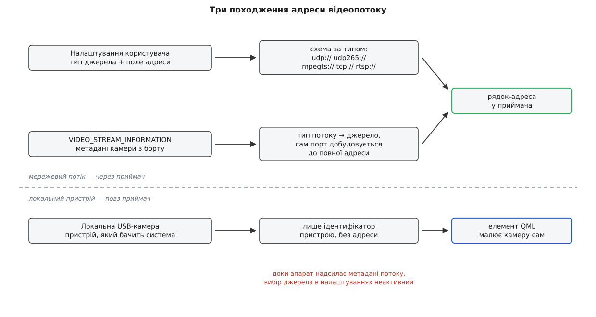

# Відеопідсистема: джерела, керування, запис

<preknowlist>
- [Передача відео](root:com-transport/video-transmission) — що таке потік стисненого відео й чому він їде лише в один бік.
- [TCP і UDP](root:com-transport/tcp-vs-udp) — у UDP немає ані встановлення з'єднання, ані повідомлення про розрив.
- [RTP і RTCP](root:com-protocol/rtp-rtcp) — як шматки закодованого кадру їдуть окремими пакетами й що з ними стається при втратах.
- [Протоколи камери й підвісу MAVLink](root:sys-dron/mavlink-camera-gimbal) — повідомлення, яким камера сама називає адресу свого потоку.
- [Vehicle: модель апарата](root:sys-dron/vehicle-object) — що таке активний апарат і звідки в застосунку беруться його підсистеми.
- [FactSystem](root:sys-dron/fact-system) — налаштування живуть як факти: значення з метаданими й сигналом про зміну.
</preknowlist>

Телеметрію станція бере сама: відкриває порт, надсилає запит, бачить, коли зв'язок є і коли він урвався.

З відео все навпаки. Десь на борту працює кодувальник і жене пакети на якусь адресу. Станція нічого не відкриває й ні про що не домовляється — усе, що вона може, це сісти на ту адресу й слухати. [Потік поверх UDP](root:com-transport/tcp-vs-udp) не має ані рукостискання, ані розриву, тож питати «чи все гаразд» нема в кого. Коли картинка зникає, з боку сокета це виглядає точно так само, як якби її ніколи й не було.

Уся підсистема виростає з цієї однієї відмінности. Станція не володіє джерелом — отже, мусить його вгадати. Адреса може змінитися посеред польоту — отже, це не одноразове рішення на старті, а величина, яку доводиться перераховувати. Про поломку ніхто не повідомить — отже, потік доводиться пробувати запускати знову й знову.

## Політика окремо, механіка окремо

«Вирішити, що дивитися» і «зробити так, щоб воно показувалося» — різні за природою роботи. Перша складається з налаштувань, порівнянь і сигналів. Друга — із мережевих сокетів, розбирачів формату, декодувальників і пам'яті відеокарти. Тому їх і розвели по двох об'єктах.

`VideoManager` — це політика. Він знає, які бувають джерела, звідки береться адреса, коли потік дозволено вмикати й куди складати файли. Жодного кадру він при цьому не бачить.

`VideoReceiver` — це механіка. Він отримує рядок-адресу й накази «почни», «спинися», «декодуй сюди», «пиши у цей файл», а назад віддає тільки повідомлення про стан. Реалізацій у нього кілька: основна на GStreamer, полегшена на Qt Multimedia для збірок без нього, безекранна для тестів; вендорські збірки підставляють власну через [плагін ядра](root:sys-dron/core-plugin). Те, як усередині приймача байти з мережі стають кадром на екрані, — окрема справа [відеотракту](root:sys-dron/video-pipeline).

## Три походження адреси

Список джерел в інтерфейсі виглядає однорідним — «RTSP», «UDP h.264», «UDP h.265», кілька готових апаратів, усі USB-камери системи, — але за пунктами стоять три різні механізми.

Перший — **ручний**. Користувач окремо задає мережеву частину (типово `0.0.0.0:5600`), а вибраний тип джерела вирішує, яку схему до неї приклеїти: `udp://`, `udp265://`, `mpegts://`. Дві останні схеми не існують у жодному стандарті — це власна мова застосунку. Причина проста: голий потік поверх UDP не несе в собі опису того, що всередині, тож комусь треба сказати приймачеві, як цей потік розбирати. Цим «кимось» є користувач, а схема адреси — спосіб передати його вибір одним рядком. Готові апарати в тому самому списку — той самий механізм із зашитою відповіддю: `Herelink AirUnit` просто перетворюється на `rtsp://192.168.0.10:8554/H264Video`.

Другий — **від апарата**. Камера, що говорить [протоколом камери MAVLink](root:sys-dron/mavlink-camera-gimbal), сама повідомляє тип потоку, адресу або порт, кодування й роздільність. Тоді питати користувача нема потреби: менеджер перекладає поля повідомлення у свій тип джерела й свою адресу, а поле вибору в інтерфейсі стає неактивним. Ручний вибір за такої камери не має сили за побудовою — це не збій, а замисел.

Третій — **локальна камера**, і це взагалі не потік. USB-камера в ноутбуці оператора — пристрій, який система вже вміє показувати; тягнути її кадри через мережевий приймач не треба. Менеджер тут робить рівно одну річ: питає в користувача дозвіл і публікує ідентифікатор пристрою, а далі елемент інтерфейсу малює камеру самотужки. Жоден приймач у цьому не бере участи — звідси й наслідок, що спантеличує: картинка на екрані є, а кнопка запису неактивна, бо записувати нема чого приймати.



*Дві верхні гілки сходяться в один рядок-адресу для приймача; нижня взагалі минає приймач і віддає в інтерфейс лише ідентифікатор пристрою.*

## Перерахувати й порівняти

Адреса залежить від багатьох речей одразу: типу джерела, трьох полів, наявности активного апарата, метаданих його камери, набору USB-пристроїв. Кожна з них змінюється сама по собі й у непередбачуваний момент. Писати на кожну свій обробник означає плодити гілки, кількість яких росте як добуток входів на наслідки.

Станція йде іншим шляхом. Є **одна** функція, яка з усіх входів наново обчислює бажаний стан приймача, і **всі** сигнали ведуть до неї. Кличуть її за найменшої підозри, бо зайвий виклик із тими самими входами дає той самий результат і нічого не псує.

Але тоді виникає вирішальне питання. Перезапустити конвеєр дорого: розібрати ланцюг, під'єднатися наново, дочекатися першого опорного кадру — це секунди чорного екрана. А приводів для перерахунку багато, і більшість нічого не змінює: камера періодично надсилає стан свого потоку, оператор перемкнувся на інший апарат і назад, користувач відкрив налаштування й закрив. Якби кожен виклик тягнув перезапуск, картинка не з'явилася б ніколи.

Тому перерахунок не просто обчислює адресу, а порівнює її з тією, що вже стоїть у приймача, і повертає відповідь на єдине запитання: чи змінилося щось насправді.

```cpp
bool VideoManager::_updateVideoUri(VideoReceiver *receiver, const QString &uri)
{
    if ((uri == receiver->uri()) && !receiver->uri().isNull()) {
        return false;
    }
    receiver->setUri(uri);
    return true;
}
```

> 🔧 **Навіщо це.** Додаючи в підсистему власне налаштування, спершу дайте собі відповідь, коли його читають. Якщо під час побудови конвеєра — заведіть його в перерахунок і поверніть із нього `true` при зміні: приймач перезапуститься сам. Якщо на ходу — передайте значення й **не** позначайте зміну, інакше кожен рух повзунка коштуватиме користувачеві секунди чорного екрана. Помилка в цьому виборі не проявиться в тестах: працюють обидва варіанти, просто один щоразу гасить картинку.

## Пробувати, доки не вийде

Запуск приймача асинхронний і з тайм-аутом (англ. *time out* — вичерпаний час). Часу дається різна кількість: три секунди для UDP, вісім для RTSP. У голому UDP «запуск» означає лише відкрити сокет і дочекатися перших пакетів — не прийшло за три секунди, далі здебільшого нема сенсу чекати. RTSP же перед першим байтом медіа веде справжній діалог: опис сеансу, узгодження транспорту, команда відтворення — і кожен крок може загальмувати на повільній лінії.

Успіх дає другий крок — увімкнути декодування. Прийом і показ розділені навмисно: показ можна вимкнути, коли вікно з відео сховане, а прийом при цьому мусить тривати, бо запис іде саме з прийнятого потоку.

Невдача дає паузу в секунду й нову спробу. Пауза потрібна не приймачеві, а системі: без неї застосунок увійшов би в щільний цикл спроб, який з'їдає нитку й засмічує журнал тисячами рядків за хвилину.

З цього циклу є рівно два виходи. Битий рядок адреси повторними спробами не полагодиться, тож на нього спроби припиняються. І вимкнений потік: оскільки перезапуск влаштовано як «спинися, а далі продовжимо», зупинити приймача наказом неможливо — обробник завершення зупинки просто запустить його наново. «Вимкнути відео» означає не «спинити приймач», а зробити так, щоб умова «є що показувати» стала хибною.


*Цикл розривають лише дві речі: битий рядок адреси й вимкнений потік. Усе інше веде на нову спробу за секунду.*

Звідси й поведінка, добре знайома тим, хто налаштовував станцію з неправильним портом: раз на секунду пара рядків у журналі про зупинку й запуск, а на екрані незмінне «WAITING FOR VIDEO». Це не поломка — це система, яка чесно пробує далі, бо джерело може з'явитися будь-якої миті.

## Запис і те, що поверх нього

Запис у станції — не перекодування. Гілка запису відводиться від потоку **до** декодувальника, і у файл лягають ті самі стиснені кадри, що прийшли з ефіру. Звідси два наслідки. Запис коштує майже нічого — ані процесора, ані якости. І якість запису неможливо покращити з землі: усе, що втратив кодувальник на борту, втрачено назавжди.

Менеджерові лишаються прості рішення: ім'я файлу з мітки часу, контейнер зі списку `mp4`/`mov`/`mkv` і прибирання старих записів, коли їхній сумарний розмір перевищив стелю. Прибирання відбувається один раз, перед початком запису, і поточного файлу не рахує — тож стеля обмежує не «скільки місця займуть записи», а «скільки їх було на момент старту».

Записаний файл сам по собі німий: у ньому є картинка й нема жодного числа. Вкарбовувати висоту й швидкість у зображення означало б перекодувати потік — тобто втратити ту дешевину, заради якої запис і зроблено копіюванням. Станція обходить це збоку: поруч із відеофайлом пишеться окремий файл субтитрів із тим самим іменем. Програвач підхоплює його сам, показує поверх картинки й вимикає одним рухом, бо саме зображення лишається недоторканим. Показники беруться не з фіксованого списку, а з чинної розкладки панелі телеметрії — тож у субтитрах видно те, що дивилася людина.

## Межа підсистеми

Найкоротший опис відеопідсистеми такий: вона володіє рішенням, а не даними. Через її руки не проходить жоден кадр — усе, що вона тримає, це рядок-адреса, кілька прапорців стану й перелік приймачів. Кадри йдуть з нитки конвеєра просто в стік і далі на відеокарту, оминаючи головну нитку.

Звідси й правило для того, хто дописує сюди код. Питання «де це має жити» розв'язується одним критерієм: чи торкається ця робота кадрів. Вибір джерела, права, шляхи, імена файлів, рішення про перезапуск — політика, місце для них тут. Формати, буфери, декодувальники, синхронізація, пам'ять — механіка, місце для них у приймачі.
