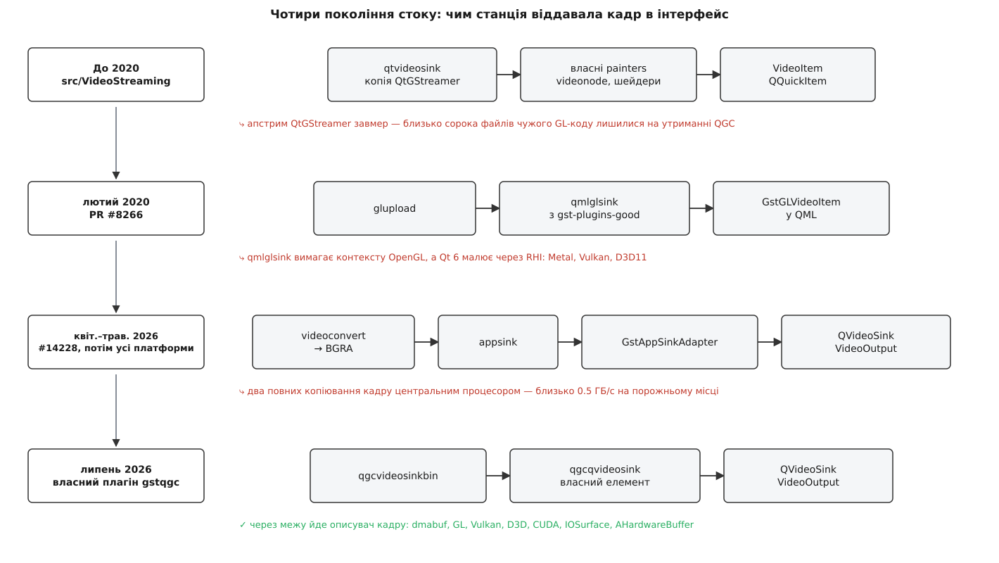

# 📜 Три переписування стоку: як станція віддавала кадри в інтерфейс

Місце, де декодований кадр виходить із конвеєра GStreamer і потрапляє у вікно застосунку, QGroundControl переписував тричі за шість років — і жодного разу не тому, що старий код був поганий. Щоразу під ним рухалася земля: то вмирала бібліотека, з якої код позичили, то Qt переставав малювати через OpenGL. Ця історія варта того, щоб її розказати, бо вона показує, чим насправді визначається довговічність стику двох чужих одна одній систем: не якістю коду по обидва боки, а тим, наскільки глибоко цей код мусить залізти в чужі нутрощі.



*Чотири покоління стоку до сцени; червоний рядок під кожним ланцюгом — те, що змусило переписати наступним.*

## Чому ламається саме стік, а не решта тракту

Варто спершу помітити асиметрію. Джерело відео розмовляє з мережевим стеком операційної системи, депейлоадер — із форматом RTP, декодер — зі стандартом H.264. Це договори, які живуть десятиліттями: `udpsrc` у станції робить сьогодні те саме, що робив десять років тому, і ніхто його не чіпає.

Стік розмовляє з графічною підсистемою застосунку. А та змінюється з кожним великим випуском фреймворка — і не тому, що комусь нудно, а тому, що під нею змінюються самі графічні API операційних систем. Гірше того: щоб віддати кадр без копіювання, стік мусить знати внутрішнє представлення кадру по обидва боки межі — і формат буфера GStreamer, і те, чим для фреймворка є текстура. Знання чужих нутрощів — це і є та глибина залізання, за яку потім платять переписуванням.

Тому в усій цій історії повторюється одна фігура: щоб виграти сьогодні, стік чіпляється за щось приватне; через кілька років приватне змінюється; стік переписують.

## До 2020-го: чужий код, який довелося всиновити

У ранніх версіях станції в теці `src/VideoStreaming/gstqtvideosink/` лежало близько сорока файлів, які малювали кадр самотужки. Там були делегати (`qtquick2videosinkdelegate`, `qwidgetvideosinkdelegate`), малювальники поверхонь (`genericsurfacepainter` для програмного шляху, `openglsurfacepainter` для шляху через OpenGL), вузол сцени `videonode` з власним `videomaterial` — тобто повний набір: від розкладки площин YUV у пам'яті до шейдера, що перетворює їх у RGB на графічному процесорі.

Цей код QGroundControl не писав. Заголовки файлів на теґу `v3.5.6` називають правовласників: **Nokia Corporation, 2010** і **Collabora Ltd., 2011**, ліцензія LGPL 2.1. Разом із назвами елементів (`qtvideosink`, `qtglvideosink`, `qwidgetvideosink`, `qtquick2videosink`) це вказує на **QtGStreamer** — прив'язку GStreamer до Qt, яку розвивала Collabora. *Доказовий статус: заголовки й назви елементів перевірено просто в репозиторії QGC; окремого запису «взято звідти» в репозиторії нема, походження випливає з поєднання правовласників і назв.*

І тут криється проблема, яку код такого роду створює завжди. Копія чужої бібліотеки в репозиторії — це не «безкоштовно взяли»: це зобов'язання. Поки апстрим живий, копію можна оновлювати; коли апстрим завмирає, копія перестає бути копією й стає **власним кодом**, який ніхто в команді не писав і мало хто розуміє. Сорок файлів шейдерів і роботи з форматами пікселів опиняються на утриманні проєкту, чия предметна область — наземна станція, а не графіка.

> 🔧 **Навіщо це.** Різниця між «залежність» і «вендорена копія» — це різниця між тим, хто виправляє помилку. У залежності її виправляє автор, і ти оновлюєш версію; у копії її виправляєш ти. Тому питання «а чи живий апстрим?» — не з ввічливості, а частина оцінки вартости володіння: [форк і апстрим](topic:sf-release/fork-and-upstream) описують, як похідний репозиторій поступово стає самостійним, і чим за це платять, а [вендоринг і сабмодулі](topic:sys-bsystem/vendoring-submodules) — які саме способи внести чужий код у свій репозиторій існують і чим вони різняться.

## Лютий 2020: обмін власного коду на чужий елемент

30 січня 2020 року Andrew Voznytsa (обліковка `andrewvoznytsa`) відкрив у `mavlink/qgroundcontrol` запит на злиття **#8266** із назвою «Switch from builtin video sink to qmlglsink (v2)»; злили його 5 лютого 2020-го. *Доказовий статус: дати, номер і назва перевірені на сторінці запиту в GitHub. «(v2)» у назві прочитується як другий підхід до тієї самої заміни; про перший у самому запиті не сказано. Про особу автора поза обліковкою й підписом у запиті нічого не стверджуємо.*

Мотив автор назвав прямо в описі, і він вартий уваги, бо в ньому два різні бажання. Перше — **знизити вартість утримання QGC**: викинути ті сорок файлів і взяти замість них `qmlglsink`, готовий елемент із набору gst-plugins-good, який робить рівно те саме, але утримує його спільнота GStreamer. Друге, менш очевидне, — **дати змогу перевіряти приймач окремим застосунком**. Поки стік був частиною станції, потік відео можна було випробувати тільки запустивши всю станцію; готовий елемент означає, що приймач можна зібрати як маленьку окрему програму й ганяти її в тестах.

Плата з'ясувалася одразу й описана в тому ж запиті. `qmlglsink` користується **приватними заголовками Qt** — тими, що не входять у публічний інтерфейс і можуть змінитися між випусками. Наслідок: елемент треба збирати тією самою версією Qt, що й станцію, а отже не можна просто покластися на той, що стоїть у системі. Тому код `qmlglsink` внесли в репозиторій як git-піддерево й лінкували статично; динамічний варіант, якщо він знайдеться в шляху плагінів GStreamer, має перевагу.

Помітьте, що сталося. Проєкт позбувся сорока файлів чужого коду — і натомість завів залежність від приватних заголовків Qt. Глибина залізання нікуди не поділася, вона переїхала.

17 лютого 2020-го той самий автор комітом `2246551` «Repackage video sink into GstQgcVideoSinkBin» загорнув усе це в контейнер: з'явилися `gstqgc.c` і `gstqgcvideosinkbin.c` — маленький власний плагін GStreamer, чий єдиний елемент усередині складається з `glupload` і `qmlglsink`, а назовні виглядає як один стік. Решта коду станції відтоді знає одну назву елемента й не знає, що за нею. Це і є той самий плагін `gstqgc`, який живе в станції досі, хоч усередині від нього не лишилося нічого. Про те, як GStreamer узагалі дозволяє додати свій елемент у чужий реєстр і як конвеєр його знаходить, — [модель плагінів](topic:sys-media/plugin-model).

## Квітень 2026-го: графічного API за замовчуванням більше нема

Пастка, закладена 2020 року, спрацювала через шість років, і спрацювала вона не в GStreamer, а в Qt.

`qmlglsink` (у шостій версії Qt — `qml6glsink`) віддає кадр як **текстуру OpenGL**. Поки Qt Quick сам малював через OpenGL, це нічого не коштувало: контекст уже був, текстура лягала в сцену без перекладу. Але Qt 6 малює через шар RHI, який під собою вибирає рідний для платформи API — Metal на macOS, Direct3D 11 на Windows, Vulkan або OpenGL на Linux. Елемент, що вимагає контексту OpenGL, у такому застосунку означає одне: **застосунок мусить примусово перемкнутися на OpenGL** — на macOS це застарілий і вже нерозвиваний API — тільки заради відео.

27 березня 2026-го Don Gagne (обліковка `DonLakeFlyer`) відкрив запит **#14228** «Video: Replace OpenGL qml6glsink with appsink Metal path on macOS»; злили його 8 квітня 2026-го, коміт `c5b0875`, у співавторстві з Holden Ramsey (`HTRamsey`). *Доказовий статус: назви, дати, номери й обліковки перевірені в репозиторії; справжнє ім'я `DonLakeFlyer` узято з його профілю GitHub, ім'я `HTRamsey` — із рядка співавторства в коміті.*

Ланцюг у ньому інший:

```
конвеєр GStreamer → appsink → GstAppSinkAdapter → QVideoSink → VideoOutput (Metal)
```

Тобто замість елемента, що сам уміє малювати, — звичайний `appsink`, який просто віддає буфер у код застосунку, і невеликий перекладач, що робить із цього буфера `QVideoFrame`. Далі Qt робить із кадром що хоче й через що хоче: `QVideoSink` — це публічний інтерфейс, і він не знає нічого про OpenGL. Про те, чим `appsink` відрізняється від справжнього стоку й чому він зручний саме як міст у власний код, — [appsink і appsrc](topic:sys-media/appsink-appsrc).

Спершу це зробили лише для macOS, під умовною збіркою. На початку травня 2026-го Holden Ramsey комітом `4cb9d91` «Video: switch every platform to videoconvert→appsink rendering» поширив шлях на всі платформи, викинувши вендеровані `qml6glsink` і `qml6d3d11sink` разом із завантаженням вихідних кодів gst-plugins-good і gst-plugins-bad, які ті тягли за собою. У повідомленні коміта є ключова фраза: після цього застосунок «більше не шукає контекст OpenGL і не нав'язує графічний API» — Qt сам обирає рідний бекенд.

Історія позбулася двох вендерованих копій і однієї примусової залежности від застарілого API. Але з'явилася нова ціна, і вона арифметична.

**Кадр 1920×1080, після `videoconvert` у BGRA — чотири байти на піксель, тридцять кадрів на секунду.**

```
розмір кадру BGRA = 1920 × 1080 × 4 = 8 294 400 Б ≈ 8.3 МБ
копія у appsink                     ≈ 8.3 МБ × 30 ≈ 249 МБ/с
копія в QVideoFrame перекладачем    ≈ 8.3 МБ × 30 ≈ 249 МБ/с
разом                               ≈ 0.5 ГБ/с memcpy на порожньому місці
```

Півгігабайта на секунду, які центральний процесор перекладає з місця на місце, — і це на машині, де декодер щойно поклав той самий кадр у пам'ять графічного процесора. Такий шлях працює всюди, і саме тому його й обрали як перехідний, — але жити з ним постійно ніхто не збирався.

## Липень 2026-го: власний елемент, але на іншому поверсі

3 липня 2026 року Holden Ramsey влив коміт `9abb6c1` «Video: overhaul GStreamer backend and packaging» — 250 файлів, +24 572 / −12 458 рядків. *Доказовий статус: хеш, назва, дата й обсяг перевірені на сторінці коміта.* Серед іншого він переписав плагін `gstqgc` — той самий, що з'явився 2020-го як обгортка над `qmlglsink`.

Тепер усередині нього власні елементи. `qgcqvideosink` — справжній стік GStreamer, який штовхає декодовані кадри просто в `QVideoSink`; `qgcvideosinkbin` — контейнер, що додає до нього обмеження форматів; `QGCQVideoSinkController` тримає узгодження й телеметрію на боці графічної нитки. Поруч з'явилася тека `HwBuffers`, і саме в ній суть: замість того щоб копіювати пікселі, стік **імпортує кадр там, де він уже лежить** — dmabuf і VA-API на Linux, Vulkan, Direct3D 11 і 12, CUDA, IOSurface на iOS, AHardwareBuffer на Android. Коли жоден із цих шляхів недоступний, працює запасний `CpuVideoFramePool` — той самий копіювальний шлях, але тепер як виняток, а не як норма.

Через межу йде не мегабайти пікселів, а описувач: посилання на пам'ять, яка вже в потрібному місці. Що таке кадр у пам'яті GStreamer і чому «передати буфер» і «скопіювати буфер» — різні дії, розбирають [буфери й пам'ять](topic:sys-media/buffers-and-memory); що відбувається з боку графічного процесора, коли текстуру приймають замість того, щоб її завантажувати, — [текстура на GPU](topic:sf-visual/gpu-texture-upload).

Це не повернення до 2020-го й не визнання, що заміна власного коду на чужий була помилкою. Різниця у **поверсі, на якому проведено межу**. Стік 2019 року знав, як розкласти площини YUV і як написати шейдер. Стік 2026-го не знає про графіку майже нічого: він знає, як описати кадр у термінах `QVideoSink` — публічного інтерфейсу Qt, — а що з ним робити далі, вирішує Qt. Власного коду знову багато, але він увесь про **переклад між двома домовленостями**, а не про малювання.

І межа досі жива: 30 липня 2026-го в цей плагін ліг патч `alireza787b` «preserve Windows software frames» — про кадри, які на Windows приходять без апаратного буфера. Стик двох великих систем не буває доробленим остаточно.

## Нитка, яка проходить через усі три переписування

Кожного разу переписування вимагала **не якість коду, а зміна на тому боці межі, за який стік тримався**.

Перший стік тримався за чужу бібліотеку — вона перестала розвиватися. Другий тримався за приватні заголовки Qt і за припущення, що фреймворк малює через OpenGL, — Qt перестав це припускати. Третій, перехідний, тримався тільки за публічний інтерфейс і тому не зламався — але заплатив за цю незалежність половиною гігабайта копіювань на секунду. Четвертий намагається взяти обидва: публічний інтерфейс назовні, а всю платформозалежну хитрість — усередині власного плагіна, де її можна міняти по одній платформі за раз, не чіпаючи решту.

Заміна власного коду на чужий і назад тут не хитання й не брак рішучости. Це щоразу відповідь на просте запитання: **що дешевше утримувати — сорок файлів шейдерів чи один перекладач між двома чужими домовленостями?** Відповідь змінюється, коли змінюються самі домовленості, а вони змінюються без запиту в проєкта.

Про те, у які саме поняття перекладає кадр сьогоднішній шар — контекст графічного API, поверхня, текстура, чий контекст «поточний» у якій нитці, — [графічні API і контекст](topic:sf-visual/graphics-api-context).
