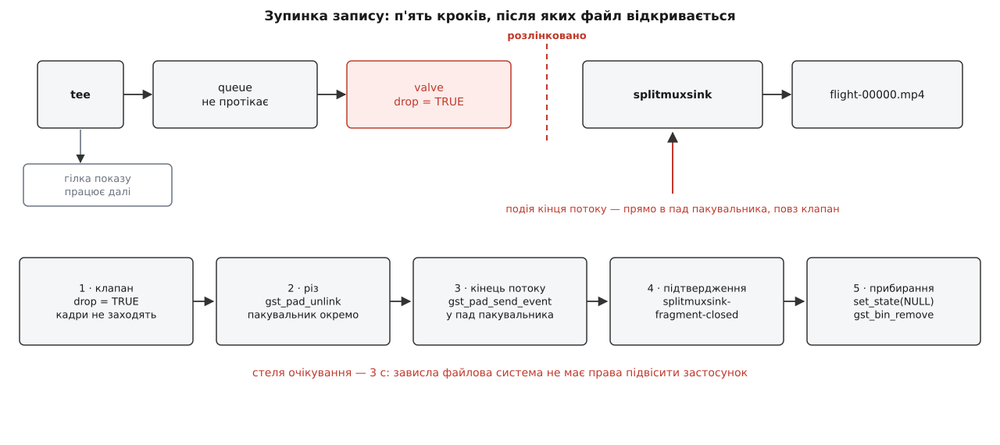

# ⚙️ Мінімальний відеотракт: трійник, черги й клапани

Нижче — повний робочий приймач відео на C: близько двохсот рядків, які беруть H.264 із UDP, показують картинку й одночасно пишуть той самий потік у файл, причому показ і запис вмикаються й вимикаються на ходу, не рвучи з'єднання. Це не ілюстрація до схеми, а програма, яку можна зібрати однією командою й запустити на будь-якому потоці з борту. Уся справжня складність тракту зосереджена в чотирьох місцях, і найшвидший спосіб її побачити — саме код.

## Умова

- Джерело — `udp://0.0.0.0:5600`, усередині RTP з H.264.
- Показ вмикається й вимикається окремо, затримка — якнайменша.
- Запис вмикається й вимикається окремо; у файл лягає прилетілий потік, без перекодування.
- Перемикання будь-чого одного **не чіпає** другого й не рве з'єднання з джерелом.
- Зупинений запис дає файл, який відкриється програвачем.

Складання: `gcc mini.c -o mini $(pkg-config --cflags --libs gstreamer-1.0)`. Потрібен GStreamer 1.20 або новіший — саме там з'явилися `gst_element_request_pad_simple()` і режими скидання в клапана.

## Ідея: граф збирають один раз

Спокуса зробити «просто»: треба запис — доклали гілку, не треба — прибрали. Так робити не можна, і причина не в елегантності. Перебудова графа зачіпає узгодження форматів, а разом із ним — стан декодера, який після скидання чекатиме наступного ключового кадру. На типовому потоці з борту ключові кадри йдуть раз на одну-дві секунди: стільки чорного екрана коштуватиме кожне натискання кнопки «запис».

Тому граф збирають **один раз** і далі не чіпають. Обидві гілки — показу й запису — стоять у ньому постійно, а керування зводиться до однієї булевої властивости на кожній: клапан або пропускає дані, або мовчки їх викидає. Єдиний виняток — пакувальник файлу: його доводиться створювати наново на кожен запис, бо пакувальник, який уже дописав індекс і закрив файл, повторно не вмикається. Це і є найскладніше місце всієї програми, і воно займає в ній одну функцію з п'яти кроків.

```
udpsrc ─ rtpjitterbuffer ─ rtph264depay ─ h264parse ─ tee ┬─ queue ─ valve ─ decodebin3 ─ videoconvert ─ autovideosink
                                                          └─ queue ─ valve ─ [ splitmuxsink ]
```

Квадратні дужки — те єдине, що приходить і йде.

## Хребет

```c
#include <gst/gst.h>

typedef struct {
    GstElement *pipeline, *tee;
    GstElement *view_q, *view_valve, *decode, *convert, *view_sink;
    GstElement *rec_q, *rec_valve, *rec_sink;   /* rec_sink живе лише під час запису */
    gboolean    rec_closing;                    /* чекаємо підтвердження про закриття файлу */
    guint       rec_deadline;
    GMainLoop  *loop;
} App;

static gboolean build_backbone(App *a)
{
    a->pipeline = gst_pipeline_new("video");

    GstElement *src   = gst_element_factory_make("udpsrc",          "src");
    GstElement *jbuf  = gst_element_factory_make("rtpjitterbuffer", "jbuf");
    GstElement *depay = gst_element_factory_make("rtph264depay",    "depay");
    GstElement *parse = gst_element_factory_make("h264parse",       "parse");
    a->tee            = gst_element_factory_make("tee",             "tee");

    if (!a->pipeline || !src || !jbuf || !depay || !parse || !a->tee)
        return FALSE;

    /* Потік про себе нічого не каже: у чистому UDP немає опису сесії,
       тож відповідність «тип навантаження → кодек» задаємо руками. */
    GstCaps *caps = gst_caps_from_string(
        "application/x-rtp, media=(string)video, clock-rate=(int)90000, "
        "encoding-name=(string)H264, payload=(int)96");
    g_object_set(src, "port", 5600, "caps", caps, NULL);
    gst_caps_unref(caps);                 /* g_object_set узяв власне посилання */

    g_object_set(jbuf, "latency",         80,     /* мс запасу — єдина навмисна затримка */
                       "do-lost",         TRUE,   /* сказати декодерові про дірку */
                       "drop-on-latency", TRUE,   /* спізнілий пакет не тримає потік */
                       NULL);

    /* Ми приєднуємось до потоку, який уже йде: набори параметрів мають
       повторюватись на кожному ключовому кадрі, інакше чекати вічно. */
    g_object_set(parse, "config-interval", -1, NULL);

    /* Поки жодну гілку не під'єднано, трійникові немає куди штовхати. */
    g_object_set(a->tee, "allow-not-linked", TRUE, NULL);

    gst_bin_add_many(GST_BIN(a->pipeline), src, jbuf, depay, parse, a->tee, NULL);
    return gst_element_link_many(src, jbuf, depay, parse, a->tee, NULL);
}
```

Один рядок тут вартий окремої уваги — `gst_bin_add_many`. Створений елемент має *плавуче* посилання, і додавання в контейнер його привласнює: з цієї миті елемент належить конвеєрові, і звільняти його самотужки не можна. Наприкінці програми буде рівно один `gst_object_unref` — на весь конвеєр. Це загальне правило [підрахунку посилань](topic:sf-lang/reference-counting): володіє той, хто взяв посилання, а хто отримав його «на подивитися» — не звільняє. Порушення в обидва боки караються однаково: зайвий `unref` дає падіння в чужій нитці, забутий — тихий витік на кожен перезапуск.

## Гілка чіпляється до трійника запитаним падом

У трійника немає готових виходів. Він має шаблон `src_%u`, і кожен вихід треба **запитати** — саме тому кількість гілок не обмежена наперед.

```c
static gboolean link_to_tee(App *a, GstElement *branch, GstPad **keep)
{
    GstPad *tee_pad = gst_element_request_pad_simple(a->tee, "src_%u");
    GstPad *in      = gst_element_get_static_pad(branch, "sink");

    const GstPadLinkReturn ret = gst_pad_link(tee_pad, in);
    gst_object_unref(in);                 /* get_static_pad віддає посилання */

    if (ret != GST_PAD_LINK_OK) {
        gst_element_release_request_pad(a->tee, tee_pad);
        gst_object_unref(tee_pad);
        return FALSE;
    }
    if (keep) *keep = tee_pad;            /* пад лишається на нас */
    else      gst_object_unref(tee_pad);
    return TRUE;
}
```

Запитаний пад — власність того, хто його запитав: спершу `gst_element_release_request_pad()`, аж потім `gst_object_unref()`. Пад, який отримали через `gst_element_get_static_pad()`, лише звільняють. Різниця між запитаними, статичними й тими, що з'являються самі, — тема [падів і з'єднань](topic:sys-media/pads-and-linking): статичний пад існує від народження елемента, запитаний створюють на вимогу, а «іноді-пад» елемент виставляє сам, коли розбереться, що всередині потоку.

## Гілка показу: пад, якого ще немає

```c
static void on_decode_pad(GstElement *dec, GstPad *pad, gpointer user)
{
    App *a = user;
    GstPad *in = gst_element_get_static_pad(a->convert, "sink");
    if (!gst_pad_is_linked(in))
        gst_pad_link(pad, in);
    gst_object_unref(in);
}

static gboolean add_view_branch(App *a)
{
    a->view_q     = gst_element_factory_make("queue",         "view_q");
    a->view_valve = gst_element_factory_make("valve",         "view_v");
    a->decode     = gst_element_factory_make("decodebin3",    "dec");
    a->convert    = gst_element_factory_make("videoconvert",  "conv");
    a->view_sink  = gst_element_factory_make("autovideosink", "view_sink");

    /* Свіжість дорожча за плавність: два буфери, найстаріший — за борт. */
    g_object_set(a->view_q, "max-size-buffers", 2,
                            "max-size-bytes",   0,
                            "max-size-time",    (guint64) 0,
                            "leaky",            2,   /* downstream: викидаємо старе */
                            NULL);

    g_object_set(a->view_valve, "drop",  FALSE, NULL);  /* показ одразу ввімкнено */
    g_object_set(a->view_sink,  "sync",  FALSE, NULL);  /* не тримати кадр до мітки часу */

    gst_bin_add_many(GST_BIN(a->pipeline), a->view_q, a->view_valve,
                     a->decode, a->convert, a->view_sink, NULL);

    if (!gst_element_link_many(a->view_q, a->view_valve, a->decode, NULL)) return FALSE;
    if (!gst_element_link(a->convert, a->view_sink))                       return FALSE;

    /* Вихідного пада в декодера ще немає — він з'явиться, коли той
       розбереться з форматом. Тому лінкуємо не тут, а в обробнику. */
    g_signal_connect(a->decode, "pad-added", G_CALLBACK(on_decode_pad), a);

    return link_to_tee(a, a->view_q, NULL);
}
```

`sync = FALSE` — не оптимізація, а зміна призначення. Звичайний стік тримає кадр до моменту, вказаного в мітці часу; так відтворюють фільм, де важлива рівність темпу. Живий потік цінний іншим: кадр показують одразу, як його декодовано, бо застарілий кадр не потрібен узагалі. Ціна чесна — темп стає нерівним рівно настільки, наскільки нерівний канал.

Гілка показу тече **до** декодера, і це змінює сенс протікальної черги. Викинутий тут буфер — не «пропущений кадр», а шматок стисненого потоку: декодер після нього ще деякий час малюватиме шлейфи, доки не прийде ключовий кадр. Виглядає як погана угода, доки не подивитись на альтернативу. Непротікальна черга не втрачає нічого, зате перетворює будь-яке разове гальмування на **постійне** відставання: заповнилась — і вже ніколи не спорожніє, бо джерело віддає рівно з тією ж швидкістю, з якою гілка споживає. Одноразовий шлейф проти назавжди зіпсованої затримки — вибір очевидний.

## Гілка запису: пакувальник приходить і йде

Постійна частина — черга й клапан. Пакувальник створюють на кожен запис.

```c
static gboolean add_rec_branch(App *a)
{
    a->rec_q     = gst_element_factory_make("queue", "rec_q");
    a->rec_valve = gst_element_factory_make("valve", "rec_v");

    /* У файл мусить лягти все: черга НЕ протікає, обмежена лише часом. */
    g_object_set(a->rec_q, "leaky",            0,
                           "max-size-buffers", 0,
                           "max-size-bytes",   0,
                           "max-size-time",    (guint64) 3 * GST_SECOND,
                           NULL);
    g_object_set(a->rec_valve, "drop", TRUE, NULL);     /* запис поки вимкнено */

    gst_bin_add_many(GST_BIN(a->pipeline), a->rec_q, a->rec_valve, NULL);
    if (!gst_element_link(a->rec_q, a->rec_valve)) return FALSE;

    return link_to_tee(a, a->rec_q, NULL);
}

static void start_recording(App *a)
{
    if (a->rec_sink || a->rec_closing) return;      /* уже пишемо або ще закриваємо */

    a->rec_sink = gst_element_factory_make("splitmuxsink", "rec_sink");
    g_object_set(a->rec_sink, "location",      "flight-%05d.mp4",
                              "max-size-time", (guint64) 60 * GST_SECOND,
                              NULL);

    gst_bin_add(GST_BIN(a->pipeline), a->rec_sink);
    gst_element_link(a->rec_valve, a->rec_sink);    /* пад "video" запитається сам */

    /* Конвеєр уже грає, а новий елемент народився в стані NULL. */
    gst_element_sync_state_with_parent(a->rec_sink);

    /* Клапан відкриваємо ОСТАННІМ — інакше перші буфери прилетять
       у ще не готовий пакувальник. */
    g_object_set(a->rec_valve, "drop", FALSE, NULL);
}
```

Порядок останніх трьох дій — не смак, а вимога. Новий елемент завжди народжується в стані `NULL`, і `gst_bin_add()` його не піднімає; дані, що потраплять у такий елемент, повернуть назад помилку «не під'єднано», а помилка потоку йде вгору через трійник і кладе **весь** конвеєр — разом із показом. `gst_element_sync_state_with_parent()` підтягує новачка до стану конвеєра; про те, чому стани змінюються саме знизу вгору й чому цей виклик не можна забути, — [стани й життєвий цикл](topic:sys-media/states-lifecycle).

Клапан останнім — з іншої причини, і вона неочевидна. Клапан у режимі скидання викидає не лише буфери, а й **липкі події**: опис формату й сегмент часу, без яких пакувальник не знає, що йому дали. Але викидаючи їх, він запам'ятовує, що заборгував, і при відкриванні пересилає їх наново — а перший буфер після відкривання позначає розривом. Саме тому щойно під'єднаний пакувальник отримує повний опис потоку, хоча з'явився посеред передачі. Якби клапан відкрили до під'єднання, ці події пішли б у порожнечу.

> 🔧 **Навіщо це.** Ланцюг «створив — додав — зв'язав — синхронізував стан — відкрив клапан» повторюється щоразу, коли до живого конвеєра щось доростає. Помилка в порядку дає симптоми, що виглядають як зовсім інші поломки: конвеєр падає з помилкою потоку (забули синхронізувати стан) або файл виходить без опису формату й не відкривається (відкрили клапан зарано).

## Зупинити запис так, щоб файл відкрився

Почати запис — один прапорець. Зупинити — п'ять кроків, і кожен із них потрібен.

Причина в будові контейнера. MP4 містить не лише дані, а й індекс: таблицю зі зміщенням, розміром і міткою часу кожного кадру. Скласти її можна тільки тоді, коли всі кадри вже відомі, тобто наприкінці. Обірваний посеред запису файл — це купа даних без опису, і програвач його не відкриє взагалі.



*Подія кінця потоку йде не в конвеєр і навіть не в гілку, а прямо в пад пакувальника — повз закритий клапан, який її б проковтнув.*

```c
static void finish_stop_recording(App *a);

static gboolean on_rec_deadline(gpointer user)
{
    App *a = user;
    g_printerr("пакувальник мовчить 3 с — знімаємо силою, файл може бути битий\n");
    a->rec_deadline = 0;
    finish_stop_recording(a);
    return G_SOURCE_REMOVE;
}

static void stop_recording(App *a)
{
    if (!a->rec_sink || a->rec_closing) return;

    /* 1 · клапан: нові кадри в гілку більше не заходять */
    g_object_set(a->rec_valve, "drop", TRUE, NULL);

    /* 2 · від'єднати пакувальник від решти гілки */
    GstPad *src  = gst_element_get_static_pad(a->rec_valve, "src");
    GstPad *sink = gst_pad_get_peer(src);        /* запитаний пад "video" пакувальника */
    gst_pad_unlink(src, sink);
    gst_object_unref(src);

    /* 3 · подія кінця потоку — ПРЯМО в пад пакувальника.
           Через клапан вона б не пройшла: закритий клапан їсть і події. */
    a->rec_closing = TRUE;
    if (!gst_pad_send_event(sink, gst_event_new_eos()))
        g_printerr("подія кінця потоку не дійшла\n");
    gst_object_unref(sink);

    /* 4 · чекаємо підтвердження — але не вічно */
    a->rec_deadline = g_timeout_add_seconds(3, on_rec_deadline, a);
}

/* 5 · прибирання. Викликається з головної нитки, коли файл уже закрито. */
static void finish_stop_recording(App *a)
{
    if (!a->rec_closing) return;
    a->rec_closing = FALSE;

    if (a->rec_deadline) { g_source_remove(a->rec_deadline); a->rec_deadline = 0; }

    gst_element_set_state(a->rec_sink, GST_STATE_NULL);
    gst_element_get_state(a->rec_sink, NULL, NULL, GST_CLOCK_TIME_NONE);
    gst_bin_remove(GST_BIN(a->pipeline), a->rec_sink);   /* контейнер віддає посилання */
    a->rec_sink = NULL;
}
```

Третій крок — це те, на чому спотикаються всі. Природний порив — надіслати подію кінця потоку конвеєрові: `gst_element_send_event(pipeline, gst_event_new_eos())`. Це працює рівно один раз і кладе все: подія розійдеться в обидві гілки, стік показу теж її отримає й перестане брати кадри. Оператор натиснув «зупинити запис» — і втратив картинку.

Друга спокуса — надіслати подію на початок гілки, у чергу. Не спрацює зовсім: між чергою й пакувальником стоїть щойно закритий клапан, а закритий клапан викидає й події теж. Файл не закриється, і збоку це виглядатиме як зависання.

Тому подія йде в **пад самого пакувальника**, за клапаном. Пад дістають через `gst_pad_get_peer()` ще до розлінковки — після неї сусіда вже не знайти.

Четвертий крок ловить підтвердження. Дописавши індекс і закривши файл, `splitmuxsink` кладе на шину повідомлення від елемента з назвою `splitmuxsink-fragment-closed` — усередині нього ім'я файлу, номер фрагмента, тривалість. Саме його треба чекати: подія `GST_MESSAGE_EOS` не прийде, бо конвеєр надсилає її лише тоді, коли **всі** стоки дійшли до кінця, а стік показу працює далі.

```c
static gboolean on_bus(GstBus *bus, GstMessage *msg, gpointer user)
{
    App *a = user;

    switch (GST_MESSAGE_TYPE(msg)) {
    case GST_MESSAGE_ELEMENT: {
        const GstStructure *s = gst_message_get_structure(msg);
        if (a->rec_closing && s &&
            gst_structure_has_name(s, "splitmuxsink-fragment-closed")) {
            g_print("файл закрито: %s\n", gst_structure_get_string(s, "location"));
            finish_stop_recording(a);
        }
        break;
    }
    case GST_MESSAGE_ERROR: {
        GError *err = NULL; gchar *dbg = NULL;
        gst_message_parse_error(msg, &err, &dbg);
        g_printerr("помилка від %s: %s\n", GST_OBJECT_NAME(msg->src), err->message);
        g_clear_error(&err); g_free(dbg);
        g_main_loop_quit(a->loop);
        break;
    }
    default: break;
    }
    return TRUE;         /* лишаємось на шині */
}
```

Помилки приходять сюди ж, і це не примха реалізації. Виклик, що запустив конвеєр, повернувся успішно ще секунду тому — розірваній згодом сесії немає кому повернути код. Тому все, що стається в чужих нитках, надходить окремим каналом; як шина влаштована й чому повідомлення виловлюють, а не ловлять винятками, — [шина повідомлень](topic:sys-media/bus-and-messages).

Стеля в три секунди — не перестраховка. Пакувальник, що чекає на диск, який заснув, або на мережеву теку, яка відвалилася, не відповість ніколи, і без стелі застосунок лишиться в стані «зупиняю запис» до перезапуску. Три секунди — компроміс: повільний диск встигає, зависла файлова система не тримає.

## Головна функція

```c
static gboolean once_start(gpointer u) { start_recording(u); return G_SOURCE_REMOVE; }
static gboolean once_stop (gpointer u) { stop_recording(u);  return G_SOURCE_REMOVE; }

int main(int argc, char **argv)
{
    gst_init(&argc, &argv);

    App a = { 0 };
    a.loop = g_main_loop_new(NULL, FALSE);

    if (!build_backbone(&a) || !add_view_branch(&a) || !add_rec_branch(&a)) {
        g_printerr("граф не зібрався\n");
        return 1;
    }

    GstBus *bus = gst_element_get_bus(a.pipeline);
    gst_bus_add_watch(bus, on_bus, &a);
    gst_object_unref(bus);

    gst_element_set_state(a.pipeline, GST_STATE_PLAYING);

    g_timeout_add_seconds( 5, once_start, &a);   /* демонстрація: пишемо з 5-ї */
    g_timeout_add_seconds(20, once_stop,  &a);   /* ... до 20-ї секунди */

    g_main_loop_run(a.loop);

    gst_element_set_state(a.pipeline, GST_STATE_NULL);
    gst_object_unref(a.pipeline);                /* єдиний unref, потрібний тут */
    g_main_loop_unref(a.loop);
    return 0;
}
```

## Скільки це коштує

Найцікавіше в цій програмі — те, чого в ній немає. Через її код не проходить жоден піксель і жоден байт потоку.

```
стиснений кадр 1080p30 при 4 Мбіт/с   ≈ 17 кБ      (4 000 000 ÷ 8 ÷ 30)
черга показу: 2 буфери                ≈ 34 кБ,  ≈ 67 мс запасу
черга запису: 3 с                     ≈ 1.5 МБ   (0.5 МБ/с × 3)
буфер вирівнювання: 80 мс             ≈ 2.4 кадру
──────────────────────────────────────────────────────────────
копіювань кадру в коді застосунку     = 0
інструкцій коду застосунку на кадр    = 0
```

Уся робота живе в нитках бібліотеки; застосунок торкається графа лише в моменти перемикання, і кожне таке перемикання — це запис одного прапорця або дві-три дії над падами, тобто стала вартість, незалежна ні від роздільности, ні від тривалости польоту. Пам'ять теж стала: глибина черг задана явно, а не «скільки набіжить».

Це й пояснює, чому весь тракт витримує години польоту без нагляду. Зростати тут просто нічому — за єдиним винятком черги запису, і саме тому її обмежено часом, а не тільки кількістю буферів.

## Пастки

**Гілка без черги.** Приберіть `queue` після трійника — і програма працюватиме, доки диск не задумається на пів секунди. Трійник штовхає дані в обидві гілки в одній нитці: викликав першу, дочекався повернення, викликав другу. Гальмування гілки запису зупиняє й читання із сокета, а пакети, які тим часом прийшли, ядро мовчки викине. Черга — це не запас, а межа ниток; те, що в неї поклали, вибирає вже власна нитка гілки.

**Черга показу без протікання.** `leaky = 0` на гілці показу дає найковарніший симптом: усе працює, картинка йде, а затримка щохвилини більша й ніколи не менша. Раз накопичена черга не розсмоктується.

**Подія кінця потоку не туди.** У конвеєр — вб'є показ. У початок гілки — застрягне в закритому клапані. Правильна адреса одна: пад пакувальника, після розлінковки, до звільнення посилання на пад.

**Новий елемент без синхронізації стану.** `gst_bin_add()` не змінює стану елемента, а дані, що приходять в елемент у стані `NULL`, повертають помилку потоку — і вона кладе весь конвеєр, а не одну гілку.

**Порушений облік посилань.** Правило просте: елемент, доданий у контейнер, належить контейнерові й окремого `unref` не потребує; пад, отриманий через `get_static_pad()` чи `get_peer()`, — потребує; запитаний пад спершу віддають через `release_request_pad()`, тоді звільняють. Витік пада виглядає нешкідливо рівно доти, доки запис не почали вдвадцяте.

**Формат, спільний на всі гілки.** Трійник не вміє віддавати різним гілкам різні формати: пад входу узгоджується один раз, і всі виходи дістають те саме. Якщо пакувальник вимагає одного запакування потоку, а апаратний декодер — іншого, перетин порожній і конвеєр не збереться зовсім, з повідомленням про неузгоджені можливості. Лікується власним `h264parse` всередині кожної гілки — тоді кожна домовляється сама за себе. Як саме рахується перетин і чому він буває порожнім — [узгодження форматів](topic:sys-media/caps-negotiation).

**Запис починається посеред групи кадрів.** Клапан відкрився на залежному кадрі — і перші пів секунди файлу непридатні до перегляду. Лікується пробою на виході клапана, яка відкидає все до першого ключового кадру:

```c
static GstPadProbeReturn wait_keyframe(GstPad *pad, GstPadProbeInfo *info, gpointer u)
{
    GstBuffer *buf = GST_PAD_PROBE_INFO_BUFFER(info);
    if (GST_BUFFER_FLAG_IS_SET(buf, GST_BUFFER_FLAG_DELTA_UNIT))
        return GST_PAD_PROBE_DROP;      /* залежний кадр — у файл не пускаємо */
    return GST_PAD_PROBE_REMOVE;        /* ключовий пройшов, далі не втручаємось */
}
```

**Проба виконується в чужій нитці.** Функція вище працює в нитці потоку, і все написане в ній стає частиною гарячого шляху відео. Змінювати з проби стани елементів не можна взагалі: це прямий шлях до взаємного блокування. Усе, що складніше за прапорець, звідти передають у головну нитку через `g_idle_add()`.

**Тиша, яка не схожа на помилку при не-живому джерелі.** Стік, який жодного разу не отримав кадру, у звичайному конвеєрі не проходить попереднє наповнення, і перехід у стан відтворення не завершується ніколи. Із `udpsrc` цього не видно: живе джерело каже конвеєрові, що наповнення не буде, і стан міняється одразу. Тому граф, який ідеально працює з UDP, здатен намертво зависнути, щойно джерело підмінили файлом «просто щоб перевірити» — а закритий клапан на гілці показу тримає її стік без жодного кадру.

## Перевірка без коду

Той самий граф збирається однією командою, і це найдешевший спосіб розділити «винен мій код» і «винен потік»:

```
gst-launch-1.0 -e \
  udpsrc port=5600 caps="application/x-rtp,media=(string)video,\
clock-rate=(int)90000,encoding-name=(string)H264" \
  ! rtpjitterbuffer latency=80 ! rtph264depay ! h264parse config-interval=-1 \
  ! tee name=t \
  t. ! queue max-size-buffers=2 leaky=2 ! decodebin3 ! videoconvert ! autovideosink sync=false \
  t. ! queue ! splitmuxsink location=flight-%05d.mp4 max-size-time=60000000000
```

Ключ `-e` тут не декоративний: він примушує надіслати подію кінця потоку при перериванні з клавіатури — інакше файл лишиться без індексу, тобто саме з тією поламкою, проти якої написано п'ять кроків зупинки.
