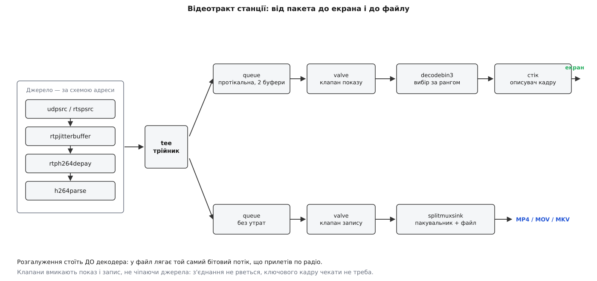
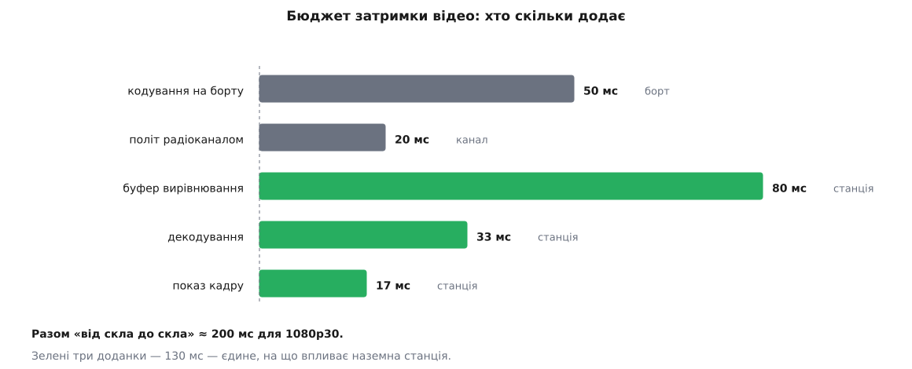
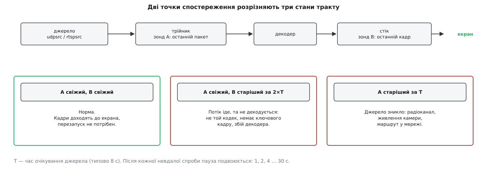

# Відеотракт станції на GStreamer

<preknowlist>
- [Конвеєр GStreamer](topic:sys-media/pipeline-model) — елементи, з'єднання й потік даних: що таке ланцюг обробки медіа й хто в ньому кого штовхає.
- [RTP і RTCP](topic:com-protocol/rtp-rtcp) — як відео їде окремими UDP-пакетами: мітка часу, номер послідовности, тип корисного навантаження.
- [Міжкадрове стиснення](topic:com-signal/inter-frame) — ключові й залежні кадри: чому потік не можна почати декодувати з довільного місця.
- [Процеси й потоки](topic:sf-os/process-vs-thread) — нитка виконання і те, що нитки одного процесу бачать спільну пам'ять.
- [Затримка відео](topic:com-protocol/video-latency) — з чого складається час «від скла до скла» і чому він важливіший за роздільність.
</preknowlist>

Оператор дивиться на екран станції й бачить те, що камера знімала чверть секунди тому. Ця чверть секунди — не властивість заліза й не плата за стиснення: вона складається з кількох доданків, і майже кожен доданок хтось колись явно вибрав. Наземна станція володіє трьома з них. Щоб зрозуміти, звідки вони беруться, доведеться простежити шлях відео від UDP-пакета, який щойно прилетів на порт, до текстури, яку графічний процесор кладе на екран, — і побачити, що на цьому шляху стоїть десяток елементів, кожен із яких можна назвати поіменно й пояснити, чому без нього не обійтися.

Далі йдеться про будову відеотракту в актуальній лінійці QGroundControl, де приймач відео живе в теці `src/VideoManager/VideoReceiver/GStreamer/`. Питання «а в якій версії?» тут доречне: сам стік до сцени переписували двічі, і сьогоднішній вигляд тракту — результат цих переписувань.

## Чому станція не декодує відео сама

Спокуса написати декодування самотужки зникає після першої ж арифметики.

**Типовий потік із борту: 1080p, 30 кадрів/с, H.264, формат кольору 4:2:0 (півтора байта на піксель у декодованому вигляді).**

```
розмір декодованого кадру = 1920 × 1080 × 1.5 = 3 110 400 Б ≈ 3.1 МБ
потік декодованих даних   = 3.1 МБ × 30       ≈ 93 МБ/с
потік стиснених даних     (4 Мбіт/с)          ≈ 0.5 МБ/с
ступінь стиснення                             ≈ 190 разів
```

Ці 190 разів дає складний алгоритм із передбаченням руху, перетворенням блоків і арифметичним кодуванням, і його реалізація в кожному сучасному пристрої винесена в окремий блок кремнію. Написати власний декодер H.264 означало б не тільки повторити стандарт, а й відмовитися від апаратного блока — тобто спалювати процесор ноутбука на роботі, яку графічний процесор виконує майже задарма.

До декодування додається все, що навколо. Потік прилітає загорнутим у RTP, а RTP — у UDP; кадр не влазить у пакет і розрізається на частини, які треба зібрати назад. Джерело може бути не UDP, а сесією RTSP, потоком MPEG-TS по TCP або локальною камерою. Запис треба покласти у контейнер із індексом. І все це має однаково працювати на Windows, Linux, macOS та Android, де апаратні декодери називаються по-різному й підключаються по-різному.

Звідси єдине розумне рішення: станція вбудовує медіаконвеєр GStreamer і сама не торкається ні бітів потоку, ні пікселів. Її роль змінюється — вона більше не обробляє відео, вона **складає ланцюг** із готових елементів і **керує ним**. Уся ця стаття — про те, який саме ланцюг і чому саме такий.

> 🔧 **Навіщо це.** Межа відповідальности проходить рівно тут, і вона визначає, де шукати причину проблеми. Якщо картинка розсипається на квадрати — винен потік або декодер, і код станції в цьому не бере участи взагалі. Якщо картинки немає зовсім або вона запізнюється на секунди — винна побудова ланцюга й політика керування ним, тобто саме той код, який написано в застосунку.

## Три вимоги, з яких виростає весь ланцюг

Ланцюг виглядає складним, доки не знати, звідки взялася кожна його гілка. Насправді вимог до відеотракту рівно три, і кожна додає до схеми одну конструкцію.

**Показати якнайшвидше.** Оператор керує апаратом за картинкою, і півсекунди затримки — це десятки метрів шляху дрона наосліп. Затримка тут важить більше за плавність: краще смикана картинка з відставанням у 150 мс, ніж рівна з відставанням у 600 мс.

**Записати те, що прийшло.** Запис потрібен не для краси, а як доказ і як матеріал для розбору польоту. Тому в файл має лягти той самий бітовий потік, який прилетів по радіо, — без повторного стиснення, яке з'їло б і деталі, і процесор.

**Пережити зникнення джерела.** Радіоканал пропадає постійно: апарат зайшов за пагорб, живлення камери моргнуло, борт перезавантажив передавач. Станція мусить помітити це сама й сама відновитися, бо натискати кнопку в польоті нікому.

Ці три вимоги суперечать одна одній сильніше, ніж здається, і саме з розв'язання суперечностей виростає конкретна форма ланцюга.



*Потік розгалужується до декодування: у файл іде той самий бітовий потік, що прилетів, а показ і запис вмикають клапанами, не чіпаючи джерела.*

## Джерело: чому UDP доводиться описувати руками

Перший елемент ланцюга залежить від того, звідки береться відео, і станція вибирає його за схемою адреси. Це робить окрема фабрика джерел (`GstSourceFactory`), і різниця між схемами глибша за назву елемента.

Для `rtsp://` створюється `rtspsrc`. Цей елемент сам веде [переговори з сервером](topic:com-protocol/rtsp-sdp): RTSP — це протокол керування сеансом, у якому клієнт запитує опис потоку й дістає у відповідь текстовий блок SDP із переліком доріжок, кодеків, номерів типу навантаження й транспортів, а вже потім командою відтворення просить сервер почати надсилати дані. Станція задає йому дозволені транспорти — спершу UDP, з відкотом на TCP, коли UDP перекрито, — час очікування й кількість спроб.

Для `udp://` створюється `udpsrc`, і тут з'являється проблема, якої в RTSP немає. На порт просто сиплються UDP-пакети. У заголовку RTP є номер типу навантаження — але сам по собі цей номер нічого не означає: відповідність «номер → кодек» задається описом сесії, якого при чистому UDP ніхто не надсилав. Елемент не може дізнатися, що всередині, тому формат доводиться повідомити йому руками, як фільтр можливостей:

```
udpsrc port=5600 caps="application/x-rtp, media=(string)video,
                       clock-rate=(int)90000, encoding-name=(string)H264"
  ! rtpjitterbuffer ! rtph264depay ! h264parse ! decodebin3 ! видеостік
```

Саме тому в налаштуваннях станції окремими пунктами стоять «UDP h.264» і «UDP h.265»: користувач повідомляє те, чого потік про себе не каже. Помилка тут дає найпідступніший симптом — пакети йдуть, лічильники ростуть, а картинки немає, бо декодер намагається читати H.265 як H.264.

Ще одна дрібниця джерела, яка стає видною тільки під навантаженням, — розмір приймального буфера сокета. Станція просить у системи великий буфер (до 8 МіБ), і на Linux впирається в стелю `net.core.rmem_max`. Причина проста: якщо застосунок на мить не встиг вибрати дані з сокета, ядро мовчки викидає пакети, а викинутий пакет для відео — це не «трохи гірша якість», а розсипаний макроблок аж до наступного ключового кадру.

Що б не було джерелом, далі однаково потрібні два кроки: дістати шматки потоку з RTP-пакетів (`rtph264depay`) і розібрати їх у структуру, зрозумілу декодерові (`h264parse` або `parsebin`). Для H.265 розбирачеві явно задають повторення службових наборів параметрів на кожному ключовому кадрі. Причина в тому, що станція під'єднується до потоку, який уже йде: якби набори параметрів передавалися один раз на початку, приймач, який запізнився, не мав би чим налаштувати декодер і чекав би вічно.

## Буфер вирівнювання: єдине місце, де затримку додають навмисно

Пакети прилітають по UDP, і UDP не обіцяє нічого: пакети приходять із різними паузами, міняються місцями, губляться. Декодерові ж потрібен рівний потік у правильному порядку.

Розв'язок один — накопичити невеликий запас і видавати з нього рівно. Це загальний прийом для будь-якого потоку реального часу: [буфер вирівнювання](topic:com-signal/jitter-buffer) перетворює непередбачуваний розкид часу приходу на постійну затримку, і що ширший розкид треба поглинути, то більшу затримку доведеться прийняти. Елемент `rtpjitterbuffer` тримає пакети рівно стільки, скільки задано, впорядковує їх за номерами послідовности й віддає далі за мітками часу. Плата очевидна: скільки тримаємо, стільки й додаємо до затримки. Це єдине місце в усьому тракті, де затримку додають свідомо, — і тому єдине місце, де є що налаштовувати.

У станції розмір буфера — окреме налаштування (типово 80 мс, межі від 0 до 2000 мс). Порахуймо, що це означає.

**Потік 1080p30: кадр триває 33.3 мс.**

```
кодування на борту (1–2 кадри)           ≈  33…67 мс
політ пакетів по радіоканалу             ≈   5…40 мс
буфер вирівнювання                       =      80 мс   (≈ 2.4 кадру)
декодування (апаратне, ≈ кадр)           ≈      33 мс
показ (кадровий цикл графіки)            ≈      17 мс
─────────────────────────────────────────────────────
разом «від скла до скла»                 ≈ 168…237 мс
з них під керуванням станції             =     130 мс
```



*Із двохсот мілісекунд відставання станція розпоряджається лише останніми ста тридцятьма, і найбільший з них — той, який вона додає навмисно.*

Вісімдесят мілісекунд — це майже дві третини від того, чим станція взагалі здатна керувати. Тому в налаштуваннях є режим низької затримки, який прибирає буфер повністю. Виграш реальний, але й ціна реальна: без буфера кожен пакет, що прийшов не в тому порядку, стає для декодера втраченим, і картинка починає розсипатися саме тоді, коли зв'язок гіршає, — тобто в найгірший момент.

Між цими крайнощами конвеєр отримує ще кілька політик, і кожна з них — компроміс, зважений саме під радіоканал. Буфер повідомляє про втрачені пакети окремою подією, щоб декодер знав про дірку, а не думав, що дані ще прийдуть. Пакет, що спізнився понад бюджет, викидається, а не затримує весь потік. Запит на повторне надсилання втраченого пакета дозволено, але жорстко обмежено — одна спроба з коротким очікуванням, бо кадр, повторений через сотні мілісекунд, уже нікому не потрібен, а повтор з'їдає той самий канал, який щойно не впорався.

> 🔧 **Навіщо це.** Коли оператор скаржиться на затримку, перше питання — не про мережу, а про це число. Вісімдесят мілісекунд буфера й пів секунди спостережуваного відставання — означає, що причина не тут, і шукати треба на борту (глибина буфера кодера) або в самому декодері. Навпаки, «картинка сиплеться, коли відлітаю далі» при вимкненому буфері — це прямий наслідок налаштування, а не поломка.

## Розбір і декодування: ранг замість списку

Після розбору потік потрапляє в `decodebin3` — елемент, який сам вибирає декодер. Вибір робиться не за списком у коді станції, а за **рангом**: кожен зареєстрований елемент має число, і серед тих, хто вміє прийняти цей формат, перемагає елемент із найбільшим рангом. [Апаратні декодери](topic:com-signal/h264-hardware-codec) — це окремий блок у складі процесора чи відеокарти, який виконує зворотне перетворення H.264 схемою, а не програмою, тож коштує майже нічого за часом центрального процесора; вони реєструються з високим рангом, програмні — з нижчим, тож на машині з робочим апаратним декодером він і візьметься, а на машині без нього все тихо переїде на процесор.

Ця схема гарна тим, що станція не мусить знати назв декодерів на кожній платформі. Але вона ж дає найнеприємніший клас відмов: коли драйвер апаратного декодера побитий, ланцюг збереться «правильно» й не покаже нічого. Тому в налаштуваннях є примусовий вибір родини декодерів — програмний, NVIDIA, VA-API, DirectX 11, VideoToolbox, Intel, Vulkan. Реалізовано це не окремим ланцюгом, а зміною самих рангів у реєстрі: потрібній родині ранг піднімають, решті опускають, і `decodebin3` далі вибирає як завжди — просто з іншими числами.

Тут же ховається дрібниця, яку легко проґавити. Джерело може оголосити не лише відео, і тоді автоматичний вибір слухняно збудує ще й аудіодекодер, який станції не потрібен. Тому при появі опису потоків станція явно відповідає, що бере тільки відеопотік.

> Повний перелік того, що приймач відео виставляє назовні, — [контракт приймача відео](topic:sys-dron/video-pipeline/api-gst-receiver.md): методи запуску й спинення, окремі перемикачі декодування й запису, параметри часу очікування й буфера, сигнали про кадри, помилки й статистику, а також правило, з якої нитки що можна кликати.

## Розгалуження: трійник, черги й клапани

Тепер повернімося до другої вимоги — записати те, що прийшло. Вона визначає **місце** розгалуження, і вибір тут не довільний.

Якби запис брали після декодера, у файл довелося б класти або сирі кадри (93 МБ/с — за десять хвилин 55 ГБ), або результат повторного стиснення. Повторне стиснення означає друге покоління втрат: те, що декодер відновив із похибкою, кодер закодує з новою похибкою поверх. Плюс постійне навантаження на процесор саме тоді, коли він потрібен для показу.

Тому потік розгалужують **до** декодера, елементом `tee` — трійником. У файл лягає той самий бітовий потік, що прилетів по радіо, байт у байт; вартість запису падає до вартости запису на диск.

Розгалуження одразу тягне за собою наслідок, який виглядає технічною дрібницею, а насправді визначає стійкість усього тракту. Трійник штовхає дані в обидві гілки **в тій самій нитці**: він викликає приймальний пад однієї гілки, чекає повернення, потім другої. Отже, якщо одна гілка загальмує — застрягне все, включно з читанням із сокета. Диск на мить задумався над записом — і пакети почали губитися в ядрі.

Розв'язує це елемент `queue`, який ставлять на початку кожної гілки. Черга — це не просто буфер, а **межа ниток**: те, що в неї поклали, вибирає вже власна нитка гілки. Після цього гальмування однієї гілки лишається всередині неї.

Дві черги налаштовані по-різному, і різниця точно відповідає різниці вимог. Черга гілки показу тримає щонайбільше два буфери й **протікає**: коли вона повна, найстарший кадр викидається, а нові приймаються далі. Це саме та поведінка, яку хоче оператор, — краще пропустити кадр, ніж відставати назавжди. Черга гілки запису не протікає: у файл мусить лягти все.

Лишається питання керування. Показ вмикають і вимикають (вікно відео згорнули, апарат не в польоті), запис починають і зупиняють — і робити це перебудовою ланцюга не можна. Перезапуск означає нове з'єднання з сервером RTSP, нове узгодження форматів і, головне, очікування наступного ключового кадру: секунди чорного екрана посеред польоту.

Тому обидві гілки після черги мають **клапан** — елемент `valve` з єдиною властивістю: пропускати чи викидати. Увімкнути запис — зняти прапорець на клапані гілки запису. Вимкнути показ — поставити прапорець на клапані гілки декодування. Джерело при цьому працює далі, з'єднання не рветься, стан конвеєра не змінюється. Керування зводиться до однієї булевої властивости, і саме тому воно миттєве.

> Робочий мінімальний тракт із нуля — [конвеєр із трійником, чергами й клапанами](topic:sys-dron/video-pipeline/proj-min-video-pipeline.md): збірка ланцюга на C, під'єднання гілок динамічними падами трійника, перемикання клапанів, коректне від'єднання гілки й типові пастки (протікальна черга, забутий `queue`, гілка, що тримає весь конвеєр у стані очікування).

## Стік: як кадр потрапляє на екран, не проходячи через головну нитку

Останній елемент гілки показу — стік (англ. sink — злив): той, хто нічого не віддає далі, а віддає кадр назовні, в інтерфейс. І саме тут медіаконвеєр стикається з застосунком, у якого **весь стан живе в одній нитці** й ця нитка не має права блокуватися. Станція має власний стік, написаний спеціально для цього стику.

Проблема стику — знову арифметика. Декодований кадр важить 3.1 МБ, кадрів тридцять на секунду. Звичайний для застосунку спосіб переходу між нитками — покласти копію значення в чергу подій — тут означав би копіювати 93 МБ щосекунди заради того, щоб головна нитка передала масив далі.

Тому через межу передають не кадр, а **описувач кадру**: невелику структуру, яка посилається на пам'ять там, де вона вже лежить. Для апаратних шляхів це взагалі текстура в пам'яті графічного процесора, до якої центральний процесор не торкається жодного разу; конвеєр уміє віддавати такі описувачі для dmabuf на Linux, для OpenGL, Vulkan, Direct3D, CUDA, IOSurface на macOS та AHardwareBuffer на Android. Коли апаратного шляху немає, кадр копіюється — але в буфер із пулу, що переробляється по колу, і копіювання відбувається в нитці потоку, а не в головній.

```
кадр 1920×1080, 4:2:0                     ≈ 3.1 МБ
потік декодованих кадрів                  ≈ 93 МБ/с
описувач кадру, що перетинає межу ниток   ≈ сотня байтів
```

Головна нитка отримує описувач і віддає його сцені; звідти кадр іде до графічного процесора, ніде не побувавши в руках у логіки застосунку. [Модель ниток застосунку](topic:sys-dron/threading-model) називає це чесним винятком: там, де обсяг даних робить копіювання неможливим, доводиться повертатися до спільної пам'яті — і платити за це явною синхронізацією в коді відеотракту.

Дві властивості стоку варто назвати окремо, бо вони прямо відповідають першій вимозі.

**Синхронізація за годинником вимкнена.** Звичайний стік тримає кадр до моменту, вказаного в мітці часу, — так відтворюють фільми, де важлива рівність темпу. Тут це нікому не потрібно: потік живий, і кадр цінний рівно доти, доки свіжий. Тому кадр показують одразу, як тільки він декодований. Побічний ефект чесний: рівність темпу приноситься в жертву свіжості, і при нерівному каналі картинка може смикатися.

**Очікування першого кадру теж вимкнене.** Інакше кожна зміна формату посеред потоку (борт перемкнув роздільність) спиняла б конвеєр до появи нового кадру.

І одна оборонна дрібниця: стік стежить за мітками часу й викидає кадр, мітка якого раніша за попередню. Такі стрибки назад трапляються після втрат і перепідключень, а далі по ланцюгу вони здатні заклинити відмальовку.

> Стік до сцени переписували двічі, і кожен раз — з конкретної причини: [як станція віддавала кадри в інтерфейс](topic:sys-dron/video-pipeline/hist-video-sink.md) — від власного малювання кадрів, через готовий елемент від GStreamer, до власного плагіна з нульовим копіюванням.

## Запис: чому зупинити важче, ніж почати

Почати запис — це зняти прапорець із клапана. Зупинити коректно — найскладніша операція в усьому тракті, і причина лежить у будові контейнерів.

[Медіаконтейнер](topic:com-signal/media-container) — це не сам стиснений потік, а обгортка, яка складає доріжки разом і додає до них опис: MP4 містить не лише дані, а й індекс — таблицю, де для кожного кадру записано зміщення, розмір і мітку часу. Індекс можна скласти лише тоді, коли відомі всі кадри, тобто наприкінці. Якщо процес обірвати посеред запису, на диску лишиться купа даних без опису — програвач такий файл не відкриє взагалі.

Тому зупинка запису — це не «перестати писати», а послідовність із чотирьох кроків. Спершу клапан гілки закривають, щоб нові кадри не заходили. Далі гілку від'єднують від решти конвеєра. Потім у гілку надсилають подію кінця потоку — сигнал «більше нічого не буде», за яким пакувальник дописує індекс і закриває файл. І нарешті станція **чекає** підтвердження, що файл закрито, — з обмеженням у три секунди, щоб зависання пакувальника не підвісило застосунок.

Ключова деталь — подія кінця потоку йде **тільки в гілку запису**. Надіслати її всьому конвеєрові було б простіше, але це поклало б і показ: оператор втратив би картинку від самого лише натискання «зупинити запис».

Проти аварійного завершення є ще один захист, уже всередині пакувальника: індекс періодично переписують наперед (раз на секунду) у заздалегідь зарезервоване місце на початку файлу. Якщо застосунок упаде або зникне живлення, файл лишиться придатним до перегляду — з точністю до останньої секунди. Це саме той компроміс, який має сенс для запису польоту: втратити секунду краще, ніж утратити весь запис.

## Годинник, якого немає: як помічають зникнення потоку

Третя вимога — пережити зникнення джерела — впирається у властивість UDP, про яку легко забути. З'єднання немає. Ніхто не повідомляє, що передавач вимкнувся: просто перестають приходити пакети. Тиша від зниклого борту й тиша від паузи в передаванні виглядають абсолютно однаково.

Значить, розпізнати це можна лише за часом. Станція тримає сторожовий таймер, що спрацьовує раз на секунду й дивиться на **дві** мітки часу, знятих у двох різних точках ланцюга: зонд на трійнику фіксує момент останнього пакета від джерела, зонд на стоці — момент останнього декодованого кадру.



*Одна мітка часу не розрізнила б «джерело замовкло» і «дані йдуть, але не декодуються»; дві точки дають діагноз без здогадів.*

Дві точки замість однієї — не надмірність, а різні діагнози.

**Джерело мовчить довше за час очікування** (типово 8 секунд): даних немає взагалі. Причина поза станцією — радіоканал, живлення камери, маршрут у мережі.

**Дані від джерела йдуть, а декодованих кадрів немає удвічі довше** — потік є, але з нього нічого не виходить. Це вже інший клас причин: помилково вказаний кодек, потік без ключового кадру, декодер, що не впорався або відмовив.

Обидва випадки ведуть до перезапуску тракту, але перезапускати щосекунди немає сенсу: якщо апарат за пагорбом, він там ще хвилину. Тому паузи між спробами подвоюються — 1, 2, 4, 8 секунд і далі, зі стелею в 30 секунд. Одна швидка спроба ловить коротке моргання, а стеля не дає застосунку молотити з'єднаннями годинами.

## Шина: помилки, що приходять збоку

Ланцюг працює у власних нитках, і це змінює саме поняття помилки. Метод, що запустив конвеєр, повернувся успішно ще секунду тому; те, що сервер RTSP розірвав сесію, стається пізніше й **не має кому повернути код помилки**. Тому всі події конвеєра приходять окремим каналом — [шиною повідомлень](topic:sys-media/bus-and-messages): будь-який елемент може покласти в неї повідомлення зі своєї нитки, а застосунок вибирає їх зі свого боку, і саме звідти дізнається про помилки, кінець потоку, зміну затримки й статистику.

З цього потоку повідомлень станція виловлює кілька видів, і кожен обробляється по-своєму.

**Помилка** — не завжди привід усе зупиняти. Живий приклад із коду: при отриманні H.265 деякі камери надсилають пакет із агрегацією, якої елемент розпакування не підтримує; повідомлення про помилку прилітає, але потік від цього не гине. Тому помилки розділено на відновні (записати в журнал і жити далі) і фатальні (перезапустити тракт із тією самою наростальною паузою).

**Кінець потоку** приходить і від нормальної зупинки, і від від'єднання гілки — тому обробник дивиться на те, чого зараз чекають: згортання всього тракту, від'єднання гілки декодування чи закриття файлу.

**Статистика якости** приходить від декодера й стоку — скільки кадрів оброблено, скільки викинуто, який зараз розкид затримки. Показувати це в інтерфейсі корисно, але прилітають такі повідомлення десятками на секунду, і кожне з них означало б перерахунок прив'язок в інтерфейсі. Тому лічильники накопичуються в атомарних змінних, а сигнал в інтерфейс іде **раз на такт сторожового таймера** — тобто раз на секунду.

**Зміна затримки** зобов'язує конвеєр перерахувати власний бюджет часу: коли з ланцюга зник чи з'явився елемент із власною затримкою, розподіл змінюється, і про це треба сказати всім елементам.

Окремо про діагностику. Конвеєр уміє вивантажити власну схему у файл графа — у момент запуску, при появі гілок, при помилці й при спрацюванні сторожового таймера. Це не декоративна можливість: питання «чи справді зібрався саме той ланцюг, який я задумав» інакше не має відповіді, бо частина елементів створюється автоматично й уже під час роботи.

## Що ламається і як це видно

Симптоми відеотракту оманливі: різні причини дають на екрані те саме. Розділяє їх знання ланцюга.

**Чорний екран, а лічильники даних ростуть.** Пакети приходять, декодованих кадрів немає. Найчастіше — невідповідність оголошеного й справжнього кодека (вибрано H.264 замість H.265) або відсутність ключового кадру: борт надсилає лише залежні кадри, і декодерові немає від чого відштовхнутися. Обидва випадки сторожовий таймер бачить як «джерело живе, декодування мертве».

**Картинка є, але розсипається квадратами й тягне шлейфи.** Втрати в каналі. Декодер відновлює кадр із неповних даних, і похибка тягнеться доти, доки не прийде наступний ключовий кадр. Код станції тут ні до чого — але буфер вирівнювання, поставлений у нуль, робить цей симптом значно частішим.

**Затримка росте з часом і не повертається.** Десь накопичується черга. Джерело віддає швидше, ніж споживає гілка, а черга гілки не протікає — і кожна секунда додає до відставання. Тому черга показу свідомо зроблена протікальною: викинутий кадр — це разова втрата, а невикинутий перетворюється на постійне відставання.

**Відео йде рівно, а інтерфейс не реагує.** Показовий випадок: він доводить, що застрягла головна нитка застосунку, а не відеотракт, — кадри в неї не заходять і від її стану не залежать. Шукати треба блокувальний виклик у логіці застосунку.

**Записаний файл не відкривається.** Запис зупинили не тим шляхом — або застосунок завершився аварійно раніше, ніж пакувальник дописав індекс. Періодичне переписування індексу рятує все, крім останньої секунди; повне зникнення файлу означає, що подія кінця потоку до пакувальника не дійшла.

**На одній машині все працює, на іншій — чорний екран.** Класика автоматичного вибору за рангом: на другій машині взявся апаратний декодер із побитим драйвером. Перевіряється за хвилину — примусовим програмним декодуванням у налаштуваннях.

## Станція володіє графом, а не кадрами

Якщо звести весь тракт до одного речення, воно буде таким: **застосунок не бачить жодного кадру**. Через його код проходять адреси, прапорці клапанів, мітки часу зондів, повідомлення шини й описувачі буферів — і жодного разу самі пікселі. Уся робота з даними відбувається в чужих нитках чужої бібліотеки, а станція володіє графом та політикою: який елемент поставити джерелом, скільки тримати в буфері вирівнювання, куди розгалузити, коли відкрити клапан, за яким мовчанням перезапустити.

Найкращий доказ цього — у самому репозиторії: той самий приймач відео зібрано ще й окремим маленьким застосунком без інтерфейсу, який показує потік і пише файл. Він працює, бо весь відеотракт не має жодної залежности від решти станції — ні від об'єкта апарата, ні від фактів, ні від карти. І це підказує, з чого починати, коли відео не працює: відтворіть той самий ланцюг однією командою `gst-launch-1.0`. Якщо він показує — проблема в керуванні й налаштуваннях станції. Якщо ні — станція взагалі ні до чого, і шукати треба на іншому кінці радіоканалу.
