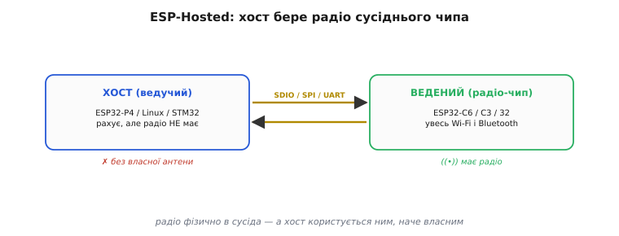
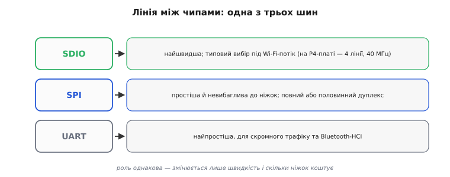
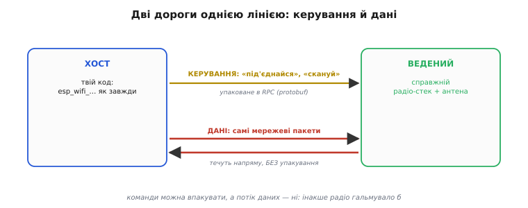
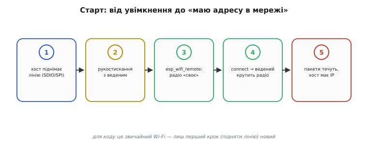
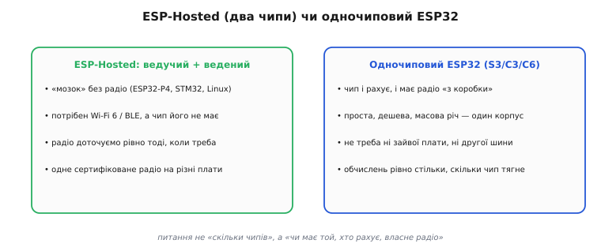

# ESP-Hosted

Буває, що серце пристрою — потужний чіп, який чудово рахує й малює, але радіо в ньому немає зовсім. Найяскравіший приклад — [ESP32-P4](topic:hw-arch/esp32-p4): швидкі ядра, гори пам'яті, інтерфейси камери й дисплея, та **жодного Wi-Fi чи Bluetooth усередині**. А мережа пристроєві однаково потрібна. Перша думка — «доведеться брати інший чіп» — хибна: радіо можна **позичити в сусіда**. Поряд ставлять дешевий ESP32 із родини, у якому радіо є, з'єднують два чипи коротким дротом — і потужний «мозок» починає користуватися чужою антеною так, ніби вона власна. Технологія, що це робить, зветься **ESP-Hosted** (англ. *hosted* — «ведений», той, кого приймає в себе ведучий-*host*): радіо фізично живе в одному чипі, а керує ним і шле через нього дані — інший.


*Суть ESP-Hosted. Ліворуч — **ведучий** (host): сильний обчислювач (ESP32-P4, а може бути й Linux-комп'ютер чи STM32), що радіо не має. Праворуч — **ведений** (slave): дешевий ESP-чип, у якому є весь Wi-Fi і Bluetooth. З'єднує їх швидка дротова шина. Радіо лишається в сусіда, але ведучий користується ним, наче власним.*

### Радіо як співпроцесор

Щоб зрозуміти ідею, корисно поглянути на неї звичною для МК міркою — **поділ праці між чипами**. У класичному [ESP32 радіо вмонтоване в той самий кристал](topic:hw-arch/esp32-architecture), що й ядра: один чіп і рахує, і виходить у мережу. ESP-Hosted розриває цю зв'язку й розкладає дві ролі на **два окремі чипи**. Один — ведучий — бере на себе обчислення й логіку застосунку. Другий — ведений — стає **радіо-співпроцесором**: маленьким спеціалізованим помічником, чия єдина робота — тримати Wi-Fi і Bluetooth і виконувати те, що накаже ведучий.

Це та сама думка, що й [винесення важкої роботи на окремий вузол](topic:hw-arch/dma-controller), тільки на рівні цілих чипів: замість того щоб обтяжувати головний процесор радіо-стеком, його віддають дешевому супутникові, який нічим іншим не зайнятий. Ведучий каже «під'єднайся до цієї мережі», «надішли цей пакет», «поскануй ефір» — а ведений виконує й повертає результат. Для ведучого радіо ніби є; насправді воно просто в сусідньому корпусі.

Веденим може бути майже будь-який ESP-чип із радіо: ESP32, ESP32-C3, ESP32-C6, ESP32-S3 та інші з родини. Найтиповіший тандем сьогодні — **ESP32-P4 як ведучий і ESP32-C6 як ведений**: P4 рахує й малює, а копійчаний C6 поряд дає сучасний Wi-Fi 6 і Bluetooth Low Energy. Ведучим же не конче має бути ESP: ESP-Hosted уміє так само обслуговувати **Linux-комп'ютер** чи інший мікроконтролер (як-от STM32) — будь-кого, кому бракує власного радіо.

> 🔧 **Навіщо це.** Така схема дає головну свободу — [платити лише за те, що потрібно](root:embedded/esp32-vs-8bit). Будуєш пристрій на P4 заради екрана й камери, а зв'язок вторинний? Додав один дешевий C6 — і маєш Wi-Fi; не додав — заощадив місце, гроші й [клопіт із сертифікацією радіо](root:embedded/esp32-vs-8bit). Те саме рятує, коли «мозок» — не ESP взагалі: старий проєкт на STM32 чи на Linux-платі дістає Wi-Fi і Bluetooth, не міняючи головного чипа, — лиш доточуєш поряд ESP-радіо.

### Лінія між чипами: SDIO, SPI чи UART

Два чипи треба чимось з'єднати — і тут постає природне питання: якою шиною? ESP-Hosted дає три варіанти, і вибір між ними — це вибір **швидкості проти простоти**.


*Лінію між ведучим і веденим будують однією з трьох шин. **SDIO** — найшвидша, типовий вибір під щільний Wi-Fi-потік. **SPI** — простіша й невибагливіша до ніжок, у повному чи половинному дуплексі. **UART** — найскромніша, для невеликого трафіку та для Bluetooth. Роль у всіх однакова; різниться лише пропускна здатність і ціна в ніжках.*

**SDIO** (англ. *Secure Digital Input/Output* — та сама чотирилінійна шина, якою спілкуються [карти пам'яті](topic:hw-arch/psram)) — найшвидша з трьох і типовий вибір, коли треба гнати справжній мережевий потік. На офіційній платі-зв'язці [ESP32-P4](topic:hw-arch/esp32-p4) із C6 вона налаштована саме так: чотири лінії даних на частоті 40 МГц — цього вистачає, щоб Wi-Fi не задихався. **SPI** — простіша й невибагливіша шина: ніжок треба менше, а керувати нею легше, тож її беруть, коли SDIO зайва або фізично незручна; працює і в повному, і в половинному дуплексі. **UART** — найскромніша: [звичайний послідовний порт](topic:com-protocol/stream-parser) на дві лінії; пропускної здатності в нього мало, тож його лишають для невеликого трафіку або для Bluetooth, що сам по собі не вимагає широкої труби.

Важливо, що **роль шини від цього не змінюється** — змінюється лише, скільки даних протече за секунду й скільки ніжок це коштує. Той самий код ведучого працює над будь-якою з трьох: яку шину обрано, вирішують на етапі складання прошивки, а вище за транспорт усе виглядає однаково.

### Дві дороги однією лінією: керування й дані

Коли по одному дроту тече і керування радіо, і самі мережеві пакети, виникає тонкість, варта окремої уваги. Це **дві різні за природою речі**, і ESP-Hosted поводиться з ними по-різному.


*Одна лінія несе дві дороги. **Керування** (під'єднайся, скануй, дай стан) — це рідкі команди: їх упаковують у структуроване повідомлення-RPC і шлють туди-сюди. **Дані** — самі мережеві пакети — течуть в обидва боки **напряму, без упакування**, бо їх багато й кожен зайвий крок гальмував би потік.*

Перша дорога — **керування**. Це команди на кшталт «з'єднайся з мережею Х», «дай мені список точок доступу», «який зараз стан». Таких повідомлень небагато, зате вони складні за структурою — мають поля, параметри, відповіді. Тому їх передають як **виклик віддаленої процедури** (англ. *remote procedure call*, RPC — «виклик процедури, що виконується не тут, а на тому кінці лінії»): ведучий пакує команду в акуратне структуроване повідомлення, ведений його розпаковує, виконує й шле назад відповідь. Це той самий [спосіб серіалізації структур у байти й назад](topic:sf-algorithms/bits-bytes-endianness), яким загалом передають складні дані між пристроями.

Друга дорога — **самі мережеві дані**, ті пакети, що йдуть у Wi-Fi і назад. Їх багато, вони течуть суцільним потоком — і ось їх **не пакують у жодне RPC**. Кадр просто перекидають через лінію як є. Причина суто практична: упаковувати-розпаковувати кожен пакет означало б додати роботу на кожному байті потоку, а потоку того — мегабіти за секунду. Команд мало — їх можна дозволити собі впакувати; даних багато — їх женуть напряму, щоб радіо працювало на повну. Цей поділ «рідке керування пакуємо, щільні дані — ні» і є ключ до того, чому ESP-Hosted не стає вузьким горлом.

### Для коду це звичайний Wi-Fi

Найприємніше в ESP-Hosted — те, що вся ця механіка з двома чипами й лінією між ними **майже не видна з програми**. Espressif зробила прошарок (його звуть *Wi-Fi Remote* — «віддалене радіо»), який підставляє коду **ті самі знайомі виклики ESP-IDF**, якими керують радіо в звичайному ESP32. Твоя програма кличе `esp_wifi_init()`, `esp_wifi_connect()` — точнісінько як на одночиповому ESP32, — а прошарок тихо переадресовує ці виклики через лінію до веденого. Для застосунку це **виглядає так, ніби виклик Wi-Fi цілком звичайний**; те, що радіо насправді в сусідньому чипі, ховається під капотом.

Звідси й те, що ведучий зрештою дістає **повноцінний мережевий інтерфейс** — рівно такий, який підставив би вбудований Wi-Fi: той самий стек з IP-адресою, через який ідуть [сокети TCP і UDP](topic:sf-os/sockets-tcp-udp), на якому підіймають [вебсервер](topic:sf-devices/web-server-mcu) чи будь-який інший мережевий код. Програма не знає й не мусить знати, що пакети дорогою стрибають через SDIO в інший корпус.

> 🔧 **Навіщо це.** Це і є те, заради чого ESP-Hosted узагалі варто брати: ти **не переписуєш мережевий код** під «два чипи». Усе, що вмів робити з Wi-Fi на звичайному ESP32, працює тут так само — від `esp_wifi_connect()` до сокетів і HTTP. Новим лишається єдине: на самому старті треба підняти **лінію до веденого** (вказати, яка шина й на яких ніжках). Далі — звичайний Wi-Fi.

### Робочий приклад: підняти лінію й вийти в мережу

Покажемо повне коло на стороні ведучого — від увімкнення до миті, коли пристрій уже в мережі. Уся «особливість» ESP-Hosted стискається в **один початковий крок**: ініціалізувати транспорт до веденого. Після нього код нічим не відрізняється від звичайного Wi-Fi на ESP32.


*Що відбувається на старті ведучого. Спершу він піднімає лінію (SDIO чи SPI) до веденого; далі два чипи роблять рукостискання; потім прошарок Wi-Fi Remote підставляє радіо як «своє»; команда connect іде до веденого, і той крутить справжнє радіо; нарешті пакети течуть, і ведучий має адресу в мережі. З усього ланцюга по-справжньому новий лише перший крок.*

**Умова: на ведучому (ESP32-P4) підняти транспорт до веденого (ESP32-C6) по SDIO, ініціалізувати Wi-Fi звичним ESP-IDF API, під'єднатися до точки доступу й дочекатися отримання IP-адреси.**

```cpp
#include "esp_hosted.h"     // транспорт до веденого
#include "esp_wifi.h"       // той самий звичний Wi-Fi API
#include "esp_netif.h"
#include "esp_event.h"

void app_main(void)
{
    // 0) службове: цикл подій і мережевий інтерфейс — як на звичайному ESP32
    esp_event_loop_create_default();
    esp_netif_init();
    esp_netif_create_default_wifi_sta();

    // 1) ЄДИНИЙ новий крок: підняти лінію до веденого (тут — SDIO).
    //    Яка шина й ніжки — задано в конфігурації прошивки.
    esp_hosted_init();          // рукостискання з ESP32-C6 по транспорту

    // 2) далі — звичайний ESP-IDF Wi-Fi: виклики ті самі, що й на одночиповому ESP32,
    //    але Wi-Fi Remote тихо переадресовує їх через лінію до веденого
    wifi_init_config_t cfg = WIFI_INIT_CONFIG_DEFAULT();
    esp_wifi_init(&cfg);

    wifi_config_t wc = {
        .sta = { .ssid = "MyNetwork", .password = "secret123" },
    };
    esp_wifi_set_mode(WIFI_MODE_STA);
    esp_wifi_set_config(WIFI_IF_STA, &wc);
    esp_wifi_start();
    esp_wifi_connect();         // команда йде до C6 — радіо крутить ВІН

    // 3) звідси й далі ведучий має повноцінний мережевий інтерфейс:
    //    приходить подія IP_EVENT_STA_GOT_IP, відкриваються сокети, HTTP тощо
}
```

Розберімо, що тут відбувається крок за кроком. Рядок `esp_hosted_init()` — **єдине, що відрізняє цю програму від звичайного ESP32**: він піднімає обрану шину (SDIO в нашому разі) і робить рукостискання з ESP32-C6 на тому кінці лінії. Усе, що нижче, — дослівно той самий код, який під'єднав би до Wi-Fi одночиповий ESP32: `esp_wifi_init`, `esp_wifi_set_config`, `esp_wifi_connect`. Різниця лиш у тому, що тепер за цими викликами **радіо крутить C6**, а не сам чіп: прошарок Wi-Fi Remote перехоплює їх і шле командами-RPC через лінію. Коли C6 під'єднається до точки доступу, ведучому приходить звична подія «отримав IP» — і з цієї миті P4 має повноцінний мережевий інтерфейс: відкривай сокети, піднімай сервер, роби будь-що мережеве. Радіо в сусідньому чипі для цього коду цілком невидиме.

Гарна практична деталь: на офіційній платі ESP32-P4-Function-EV-Board ESP32-C6 **уже прошитий** прошивкою веденого, а лінія SDIO налаштована на заводі, тож Wi-Fi працює **з першого ввімкнення**, без жодного ручного зведення двох чипів. Більше того — прошивку веденого можна потім **оновлювати «по повітрю» прямо з ведучого**, не чіпаючи C6 ні кабелем, ні програматором: ведучий сам перешиє супутника через ту саму лінію.

### Коли ESP-Hosted, а коли одночиповий ESP32

Зведімо чуття вибору. ESP-Hosted — не «кращий спосіб робити Wi-Fi», а відповідь на конкретну ситуацію, і брати його без потреби — зайве ускладнення. Питання навіть не «скільки чипів ставити», а тонше: **чи має той чіп, що рахує, власне радіо**.


*Дві колонки тригерів. Ліворуч — на користь ESP-Hosted: «мозок» без радіо (ESP32-P4, STM32, Linux), потрібен Wi-Fi 6 чи BLE, якого в нього нема; радіо доточуємо рівно тоді, коли треба; одне сертифіковане радіо на різні плати. Праворуч — на користь одночипового ESP32: чип і рахує, і має радіо «з коробки»; проста дешева масова річ; не треба ні зайвої плати, ні другої шини.*

**ESP-Hosted виправданий**, коли обчислювальне серце пристрою радіо не має:
- головний чіп — **сильний, але без радіо**: [ESP32-P4](topic:hw-arch/esp32-p4) заради екрана, камери чи важких обчислень;
- «мозок» — узагалі **не ESP**: Linux-плата чи STM32, яким треба доточити Wi-Fi і Bluetooth;
- хочеться **одне сертифіковане радіо** ставити на різні вироби, не переробляючи головний чіп.

**Одночиповий ESP32 (S3/C3/C6) кращий**, коли той самий чіп має і рахувати, і виходити в мережу:
- звичайний під'єднаний пристрій, де [вбудоване радіо ESP32](topic:hw-arch/esp32-architecture) робить усе само — і обчислення тут скромні;
- проста, дешева, масова річ, якій два чипи й друга шина — зайвий тягар;
- треба **єдиний самодостатній корпус** без супутника й зайвої плати.

Отже, ESP-Hosted не змагається з одночиповим ESP32 — він **затуляє діру**, що з'явилася, коли в родині постали потужні чипи [без радіо на борту](root:embedded/esp32-family). Там, де «мозок» і радіо живуть в одному кристалі, він не потрібен; там, де їх розвели на два чипи, він робить так, що для коду вони знову зливаються в один — потужний обчислювач із повноцінною мережею, хай і позиченою в сусіда.

---
