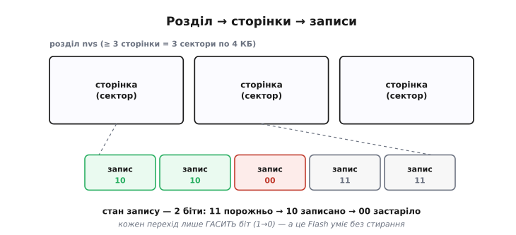
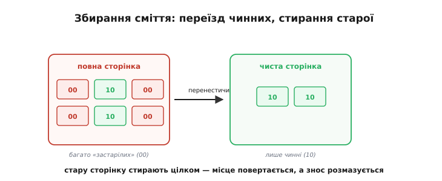

# ⚙️ NVS зсередини: журнал записів, сторінки, збирання сміття

NVS зовні — чарівний словник: кладеш пару «ключ → значення», читаєш її назад навіть після раптового вимкнення. Тут зазирнемо під капот і побачимо, як він тримає слово «надійно» на впертому Flash, де переписати на місці не можна, а кожне стирання наближає знос.

## Задача

NVS обіцяє багато: побайтово оновлювані пари «ключ → значення», стійкість до втрати живлення й бережливість до зносу. Але Flash нічого з цього **задарма** не дає: переписати на місці не можна (спершу [стерти сектор](topic:hw-components/flash-internals)), а кожне стирання наближає [знос](topic:sf-data/wear-leveling). Як же побудувати зручний словник на такому неподатливому фундаменті?

## Ідея

NVS не переписує — він **дописує**. Розділ nvs ділиться на **сторінки** (кожна = один сектор, 4 КБ), а сторінка — на однакові **записи**. Щоб задати чи змінити ключ, NVS бере вільний запис, кладе туди {ключ, значення} і позначає його «записаний». Старий запис того ж ключа він фізично не чіпає — лише позначає «застарілий». Прочитати ключ — означає знайти **останній** запис із позначкою «записаний» для нього.


*Розділ nvs ділиться на сторінки (по сектору), сторінка — на записи. Оновлення дописує новий запис і гасить старий. Стан запису — 2 біти: 11 (порожньо) → 10 (записано) → 00 (застаріло); кожен перехід лише гасить біт, а це Flash уміє без стирання.*

Найхитріше — як **міняти позначку** запису, не стираючи сектор. Тут NVS спирається на фізику Flash: пам'ять уміє **гасити** окремі біти (1→0) без стирання, а от ставити (0→1) — лише стиранням цілого сектора. Тому стан запису кодують **двома бітами**: `11` — порожньо, `10` — записано, `00` — застаріло. Кожен перехід (`11→10`, `10→00`) лише **гасить** біт — і робиться без жодного стирання. Елегантно: рух стану в один бік ідеально лягає на правило «гасити можна, ставити — ні».

Застарілі записи, звісно, накопичуються й з'їдають місце. Коли сторінка заповнюється, вступає **збирання сміття**: NVS бере повну сторінку, **переносить** із неї живі (ще «записані») записи на чисту сторінку, а стару **цілком стирає**. Місце, з'їдене застарілими, повертається у вжиток, а заразом записи переїжджають на нову сторінку — і знос розмазується по всьому розділу сам собою.


*Коли сторінка повна й застарілих багато, NVS переносить лише чинні записи на чисту сторінку, а стару стирає цілком. Так повертають місце, з'їдене застарілими, і заразом розмазують знос по сторінках.*

## Алгоритм у трьох діях

Уся внутрішня логіка NVS — це три короткі дії над записами й сторінками (це логіка самої бібліотеки, не ваш код): як задати ключ, як його прочитати і як прибрати, коли сторінка повна.

```
set(ключ, значення):
    e = вільний запис на активній сторінці   (нема місця → збирання сміття)
    записати { ключ, значення } у e
    позначити e = «записаний»                (11 → 10)
    якщо для ключа був старий запис:
        позначити старий = «застарілий»       (10 → 00)

get(ключ):
    знайти останній запис із позначкою «записаний» і цим ключем
    повернути його значення

збирання сміття:
    обрати повну сторінку з багатьма «застарілими»
    перенести всі «записані» записи на чисту сторінку
    стерти стару сторінку цілком
```

## Чому дописування справді рятує ресурс

Здавалося б, дописувати замість переписувати — лиш дрібна хитрість. Та порахуймо, наскільки вона подовжує життя чипа, і стане видно, що це і є серце задачі.

Уявімо лічильник, який ми оновлюємо щохвилини, а сторінка nvs тримає, скажімо, сто записів. Якби кожне оновлення стирало й переписувало **той самий** сектор, ми палили б один цикл стирання за хвилину — а Flash витримує близько 100 000 стирань на сектор:

```
наївний спосіб (стирати-переписувати щоразу):
  1 стирання / хв
  100000 стирань ÷ (60 хв/год · 24 год) ≈ 69 днів — і сектор мертвий
```

NVS натомість лягає в **новий** запис щоразу й стирає сектор лише раз на сто оновлень — коли сторінка заповниться й спрацює збирання сміття:

```
NVS (дописування + збирання сміття, 100 записів на сторінку):
  1 стирання / 100 хв
  100000 стирань · 100 хв ÷ (60 · 24) ≈ 6900 днів ≈ 19 років
```

Та сама залізяка, той самий ресурс — а життя сектора виросло **в сотню разів**, рівно у стільки, скільки записів влазить на сторінку перед стиранням. Звідси й практичний висновок наступного розділу: більше записів на сторінку — рідші стирання, тож не варто роздувати кожен ключ без потреби, а тим паче бити commit у щільному циклі.

## Складність і пастки на МК

- **Читання — це пошук.** `get` пробігає записи: O(n). NVS тримає це швидким, бо розділ малий, а службові дані кешуються; та все ж не сподівайтеся на «миттєво, як у RAM».
- **Великі значення дробляться.** Рядок чи blob, що не влазить в один (32-байтовий) запис, NVS ріже на **шматки** в кількох записах і збирає назад при читанні.
- **Цілість кожного запису.** Запис несе свою позначку (а дані — контрольну суму), тож збій посеред дописування лишає запис у стані «не дописано» — і NVS його ігнорує (той самий захист, що дає [цілість запису на Flash](topic:sf-data/write-integrity)).
- **Потрібен запас сторінок.** Збиранню сміття **нема куди** переносити живе, якщо немає вільної сторінки: щоб звільнити повну сторінку, треба спершу перелити з неї чинні записи кудись-інде, а отже, бодай одна сторінка має весь час лишатися порожньою про запас. Тому розділ nvs не може бути в одну сторінку — стандарт ESP-IDF вимагає щонайменше **три сектори** (0x3000 = 12 КБ), де принаймні один завжди тримають вільним під переїзд. Якщо ключів багато або ви часто їх оновлюєте, розділ варто зробити більшим: що більше вільних сторінок, то рідше доводиться зупинятися на збирання сміття.
- **Збій під час збирання.** NVS стирає стару сторінку **лише після** того, як нова повністю готова, — отже, перерване збирання відновлюване, бо живі записи весь час є щонайменше в одному місці (той самий [атомарний перемикач](topic:sf-data/write-integrity), що рятує запис від обриву живлення).
- **Часті записи все одно коштують.** Кожен `set` — це дописування, а ланцюжок дописувань рано чи пізно заповнює сторінку й запускає стирання через збирання сміття. Дописування дешевше за стирання-на-місці, але не безкоштовне: сота частина від наївного зносу — це все ще знос. Тому порада проста й непохитна: збирайте зміни й закріплюйте їх зрідка, а не пишіть у щільному циклі.

## Підсумок

NVS — це **журнал**, що прикидається словником: дописуй, гаси старе двома бітами, прибирай повні сторінки збиранням сміття. За цей журнал платять одним — пошуком замість миттєвого доступу за адресою; натомість дістають дві речі, яких «голий» Flash просто так не дає: стійкість до обриву живлення, бо нове значення завжди з'являється цілим раніше, ніж старе оголошено недійсним, і розтягнутий у сотні разів ресурс, бо записи розповзаються, а стирання трапляються зрідка. Три прості правила — і на впертому Flash виходить зручне, надійне й бережливе сховище «ключ → значення».
