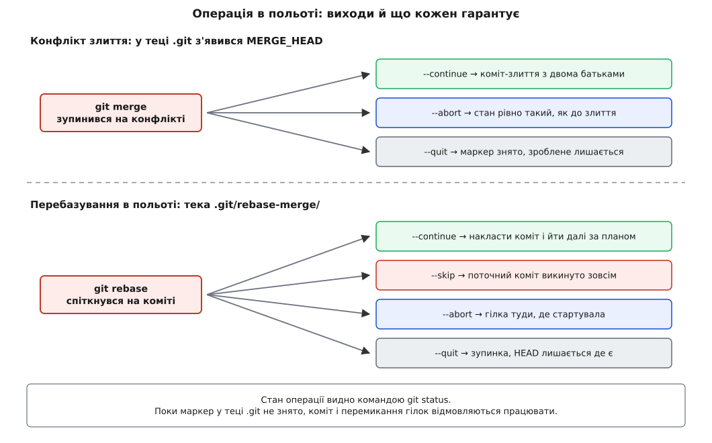

# 📋 Контракт команд історії: switch, merge, rebase, bisect, push

Цей довідник відповідає на одне питання про кожну команду: **що саме вона гарантує** — за якої умови відмовиться працювати, що лишить по собі й яким кодом виходу про це скаже. Тут же — процедури відкату, коли команда вже зробила не те, і налаштування з чесним переліком того, що кожне з них дає, а чого не дає.

## Як читати

- `<коміт>` — будь-що, що git приймає за коміт: хеш, ім'я гілки, тег, `HEAD~3`, `main@{2}`.
- **Гарантія** — те, що справджується після успішного виконання. Коли гарантію витримати не можна, команда відмовляється й лишає репозиторій незмінним; це не аварія, це і є контракт.
- Успіх чи невдачу кожна команда повідомляє **кодом виходу**: `0` — зробила, будь-що інше — ні. У скриптах перевіряють саме його, а не текст на екрані ([код виходу як інтерфейс програми](topic:sys-unix/exit-status)).
- Незавершена операція має **файл-маркер** у теці `.git`: `MERGE_HEAD` — злиття в польоті, тека `rebase-merge/` і посилання `REBASE_HEAD` — перебазування, `BISECT_LOG` — пошук регресії. Поки маркер є, багато команд відмовляються працювати; `git status` перш за все каже саме про нього.

## Імена гілок: switch і branch

`git switch` з'явилася в git 2.23 (17 серпня 2019) і робить рівно одне — перемикає гілки; `git checkout` уміє те саме плюс десяток інших справ, і саме через це його легко застосувати не тим боком.

| Команда | Що робить | Гарантія / умова відмови |
|---|---|---|
| `git switch <гілка>` | переписує `HEAD` на цю гілку й приводить робочу теку до її коміта | відмовиться, якщо є місцеві правки, які довелося б перезаписати; нічого не зникає мовчки |
| `git switch -c <нова> [<старт>]` | створює ім'я й одразу переходить на нього | одна транзакція замість `git branch` + `git switch`; `<старт>` за умовчання — поточний коміт |
| `git switch -C <ім'я> [<старт>]` | те саме, але переставляє **наявне** ім'я | еквівалент `git branch -f`; старе положення лишається в reflog |
| `git switch --detach <коміт>` | стати на коміт **без імені** | жодне посилання не рухається; коміти, зроблені тут, не належать жодній гілці |
| `git switch -` | назад на попередню гілку (`@{-1}`) | — |
| `git switch -m <гілка>` | перемкнутися, переносячи місцеві правки | правки автоматично ховаються в сховок і накладаються після переходу |
| `git switch --discard-changes` | перемкнутися, викинувши місцеві правки | індекс і робоча тека стають рівно такими, як у цілі; **незакомічене зникає без сліду** |
| `git branch -d <ім'я>` | стерти ім'я | відмовиться, якщо коміти гілки не влиті — це вся перевірка, яку тут роблять |
| `git branch -D <ім'я>` | стерти без перевірки | коміти нікуди не діваються, дістати їх можна через reflog |
| `git branch --merged <коміт>` | перелічити гілки, що вже входять в історію `<коміт>` | точний список того, що безпечно стирати |
| `git branch --contains <коміт>` | перелічити гілки, з яких цей коміт досяжний | відповідь на «а куди вже потрапила ця правка» |
| `git branch -vv` | показати для кожної гілки її вершину й розбіжність із гілкою-стежкою | «попереду на 3, позаду на 5» — це підрахунок комітів, не дат |
| `git branch -m <старе> <нове>` | перейменувати | reflog переїжджає разом з ім'ям |

## Злиття: git merge

```
git merge [--ff | --no-ff | --ff-only] [--squash] [-m <повідомлення>] <гілка>…
git merge (--continue | --abort | --quit)
```

| Прапорець | Що робить | Гарантія |
|---|---|---|
| (типово, `--ff`) | перемотує вперед, коли можна; інакше робить коміт-злиття | після успіху обидві сторони досяжні з нової вершини; **жоден старий хеш не змінився** |
| `--ff-only` | перемотує або відмовляється з ненульовим кодом | коміт-злиття не з'явиться **ніколи** — історія лишається лінійною або нічого не стається |
| `--no-ff` | робить коміт-злиття навіть тоді, коли перемотати можна | межа задачі назавжди лишається у графі окремим вузлом — саме на це спирається `git bisect --first-parent` |
| `--squash` | готує результат в індексі й робочій теці, але **не рухає HEAD** і не пише `MERGE_HEAD` | наступний `git commit` дасть звичайний коміт з **одним** батьком; гілку при цьому **не** буде позначено як влиту, і `git branch --merged` її не покаже |
| `--abort` | відновлює стан, який був до злиття | поки є `MERGE_HEAD`, це те саме, що `git reset --merge` (різниця лише в долі автосховку) |
| `--quit` | забуває про злиття, **нічого не відновлюючи** | маркери зняті, індекс і робоча тека лишаються як є — уже розв'язане не пропаде |
| `--continue` | завершує зупинене конфліктом злиття комітом | вимагає, щоб в індексі не лишилося незлитих шляхів |

Перед операцією git пише вершину поточної гілки в `ORIG_HEAD` — це вхідна точка для відкату (нижче).

## Перебазування: git rebase

```
git rebase [-i] [--onto <нова-основа>] [<upstream> [<гілка>]]
git rebase (--continue | --skip | --abort | --quit | --edit-todo | --show-current-patch)
```

Що саме перекладається — читається з аргументів так:

```
переносяться:   <upstream>..<гілка>   — усе, що є в гілці й чого нема в upstream
лягають на:     <нова-основа>          — за умовчання це той самий <upstream>
пропускаються:  коміти, чия зміна вже присутня в основі
                (git звіряє їх за вмістом зміни, а не за хешем)
```

Тому трьохаргументна форма розв'язує задачу «гілку зростили не від того місця»:

```bash
# topic виріс із feature, а треба його прямо на main
git rebase --onto main feature topic
```

Перенесуться коміти `feature..topic`, ляжуть на `main`, а сам `feature` лишиться на місці.

### Виходи з перерваного перебазування

| Команда | Гарантія |
|---|---|
| `--continue` | накладає щойно розв'язаний коміт і йде далі за планом; вимагає, щоб в індексі не лишилося конфліктів |
| `--skip` | **викидає поточний коміт зовсім** — його зміни не потраплять нікуди; це не «відкласти», це «не переносити» |
| `--abort` | гілка й `HEAD` вертаються туди, де були на старті перебазування |
| `--quit` | зупиняє перебазування, але `HEAD` **не** вертає; індекс і робоча тека теж лишаються як є |
| `--edit-todo` | відкриває на редагування залишок плану |
| `--show-current-patch` | показує коміт, на якому спіткнулися (він же `REBASE_HEAD`) |

### Дієслова інтерактивного плану

`git rebase -i <upstream>` відкриває список комітів, зверху найстаріший; порядок рядків — це порядок перекладання.

| Дієслово | Дія |
|---|---|
| `pick` | перекласти як є |
| `reword` | перекласти, відкривши редактор повідомлення |
| `edit` | зупинитися після цього коміта, щоб доправити вміст (`git commit --amend`) |
| `squash` | злити з попереднім, повідомлення обох поєднати |
| `fixup` | злити з попереднім, повідомлення цього викинути |
| `drop` | не переносити зовсім |
| `break` | зупинитися в цьому місці без причини — оглянутися |
| `exec <команда>` | виконати команду після цього коміта; ненульовий код зупиняє перебазування |
| `label` / `reset` / `merge` | мітки й переходи для `--rebase-merges` — так відтворюють власні коміти-злиття |

`--exec` варта окремої згадки: `git rebase -i --exec 'make test' main` прогонить збирання **після кожного** перекладеного коміта й зупиниться на першому, де воно впало. Це найдешевший спосіб пересвідчитися, що ланка збирається не лише в кінці.

### Автозгортання виправлень

```bash
git commit --fixup <хеш>     # повідомлення «fixup! …» — правка до того коміта
git commit --squash <хеш>    # те саме, але повідомлення обох поєднають
git rebase -i --autosquash main
```

`--autosquash` сам знаходить такі коміти, ставить їх одразу після цілі й проставляє їм `fixup`/`squash`. Постійно — `git config rebase.autoSquash true`.

### `--update-refs`

З'явилася в git 2.38 (жовтень 2022). При перекладанні заодно переставляє **всі гілки**, що показували на перекладені коміти, — рятунок, коли на одній вашій гілці стоїть друга. Постійно — `git config rebase.updateRefs true`, разово вимкнути — `--no-update-refs`. Гілки, що зараз вивішені в іншій робочій теці (`git worktree`), при цьому не чіпаються.

### `ours` і `theirs` міняються місцями

| Операція | `ours` (наше) | `theirs` (їхнє) |
|---|---|---|
| `git merge <гілка>` | гілка, на якій ви стоїте | та, яку вливаєте |
| `git rebase <upstream>` | **нова основа** разом із уже перекладеною частиною ланки | **ваш** коміт, який зараз накладають |

Документація git формулює це прямо: сторони переставлені (англ. *the sides are swapped*). Причина в тому, що при перекладанні git стоїть на новій основі й приймає ваші коміти як зміни ззовні. Наслідок практичний: `git checkout --ours <файл>` під час перебазування бере **чужу** версію, а `--theirs` — вашу.


*Поки в теці `.git` лежить маркер, репозиторій перебуває в стані, з якого є рівно кілька виходів. Плутають зазвичай два: `--abort` відновлює стан до операції, а `--quit` лише знімає маркер і лишає все, що вже нароблено, — тому після `--quit` гілка стоїть не там, де стояла.*

## Пошук регресії: git bisect

```
git bisect start [--first-parent] [--no-checkout] [<поганий> [<добрий>…]] [-- <шляхи>…]
git bisect (good | bad | skip) [<коміт>…]
git bisect run <команда> [<аргументи>…]
git bisect (log | replay <файл> | terms | visualize | reset [<коміт>])
```

| Підкоманда | Дія |
|---|---|
| `start <поганий> <добрий>` | почати; **порядок саме такий** — спершу зламаний, потім робочий |
| `good` / `bad` | відповідь про поточний коміт; git одразу переставляє робочу теку на наступного кандидата |
| `skip [<коміт>…]` | «не можу перевірити» — коміт вилучають із розгляду; приймає й діапазон, `git bisect skip v2.5..v2.6` |
| `run <команда>` | віддати всю послідовність скрипту (контракт кодів — нижче) |
| `log` | показати всі дані відповіді |
| `replay <файл>` | програти збережений `log` наново — так виправляють хибну відповідь: `git bisect log > f`, стерти зайвий рядок, `git bisect reset`, `git bisect replay f` |
| `terms` | нагадати, як звуться сторони (можна перейменувати на `old`/`new`, коли шукають не поломку, а появу властивості) |
| `reset [<коміт>]` | завершити пошук і повернутися туди, звідки починали (або на вказаний коміт) |
| `--first-parent` | іти лише першими батьками, тобто по стовбуру (з git 2.29, жовтень 2020) — коміти всередині влитих гілок не розглядаються зовсім |
| `--no-checkout` | не переставляти робочу теку; кандидат доступний як `BISECT_HEAD` — для випадків, коли перевіряють не збиранням |

### Контракт кодів виходу для `git bisect run`

Це найважливіша таблиця тут, бо порушення контракту не викликає помилки — воно тихо дає неправильну відповідь.

| Код виходу команди | Що означає для bisect |
|---|---|
| `0` | коміт **добрий** |
| `1`–`124`, `126`, `127` | коміт **поганий** |
| `125` | перевірити неможливо — **пропустити** цей коміт |
| `128` і більше | **обірвати** пошук зовсім |

Три пастки, що випливають прямо з таблиці:

- `126` («не виконуваний файл») і `127` («команду не знайдено») лежать у смузі «поганий». Помилка в шляху до скрипта оголосить поганими геть усі коміти, і пошук упевнено назве найперший.
- Програма, вбита сигналом, дає оболонці код `128 + номер сигналу`: падіння з `SIGSEGV` — це `139`, тобто «обірвати», а не «поганий». Якщо саме падіння і є та регресія, яку шукають, це доведеться перекласти явно.
- Вихід через `exit(-1)` лишає `255` (значення обрізають до одного байта) — теж обрив.

Тому надійний скрипт ніколи не пропускає код назовні як є, а перекладає його самотужки:

```sh
#!/bin/sh
# 0 — добрий, 125 — не перевіряється, 1 — поганий; нічого іншого не повертаємо
make -j8 >/dev/null 2>&1 || exit 125          # не збирається — пропустити коміт
./build/tests --filter=sleep_wakeup >/dev/null 2>&1 || exit 1   # падіння теж «поганий»
exit 0
```

Запуск:

```bash
git bisect start HEAD v1.4.0
git bisect run /tmp/check.sh
git bisect reset
```

Скрипт свідомо лежить **поза** робочою текою. Git переставляє теку на різні коміти, тож файл, що лежить у репозиторії, на старих комітах може мати іншу версію або не існувати зовсім — і перевірка мовчки поміняється посеред пошуку.

## Публікація: git push

| Форма | Що перевіряє сервер або клієнт |
|---|---|
| `git push` | оновлення проходить **тоді й лише тоді**, коли новий коміт гілки — нащадок того, що лежить на сервері; інакше відмова `non-fast-forward` |
| `--force-with-lease` | дозволяє переписати, якщо поточне значення посилання на сервері **збігається з вашим `origin/<гілка>`** |
| `--force-with-lease=<посилання>:<хеш>` | звіряє з **явно названим** хешем; порожній `<хеш>` означає «цього посилання ще не має існувати» |
| `--force-if-includes` | вимагає, щоб вершина `origin/<гілка>` була досяжна з reflog вашої гілки, тобто щоб ви її справді ввібрали (з git 2.30, грудень 2020); без `--force-with-lease` не робить нічого |
| `--force` | не перевіряє нічого: вимикає і правило нащадка, і решту запобіжників, і саму перевірку оренди |

Слово *lease* (англ. — оренда) тут буквальне: ви заявляєте, що взяли посилання «в оренду» на тому значенні, яке бачили востаннє. Пастка в тому, **що саме** git вважає «баченим востаннє»: значення `origin/<гілка>`, а його оновлює будь-який `git fetch` — зокрема той, що його раз на хвилину робить редактор у тлі. Оренда поновлюється, ви чужих комітів так і не бачили, і `--force-with-lease` пропускає push, який їх зітре. Саме цю дірку затуляє `--force-if-includes`: він питає не «чи бачив хтось», а «чи ввібрала цю вершину ваша власна гілка».

```bash
git config --global push.useForceIfIncludes true   # діє разом із --force-with-lease
```

## Відкат: як повернути гілку на місце

### 1. Знайти, де вона була

```bash
git reflog                      # усі рухи HEAD: коміти, перемикання, ребейзи, ресети
git reflog show feature         # рухи ОДНОГО імені
git log -g --oneline feature    # те саме, але з повними повідомленнями
```

Синтаксис адрес: `feature@{1}` — де гілка стояла один рух тому, `feature@{2.hours.ago}` — де стояла дві години тому, `HEAD@{5}` — де був `HEAD` п'ять рухів тому. Reflog **місцевий**: він не передається ані `push`, ані `clone`, тож у чужій копії репозиторію вашого журналу немає.

Друга вхідна точка — `ORIG_HEAD`: `merge`, `pull`, `rebase` і `reset` пишуть туди вершину гілки **перед** операцією. Для злиття це надійно; для перебазування — з застереженням, яке роблять самі автори git: `ORIG_HEAD` ставиться на старті, і якщо посеред перебазування ви скористалися `git reset`, до кінця воно вже не те. `@{1}` у такому разі точніше.

### 2. Симптом → дія

| Що сталося | Що зробити |
|---|---|
| `git reset --hard` не туди | `git reset --hard HEAD@{1}` |
| перебазування вже завершилося й зіпсувало ланку | `git reset --hard <гілка>@{1}` |
| злите не те, поверх ще нічого не комітили | `git reset --hard ORIG_HEAD` |
| гілку стерто | `git switch -c <ім'я> <хеш із reflog>` |
| не певні, що це той коміт | `git log --oneline <хеш> -5` — подивитися, нічого не рухаючи |
| хочеться просто оглянути стан | `git switch --detach <хеш>` — жодне посилання не зрушить |

Найбезпечніша з цих дій — не `reset`, а `git switch -c`: вона нічого не переставляє, лише **дає ім'я** втраченій вершині. Далі можна спокійно порівняти дві ланки й вирішити, яка потрібна.

### 3. Що чіпає який режим `reset`

| Режим | HEAD | Індекс | Робоча тека |
|---|---|---|---|
| `--soft` | → `<коміт>` | без змін | без змін |
| `--mixed` (типово) | → `<коміт>` | → `<коміт>` | без змін |
| `--hard` | → `<коміт>` | → `<коміт>` | → `<коміт>`; **незакомічене зникає** |
| `--keep` | → `<коміт>` | → `<коміт>` | місцеві правки переносяться; відмовиться, якщо правлений файл різниться між `HEAD` і ціллю |
| `--merge` | → `<коміт>` | → `<коміт>` | оновлює лише файли, що різняться між `HEAD` і ціллю, зберігаючи незакомічене; аби прибрати сліди зупиненого злиття |

Коли ціль відкату — саме коміти, а не робоча тека, `--keep` кращий за `--hard`: він або збереже вашу незакомічену роботу, або чесно відмовиться, замість того щоб мовчки її стерти.

### 4. Скільки часу є на відкат

| Що | Типовий строк | Налаштування |
|---|---|---|
| записи reflog про досяжні коміти | 90 днів | `gc.reflogExpire` |
| записи reflog про коміти, що вже нізвідки не досяжні | 30 днів | `gc.reflogExpireUnreachable` |
| пільга для недосяжних об'єктів при складанні сміття | 2 тижні | `gc.pruneExpire` |

Поки на коміт показує запис у reflog, він досяжний і жоден `git gc` його не візьме. Коли запис вичах, коміт стає недосяжним — і його приберуть, коли він переживе пільгу `gc.pruneExpire`. Практичний висновок один: **день-два після невдалої команди — це безпечно, місяць — уже ні**.

## Налаштування: що саме кожне гарантує

| Налаштування | Що вмикає | Що гарантує | Чого **не** гарантує |
|---|---|---|---|
| `pull.rebase = true` | `git pull` перебазовує замість зливати | у вашій гілці не заводяться технічні коміти «Merge branch main into…» | не рятує від конфліктів — вони просто приходять по одному на коміт, а не всі разом |
| `pull.rebase = merges` | те саме через `--rebase-merges` | ваші **власні** коміти-злиття переживають перебазування, а не розпрямляються | план перекладання стає складнішим і читати його важче |
| `pull.ff = only` | pull, який не вміє перемотати, відмовляється | несподіваного злиття від `git pull` не станеться ніколи | доведеться щоразу вирішувати самому, що робити з розбіжністю |
| `merge.conflictStyle = zdiff3` | у маркери конфлікту додається версія **спільного предка**, а однакові рядки з країв виносяться за межі конфлікту (з git 2.35, січень 2022) | видно, з чого обидві сторони почали, тому видно, **хто саме** що змінив ([трьохстороннє порівняння розписано окремо](topic:sf-release/version-control/math-three-way-merge.md)) | не змінює результату злиття — це подання, а не алгоритм |
| `rerere.enabled = true` | git запам'ятовує пару «конфлікт → як ви його розв'язали» і сам застосовує її, коли той самий конфлікт трапляється знову | той самий конфлікт не доводиться розв'язувати вдруге — важить при повторюваних ребейзах довгої гілки | **не гарантує правильності**: відтворює ваше давнє рішення, і хибне так само точно |
| `rerere.autoUpdate = true` | застосований запис одразу кладеться в індекс | менше ручної роботи | без нього git лише править файл — і це нагода глянути, що саме він підставив |
| `rebase.autoSquash = true` | `-i` завжди з `--autosquash` | коміти `fixup!` самі стають на місце | — |
| `rebase.updateRefs = true` | ребейз сам посуває гілки, що стояли на перекладених комітах | ланка з кількох гілок не розпадається | гілки, вивішені в інших робочих теках, лишаються на старому місці |

```bash
git config --global pull.rebase true
git config --global merge.conflictstyle zdiff3
git config --global rerere.enabled true
git config --global rebase.updateRefs true
```

Записи rerere лежать у `.git/rr-cache`, є лише у вас і не передаються нікому. Прибирає їх `git gc` — нерозв'язані через 15 днів, розв'язані через 60. Керують ними підкоманди: `git rerere status` (де запис буде зроблено), `git rerere remaining` (що rerere розв'язати не зміг), `git rerere diff` (що саме він підставив), `git rerere forget <шлях>` (забути хибний запис і розв'язати наново).
