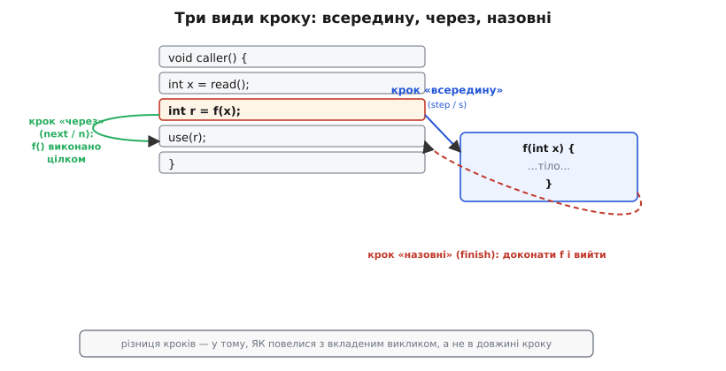
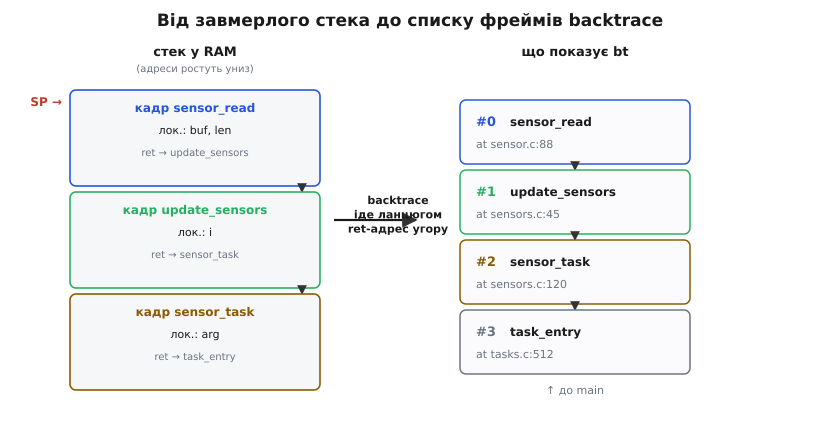

# Кроком по коду

Коли [відлагоджувач підключений, а ядро зупинене](root:embedded/openocd-gdb), ти опиняєшся всередині завмерлого всесвіту. Час стоїть: лічильник команд завмер на одному рядку, стек тримає всю історію викликів, кожна змінна має значення, яке можна прочитати. Питання лише в тому, як цим скористатися — як роздивитися завмерлий стан і як зрушити час уперед рівно настільки, наскільки треба. Це і є щоденне ремесло налагодження, і воно набагато багатше за наївне «тисну крок, поки не побачу помилку».

### Три види кроку

Слово «крок» приховує три різні дії, і плутати їх — найперше джерело змарнованого часу. Різняться вони не довжиною, а тим, що робиться з **вкладеним викликом** на поточному рядку.

**Крок «всередину»** (step, англ. *step into* — «крок усередину»; команда `step` або `s`) виконує один рядок вихідного коду, але якщо рядок містить виклик функції — **входить** у неї і зупиняється на її першому рядку. Це твій вибір, коли підозра падає саме на ту функцію, у яку ти збираєшся пірнути.

**Крок «через»** (англ. *step over* — «крок понад»; команда `next` або `n`) теж виконує один рядок, але виклик усередині рядка проганяє **цілком**, не заходячи в нього, і зупиняється на наступному рядку тієї самої функції. Так ти переступаєш через бібліотечні виклики, HAL-драйвери й увесь чужий код, де помилки не очікуєш, не провалюючись у їхні нутрощі.

**Крок «назовні»** (англ. *step out* — «крок назовні»; команда `finish`) доконує поточну функцію до кінця і зупиняється одразу після повернення з неї, у місці виклику. Якщо ти випадково провалився кроком углиб і хочеш вибратися на рівень вище — `finish` робить це однією дією, без нудного докрокування до `return`.

Поряд із цими трьома є четвертий, дрібніший: **крок по інструкції** (команда `stepi` або `si`) рухає виконання на одну **машинну** інструкцію, не зважаючи на межі рядків вихідного коду. Він потрібен, коли дивишся на асемблерний вихід або коли оптимізатор склеїв кілька рядків C в одну інструкцію і покроковий рух по рядках уже бреше.



*Вибір кроку керує не довжиною руху, а тим, провалюєшся ти у вкладений виклик чи переступаєш його.*

> 🔧 **Навіщо це.** Дев'ять із десяти «згаяв півгодини в налагоджувачі» — це крок «всередину» там, де треба було «через»: ти провалився в надра `printf` чи драйвера й вибираєшся звідти десятками кроків. Звичка свідомо вибирати `n` за замовчуванням і `s` лише прицільно економить більшу частину часу за сеанс.

### Стек викликів і фрейми

Зупинившись у довільному місці, перше, що хочеться знати, — **як я сюди потрапив?** Відповідь дає команда `backtrace` (або `bt`). Вона читає стек із пам'яті й відновлює ланцюг «хто кого викликав»: від поточної функції (вона під номером `#0`) угору через усі проміжні виклики аж до кореня — `main` або точки входу задачі.

Кожен запис у backtrace — це **фрейм** (англ. *stack frame* — «кадр стека»): знімок стану однієї функції в мить, коли вона викликала наступну. Фрейм тримає локальні змінні цієї функції, збережені значення ключових регістрів, адресу повернення (її на ARM несе регістр LR, англ. *link register*) і покажчик на попередній кадр. Саме тому backtrace узагалі можливий: стек — це фізичний слід із хлібних крихт, що веде назад до кореня, і кожна крихта вказує на попередню.

```
(gdb) bt
#0  sensor_read (dev=0x3FFB1234, buf=0x0) at sensor.c:88
#1  0x400D2ABC in update_sensors () at sensors.c:45
#2  0x400D2F10 in sensor_task (arg=0x0) at sensors.c:120
#3  0x400D0888 in task_entry () at tasks.c:512
```

Щоб роздивитися конкретну ланку, у неї треба перейти: `frame 1` (або кроками `up` / `down`). Перемкнувшись у фрейм `#1`, ти бачиш світ очима саме `update_sensors`: команди `info locals` і `print` тепер показують її локальні змінні, а не поточної функції. Це принципово: коли шукаєш, **яким аргументом** тебе викликали, мусиш піднятися у фрейм того, хто викликав, — там лежить значення, яке передали.



*backtrace проходить ланцюгом адрес повернення від завмерлого стека вгору й обертає голі байти на «хто кого викликав».*

### Перегляд живого стану

Зупинившись у фреймі, ти бачиш **усе**, а не лише те, що хтось завбачливо надрукував. У цьому й полягає принципова перевага [підключеного відлагоджувача над друком через Serial](root:sys-ide/why-debugger): друк показує те, що ти здогадався вивести **до** запуску; відлагоджувач дає прочитати будь-яку змінну, регістр чи байт пам'яті **після** того, як усе вже сталося.

```
(gdb) info locals           # усі локальні змінні поточного фрейму
buf = 0x0                   # ось він, нульовий вказівник
len = 64

(gdb) info registers        # усі регістри ядра
pc  0x400D2034  sensor_read+12
sp  0x3FFB6E80
lr  0x400D2ABD

(gdb) x/8xb 0x3FFB1234      # дамп 8 байт з адреси (зручно перевіряти структури)
0x3FFB1234: 0x01 0x00 0x00 0x00 0x64 0x00 0x00 0x00

(gdb) set var buf = &local_buf    # підмінити вказівник наживо для перевірки гіпотези
```

Команда `set var` не лише читає, а й **змінює** значення наживо — і це перетворює налагодження з пасивного спостереження на активний дослід. «А якби `buf` указував на правильний буфер — функція дійшла б до кінця?» Підміняєш `buf`, відновлюєш виконання й дивишся на результат, не перекомпільовуючи й не перепрошиваючи. Гіпотеза перевіряється за секунди.

### Коли задач багато

Окрема перевага підключеного відлагоджувача над друком — він бачить **усі задачі** [операційної системи реального часу](root:sf-devices/freertos) водночас, а не лише ту, що зараз виконується. [OpenOCD для ESP32](root:embedded/openocd-gdb) уміє читати список задач зі структур планувальника в RAM і подає GDB кожну задачу як окремий «потік».

```
(gdb) info threads
  Id  Target Id            Frame
  1   Task "app_task"      xQueueReceive () at queue.c:112
  2   Task "wifi_task"     esp_wifi_scan () at wifi_api.c:55
* 3   Task "sensor_task"   sensor_read () at sensor.c:88

(gdb) thread 2             # перемкнутися на wifi_task
(gdb) bt                   # подивитися її власний backtrace
#0  esp_wifi_scan (...)
#1  wifi_connect_handler ()
```

Кожна задача має [власний стек у RAM](root:sf-lang/task-stacks) і власне значення лічильника команд у точці, де вона зупинилася чи заблокувалася. Відлагоджувач відновлює окремий backtrace для кожної — і замість загадки «чому система зависла» ти бачиш миттєвий зріз: одна задача чекає на черзі, друга застрягла в скануванні Wi-Fi, третя крутить твій сенсорний код. Друк такої картини дати не може в принципі — він показав би лише те, що встигла вивести задача, яка володіла портом останньою.

### Пастки оптимізованого коду

Зібравши прошивку з `-O2` чи вище, ти стикаєшся з тим, що крок раптом «бреше». Компілятор агресивно перетворює код: вбудовує функції в місце виклику, викидає «зайві» змінні, об'єднує й переставляє рядки. Наслідок для налагодження подвійний. По-перше, GDB стрибає по рядках непередбачувано — рядок `12`, тоді `15`, тоді знову `12`, — бо машинні інструкції від цих рядків переплелися. По-друге, значення змінних часто показуються як `<optimized out>`. Це не вада GDB: конкретної змінної просто немає в пам'яті — вона «живе» лише в регістрі короткий час, і компілятор вирішив її ніде не зберігати.

Корінь — у тому, [що оптимізатор робить із кодом на пізніх стадіях компіляції](root:sf-lang/compiler-stages): переставляє, вбудовує й викидає те, що з погляду джерела мало б існувати рядок за рядком. Тому для сеансу під відлагоджувачем збирають із прапорцем `-Og` (оптимізація, яка свідомо не заважає налагодженню) або `-O0` (без оптимізації зовсім): тоді кожен рядок джерела відповідає своєму шматку машинного коду, а змінні лежать у пам'яті й читаються.

> 🔧 **Навіщо це.** Побачив `<optimized out>` чи скакання по рядках — не воюй із симптомом, а пересобери цей модуль із `-Og`. Півгодини спроб «вгадати» значення оптимізованої змінної програють тридцяти секундам перезбірки.

**Worked-приклад. Backtrace падіння з нульовим аргументом.**

```
(gdb) bt
#0  memcpy (dst=0x0, src=0x3FFB5000, n=64) at memcpy.c:34
#1  0x400D2F88 in pack_response (out=0x0, data=0x3FFB5000) at proto.c:156
#2  0x400D2ABC in handle_command (cmd=0x3FFB4800) at proto.c:89

(gdb) frame 2
(gdb) info locals
out_buf = 0x0       # лишився нульовим, не ініціалізований
cmd     = 0x3FFB4800

(gdb) p cmd->response_buf
$1 = 0x0            # поле не заповнили перед викликом
```

Ланцюг читається згори вниз і відразу стає прозорим: `handle_command` не заповнила `out_buf` перед тим, як передати його в `pack_response`; та передала `0x0` далі в `memcpy` — і впала на запису за нульовою адресою. Один `backtrace` плюс перехід у фрейм `#2` показали і функцію-винуватця, і саму змінну. Той самий ланцюг, відтворюваний через `Serial.print`, ховався б за десятками рядків логу, які ще треба було здогадатися додати заздалегідь.

> 🔧 **Навіщо це.** backtrace — найкоротший шлях від «воно впало десь там» до «ось функція й ось аргумент, що це спричинив». Уміння читати фрейми й переходити між ними — половина всього ремесла налагодження; друга половина — [як саме ядро зупиняється й крокує](root:sys-ide/step-debugging/detail) під капотом.
