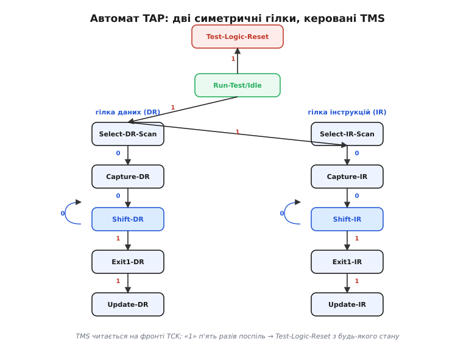
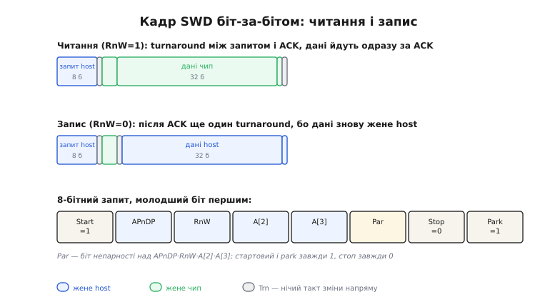
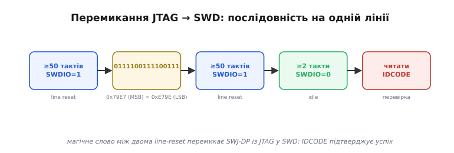
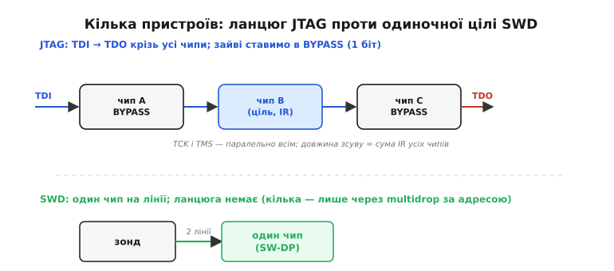

# SWD і JTAG зсередини: протокол до останнього біта

Коли [відлагоджувач](topic:sys-ide/why-debugger) спиняє ядро й читає його регістри, між ним і кристалом немає нічого, крім двох-чотирьох дротів і строгого протоколу на них. Базовий [огляд каналів](topic:sys-ide/swd-jtag-internals) показує загальну картину: JTAG веде нитку-скан крізь усе ядро, SWD робить те саме двома лініями, а по той бік порту сидить DAP, у який зонд пише команди. Тут ми спускаємося на рівень нижче — до того, що насправді біжить дротом такт за тактом. Розберемо автомат TAP по станах, кадр SWD по бітах, мапу регістрів DP та AP, ритуал перемикання JTAG↔SWD, поведінку кількох пристроїв на одній шині й те, від чого залежать швидкість і надійність обміну. Мета проста: щоб, дивлячись на логічний аналізатор чи на лог OpenOCD, ви бачили не магію, а зрозумілий механізм.

## Чому взагалі послідовно: ціна доступу

Перш ніж розбирати протоколи, варто зрозуміти спільну причину, з якої вони обидва такі, які є. Усередині чипа сотні регістрів, до яких відлагодженню треба дотягтися: регістри керування ядром, лічильник команд, загальні регістри, регістри блоків зупину й спостереження, нарешті — уся пам'ять і периферія через шину. Якби кожен із них мав власну виведену назовні лінію, корпус потонув би в ніжках. Тож обирається протилежне: **мінімум фізичних ліній, а вся адресація — у часі**. Замість «широкої шини на багато проводів» — вузький канал, яким біти течуть по черзі, а який саме регістр зараз під доступом, визначає стан службового автомата.

Це фундаментальний компроміс, і він пояснює багато подальших дрібниць. Послідовність означає, що кожен доступ коштує тактів: щоб прочитати 32-бітний регістр, треба прогнати щонайменше 32 такти плюс службові біти. Вузькість означає, що напрям лінії доводиться перемикати (на SWD — буквально, бо лінія одна), і кожне перемикання коштує «нічийного» такту. А наявність автомата означає, що перед корисним доступом треба ще привести автомат у потрібний стан. Усе це — не вади реалізації, а прямий наслідок рішення «дроти дорогі, такти дешеві».

> 🔧 **Навіщо це.** Коли відлагодження «повзе» — наприклад, оновлення вікна змінних у IDE відчутно гальмує, — причина майже завжди тут: кожна змінна це окрема серія транзакцій по вузькому каналу. Підняти частоту такту або читати пам'ять блоком (один доступ TAR + автоінкремент) часто прискорює на порядок.

## Автомат TAP крок за кроком

JTAG будується навколо одного скінченного автомата — **TAP** (англ. *Test Access Port*). Він має рівно шістнадцять станів, і весь JTAG — це мистецтво ходити цими станами, виставляючи потрібний рівень на TMS перед кожним фронтом такту. Ключове правило одне: **TMS зчитується на наростному фронті TCK**, і саме його рівень у цю мить вирішує, у який стан автомат перейде. Дані на TDI/TDO зсуваються в тих самих фронтах, але напрям руху автоматом задає виключно TMS.

Структура автомата подвійно-симетрична. Зверху два «спокійні» стани: **Test-Logic-Reset** (повний скид логіки) і **Run-Test/Idle** (холостий хід). Від них розходяться дві однакові за формою гілки — ліва обслуговує **регістр даних** (її стани закінчуються на `-DR`), права — **регістр інструкцій** (стани на `-IR`). Кожна гілка має ту саму п'ятірку станів: `Select` (вибір гілки), `Capture` (защіпнути поточне значення в зсувний регістр), `Shift` (власне зсув даних), `Exit1` і `Update` (зафіксувати зсунуте у регістр-призначення).



*Керує переходами лише TMS; «1» п'ять разів поспіль гарантовано приводить у Test-Logic-Reset з будь-якого стану — це вбудований аварійний вихід.*

Розберімо типову операцію — «завантажити інструкцію, тоді прогнати дані» — по тактах, щоб відчути ритм. Нехай автомат у `Run-Test/Idle`.

```
такт  TMS  стан після фронту        що відбувається
 1     1   Select-DR-Scan           вирішуємо: дані чи інструкція?
 2     1   Select-IR-Scan           1 ще раз → ідемо в гілку інструкцій
 3     0   Capture-IR               защіпнули поточний IR у зсувний регістр
 4     0   Shift-IR                 зайшли в зсув; з наступного такту йдуть біти
 5..   0   Shift-IR (тримаємось)    на кожен такт: біт IR через TDI, старий — через TDO
 N     1   Exit1-IR                 останній біт + вихід зі зсуву
 N+1   1   Update-IR                нова інструкція стає чинною
 N+2   0   Run-Test/Idle            повернулись у спокій
```

Дві деталі тут несуть усю суть. Перша: у `Shift-IR` автомат лишається доти, доки TMS=0 — це і є «петля зсуву» на фігурі; саме в ній відбувається корисна робота, по одному біту за такт. Друга, підступніша: останній біт даних висувається **одночасно** з переходом у `Exit1` (тобто з TMS=1). Це класична пастка ручної реалізації JTAG: якщо підняти TMS на такт раніше, останній біт не зсунеться; якщо на такт пізніше — зсунеться зайвий. Звідси й те, що довжину регістра треба знати точно до біта.

Після `Update-IR` обрана інструкція визначає, **який саме регістр даних** під'єднається між TDI і TDO на гілці DR. Поставили інструкцію `IDCODE` — у `Shift-DR` побіжить 32-бітний код ідентифікації. Поставили `BYPASS` — між TDI і TDO стане один-єдиний біт (про це далі, у ланцюгах). Поставили відлагоджувальну інструкцію конкретного ядра — відкриється доступ до його службових регістрів. Тобто IR обирає «що», а наступний прохід DR це «що» читає чи пише.

Окремо варто спинитися на `Test-Logic-Reset`. У нього веде будь-який шлях, якщо тримати TMS=1 п'ять тактів поспіль — незалежно від поточного стану. Це не випадковість, а навмисний запобіжник: хоч би де «загубився» автомат (збій, невідома початкова позиція, шум на лінії), п'ять одиниць повертають його у відоме чисте положення. Тому кожна коректна JTAG-сесія починається з цих п'яти одиниць — це «велике скидання» перед роботою.

> 🔧 **Навіщо це.** Якщо ви пишете власний bit-bang JTAG (наприклад, на вільних GPIO, коли немає зонда) — точний рахунок тактів у `Shift` і правильний момент підняття TMS на останньому біті це 90% усіх багів. Логічний аналізатор на TCK/TMS/TDI/TDO і ручне звіряння зі станами вище ловить їх одразу.

## Кадр SWD до останнього біта

SWD (англ. *Serial Wire Debug*) відмовляється від чотирьох ліній і автомата на шістнадцять станів заради двох ліній і компактного кадрового протоколу. Лінія така одна — **SWDIO**, двоспрямована, і весь обмін розбито на самостійні **транзакції**, кожна з трьох фаз: запит від host, підтвердження від чипа, дані. Оскільки лінія одна, при кожній зміні того, хто нею керує, вставляється **такт зміни напряму** (англ. *turnaround*, далі Trn) — нічийний такт, який обидві сторони пропускають, щоб не зіткнутися драйверами.

Запит — це рівно 8 біт, які host жене молодшим бітом наперед, у такому порядку:

```
біт 1  Start    завжди 1            (ознака початку кадру)
біт 2  APnDP    0 = DP, 1 = AP      (до якого простору регістрів)
біт 3  RnW      1 = читання, 0 = запис
біт 4  A[2]     молодший біт адреси регістра
біт 5  A[3]     старший біт адреси регістра
біт 6  Parity   непарність над APnDP·RnW·A[2]·A[3]
біт 7  Stop     завжди 0
біт 8  Park     завжди 1            (лінію відпускають у 1)
```

Біт **непарності** (англ. *odd parity* — «непарна парність») рахується лише над чотирма змістовними полями (APnDP, RnW, A[2], A[3]) і доповнює кількість одиниць у них до непарної. Це найдешевший можливий захист: він ловить будь-яку одиничну помилку в адресі чи напрямі запиту. Park-біт у кінці лишає лінію підтягнутою у високий рівень — у стані спокою SWDIO утримується в одиниці, тож наступний Start (теж одиниця) не вимагає різкого фронту.

Далі — Trn (бо керування переходить до чипа), і чип віддає 3-бітний **ACK**, теж молодшим бітом наперед. Значень рівно три:

```
ACK = 001  OK     транзакцію прийнято
ACK = 010  WAIT   зайнятий, повтори той самий запит пізніше
ACK = 100  FAULT  помилка; зведено липкий біт у CTRL/STAT
```

А ось далі шляхи читання й запису розходяться — і саме тут лежить тонкість, на якій часто плутаються самописні драйвери. Подивимось обидва кадри в одному масштабі.



*Напрям лінії — ключ до розуміння кадру: дані читання жене чип (Trn уже був перед ACK), дані запису жене host (тому між ACK і даними потрібен ще один Trn).*

На **читанні** (`RnW=1`) після ACK лінією й далі керує чип — він щойно віддавав ACK і одразу віддає 32 біти даних (молодшим наперед) плюс біт непарності над ними. Зайвого Trn між ACK і даними не треба, бо напрям не змінюється; Trn з'являється тільки в кінці, коли керування повертається до host.

На **записі** (`RnW=0`) інакше: ACK віддає чип, а дані має гнати host. Тобто напрям між ACK і даними **змінюється**, і саме тому між ними стоїть Trn. Лише після нього host висуває 32 біти даних і біт непарності.

Це не формальна дрібниця: переплутаний Trn зсуває всю фазу даних на один такт, і ви читаєте «майже правильне» сміття — старший біт там, де мав бути молодший наступного слова. Логічний аналізатор на SWDIO/SWCLK із розміткою фаз показує це миттєво; на око ж такий баг шукають годинами.

Окрема логіка — навколо **WAIT**. Це штатна, не аварійна відповідь: вона означає лише, що попередній доступ ще не завершився (повільна шина, зайнята пам'ять). Правильний драйвер на WAIT не панікує, а повторює **ту саму** транзакцію — і так, з невеликим лімітом спроб, поки не дістане OK. А от **FAULT** серйозніший: він каже, що десь зведено липкий біт помилки в регістрі CTRL/STAT (наприклад, спроба доступу, коли живлення відлагоджувального домену ще не піднято, або помилка попереднього AP-доступу). Доки цей біт не скинути записом у регістр **ABORT**, жодна нова транзакція не пройде — усі повертатимуть FAULT. Тому типова реакція драйвера на FAULT: прочитати CTRL/STAT (зрозуміти, що саме сталося), записати ABORT (скинути липкі біти), за потреби повторити.

## DP і AP: дві половини DAP

Усе, до чого ведуть запити SWD (і відлагоджувальні інструкції JTAG), зосереджено в **DAP** (англ. *Debug Access Port*). Усередині DAP чітко поділений на дві частини з різними ролями, і плутанина між ними — одне з головних джерел нерозуміння протоколу.

**DP** (*Debug Port*) — це те, з чим напряму розмовляє дріт. Його регістри обслуговують сам канал: ідентифікація, керування живленням відлагоджувального домену, обробка помилок, вибір, з яким AP працювати далі. Адресуються вони двома бітами A[3:2] прямо в запиті.

**AP** (*Access Port*) — це міст від DAP до решти чипа. Найпоширеніший його різновид — **MEM-AP** (*Memory Access Port*): через нього зонд читає й пише пам'ять, регістри периферії, навіть регістри ядра (вони на Cortex-M теж відображені в адресний простір). AP має власні регістри, і дістаються до них через DP: спершу регістром DP **SELECT** кажуть «працюю з таким-то AP і таким-то банком його регістрів», і лише тоді запити з `APnDP=1` потрапляють у потрібний регістр AP.

![Дві таблиці регістрів: ліворуч DP (IDCODE/ABORT, CTRL/STAT, SELECT, RDBUFF) з адресами A[3:2]; праворуч MEM-AP (CSW, TAR, DRW, BASE/IDR). Стрілка від SELECT показує, що цей DP-регістр задає, який саме AP і банк адресуватимуть наступні AP-доступи.](img/d-dp-ap-map.svg)

*DP веде сам дріт і вказує напрям; AP веде до пам'яті. SELECT — стрілка перекладу між двома просторами.*

Пройдімося по найважливіших регістрах. У DP:

- **IDCODE** (читання, A[3:2]=00) — код ідентифікації порту. Перша річ, яку читають після під'єднання: ненульова, осмислена відповідь означає, що на тому кінці справді живий SW-DP.
- **ABORT** (запис, та сама адреса 00) — скидання липких бітів помилок і примусове переривання завислого AP-доступу. Антидот до FAULT.
- **CTRL/STAT** (читання й запис, 01) — керування і стан. Тут піднімають живлення відлагоджувального й системного доменів (біти запиту живлення й біти підтвердження, що його піднято) і тут читають липкі біти помилок.
- **SELECT** (запис, 10) — вибір активного AP і банку його регістрів (а також банку самих DP-регістрів через поле DPBANKSEL).
- **RDBUFF** (читання, 11) — буфер останнього читання. Через нього забирають «запізніле» значення AP-читання, не запускаючи нового доступу.

У MEM-AP (адреси регістрів усередині AP, обрані через SELECT):

- **CSW** (*Control/Status Word*, 0x00) — режим доступу: розрядність (8/16/32 біти), автоінкремент адреси після кожного доступу до даних, права доступу.
- **TAR** (*Transfer Address Register*, 0x04) — адреса в пам'яті, до якої звертаємось.
- **DRW** (*Data Read/Write*, 0x0C) — власне дані: запис сюди пише в пам'ять за TAR, читання звідси читає з пам'яті за TAR.
- **BASE / IDR** — службові: де лежить таблиця компонентів відлагодження і що це за AP.

Тепер зберемо це в єдину дію — прочитати 32-бітне слово з довільної адреси, скажімо `0x3FFB0000`:

```
крок  простір  R/W  регістр  значення           суть
 1     DP       W    SELECT   AP=0, банк=0        обираємо MEM-AP №0
 2     AP       W    CSW      32 біти, +авто      слова по 4 байти, з автоінкрементом
 3     AP       W    TAR      0x3FFB0000          куди дивимось
 4     AP       R    DRW      (ACK=OK, дані ←)    ЗАПУСК доступу; повертає старе
 5     AP       R    DRW      (дані = слово)      ось воно — потрібне слово
```

Найважливіша і найпідступніша властивість тут — **читання через AP запізнюється на одну транзакцію**. Перший запит на читання `DRW` лише велить MEM-AP сходити на шину за даними; саме слово приходить у відповіді на *наступний* AP-доступ або з регістра RDBUFF. Причина проста: шина чипа повільніша за канал відлагодження, тож AP не може віддати слово в тому ж кадрі — він конвеєризований. Звідси два практичні наслідки. По-перше, щоб прочитати одне слово, роблять два читання DRW (або одне DRW + одне RDBUFF). По-друге — і це дає величезний виграш — щоб прочитати *масив*, увімкнено автоінкремент TAR (біт у CSW): тоді кожне читання DRW і повертає попереднє слово, і автоматично готує наступну адресу. Послідовність стає «TAR один раз, далі суцільна черга DRW», і блок пам'яті ллється майже на повній швидкості каналу. Саме так зонд швидко вантажить прошивку у Flash чи знімає [дамп пам'яті](root:embedded/core-dump) після збою.

> 🔧 **Навіщо це.** Розуміння «AP-читання на крок позаду» прямо економить час двома способами: пояснює, чому ваш саморобний читач пам'яті повертає значення «зсунуті на одну адресу», і підказує головну оптимізацію — автоінкремент + потокові DRW замість «TAR-DRW-TAR-DRW» на кожне слово.

## Перемикання JTAG ↔ SWD: ритуал на одній лінії

Більшість сучасних чипів ARM мають не окремо JTAG і окремо SWD, а спільний блок **SWJ-DP**, що вміє обидва й стартує зазвичай у режимі JTAG. Зонд мусить перевести його в SWD — і робиться це хитро, бо до перемикання host ще не знає напевно, у якому режимі чип. Рішення елегантне: послідовність складено так, щоб правильно спрацювати з обох вихідних станів.

Перемикання дозволене лише тоді, коли поточний інтерфейс у стані скидання: JTAG — у `Test-Logic-Reset`, SWD — у «line reset». Тому ритуал обрамлено скиданнями з обох боків.



*Магічне слово між двома line-reset перемикає SWJ-DP із JTAG у SWD; читання IDCODE наприкінці підтверджує, що перехід удався.*

Покроково:

```
1. ≥50 тактів TCK при SWDIO=1   line reset: якщо вже були в SWD — приведе SWD у reset;
                                 якщо в JTAG — ці одиниці тягнуть TMS, ведучи в TLR
2. 16 біт 0111100111100111      магічне слово (0x79E7 старшим наперед = 0xE79E молодшим)
3. ≥50 тактів TCK при SWDIO=1   line reset уже як SW-DP
4. ≥2 холості такти SWDIO=0     коротка пауза перед першою транзакцією
5. читати DP IDCODE             перевірка: осмислена відповідь = ми в SWD
```

Магічне 16-бітне слово (його часто записують як 0xE79E, бо передається молодшим бітом наперед) — це по суті «пароль перемикання»: послідовність, яку JTAG-логіка не може випадково сприйняти за валідну команду, а SWJ-DP розпізнає як наказ перейти на SWD. Перший line reset потрібен саме тому, що host не певен щодо вихідного режиму: п'ятдесят із гаком одиниць на лінії або заганяють JTAG-автомат у `Test-Logic-Reset` (бо для нього SWDIO це TMS), або переводять уже-SWD у line reset. Хай як, після цього обидва можливі стани зведено до відомого, і магічне слово спрацьовує однозначно. Фінальне читання IDCODE — не формальність, а обов'язкова перевірка: якщо воно повернуло нісенітницю, перемикання не вдалося (часто через шум, неправильну швидкість чи відсутність живлення відлагоджувального домену), і немає сенсу йти далі.

Зворотний перехід (SWD→JTAG) існує симетрично, зі своїм магічним словом, але на практиці потрібен рідко — зазвичай зонд один раз обирає SWD і працює в ньому всю сесію.

> 🔧 **Навіщо це.** Коли зонд «не бачить» чипа, цей ритуал — перше місце для діагностики. Лог OpenOCD на старті показує саме читання IDCODE; «invalid ACK» або нульовий/сміттєвий IDCODE майже завжди означає одне з трьох: не та швидкість такту, погана земля/контакт або не піднято живлення відлагоджувального домену. Знаючи кроки, ви читаєте цей лог як історію, а не як заклинання.

## Кілька пристроїв на одній шині

Поки на платі один чип — усе просто. Та коли їх кілька (наприклад, головний процесор плюс окремий радіомодуль, кожен зі своїм ядром), постає питання: як адресувати потрібний. Тут JTAG і SWD розв'язують задачу принципово різно, і це добре висвітлює різницю їхніх філософій.



*JTAG нанизує всі чипи на одну нитку TDI→TDO; SWD за замовчуванням адресує один чип, а кілька — лише через окремий механізм multidrop.*

**JTAG будує ланцюг** (англ. *daisy chain* — «гірлянда»). TDI входить у перший чип, його TDO іде у TDI наступного, і так до останнього, чий TDO повертається до зонда. TCK і TMS при цьому розведено **паралельно** на всі чипи — автомати TAP усіх пристроїв крокують синхронно, в одному стані. Адресація виходить геніально простою через інструкцію **BYPASS**: коли в регістр інструкцій чипа задвинуто всі одиниці, його регістр даних стискається до **одного-єдиного біта** — дані просто «проскакують» крізь нього з мінімальною затримкою. Тож щоб попрацювати з одним чипом у ланцюгу, у нього вантажать потрібну інструкцію, а в усі інші — BYPASS. Тепер у фазі `Shift-DR` дані проходять: один біт байпасу + корисний регістр цілі + по одному біту байпасу решти. Платою за спільний роз'єм стає арифметика довжин: зонд мусить точно знати порядок чипів і довжину IR кожного, щоб правильно відрахувати, де в загальному потоці лежить корисний регістр. Помилка в цій арифметиці — і ви читаєте біти сусіднього чипа.

**SWD ланцюга не будує взагалі.** За замовчуванням це протокол «один host — один target»: дві лінії йдуть до одного чипа, і все. Для кількох чипів існує окреме розширення — **multidrop SWD** (доступне у новіших версіях протоколу): кілька пристроїв висять на спільних SWCLK/SWDIO, але кожен має унікальну адресу-ідентифікатор, і спеціальною командою host «вмикає» рівно один, а решта тимчасово відключають свої драйвери від лінії. Важливе обмеження multidrop: пристрої мусять мати **різні** ідентифікатори, інакше їх не розрізнити (тоді як у JTAG-ланцюгу два однакові чипи цілком співіснують — їх розрізняє позиція в нитці). І в обох випадках діє правило: активна відлагоджувальна сесія завжди з одним пристроєм; «паралельно з усіма одразу» не буває.

Ця різниця добре пояснює, чому JTAG досі живий попри зайві дроти: на складній платі з багатьма мікросхемами один JTAG-роз'єм обслуговує їх усі однією гірляндою — і для тестування з'єднань, і для програмування. SWD виграє там, де чип один і ніжки на вагу золота, тобто на дрібних МК.

## Швидкість, надійність і фізика лінії

Залишається останній шар — чому обмін то працює бездоганно, то розсипається, і що крутити, коли він розсипається. Усе впирається у фізику тактованого послідовного інтерфейсу.

**Швидкість задає такт.** І TCK, і SWCLK — це звичайний синхронний тактовий сигнал; зонд може гнати його від десятків кГц до десятків МГц. Чим вища частота, тим швидше ллються дані — але тим жорсткіші вимоги до якості ліній. Верхня межа не одна, а складена з кількох: її обмежує і сам чип (його відлагоджувальна логіка має встигати за фронтами), і — часто жорсткіше — **довжина й якість провідників**. Довгі дроти-«мамки» від зонда до плати, погана земля, відсутність узгодження — усе це розмиває фронти, і на високому такті приймач читає біт не там. Звідси універсальна перша порада при нестабільному відлагодженні: **скинути швидкість** (поставити TCK/SWCLK у кілька сотень кГц). Якщо на повільному такті все стабільно, а на швидкому сипле помилками — проблема у фізиці ліній, а не в логіці.

**Земля — не дрібниця.** Тактований інтерфейс міряє рівні відносно спільної землі; якщо земля між зондом і платою кепська (тонкий довгий провід, поганий контакт), фронти «плавають», і навіть низький такт не рятує. Коротка товста земля поряд із сигнальними лініями — найдешевший спосіб підняти надійність.

**Надійність протоколу — багатошарова.** Сам обмін має вбудовані рівні захисту, і корисно розуміти, який від чого боронить. На рівні кадру SWD працює біт непарності — він ловить одиничну помилку в запиті чи в даних. На рівні транзакції працює ACK: WAIT дає коректний механізм повтору, коли чип не встигає, а FAULT із липкими бітами CTRL/STAT не дає мовчки продовжити після збою — наступні доступи блокуються, поки помилку не визнають і не скинуть через ABORT. На рівні сесії працює перевірка IDCODE на старті. Жоден із цих шарів не «виправляє» дані сам — вони лише **виявляють** негаразд, перетворюючи мовчазне псування на явну помилку, яку драйвер мусить обробити. Це правильний інженерний вибір: краще чесний збій, ніж тихо зіпсоване слово в дампі.

**Живлення відлагоджувального домену.** Тонкий, але частий корінь проблем: відлагоджувальна логіка має власне живлення/тактування, і доки воно не піднято (через біти запиту в CTRL/STAT), AP-доступи повертатимуть FAULT, навіть якщо канал ідеальний. Тому коректний старт сесії — це не лише IDCODE, а й підняття потрібних доменів через CTRL/STAT перед першим доступом до пам'яті.

Зведімо все в коротку діагностичну логіку, яку варто тримати в голові:

```
зонд не бачить чип / сміттєвий IDCODE
   → перевір землю й контакт; скинь швидкість такту;
     переконайся, що це SWD-піни, а не зайняті периферією
доступ до пам'яті дає FAULT
   → читай CTRL/STAT; підніми домени живлення; скинь липкі біти через ABORT
часті WAIT
   → це нормально під навантаженням; драйвер має повторювати; якщо їх ЗАНАДТО —
     можливо, надто високий такт для цієї шини
читання масиву повертає «зсунуті» значення
   → згадай про AP-затримку на крок і turnaround у потрібній фазі
```

> 🔧 **Навіщо це.** Дев'ять із десяти «зонд не працює» розв'язуються не в коді, а тут: коротша земля, нижчий такт, вільні від периферії піни, піднятий домен живлення. Маючи цю мапу симптомів, ви не тицяєте навмання, а йдете від причини: спершу фізика лінії, тоді живлення домену, і лише тоді — логіка драйвера.

## Від протоколу до аналізатора

Механізм тепер видно — та поки що на папері, а живе він на дротах. Найкоротший шлях перетворити це читання на навичку простий: причепити логічний аналізатор до SWCLK/SWDIO (чи до чотирьох ліній JTAG), запустити звичайну сесію OpenOCD і розшифрувати захоплення руками. На старті знайдіть у потоці магічне слово перемикання й перше читання IDCODE; далі — трійку SELECT → TAR → DRW першого доступу до пам'яті; і переконайтеся власними очима, що дані приходять на кадр пізніше, ніж запит. Коли захоплення почне читатися без зусиль, зробіть протилежне: підніміть такт до краю й подивіться, на якому саме біті кадр починає сипатися — це і є та фізична межа лінії, про яку легко читати абстрактно й важко відчути, поки не побачиш на власні очі.

А остаточний іспит на розуміння — написати власний bit-bang драйвер на вільних GPIO. Саме там кожна дрібниця цього протоколу перестає бути теорією: момент підняття TMS на останньому біті зсуву, зайвий turnaround між ACK і даними на записі, затримка AP-читання на одну транзакцію. Переплутаєш бодай одну — і зонд поверне мовчазне сміття без жодного слова про помилку. Тому найкраща перевірка, що протокол справді «в руках»: не переказати його, а змусити працювати самотужки, дріт за дротом.
