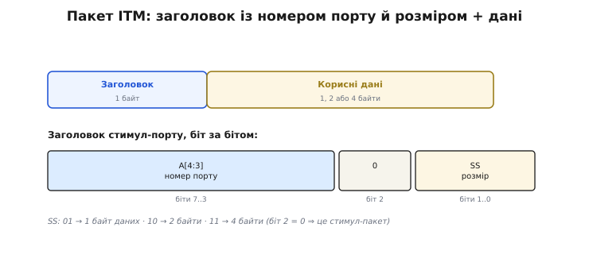
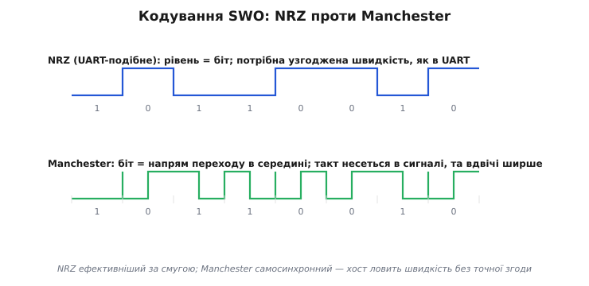
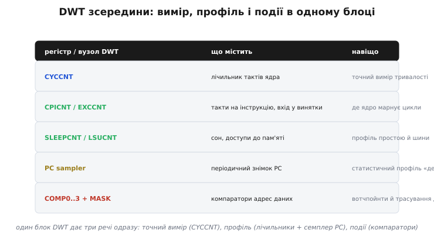
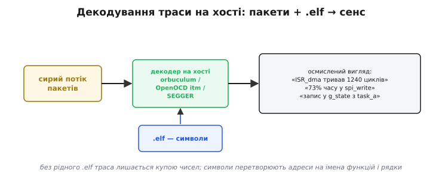

# Трасування углиб: пакети ITM, кодування SWO, регістри DWT, потік ETM

Трасування тримається на одній ідеї: щоб зрозуміти програму реального часу, її не можна спиняти — треба спостерігати на ходу. [Брейкпойнт](root:sys-ide/breakpoints-watchpoints) спиняє ядро й дає застиглий зріз; траса лишає слід того, що ядро робило, поки воно бігло на повній швидкості. У ядрах Cortex-M під це віддано окремий апаратний набір — ITM, DWT, ETM і TPIU. На рівні «що це таке» картина проста. Але щойно доходить до реальної роботи — налаштувати швидкість SWO, зрозуміти, чому половина пакетів губиться, прочитати, у якій функції програма проводить час, відновити шлях до рідкісного збою, — потрібно зазирнути в кожен блок глибше: як саме виглядає пакет на дроті, як біти кодуються в сигнал, які регістри DWT що дають і як хост перетворює сирий потік на імена функцій.

Розберімо це по порядку — від найдрібнішого (формат одного пакета), через фізику дроту й мапу регістрів, до повної траси інструкцій та інструментів на хості. І одразу межа, без якої все інше веде в оману: цей набір — частина відлагоджувальної архітектури ARM Cortex-M (вона зветься CoreSight). На STM32, nRF, RP2040 він є; на [ESP32](root:hw-arch/esp32-architecture) (Xtensa та RISC-V) його **немає** — там трасування йде [іншим маршрутом](root:embedded/openocd-gdb), поверх JTAG. Усе нижче — словник світу Cortex-M.

## Пакет ITM: заголовок плюс дані

[ITM дає прошивці дешевий голос](root:sys-ide/trace-itm-swo): записав слово в регістр стимул-порту — блок сам виштовхнув його назовні, поки ядро вже біжить далі. Але що саме йде по дроту? Не голе слово — інакше хост не розрізнив би, з якого порту воно й де його межі. Кожна порція обгортається в **пакет**: один байт заголовка плюс самі дані — один, два або чотири байти.

Заголовок несе дві речі. По-перше, **номер порту** — старші біти заголовка кажуть, у який із 32 стимул-портів писали; саме так хост потім розкладає єдиний потік назад на струмені (текст у консоль, числа в графік). По-друге, **розмір корисних даних** — два молодші біти заголовка кодують, скільки байтів даних іде слідом: `01` → один байт, `10` → два, `11` → чотири. Ще один біт заголовка відрізняє цей пакет-стимул від службових пакетів самого блоку (їх ITM теж уміє слати — мітки часу, лічильники).



*Заголовок несе номер порту й розмір; за ним стільки байтів даних, скільки заголовок оголосив — хост по цьому розбирає потік без здогадок.*

Звідси практичний наслідок про вартість. Надіслати 32-бітне число — це п'ять байтів на дроті (заголовок + чотири дані). Надіслати один байт-мітку — два байти. У гарячому коді різниця помітна, бо впирається в смугу SWO. Тому досвідчений підхід — слати **коротку мітку події**, а не довгий форматований рядок: байт «сталося X» замість десятка байтів тексту. Розшифрує мітку хост, у нього обчислювальних ресурсів удосталь.

Запис у порт із боку прошивки — це CMSIS-послідовність: спершу переконатися, що ITM і потрібний порт увімкнені, тоді дочекатися місця у внутрішньому буфері порту й записати дані. Перевірка місця критична: якщо буфер повний (попереднє ще не пішло на SWO), новий запис треба притримати, інакше пакет загубиться.

```c
// Запис байта у стимул-порт ITM з очікуванням місця (основа CMSIS ITM_SendChar)
static inline void itm_send8(uint32_t port, uint8_t value) {
    if (!(ITM->TCR & ITM_TCR_ITMENA_Msk)) return;   // блок ITM вимкнено
    if (!(ITM->TER & (1u << port)))        return;   // цей порт не ввімкнено
    while (ITM->PORT[port].u32 == 0u) { }            // 0 = буфера нема, чекаємо
    ITM->PORT[port].u8 = value;                      // запис байта = відправлення
}

// Те саме одним 32-бітним словом — один пакет на 4 байти даних
static inline void itm_send32(uint32_t port, uint32_t value) {
    if (!(ITM->TCR & ITM_TCR_ITMENA_Msk)) return;
    if (!(ITM->TER & (1u << port)))        return;
    while (ITM->PORT[port].u32 == 0u) { }
    ITM->PORT[port].u32 = value;
}
```

Ключ — у читанні `ITM->PORT[port].u32`: ненульове значення означає «є місце, пиши», нуль — «буфер зайнятий». Це той самий регістр, у який ми пишемо, тільки на читання він віддає прапорець готовності. На розмір запису блок дивиться по тому, **яким доступом** ти пишеш: `.u8` дасть пакет на один байт даних, `.u16` — на два, `.u32` — на чотири. Тип доступу прямо задає поле розміру в заголовку.

## Звідки в трасі час: мітки часу ITM

Сам по собі пакет ITM каже **що** сталося, але не **коли**. А для трасування реального часу час — половина сенсу: знати, що подія X сталася за 12 мкс після події Y, часто важливіше за самі події. Тому ITM уміє домішувати в потік **пакети-мітки часу** (англ. *timestamp* — «відбиток часу»). Працюють вони не так, як можна було б подумати — не абсолютним годинником, а **дельтами**.

Логіка ощадлива до смуги. Слати з кожним пакетом повне 32-бітне значення лічильника було б марнотратством. Замість цього ITM веде власний лічильник часу й вставляє мітку лише тоді, коли треба, причому несе в ній **різницю** — скільки тактів минуло від попередньої мітки. Малі дельти пакуються в один-два байти, великі — у більше. Хост, накопичуючи ці дельти, відновлює абсолютний час кожної події. Виходить компроміс: точний час подій коштує небагато байтів, бо платимо лише за приріст, а не за повне значення щоразу.

Тонкість, що кусає: коли потік густий, мітки часу самі **з'їдають смугу** SWO, наближаючи переповнення. І ще гірше — коли блок не встигає вставити мітку вчасно, він позначає її як **затриману** (неточну), і хост уже не може гарантувати, що подія сталася саме тоді. Тому ввімкнення повних міток часу на гарячому потоці — це торг: отримуєш час подій, але ризикуєш втратити частину самих подій. На практиці часто шлють час не до кожного пакета, а до ключових — наприклад, лише до міток входу/виходу [переривань](root:hw-arch/isr).

## Кодування SWO: NRZ проти Manchester і вибір швидкості

[SWO виносить пакети одним піном](root:sys-ide/trace-itm-swo) — лишається питання, **як саме біти лягають у сигнал на цьому піні**. TPIU вміє два кодування, і вибір між ними — компроміс «ефективність проти самосинхронності».

Перше — **NRZ** (англ. *Non-Return-to-Zero* — «без повернення до нуля»), по суті UART: рівень лінії прямо є значенням біта, обрамлений старт-бітом і стоп-бітом. Просто й ефективно за смугою — кожен такт лінії несе один біт. Але є умова: приймач мусить **наперед знати швидкість** так само точно, як у UART. Якщо хост і чип розійшлися в оцінці швидкості більш ніж на кілька відсотків, биті зчитаються зі зсувом — і весь потік перетвориться на сміття.

Друге — **Manchester** (за ім'ям Манчестерського університету, де кодування опрацювали на ранніх ЕОМ): значення біта несе не рівень, а **напрям переходу** в середині бітового інтервалу. Перехід є завжди, тож приймач ловить такт із самого сигналу — точної згоди про швидкість наперед не треба. Платня — кожен біт займає **подвійну ширину** (два рівні замість одного), тобто за ту саму частоту лінії корисних бітів удвічі менше.



*NRZ ефективніший за смугою, але вимагає точної згоди про швидкість; Manchester самосинхронний — хост ловить швидкість сам, ціною вдвічі ширшого біта.*

Звідси практика налаштування. Швидкість SWO задається діленням тактової частоти ядра на ціле число (регістр перед-дільника в TPIU). Хост-зонд мусить знати **і ту саму частоту ядра, і той самий дільник** — звідси найчастіша причина «порожнього SWO» при NRZ: хост думає, що ядро на одній частоті, а воно на іншій (наприклад, через [зміну тактування на ходу](root:hw-arch/clock-power)), дільник дає не ту швидкість, і пакети не читаються. Manchester до цього стійкіший, бо синхронізується сам, тому дешевші зонди часто тримаються саме його; швидші — беруть NRZ заради смуги. Хай там як, **смуга SWO скінченна**: коли джерела генерують більше, ніж пін виносить, внутрішній буфер переповнюється, і зайве мовчки губиться — про що траса ніяк не попереджає.

Є ще суто фізичний нюанс розводки, на якому легко спіткнутися. Пін SWO зазвичай **не окремий** — на більшості чипів він фізично збігається з ніжкою TDO порту [JTAG](root:sys-ide/swd-jtag-internals). Коли чип у режимі JTAG, ця ніжка віддана під TDO; коли в режимі [SWD](root:sys-ide/swd-jtag-internals), та сама ніжка вивільняється під SWO. Звідси трипровідне «SWD + траса»: дві лінії SWD (такт і дані) плюс ця третя під SWO. Практичний наслідок: щоб отримати SWO, ядро має бути саме в SWD-режимі, а не JTAG, — інакше ніжка зайнята під TDO, і скільки не налаштовуй ITM, на піні нічого не з'явиться. Це частий «порожній SWO» на платах, де зонд за звичкою підняв JTAG замість SWD.

> 🔧 **Навіщо це.** Коли SWO «не працює», діагноз майже завжди в одному з трьох: зонд підняв JTAG, а не SWD, і ніжка SWO зайнята під TDO; або хост узяв не ту частоту ядра й дільник (NRZ читається зі зсувом); або потік перевищив пропускну й буфер переповнюється. Перше лікують перемиканням транспорту в SWD, друге — точним заданням частоти зонду, третє — ощадливістю: коротші мітки, менше портів, нижча частота семплювання. Розуміння кодування й розводки одразу каже, який це випадок.

## Регістри DWT: вимір, профіль і події в одному блоці

[DWT](root:sys-ide/breakpoints-watchpoints) — той самий блок, що дає вотчпойнти, але всередині він значно багатший. Це три інструменти в одному корпусі, і всі троє працюють без зупину ядра.

**Вимір часу — CYCCNT.** 32-бітний лічильник, що тикає кожен такт ядра, сам собою, щойно ввімкнено глобальний прапорець трасування. [Різниця двох знімків](root:sys-ide/trace-itm-swo) дає точну тривалість ділянки в тактах. Вмикається трьома записами:

```c
// Увімкнути лічильник тактів DWT (Cortex-M3/M4/M7)
CoreDebug->DEMCR |= CoreDebug_DEMCR_TRCENA_Msk;  // глобальний дозвіл DWT/ITM
DWT->CYCCNT = 0;                                  // обнулити
DWT->CTRL  |= DWT_CTRL_CYCCNTENA_Msk;            // пустити лік
```

Прапорець `TRCENA` у регістрі `DEMCR` — головний рубильник усього трасування: без нього ні DWT, ні ITM не оживуть. Це частий промах — забути його виставити й дивуватися, чому `CYCCNT` стоїть на нулі.

**Профіль — лічильники подій і семплер PC.** DWT рахує службові події, кожна у своєму 8-бітному лічильнику: `CPICNT` — зайві такти на інструкції (де ядро гальмує), `EXCCNT` — такти у входах у винятки, `SLEEPCNT` — такти сну, `LSUCNT` — такти на доступи до пам'яті, `FOLDCNT` — «складені» (безкоштовні) інструкції. Разом вони показують, **на що ядро марнує цикли**. Окремо стоїть **семплер лічильника команд**: DWT може періодично виштовхувати через ITM знімок поточного PC. Часто-часто питаючи «де зараз PC», хост будує статистичний [профіль](root:sf-release/profiling) — гістограму «скільки часу в якій функції», знов-таки на ходу.

**Події — компаратори.** Чотири компаратори адрес (`COMP0..3` з масками) дають не лише [вотчпойнти-зупинки](root:sys-ide/breakpoints-watchpoints), а й **трасування доступу до даних**: замість спиняти ядро на запис у змінну, DWT може **надіслати пакет** про цей доступ через ITM — адресу, значення, лічильник тактів. Так видно, хто і коли торкається змінної, без жодної зупинки виконання.



*Один блок DWT покриває три потреби одразу: точний вимір (CYCCNT), статистичний профіль (лічильники + семплер PC) і події за адресами (компаратори).*

Звідси типовий вимір **завантаження ядра** без жодного зовнішнього інструмента: у циклі простою рахуємо такти, у яких ядро нічого корисного не робить, і ділимо на повний бюджет тактів за період. Усе на самих регістрах DWT:

**Завантаження ядра за період через CYCCNT.**

```c
// Частку часу, проведену в задачі простою, рахуємо лічильником тактів
static uint32_t idle_cycles, last_window;

void idle_hook(void) {              // викликається, коли робити нічого
    uint32_t t0 = DWT->CYCCNT;
    __WFI();                        // ядро спить до переривання
    idle_cycles += DWT->CYCCNT - t0;   // накопичуємо такти простою
}

// Раз на секунду рахуємо завантаження (частку часу поза простоєм)
float cpu_load_percent(void) {
    uint32_t now = DWT->CYCCNT;
    uint32_t window = now - last_window;        // тактів за вікно
    float load = 100.0f * (1.0f - (float)idle_cycles / (float)window);
    last_window = now;
    idle_cycles = 0;
    return load;                                 // % часу, коли ядро НЕ простоювало
}
```

Розрахунок прозорий: якщо за вікно у 168 млн тактів (секунда на 168 МГц) ядро проспало 120 млн, то воно було зайняте 48 млн — завантаження ≈ 28.6%. Жодного зупину, жодного зовнішнього таймера: сам лічильник тактів дає і знаменник (повне вікно), і чисельник (час простою).

## Потік ETM і його декодування на хості

ITM і DWT дають вибірковий слід. [ETM](root:sys-ide/trace-itm-swo) дає **повний** — кожну виконану інструкцію. Але «потік усіх інструкцій» наївно уявляти як список адрес: це були б гігабайти за секунди. ETM тиснуть до краю, і ключ до стиснення — **передбачуваність коду**.

Поки виконання йде прямо, наступну інструкцію хост обчислює сам із вихідного коду — її передавати не треба. Передавати треба лише там, де хід **непередбачуваний**: на розгалуженнях («куди пішло — туди чи туди»), на непрямих переходах (адреса в регістрі), на входах у переривання. Тому ETM шле здебільшого крихітні пакети «гілку взято / не взято», а повну адресу — лише там, де її не вивести з коду. Маючи цей скелет рішень плюс сам бінарник, хост **відновлює дослівний маршрут** — кожен крок ядра, наче запис екрана для процесора.

Навіть так потік густий, і тут вступає друга ідея — **не трасувати все підряд**. ETM має власні компаратори адрес, якими задають **діапазон інтересу**: трасувати лише код у певних межах адрес, а решту пропускати. Це зветься фільтруванням за діапазоном (англ. *address range* — «діапазон адрес»). Сильніші версії ETM уміють фільтрувати ще тонше — за станом захищеності, за контекстом задачі, — але базова й найкорисніша річ саме ця: звузити трасу до однієї підозрілої функції чи модуля. Поряд із фільтром працює **тригер** (англ. *trigger* — «спусковий гачок»): умова, що позначає в потоці момент інтересу — наприклад, «почати ловити, коли PC увійшов у цю адресу». Разом фільтр і тригер перетворюють «потоп усіх інструкцій» на «лише те, що навколо проблеми», і густина потоку падає на порядки.

> 🔧 **Навіщо це.** Фільтр і тригер ETM — це різниця між «зловив проблему» і «зонд захлинувся». Без фільтра повна траса переповнить буфер зонда за частки секунди, і потрібний фрагмент потоне в шумі. Звузивши діапазон до підозрілого модуля й поставивши тригер на момент збою, ловиш саме той шлях, що веде до падіння, — і буфера вистачає надовго.

Звідси й фізика виносу. Навіть стиснутий і відфільтрований, потік ETM густіший за все, що дають ITM і DWT, тож один пін SWO його зазвичай не тягне. ETM потребує **паралельного trace-порту** — окремих ніжок (зазвичай 4, буває й більше) плюс зонда з буфером і високою частотою захоплення. Усі джерела — ITM, DWT, ETM — спершу зливаються в спільний потік у TPIU, а той віддає його або вузько в SWO (легка траса), або широко в trace-порт (повна ETM). Коли джерел кілька, TPIU обгортає пакети в кадри зі службовими мітками — інакше хост не розбере, де чий пакет; одне джерело можна слати й без обгортки.

Сирий потік сам по собі — **мертві числа**. Перетворює його на сенс хост-інструмент, і робить це лише разом із [рідним .elf](root:embedded/openocd-gdb): тим самим бінарником, що залитий у чип, із повною таблицею символів. Декодер розбирає пакети на події, а адреси в них мапить на імена функцій і рядки коду через `.elf`.



*Без рідного .elf траса лишається купою чисел; символи з .elf перетворюють адреси на імена функцій, рядки коду й стек.*

Інструментів кілька, і вони діляться за роллю. **OpenOCD** уміє приймати ITM-потік і складати його у файли портів (`tpiu`/`itm` команди), тож для легкої траси окремий софт не потрібен. **orbuculum** (з пакета Orbcode; *orbuculum* — латиною «кришталева куля») — відкритий набір саме під SWO/ITM: ловить потік, розбирає пакети, дає текстовий вивід, профіль і живі графіки. **SEGGER** із зондом J-Link дає власний конвеєр (RTT для швидкого вводу-виводу і трасування під свій софт). Розбір найскладнішого — стиснутого потоку ETM — лягає на спеціальну бібліотеку-декодер; відкритий стандарт тут **OpenCSD** (англ. *Open CoreSight Decoder*), той самий, що ним користується трасування в ядрі Linux. Хай там який інструмент — принцип один: пакети плюс `.elf` дають імена, а без рідного `.elf` навіть бездоганний потік нічого не означає.

> 🔧 **Навіщо це.** Розуміти, що траса безсенсова без рідного `.elf`, треба з тієї ж причини, що й [у GDB](root:embedded/openocd-gdb): перекомпілював, але не оновив `.elf` під залиту прошивку — і декодер покаже хибні функції або взагалі сміття. Друге: знати, що ETM потребує широкого порту, а ITM/DWT влазять у SWO, — щоб наперед обрати потрібний зонд: для профілювання й вимірів ISR досить дешевого SWO-зонда, для ловлі рідкісних збоїв із повним шляхом — дорожчого з trace-портом.

## Дві пастки виміру: оберт лічильника й вартість самого датчика

Два підступні нюанси кусають, коли від теорії переходиш до реальних вимірів CYCCNT.

Перший — **оберт лічильника**. CYCCNT 32-бітний, тож на 168 МГц він повністю обертається за 2³² / 168·10⁶ ≈ 25.6 с і починає з нуля. Для виміру [переривання](root:hw-arch/isr) це не загроза — обробник коротший за частку секунди. Але різниця `DWT->CYCCNT - t0` лишається правильною й **через** оберт: беззнакова 32-бітна арифметика сама дає різницю по модулю 2³², тож якщо ділянка коротша за повний оберт, окремо ловити переповнення не треба. Помилка приходить лише там, де міряна ділянка довша за 25.6 с (на цій частоті) — тоді один оберт «з'їдається» непомітно, і результат бреше. Для довгих інтервалів беруть інший лічильник — ширший таймер або накопичення обертів.

Другий — **вартість самого датчика**. Здається, що `t0 = DWT->CYCCNT` безкоштовне, але читання регістра й виклик `itm_send32` теж займають такти, і вони потрапляють усередину виміряного вікна, якщо поставити їх необережно. Для грубого виміру (сотні тактів) ця домішка дрібна. Для тонкого (десятки тактів) — її враховують: міряють «порожню» ділянку між двома сусідніми знімками, дістають фіксовану накладку самого виміру й віднімають її від результату. Це той самий принцип, що скрізь у трасуванні: **інструмент не безкоштовний, і чим тонший вимір, тим більше важить вплив самого інструмента** на те, що він міряє. ITM тим і цінний, що ця накладка в нього мінімальна — кілька тактів на запис у порт проти сотень мікросекунд UART, — але нуль вона не дорівнює ніколи.

## Як це лягає в роботу

Зведімо нитку. Три джерела покривають три різні потреби, і обирають їх за задачею, а не «беремо все». Треба дешевий вивід замість гальмівного UART — **ITM**, порт 0 під текст, інші порти під струмені подій. Треба точно знати, скільки триває [переривання](root:hw-arch/isr) чи де програма марнує час, — **DWT**: CYCCNT для прямого виміру, семплер PC і лічильники подій для профілю. Треба повну історію виконання, щоб упіймати рідкісний збій реального часу або зміряти покриття коду на залізі, — **ETM** із широким портом. Винос усього цього зводить **TPIU**: легке — в один пін SWO, повне — у паралельний trace-порт.

І наскрізна межа, яка береже від хибних висновків: усе це — апаратура ARM Cortex-M. Побачив «ITM», «SWO», «CYCCNT», «ETM» — це світ STM32, nRF, RP2040 і родичів. На [ESP32](root:hw-arch/esp32-architecture) тих регістрів немає: Xtensa та RISC-V закривають ту саму потребу спостерігати без зупину [іншою дорогою](root:embedded/openocd-gdb) — трасуванням рівня застосунку поверх JTAG. Ідея спільна для всіх — не спиняти живе ядро; конкретні блоки й піни — ні.
