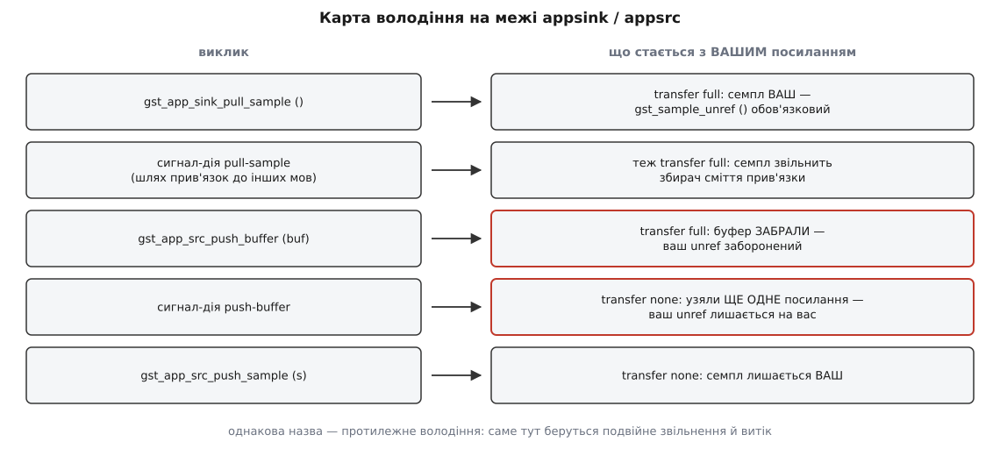

# 📋 appsink і appsrc: контракт у таблицях

Повний перелік властивостей, сигналів і C-функцій обох елементів бібліотеки `libgstapp` — із типами, значеннями за замовчуванням і версією GStreamer, у якій кожен пункт з'явився (звірено з офіційною документацією й заголовками станом на 1.28). Тримати це в голові немає сенсу: більшість помилок на мосту між конвеєром і застосунком — не помилки логіки, а невгадане значення за замовчуванням або переплутане володіння буфером.

## Домовленості, спільні для обох елементів

**Ліміти черги.** Скрізь, де в стовпчику «за замовчуванням» стоїть `0`, це означає «без обмежень», а не «нічого не вміщується». Свіжостворений `appsink` черги не обмежує взагалі й росте, доки є пам'ять. Єдиний виняток — `max-bytes` у `appsrc`: там за замовчуванням 200000 байтів.

**Час.** Усе, що зветься `*-time`, `*-latency` чи `duration`, вимірюється в наносекундах і має тип `GstClockTime` (це `guint64`).

```
GST_SECOND         = 1 000 000 000 нс
GST_MSECOND        =     1 000 000 нс
кадр при 30 к/с    = GST_SECOND / 30 ≈ 33 333 333 нс
max-time = 100 мс  = 100 · GST_MSECOND = 100 000 000
GST_CLOCK_TIME_NONE = 0xFFFFFFFFFFFFFFFF — «невідомо»
```

**Версія.** Порожньо (—) у стовпчику «з версії» означає «є від 1.0».

**Два входи до тих самих ручок.** Кожна властивість доступна і як GObject-властивість (`g_object_set()`, а також текстом у рядку `gst-launch-1.0`), і як окремий C-сетер (`gst_app_sink_set_max_buffers()`). Різниці в поведінці немає; C-сетери трохи швидші й типобезпечні, властивості — єдиний спосіб налаштувати елемент із рядка конвеєра або з прив'язки до іншої мови.

## appsink: властивості

| властивість | тип | за замовчуванням | з версії | що робить |
| --- | --- | --- | --- | --- |
| `caps` | `GstCaps *` | NULL | — | фільтр на sink-паді: які формати приймач узагалі згоден брати |
| `emit-signals` | `gboolean` | `false` | — | вмикає випуск сигналів `new-sample`, `new-preroll`, `new-serialized-event`, `propose-allocation` |
| `eos` | `gboolean`, лише читання | `true` | — | приймач у кінці потоку **або** ще не стартував — обидва стани дають `true` |
| `max-buffers` | `guint` | `0` | — | стеля внутрішньої черги в буферах |
| `max-bytes` | `guint64` | `0` | 1.24 | стеля черги в байтах |
| `max-time` | `guint64`, нс | `0` | 1.24 | стеля черги в сумарній тривалості |
| `drop` | `gboolean` | `false` | застаріла з 1.28 | викидати найстаріші буфери при повній черзі; замінена на `leaky-type` |
| `leaky-type` | `GstAppLeakyType` | `none` | 1.28 | що робити з повною чергою замість блокування |
| `wait-on-eos` | `gboolean` | `true` | 1.8 | дочекатися, поки застосунок забере всю чергу, і лише тоді віддати EOS |
| `buffer-list` | `gboolean` | `false` | — | віддавати семпли, що несуть `GstBufferList`, а не поодинокі буфери |
| `current-level-buffers` | `guint64`, читання | `0` | 1.28 | скільки буферів у черзі просто зараз |
| `current-level-bytes` | `guint64`, читання | `0` | 1.28 | те саме в байтах |
| `current-level-time` | `guint64` нс, читання | `0` | 1.28 | те саме в тривалості |
| `in` | `guint64`, читання | `0` | 1.28 | скільки буферів увійшло в елемент за весь час |
| `out` | `guint64`, читання | `0` | 1.28 | скільки віддано застосунку |
| `dropped` | `guint64`, читання | `0` | 1.28 | скільки викинуто |
| `silent` | `gboolean` | `true` | 1.28 | не слати `notify` на кожен викинутий буфер |

Три лічильники `in`, `out` і `dropped` разом дають найдешевшу діагностику мосту: якщо `in` росте, а `out` стоїть — ваш бік не читає; якщо росте `dropped` — ви не встигаєте за потоком. Властивість `silent` за замовчуванням увімкнена саме тому, що сигнал `notify::dropped` на кожен викинутий кадр коштував би дорожче за саме викидання.

**Успадковане від `GstBaseSink`** — його теж доводиться чіпати мало не щоразу, тому варто мати перед очима: `sync` (`gboolean`, за замовчуванням `true`), `async` (`true`), `qos` (`false`), `max-lateness` (`gint64`, `-1`), `ts-offset` (`0`) і, окремо підступне, `enable-last-sample` (`gboolean`, `true`). Останнє означає, що базовий приймач тримає посилання на останній буфер, який через нього пройшов. Документація прямо радить вимикати це, коли буфери мають звільнятися якнайшвидше — тобто коли за приймачем стоїть [пул буферів](topic:sys-media/buffers-and-memory) зі скінченної кількості шматків пам'яті: один зайвий утриманий кадр з пулу на чотири буфери — це чверть пулу назавжди.

## appsink: сигнали

Усі чотири сигнали, крім `eos`, випускаються **лише** коли `emit-signals` дорівнює `true`, і всі — з потоку передавання конвеєра.

| сигнал | параметри | повертає | з версії |
| --- | --- | --- | --- |
| `new-preroll` | `(GstAppSink *, gpointer)` | `GstFlowReturn` | — |
| `new-sample` | `(GstAppSink *, gpointer)` | `GstFlowReturn` | — |
| `new-serialized-event` | `(GstAppSink *, gpointer)` | `gboolean` | 1.20 |
| `propose-allocation` | `(GstAppSink *, GstQuery *, gpointer)` | `gboolean` | 1.24 |
| `eos` | `(GstAppSink *, gpointer)` | — | — |

Ані `new-preroll`, ані `new-sample` семпла з собою не приносять: вони лише повідомляють, що в черзі щось є, а забирати треба окремим викликом (`pull-preroll` чи `pull-sample`). Сигнал `propose-allocation` дає застосунку право відповісти на запит про розподіл пам'яті від сусіда вище за течією — саме через нього `appsink` може попросити, скажімо, вирівняний або прив'язаний до пристрою буфер.

## appsink: сигнали-дії

Сигнал-дія — це метод, який GObject дозволяє викликати через механізм сигналів (`g_signal_emit_by_name()` або `sink.emit("pull-sample")` з прив'язки). Він працює завжди, незалежно від `emit-signals`: та властивість керує лише сигналами-подіями з попередньої таблиці.

| сигнал-дія | параметри | повертає | з версії |
| --- | --- | --- | --- |
| `pull-preroll` | — | `GstSample *` або NULL | — |
| `pull-sample` | — | `GstSample *` або NULL | — |
| `try-pull-preroll` | `timeout` (`guint64`, нс) | `GstSample *` або NULL | 1.10 |
| `try-pull-sample` | `timeout` (`guint64`, нс) | `GstSample *` або NULL | 1.10 |
| `try-pull-object` | `timeout` (`guint64`, нс) | `GstSample *`, `GstEvent *` або NULL | 1.20 |

NULL тут означає три різні речі одразу: приймач зупинено (переведено в READY чи NULL), настав кінець потоку, або в `try-*` варіантах вичерпався таймаут. Розрізнити їх можна лише додатковою перевіркою `gst_app_sink_is_eos()` — це і є причина, чому цикл читання майже завжди має вигляд «NULL → спитати про EOS → або вийти, або крутитися далі».

Окрема пастка в `try_pull_object`: він витягує серіалізовані події, але **не** віддає EOS — на ній він повертає NULL, як і на будь-якій іншій зупинці.

## appsink: C-функції

```c
/* формат і режим роботи */
void          gst_app_sink_set_caps      (GstAppSink *appsink, const GstCaps *caps);
GstCaps *     gst_app_sink_get_caps      (GstAppSink *appsink);
gboolean      gst_app_sink_is_eos        (GstAppSink *appsink);
void          gst_app_sink_set_emit_signals (GstAppSink *appsink, gboolean emit);
gboolean      gst_app_sink_get_emit_signals (GstAppSink *appsink);

/* межі внутрішньої черги */
void          gst_app_sink_set_max_buffers (GstAppSink *appsink, guint max);
guint         gst_app_sink_get_max_buffers (GstAppSink *appsink);
void          gst_app_sink_set_max_bytes   (GstAppSink *appsink, guint64 max);       /* 1.24 */
guint64       gst_app_sink_get_max_bytes   (GstAppSink *appsink);
void          gst_app_sink_set_max_time    (GstAppSink *appsink, GstClockTime max);  /* 1.24 */
GstClockTime  gst_app_sink_get_max_time    (GstAppSink *appsink);

/* поточне заповнення — 1.28 */
guint64       gst_app_sink_get_current_level_buffers (GstAppSink *appsink);
guint64       gst_app_sink_get_current_level_bytes   (GstAppSink *appsink);
GstClockTime  gst_app_sink_get_current_level_time    (GstAppSink *appsink);

/* поведінка при переповненні й на кінці потоку */
void            gst_app_sink_set_drop       (GstAppSink *appsink, gboolean drop);      /* застаріле з 1.28 */
gboolean        gst_app_sink_get_drop       (GstAppSink *appsink);
void            gst_app_sink_set_leaky_type (GstAppSink *appsink, GstAppLeakyType leaky); /* 1.28 */
GstAppLeakyType gst_app_sink_get_leaky_type (GstAppSink *appsink);
void            gst_app_sink_set_wait_on_eos (GstAppSink *appsink, gboolean wait);      /* 1.8 */
gboolean        gst_app_sink_get_wait_on_eos (GstAppSink *appsink);
void            gst_app_sink_set_buffer_list_support (GstAppSink *appsink, gboolean enable_lists);
gboolean        gst_app_sink_get_buffer_list_support (GstAppSink *appsink);

/* забирання даних — усе повертає transfer full */
GstSample *     gst_app_sink_pull_preroll     (GstAppSink *appsink);
GstSample *     gst_app_sink_pull_sample      (GstAppSink *appsink);
GstMiniObject * gst_app_sink_pull_object      (GstAppSink *appsink);                  /* 1.20 */
GstSample *     gst_app_sink_try_pull_preroll (GstAppSink *appsink, GstClockTime timeout); /* 1.10 */
GstSample *     gst_app_sink_try_pull_sample  (GstAppSink *appsink, GstClockTime timeout); /* 1.10 */
GstMiniObject * gst_app_sink_try_pull_object  (GstAppSink *appsink, GstClockTime timeout); /* 1.20 */

/* зворотні виклики */
void gst_app_sink_set_callbacks (GstAppSink *appsink, GstAppSinkCallbacks *callbacks,
                                 gpointer user_data, GDestroyNotify notify);
void gst_app_sink_set_simple_callbacks (GstAppSink *appsink, GstAppSinkSimpleCallbacks *cb); /* 1.28 */
```

Блокувальні `pull_preroll()` і `pull_sample()` чекають, доки не з'явиться семпл, доки не прийде EOS **або доки елемент не переведуть у READY чи NULL**. Остання умова — єдине, що рятує ваш цикл від вічного очікування на конвеєрі, який зупиняють ззовні; без неї потік завис би назавжди.

## GstAppSinkCallbacks

```c
typedef struct {
  void          (*eos)                (GstAppSink *appsink, gpointer user_data);
  GstFlowReturn (*new_preroll)        (GstAppSink *appsink, gpointer user_data);
  GstFlowReturn (*new_sample)         (GstAppSink *appsink, gpointer user_data);
  gboolean      (*new_event)          (GstAppSink *appsink, gpointer user_data);      /* 1.20 */
  gboolean      (*propose_allocation) (GstAppSink *appsink, GstQuery *query,
                                       gpointer user_data);                           /* 1.24 */
  gpointer      _gst_reserved[GST_PADDING - 2];
} GstAppSinkCallbacks;
```

Три речі про цю структуру, кожна з яких свого часу коштувала комусь вечора.

**Заповнюйте її нулями перед використанням** (`GstAppSinkCallbacks cb = { 0 };` або `memset`). Поля, додані у версіях 1.20 і 1.24, з'їли два вказівники з резерву `_gst_reserved`; код, зібраний зі старим заголовком і залишеним сміттям у структурі, отримає виклик за випадковою адресою.

**Назви полів і назви сигналів не збігаються.** Поле зветься `new_event`, а сигнал — `new-serialized-event`; це той самий механізм під двома іменами.

**Зворотні виклики вимикають сигнали.** Якщо ви поставили структуру через `gst_app_sink_set_callbacks()`, елемент не випускає ані `new-sample`, ані `new-preroll` — свідома оптимізація, бо випуск GObject-сигналу на кожен кадр помітно дорожчий за прямий виклик функції. Отже, «поставив зворотні виклики і про всяк випадок ще й підписався сигналом» не працює: спрацює лише зворотний виклик.

Версія 1.28 додала другий, дружніший до прив'язок спосіб — непрозорий об'єкт `GstAppSinkSimpleCallbacks` із власним підрахунком посилань, де кожен обробник ставиться окремо:

```c
GstAppSinkSimpleCallbacks *cb = gst_app_sink_simple_callbacks_new ();
gst_app_sink_simple_callbacks_set_new_sample (cb, on_new_sample, self, NULL);
gst_app_sink_set_simple_callbacks (sink, cb);
gst_app_sink_simple_callbacks_unref (cb);
```

Кожен сетер бере власні `user_data` і власний `GDestroyNotify`, тож обробники більше не мусять ділити один контекст — саме це й заважало прив'язкам користуватися старою структурою.

## appsrc: властивості

| властивість | тип | за замовчуванням | з версії | що робить |
| --- | --- | --- | --- | --- |
| `caps` | `GstCaps *` | NULL | — | що саме ви штовхатимете; має бути фіксованим, без діапазонів і списків |
| `format` | `GstFormat` | `bytes` | — | одиниця сегмента й позиціювання; для будь-якого медіа з часом потрібне `time` |
| `is-live` | `gboolean` | `false` | — | поводитися як жива камера: віддавати буфери лише в PLAYING |
| `do-timestamp` | `gboolean` | `false` | — | штемпелювати буфер часом його надходження в елемент |
| `block` | `gboolean` | `false` | — | блокувати штовхання, доки черга не опуститься нижче межі |
| `max-bytes` | `guint64` | `200000` | — | після цієї межі елемент випускає `enough-data` |
| `max-buffers` | `guint64` | `0` | 1.20 | те саме в буферах |
| `max-time` | `guint64`, нс | `0` | 1.20 | те саме в тривалості |
| `min-percent` | `guint` | `0` | — | коли черга спорожніє нижче цього відсотка від `max-bytes`, елемент випускає `need-data` |
| `min-latency` | `gint64`, нс | `-1` | — | ваше зобов'язання перед конвеєром; `-1` — рахувати за замовчуванням `GstBaseSrc` |
| `max-latency` | `gint64`, нс | `-1` | — | `-1` означає «без обмежень» |
| `stream-type` | `GstAppStreamType` | `stream` | — | чи можна вас перемотувати |
| `size` | `gint64` | `-1` | — | загальний розмір потоку в байтах, якщо відомий |
| `duration` | `guint64`, нс | `GST_CLOCK_TIME_NONE` | 1.10 | загальна тривалість, якщо відома |
| `leaky-type` | `GstAppLeakyType` | `none` | 1.20 | що робити з повною чергою замість блокування |
| `handle-segment-change` | `gboolean` | `false` | 1.18 | помічати зміну `GstSegment` усередині штовхнутого семпла; вимагає `format=time` |
| `emit-signals` | `gboolean` | **`true`** | — | вмикає `need-data`, `enough-data`, `seek-data` |
| `current-level-bytes` | `guint64`, читання | `0` | 1.2 | скільки байтів у черзі зараз |
| `current-level-buffers` | `guint64`, читання | `0` | 1.20 | те саме в буферах |
| `current-level-time` | `guint64` нс, читання | `0` | 1.20 | те саме в тривалості |

Два значення за замовчуванням у цій таблиці варті того, щоб їх помітили окремо.

`emit-signals` тут дорівнює `true`, а в `appsink` — `false`. Асиметрія історична: `appsrc` завжди покладався на сигнали як на основний механізм, і вмикати їх для сумісності лишили. Документація радить вимикати їх, коли ви користуєтеся зворотними викликами, бо випуск сигналів недешевий.

`format` дорівнює `bytes` — і це джерело найтихішої з типових поломок. Сегмент у байтах не дає приймачам синхронізуватися, а мультиплексорам — записати тривалість; при цьому нічого не падає й у журнал нічого не пишеться.

## appsrc: сигнали й сигнали-дії

| сигнал | параметри | повертає | з версії |
| --- | --- | --- | --- |
| `need-data` | `(GstAppSrc *, guint length, gpointer)` | — | — |
| `enough-data` | `(GstAppSrc *, gpointer)` | — | — |
| `seek-data` | `(GstAppSrc *, guint64 offset, gpointer)` | `gboolean` | — |

Параметр `length` у `need-data` — це підказка «скільки байтів зараз хотілося б», а не вимога: штовхнути можна більше або менше. Обробник `seek-data` має повернути `TRUE`, якщо він справді перемотав своє джерело на вказане зміщення; конвеєр повірить йому на слово й чекатиме даних саме звідти.

| сигнал-дія | параметри | повертає | з версії |
| --- | --- | --- | --- |
| `push-buffer` | `(GstBuffer *)` | `GstFlowReturn` | — |
| `push-buffer-list` | `(GstBufferList *)` | `GstFlowReturn` | 1.14 |
| `push-sample` | `(GstSample *)` | `GstFlowReturn` | 1.6 |
| `end-of-stream` | — | `GstFlowReturn` | — |

`push-sample` відрізняється від `push-buffer` не лише типом: він **бере caps із семпла й переузгоджує формат**, якщо той змінився. Це найдешевший спосіб перекласти кадри з `appsink` в `appsrc` так, щоб зміна роздільності посеред потоку не зламала другий конвеєр. Разом з `handle-segment-change` він же переносить і сегмент.

## appsrc: C-функції

```c
/* формат і опис потоку */
void             gst_app_src_set_caps        (GstAppSrc *appsrc, const GstCaps *caps);
GstCaps *        gst_app_src_get_caps        (GstAppSrc *appsrc);
void             gst_app_src_set_size        (GstAppSrc *appsrc, gint64 size);
gint64           gst_app_src_get_size        (GstAppSrc *appsrc);
void             gst_app_src_set_duration    (GstAppSrc *appsrc, GstClockTime duration); /* 1.10 */
GstClockTime     gst_app_src_get_duration    (GstAppSrc *appsrc);
void             gst_app_src_set_stream_type (GstAppSrc *appsrc, GstAppStreamType type);
GstAppStreamType gst_app_src_get_stream_type (GstAppSrc *appsrc);

/* межі черги й поточне заповнення */
void         gst_app_src_set_max_bytes   (GstAppSrc *appsrc, guint64 max);
guint64      gst_app_src_get_max_bytes   (GstAppSrc *appsrc);
void         gst_app_src_set_max_buffers (GstAppSrc *appsrc, guint64 max);      /* 1.20 */
guint64      gst_app_src_get_max_buffers (GstAppSrc *appsrc);
void         gst_app_src_set_max_time    (GstAppSrc *appsrc, GstClockTime max); /* 1.20 */
GstClockTime gst_app_src_get_max_time    (GstAppSrc *appsrc);
guint64      gst_app_src_get_current_level_bytes   (GstAppSrc *appsrc);
guint64      gst_app_src_get_current_level_buffers (GstAppSrc *appsrc);
GstClockTime gst_app_src_get_current_level_time    (GstAppSrc *appsrc);
void            gst_app_src_set_leaky_type (GstAppSrc *appsrc, GstAppLeakyType leaky); /* 1.20 */
GstAppLeakyType gst_app_src_get_leaky_type (GstAppSrc *appsrc);

/* затримка */
void gst_app_src_set_latency (GstAppSrc *appsrc, guint64 min, guint64 max);
void gst_app_src_get_latency (GstAppSrc *appsrc, guint64 *min, guint64 *max);

/* штовхання даних */
GstFlowReturn gst_app_src_push_buffer      (GstAppSrc *appsrc, GstBuffer *buffer);
GstFlowReturn gst_app_src_push_buffer_list (GstAppSrc *appsrc, GstBufferList *buffer_list); /* 1.14 */
GstFlowReturn gst_app_src_push_sample      (GstAppSrc *appsrc, GstSample *sample);          /* 1.6 */
GstFlowReturn gst_app_src_end_of_stream    (GstAppSrc *appsrc);

/* зворотні виклики */
void gst_app_src_set_callbacks (GstAppSrc *appsrc, GstAppSrcCallbacks *callbacks,
                                gpointer user_data, GDestroyNotify notify);
void gst_app_src_set_simple_callbacks (GstAppSrc *appsrc, GstAppSrcSimpleCallbacks *cb); /* 1.28 */
```

Зверніть увагу на пару `set_latency`/`get_latency`: у C-інтерфейсі обидва числа беруться й віддаються разом і мають тип `guint64`, тоді як однойменні властивості — `gint64` зі значенням `-1` як «за замовчуванням» чи «без обмежень». Як конвеєр збирає ці числа з усіх елементів у спільний бюджет, описано в [темі про затримку](topic:sys-media/latency-and-buffering) — там же видно, чому оголошена вами `min-latency` прямо додається до затримки всієї системи.

## GstAppSrcCallbacks

```c
typedef struct {
  void     (*need_data)   (GstAppSrc *src, guint length, gpointer user_data);
  void     (*enough_data) (GstAppSrc *src, gpointer user_data);
  gboolean (*seek_data)   (GstAppSrc *src, guint64 offset, gpointer user_data);
  gpointer _gst_reserved[GST_PADDING];
} GstAppSrcCallbacks;
```

Структура простіша за приймачеву й від 1.0 не змінювалася, тож резерв цілий. З 1.28 у джерела теж є непрозорий `GstAppSrcSimpleCallbacks` із сетерами `..._set_need_data()`, `..._set_enough_data()`, `..._set_seek_data()` — з тим самим правилом «зворотні виклики скасовують сигнали».

## GstFlowReturn: що означає код повернення

Це значення повертають `new_sample`, усі функції штовхання й майже все, що передає дані в GStreamer. Ігнорувати його — найдешевший спосіб отримати цикл, який після зупинки конвеєра крутиться вхолосту.

| значення | число | що означає | що робити |
| --- | --- | --- | --- |
| `GST_FLOW_OK` | 0 | дані пройшли | продовжувати |
| `GST_FLOW_NOT_LINKED` | −1 | пад ні з чим не з'єднано | зупинити штовхання; це помилка складання конвеєра |
| `GST_FLOW_FLUSHING` | −2 | пад скидається: елемент не в PAUSED і не в PLAYING | тихо вийти з циклу — конвеєр згортається, це не збій |
| `GST_FLOW_EOS` | −3 | потік уже завершено | вийти з циклу |
| `GST_FLOW_NOT_NEGOTIATED` | −4 | формат не узгоджено | перевірити `caps`: майже завжди вони не фіксовані або їх забули поставити |
| `GST_FLOW_ERROR` | −5 | фатальна помилка | зупинити конвеєр; подробиці шукати в повідомленні на шині |
| `GST_FLOW_NOT_SUPPORTED` | −6 | операцію не підтримано | помилка коду, не даних |

Понад це є діапазони `GST_FLOW_CUSTOM_SUCCESS` (100, 101, 102) і `GST_FLOW_CUSTOM_ERROR` (−100, −101, −102) — для власних елементів; `appsink` і `appsrc` їх не породжують. Знак тут несе сенс: усе менше за нуль — зупинка, усе решта — успіх. Тому `if (ret < GST_FLOW_OK)` ловить рівно помилки, а `if (ret != GST_FLOW_OK)` — ще й нестандартні успіхи. Для цих двох елементів обидві перевірки збігаються; різниця вилазить у коді, який колись побачить чужий елемент.

Відрізняти `GST_FLOW_FLUSHING` від решти варто окремим рядком: це **штатне** завершення, яке ви побачите щоразу, коли конвеєр зупиняють з іншого потоку. Скидання прив'язане до стану елемента, і те, коли саме воно настає, залежить від [переходів між станами](topic:sys-media/states-lifecycle).

## Перелічення

```c
typedef enum {
  GST_APP_LEAKY_TYPE_NONE,        /* не протікати: черга блокує (за замовчуванням) */
  GST_APP_LEAKY_TYPE_UPSTREAM,    /* викидати НОВІ буфери — ті, що приходять */
  GST_APP_LEAKY_TYPE_DOWNSTREAM   /* викидати СТАРІ буфери — ті, що вже в черзі */
} GstAppLeakyType;                /* з 1.20 в appsrc, з 1.28 в appsink */

typedef enum {
  GST_APP_STREAM_TYPE_STREAM,         /* перемотування неможливе — жива трансляція */
  GST_APP_STREAM_TYPE_SEEKABLE,       /* перемотування можливе, але повільне — дані з вебсервера */
  GST_APP_STREAM_TYPE_RANDOM_ACCESS   /* перемотування швидке — локальний файл */
} GstAppStreamType;
```

Напрямок у `GstAppLeakyType` називають з погляду черги, а не вашого: `upstream` — це «протікає з боку того, хто кладе», тобто новий буфер до черги не потрапляє взагалі. Для «мені потрібен найсвіжіший кадр» правильне значення — `downstream` разом із `max-buffers=1`.

Тип потоку в `appsrc` не косметика: обравши `seekable` або `random-access`, ви зобов'язуєтеся обробляти `seek-data`. Якщо ви оголосили себе перемотуваним, а обробника немає, конвеєр вирішить, що перемотування вдалося, і чекатиме даних із нової позиції, яких ви ніколи не пришлете.

## Володіння: точна межа

Це єдине місце контракту, де однакова назва означає протилежні речі, і воно ж — джерело двох найгірших видів помилок: подвійного звільнення й витоку пам'яті. Обидва проявляються не там і не тоді, де сталися.



*Ліворуч — виклик, праворуч — доля вашого посилання; червоним позначено пару з однаковою назвою й протилежним володінням.*

| виклик | анотація | хто звільняє |
| --- | --- | --- |
| `gst_app_sink_pull_sample()` та всі `pull_*` / `try_pull_*` | `transfer full` на поверненні | ви: `gst_sample_unref()` |
| `gst_app_src_push_buffer()` | `transfer full` на параметрі | елемент; ваш `unref` заборонений |
| `gst_app_src_push_buffer_list()` | `transfer full` на параметрі | елемент |
| `gst_app_src_push_sample()` | `transfer none` на параметрі | ви: семпл лишається вашим |
| сигнал-дія `push-buffer` | `transfer none` | ви: елемент лише додає своє посилання |

Формулювання документації для сигналу-дії варте дослівного прочитання: функція не бере володіння буфером, а бере посилання, тож буфер можна звільнити будь-коли після виклику. Механіка [підрахунку посилань](topic:sf-lang/reference-counting) тут звичайна — просто дві двері до тієї самої кімнати відчиняються в різні боки.

Різниця не примха: сигнали-дії викликають переважно з прив'язок до інших мов, де за пам'яттю стежить середовище виконання, і воно **мусить** лишитися власником об'єкта. C-функція такого клопоту не має, тому забирає буфер і економить одну пару `ref`/`unref` на кожен кадр.

У коді це виглядає так — той самий кадр, два різні контракти:

```c
/* C-функція: після виклику buf НЕ ваш */
GstFlowReturn ret = gst_app_src_push_buffer (GST_APP_SRC (src), buf);
/* gst_buffer_unref (buf); ← подвійне звільнення, не писати */

/* сигнал-дія: після виклику buf ЩЕ ваш */
g_signal_emit_by_name (src, "push-buffer", buf, &ret);
gst_buffer_unref (buf);            /* ← обов'язково, інакше витік */
```

З Python усе те саме, тільки другий рядок пише за вас прив'язка:

```py
buf = Gst.Buffer.new_wrapped(data)
ret = src.emit("push-buffer", buf)   # transfer none: посилання лишається за Python
# лічильник опуститься сам, коли buf вийде з області видимості
```

Окремо про те, що ви отримуєте від `appsink`. Функція `gst_sample_get_buffer()` віддає буфер із **`transfer none`**: він належить семплу, і звільняти його не треба — але й жити довше за семпл він не може. Так само `gst_sample_get_caps()` і `gst_sample_get_segment()`. Тому послідовність «узяв вказівник на буфер → звільнив семпл → пішов працювати з буфером» — це читання звільненої пам'яті, навіть якщо перші сто кадрів воно якось працює.

## Мінімальний робочий виклик

Найкоротше, що показує обидва контракти одразу: джерело зі зворотними викликами, яке віддає кадри на вимогу конвеєра й коректно закривається.

```c
typedef struct { guint64 n; } Ctx;

static void need_data (GstAppSrc *src, guint length, gpointer user_data)
{
  Ctx *ctx = user_data;

  if (ctx->n >= 300) {                         /* дані скінчилися */
    gst_app_src_end_of_stream (src);           /* без цього mp4mux не допише moov */
    return;
  }

  GstBuffer *buf = gst_buffer_new_allocate (NULL, 1920 * 1080 * 3, NULL);
  fill_frame (buf, ctx->n);                    /* ваш код малює кадр */

  GST_BUFFER_PTS (buf)      = ctx->n * GST_SECOND / 30;
  GST_BUFFER_DURATION (buf) = GST_SECOND / 30;
  ctx->n++;

  GstFlowReturn ret = gst_app_src_push_buffer (src, buf);   /* transfer full */
  if (ret != GST_FLOW_OK)
    gst_app_src_end_of_stream (src);           /* FLUSHING або EOS — далі не штовхаємо */
}

/* налаштування елемента */
GstAppSrc *src = GST_APP_SRC (gst_element_factory_make ("appsrc", "in"));

GstCaps *caps = gst_caps_new_simple ("video/x-raw",
    "format",    G_TYPE_STRING, "BGR",
    "width",     G_TYPE_INT,    1920,
    "height",    G_TYPE_INT,    1080,
    "framerate", GST_TYPE_FRACTION, 30, 1, NULL);
gst_app_src_set_caps (src, caps);
gst_caps_unref (caps);                         /* set_caps узяв своє посилання */

g_object_set (src, "format", GST_FORMAT_TIME,  /* НЕ bytes */
                   "is-live", TRUE,
                   "max-buffers", (guint64) 4, /* 4 × 6.2 МБ, а не 200 кБ */
                   NULL);

GstAppSrcCallbacks cb = { 0 };                 /* обнулити ОБОВ'ЯЗКОВО */
cb.need_data = need_data;
gst_app_src_set_callbacks (src, &cb, ctx, NULL);
```

Тут щільно зібрано всі пункти, у яких помиляються найчастіше: `format=time` замість заводського `bytes`, межа черги в буферах замість безглуздих для сирого відео 200 кБ, обнулена структура зворотних викликів, перевірка коду повернення й явний EOS. Фіксовані `caps` без діапазонів — теж не дрібниця: [узгодження формату](topic:sys-media/caps-negotiation) починається з того, що джерело оголошує щось цілком конкретне, і `width=[1,1920]` замість `width=1920` дасть `GST_FLOW_NOT_NEGOTIATED` на першому ж буфері.
