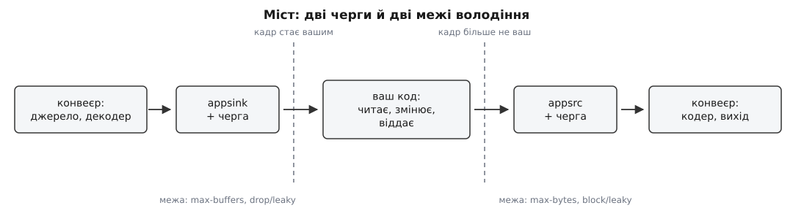
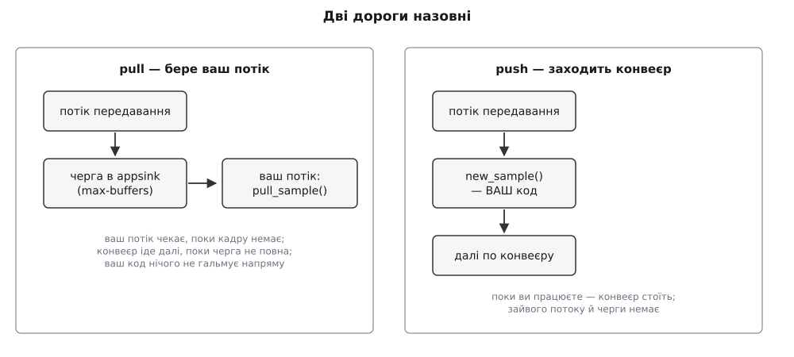
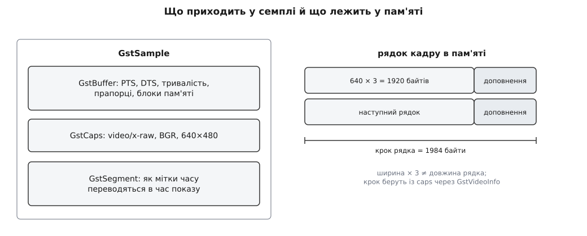
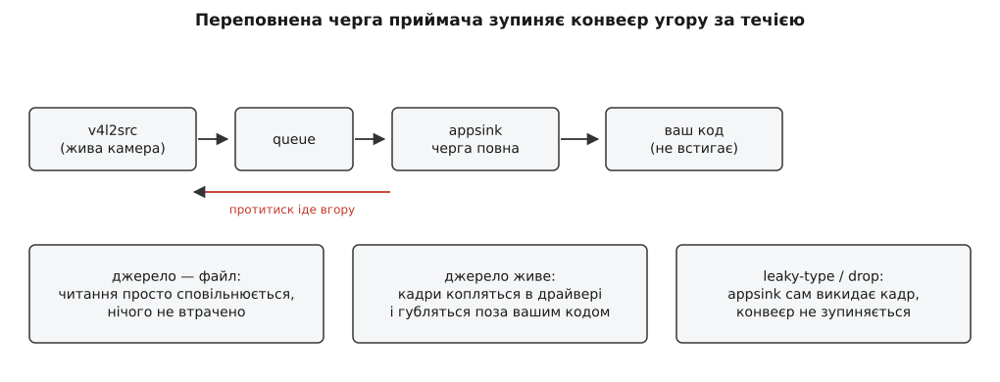

# appsink і appsrc: міст між конвеєром і власним кодом

<preknowlist>
- [Конвеєр: елементи, зв'язки й потік даних](topic:sys-media/pipeline-model) — з чого складається конвеєр і як кадр іде від джерела до приймача.
- [Пади і з'єднання елементів](topic:sys-media/pads-and-linking) — як сусідні елементи зчеплені й через що передають дані.
- [Буфери й пам'ять](topic:sys-media/buffers-and-memory) — що таке GstBuffer, звідки береться пам'ять під кадр і що таке пул буферів.
- [Узгодження caps](topic:sys-media/caps-negotiation) — як елементи домовляються про формат і чому формат не константа.
- [Стани конвеєра](topic:sys-media/states-lifecycle) — NULL, READY, PAUSED, PLAYING і що відбувається в кожному.
- [Годинник і мітки часу](topic:sys-media/clock-and-sync) — навіщо буферу PTS і як приймач вирішує, коли показувати кадр.
- [Процеси й потоки](topic:sf-os/process-vs-thread) — що таке потік виконання й чому важливо, у якому потоці працює ваша функція.
- [Виробник–споживач](topic:sf-tasks/producer-consumer) — черга між двома потоками, її переповнення й спорожнення.
</preknowlist>

Рядок `v4l2src ! h264parse ! avdec_h264 ! videoconvert ! autovideosink` показує на екрані картинку з камери — і в ньому немає жодної щілини, куди можна встромити свій код. Елементи зчеплені падами напряму: коли декодер випускає кадр, він **сам** викликає функцію сусіда й віддає їй буфер, і робить це у власному потоці виконання. Ваша `main()` у цей момент або спить у циклі подій, або чекає повідомлень на шині — до кадрів вона стосунку не має взагалі. А реальне завдання майже завжди звучить інакше: знайти в кадрі маркер, накласти телеметрію, віддати картинку нейромережі, забрати кадр із чужого SDK і закодувати його в H.264.

Два очевидні обходи погані обидва. Писати кадри у файл і читати їх іншою програмою — це диск, зайві копії й затримка в сотні мілісекунд там, де бюджет — десятки. Написати власний елемент-плагін — рішення чесне, але велике: треба зареєструвати тип, реалізувати `chain`, узгодження caps, запити на розподіл пам'яті, поведінку в кожному стані. Робити все це заради того, щоб просто подивитися на кадр, — надто дорого.

Тому в базовому наборі плагінів (бібліотека `libgstapp` із gst-plugins-base) живуть два елементи, єдине призначення яких — бути діркою в стіні конвеєра, але діркою, зробленою інженерно. `appsink` (від англ. *application* — застосунок і *sink* — стік, приймач) виглядає як звичайний приймач, тільки споживач у нього не екран і не файл, а ваш код. `appsrc` — дзеркальне: джерело, дані в яке кладе не пристрій і не файл, а знову ж таки ваш код.



*Два елементи, дві внутрішні черги й дві межі, на яких кадр стає вашим і перестає ним бути.*

## Шов — це черга, а не виклик функції

Коли ви з'єднуєте два звичайні елементи, передача кадру між ними — це прямий виклик: жодної черги, жодного копіювання, жодного очікування. Обидва боки живуть в одному потоці й підкоряються одному розкладу.

З вашим кодом так не виходить із двох незалежних причин, і саме вони породжують усе інше в цій темі.

Перша: **ваш код найчастіше живе у своєму потоці**. Головний потік крутить цикл подій інтерфейсу, робочий потік рахує нейромережу, а кадр народжується в [потоці передавання](topic:sys-media/threads-and-queues) конвеєра — тому, хто його виштовхнув. Варто пам'ятати, що власні потоки в GStreamer заводять не всі елементи, а насамперед джерела й `queue`, і саме вони вирішують, у чиєму потоці виконається кожна наступна ланка. Зшити два різні потоки можна лише чергою.

Друга, менш очевидна й важливіша: **у вас інше уявлення про час життя кадру**. Елемент усередині конвеєра відпрацьовує буфер і одразу його відпускає. Ваш код може захотіти потримати кадр — порівняти з попереднім, накопичити пачку, віддати в асинхронний інференс. А пам'ять під кадром зазвичай не ваша: вона з пулу декодера або з набору DMA-буферів драйвера камери. Отже, на шві потрібна не лише черга, а й чітка межа володіння: хто відповідає за те, щоб пам'ять повернулася.

Черга плюс межа володіння — це весь міст. Усе, що далі: затримка, раптові зависання, викинуті кадри, помилки узгодження, — прямі наслідки цих двох речей.

## appsink: приймач, за яким стоїть ваш код

Ззовні `appsink` — цілком звичайний приймач, нащадок базового класу приймачів. У нього є sink-пад, він бере участь в узгодженні формату, проходить усі стани, у стані PAUSED тримає перший кадр як преролл, підкоряється годиннику конвеєра. Відрізняється він лише тим, що робить із буфером замість того, щоб його намалювати: кладе у внутрішню чергу й пропонує вашому коду два способи його звідти забрати.

Одна успадкована властивість збиває з пантелику найчастіше. Базовий приймач за замовчуванням синхронізується з годинником: `sync` дорівнює `TRUE`, і кожен буфер лежить у приймачі до свого часу показу. Для екрана це правильно, для гілки обробки — майже завжди ні: якщо ви аналізуєте кадри, вам потрібен кадр тоді, коли він **існує**, а не тоді, коли його треба було б показати. Тому в обробній гілці `sync=false` — не оптимізація, а нормальний робочий режим.

> 🔧 **Навіщо це.** Найпоширеніша скарга новачка — «мій `appsink` віддає кадри рівно 30 разів на секунду, хоч файл мав би читатися миттєво». Це не помилка, це `sync=true`: приймач слухняно тримає темп реального часу. Один рядок `g_object_set (sink, "sync", FALSE, NULL)` перетворює аналіз відеофайлу з півгодинного очікування на кількасекундний прогін.

## Дві дороги назовні: узяти самому чи дочекатися виклику

Обидва способи існують не для різноманіття, а тому що бувають дві різні топології потоків.

**Витягування (pull).** Ваш потік сам приходить по кадр: `gst_app_sink_pull_sample()` блокується, доки в черзі не з'явиться семпл, доки не прийде кінець потоку або доки елемент не переведуть у READY чи NULL. Це класичний виробник–споживач: потік передавання конвеєра кладе, ваш потік бере. Код читається лінійно, стан живе у ваших локальних змінних, і ніщо, що ви робите, не виконується всередині конвеєра. Варіант `gst_app_sink_try_pull_sample()` (з версії 1.10) додає таймаут — щоб цикл не завис назавжди на конвеєрі, який мовчить.

**Виклик назустріч (push).** Ви ставите набір зворотних викликів через `gst_app_sink_set_callbacks()`, і функція `new_sample` викликається **в потоці передавання**, тобто в тому самому потоці, який щойно продекодував кадр. Зайвого потоку немає, зайвої затримки теж, але ціна прямо випливає з місця виконання: скільки ви працюєте у своєму зворотному виклику, стільки конвеєр стоїть. Двадцять мілісекунд на аналіз кадру — це двадцять мілісекунд, на які декодер не візьметься за наступний.

Є ще третій, історично перший спосіб: увімкнути властивість `emit-signals` і слухати сигнал `new-sample`. Він робить те саме, що зворотний виклик, але через механізм сигналів GObject, і саме тому `emit-signals` за замовчуванням **вимкнено**: випускати сигнал на кожен кадр коштує помітно дорожче за прямий виклик функції. Документація каже про це прямо — якщо встановлено зворотні виклики, сигнали не випускаються взагалі. Сигнали зручні там, де прив'язку робить не C-код, а прив'язка до мови (Python, Rust) або динамічний код; у гарячому C-шляху ставте зворотні виклики.



*У режимі витягування чекає ваш потік; у режимі зворотного виклику чекає конвеєр, поки ви працюєте.*

Ваш `new_sample` повертає `GstFlowReturn` — і це не формальність. Повернувши щось інше, ніж `GST_FLOW_OK`, ви зупиняєте потік вище за течією: так ваш код каже конвеєру «мені досить» без зовнішніх сигналів.

Повний перелік властивостей, сигналів і функцій обох елементів — з типами, значеннями за замовчуванням і версіями, у яких вони з'явилися, — зібрано [окремою довідкою](topic:sys-media/appsink-appsrc/api-appsink-appsrc.md); тут важлива логіка, а не таблиця.

## Що саме ви отримуєте: семпл, а не масив пікселів

`appsink` віддає не буфер, а `GstSample`, і причина цього суто практична. Буфер — це шматок пам'яті з мітками часу; сам по собі він **не каже, що в ньому лежить**. Ширина, висота, розкладка пікселів, частота кадрів живуть у caps, а caps у GStreamer не константа: мережевий потік може змінити роздільність посеред трансляції, декодер може переузгодити формат після зміни профілю. Тому семпл несе разом буфер, caps на момент цього буфера й сегмент — правило, за яким мітки часу переводяться в час показу.

Практичний висновок різкий: **не кешуйте розміри кадру з першого семпла назавжди**. Читайте caps із семпла (принаймні перевіряйте, чи вони не змінилися) — інакше в день, коли камера перемкне роздільність, ваш код почне читати пам'ять за межами буфера.

Далі кадр треба відобразити в адресний простір: `gst_buffer_map()` дає вказівник і розмір, `gst_buffer_unmap()` повертає його назад. І тут чекає найдорожча пастка новачка — **крок рядка**.



*Довжина рядка в пам'яті не дорівнює ширині в пікселях: вирівнювання додає невидимі байти в кінець кожного рядка.*

Пам'ять під відео майже завжди вирівняна: кожен рядок починається з адреси, кратної 4, 16 чи 64 байтам, бо так люблять і векторні інструкції процесора, і апаратні кодеки. Тому справжня довжина рядка — крок (англ. *stride*) — буває більшою за `ширина × байтів_на_піксель`, а різниця заповнена сміттям. Код, який рахує адресу пікселя як `data + y * width * 3 + x * 3`, працюватиме на кадрі 640×480 і розсиплеться на 642×482 — з косими смугами замість картинки. Правильно: побудувати `GstVideoInfo` з caps і взяти крок кожної площини з нього. Про те, які взагалі бувають розкладки пікселів і чому в них по кілька площин, є [окрема тема](topic:sf-visual/pixel-formats): плоскі й напівплоскі формати, підвибірка колірності, порядок компонент.

## Володіння: чому конвеєр «зависає» на тридцятому кадрі

Семпл, який ви отримали, — ваш: ви зобов'язані звільнити його через `gst_sample_unref()`. У режимі зворотного виклику це виглядає інакше (там семпл живе рівно стільки, скільки триває виклик), але суть одна: доки лічильник посилань не впав до нуля, семпл живий. Механіка [підрахунку посилань](topic:sf-lang/reference-counting) тут звичайна.

Незвичайне інше: **пам'ять усередині буфера зазвичай не належить ані вам, ані буферу**. Декодер, драйвер камери, апаратний блок масштабування — усі вони працюють із пулом буферів: фіксованим набором заздалегідь виділених (часто фізично неперервних або прив'язаних до пристрою) шматків пам'яті. Пул має скінченний розмір, скажімо, чотири буфери. Коли ви тримаєте семпл, пам'ять із пулу не повертається. Потримайте чотири семпли одночасно — і виробник, дійшовши до п'ятого кадру, стане на очікуванні вільного буфера й **не вийде з нього ніколи**.

Ззовні це виглядає моторошно: конвеєр працює, віддає двадцять, тридцять, сто кадрів, а потім просто зупиняється. Ні помилки на шині, ні EOS, ні падіння — тиша. Причина завжди одна й та сама: хтось тримає буфери довше, ніж дозволяє пул.

Звідси проста дисципліна. Звільняйте семпл якомога раніше — одразу після того, як зняли з нього те, що потрібно. Якщо кадр треба зберегти надовго (порівняти з наступним, віддати в асинхронний інференс, показати пізніше), **скопіюйте дані у власну пам'ять** і відпустіть семпл. Копія одного кадру 1080p — це кілька мілісекунд і кілька мегабайтів; заморожений конвеєр — це кінець роботи.

> 🔧 **Навіщо це.** Той самий механізм пояснює, чому `cv::Mat`, побудований поверх пам'яті буфера без копіювання, — заряджена рушниця. Матриця не володіє даними, вона лише дивиться на них, і чинна вона рівно доти, доки живий і відображений семпл. Віддали таку матрицю в чергу на обробку в інший потік, а семпл звільнили — і другий потік читає пам'ять, яку вже переписав декодер. Деталі того, як робити вигляд поверх чужого буфера й коли це безпечно, — у [темі про види без копії](topic:sys-media/mat-views-no-copy).

## Коли ви повільніші за потік: черга, протитиск і викидання

Внутрішня черга `appsink` має три обмежувачі: `max-buffers` (кількість), `max-bytes` і `max-time` (обидва з версії 1.24). За замовчуванням усі три — нуль, а нуль означає «без обмежень». Тобто типовий `appsink`, з якого ніхто не читає, росте, доки не з'їсть усю пам'ять. Перше, що робиться з `appsink` після створення, — ставиться межа.

Коли межа досягнута, а ви не забрали кадр, потік передавання **блокується всередині приймача**. І тут починається найцікавіше: цей блок нікуди не зникає, він іде вгору за течією. Стає елемент, який штовхав у `appsink`, потім заповнюється `queue` перед ним, потім зупиняється декодер, потім демультиплексор — і врешті-решт черга доходить до джерела. Це і є протитиск, звичайний [зворотний тиск черги](topic:sf-tasks/backpressure-local), тільки поширений на весь конвеєр.



*Що станеться при переповненні, залежить від природи джерела: файл просто читається повільніше, жива камера втрачає кадри.*

Далі все залежить від того, хто стоїть на початку.

**Джерело — файл.** Протитиск працює ідеально: `filesrc` просто читає повільніше. Жоден кадр не втрачено, темп конвеєра дорівнює темпу вашої обробки. Саме тому пакетна обробка відео з `appsink` така надійна.

**Джерело живе — камера або мережа.** Реальний світ не вміє зачекати. Драйвер камери продовжує заповнювати свої DMA-буфери, і коли `v4l2src` перестає їх забирати, драйвер починає перезаписувати найстаріші; мережеві пакети переповнюють сокет і губляться. Кадри зникають не там, де ви це контролюєте, і не так, як вам хотілося б.

Тому для живих джерел вибір втрат треба зробити свідомо, у самому `appsink`. Історично для цього була пара «`max-buffers` плюс `drop=true`»: коли черга повна, найстаріший кадр викидається, а конвеєр не зупиняється. З версії 1.28 `drop` оголошено застарілим, а на його місце прийшла загальніша властивість `leaky-type` з трьома значеннями: не протікати взагалі, викидати нові буфери (`upstream`) або викидати найстаріші (`downstream`). Для типового завдання «мені потрібен найсвіжіший кадр, старі не цікаві» комбінація — `max-buffers=1` плюс викидання старих.

Ще одна дрібниця з великими наслідками: `wait-on-eos` (за замовчуванням увімкнена з версії 1.8) змушує приймач дочекатися, поки ви заберете все, що лежить у черзі, перш ніж оголосити кінець потоку. Вимкнення її пришвидшує зупинку ціною втрати хвоста.

## appsrc: дзеркало, яке не симетричне

Тепер ваш код — виробник, і здається, що все має бути тим самим, лише навпаки. Але між приймачем і джерелом є принципова асиметрія: **приймач бере те, що дають, а джерело мусить наперед оголосити, що саме воно даватиме**. Конвеєр не може ні обрати перетворювач, ні налаштувати кодер, ні виділити пам'ять, доки не знає формат. Тому `appsrc` вимагає від вас трьох речей, яких `appsink` не питав ніколи.

**Формат.** Властивість `caps` (або `gst_app_src_set_caps()`) описує, що ви штовхатимете: `video/x-raw, format=BGR, width=1920, height=1080, framerate=30/1`. Caps мають бути фіксованими — без діапазонів і списків. Забути їх — це отримати класичну помилку `not-negotiated`, бо сусід не має з чого обирати.

**Час.** Тут — найпідступніша типова властивість. `format` у `appsrc` за замовчуванням дорівнює `bytes`, а не `time`. Це означає, що сегмент, який елемент розсилає конвеєру, вимірюється в байтах, і жоден приймач не зможе синхронізуватися, жоден мультиплексор не запише коректну тривалість. Для будь-якого медіа, у якого є час (тобто практично для всього), правильне значення — `GST_FORMAT_TIME`.

Самі мітки часу можна ставити двома способами. Або ви пишете `GST_BUFFER_PTS` і `GST_BUFFER_DURATION` самі — і це єдиний чесний варіант, коли ви знаєте справжній час зйомки (наприклад, він прийшов від камери разом із кадром). Або вмикаєте `do-timestamp=true`, і елемент штемпелює буфер часом його **надходження** в `appsrc`. Друге чудово працює для живого захоплення й дає жахливий результат, коли ви штовхаєте кадри з файлу швидше за реальний час: усі мітки збігаються в купу біля нуля.

**Живість.** Властивість `is-live` каже конвеєру, що ваше джерело поводиться як жива камера: воно не вміє «промотати вперед», його не можна попросити видати наступний кадр раніше, ніж той стався. Це змінює логіку прероллу й розрахунок затримки всього конвеєра. Разом із нею йдуть `min-latency` і `max-latency` — ваше зобов'язання перед конвеєром: «між подією в реальному світі й буфером, що виходить із мене, минає стільки-то». Приймачі використовують це число, щоб вирівняти показ звуку й відео. Механіка того, як конвеєр збирає ці числа з усіх елементів і що з них виходить, — у [темі про затримку й буферизацію](topic:sys-media/latency-and-buffering).

## Віддати кадр і не втратити його

Ось як виглядає штовхання кадру, у якому вже враховано володіння:

```c
/* дані готує ваш код; звільнить їх release_frame, коли конвеєр
   відпустить останнє посилання на буфер — жодного копіювання */
GstBuffer *buf = gst_buffer_new_wrapped_full (
    GST_MEMORY_FLAG_READONLY, frame_data, frame_size, 0, frame_size,
    frame_owner, (GDestroyNotify) release_frame);

GST_BUFFER_PTS (buf)      = frame_index * GST_SECOND / 30;
GST_BUFFER_DURATION (buf) = GST_SECOND / 30;

GstFlowReturn ret = gst_app_src_push_buffer (GST_APP_SRC (src), buf);
/* buf уже НЕ ваш — навіть якщо ret не GST_FLOW_OK */
if (ret != GST_FLOW_OK)
  break;                 /* GST_FLOW_FLUSHING: конвеєр згортається */
```

Два рядки в цьому фрагменті варті окремої уваги.

**Хто володіє буфером після штовхання.** Функція `gst_app_src_push_buffer()` **забирає володіння** — після виклику буфер не ваш, звільняти його не треба й не можна. А ось однойменний сигнал-дія `push-buffer`, який використовують із прив'язок до інших мов, володіння **не забирає**: він бере власне посилання, і ваше посилання лишається на вас. Однакова назва, протилежна семантика; переплутати їх — це або подвійне звільнення, або витік пам'яті, і обидва проявляються не одразу.

**Код повернення.** `GST_FLOW_OK` означає, що буфер став у чергу. `GST_FLOW_FLUSHING` означає, що елемент не в PAUSED і не в PLAYING — конвеєр згортається, штовхати більше нікуди. `GST_FLOW_EOS` — потік уже завершено. Цикл, який ігнорує це значення, після зупинки конвеєра починає крутитися вхолосту, спалюючи процесор і пам'ять на буферах, які ніхто не візьме.

І окремо — **кінець**. Коли ваші дані скінчилися, треба явно викликати `gst_app_src_end_of_stream()`. Це не косметика: мультиплексор `mp4mux` дописує таблицю індексів (атом `moov`) саме в момент EOS. Обірвіть програму без EOS — і на диску лишиться файл із коректними даними, який жоден програвач не відкриє. Те, як подія EOS іде конвеєром і як ви дізнаєтеся, що вона дійшла до кінця, описано в [темі про шину повідомлень](topic:sys-media/bus-and-messages).

## Керування потоком з боку джерела

У `appsrc` теж є внутрішня черга, і теж із трьома обмежувачами: `max-bytes`, `max-buffers` і `max-time`. Але поводиться вона інакше, ніж у приймача, бо тут переповнення означає не «конвеєр стоїть», а «застосунок штовхає забагато».

Основний механізм — дорадчий. Коли черга спорожніла, елемент випускає `need-data`; коли наповнилася — `enough-data`. Це прохання, а не примус: ніщо не заважає вам штовхати далі й наростити чергу до вичерпання пам'яті. Друга можливість — `block=true`: тоді `push-buffer` сам блокується, доки не звільниться місце, і ваш потік автоматично вирівнюється за темпом конвеєра. Третя, для живих даних, — уже знайомий `leaky-type`: викидати старе або нове, аби не блокуватися.

Значення `max-bytes` за замовчуванням варте окремого прикладу, бо воно з іншої епохи.

**Умова: сирий кадр 1920×1080 у форматі BGR, 30 кадрів на секунду, `appsrc` із типовими налаштуваннями.**

```
розмір кадру   = 1920 × 1080 × 3 = 6 220 800 байтів ≈ 6.2 МБ
max-bytes      =                     200 000 байтів
кадрів у черзі = 200000 / 6220800 = 0.032
```

Тобто вже перший штовхнутий кадр перевищує ліміт у тридцять разів, і `enough-data` спрацьовує одразу після нього. Значення 200 кБ розумне для стисненого аудіо, для сирого відео воно безглузде: або піднімайте `max-bytes` до кількох кадрів, або ставте межу через `max-buffers`, який тут і природніший.

## Скільки затримки додає міст

Черга — це завжди час. І `appsink`, і `appsrc` додають рівно стільки затримки, скільки кадрів у них лежить, помножено на період кадру. Це найпростіша й найчастіше забута складова бюджету.

**Умова: потік 30 кадрів на секунду, `appsink` із `max-buffers=5`, обробка одного кадру — 12 мс.**

```
період кадру       = 1 / 30       = 33.3 мс
черга приймача     = 5 × 33.3     = 166.7 мс
власне обробка     =                12.0 мс
разом на мосту     = 166.7 + 12.0 = 178.7 мс
```

Майже вся затримка — не в обчисленнях, а в очікуванні в черзі. Та сама конфігурація з `max-buffers=1` і викиданням старих кадрів дає 33.3 + 12.0 = 45.3 мс, тобто вчетверо менше, ціною втрачених кадрів у моменти, коли обробка не встигає. Це усвідомлений компроміс: для запису важлива повнота, для телекерування — свіжість.

До цього додається затримка з боку `appsrc` (його черга рахується так само) і, якщо ви оголосили `is-live`, ваша власна `min-latency`, яку конвеєр чесно врахує у спільному розрахунку. А якщо ви забули вимкнути `sync` на `appsink`, приймач ще й притримає кожен кадр до його часу показу — і бюджет зросте на повний час буферизації конвеєра.

## Пастки з потоками

Міст зшиває два світи потоків, тому більшість важких помилок тут — не помилки логіки, а помилки того, **де саме** виконується код.

**Зміна стану зсередини зворотного виклику.** Викликати `gst_element_set_state (pipeline, GST_STATE_NULL)` з `new_sample` — гарантований [глухий кут](topic:sf-tasks/deadlock): зміна стану конвеєра чекає, поки зупиняться потоки передавання, а ви **і є** потік передавання, і ви чекаєте самі на себе. Правильно — виставити прапорець і зупинити конвеєр із головного потоку або з обробника шини.

**Довга робота у зворотному виклику.** Усе, що ви робите в `new_sample`, відбувається за рахунок конвеєра. Якщо обробка нерівномірна — інференс на 80 мс раз на секунду серед кадрів по 5 мс, — це не просто затримка, це стрибки, які поїдуть далі за течією як тремтіння показу. Такий код виносять у власний потік, а між ним і зворотним викликом ставлять свою чергу з викиданням.

**Два конвеєри, зшиті через міст.** Схема «перший конвеєр → `appsink` → ваша обробка → `appsrc` → другий конвеєр» природна й дуже поширена, але має гострий кут: якщо ви штовхаєте в `appsrc` прямо із зворотного виклику `appsink`, то `block=true` на джерелі зупинить **потік передавання першого конвеєра**. Затик у кодері миттєво стане затиком у камері. Для такої зв'язки або `block=false` плюс викидання, або окремий потік із власною чергою посередині. Загальні вимоги до коду, який працює одразу в кількох потоках, — у [темі про потокову безпеку](topic:sf-tasks/thread-safety).

**Виклики з чужого потоку.** Штовхати в `appsrc` можна з будь-якого потоку — елемент захищений усередині. Але створювати й руйнувати сам конвеєр із випадкових потоків, поки інші штовхають, — надійний спосіб отримати падіння на завершенні роботи. Порядок зупинки простий: спершу перестати штовхати, потім EOS, потім дочекатися EOS на шині, потім NULL.

Живий приклад, у якому всі ці частини зібрано разом — цикл «взяти кадр з `appsink`, обробити його в OpenCV, віддати в `appsrc` на кодування», з повним кодом, збіркою й розбором того, де саме там копіюється пам'ять, — винесено в [окремий розбір](topic:sys-media/appsink-appsrc/proj-frame-loop.md).

## Мінімальний робочий цикл

Щоб побачити всі частини разом, ось найкоротший чесний цикл читання — з обмеженою чергою, таймаутом і правильним звільненням:

:::tabs
```c
GstElement *sink = gst_bin_get_by_name (GST_BIN (pipeline), "out");
g_object_set (sink, "sync", FALSE, "max-buffers", (guint) 2, NULL);

for (;;) {
  GstSample *sample =
      gst_app_sink_try_pull_sample (GST_APP_SINK (sink), GST_SECOND);
  if (!sample) {                       /* таймаут або кінець потоку */
    if (gst_app_sink_is_eos (GST_APP_SINK (sink)))
      break;
    continue;
  }

  GstBuffer *buf = gst_sample_get_buffer (sample);  /* належить семплу */
  GstMapInfo info;
  if (gst_buffer_map (buf, &info, GST_MAP_READ)) {
    process (info.data, info.size);
    gst_buffer_unmap (buf, &info);
  }
  gst_sample_unref (sample);           /* пам'ять повертається в пул */
}
```
```py
sink = pipeline.get_by_name("out")
sink.set_property("sync", False)
sink.set_property("max-buffers", 2)

while True:
    sample = sink.emit("try-pull-sample", Gst.SECOND)
    if sample is None:                 # таймаут або кінець потоку
        if sink.get_property("eos"):
            break
        continue

    buf = sample.get_buffer()
    ok, info = buf.map(Gst.MapFlags.READ)
    if ok:
        process(info.data)             # memoryview на пам'ять буфера
        buf.unmap(info)
    del sample                         # не тримати посилання довше, ніж треба
```
:::

Обидва варіанти роблять те саме, і в обох найважливіший рядок — останній: без нього все інше не має значення, бо через кілька десятків кадрів конвеєр просто стане.

## Коли міст не потрібен

Міст коштує черги, межі володіння й цілого класу помилок із потоками — тому варто чесно перевірити, чи він узагалі потрібен.

Якщо ваш код нічого не робить із пікселями, а лише перекладає кадри з одного конвеєра в інший, то всередині GStreamer для цього є пара `intervideosink`/`intervideosrc`, і вона зробить це без виходу в застосунок і без зайвої копії. Якщо ваша обробка — це чесне перетворення «кадр на вході, кадр на виході», без стану поза кадром і без потреби виходити в інший потік, то власний елемент на базі `GstBaseTransform` дасть безкоштовно те, за що з `appsink` доводиться платити руками: узгодження формату, роботу з пулом буферів, реакцію на QoS, обробку на місці без копіювання.

`appsink` і `appsrc` виправдані там, де ваш код **справді мусить жити зовні**: у нього свій потік, свій темп, своя бібліотека з власною моделлю пам'яті, свій графічний інтерфейс. Тоді шов неминучий — і єдине, що лишається, це знати, з чого він зроблений: із черги, яка перетворюється на затримку, і з межі володіння, яка перетворюється на зависання, якщо її перейти неакуратно.
