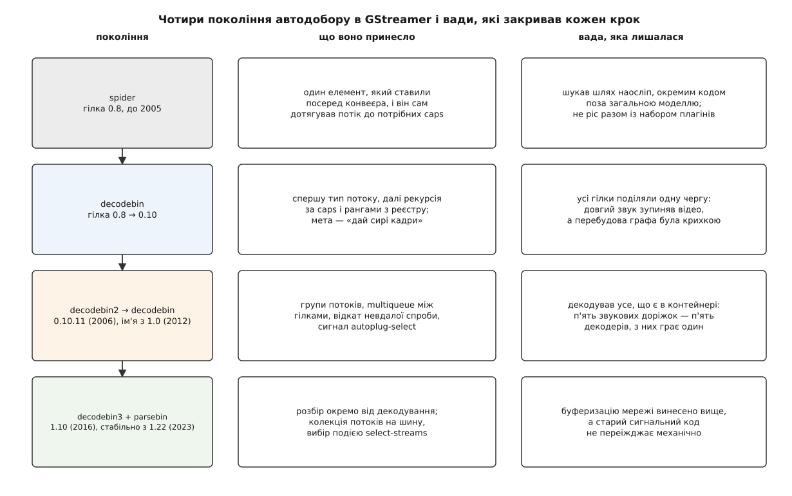

# 📜 Як GStreamer учився добирати елементи сам

Чотири рази за двадцять років GStreamer переписував елемент, який будує конвеєр замість програміста, — і щоразу не тому, що старий погано працював, а тому, що змінювалося саме питання, на яке він відповідав. Ця вставка про те, яку конкретну ваду закривав кожен крок: від `spider` доби гілки 0.8 до нинішньої пари `parsebin` + `decodebin3`. Історія тут потрібна не для дат: кожна вада досі впізнається в чужому коді, а кожне рішення пояснює, чому нинішній інтерфейс саме такий, а не зручніший.

*Кожен рядок закриває ваду попереднього — і залишає свою, з якої виростає наступний.*

## Павук, який дотягував потік до потрібних caps

Найперший автодобірник називався `spider` (англ. *spider* — павук) і жив просто в ядрі, у теці `gst/autoplug/`. Ідея була фізично наочна: павук — це елемент, який **ставлять посеред конвеєра**, а він розкидає всередині себе ланцюжок з'єднань від того, що прийшло на вхід, до того, чого вимагає вихід.

Посібник GStreamer тієї доби описує його так прямо: spider — «узагальнений елемент автодобору», його «можна вставити будь-де в конвеєрі, щоб виконати перетворення caps, якщо воно можливе»; він «визначить тип потоку, автоматично доведе його до caps приймача й програє конвеєр». Той самий текст, датований квітнем 2002 року, чесно додає характеристику: це «найкраще, що ми маємо» — формулювання, яке говорить більше за будь-яку критику.

Головна перевага павука була справжня. До нього існував статичний API автодобору, який будував ланцюг наперед і, як зафіксовано в тому ж посібнику, **не вмів працювати з динамічними конвеєрами** — а медіа динамічні за природою: скільки доріжок у файлі, стає відомо лише після читання заголовка. Павук умів достроювати граф на ходу й розводити один вхідний потік у кілька вихідних через пади на запит.

Вада була в тому, **де** цей розум жив. Павук був окремою підсистемою зі своїм пошуком шляху, а не застосуванням загальних правил [моделі плагінів](root:sys-media/plugin-model) і [узгодження caps](root:sys-media/caps-negotiation). Тому кожен новий плагін, кожен новий контейнер, кожна нова дивина формату вимагали, щоб павук про них якось дізнався, — і код розростався, не стаючи від цього розумнішим.

У січні 2004 року Крістіан Шаллер (Christian F. K. Schaller) у своєму блозі зафіксував стан справ одним реченням: «нинішній автодобірник, названий spider, має відомі проблеми вже певний час, але брак часу й інші пріоритети в кодовій базі відкладали це питання дотепер». Там же він назвав людей, які взялися писати заміну: Девід Шліф (David Schleef) і Бенджамін Отте (Benjamin Otte). Це свідчення учасника спільноти, а не протокол — але воно точно датує момент, коли всі погодилися, що павука треба міняти.

## decodebin: мета замість шляху

Заміна вийшла іншою за самою постановкою. У файлі `gst/playback/gstdecodebin.c` стоїть рядок копірайту 2004 року на ім'я Віма Тайманса (Wim Taymans) — він тоді працював у Fluendo й написав більшу частину гілки 0.10. Елемент увійшов у гілку 0.8 разом із `playbin` і залишився в GStreamer назавжди.

Різниця з павуком не в якості реалізації, а в **формулюванні задачі**. Павука просили: «доведи це до отаких caps» — тобто задавали і початок, і кінець шляху. У `decodebin` кінець став не набором caps, а класом мети: **сирі кадри, які вже нічим не декодуються**. Звідси випливає весь алгоритм: визнач тип, знайди в реєстрі кандидатів, чиї шаблонні caps перетинаються з наявними, постав найкращого за рангом, подивись, що вийшло на його виході, і повтори — доки caps не стануть сирими.

Вигода тут не в економії коду, хоч і в ній теж. Вигода в тому, що **знання про формати вийшло з автодобірника назовні** — у шаблонні caps і ранги окремих фабрик. Плагін, встановлений через п'ять років після написання застосунку, підбирається автоматично, бо автодобірник про кодеки нічого не знає й не мусить знати. Павук цього дати не міг за будовою.

Через гілку 0.9 — велике переписування ядра — павук не перейшов: у 0.10 його вже немає, лишився самий `decodebin`.

## decodebin2: коли гілки заважають одна одній

Наступна вада була не про добір, а про те, що діється **після** нього. Демультиплексор віддає кілька потоків, кожен іде своєю гілкою до свого приймача, і гілки рухаються нерівномірно: у контейнері дані доріжок лежать шматками впереміш, і звук може випередити відео на секунди. Якщо між гілками стоїть одна спільна черга, попереду опиняється не той, кому треба, і конвеєр заклинює — це стандартна проблема [потоків виконання й черг](root:sys-media/threads-and-queues), тільки тут її треба було розв'язати автоматично, не питаючи застосунок.

Друга частина вади — крихкість самої побудови. Автодобір — це не обчислення, а **спроба**: апаратний декодер може бути в реєстрі, відкритися й упасти на профілі, якого не тягне. Перший `decodebin` не мав акуратного механізму відкотити вже вставлений елемент і піти іншим шляхом.

Відповіддю став `decodebin2`. У заголовку `gstdecodebin2.c` стоїть копірайт 2006 року на ім'я Едварда Ервея (Edward Hervey) з адресою в домені Fluendo; пізніше в тому ж файлі з'явився копірайт 2009 року на ім'я Себастьяна Дреґе (Sebastian Dröge, Collabora). Нотатки до випуску `gst-plugins-base` 0.10.11 містять рядок «Introduction of the decodebin2 element».

Він приніс три речі, які й досі становлять кістяк: **групи потоків**, що виникають з одного демультиплексора; `multiqueue` — черга з окремим руслом на кожен потік і спільною політикою наповнення, яка не дає одній гілці заморити інші; і впорядкований **відкат невдалої спроби** з переходом до наступного кандидата, разом із сигналом, що дозволяє застосунку втрутитися у вибір.

Кілька років `decodebin` і `decodebin2` жили поряд: старий лишався типовим, новий підключали свідомо, і на ньому виріс `playbin2`. Коли готували GStreamer 1.0 (2012), сумісність з 0.10 усе одно ламалася — і цифру просто прибрали з імені. `decodebin2` став `decodebin`, `playbin2` став `playbin`, старі реалізації зникли. Саме звідси береться дрібна, але помітна плутанина: код і документація з дуже різних епох називають одним словом два різні елементи, а рядок конвеєра з іменем `decodebin2` під GStreamer 1.x просто не запуститься.

## Дублін, 8 жовтня 2015: чого модель не вміла назвати

Наступний крок почався не з коду, а з доповіді. На GStreamer Conference 2015 (Convention Centre Dublin, 8–9 жовтня) Едвард Ервей — той самий автор `decodebin2`, тепер уже в Centricular — виступив із доповіддю «Decodebin3, or dealing with modern playback use-cases» і, за описом LWN від 21 жовтня 2015, виніс проєкт великого переписування на обговорення спільноти **перед** тим, як його писати.

Претензія була конкретна. `decodebin2` зразка 2006 року **декодує все, що знайшов у контейнері**. Коли писався той код, це було майже безкоштовно: у файлі одна відеодоріжка й одна звукова. За десять років звичайним вмістом стали фільм із п'ятьма звуковими доріжками різними мовами й трьома доріжками субтитрів — і елемент чесно будував п'ять звукових декодерів, з яких грав один. Решта чотири крутилися, займали пам'ять і процесор і на слабкій машині просто не вміщалися в бюджет.

Полагодити це косметично не виходило, і саме це — головна думка доповіді. Вибір доріжки не був **частиною моделі**. Модель `decodebin` — це «пади з'являються, ти на них підписуєшся»: перелік того, що є, існує лише як побічний ефект того, що вже побудувалося. Спитати «що тут узагалі є?» до побудови не було чим, а сказати «мені треба лише оце» — не було як. Звідси тягнулися всі суміжні незручності одразу: перемикання доріжки посеред відтворення, потоки, що з'являються на ходу в ефірному телебаченні, [адаптивний бітрейт](root:com-transport/adaptive-bitrate), де представлення міняється на льоту, безшовний перехід між файлами.

Розв'язок Ервей запропонував такий: спершу з'явиться **опис потоків як окрема річ** — об'єкти `GstStream` (ідентифікатор, caps, теги, тип) і незмінна `GstStreamCollection`, яка їх збирає; застосунок читає цей перелік і відповідає вибором. Аудиторія, за свідченням LWN, підтримала напрям.

## Потік як річ, а не як пад

Реалізацію випустили в GStreamer 1.10 — 1 листопада 2016 року. Нотатки до випуску називають `decodebin3` і `playbin3` **експериментальними технологічними попередниками** й формулюють статус чесно: «все має вже працювати добре, але ми не можемо гарантувати, що в наступному циклі не буде дрібних змін поведінки». Там-таки описано нові типи: `GstStream` містить «ідентифікатор потоку, caps, теги, прапорці й тип», а `GstStreamCollection` «представляє групу потоків і слугує для оголошення чи публікації всіх доступних потоків» і є незмінною — «створена один раз, вона більше не змінюється».

Незмінність тут не дрібниця. Колекція їде через [шину повідомлень](root:sys-media/bus-and-messages), тобто читає її інший потік виконання, ніж той, що її створив; якби перелік можна було правити на ходу, застосунок робив би вибір із того, чого вже немає.

Разом із цим роботу розділили надвоє. `parsebin` робить усе те, що робив `decodebin`, але **зупиняється перед декодерами**: доводить потоки до розібраного елементарного вигляду й публікує колекцію. `decodebin3` бере колекцію, чекає відповіді — події `select-streams` — і створює декодери лише для обраного. Документація описує наслідок, який власне й був метою: елемент «динамічно перемикає внутрішні з'єднання й повторно вживає елементи-декодери, коли вибір потоків міняється, тож у звичайному випадку тримає по одному декодеру кожного типу».

Одна річ туди свідомо не поїхала: `decodebin3` «не займається буферизацією мережевого потоку — він очікує, що буферизацію зроблено вище за течією». Це не забудькуватість, а межа відповідальності: [буферизація](root:sys-media/latency-and-buffering) залежить від джерела, а не від того, що всередині, — і її винесли в `urisourcebin`.

Статус експериментальних із цих елементів зняли аж у GStreamer 1.22, який вийшов 23 січня 2023 року: нотатки кажуть, що нові елементи відтворення «перероблено, щоб дозволити більше сценаріїв і поліпшити швидкодію», і що вони «більше не вважаються експериментальними». Шість років між появою й стабілізацією — теж частина історії: змінювався не алгоритм добору, а те, як застосунки з ним розмовляють, а такі речі не стабілізуються за один цикл.

## Що з цього видно

Лінія в усіх чотирьох кроках одна: **дедалі більше знання виноситься з автодобірника назовні**. Павук тримав знання про формати в собі — і не масштабувався. `decodebin` виніс його в шаблонні caps і ранги фабрик — і став рости разом із набором плагінів. `decodebin2` виніс назовні керування спробою — сигналом вибору. `decodebin3` виніс останнє, що лишалося всередині: **перелік того, що є, і рішення, що з цього треба**.

Тому нинішній інтерфейс і виглядає складнішим за старий. «Підпишись на `pad-added`» — це один рядок, а «прочитай колекцію з шини й надішли подію вибору» — щонайменше три. Але перший рядок мовчки приймає рішення за вас, а три рядки роблять його вашим — і ця різниця, а не зручність, була причиною кожного переписування.
