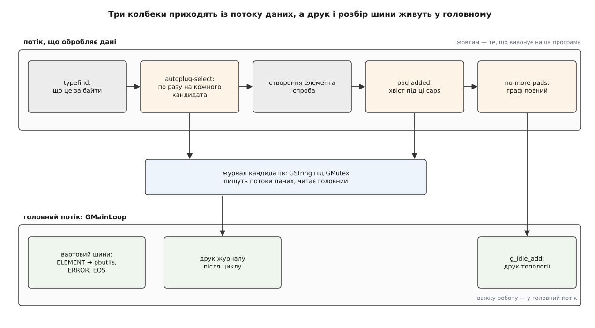

# ⚙️ Керований автодобір: журнал кандидатів і вето на декодер

Ця програма стає між `decodebin` і реєстром: перед кожною спробою вона встигає сказати «пробуй» або «пропусти», записує в журнал ім'я, ранг і клас кожного кандидата, доживає до першого кадру й друкує граф, який зрештою побудувався. Головна мова — C, бо сигнали GStreamer із їхніми підписами й типами повернення є саме C-інтерфейсом; другою вкладкою — рівноцінний Python через PyGObject: той самий інтерфейс, але крізь інтроспекцію, і на ньому добре видно, що з C-API переїжджає не все.

## Задача

Той самий файл на трьох машинах декодують три різні елементи, і жодне з їхніх імен ніде не написано. Доки все працює, це не турбує. Турбувати починає в трьох ситуаціях, і саме вони задають вимоги до програми.

**Перша.** Користувач надсилає скаргу «відео сиплеться», і ви не знаєте навіть, який декодер у нього став. Потрібен **журнал**: хто був кандидатом на кожному кроці, з яким рангом, до якого класу належить і що ми з ним зробили.

**Друга.** Ви підозрюєте конкретний апаратний декодер — на цій платі він 10-бітний профіль не тягне. Змінити його ранг у реєстрі можна, але ранг — річ **системна**: він діє на всі процеси, які цією збіркою користуються ([модель плагінів і реєстр елементів](topic:sys-media/plugin-model) — фабрики з рангами лежать у спільному реєстрі, і `gst_plugin_feature_set_rank` править саме його). Потрібне вето рівнем нижче: **лише для цього конвеєра**, прапорцем командного рядка, без сліду в системі.

**Третя.** У файлі кодек, якого в системі немає. За замовчуванням користувач отримує `internal data stream error` — рядок, з якого не випливає нічого. Потрібен людський опис на кшталт «H.265 decoder», а до нього рядок для встановлювача пакунків.

Звідси вжиток:

```sh
./autoplug кіно.mkv --skip=vah264dec        # заборонити один елемент за іменем
./autoplug кіно.mkv --no-hw                 # заборонити всі апаратні декодери
./autoplug https://приклад.org/кіно.webm    # те саме, але через uridecodebin
```

## Ідея: три точки й один замок

Ключова річ, яку варто зрозуміти перед кодом: **програма нічого не обирає**. Список кандидатів на кожному кроці складає й упорядковує сам `decodebin` — за шаблонними caps із реєстру й рангами. Наш колбек викликають **по разу на кожного кандидата зі списку**, і єдине, що ми повертаємо, — вирок про цього одного: `TRY`, `SKIP` або `EXPOSE`. Це фільтр над чужим упорядкуванням, а не власний вибір; тому програма лишається коректною й тоді, коли на новій машині список зовсім інший.

Точок втручання рівно три, і кожна відповідає на своє питання.

`autoplug-select` — **«цього пробувати?»**. Дає пад, caps на ньому й фабрику-кандидата. Тут журнал і вето.

`pad-added` — **«гілку доведено до сирих даних, що з нею робити?»**. Дає готовий пад; за його caps ми вирішуємо, який хвіст добудувати ([пади і з'єднання елементів](topic:sys-media/pads-and-linking) — саме той сигнал, яким елемент оголошує пад, що з'явився під час роботи).

`no-more-pads` — **«більше нічого не буде»**. Момент, коли граф можна вважати повним і є що друкувати.

Тепер неприємне. Усі три колбеки прилітають **не з головного потоку програми**, а з того потоку, який зараз тягне дані крізь конвеєр ([потоки виконання й черги](topic:sys-media/threads-and-queues) — конвеєр міняє потік на кожному елементі з власною чергою, і колбек виконується в тому потоці, де стався виклик). Наслідків два, і обидва вкладено в код. Спільний журнал пишуть із кількох потоків одразу — отже, під замком. А все, що не є миттєвою відповіддю на питання, з колбека **передають у головний потік**: друк топології ставимо в чергу головного циклу й повертаємось, бо доки ми в колбеці, дані в цій гілці не рухаються.



*Верхня смуга — те, що виконується в потоці даних і має відповідати швидко; нижня — головний цикл, куди віддають усе довге.*

## Кістяк: конвеєр, що ще не знає своєї форми

Складати наперед тут майже нічого: нижня половина конвеєра з'явиться потім. Тому в `main` лишається розбір аргументів, вибір джерела й підписки.

Вибір між `filesrc ! decodebin` і `uridecodebin` — не питання смаку: якщо аргумент є коректним URI, локального файлу може й не бути, і джерело треба добирати теж. `gst_uri_is_valid` розрізняє ці два випадки, а сигнали автодобору `uridecodebin` віддає ті самі — він проксіює їх від свого внутрішнього `decodebin`.

На початку файлу є оголошення, якого в звичайній програмі не буває: тип, що його повертає наш колбек, доводиться описати власноруч. Причина не в недбалості, і за хвилину до неї дійдемо — разом із самим колбеком.

:::tabs
```c
/* autoplug.c — керований автодобір: журнал кандидатів і вето на декодер.
 *   зібрати:   gcc autoplug.c -o autoplug \
 *                  $(pkg-config --cflags --libs gstreamer-1.0 gstreamer-pbutils-1.0)
 *   запустити: ./autoplug кіно.mkv --skip=vah264dec
 *              ./autoplug https://приклад.org/кіно.webm --no-hw
 */
#include <gst/gst.h>
#include <gst/pbutils/pbutils.h>
#include <string.h>

/* Перелічення з gst/playback/gstplay-enum.h. Заголовків плагінів не
   встановлюють, тому значення переписано сюди — вони частина інтерфейсу. */
typedef enum {
  GST_AUTOPLUG_SELECT_TRY,      /* 0 — пробуй цю фабрику */
  GST_AUTOPLUG_SELECT_EXPOSE,   /* 1 — нічого не став, виставляй пад як є */
  GST_AUTOPLUG_SELECT_SKIP      /* 2 — пропусти й бери наступну */
} GstAutoplugSelectResult;

typedef struct {
  GstElement *pipeline;
  GstElement *decoder;      /* decodebin або uridecodebin */
  GMainLoop  *loop;

  gchar     **veto;         /* префікси імен, які пропускаємо */
  gboolean    no_hw;        /* пропускати все з класу Hardware */

  GMutex      lock;         /* журнал пишуть потоки даних */
  GString    *journal;
  gint        n_try, n_skip, n_branches;   /* лічильники — атомарні */

  gchar      *missing;      /* людський опис того, чого бракує */
  int         exit_code;
} App;

static GstAutoplugSelectResult on_autoplug_select (GstElement *bin, GstPad *pad,
    GstCaps *caps, GstElementFactory *factory, gpointer data);
static void     on_pad_added     (GstElement *dec, GstPad *pad, gpointer data);
static void     on_no_more_pads  (GstElement *dec, gpointer data);
static void     on_unknown_type  (GstElement *dec, GstPad *pad, GstCaps *caps, gpointer data);
static gboolean on_bus           (GstBus *bus, GstMessage *msg, gpointer data);

int
main (int argc, char *argv[])
{
  App app = { 0 };
  GPtrArray *veto = g_ptr_array_new ();
  const gchar *target = NULL;
  GstBus *bus;

  gst_init (&argc, &argv);

  for (int i = 1; i < argc; i++) {
    if (g_str_has_prefix (argv[i], "--skip="))
      g_ptr_array_add (veto, argv[i] + strlen ("--skip="));   /* рядки з argv, не наші */
    else if (g_strcmp0 (argv[i], "--no-hw") == 0)
      app.no_hw = TRUE;
    else
      target = argv[i];
  }
  g_ptr_array_add (veto, NULL);
  app.veto = (gchar **) veto->pdata;

  if (!target) {
    g_printerr ("вжиток: %s <файл|URI> [--skip=ім'я]… [--no-hw]\n", argv[0]);
    return 1;
  }

  g_mutex_init (&app.lock);
  app.journal  = g_string_new (NULL);
  app.loop     = g_main_loop_new (NULL, FALSE);
  app.pipeline = gst_pipeline_new ("autoplug");

  if (gst_uri_is_valid (target)) {
    app.decoder = gst_element_factory_make ("uridecodebin", "dec");
    g_object_set (app.decoder, "uri", target, NULL);
    gst_bin_add (GST_BIN (app.pipeline), app.decoder);
  } else {
    GstElement *src = gst_element_factory_make ("filesrc", NULL);
    app.decoder = gst_element_factory_make ("decodebin", "dec");
    g_object_set (src, "location", target, NULL);
    gst_bin_add_many (GST_BIN (app.pipeline), src, app.decoder, NULL);
    if (!gst_element_link (src, app.decoder))
      g_error ("filesrc → decodebin не з'єдналися");
  }

  /* Три точки втручання плюс окремий сигнал на випадок «нема чим декодувати».
     G_CONNECT_AFTER до autoplug-select чіпляти НЕ МОЖНА: такий обробник
     не викличуть ніколи. */
  g_signal_connect (app.decoder, "autoplug-select", G_CALLBACK (on_autoplug_select), &app);
  g_signal_connect (app.decoder, "pad-added",       G_CALLBACK (on_pad_added), &app);
  g_signal_connect (app.decoder, "no-more-pads",    G_CALLBACK (on_no_more_pads), &app);
  g_signal_connect (app.decoder, "unknown-type",    G_CALLBACK (on_unknown_type), &app);

  bus = gst_element_get_bus (app.pipeline);
  gst_bus_add_watch (bus, on_bus, &app);      /* вартовий працює в головному потоці */
  gst_object_unref (bus);

  gst_element_set_state (app.pipeline, GST_STATE_PLAYING);
  g_main_loop_run (app.loop);
  gst_element_set_state (app.pipeline, GST_STATE_NULL);

  g_print ("\n── журнал автодобору ────────────────────────\n%s", app.journal->str);
  g_print ("спроб дозволено: %d, пропущено: %d, гілок під'єднано: %d\n",
           g_atomic_int_get (&app.n_try), g_atomic_int_get (&app.n_skip),
           g_atomic_int_get (&app.n_branches));

  gst_object_unref (app.pipeline);
  g_main_loop_unref (app.loop);
  g_string_free (app.journal, TRUE);
  g_mutex_clear (&app.lock);
  g_free (app.missing);
  g_ptr_array_free (veto, TRUE);
  return app.exit_code;
}
```
```python
#!/usr/bin/env python3
"""autoplug.py — керований автодобір: журнал кандидатів і вето на декодер.
   ./autoplug.py кіно.mkv --skip=vah264dec
   ./autoplug.py https://приклад.org/кіно.webm --no-hw
"""
import sys, threading
import gi
gi.require_version("Gst", "1.0")
gi.require_version("GstPbutils", "1.0")
from gi.repository import Gst, GstPbutils, GLib

# GstAutoplugSelectResult оголошено в gstplay-enum.h — усередині плагіна
# playback. Плагінних заголовків не встановлюють і в GIR їх немає, тож
# Gst.AutoplugSelectResult не існує: три значення переписуємо до себе.
TRY, EXPOSE, SKIP = 0, 1, 2

VIDEO_TAIL = ("queue", "videoconvert", "autovideosink")
AUDIO_TAIL = ("queue", "audioconvert", "audioresample", "autoaudiosink")


class Autoplug:
    def __init__(self, target, veto, no_hw):
        self.veto, self.no_hw = veto, no_hw
        self.lock = threading.Lock()          # журнал пишуть потоки даних
        self.journal = []
        self.n_try = self.n_skip = self.n_branches = 0
        self.missing = None
        self.exit_code = 0
        self.loop = GLib.MainLoop()

        self.pipeline = Gst.Pipeline.new("autoplug")
        if Gst.uri_is_valid(target):
            self.dec = Gst.ElementFactory.make("uridecodebin", "dec")
            self.dec.props.uri = target
            self.pipeline.add(self.dec)
        else:
            src = Gst.ElementFactory.make("filesrc", None)
            src.props.location = target
            self.dec = Gst.ElementFactory.make("decodebin", "dec")
            self.pipeline.add(src)
            self.pipeline.add(self.dec)
            if not src.link(self.dec):
                raise RuntimeError("filesrc → decodebin не з'єдналися")

        # G_CONNECT_AFTER (тобто connect_after) до autoplug-select чіпляти
        # не можна: такий обробник не викличуть ніколи.
        self.dec.connect("autoplug-select", self.on_select)
        self.dec.connect("pad-added", self.on_pad_added)
        self.dec.connect("no-more-pads", self.on_no_more_pads)
        self.dec.connect("unknown-type", self.on_unknown_type)

        bus = self.pipeline.get_bus()
        bus.add_signal_watch()                # повідомлення підуть у головний цикл
        bus.connect("message", self.on_message)

    def note(self, line, tried=0, skipped=0, branches=0):
        with self.lock:
            self.journal.append(line)
            self.n_try += tried
            self.n_skip += skipped
            self.n_branches += branches

    def run(self):
        self.pipeline.set_state(Gst.State.PLAYING)
        try:
            self.loop.run()
        except KeyboardInterrupt:
            pass
        self.pipeline.set_state(Gst.State.NULL)
        print("\n── журнал автодобору ────────────────────────")
        print("\n".join(self.journal))
        print("спроб дозволено: %d, пропущено: %d, гілок під'єднано: %d"
              % (self.n_try, self.n_skip, self.n_branches))
        return self.exit_code


def main(argv):
    Gst.init(None)
    veto = [a[len("--skip="):] for a in argv[1:] if a.startswith("--skip=")]
    no_hw = "--no-hw" in argv[1:]
    rest = [a for a in argv[1:] if not a.startswith("--")]
    if not rest:
        print("вжиток: %s <файл|URI> [--skip=ім'я]… [--no-hw]" % argv[0])
        return 1
    return Autoplug(rest[0], veto, no_hw).run()


if __name__ == "__main__":
    sys.exit(main(sys.argv))
```
:::

## Вето: колбек, який бачить кожного кандидата

Тепер серце програми. Колбек отримує фабрику — не елемент: **нічого ще не створено**, драйвер не відкривався, пам'ять не виділялася. Усе, що можна спитати у фабрики, лежить у реєстрі й дістається без завантаження коду плагіна: ім'я, ранг і рядок класу на кшталт `Codec/Decoder/Video/Hardware`.

Саме на цьому рядку тримається прапорець `--no-hw`. Апаратні елементи позначають словом `Hardware` у класі, а перевіряти це руками не треба: з версії 1.18 є прапорець типу `GST_ELEMENT_FACTORY_TYPE_HARDWARE`, і вбудована властивість `force-sw-decoders` фільтрує кандидатів рівно за ним. Наш `--no-hw` робить те саме, але власними руками — щоб було видно, як це працює, і щоб поруч жило вето за іменем, якого у властивості немає ([апаратне декодування](topic:sys-media/hardware-decode-elements) — сімейства VA-API, NVDEC і V4L2 дають різні елементи, спільне в них саме позначення класу).

Тепер обіцяне пояснення про тип повернення. `GstAutoplugSelectResult` оголошено у файлі `gstplay-enum.h`, а той лежить **усередині плагіна** `playback`, і заголовків плагінів не встановлюють. Тому застосунок переписує три значення до себе — це не хитрість, а офіційна порада розробників GStreamer: перелічення є частиною зовнішнього інтерфейсу й несумісно не змінюється. Друга можливість — дістати значення під час роботи через реєстроване перелічення GObject ([GObject](topic:sys-media/gobject-basics) — об'єктна система, у якій сигнали, властивості й типи описано так, що їх можна питати під час роботи).

:::tabs
```c
/* Дописати рядок у журнал. Викликається з потоків даних — отже, під замком. */
static void
journal (App *app, const gchar *fmt, ...)
{
  va_list ap;
  gchar *line;

  va_start (ap, fmt);
  line = g_strdup_vprintf (fmt, ap);
  va_end (ap);

  g_mutex_lock (&app->lock);
  g_string_append (app->journal, line);
  g_string_append_c (app->journal, '\n');
  g_mutex_unlock (&app->lock);

  g_free (line);
}

static const gchar *
veto_reason (App *app, GstElementFactory *factory)
{
  const gchar *name = gst_plugin_feature_get_name (GST_PLUGIN_FEATURE (factory));

  if (app->no_hw &&
      gst_element_factory_list_is_type (factory, GST_ELEMENT_FACTORY_TYPE_HARDWARE))
    return "апаратний (--no-hw)";

  for (gchar **p = app->veto; p && *p; p++)
    if (g_str_has_prefix (name, *p))
      return "у списку --skip";

  return NULL;
}

static GstAutoplugSelectResult
on_autoplug_select (GstElement *bin, GstPad *pad, GstCaps *caps,
                    GstElementFactory *factory, gpointer data)
{
  App *app = data;
  /* Усе нижче позичене в decodebin на час виклику: ні caps, ні factory
     ми не звільняємо. Треба пережити колбек — робіть власну копію
     (gst_caps_ref / g_strdup), інакше вказівник помре разом із кроком. */
  const gchar *name  = gst_plugin_feature_get_name (GST_PLUGIN_FEATURE (factory));
  const gchar *klass = gst_element_factory_get_metadata (factory,
                                                         GST_ELEMENT_METADATA_KLASS);
  guint rank = gst_plugin_feature_get_rank (GST_PLUGIN_FEATURE (factory));
  const gchar *media = gst_structure_get_name (gst_caps_get_structure (caps, 0));
  const gchar *why = veto_reason (app, factory);

  journal (app, "%-22s %-14s ранг %-5u %-30s %s%s", media, name, rank, klass,
           why ? "ПРОПУСК — " : "спроба", why ? why : "");

  if (why) {
    g_atomic_int_inc (&app->n_skip);
    return GST_AUTOPLUG_SELECT_SKIP;
  }
  g_atomic_int_inc (&app->n_try);
  return GST_AUTOPLUG_SELECT_TRY;
}
```
```python
class Autoplug:                                   # продовження класу
    def veto_reason(self, factory):
        if self.no_hw and Gst.ElementFactory.list_is_type(
                factory, Gst.ELEMENT_FACTORY_TYPE_HARDWARE):
            return "апаратний (--no-hw)"
        name = factory.get_name()
        if any(name.startswith(p) for p in self.veto):
            return "у списку --skip"
        return None

    def on_select(self, dec, pad, caps, factory):
        # caps і factory належать decodebin: посилання на них тримати
        # після повернення з колбека не можна — беріть значення, не об'єкти.
        name = factory.get_name()
        rank = factory.get_rank()
        klass = factory.get_metadata(Gst.ELEMENT_METADATA_KLASS)
        media = caps.get_structure(0).get_name()
        why = self.veto_reason(factory)

        self.note("%-22s %-14s ранг %-5d %-30s %s" % (
                      media, name, rank, klass,
                      "ПРОПУСК — " + why if why else "спроба"),
                  tried=0 if why else 1, skipped=1 if why else 0)
        return SKIP if why else TRY
```
:::

Тепер про те, чому вето взагалі має сенс, — бо на перший погляд різниці немає: пропустимо ми кандидата чи він сам відмовиться, результат однаковий. Різниця в ціні.

**Умова: файл H.264 High 10, апаратний декодер цього профілю не тягне і з'ясовує це аж на переході в PAUSED. Порівнюємо два способи його не використати.**

```
вето в колбеці (SKIP):
  порівняння рядка з коротким списком                 ≈ 0.001 мс

спроба (TRY), яка згодом провалиться:
  створити елемент, відкрити пристрій                 ≈ 40 мс
  злінкувати, перевести в PAUSED → відмова            ≈ 15 мс
  знищити елемент, закрити пристрій                   ≈  8 мс
  ─────────────────────────────────────────────────────────────
  разом                                    = 40+15+8  ≈ 63 мс

різниця на одному кандидаті                           ≈ 63 мс
на реєстраторі з чотирма камерами, які стартують разом ≈ 0.25 с
```

Числа — порядок величини для типової збірки, а не виміряна константа; але відношення від точності не залежить: **вето коштує порівняння рядка, спроба коштує створення справжнього об'єкта з драйвером усередині**. Саме тому `autoplug-select` вигідно тримати навіть тоді, коли жодного вето не ввімкнено: журнал за нього платить нічим, а прапорець `--skip` знімає з кожного запуску десятки мілісекунд.

> 🔧 **Навіщо це.** Журнал кандидатів варто лишати в готовому продукті — за прапорцем чи змінною середовища. Коли з чужого пристрою приходить скарга «відео не грає», цей десяток рядків відповідає одразу на два питання, на які інакше немає відповіді взагалі: чи потрапив потрібний елемент у реєстр (немає рядка — немає фабрики, тобто не встановлено плагін або не відкрився драйвер) і хто його випередив за рангом.

## Пад з'явився — добудувати хвіст

Коли гілку доведено до сирих даних, `decodebin` виставляє пад. Що до нього чіпляти, каже перша структура його caps: назва `video/x-raw` чи `audio/x-raw` і визначає хвіст ([узгодження caps](topic:sys-media/caps-negotiation) — caps є множиною форматів, і в цій точці вона вже зафіксована, бо по гілці пройшов справжній буфер).

Кожен хвіст роблять окремим біном із одним привидним падом. Причина суто практична: гілка будь-якої довжини стає **одним об'єктом з одним входом**, який додають, синхронізують і лінкують одним викликом кожної дії, а не списком елементів, які треба обійти в правильному порядку.

Порядок трьох дій усередині обробника має значення й помилятися тут легко. Спершу бін додають у конвеєр — доти він нічий. Далі `gst_element_sync_state_with_parent` доганяє стан батька: конвеєр уже грає, а свіжий бін лежить у NULL і жодного буфера не прийме. І лише потім лінкують пад — коли по той бік уже є кому приймати.

:::tabs
```c
static const gchar *const VIDEO_TAIL[] = { "queue", "videoconvert",
                                           "autovideosink", NULL };
static const gchar *const AUDIO_TAIL[] = { "queue", "audioconvert",
                                           "audioresample", "autoaudiosink", NULL };

/* Ланцюжок елементів як один бін із привидним sink-падом. */
static GstElement *
make_tail (const gchar *const *names)
{
  GstElement *branch = gst_bin_new (NULL);
  GstElement *prev = NULL;

  for (int i = 0; names[i]; i++) {
    GstElement *e = gst_element_factory_make (names[i], NULL);

    if (!e) {
      g_printerr ("немає елемента %s\n", names[i]);
      gst_object_unref (branch);
      return NULL;
    }
    gst_bin_add (GST_BIN (branch), e);

    if (!prev) {
      GstPad *sink = gst_element_get_static_pad (e, "sink");
      gst_element_add_pad (branch, gst_ghost_pad_new ("sink", sink));
      gst_object_unref (sink);
    } else if (!gst_element_link (prev, e)) {
      g_printerr ("%s → %s не з'єдналися\n", names[i - 1], names[i]);
      gst_object_unref (branch);
      return NULL;
    }
    prev = e;
  }
  return branch;
}

static void
on_pad_added (GstElement *dec, GstPad *pad, gpointer data)
{
  App *app = data;
  GstCaps *caps = gst_pad_get_current_caps (pad);
  const gchar *const *names;
  const gchar *media;
  GstElement *branch;
  GstPad *sink;

  if (!caps)
    caps = gst_pad_query_caps (pad, NULL);   /* обидва виклики віддають володіння */
  media = gst_structure_get_name (gst_caps_get_structure (caps, 0));

  if (g_str_has_prefix (media, "video/x-raw"))
    names = VIDEO_TAIL;
  else if (g_str_has_prefix (media, "audio/x-raw"))
    names = AUDIO_TAIL;
  else {
    journal (app, "пад %s: %s — хвоста для такого немає", GST_PAD_NAME (pad), media);
    gst_caps_unref (caps);
    return;
  }

  branch = make_tail (names);
  if (branch) {
    gst_bin_add (GST_BIN (app->pipeline), branch);      /* 1. у конвеєр */
    gst_element_sync_state_with_parent (branch);        /* 2. догнати стан */
    sink = gst_element_get_static_pad (branch, "sink");
    if (gst_pad_link (pad, sink) == GST_PAD_LINK_OK) {  /* 3. і лише тепер лінк */
      g_atomic_int_inc (&app->n_branches);
      journal (app, "пад %s: %s → хвіст із %u елементів",
               GST_PAD_NAME (pad), media, g_strv_length ((gchar **) names));
    } else {
      g_printerr ("пад %s не приєднався\n", GST_PAD_NAME (pad));
    }
    gst_object_unref (sink);
  }
  gst_caps_unref (caps);
}
```
```python
class Autoplug:                                   # продовження класу
    def make_tail(self, names):
        branch, prev = Gst.Bin.new(None), None
        for n in names:
            e = Gst.ElementFactory.make(n, None)
            if e is None:
                raise RuntimeError("немає елемента " + n)
            branch.add(e)
            if prev is None:
                branch.add_pad(Gst.GhostPad.new("sink", e.get_static_pad("sink")))
            elif not prev.link(e):
                raise RuntimeError("не з'єдналися: %s → %s" % (prev.get_name(), n))
            prev = e
        return branch

    def on_pad_added(self, dec, pad):
        caps = pad.get_current_caps() or pad.query_caps(None)
        media = caps.get_structure(0).get_name()

        if media.startswith("video/x-raw"):
            names = VIDEO_TAIL
        elif media.startswith("audio/x-raw"):
            names = AUDIO_TAIL
        else:
            self.note("пад %s: %s — хвоста для такого немає"
                      % (pad.get_name(), media))
            return

        branch = self.make_tail(names)
        self.pipeline.add(branch)               # 1. у конвеєр
        branch.sync_state_with_parent()         # 2. догнати стан конвеєра
        if pad.link(branch.get_static_pad("sink")) == Gst.PadLinkReturn.OK:
            self.note("пад %s: %s → %s" % (pad.get_name(), media, " ! ".join(names)),
                      branches=1)               # 3. і лише тепер лінк
        else:
            print("пад %s не приєднався" % pad.get_name(), file=sys.stderr)
```
:::

## Кінець складання: топологія й розмова з шиною

`no-more-pads` — момент, коли граф остаточний. Друкувати його прямо тут не можна: обхід конвеєра з друком — робота довга й чужа для потоку, який зараз мав би тягнути дані. Тому колбек робить одну дію — ставить завдання в чергу головного циклу через `g_idle_add` — і повертається.

Обхід рекурсивний, бо `decodebin` сам є біном, і всередині нього лежить те, заради чого все затівалося. `gst_bin_iterate_sorted` віддає елементи впорядковано, від приймачів до джерел, тож граф читається знизу вгору.

Друга половина цього блоку — шина. Повідомлення від конвеєра приходять окремим каналом, і вартовий розбирає їх у головному потоці ([шина повідомлень](topic:sys-media/bus-and-messages) — асинхронний канал саме для того, щоб потоки обробки ніколи не чекали на застосунок). Нас цікавить рідкісний тип: `ELEMENT` із структурою, яку впізнає `pbutils`. Саме там лежить людський опис на кшталт «H.265 decoder» і готовий рядок для встановлювача пакунків — той, який показують користувачеві замість `internal data stream error`.

:::tabs
```c
static void
dump_bin (GstBin *bin, int depth)
{
  GstIterator *it = gst_bin_iterate_sorted (bin);
  GValue item = G_VALUE_INIT;
  gboolean done = FALSE;

  while (!done) {
    switch (gst_iterator_next (it, &item)) {
      case GST_ITERATOR_OK: {
        GstElement *e = g_value_get_object (&item);
        GstElementFactory *f = gst_element_get_factory (e);

        g_print ("%*s%s  (%s)\n", depth * 2, "", GST_OBJECT_NAME (e),
                 f ? gst_plugin_feature_get_name (GST_PLUGIN_FEATURE (f)) : "—");
        if (GST_IS_BIN (e))
          dump_bin (GST_BIN (e), depth + 1);
        g_value_reset (&item);
        break;
      }
      case GST_ITERATOR_RESYNC:
        gst_iterator_resync (it);       /* граф змінився під час обходу */
        break;
      default:
        done = TRUE;
        break;
    }
  }
  g_value_unset (&item);
  gst_iterator_free (it);
}

static gboolean
dump_topology (gpointer data)
{
  App *app = data;

  g_print ("\n── топологія після no-more-pads ─────────────\n");
  dump_bin (GST_BIN (app->pipeline), 0);
  return G_SOURCE_REMOVE;
}

static void
on_no_more_pads (GstElement *dec, gpointer data)
{
  /* Ми в потоці даних: віддаємо роботу головному циклу й одразу повертаємось. */
  g_idle_add (dump_topology, data);
}

static void
on_unknown_type (GstElement *dec, GstPad *pad, GstCaps *caps, gpointer data)
{
  App *app = data;
  gchar *s = gst_caps_to_string (caps);

  journal (app, "нема чим декодувати: %s", s);
  app->exit_code = 2;
  g_free (s);
}

static gboolean
on_bus (GstBus *bus, GstMessage *msg, gpointer data)
{
  App *app = data;

  switch (GST_MESSAGE_TYPE (msg)) {
    case GST_MESSAGE_ELEMENT:
      if (gst_is_missing_plugin_message (msg)) {
        gchar *desc   = gst_missing_plugin_message_get_description (msg);
        gchar *detail = gst_missing_plugin_message_get_installer_detail (msg);

        g_free (app->missing);
        app->missing = g_strdup (desc);
        g_print ("бракує: %s\n", desc);
        if (detail)
          g_print ("  рядок для встановлювача: %s\n", detail);
        g_free (desc);                 /* обидва рядки — наші, звільняємо */
        g_free (detail);
      }
      break;

    case GST_MESSAGE_ERROR: {
      GError *err = NULL;
      gchar *dbg = NULL;

      gst_message_parse_error (msg, &err, &dbg);
      g_printerr ("помилка від %s: %s\n", GST_OBJECT_NAME (msg->src), err->message);
      if (app->missing)
        g_printerr ("  найімовірніша причина: у системі немає %s\n", app->missing);
      g_clear_error (&err);
      g_free (dbg);
      app->exit_code = 1;
      g_main_loop_quit (app->loop);
      break;
    }

    case GST_MESSAGE_EOS:
      g_main_loop_quit (app->loop);
      break;

    default:
      break;
  }
  return TRUE;                        /* вартовий лишається на місці */
}
```
```python
class Autoplug:                                   # продовження класу
    def dump_topology(self, element=None, depth=0):
        if element is None:
            print("\n── топологія після no-more-pads ─────────────")
            element = self.pipeline
        # Ітерацію по Gst.Iterator додають перевизначення з gst-python;
        # без цього пакунка тут був би TypeError: 'Iterator' object is not iterable.
        for child in element.iterate_sorted():
            f = child.get_factory()
            print("%s%s  (%s)" % ("  " * (depth + 1), child.get_name(),
                                  f.get_name() if f else "—"))
            if isinstance(child, Gst.Bin):
                self.dump_topology(child, depth + 1)
        return GLib.SOURCE_REMOVE

    def on_no_more_pads(self, dec):
        # Ми в потоці даних — довгу роботу віддаємо головному циклу.
        GLib.idle_add(self.dump_topology)

    def on_unknown_type(self, dec, pad, caps):
        self.note("нема чим декодувати: %s" % caps.to_string())
        self.exit_code = 2

    def on_message(self, bus, msg):
        if msg.type == Gst.MessageType.ELEMENT:
            if GstPbutils.is_missing_plugin_message(msg):
                self.missing = GstPbutils.missing_plugin_message_get_description(msg)
                detail = GstPbutils.missing_plugin_message_get_installer_detail(msg)
                print("бракує: %s" % self.missing)
                if detail:
                    print("  рядок для встановлювача: %s" % detail)
        elif msg.type == Gst.MessageType.ERROR:
            err, _dbg = msg.parse_error()
            print("помилка від %s: %s" % (msg.src.get_name(), err.message),
                  file=sys.stderr)
            if self.missing:
                print("  найімовірніша причина: у системі немає %s" % self.missing,
                      file=sys.stderr)
            self.exit_code = 1
            self.loop.quit()
        elif msg.type == Gst.MessageType.EOS:
            self.loop.quit()
```
:::

## Що воно друкує

Запуск C-варіанта на файлі MP4 із доріжками H.264 та AAC, з вимкненим апаратним шляхом:

```
── топологія після no-more-pads ─────────────
  bin1  (bin)
    autoaudiosink0  (autoaudiosink)
      autoaudiosink0-actual-sink-pulse  (pulsesink)
    audioresample0  (audioresample)
    audioconvert0  (audioconvert)
    queue1  (queue)
  bin0  (bin)
    autovideosink0  (autovideosink)
      autovideosink0-actual-sink-xvimage  (xvimagesink)
    videoconvert0  (videoconvert)
    queue0  (queue)
  dec  (decodebin)
    avdec_aac0  (avdec_aac)
    aacparse0  (aacparse)
    avdec_h264-0  (avdec_h264)
    h264parse0  (h264parse)
    multiqueue0  (multiqueue)
    qtdemux0  (qtdemux)
    typefind  (typefindelement)
  filesrc0  (filesrc)

── журнал автодобору ────────────────────────
video/quicktime        qtdemux        ранг 256   Codec/Demuxer                  спроба
video/x-h264           h264parse      ранг 256   Codec/Parser/Converter/Video   спроба
video/x-h264           vah264dec      ранг 257   Codec/Decoder/Video/Hardware   ПРОПУСК — апаратний (--no-hw)
video/x-h264           avdec_h264     ранг 256   Codec/Decoder/Video            спроба
audio/mpeg             aacparse       ранг 256   Codec/Parser/Converter/Audio   спроба
audio/mpeg             avdec_aac      ранг 256   Codec/Decoder/Audio            спроба
пад src_0: video/x-raw → хвіст із 3 елементів
пад src_1: audio/x-raw → хвіст із 4 елементів
спроб дозволено: 5, пропущено: 1, гілок під'єднано: 2
```

Три речі в цьому виводі варто прочитати уважно.

**Кандидати — не лише декодери.** У журналі є демультиплексор і розбирачі: автодобір однаково добирає все, що потрібне, щоб дійти від байтів файлу до цільових caps. Вето за іменем діє на них так само — і це спосіб вистрелити собі в ногу, заборонивши `h264parse`.

**Ранги у вашому запуску будуть інші.** Числа залежать від збірки, від змінної `GST_PLUGIN_FEATURE_RANK` і від того, чи взагалі відкрився пристрій під час сканування реєстру. Друкувати їх варто саме тому: це не довідкова інформація, а знімок конкретної системи.

**Імена екземплярів генеруються автоматично** (`queue0`, `avdec_h264-0`) і не збігатимуться з вашими. Читати треба другу колонку — імена фабрик; саме вони відповідають на питання «а хто ж це зрештою декодував».

## Ціна й пастки

Складність тут не в алгоритмі: колбек викликають по разу на кожну пару «пад — кандидат», тобто одиниці-десятки разів за весь запуск, і кожен виклик — це порівняння рядків. Уся ціна ховається в дрібницях реалізації, і кожна з них уже наступала комусь на ногу.

**Колбек виконується в потоці даних.** Доки ми в ньому, гілка стоїть. Мережевий запит, читання конфігурації з диска, а тим паче виклик у графічний інтерфейс — усе це перетворюється на паузу перед першим кадром. Вирішення одне: у колбеці лише швидка відповідь, решта — через `g_idle_add` у головний цикл.

**Конвеєром із колбека не керують.** Викликати `gst_element_set_state` на конвеєрі з потоку даних — надійний спосіб отримати взаємне блокування. Зупиняти головний цикл (`g_main_loop_quit`) звідти можна: сам цикл до потоків байдужий, а конвеєр розбирають уже після його завершення, у `main`.

**Журнал і лічильники — спільні дані.** Гілок кілька, потоків теж, і колбеки прилітають одночасно. У C це `GString` під `GMutex` і атомарні лічильники. У Python замок теж потрібен, хоч інтерпретатор і робить окремий `append` неподільним: наш запис — це кілька дій підряд (додати рядок і збільшити лічильники), а між ними перемикання потоку цілком можливе, і `+=` губить оновлення.

**`caps` і `factory` в колбеці позичені.** Їх не звільняють — і на них не тримають вказівника після повернення. Треба щось із них пережити виклик — беріть **значення**, а не об'єкт: `g_strdup` на ім'я, `gst_caps_ref` на caps, який справді потрібен далі.

**`G_CONNECT_AFTER` до `autoplug-select` не чіпляють.** Такий обробник не викличуть ніколи — це прямо сказано в документації. Там же друга особливість накопичувача: якщо обробників кілька, наступного викличуть **лише** тоді, коли попередній повернув `TRY`. Тобто перший, хто сказав `SKIP` чи `EXPOSE`, закриває питання — і бібліотека, що тихо підписалася на цей сигнал усередині вашого застосунку, може мовчки скасувати ваше рішення.

**`EXPOSE` — не «швидший скіп».** Він виставляє пад **із тими caps, які на ньому зараз**, тобто ваш `pad-added` отримає не `video/x-raw`, а щось на кшталт `video/x-h264`. Якщо мета — забрати потік до декодування, чесніший важіль — властивість `caps` самого `decodebin`: вона задає цільову множину, і зупинка стає частиною моделі, а не наслідком вироку в колбеці.

**Заборонити все — не помилка, а `unknown-type`.** Якщо вето зрізало останнього кандидата, ланцюг просто обривається: спершу на шину піде `ELEMENT` із описом того, чого бракує, потім сигнал `unknown-type`, і лише потім — звичайна помилка. Програма, яка чекає лише на помилку, губить найкорисніше повідомлення з трьох.

**У `decodebin3` цього сигналу немає.** Там інший інтерфейс: конвеєр виставляє на шину колекцію потоків, застосунок відповідає подією `select-streams`, а з сигналів лишилися тільки `about-to-finish` і `select-stream`. Тому програма, побудована навколо `autoplug-select`, на `decodebin3` не переїжджає механічно — і єдиний важіль, який працює однаково в обох, це ранг фабрики.
