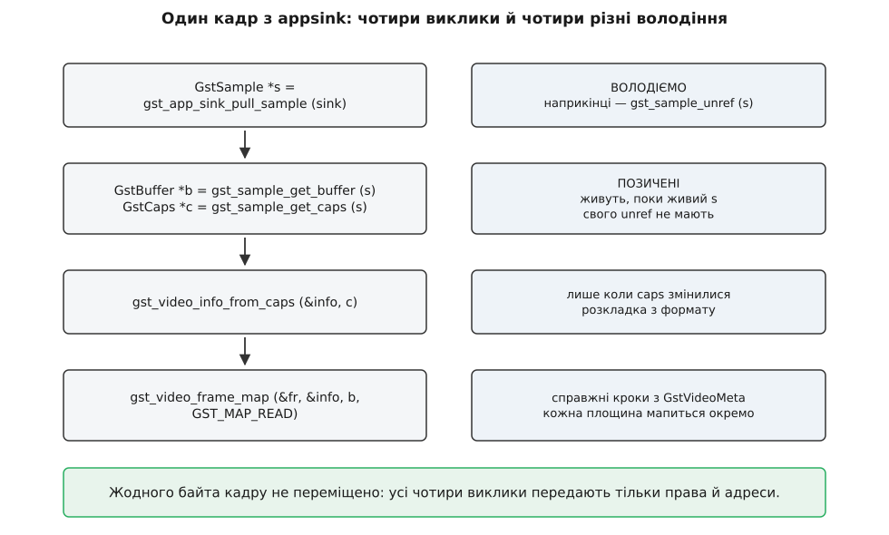
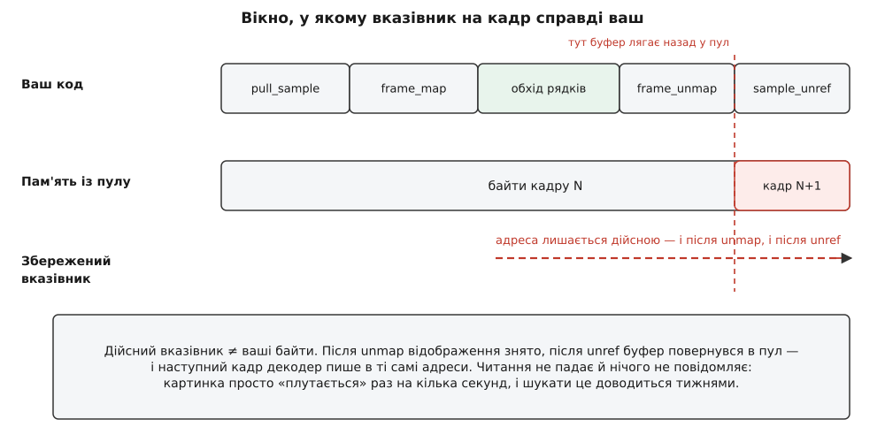

# ⚙️ Читаємо кадр із appsink без жодної копії

Це робоча програма на C: вона забирає з конвеєра GStreamer кадр 1920×1080, проходить усі його рядки, будує з них профіль яскравості й віддає результат у другий конвеєр — і за весь цей шлях жоден піксель не переїжджає з місця на місце. Разом із кодом тут розібрано три помилки, які ламають саме цю властивість. Жодна з них не дає ані падіння, ані попередження: програма просто починає перекладати мегабайти або показувати не той кадр, що прийшов.

## Задача, у якій ціна помилки видна

Робота навмисно дрібна, щоб на її тлі було видно вартість усього іншого. Для кожного кадру треба порахувати середню яскравість кожного рядка й намалювати з цих чисел вузьку смужку — стовпчикову діаграму заввишки з кадр. Смужку віддати назад у конвеєр, щоб її можна було показати або записати.

```
[videotestsrc] → NV12 1920×1080 → [appsink] → наш код → [appsrc] → [autovideosink]
```

Уся корисна робота тут — прочитати площину яскравості. Порахуймо, скільки це, і скільки коштувала б одна-єдина необережна копія кадру поруч:

```
корисне читання (площина Y) = 1920 · 1080          = 2 073 600 байтів ≈ 2.07 МБ
повний кадр NV12            = 1920 · 1080 · 1.5    = 3 110 400 байтів ≈ 3.11 МБ
одна копія кадру = прочитати + записати            = 6.22 МБ трафіку шини
відношення копії до роботи  = 6.22 / 2.07          ≈ 3
```

Одне копіювання — утричі більше руху пам'яті, ніж уся робота, заради якої ми взагалі відкривали кадр. Тому в цій програмі кожен виклик, що торкається кадру, вибрано свідомо, і кожен доведеться пояснити.

Міст між конвеєром і звичайним кодом тримають два елементи — [appsink і appsrc](topic:sys-media/appsink-appsrc): перший віддає кадри назовні, другий приймає їх назад, а решта конвеєра не бачить різниці між ними й будь-яким іншим джерелом чи споживачем.

## Чотири виклики й чотири різні володіння

Шлях від «є конвеєр» до «є вказівник на пікселі» складається з чотирьох викликів, і кожен віддає щось на інших умовах. Плутанина в цих умовах дає або витік на кожному кадрі, або звільнення того, що ще потрібне.

`gst_app_sink_pull_sample()` блокується, доки не буде готового кадру, і повертає `GstSample *` — **ваш**. Це єдиний об'єкт у ланцюгу, за який ви відповідаєте: наприкінці мусить бути `gst_sample_unref()`, включно з усіма шляхами помилок. Коли функція повертає `NULL`, потік скінчився або елемент зупинили — це не помилка, це кінець циклу.

`gst_sample_get_buffer()` і `gst_sample_get_caps()` віддають `GstBuffer *` і `GstCaps *` — **позичені**. Вони живуть рівно доти, доки живий sample, і власного `unref` не мають. Це прямий наслідок [підрахунку посилань](topic:sf-lang/reference-counting): sample тримає по одному посиланню на кожного, віддає вам голий вказівник і звільнить обох, коли ви відпустите його самого.

`gst_video_info_from_caps()` розбирає caps на розкладку кадру: формат, розміри, кількість площин, їхні зміщення й кроки. Цей виклик читає рядки й шукає поля в структурі — робити його тридцять разів на секунду немає жодної причини, бо caps між кадрами майже завжди ті самі. Тому `GstVideoInfo` рахують один раз і перераховують лише тоді, коли caps справді змінилися.

`gst_video_frame_map()` перетворює буфер на набір вказівників на площини. Саме він, а не `gst_buffer_map`, і саме тому, що знає про метадані кадру.



*Один із чотирьох об'єктів ваш, два позичені, четвертий існує лише між map і unmap. Байти кадру при цьому не рухаються взагалі.*

### Чому саме `gst_video_frame_map`

Причин дві, і обидві прямо про копії.

Перша — кроки рядків. Апаратне джерело майже ніколи не пише кадр щільно: між кінцем одного рядка й початком наступного лишається запас до вирівнювання. Реальний крок їде разом із кадром у `GstVideoMeta`, і `gst_video_frame_map` бере його звідти: для кожної площини вона кличе `gst_video_meta_map` і кладе справжній крок у `frame.info.stride[i]`. Якщо метаданих немає — крок береться з `GstVideoInfo`, тобто щільна розкладка. `gst_buffer_map` про це не знає взагалі: він віддає плаский масив байтів, і крок доводиться вгадувати за шириною. Вгадали не так — картинка «поїде» скісно.

Друга причина тонша й дорожча. Кадр у планарному форматі часто приходить не одним блоком пам'яті, а кількома — по одному на площину. `gst_buffer_map` на такий буфер зобов'язаний віддати **суцільний** вказівник на все, а отже мусить злити блоки в один — і це копія цілого кадру, схована за одним рядком коду. `gst_video_frame_map` мапить кожну площину окремим викликом на її власний блок, тож зливати нема чого.

## Каркас: стан, який переживає окремий кадр

Дві речі мусять жити довше за один кадр: розібрані caps і пам'ять, у яку ми пишемо результат.

З результатом цікавіше. Профіль займає шістдесят чотири кілобайти, і брати їх у системи наново тридцять разів на секунду означає тридцять разів на секунду просити великий суцільний блок і віддавати його назад — за годину роботи надійний спосіб покришити адресний простір так, що суцільного блоку в ньому вже не знайдеться. Тож зробімо крихітний власний пул: кільце з чотирьох слотів, кожен розміром із готовий профіль. Слот беруть перед роботою й повертають тоді, коли конвеєр остаточно відпустить буфер, побудований над ним. Коли всі чотири слоти в конвеєрі, узяття блокується — і це найдешевший [зворотний тиск](topic:sf-tasks/backpressure), який можна побудувати: наш цикл сам зупиняється, доки споживач не встигне.

```c
/* zerocopy-profile.c — кадр із appsink без копії й результат назад у appsrc.
 *
 *   gcc -O2 -o zerocopy-profile zerocopy-profile.c \
 *       $(pkg-config --cflags --libs gstreamer-1.0 gstreamer-app-1.0 gstreamer-video-1.0)
 */
#include <gst/gst.h>
#include <gst/app/gstappsink.h>
#include <gst/app/gstappsrc.h>
#include <gst/video/video.h>
#include <string.h>

#define PROF_W       200                        /* видима ширина смужки      */
#define PROF_H       256                        /* рядків у профілі          */
#define PROF_STRIDE  256                        /* крок, вирівняний на 64    */
#define PROF_BYTES   ((gsize) PROF_STRIDE * PROF_H)
#define SLOT_COUNT   4

typedef struct _SlotRing SlotRing;

/* Те, що піде в колбек звільнення: кільце і номер слота в ньому.
   Кожен слот має свій незмінний SlotRef, тож на кадр не виділяється нічого. */
typedef struct {
  SlotRing *ring;
  gint      idx;
} SlotRef;

struct _SlotRing {
  guint8   *data[SLOT_COUNT];
  gboolean  busy[SLOT_COUNT];
  SlotRef   ref[SLOT_COUNT];
  GMutex    lock;
  GCond     freed;
};

/* Кільце мусить пережити обидва конвеєри: колбек звільнення спрацює
   на останньому unref буфера, а це буває вже під час зупинки. */
static SlotRing g_ring;

static void
slot_ring_init (SlotRing *r)
{
  g_mutex_init (&r->lock);
  g_cond_init (&r->freed);
  for (gint i = 0; i < SLOT_COUNT; i++) {
    r->data[i]     = g_malloc0 (PROF_BYTES);
    r->busy[i]     = FALSE;
    r->ref[i].ring = r;
    r->ref[i].idx  = i;
  }
}

static void
slot_ring_clear (SlotRing *r)
{
  for (gint i = 0; i < SLOT_COUNT; i++) {
    g_assert (!r->busy[i]);                     /* усі повернулися з конвеєра */
    g_free (r->data[i]);
  }
  g_mutex_clear (&r->lock);
  g_cond_clear (&r->freed);
}

static gint
slot_acquire (SlotRing *r)
{
  gint idx = -1;

  g_mutex_lock (&r->lock);
  while (idx < 0) {
    for (gint i = 0; i < SLOT_COUNT; i++)
      if (!r->busy[i]) { r->busy[i] = TRUE; idx = i; break; }

    if (idx < 0) {                              /* усі слоти в конвеєрі */
      gint64 deadline = g_get_monotonic_time () + 2 * G_TIME_SPAN_SECOND;
      if (!g_cond_wait_until (&r->freed, &r->lock, deadline))
        break;                                  /* дві секунди тиші — здаємось */
    }
  }
  g_mutex_unlock (&r->lock);
  return idx;
}

/* Це і є GDestroyNotify: GStreamer покличе його на останньому unref буфера,
   з невідомого нам потоку і в невідомий момент. */
static void
slot_release (gpointer user_data)
{
  SlotRef *sr = user_data;

  g_mutex_lock (&sr->ring->lock);
  sr->ring->busy[sr->idx] = FALSE;
  g_cond_signal (&sr->ring->freed);
  g_mutex_unlock (&sr->ring->lock);
}

typedef struct {
  GstVideoInfo  info;
  GstCaps      *caps;                           /* caps, для яких порахована info */
  GstElement   *appsrc;
  guint64       frames;
} Ctx;
```

Колбек звільнення викликають із того потоку, який останнім відпустив буфер, — а це майже напевно не ваш. Тому все, чого він торкається, мусить бути готовим до одночасного доступу; тут це робить звичайний м'ютекс, і без нього кільце розсипалося б на першій же гонитві ([безпека щодо потоків](topic:sf-tasks/thread-safety)).

## Кадр: від sample до пікселів

Тепер сам обхід. Тут важливі три речі: правильний крок, чесний режим доступу й те, що на кожному шляху виходу — і успішному, і помилковому — усе відпущено рівно один раз.

```c
/* Іде рядками площини яскравості за СПРАВЖНІМ кроком і складає профіль. */
static void
build_profile (const GstVideoFrame *f, guint8 *out)
{
  const guint8 *y      = GST_VIDEO_FRAME_PLANE_DATA   (f, 0);
  gint          stride = GST_VIDEO_FRAME_PLANE_STRIDE (f, 0);
  gint          w      = GST_VIDEO_FRAME_WIDTH  (f);
  gint          h      = GST_VIDEO_FRAME_HEIGHT (f);

  guint64 acc[PROF_H] = { 0 };
  guint32 cnt[PROF_H] = { 0 };

  for (gint row = 0; row < h; row++) {
    const guint8 *line = y + (gsize) row * stride;      /* НЕ row * w */
    guint64 sum = 0;

    for (gint x = 0; x < w; x++)
      sum += line[x];

    gint bin = (gint) ((gint64) row * PROF_H / h);      /* h рядків → PROF_H смуг */
    acc[bin] += sum / (guint) w;
    cnt[bin] += 1;
  }

  memset (out, 0, PROF_BYTES);
  for (gint b = 0; b < PROF_H; b++) {
    guint mean = cnt[b] ? (guint) (acc[b] / cnt[b]) : 0;          /* 0…255 */
    gint  len  = (gint) ((guint64) mean * PROF_W / 255);
    memset (out + (gsize) b * PROF_STRIDE, 255, (gsize) len);
  }
}

static gboolean
process_one (GstAppSink *sink, Ctx *ctx)
{
  GstSample     *sample;
  GstBuffer     *buf, *out;
  GstCaps       *caps;
  GstVideoFrame  frame;
  gint           idx;
  gboolean       go_on = TRUE;

  sample = gst_app_sink_pull_sample (sink);          /* наш: transfer full */
  if (sample == NULL)
    return FALSE;                                    /* EOS або зупинка */

  buf  = gst_sample_get_buffer (sample);             /* позичений */
  caps = gst_sample_get_caps (sample);               /* позичений */
  if (buf == NULL || caps == NULL)
    goto out_sample;

  /* gst_caps_is_equal першою дією порівнює вказівники, а appsink зазвичай
     віддає той самий об'єкт caps — тож у сталому режимі це одне порівняння. */
  if (ctx->caps == NULL || !gst_caps_is_equal (caps, ctx->caps)) {
    if (!gst_video_info_from_caps (&ctx->info, caps))
      goto out_sample;
    gst_caps_replace (&ctx->caps, caps);             /* тепер тримаємо своє посилання */
    g_print ("формат: %s %d×%d\n",
             gst_video_format_to_string (GST_VIDEO_INFO_FORMAT (&ctx->info)),
             GST_VIDEO_INFO_WIDTH (&ctx->info),
             GST_VIDEO_INFO_HEIGHT (&ctx->info));
  }

  idx = slot_acquire (&g_ring);
  if (idx < 0) { go_on = FALSE; goto out_sample; }

  /* Тільки читання. Кожен зайвий біт у прапорцях тут коштує грошей. */
  if (!gst_video_frame_map (&frame, &ctx->info, buf, GST_MAP_READ))
    goto out_slot;

  build_profile (&frame, g_ring.data[idx]);

  gst_video_frame_unmap (&frame);                    /* далі frame.data — сміття */

  /* Слот переходить у власність буфера, буфер — у власність appsrc. */
  out = wrap_slot (idx, GST_BUFFER_PTS (buf), GST_BUFFER_DURATION (buf));
  if (gst_app_src_push_buffer (GST_APP_SRC (ctx->appsrc), out) != GST_FLOW_OK)
    go_on = FALSE;                                   /* слот уже у буфера — не чіпаємо */
  else
    ctx->frames++;

  goto out_sample;

out_slot:
  slot_release (&g_ring.ref[idx]);                   /* слот у конвеєр не пішов */
out_sample:
  gst_sample_unref (sample);
  return go_on;
}
```

Драбинка `goto` тут не стилістичний вибір, а єдиний спосіб не забути `unmap` чи `unref` на п'ятьох різних шляхах виходу. Ціна забутого `unmap` конкретна: поки блок відображений, він не повертається в пул, і за кілька секунд джерело стане, бо йому нема куди писати. Ціна забутого `gst_sample_unref` — три мегабайти за кадр, які нікуди не подінуться.

Один нюанс, який рятує в складніших випадках: `gst_video_frame_map` бере власне посилання на буфер і тримає його до `unmap`. Тобто після вдалого `map` можна спокійно відпустити sample — кадр не зникне. Прапорець `GST_VIDEO_FRAME_MAP_FLAG_NO_REF` вимикає це посилання для тих випадків, коли час життя буфера ви гарантуєте самі.

## Пастка перша: вказівник, що пережив `unmap`

Спокуса очевидна: «збережу вказівник на площину, гляну на неї трохи згодом».

```c
/* ✗ так не можна */
static const guint8 *g_last_y;
static gint          g_last_stride;

gst_video_frame_map (&frame, &ctx->info, buf, GST_MAP_READ);
g_last_y      = GST_VIDEO_FRAME_PLANE_DATA   (&frame, 0);
g_last_stride = GST_VIDEO_FRAME_PLANE_STRIDE (&frame, 0);
gst_video_frame_unmap (&frame);
gst_sample_unref (sample);
/* …десь у зовсім іншій функції */
analyse (g_last_y, g_last_stride);
```

Найгірше в цьому те, що в найпоширенішому випадку воно **працює**. Кадр із системної пам'яті пулу нікуди не подівся: сторінки на місці, адреса дійсна, читання не спричиняє жодного сигналу. Просто буфер після `unref` ліг назад у пул, пул віддав його джерелу, і джерело записало туди наступний кадр. Ви читаєте справжні пікселі — просто не ті. Симптом у продукті виглядає як «детектор раз на кілька секунд бачить те, чого немає», і шукають його тижнями.

Іронія в тому, що кадр із апаратного джерела поводиться тут милосердніше: на останньому `unmap` відображення дескриптора знімають, сторінки зникають з адресного простору, і та сама помилка дає негайне падіння з чіткою адресою. Найгірше — коли код працює на платі й «дивно поводиться» на робочому столі, або навпаки.



*Вікно, у якому вказівник ваш, відкривається на `map` і закривається на `unmap`. Далі адреса ще дійсна, а байти вже чужі.*

Правило звідси одне: **вказівник ніколи не переживає своє відображення**. Якщо кадр потрібен пізніше — тримають не адресу, а посилання, і мапять знову там, де справді працюють:

```c
/* ✓ якщо кадр потрібен потім — тримайте sample або буфер */
ctx->kept = gst_sample_ref (sample);
/* …пізніше, там, де працюємо: */
GstBuffer *b = gst_sample_get_buffer (ctx->kept);
gst_video_frame_map (&frame, &ctx->info, b, GST_MAP_READ);
```

Але й у цього є ціна, яку треба бачити: доки ви тримаєте посилання, слот пулу не повертається в обіг. Затримайте чотири кадри при пулі на чотири буфери — і джерело стане. Коли кадр потрібен надовго й незалежно від конвеєра, чесніше одразу зробити `gst_buffer_copy_deep()`: копія все одно станеться, але станеться там, де її видно, і слот повернеться негайно.

## Пастка друга: `GST_MAP_READWRITE` там, де досить `GST_MAP_READ`

Поставити «про всяк випадок обидва прапорці» здається безневинним: писати ми однаково не збираємося. Прапорці, однак, не описують ваші наміри — вони описують, що система мусить зробити з пам'яттю, перш ніж віддати її вам, і що зробити після.

Найяскравіше це видно на кадрі з апаратного джерела, який лежить у буфері драйвера. Алокатор `dmabuf` на `map` робить дві речі: `mmap` дескриптора з правами доступу рівно за прапорцями (`PROT_READ` для читання, `PROT_READ|PROT_WRITE` для читання-запису) і системний виклик `DMA_BUF_IOCTL_SYNC` з ознакою `DMA_BUF_SYNC_START`, у яку так само переносить `READ` і `WRITE`. На `unmap` — той самий виклик із `DMA_BUF_SYNC_END`.

Різниця між «прочитати» й «прочитати та записати» тут не косметична. Сказавши драйверу, що збираєтеся писати, ви змушуєте його вважати весь буфер забрудненим процесором — а отже на закритті виштовхнути з кеша три мегабайти назад у пам'ять, щоб пристрій побачив ваші зміни. Змін немає, виштовхування є. На системі з некогерентним доступом пристроїв до пам'яті — а це майже кожна вбудована плата — це найдорожчий рядок у всьому циклі обробки, і в профілі він виглядає як загадкові витрати всередині `gst_video_frame_unmap`.

Той самий принцип у пам'яті графічного прискорювача: `GST_MAP_READ` означає перетягти текстуру в системну пам'ять, `GST_MAP_WRITE` — залити її назад, `GST_MAP_READWRITE` — і те, і те. Написали обидва там, де тільки читаєте, — заплатили вдвічі за нічого. Звідки саме беруться такі кадри й які елементи їх віддають, розбирає [апаратне декодування](topic:sys-media/hardware-decode-elements).

## Пастка третя: копія, якої ніхто не просив

Третя пастка найтихіша, бо в ній копія стається всередині виклику, що синтаксично виглядає як «взяти вказівник». І поводиться вона по-різному залежно від того, **що саме** спільне — конверт чи вміст.

**Спільний буфер.** Кадр із appsink узагалі не ваш на запис. Спроба відобразити його на запис не «якось владнається»: `gst_buffer_map_range` першою дією перевіряє `gst_buffer_is_writable`, і при лічильнику більшому за одиницю падає в гілку помилки — `g_critical` у журнал і `FALSE` назад.

```c
/* ✗ буфер спільний: map на запис голосно провалиться */
if (!gst_buffer_map (buf, &mi, GST_MAP_WRITE))
  /* сюди ви й потрапите, разом із критичним записом у журнал */;
```

**Свій конверт над спільною пам'яттю.** А ось тут тихо. `gst_buffer_copy` коштує майже нічого: він робить новий `GstBuffer` із лічильником одиниця, який посилається на **ту саму** пам'ять. Буфер придатний до запису, пам'ять — ні, бо на неї тепер два посилання. Тож `gst_buffer_map` доходить до `gst_memory_make_mapped`, той не може відобразити пам'ять на запис, робить `gst_memory_copy` на весь блок і підмінює блок у буфері.

```c
/* ✗ «зроблю собі копію конверта, а писатиму потім» */
GstBuffer *mine = gst_buffer_copy (buf);              /* дешево: лише конверт */
gst_buffer_map (mine, &mi, GST_MAP_WRITE);            /* тут — тиха копія 3 МБ */
```

У цієї тихої копії є другий наслідок, дорожчий за саму копію. Підміна блоку ставить на буфер прапорець `GST_BUFFER_FLAG_TAG_MEMORY`, а пул, побачивши цей прапорець при поверненні, розуміє, що йому віддають не той об'єкт, який він видавав, — і не бере буфер назад в обіг, а звільняє його й створює новий. Одна необережна відмітка «мені потрібен запис» вимикає весь пул: виділення повертаються, просто ховаються на рівень глибше.

Перевірити, чи запис зараз коштуватиме копії, можна двома читаннями лічильників — до того, як платити:

```c
gboolean cheap = gst_buffer_is_writable (buf) &&
                 gst_memory_is_writable (gst_buffer_peek_memory (buf, 0));
```

А побачити всі копії, що вже сталися, — окремою категорією журналу, у яку елементи пишуть саме тоді, коли пішли повільним шляхом:

```
GST_DEBUG=GST_PERFORMANCE:5 ./zerocopy-profile
```

Порожній вивід означає, що кадр справді доїхав без копій. Кожен рядок у ньому — знайдені мегабайти за секунду.

## Назад у конвеєр: чужа пам'ять під обгорткою

Лишилося віддати профіль. Пам'ять під нього виділили ми, GStreamer про неї нічого не знає й звільнити її сам не має права. Саме для цього існує `gst_buffer_new_wrapped_full` — обгортка над чужим блоком із власним способом звільнення:

```c
static GstBuffer *
wrap_slot (gint idx, GstClockTime pts, GstClockTime dur)
{
  gsize offset[1] = { 0 };
  gint  stride[1] = { PROF_STRIDE };
  GstBuffer *out;

  /* READONLY: нижчі елементи хай не пишуть у наш слот — ми його перевикористаємо.
     Останній unref покличе slot_release із &g_ring.ref[idx]. */
  out = gst_buffer_new_wrapped_full (GST_MEMORY_FLAG_READONLY,
                                     g_ring.data[idx],   /* дані     */
                                     PROF_BYTES,         /* maxsize  */
                                     0,                  /* offset   */
                                     PROF_BYTES,         /* size     */
                                     &g_ring.ref[idx],   /* user_data */
                                     slot_release);      /* GDestroyNotify */

  /* Крок 256 при ширині 200: без метаданих кожен нижчий елемент рахував би
     розкладку за шириною (для GRAY8 це 200) і отримав би скіс. */
  gst_buffer_add_video_meta_full (out, GST_VIDEO_FRAME_FLAG_NONE,
                                  GST_VIDEO_FORMAT_GRAY8,
                                  PROF_W, PROF_H, 1, offset, stride);

  GST_BUFFER_PTS (out)      = pts;                /* мітки беремо з вхідного кадру */
  GST_BUFFER_DURATION (out) = dur;
  return out;
}
```

Три речі тут неочевидні.

**`maxsize` і `size` — різні поля не просто так.** Виділено `PROF_STRIDE · PROF_H`, видимо стільки ж, бо запасу ми не лишали. Якби слот мав місце під заголовок попереду, `offset` був би ненульовим, і нижчі елементи бачили б лише корисну частину, не втрачаючи доступу до всієї виділеної ділянки.

**`GST_MEMORY_FLAG_READONLY` — межа володіння, а не перестраховка.** Слот наш, ми його перевикористаємо, і ніхто нижче не має вирішувати, що в нього можна писати. Без прапорця перший-ліпший фільтр, який уміє працювати на місці, побачить буфер із лічильником одиниця, визнає його придатним до запису й перепише наші байти — тихо й без сліду. З прапорцем той самий фільтр змушений зробити собі копію, і цю копію видно в журналі `GST_PERFORMANCE`.

**Колбек звільнення спрацює далеко звідси.** Це не «функція, яку викличуть одразу після push»: буфер може стояти в черзі, лежати у двох гілках після `tee` і жити секундами. `slot_release` покличуть із того потоку, який останнім зробив `unref`, — і саме тому кільце слотів мусить пережити конвеєр і мати м'ютекс.

Передача в конвеєр — один рядок, але з чіткою умовою:

```c
gst_app_src_push_buffer (GST_APP_SRC (ctx->appsrc), out);   /* transfer full */
```

`gst_app_src_push_buffer` **забирає володіння**. Після цього виклику `out` більше не ваш, і `unref` робити не можна — навіть коли він повернув помилку: на всіх гілках відмови (`GST_FLOW_FLUSHING`, `GST_FLOW_EOS`, переповнення черги) appsrc відпускає буфер сам. Тому в `process_one` після невдалого `push_buffer` ми **не** звільняємо слот вручну: його вже звільнить колбек. Зверніть увагу на різницю з сусідньою функцією: `gst_app_src_push_sample` володіння **не** забирає, і після неї sample треба відпустити самому.

## Складання: обидва конвеєри й акуратна зупинка

```c
int
main (int argc, char *argv[])
{
  GstElement *in_pipe, *out_pipe, *sink, *src;
  GstCaps    *out_caps;
  Ctx         ctx = { 0 };

  gst_init (&argc, &argv);
  gst_video_info_init (&ctx.info);
  slot_ring_init (&g_ring);

  in_pipe = gst_parse_launch
      ("videotestsrc pattern=ball num-buffers=300 ! "
       "video/x-raw,format=NV12,width=1920,height=1080,framerate=30/1 ! "
       "appsink name=sink sync=false max-buffers=2 drop=true", NULL);

  out_pipe = gst_parse_launch
      ("appsrc name=src format=time is-live=true ! "
       "videoconvert ! videoscale ! autovideosink sync=false", NULL);

  sink = gst_bin_get_by_name (GST_BIN (in_pipe),  "sink");
  src  = gst_bin_get_by_name (GST_BIN (out_pipe), "src");
  ctx.appsrc = src;

  out_caps = gst_caps_new_simple ("video/x-raw",
      "format",    G_TYPE_STRING,     "GRAY8",
      "width",     G_TYPE_INT,        PROF_W,
      "height",    G_TYPE_INT,        PROF_H,
      "framerate", GST_TYPE_FRACTION, 30, 1, NULL);
  gst_app_src_set_caps (GST_APP_SRC (src), out_caps);
  gst_caps_unref (out_caps);

  gst_element_set_state (out_pipe, GST_STATE_PLAYING);
  gst_element_set_state (in_pipe,  GST_STATE_PLAYING);

  while (process_one (GST_APP_SINK (sink), &ctx))
    ;

  gst_app_src_end_of_stream (GST_APP_SRC (src));
  g_print ("оброблено кадрів: %" G_GUINT64_FORMAT "\n", ctx.frames);

  /* Спершу конвеєри в NULL — доки живий бодай один буфер, живий і слот. */
  gst_element_set_state (in_pipe,  GST_STATE_NULL);
  gst_element_set_state (out_pipe, GST_STATE_NULL);

  gst_object_unref (sink);
  gst_object_unref (src);
  gst_object_unref (in_pipe);
  gst_object_unref (out_pipe);
  gst_caps_replace (&ctx.caps, NULL);

  slot_ring_clear (&g_ring);        /* аж тепер жоден колбек уже не спрацює */
  return 0;
}
```

Порядок зупинки не декоративний. Звільнити кільце, доки в конвеєрі ще живе бодай один буфер над його слотом, означає лишити конвеєру вказівники в звільнену пам'ять, а колбеку звільнення — знищений м'ютекс. Обидва конвеєри мусять дійти до `NULL` **перед** тим, як зникне пам'ять, якою вони користувалися, — а `gst_element_set_state (…, GST_STATE_NULL)` якраз і гарантує, що всі внутрішні черги спорожніли й усі буфери відпущені.

Дрібниця про сумісність: `drop=true` на appsink від версії 1.28 вважається застарілим — його замінює властивість `leaky-type`, яка дозволяє обрати, чиї кадри викидати, старі чи нові. Стара властивість працює й далі, просто всередині перетворюється на `GST_APP_LEAKY_TYPE_DOWNSTREAM`.

Блоки коду вище йдуть один за одним в один файл (`wrap_slot` треба поставити перед `process_one`); рядок збірки — у першому коментарі. Запуск покаже вікно з вузькою смужкою, у якій світлі рядки кадру дають довгі бруски.

## Скільки це коштує насправді

Порахуймо, що лишилося після всіх цих обережностей.

**Один кадр NV12 1920×1080 у конвеєрі, який ніде не копіює.**

```
пересилання прав (pull, get_buffer, get_caps, unref) — лічильники, а не байти
gst_video_frame_map із системної пам'яті                 ≈ 0
корисне читання Y-площини    = 1920 · 1080              = 2.07 МБ
запис профілю                = 256 · 256                = 0.07 МБ
gst_buffer_new_wrapped_full                              лише конверт
─────────────────────────────────────────────────────────────────
разом трафік шини на кадр                               ≈ 2.14 МБ
при 30 кадрах за секунду     = 2.14 · 30                ≈ 64 МБ/с
```

Для порівняння: одна зайва копія кадру додала б 6.22 МБ на кадр, тобто 187 МБ/с — утричі більше, ніж уся програма. Будь-які дві з описаних вище пасток разом дають більше трафіку шини, ніж корисна робота, при повній зовнішній справності: жодного повідомлення, жодного зростання пам'яті, просто вентилятор голосніший і кадри йдуть рідше.

Ця дисципліна — «кожен `map` має свій `unmap` на всіх шляхах» — у C тримається вручну, і драбинка `goto` вище саме про це. У прив'язках до мов зі знищувачами вона стає автоматичною: `gst_video_frame_map` там повертає об'єкт-охоронець, чий знищувач і є `unmap`, тож забути його неможливо навіть при виході з винятком — та сама [прив'язка ресурсу до часу життя об'єкта](topic:sf-lang/raii), тільки застосована до відображення кадру. Помилки, розібрані тут, від цього нікуди не діваються: охоронець рятує від забутого `unmap`, але не від збереженого вказівника, не від зайвого прапорця запису й не від копії, схованої під `gst_buffer_copy`.
