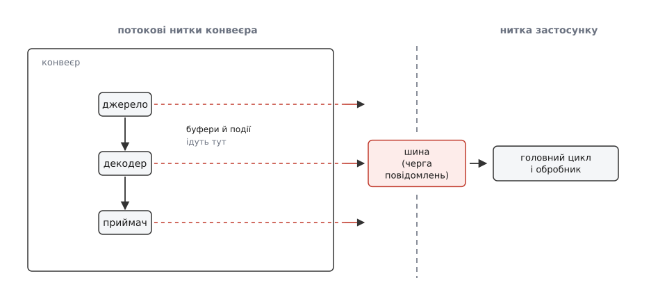
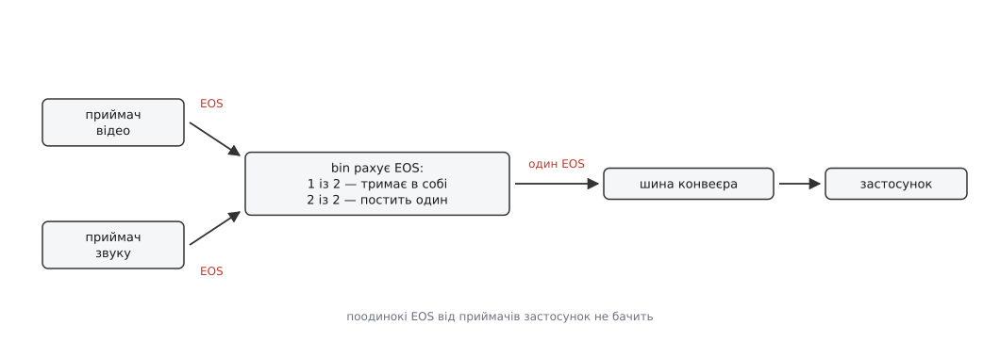
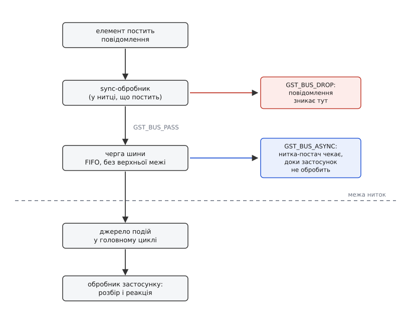

# Шина повідомлень: події й помилки конвеєра

<preknowlist>
- [Конвеєр: елементи, зв'язки й потік даних](root:sys-media/pipeline-model) — що таке елемент, як елементи складаються в конвеєр і як кадр іде від джерела до приймача.
- [Процеси й потоки](root:sf-os/process-vs-thread) — нитка виконує код незалежно від інших і має власний стек; кілька ниток працюють одночасно.
- [Цикл подій](root:sf-tasks/event-loop) — одна нитка по колу забирає готові події з черги й викликає для них обробники.
- [Виробник–споживач](root:sf-tasks/producer-consumer) — черга між тим, хто виробляє, і тим, хто споживає, розв'язує їхні темпи й не змушує швидшого чекати.
- [Підрахунок посилань](root:sf-lang/reference-counting) — об'єкт живе, доки на нього є посилання; хто відпустив останнє, той і звільнив пам'ять.
</preknowlist>

Ви зібрали конвеєр, викликали `gst_element_set_state(pipeline, GST_STATE_PLAYING)` — і функція повернула керування майже миттєво. Кадри вже течуть, декодер уже працює, а ваш `main` стоїть на наступному рядку й не знає про конвеєр нічого. Файл скінчився? Мережа обірвалася? Декодер наткнувся на сміття в потоці й здався? Жодна з цих подій не має способу перетворитися на повернене значення — функція, яка мала б його повернути, завершилася кілька мілісекунд тому.

Причина в тому, що конвеєр працює не у вашій нитці. Кожен елемент-джерело запускає власну **нитку потоку** (streaming thread) — саме вона тягне дані, штовхає їх у ланцюжок і врешті віддає приймачеві. Ниток таких може бути кілька: `queue` розриває ланцюг і додає ще одну, демультиплексор роздає гілки відео та звуку окремим ниткам. Конвеєр — це маленька багатониткова машина, яку ви запустили однією функцією.

## Чому не просто колбек

Найпростіше, що спадає на думку: хай елемент просто викличе мою функцію, коли щось станеться. Ця ідея розбивається об те, **де** такий виклик відбудеться.

Колбек виконується в тій нитці, яка його викликала, — тобто в нитці потоку. Поки ваш код у ній працює, дані не рухаються: нитка зайнята вами, а не наступним кадром. Показати діалог «файл не знайдено» коштує кількох сотень мілісекунд, і всі ці мілісекунди конвеєр стоїть. Гірше: більшість наборів віджетів вимагає, щоб їхні виклики йшли лише з однієї, головної нитки, — намалювати щось із нитки потоку означає або зіпсовану картинку, або аварію. І найгірше: якщо з колбека покликати назад у конвеєр — скажімо, `gst_element_set_state()` — ви просите нитку, що зараз усередині елемента, дочекатися завершення того, що вона сама й виконує. Це замок на самого себе.

Отже, сповіщення мусить **змінити нитку**, і зробити це так, щоб нитка потоку не чекала на застосунок. Механізм, який передає щось між нитками, не змушуючи виробника чекати на споживача, один — черга. Виробник кладе й іде далі, споживач забирає, коли готовий.

Ця черга в GStreamer називається **шиною** (англ. *bus* — від *omnibus*, «для всіх»; назва прийшла з апаратури, де спільною лінією користуються всі пристрої). У кожного конвеєра вона одна, і вона єдина легальна дорога зсередини конвеєра назовні.



*Два канали конвеєра: буфери й події живуть у ланцюжку елементів, повідомлення виходять убік — у шину, яка й переносить їх через межу ниток.*

## Повідомлення — це не подія

У конвеєрі рухаються дві різні речі, і плутанина між ними коштує годин налагодження.

**Події** (`GstEvent`) течуть **у самому потоці даних**, від елемента до елемента, разом з буферами й на своєму місці в черзі. Подія `SEGMENT` іде перед першим буфером сегмента; подія `EOS` іде після останнього; подія `FLUSH_START` розчищає дорогу перед перемотуванням. Подія має адресата — сусідній елемент — і має порядок відносно кадрів. Про цей канал є окрема стаття: [події конвеєра](root:sys-media/events-and-queries) — які бувають, куди йдуть (за потоком і проти) і як елемент має на них реагувати.

**Повідомлення** (`GstMessage`) течуть **повз потік даних**, убік і вгору — до застосунку. Повідомлення не має адресата-елемента, воно взагалі не для елементів; воно для того, хто конвеєр зібрав. Порядку відносно кадрів у нього теж немає: поки повідомлення чекає в черзі, конвеєр устигає обробити ще сотню буферів.

Одна й та сама річ часто існує в обох виглядах, і це головне джерело плутанини. Кінець потоку — це **подія** `EOS`, що йде ланцюжком до приймача, і **повідомлення** `GST_MESSAGE_EOS`, яке приймач після цього постить у шину. Перша каже елементам «даних більше не буде, дограйте те, що маєте»; друге каже вам «показ закінчено, можна зупиняти». Затримка теж має обидва втілення: запит латентності ходить конвеєром, а повідомлення `LATENCY` просить застосунок цей запит переробити.

## З чого зроблено повідомлення

`GstMessage` — це легкий об'єкт із підрахунком посилань, у якому по суті чотири речі та вантаж.

**Джерело** (`GST_MESSAGE_SRC`) — вказівник на об'єкт, що постив: майже завжди елемент, іноді сам конвеєр чи pad. Саме за джерелом ви відрізняєте «декодер змінив стан» від «конвеєр змінив стан», і без цієї перевірки код тоне в чужих сповіщеннях.

**Тип** (`GST_MESSAGE_TYPE`) — значення з переліку `GstMessageType`: `EOS`, `ERROR`, `WARNING`, `STATE_CHANGED`, `BUFFERING`, `TAG`, `ELEMENT`, `QOS`, `LATENCY`, `CLOCK_LOST`, `NEED_CONTEXT` і ще з півтора десятка. Значення там — окремі біти, тому типи можна об'єднувати маскою: `GST_MESSAGE_ERROR | GST_MESSAGE_EOS` — цілком робочий фільтр.

**Мітка часу** й **порядковий номер** (`seqnum`). Номер дає змогу пов'язати відповідь із запитом: повідомлення, що народилося через ваше перемотування, несе той самий `seqnum`, що й подія пошуку, яку ви послали.

**Вантаж** — вкладена `GstStructure`: іменований набір типізованих полів, щось на кшталт словника з оголошеними типами значень. Саме через неї повідомлення довільного змісту вміщається в один тип C-структури: `BUFFERING` кладе туди ціле `buffer-percent`, `STATE_CHANGED` — три значення станів, `ELEMENT` — узагалі що завгодно, залежно від плагіна. Ціна цієї гнучкості — розбирати вантаж треба спеціальною функцією свого типу (`gst_message_parse_error()`, `gst_message_parse_buffering()` і подібними), бо поля лежать не як члени структури, а як записи в наборі.

Повний перелік типів, поля кожного вантажу й сигнатури функцій розбору зібрано окремо: [довідка API шини й повідомлень](root:sys-media/bus-and-messages/api-bus.md) — таблиця типів, парні до них `gst_message_parse_*`, функції самої шини й що кожна з них повертає. Тут ці подробиці лише заважали б думці.

## Де народжується повідомлення і що робить із ним bin

Елемент постить повідомлення викликом `gst_element_post_message()`. Елемент при цьому не знає жодної шини — він питає свою: шину йому проставив батьківський контейнер тієї миті, коли елемент додали в конвеєр. Звідси практичний наслідок: **елемент поза конвеєром постити нікуди** — його повідомлення тихо гине, і саме тому діагностика «нічого не приходить» майже завжди починається з питання, чи додано елемент у конвеєр.

Далі повідомлення йде не прямо в чергу, а спершу через контейнер, у якому елемент лежить. І тут `GstBin` не просто передавач: частину повідомлень він **перехоплює та зводить докупи**.

Найважливіший приклад — кінець потоку. Уявіть відеофайл зі звуком: два приймачі, відео і звук, кожен доходить до кінця свого потоку у свій момент. Якби кожен постив свій `EOS` нагору, застосунок отримав би два повідомлення «все скінчилося», причому перше — брехливе: звук ще грає. Тому bin рахує: `EOS` він постить своєму батькові **лише тоді, коли його поставили всі приймачі всередині**. Застосунок бачить один-єдиний `EOS`, і той — правдивий.



*Зведення EOS: кожен приймач звітує окремо, але нагору йде одне повідомлення — і лише коли відзвітували всі.*

Так само bin поводиться з `SEGMENT_START`/`SEGMENT_DONE` (збирає й нагору не пускає взагалі — вони потрібні йому самому, щоб знати, коли всі догралися) і з `CLOCK_LOST` (передає вище, тільки якщо втрачений годинник був той, яким користувався сам bin). `CLOCK_PROVIDE` до застосунку не доходить ніколи — це внутрішнє повідомлення для вибору годинника, і воно йде лише до батька.

Іноді така фільтрація заважає: наприклад, `splitmuxsink` усередині сам зупиняє свої частини, і вам потрібні саме ті `EOS`, які bin ковтає. Для цього в bin є властивість `message-forward`. Увімкнена, вона пропускає нагору **все**, включно з тим, що зазвичай фільтрується, — але не як є, а загорнутим: назовні виходить `GST_MESSAGE_ELEMENT` зі структурою на ім'я `GstBinForwarded`, у полі `message` якої лежить оригінальне дитяче повідомлення. Обгортка потрібна, щоб застосунок не сплутав зведений `EOS` конвеєра з чиїмось окремим.

> 🔧 **Навіщо це.** Коли конвеєр «не завершується» — файл дописано, а програма висить, — питання майже завжди в зведенні. Один із приймачів `EOS` не поставив: або він у стані `PAUSED` (у `PAUSED` приймач `EOS` не постить), або гілка застрягла на `queue`, який чекає даних, що вже не прийдуть. Дивитися треба не на застосунок, а на те, хто з приймачів не відзвітував; побачити це дає змогу `message-forward` або граф конвеєра ([діагностика конвеєра](root:sys-media/pipeline-debugging)).

## Три способи забрати повідомлення

Шина — черга, і забрати з неї можна трьома різними способами. Вибір між ними — це вибір, **хто крутить цикл**.

**Стеження в головному циклі GLib.** `gst_bus_add_watch(bus, callback, data)` створює джерело подій і чіпляє його до типового головного контексту GLib. Далі все звичне: `GMainLoop` крутиться, помічає, що на шині щось є, і викликає ваш колбек — у своїй нитці. Колбек повертає `TRUE`, щоб лишитися підключеним, і `FALSE`, щоб від'єднатися. Це основний спосіб для застосунків, у яких головний цикл уже й так є (а він є в усьому, що на GLib чи Gtk).

:::tabs
```c
static gboolean on_bus_message (GstBus *bus, GstMessage *msg, gpointer user_data)
{
  GMainLoop *loop = user_data;

  switch (GST_MESSAGE_TYPE (msg)) {
    case GST_MESSAGE_ERROR: {
      GError *err = NULL;
      gchar *dbg = NULL;
      gst_message_parse_error (msg, &err, &dbg);
      g_printerr ("помилка від %s: %s\n", GST_OBJECT_NAME (msg->src), err->message);
      g_printerr ("подробиці: %s\n", dbg ? dbg : "(немає)");
      g_clear_error (&err);
      g_free (dbg);
      g_main_loop_quit (loop);
      break;
    }
    case GST_MESSAGE_EOS:
      g_print ("потік скінчився\n");
      g_main_loop_quit (loop);
      break;
    default:
      break;
  }
  return TRUE;                    /* лишаємося підключеними */
}

/* ... */
GstBus *bus = gst_element_get_bus (pipeline);
gst_bus_add_watch (bus, on_bus_message, loop);
gst_object_unref (bus);
```
```py
def on_bus_message(bus, msg, loop):
    if msg.type == Gst.MessageType.ERROR:
        err, dbg = msg.parse_error()
        print(f"помилка від {msg.src.name}: {err.message}")
        print(f"подробиці: {dbg or '(немає)'}")
        loop.quit()
    elif msg.type == Gst.MessageType.EOS:
        print("потік скінчився")
        loop.quit()
    return True                    # лишаємося підключеними

bus = pipeline.get_bus()
bus.add_watch(GLib.PRIORITY_DEFAULT, on_bus_message, loop)
```
:::

**Опитування без циклу.** Якщо головного циклу GLib у застосунку немає — скажімо, це утиліта командного рядка або чужий фреймворк зі своїм циклом, — шину можна просто питати. `gst_bus_timed_pop_filtered()` блокує нитку до появи повідомлення потрібного типу або до вичерпання відведеного часу:

```c
GstBus *bus = gst_element_get_bus (pipeline);
GstMessage *msg = gst_bus_timed_pop_filtered (bus, GST_CLOCK_TIME_NONE,
                                              GST_MESSAGE_ERROR | GST_MESSAGE_EOS);
```

Тут `GST_CLOCK_TIME_NONE` означає «чекати скільки завгодно». Ціна фільтра — те, що не збіглося з маскою, **викидається дорогою**, а не лишається в черзі: `pop_filtered` дістає й відкидає все, що трапилося раніше за потрібне. Для маленької утиліти це рівно те, що треба; для застосунку, якому цікаві ще й `BUFFERING` чи `STATE_CHANGED`, — пастка.

**Сигнали.** `gst_bus_add_signal_watch()` перетворює кожне повідомлення на GObject-сигнал `"message"`, до якого можна причепитися вибірково за типом: `"message::error"`, `"message::eos"`. Механіка доставки та сама, що й у стеження (черга, головний цикл, ваша нитка), — інакший лише спосіб підписки, зручний, коли на різні типи реагують різні частини програми. Тут теж діє обмеження «одне стеження на шину»: `add_watch` і `add_signal_watch` разом на одній шині не живуть.



*Шлях повідомлення: синхронний обробник бачить його першим і в чужій нитці; усе інше відбувається вже після черги, у нитці застосунку.*

## Синхронний обробник: коли чекати не можна

Черга дає застосунку спокій, але забирає **час**: між тим, як елемент постив повідомлення, і тим, як ви його побачили, минає невизначений проміжок. Здебільшого це неістотно. Але є випадки, коли елемент фізично не може рухатися далі, доки не отримає відповіді.

Класичний — вбудовування відео у ваше вікно. Відеоприймач, доходячи до першого кадру, мусить знати, у яке вікно малювати. Якщо він не отримає ідентифікатора вікна **тут і зараз**, він створить власне — і на екрані вискочить чужа рамка замість картинки у вашому інтерфейсі. Черга тут не годиться принципово: до моменту, коли ви прочитаєте повідомлення, зайве вікно вже існуватиме.

Для таких випадків є `gst_bus_set_sync_handler()` — обробник, який шина кличе **негайно, у тій самій нитці, що постила**, ще до будь-якої черги. Він повертає одне з трьох:

- `GST_BUS_PASS` — «я цим не займаюся, клади в чергу як завжди». Так треба відповідати на все, що вас тут не цікавить.
- `GST_BUS_DROP` — «я це обробив, далі не передавай». Повідомлення до застосунку не дійде; звільнити його зобов'язані ви самі.
- `GST_BUS_ASYNC` — «клади в чергу, а нитку-постача **притримай**, доки застосунок це не обробить». Постач блокується на умовній змінній і чекає.

Останній варіант — це навмисне гальмо конвеєра, і застосовувати його треба, розуміючи ціну: нитка потоку стоїть, буфери не рухаються, а якщо ваш головний цикл у цей момент чимось зайнятий — конвеєр стоїть рівно стільки ж.

```c
static GstBusSyncReply on_sync_message (GstBus *bus, GstMessage *msg, gpointer data)
{
  if (!gst_is_video_overlay_prepare_window_handle_message (msg))
    return GST_BUS_PASS;              /* решта — звичайним шляхом, у головний цикл */

  gst_video_overlay_set_window_handle (GST_VIDEO_OVERLAY (GST_MESSAGE_SRC (msg)),
                                       (guintptr) window_id);
  gst_message_unref (msg);            /* DROP означає: повідомлення наше — нам і звільняти */
  return GST_BUS_DROP;
}
```

Код у синхронному обробнику мусить бути коротким і не мати права ходити ні у віджети, ні назад у конвеєр по стан. Синхронних обробників, як і стежень, шина тримає рівно один.

## Анатомія помилки

Помилка в GStreamer — не код повернення, а повідомлення, і всередині нього дві різні речі для двох різних читачів.

Елемент повідомляє про біду макросом `GST_ELEMENT_ERROR`, який розгортається у виклик `gst_element_message_full()` і збирає:

- **`GError`** — домен, код і перекладений текст для людини. Доменів чотири, і вони кажуть, **чия** це біда: `GST_CORE_ERROR` — зламано щось у самому ядрі чи в тому, як зібрано конвеєр; `GST_LIBRARY_ERROR` — не вдалося з бібліотекою, на якій стоїть елемент; `GST_RESOURCE_ERROR` — не вдалося з зовнішнім ресурсом (файлу немає, сокет закрився, пристрій зайнятий); `GST_STREAM_ERROR` — не вдалося з самими даними (формат не той, декодування зламалося). Код усередині домену уточнює: `GST_RESOURCE_ERROR_NOT_FOUND`, `GST_STREAM_ERROR_DECODE` і так далі.
- **зневаджувальний рядок** — не перекладений, з ім'ям файлу, номером рядка й функцією, звідки помилку кинуто.

Розділення тут не косметичне. Перший рядок призначено користувачеві й можна показувати в інтерфейсі; другий — вам, і в інтерфейсі йому не місце, зате в журналі без нього ви не знайдете, який саме з трьох `queue` здався. Обидва рядки — ваші після `gst_message_parse_error()`, і обидва треба звільнити.

Різниця між `ERROR`, `WARNING` та `INFO` — не в суворості тону, а в тому, чи продовжується обробка. `ERROR` означає, що елемент **зупинився**: далі даних із нього не буде. `WARNING` — що щось пішло не так, але робота триває (наприклад, декодер пропустив зіпсований кадр). `INFO` — просто відомість. Реагувати на `WARNING` зупинкою конвеєра — типова надмірність, від якої програма падає на кожному подряпаному файлі.

## Чого повідомлення не робить

Найпоширеніша хибна очікуваність звучить так: «конвеєр же знає, що сталася помилка, — хай сам і розбереться». Не розбереться. Шина — **канал сповіщення**, а не механізм керування; жодне повідомлення саме по собі стану конвеєра не змінює.

**Помилка не зупиняє конвеєр.** Елемент, що постив `ERROR`, свою нитку зупиняє — але решта конвеєра лишається у стані `PLAYING`. Годинник іде, інші гілки крутяться, ресурси тримаються. Довести конвеєр до `NULL` мусить застосунок: `gst_element_set_state(pipeline, GST_STATE_NULL)`. Доки цього не сталося, ви маєте живий конвеєр, у якому нічого не відбувається, — і саме так виглядає більшість «зависань» у застосунках-новачках. Що саме звільняється на кожному переході, розібрано у статті про [стани конвеєра](root:sys-media/states-lifecycle).

**Буферизація не ставить конвеєр на паузу.** Мережеве джерело, набираючи запас, постить `BUFFERING` із відсотком від 0 до 100. Поки відсоток менший за 100, конвеєр треба тримати в `PAUSED`, інакше приймач гратиме порожнечу — а перевести його туди має застосунок, прочитавши повідомлення. Виняток — живі конвеєри (камера, RTP-потік із мікрофона): їхнього стану за повідомленням про буферизацію змінювати **не можна**, бо джерело не спиниться й пауза лише накопичить відставання. Відрізнити один випадок від іншого дає поле режиму в тому ж повідомленні. Механіку запасу й те, звідки береться його розмір, розібрано в статті про [затримку й буферизацію](root:sys-media/latency-and-buffering); мережеві джерела, які цим найчастіше користуються, — у статті про [RTSP і UDP](root:sys-media/network-sources).

**Повідомлення про латентність не переналаштовує затримку.** Коли елемент змінює свою латентність (типово це робить `rtpjitterbuffer`, підлаштовуючись під розкид мережі), він постить `LATENCY`. Це прохання, а не дія: перерахувати спільну затримку й розіслати її елементам треба викликом `gst_bin_recalculate_latency()` на конвеєрі. `gst-launch-1.0` робить це сам — і саме звідси відомий рядок «Redistribute latency...» у його виводі; ваш застосунок має зробити те саме своїми руками.

Спільне в цих трьох випадків одне: GStreamer не вирішує за застосунок політику. Він доповідає факт і чекає рішення.

## Черга без дна

Внутрішня черга шини не обмежена зверху. Якщо ніхто повідомлень не забирає, вони накопичуються — і єдине, що станеться, це попередження в журналі, коли довжина черги перетне 1024 і далі кожну наступну тисячу: «queue overflows with messages. Application is too slow or is not handling messages». Пам'ять при цьому росте далі.

Побачити цей рядок можна з трьох причин, і всі три — про застосунок, а не про конвеєр. Перша: стеження взагалі не приєднано — конвеєр створено, `set_state` викликано, а `gst_bus_add_watch()` забуто. Друга: стеження приєднано до головного контексту GLib, який ніхто не крутить, — типова біда, коли GStreamer живе всередині чужого фреймворку з власним циклом подій. Третя: цикл є й крутиться, але ваш обробник у ньому робить щось довге, і повідомлення надходять швидше, ніж ви їх розбираєте. Найшвидше набивають чергу `QOS` і `STATE_CHANGED` — на живому відео їх десятки на секунду.

Ліки від першої й другої причин очевидні. Від третьої — правило: **обробник шини має бути коротким**. Усе, що триває довше за мить, кладеться у власну чергу задач і виконується поза ним. Обробник, що синхронно ходить у мережу чи в базу, гарантовано перетворює шину на витік пам'яті.

Із тим самим пов'язана вимога звільняти повідомлення. У колбеку стеження вам його передають у позичку — шина звільнить його сама. А от усе, що ви дістали руками (`gst_bus_pop()`, `gst_bus_timed_pop_filtered()`) чи проковтнули через `GST_BUS_DROP`, — ваше, і `gst_message_unref()` на нього обов'язковий.

> 🔧 **Навіщо це.** Довготривалі застосунки — відеореєстратор, наземна станція, кіоск — падають від цієї помилки не одразу, а через години. Тому ознака витоку на шині специфічна: пам'ять росте рівно й повільно, а профайлер показує тисячі живих `GstMessage`. Побачивши це, шукайте не в декодері, а в тому, хто чи що не забирає з черги.

## Згасання шини на зупинці

Наостанок — тонкість, через яку зникають останні повідомлення. Конвеєр, ідучи в `NULL`, ставить свою шину в режим **скидання**: усе, що в черзі, викидається, і все нове відхиляється. Це навмисне: під час розбирання конвеєра елементи ще встигають напостити купу всього, чого застосунок уже не потребує.

Побічний ефект — те, що після `gst_element_set_state(pipeline, GST_STATE_NULL)` шина мертва. Якщо ви розраховували прочитати останні повідомлення вже після зупинки, ви не прочитаєте нічого. Обійти можна властивістю конвеєра `auto-flush-bus`: вимкнена, вона лишає чергу живою, і тоді скидати шину — ваш обов'язок, інакше повідомлення від попереднього запуску прилетять уже під час наступного.

Приклад цілої програми — з конвеєром, стеженням, розбором помилки, чистою зупинкою й перевіркою типових пасток — зібрано окремо: [робочий цикл шини від початку до кінця](root:sys-media/bus-and-messages/proj-bus-loop.md). Там же показано, як той самий обробник обслуговує застосунок, що дістає кадри через [appsink](root:sys-media/appsink-appsrc), і чому [обробка помилок](root:sf-apps/error-handling) у медіа-конвеєрі майже завжди зводиться до питання «на якому переході станів ми зараз».
