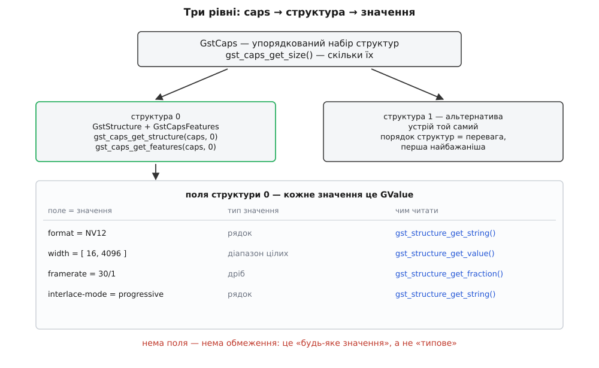
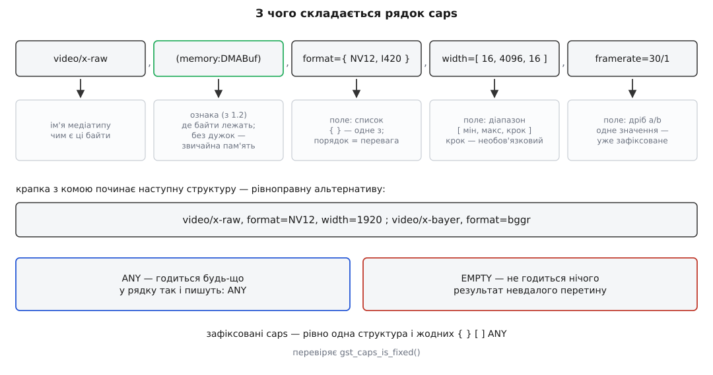

# 📋 Синтаксис caps і робота з ними з коду

Це повний контракт того запису, яким GStreamer описує формат: граматика рядка caps з усіма типами значень — і ті самі поняття як об'єкти C-API, з сигнатурами, правилами володіння й межами версій. Сюди зазирають, коли треба точно знати, що означає кожна дужка в `video/x-raw(memory:DMABuf), format={ NV12, I420 }, width=[ 16, 4096, 16 ]`, якою функцією це прочитати з коду й чому виклик `gst_structure_get_int()` раптом повертає `FALSE`.

## Три рівні: caps → структура → значення

Рядок і об'єкт — це одне й те саме, записане двома способами. Розбирати треба однаково, тож почнімо з рівнів, бо кожна функція API працює рівно на одному з них.

| Рівень | Тип | Що це | Скільки |
|---|---|---|---|
| набір | `GstCaps` | упорядкований набір альтернатив; окремі стани ANY і EMPTY | 0…n структур |
| альтернатива | `GstStructure` + `GstCapsFeatures` | ім'я медіатипу, іменовані поля й набір ознак | 1 набір ознак на структуру |
| значення поля | `GValue` | одне значення **або** множина значень | 1 на поле |



*Функції API розкладені по рівнях: `gst_caps_*` працюють із набором, `gst_structure_*` — з полями однієї структури, `gst_value_*` — з окремим значенням.*

Ознаки живуть **поруч** зі структурою, а не всередині неї: `gst_caps_get_structure(caps, 0)` і `gst_caps_get_features(caps, 0)` дістають дві різні половини однієї альтернативи. Саме тому структура з однаковими полями, але іншими ознаками — це інша альтернатива.

## Граматика рядка

```
caps       := "ANY" | "EMPTY" | структура { ";" структура }
структура  := медіатип [ "(" ознаки ")" ] { "," поле }
ознаки     := "ANY" | ознака { "," ознака }
ознака     := "memory:" ім'я | "meta:" ім'я
поле       := ім'я "=" [ "(" тип ")" ] значення
значення   := одне
            | "{" одне { "," одне } "}"          — список: одне з
            | "<" одне { "," одне } ">"          — масив: усі, у цьому порядку
            | "[" межа "," межа [ "," крок ] "]" — діапазон
медіатип   := буква { буква | цифра | "/" | "-" | "_" | "." | ":" }
```



*Кожна дужка означає різне: круглі після імені — ознаки, фігурні — «одне зі списку», квадратні — діапазон, кутові — масив.*

Три речі, що збивають найчастіше. Крапка з комою розділяє **структури**, а не caps: `A; B` — це одні caps із двох альтернатив, і порядок у них — це порядок переваги. `{ }` і `< >` не синоніми: список — це вибір «або-або», масив — це один складений об'єкт, у якому важать і порядок, і повтори (так записують, наприклад, `streamheader`). Третє число в квадратних дужках — це крок: `width=[ 16, 4096, 16 ]` означає «кратне шістнадцяти», а не «три значення».

## Типи значень

| Тип | Каст | Приклад | Що варто знати |
|---|---|---|---|
| ціле | `(int)`, `(i)`, `(uint)` | `channels=2` | 32 біти; `(gint64)`, `(guint64)` — для 64-бітних |
| дійсне | `(double)`, `(float)`, `(f)` | `quality=(double)0.9` | роздільник — крапка |
| булеве | `(boolean)`, `(bool)`, `(b)` | `interlaced=false` | `true`/`false`, `1`/`0`, регістр не важить |
| рядок | `(string)`, `(str)`, `(s)` | `format=NV12` | у лапках, якщо є пробіли, коми чи дужки |
| дріб | `(fraction)` | `framerate=30/1` | два цілих; `0/1` — домовлене «частота змінна» |
| бітова маска | `(bitmask)` | `channel-mask=(bitmask)0x03` | 64 біти, шістнадцятково; так позначають розкладку каналів звуку |
| набір прапорців | назва типу | `multiview-flags=(GstVideoMultiviewFlagsSet)0:ffffffff:` | форма `значення:маска:прізвиська`; маска каже, **які біти взагалі важать** |
| вкладена структура | `(structure)` | `stats=(structure)"info, rtt=(guint64)12"` | до 1.20 — лише один рівень углиб |
| вкладені caps | `(caps)` | `caps=(caps)"video/x-raw, format=NV12"` | те саме обмеження |

Каст перед значенням не обов'язковий: тип угадують за формою запису. Ціле число — `int`, число з крапкою — `double`, `a/b` — дріб, `true`/`false` — булеве, а все, що не розпізналося, стає рядком. Каст потрібен рівно тоді, коли форма бреше: рядок, схожий на число (`profile=(string)4`), бітова маска, 64-бітне ціле. Зворотний бік цього правила — найдорожча одруківка в GStreamer: `framerate=30` створює поле типу `int`, і воно **не перетнеться** з `framerate=30/1` типу `fraction`. Різні типи не мають спільних значень, тож перетин порожній, а конвеєр стає з `not-negotiated`.

Назви форматів у полі `format` — це не позначки, а розкладка байтів у пам'яті: скільки площин, який крок рядка, як проріджено кольоровість; розібрано у [форматах пікселів](topic:sf-visual/pixel-formats). Частота ж завжди дріб, бо 30000/1001 не є цілим — див. [роздільність і кадри](topic:com-signal/resolution-framerate).

## Ознаки

Ознаки з'явилися у версії 1.2. Вони описують не значення байтів, а вимоги до того, **де** ці байти лежать і що до них додано.

| Запис | Значення |
|---|---|
| без дужок | еквівалент `memory:SystemMemory` — звичайна пам'ять процесора |
| `(memory:DMABuf)` | пам'ять передається дескриптором dmabuf |
| `(memory:GLMemory)`, `(memory:D3D11Memory)` | текстура графічного процесора |
| `(memory:NVMM)`, `(memory:VASurface)`, `(memory:VAMemory)` | пам'ять конкретного апаратного стека |
| `(meta:GstVideoOverlayComposition)` | накладання йде окремими даними, не вмальоване в пікселі |
| `(ANY)` | «будь-яка ознака годиться» — так позначають елементи, що не торкаються самої пам'яті |

Дві властивості мають наслідки. Різні набори ознак роблять структури несумісними навіть за посимвольно однакових полів — саме через це ламається апаратний шлях, коли між елементами вставляють зайвий перетворювач ([апаратне декодування](topic:sys-media/hardware-decode-elements) добирають, дивлячись на ознаки з обох боків). І ознаки `ANY` роблять caps **незафіксованими**: доки ознаку не обрано, формат не визначено, хоч би всі поля мали по одному значенню.

| Функція | Дія |
|---|---|
| `GstCapsFeatures *gst_caps_get_features (const GstCaps *caps, guint index)` | ознаки структури `index`; `NULL` — типові |
| `void gst_caps_set_features (GstCaps *caps, guint index, GstCapsFeatures *f)` | поставити ознаки одній структурі (1.2) |
| `void gst_caps_set_features_simple (GstCaps *caps, GstCapsFeatures *f)` | те саме всім структурам (1.16) |
| `GstCapsFeatures *gst_caps_features_from_string (const gchar *features)` | розібрати `"memory:DMABuf"` |
| `gboolean gst_caps_features_is_any (const GstCapsFeatures *f)` | чи це `ANY` |
| `gboolean gst_caps_features_contains (const GstCapsFeatures *f, const gchar *feature)` | чи є конкретна ознака |

## GstCaps: побудова, перевірка, дії

`GstCaps` — об'єкт із лічильником посилань, тому в таблиці колонка про володіння важить не менше за саму дію. «Забирає» означає, що функція з'їдає передане посилання й повертає нове; передавати їй чужі caps без `gst_caps_ref()` не можна.

| Сигнатура | Дія | Володіння |
|---|---|---|
| `GstCaps *gst_caps_from_string (const gchar *string)` | розібрати рядок; `NULL`, якщо не розібрався | нове посилання |
| `GstCaps *gst_caps_new_simple (const char *media_type, const char *field, ...)` | одна структура з трійок `ім'я, GType, значення`, кінець — `NULL` | нове посилання |
| `GstCaps *gst_caps_new_empty_simple (const char *media_type)` | одна структура без полів | нове посилання |
| `GstCaps *gst_caps_new_empty (void)` / `gst_caps_new_any (void)` | EMPTY / ANY | нове посилання |
| `gchar *gst_caps_to_string (const GstCaps *caps)` | у рядок; звільняти `g_free()` | — |
| `gchar *gst_caps_serialize (const GstCaps *caps, GstSerializeFlags flags)` | те саме з керуванням вкладенням (1.20) | — |
| `guint gst_caps_get_size (const GstCaps *caps)` | скільки структур | — |
| `GstStructure *gst_caps_get_structure (const GstCaps *caps, guint index)` | структура за номером | **не ваша**; міняти лише в writable caps |
| `void gst_caps_set_simple (GstCaps *caps, const char *field, ...)` | дописати поля в **усі** структури | потрібні writable caps |
| `GstCaps *gst_caps_intersect (const GstCaps *a, const GstCaps *b)` | перетин, режим ZIG_ZAG | нове посилання |
| `GstCaps *gst_caps_intersect_full (const GstCaps *a, const GstCaps *b, GstCapsIntersectMode mode)` | перетин із явним режимом | нове посилання |
| `gboolean gst_caps_can_intersect (const GstCaps *a, const GstCaps *b)` | чи перетин непорожній — **без** побудови результату | — |
| `gboolean gst_caps_is_subset (const GstCaps *subset, const GstCaps *superset)` | чи всі формати першого є в другому | — |
| `gboolean gst_caps_is_subset_structure (const GstCaps *caps, const GstStructure *s)` | те саме для однієї структури | — |
| `gboolean gst_caps_is_always_compatible (const GstCaps *a, const GstCaps *b)` | синонім «`a` ⊆ `b`» | — |
| `gboolean gst_caps_is_fixed (const GstCaps *caps)` | рівно одна структура й жодних множин | — |
| `gboolean gst_caps_is_any / gst_caps_is_empty (const GstCaps *caps)` | крайні стани | — |
| `GstCaps *gst_caps_fixate (GstCaps *caps)` | звести до одного формату | **забирає** посилання |
| `GstCaps *gst_caps_truncate (GstCaps *caps)` | лишити першу структуру | **забирає** |
| `GstCaps *gst_caps_normalize (GstCaps *caps)` | розкласти списки на окремі структури | **забирає** |
| `GstCaps *gst_caps_simplify (GstCaps *caps)` | злити однакові структури назад | **забирає** |
| `GstCaps *gst_caps_subtract (const GstCaps *a, const GstCaps *b)` | різниця множин | нове посилання |
| `GstCaps *gst_caps_merge (GstCaps *a, GstCaps *b)` | додати структури `b`, яких ще немає | **забирає обидва** |
| `void gst_caps_append (GstCaps *a, GstCaps *b)` | додати всі структури `b` без перевірки | **забирає** `b` |

Дві пастки з цієї таблиці. Списки у варіативні функції не передаються: `gst_caps_new_simple()` уміє `GST_TYPE_INT_RANGE` (два цілих) і `GST_TYPE_FRACTION` (два цілих), але для `{ NV12, I420 }` доведеться зібрати `GValue` через `gst_value_list_append_value()` і поставити його `gst_structure_set_value()`. І `gst_caps_get_structure()` віддає внутрішній вказівник — писати в нього можна лише після `gst_caps_make_writable()`, інакше ви мовчки правите caps, які вже комусь належать.

## GstStructure: читання полів

| Сигнатура | Повертає |
|---|---|
| `const gchar *gst_structure_get_name (const GstStructure *s)` | ім'я медіатипу |
| `gboolean gst_structure_has_name (const GstStructure *s, const gchar *name)` | збіг імені |
| `gboolean gst_structure_get_int (const GstStructure *s, const gchar *f, gint *v)` | `FALSE`, якщо поля нема **або** воно не ціле |
| `gboolean gst_structure_get_uint / _get_double / _get_boolean (…)` | те саме для інших типів |
| `const gchar *gst_structure_get_string (const GstStructure *s, const gchar *f)` | вказівник у структуру; **не звільняти**, `NULL` — нема |
| `gboolean gst_structure_get_fraction (const GstStructure *s, const gchar *f, gint *num, gint *den)` | чисельник і знаменник окремо |
| `const GValue *gst_structure_get_value (const GstStructure *s, const gchar *f)` | єдиний спосіб дістати діапазон або список |
| `gboolean gst_structure_get (const GstStructure *s, const char *first, ...)` | кілька полів за раз: трійки `ім'я, GType, вказівник`, кінець `NULL` |
| `gboolean gst_structure_has_field (const GstStructure *s, const gchar *f)` | чи поле взагалі є |
| `gboolean gst_structure_has_field_typed (const GstStructure *s, const gchar *f, GType t)` | є **і** саме такого типу |
| `gint gst_structure_n_fields (const GstStructure *s)` | скільки полів |
| `const gchar *gst_structure_nth_field_name (const GstStructure *s, guint i)` | ім'я поля за номером |
| `gboolean gst_structure_foreach (const GstStructure *s, GstStructureForeachFunc fn, gpointer u)` | обхід усіх полів |
| `void gst_structure_set (GstStructure *s, const gchar *f, ...)` | записати поля |

Найчастіша помилка на цьому рівні одна, і виглядає вона як «функція бреше»: `gst_structure_get_int (s, "width", &w)` повертає `FALSE` не тільки коли поля нема, а й коли воно є, але лишається діапазоном. Типізований геттер працює тільки з **зафіксованими** caps. Порядок дій завжди такий: `gst_caps_is_fixed()` → і аж тоді геттери; на незафіксованих caps лишається `gst_structure_get_value()` та `gst_value_*`.

> 🔧 **Навіщо це.** `gst_structure_has_field()` — не косметика, а спосіб не помилитися в основному правилі перетину: відсутнє поле не означає «типове значення», воно означає «будь-яке». Перевіряючи, чи прийшло поле, ви відрізняєте «сусід вимагає 1280» від «сусіду байдуже» — а це протилежні ситуації, які типізований геттер однаково віддає як `FALSE`.

## Перетин: два режими

```
                   caps1
              ┌──────────────
              │  1   2   4   7
       caps2  │  3   5   8  10
              │  6   9  11  12
```

Числа — порядок, у якому перебирають пари структур; результат складається в цьому ж порядку.

**`GST_CAPS_INTERSECT_ZIG_ZAG`** — типовий режим (його вживає `gst_caps_intersect()`). Обхід по діагоналях чергує переваги обох сторін, тому жодна не має пріоритету. Беруть тоді, коли явної переваги немає.

**`GST_CAPS_INTERSECT_FIRST`** — результат тримає порядок **першого** аргументу. Для `caps1 = [A, B, C]` і `caps2 = [E, B, D, A]` виходить `[A, B]`: спершу `A`, бо в `caps1` він перший. Беруть тоді, коли треба зберегти чужу перевагу — тоді чужі caps ставлять першим аргументом.

Різниця не косметична: порядок структур у результаті — це те, з чого фіксація візьме першу-ліпшу. Обравши не той режим, ви віддаєте вибір формату не тій стороні.

## Фіксація

`gst_caps_fixate()` робить дві дії поспіль: `gst_caps_truncate()` (лишити першу структуру) і `gst_structure_fixate()` для решти. Типове правило для кожного значення просте до грубості:

| Що в полі | Що лишиться |
|---|---|
| діапазон `[ a, b ]` | перший елемент, тобто **нижня межа** |
| список `{ a, b }` | перший елемент |
| масив `< a, b >` | кожен елемент фіксується окремо |
| одне значення | без змін |

Груба вона свідомо: загальний код не знає, що краще для конкретного елемента, тому серйозні елементи фіксацію перевизначають. Скерувати її з коду можна двома функціями — вони ставлять полю значення, найближче до бажаного **в межах наявного обмеження**:

```c
gboolean gst_structure_fixate_field_nearest_int      (GstStructure *s, const char *field, int target);
gboolean gst_structure_fixate_field_nearest_fraction (GstStructure *s, const char *field, gint num, gint den);
```

## Мінімальний робочий виклик

Дві сторони, перетин, фіксація й читання результату — увесь цикл, який елемент проводить перед першим буфером.

:::tabs
```c
#include <gst/gst.h>

int
main (int argc, char **argv)
{
  gst_init (&argc, &argv);

  /* що вміє віддати джерело */
  GstCaps *src = gst_caps_from_string (
      "video/x-raw, format={ NV12, YUY2 }, width=[ 320, 1920 ], "
      "height=[ 240, 1080 ], framerate=[ 1/1, 60/1 ]");

  /* що приймає кодер; поля framerate НЕМА навмисно — йому байдуже */
  GstCaps *sink = gst_caps_new_simple ("video/x-raw",
      "format", G_TYPE_STRING, "NV12",
      "width",  GST_TYPE_INT_RANGE, 16, 4096,
      "height", GST_TYPE_INT_RANGE, 16, 4096,
      NULL);

  /* перевагу лишаємо за джерелом — тому воно перший аргумент */
  GstCaps *both = gst_caps_intersect_full (src, sink, GST_CAPS_INTERSECT_FIRST);
  if (gst_caps_is_empty (both)) {
    g_printerr ("спільного формату немає — тут і виникає not-negotiated\n");
    return 1;
  }

  gchar *s = gst_caps_to_string (both);
  g_print ("перетин: %s\n", s);          /* усе ще множина */
  g_free (s);

  /* fixate забирає посилання, тому даємо йому власне: caps скопіюються */
  GstCaps *fixed = gst_caps_fixate (gst_caps_ref (both));
  g_assert (gst_caps_is_fixed (fixed));

  const GstStructure *st = gst_caps_get_structure (fixed, 0);
  const gchar *fmt = gst_structure_get_string (st, "format");
  gint w = 0, h = 0, num = 0, den = 1;
  gst_structure_get_int (st, "width", &w);
  gst_structure_get_int (st, "height", &h);
  gst_structure_get_fraction (st, "framerate", &num, &den);
  g_print ("обрано: %s %dx%d @ %d/%d\n", fmt, w, h, num, den);

  gst_caps_unref (fixed);
  gst_caps_unref (both);
  gst_caps_unref (sink);
  gst_caps_unref (src);
  return 0;
}
```
```py
import gi
gi.require_version("Gst", "1.0")
from gi.repository import Gst

Gst.init(None)

# у Python немає new_simple (варіативні функції не інтроспектуються) —
# caps будують з рядка або через new_empty_simple + set_value
src = Gst.Caps.from_string(
    "video/x-raw, format={ NV12, YUY2 }, width=[ 320, 1920 ], "
    "height=[ 240, 1080 ], framerate=[ 1/1, 60/1 ]")
sink = Gst.Caps.from_string(
    "video/x-raw, format=NV12, width=[ 16, 4096 ], height=[ 16, 4096 ]")

both = src.intersect_full(sink, Gst.CapsIntersectMode.FIRST)
if both.is_empty():
    raise SystemExit("спільного формату немає — тут і виникає not-negotiated")

print("перетин:", both.to_string())

fixed = both.copy().fixate()        # copy(), бо fixate забирає посилання
assert fixed.is_fixed()

st = fixed.get_structure(0)
ok_w, w = st.get_int("width")       # геттери віддають пару (успіх, значення)
ok_h, h = st.get_int("height")
ok_f, num, den = st.get_fraction("framerate")
print("обрано: %s %dx%d @ %d/%d" % (st.get_string("format"), w, h, num, den))
```
:::

Вивід варто прочитати уважно — він показує, чого коштує покластися на типову фіксацію:

```
перетин: video/x-raw, format=(string)NV12, width=(int)[ 320, 1920 ],
         height=(int)[ 240, 1080 ], framerate=(fraction)[ 1/1, 60/1 ]
обрано: NV12 320x240 @ 1/1
```

Перетин лишив розмір і частоту діапазонами, і типове правило взяло **нижні межі**: 320×240 при одному кадрі на секунду. Формально це чесний результат переговорів, практично — не те, чого хотіли. Щоб дістати інше, бажані значення називають до фіксації:

```c
GstCaps *want = gst_caps_make_writable (gst_caps_ref (both));
GstStructure *s = gst_caps_get_structure (want, 0);
gst_structure_fixate_field_nearest_int (s, "width", 1280);
gst_structure_fixate_field_nearest_int (s, "height", 720);
gst_structure_fixate_field_nearest_fraction (s, "framerate", 30, 1);
want = gst_caps_fixate (want);      /* решту полів добере типове правило */
```

Кожен виклик обмежений тим, що вже є в caps: попросивши 4096 там, де діапазон закінчується на 1920, ви дістанете 1920, а не помилку.

> 🔧 **Навіщо це.** Друкувати caps у журналі не треба вручну: GStreamer має свій специфікатор формату. `GST_DEBUG_OBJECT (self, "домовились: %" GST_PTR_FORMAT, caps);` виведе caps, структуру, буфер чи подію в тому самому рядковому вигляді — і, на відміну від `gst_caps_to_string()`, нічого не доведеться звільняти.

## Як читати вивід `gst-inspect-1.0`

Утиліта показує **шаблони** падів — те, що елемент уміє взагалі, як записано в його коді й збережено в [реєстрі](topic:sys-media/plugin-model). Це не те саме, що елемент відповість під час роботи: реальна відповідь майже завжди вужча.

```
Pad Templates:
  SINK template: 'sink'
    Availability: Always
    Capabilities:
      video/x-raw
                 format: { (string)I420, (string)NV12, (string)YUY2 }
                  width: [ 1, 32768 ]
                 height: [ 1, 32768 ]
              framerate: [ 0/1, 2147483647/1 ]
      video/x-raw(memory:DMABuf)
                 format: { (string)NV12 }
                  width: [ 1, 32768 ]
                 height: [ 1, 32768 ]
```

| Що в рядку | Як читати |
|---|---|
| `SINK` / `SRC template` | напрямок пада: `sink` приймає, `src` віддає |
| ім'я в лапках | ім'я шаблона; за ним просять пад у `gst_element_request_pad_simple()` (до 1.20 — `gst_element_get_request_pad()`) |
| `Availability: Always` | пад є завжди |
| `Availability: Sometimes` | з'явиться пізніше, коли елемент розбере потік — з'єднувати треба за сигналом `pad-added` |
| `Availability: On request` | створюється на замовлення (`tee`, мультиплексори) |
| кожен блок з іменем медіатипу | окрема структура; порядок блоків — порядок переваги |
| `(memory:DMABuf)` після імені | ознака; блок без дужок і блок із дужками — **різні** альтернативи |
| `(ANY)` після імені | будь-яка ознака годиться |
| `(string)` перед значеннями | утиліта завжди друкує касти, навіть де вони не потрібні |

Три команди покривають майже всю діагностику формату: `gst-inspect-1.0 <елемент>` — шаблони; `gst-launch-1.0 -v …` — **фактично узгоджені** caps кожної зв'язки в момент переговорів; `GST_DEBUG=GST_CAPS:5` — журнал самих переговорів, коли треба побачити, який саме перетин виявився порожнім.

## Caps у рядку конвеєра

Фрагмент рядка, що виглядає як налаштування, — це елемент `capsfilter` із єдиною властивістю `caps`:

```
gst-launch-1.0 v4l2src ! video/x-raw,format=NV12,width=1280 ! videoconvert ! autovideosink
                        └─── те саме, що: capsfilter caps="video/x-raw,format=NV12,width=1280"
```

Він нічого не перетворює — лише звужує множину, яка крізь нього проходить, і робить це в обидва боки. Решта граматики рядка-конвеєра — властивості, дужки, іменовані пади, два рівні лапок — зібрана окремо: [мова рядка-конвеєра](topic:sys-media/pipeline-model/api-gst-launch-syntax.md). Тут лишається те, що стосується саме caps.

| Що пишуть | Що виходить насправді |
|---|---|
| `width=1280` без `videoscale` | вимога до джерела вміти 1280, а не масштабування |
| `framerate=30` | поле типу `int`; із `framerate=30/1` не перетнеться |
| усі поля «щоб напевно» | конвеєр, прив'язаний до однієї конкретної камери |
| `'video/x-raw(memory:DMABuf)'` | дужки й фігурні дужки з'їдає оболонка — потрібні одинарні лапки |
| `"video/x-raw;video/x-bayer"` | дві альтернативи в одному фільтрі; `;` теж треба сховати від оболонки |
| `format=(string)NV12` | те саме, що `format=NV12` — каст тут зайвий |

Головне правило зворотне до звички: часткові caps не просто дозволені, вони бажані. Називайте ті кілька полів, які справді важать, і лишайте решту переговорам.

## Межа версій: вкладені структури до 1.20

До версії 1.20 рядкова серіалізація підтримувала лише **один рівень** вкладення. Структура з полем типу `(structure)` ще записувалася й читалася назад, а глибше починалися несподіванки: `gst_caps_to_string()` віддавав рядок, який `gst_caps_from_string()` уже не розбирав у той самий об'єкт. Мовчки — без помилки, просто з іншим результатом.

У 1.20 з'явилися `gst_caps_serialize (caps, flags)` і `gst_structure_serialize (s, flags)`, які роблять вкладення правильно на будь-яку глибину. Плата — сумісність: старий GStreamer їхній вивід не прочитає, доки не передати `GST_SERIALIZE_FLAG_BACKWARD_COMPAT`.

Практичний висновок один: якщо структури вкладені глибше ніж на рівень — не ганяйте їх через рядок узагалі. Передавайте `GstStructure` об'єктом (у повідомленні на шину, у події, у властивості елемента), а рядок лишайте для журналу й для людини. Це стосується не так самих caps — у переговорах формату вкладення рідкість, — як статистики й службових структур, де воно трапляється постійно.
