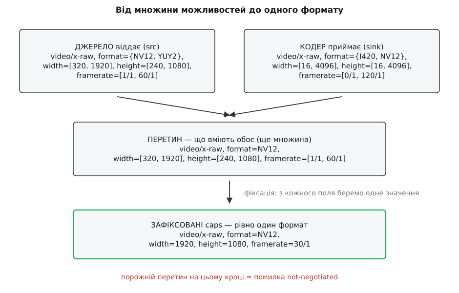
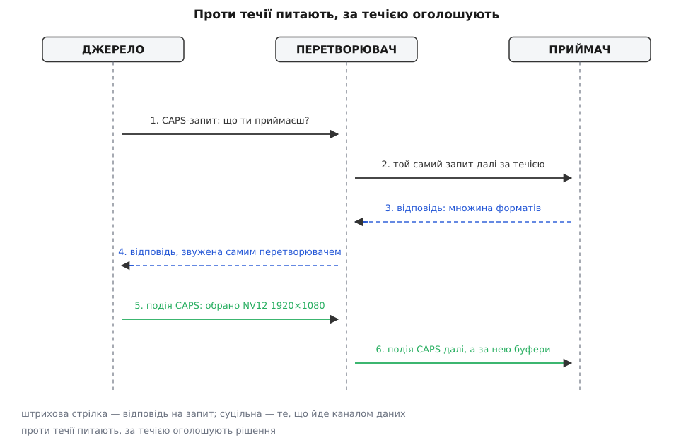
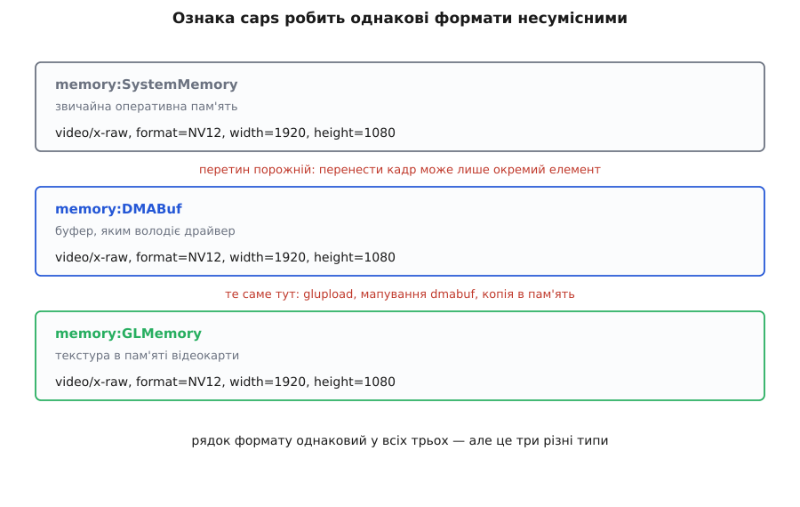

# Узгодження caps: як елементи домовляються про формат

<preknowlist>
- [Конвеєр: елементи, зв'язки й потік даних](root:sys-media/pipeline-model) — з чого складається конвеєр і як дані течуть від джерела до приймача.
- [Пади і з'єднання елементів](root:sys-media/pads-and-linking) — пад як вхід і вихід елемента, різниця між sink- і src-падом, статичні й динамічні пади.
- [Стани конвеєра й переходи між ними](root:sys-media/states-lifecycle) — NULL → READY → PAUSED → PLAYING і момент, коли дані вперше рушають.
- [Формати пікселів і буферів зображення](root:sf-visual/pixel-formats) — що стоїть за назвами NV12, I420, YUY2: площини, крок рядка, колірне субдискретування.
- [Роздільність і кадри](root:com-signal/resolution-framerate) — роздільність і частота кадрів як дріб, а не як число.
</preknowlist>

Рядок `v4l2src ! videoconvert ! autovideosink` запускає камеру на екран. У ньому не сказано ні роздільності, ні частоти кадрів, ні того, чи піде кадр як NV12, YUY2 чи MJPEG. Проте кадр іде — і йде в якомусь одному конкретному форматі, бо іншого способу передати байти немає. Хтось цей формат обрав. І той самий невидимий механізм, що обирає його сам, за мить розвалить конвеєр повідомленням `not-negotiated`, якщо дописати в рядок одне зайве число.

Це і є узгодження caps — та частина GStreamer, яка найдовше лишається чорною скринькою і найчастіше псує вечір.

## Чому формат неможливо просто вписати

Елемент конвеєра компілюють окремо від усіх інших. `x264enc` нічого не знає про камери, `v4l2src` — про кодери. Коли їх ставлять поруч, з'ясовується прикре: камера вміє віддавати десяток комбінацій формату, розміру й частоти, кодер приймає свій набір, а між ними ще є приймач із власними вимогами. Хтось мусить звести це до одного рішення на кожну зв'язку — бо буфер із пікселями не буває «взагалі кадром», він завжди має конкретну розкладку в пам'яті.

Перший напрошений вихід — вписати формат руками в опис конвеєра — не працює навіть у простих випадках. Роздільності файлу ви не знаєте, доки не відкриєте й не розберете його заголовок. Набір форматів камери залежить від моделі, драйвера й того, що зараз вільно. Опис конвеєра пишуть заздалегідь, а відповідь існує тільки під час запуску.

Другий вихід — домовитися раз і назавжди про один універсальний формат, у який усі перетворюють на вході й з якого перетворюють на виході — коштує занадто дорого. Перетворення кольору для кадру 1920×1080 — це кілька мільйонів операцій, і його довелося б робити двічі на кожній зв'язці, навіть коли сусіди вже говорять однією мовою. Гірше того: апаратний декодер віддає кадр у пам'яті відеокарти, і «універсальний формат» означав би обов'язкове перетягування цього кадру в оперативну пам'ять і назад — саме те, чого апаратний шлях мав уникнути.

Лишається третій шлях, єдиний робочий: сусіди домовляються самі, під час запуску, знаючи одне про одного рівно те, що встигли спитати. Це переговори — і як у будь-яких переговорах, тут є мова, якою висловлюють позицію, порядок ходів і спосіб зафіксувати результат.

## Формат — це не один формат, а множина

Мова переговорів називається caps (англ. capabilities — можливості), і назва точна: це опис не одного формату, а всіх, які сторона згодна прийняти або здатна віддати.

Цеглина такого опису — структура: ім'я медіатипу (`video/x-raw`, `audio/x-raw`, `video/x-h264`) плюс іменовані поля з типізованими значеннями. Ключова властивість — значення поля не зобов'язане бути одним значенням. Воно може бути діапазоном `[16, 4096]`, списком `{ NV12, I420 }`, дробом `30/1` або діапазоном дробів. А самі caps — це впорядкований набір структур, тобто об'єднання: «або таке, або таке».

```
video/x-raw, format={ NV12, YUY2 }, width=[320, 1920], height=[240, 1080], framerate=[1/1, 60/1]
```

Це один рядок і мільйони форматів одночасно. Два крайні випадки мають власні назви: ANY — «годиться будь-що» (так відповідає, наприклад, пад, який просто пише байти у файл і не дивиться всередину), і EMPTY — «не годиться нічого». EMPTY майже ніколи не пишуть руками: він виникає сам як результат невдалого перетину, і саме він потім стає помилкою.

Протилежність множині — зафіксовані caps: рівно одна структура, і кожне поле в ній має рівно одне значення, без діапазонів і списків. Тільки такі caps можна оголосити форматом зв'язки, бо тільки за ними можна виділити буфер потрібного розміру й розкласти в ньому пікселі.

Звідси вся суть узгодження в одному реченні: **взяти перетин того, що вміють обидві сторони, і, якщо він не порожній, вибрати в ньому одну точку.**



*Джерело й кодер описують множини; перетин лишається множиною; фіксація зводить її до єдиного формату, з яким уже можна працювати.*

Точна граматика цього запису — які бувають типи полів, як пишуть бітові маски й масиви, чим `1920` відрізняється від `(int)1920` і як цей самий рядок виглядає в коді через `GstStructure` — зібрана окремо: [синтаксис caps і що з ними можна робити з коду](root:sys-media/caps-negotiation/api-caps-syntax.md). Для розуміння переговорів достатньо трьох речей: структура, поле-множина, зафіксованість.

## Що елемент обіцяє і що він може насправді

У кожного пада є шаблон — статичний опис caps, вписаний у код плагіна й збережений у реєстрі елементів, звідки його читає [`gst-inspect-1.0`](root:sys-media/plugin-model). Шаблон відповідає на запитання «що цей елемент здатен робити взагалі, за будь-яких обставин».

Але переговори ведуться не про «взагалі». Реальна відповідь елемента на запит про формати обчислюється під час роботи й майже завжди вужча за шаблон. `v4l2src` перепитує драйвер і повертає те, що вміє саме ця камера. Розбирач H.264, який уже прочитав заголовок послідовності, знає точну роздільність і повертає одне число замість діапазону. `videoscale` взагалі не має власної думки про розмір — його відповідь залежить від того, що попросять далі за течією.

Ця різниця між обіцянкою й дійсністю пояснює, чому конвеєр падає у два різні моменти з двома різними повідомленнями. `could not link` виникає одразу, під час складання графа: перетнули статичні шаблони сусідів — порожньо, з'єднувати нема сенсу, і про це видно ще до першого байта. А `not-negotiated` приходить пізніше, коли дані вже мали б рушити: шаблони перетиналися, а дійсні можливості — ні. Перше — помилка в описі конвеєра, друге — помилка в припущенні про залізо чи потік.

На тому самому механізмі стоїть автодобір елементів: коли `decodebin` бачить потік `video/x-h264` і мусить знайти, чим його декодувати, він перебирає реєстр і шукає елементи, чий шаблон sink-пада перетинається з наявними caps — [автодобір елементів за caps](root:sys-media/autoplug-decodebin) не має жодного окремого знання про кодеки, він працює тією самою алгеброю множин.

## Проти течії питають, за течією оголошують

Порядок ходів у переговорах несиметричний, і формулюють його так: за течією підказують формати, проти течії — вирішують. Тобто споживач лише повідомляє, що готовий прийняти, а обирає виробник.

Асиметрія тут не умовність, а необхідність. Буфер фізично створює той, хто його віддає: він виділяє пам'ять і заповнює пікселі. Змусити його зробити те, чого він не вміє, неможливо — камеру не переконаєш видати I420, якщо сенсор і драйвер дають YUY2. А от обмежити його вибір цілком реально: споживач публікує свої вимоги, і виробник обирає точку всередині них. Якби вирішував споживач, він раз у раз називав би формат, якого виробник не здатен зробити, і переговори закінчувалися б відмовою там, де насправді була згода.

Для цих ходів потрібні три різні дії, і кожна з них існує через свою окрему причину.

Перше — запитати сусіда за течією, що він приймає, і отримати відповідь. Питання йде проти течії даних, ще до самих даних, і потребує саме відповіді, а не просто повідомлення. Такий хід у GStreamer називається запитом CAPS. До нього можна додати фільтр — власні caps того, хто питає, — щоб сусід одразу відсіяв заздалегідь непотрібне й не витрачав час на побудову величезної множини.

Друге — перевірити одну конкретну гіпотезу: «а саме цей зафіксований формат піде?». Повна відповідь на запит CAPS буває дорогою: елемент може мусити опитати драйвер або перебрати десятки комбінацій. Коли потрібно лише «так» чи «ні» про один формат, для цього є окремий, дешевий запит ACCEPT_CAPS. Він працює тільки з зафіксованими caps — питання «чи приймеш ти щось із цієї множини» не має однозначного сенсу.

Третє — оголосити рішення. Оголошення мусить прийти рівно між останнім буфером старого формату й першим буфером нового: якщо приймач дізнається про зміну хоч на кадр пізніше, він розкладе нові байти за старою розкладкою й видасть кашу на екран. Викликом функції такого порядку не гарантувати, бо виклик іде повз канал даних. Тому рішення оформлюють подією CAPS і пускають нею самою, тим самим каналом, що й буфери — і порядок стає точним за побудовою.

У події CAPS є ще одна властивість, яку легко проґавити: вона липка. Пад запам'ятовує останню таку подію, і той, хто під'єднається пізніше — нова гілка `tee`, пад, доданий `decodebin` посеред роботи, — миттєво отримує чинний формат, нічого не питаючи. Саме тому динамічні конвеєри взагалі складаються: новоприбулий не потрапляє в потік «без документів».



*Питання й відповіді рухаються проти течії даних; рішення й буфери — за течією, і в тому самому каналі, тому їхній взаємний порядок точний.*

Складене докупи, це виглядає так. Елемент, який зібрався віддати перший буфер, питає сусіда за течією про його caps, підставивши фільтром власний шаблон. Отриману множину він перетинає зі своїми дійсними можливостями. Перетин фіксує до одного формату. За потреби перепитує ACCEPT_CAPS, щоб не помилитися. Пускає подію CAPS. І аж тоді штовхає буфер.

Якщо на будь-якому кроці згоди немає, функція, що приймає буфер, повертає `GST_FLOW_NOT_NEGOTIATED`. Це значення повертається далі проти течії від елемента до елемента, потік зупиняється, і на шину лягає знайоме `streaming stopped, reason not-negotiated`.

> 🔧 **Навіщо це.** Повідомлення `not-negotiated` не показує, де саме порвалося: воно приходить від елемента, який першим не зміг віддати буфер, а винним буває сусід через двох. Знаючи порядок ходів, шукають інакше — дивляться, на якій зв'язці ще є узгоджені caps, а на якій уже немає. `gst-launch-1.0 -v` друкує caps кожної зв'язки в момент узгодження, і остання надрукована зв'язка — це та, після якої переговори не пішли.

## Перетин і фіксація: де ховається свавілля

Перетин двох caps — чесна алгебра множин, і в ній немає нічого таємничого. Структури з різними іменами не перетинаються ніяк: `video/x-raw` і `video/x-h264` — просто різні речі. Структури з однаковим іменем перетинають поле за полем: значення проти діапазону, діапазон проти діапазону, список проти списку. Порожній результат хоч в одному полі робить порожньою всю структуру.

Одна деталь тут регулярно збиває з пантелику: **відсутнє поле — це не обмеження, а його відсутність**. Структура `video/x-raw, format=NV12` без `width` означає «будь-яка ширина», і перетин із `video/x-raw, format=NV12, width=1280` дасть `width=1280`. Звідси практичний висновок, який рятує більше конвеєрів, ніж будь-що інше: пишіть у фільтрах рівно ті поля, які вам справді потрібні. Кожне зайве поле — це обмеження, яке комусь доведеться задовольнити.

Порядок структур усередині caps теж значущий: це порядок переваги, від найбажанішого до найменш бажаного. Тому елемент, який уміє і NV12, і I420, але швидше працює з NV12, ставить його першим — і це не косметика, а вказівка для фіксації. Коли перетинають два впорядковані набори, чиї переваги мають вижити, стає окремим рішенням: типовий перетин чергує структури обох сторін, зберігаючи розумний компроміс, а режим `GST_CAPS_INTERSECT_FIRST` тримає порядок першої сторони й тим самим віддає їй перевагу.

Фіксація — крок, де множина стає точкою, і саме тут ховається все свавілля системи. Типова фіксація груба: лишити першу структуру, відкинувши решту, а тоді в кожному полі взяти перший елемент списку або розумне значення з діапазону. Груба вона навмисно — бо жодний загальний код не знає, що краще для конкретного елемента.

Тому кожен серйозний елемент фіксацію перевизначає, і майже завжди за одним правилом: **тотожність дешевша за перетворення**. `videoscale`, маючи на вході 1280×720 і діапазон на виході, обере 1280×720 — не тому, що це «правильний» розмір, а тому, що тоді масштабувати не доведеться взагалі. `videoconvert` так само тримається вхідного формату, поки його не змусять змінити.

**Приклад: камера й кодер сходяться на одному форматі.** Джерело віддає те, що вміє сенсор; кодер приймає те, що вміє його реалізація; фіксацію робить джерело як виробник буфера.

```
джерело (src):  video/x-raw, format={ NV12, YUY2 }, width=[320, 1920],
                height=[240, 1080], framerate=[1/1, 60/1]
кодер   (sink): video/x-raw, format={ I420, NV12 }, width=[16, 4096],
                height=[16, 4096],  framerate=[0/1, 120/1]

перетин по полях:
  ім'я       video/x-raw ∩ video/x-raw       = video/x-raw
  format     { NV12, YUY2 } ∩ { I420, NV12 } = NV12
  width      [320, 1920] ∩ [16, 4096]        = [320, 1920]
  height     [240, 1080] ∩ [16, 4096]        = [240, 1080]
  framerate  [1/1, 60/1] ∩ [0/1, 120/1]      = [1/1, 60/1]

фіксація (джерело бере верхню межу діапазонів, бо це рідний режим сенсора):
  format=NV12, width=1920, height=1080, framerate=30/1
```

Перетин лишив рівно один формат пікселів — і це не збіг, а типовий випадок: множина форматів у камери й у кодера зазвичай дотикаються в одній-двох точках. Розмір і частота лишилися діапазонами, тож рішення про них ухвалила фіксація джерела, а не якась домовленість. Якби вам потрібні були інші 1280×720, ніхто б їх не вгадав — їх треба вимагати.

> 🔧 **Навіщо це.** Правило «тотожність дешевша» — причина, чому `videoconvert` у рядку конвеєра сам собою нічого не коштує. Якщо сусіди й так зійшлися на спільному форматі, елемент перейде в наскрізний режим і просто пропускатиме буфери повз себе. Платити доведеться лише тоді, коли переговори справді розвели формати по різні боки. Дізнатися, чи ви платите, можна одним поглядом на узгоджені caps обох його падів: однакові — перетворення немає.

## Три способи брати участь у переговорах

За тим, як елемент поводиться в переговорах, усі вони діляться на три роди.

**Формат диктує потік.** Декодер не має вибору: що записано в потоці, те він і віддасть. Роздільність H.264 приходить із заголовка послідовності, і жодні побажання приймача її не змінять. Такий елемент не питає нічого — він оголошує подією CAPS і працює далі. Для цього є навіть окремий режим пада: «мої caps зафіксовані, не турбуйте запитами».

**Формат наскрізний.** `queue`, `identity`, `tee` не мають до формату жодного стосунку: вони передають буфери й нічого в них не міняють. Але «не мати стосунку» тут означає активну роботу — такий елемент мусить переадресовувати запити CAPS в обидва боки, ніби його немає. Елемент, який замість переадресації відповідає власним шаблоном, перетворюється на глуху стіну: сусіди перестають бачити одне одного, і переговори зриваються там, де насправді все сходилося. Це найчастіша помилка в саморобних «прозорих» елементах.

**Формат залежить від того, чого попросять.** `videoscale`, `videoconvert`, `audioresample` вміють багато й обирають за обставинами. Такий елемент відповідає на запит не готовою множиною, а обчисленою: бере caps, які має з одного боку, і перетворює їх на множину можливих caps з іншого — масштабувальник знімає обмеження на ширину й висоту, перетворювач кольору розширює список форматів, лишаючи розмір недоторканим. Потім, коли множина повернеться назад, він її фіксує, тримаючись за тотожність.

Ці дві дії — «перетворити множину» й «зафіксувати» — це два методи, які пишуть, роблячи власний елемент на базі `GstBaseTransform`; решту роботи бібліотека бере на себе. Як вони виглядають у коді, чому в `transform_caps` небезпечно забути про фільтр і як зробити так, щоб елемент сам вимикався в наскрізний режим, розібрано разом із робочим елементом: [власний елемент, який бере участь у переговорах](root:sys-media/caps-negotiation/proj-transform-caps.md).

## Як у переговори втручається людина

Той самий шматок рядка, що виглядає як налаштування:

```
gst-launch-1.0 v4l2src ! video/x-raw,format=NV12,width=1280,height=720 ! x264enc ! ...
```

насправді елемент. Він називається `capsfilter`, і його єдина властивість — caps. Він нічого не перетворює й нічого не вміє: він лише звужує множину, яка через нього проходить. У відповідь на запит із боку джерела він віддасть не те, що приймає кодер, а перетин цього з власними caps. І навпаки, буфер із caps, які не входять у його множину, він не пропустить.

З цього випливають три речі, які варто пам'ятати одразу.

Фільтр не додає перетворення. Рядок `v4l2src ! capsfilter(width=1280) ! ...` не масштабує кадр до 1280 — він вимагає, щоб камера вміла віддати 1280 сама. Не вміє — `not-negotiated`. Щоб масштабувати, потрібен `videoscale`, а фільтр після нього лише каже, до чого масштабувати.

Фільтр працює в обидва боки, і це його сила: він доносить вашу вимогу аж до джерела, крізь усі проміжні елементи, бо вони переадресовують запити.

І найважливіше — часткові caps не просто дозволені, вони бажані. `video/x-raw,format=NV12` без розміру каже рівно те, що потрібно, і лишає решту переговорам. Дописування всіх полів «щоб напевно» — найчастіша причина конвеєрів, які працювали на одному ноутбуку й не працюють на іншому: там просто інша камера з іншими діапазонами.

## Коли формат міняється посеред потоку

Домовленість не вічна. Мережева камера може змінити роздільність на ходу, у файлі трапляється новий заголовок послідовності, користувач посеред роботи змінює властивість елемента, а віконний приймач після зміни розміру вікна хоче інший розмір кадру, щоб не масштабувати самому.

Механізм переузгодження дзеркальний до першого: сторона за течією пускає проти течії подію RECONFIGURE. Вона не несе нового формату — вона лише позначає пади як такі, що потребують нових переговорів. Найближчий елемент проти течії, побачивши позначку перед видачею наступного буфера, повторює звичайний цикл: запит, перетин, фіксація, подія CAPS. І оскільки подія CAPS іде каналом даних, межа виходить точна: усе, що до неї, читається за старими caps, усе, що після — за новими.

Дешевими самі переговори лишаються завжди — це кілька операцій над множинами. Дорогим буває їхній наслідок. Приймач після нових caps зазвичай мусить перебудувати внутрішній стан: кодер — перезапустити кодування з новим ключовим кадром, апаратний декодер — переініціалізувати сесію, будь-хто з власним пулом буферів — заново виділити пам'ять під інший розмір кадру. Тому потік, який переузгоджується часто, помітно смикається, і це один із джерел нерівної [затримки в конвеєрі](root:sys-media/latency-and-buffering).

## Формат — це ще не все: ознаки caps

Найзагадковіша поразка в GStreamer виглядає так: обидва елементи кажуть `video/x-raw, format=NV12, width=1920, height=1080`, а з'єднати їх не вдається. Рядки збігаються посимвольно, перетин мав би бути очевидним — і його немає.

Причина в тому, що опис формату каже, **що означають байти**, але мовчить про те, **де ці байти лежать**. Кадр у звичайній оперативній пам'яті, кадр у буфері, яким володіє драйвер відеокарти, і кадр як текстура в пам'яті графічного процесора — це три різні речі з однаковим описом пікселів. Перший можна прочитати вказівником, третій — ні.

Тому структура caps може нести ще й ознаки — набір додаткових вимог, який пишуть у дужках одразу після імені медіатипу: `video/x-raw(memory:DMABuf)`. Відсутність дужок означає типову ознаку `memory:SystemMemory`, тобто звичайну пам'ять. Ознаки з'явилися у версії 1.2, і правило про них жорстке: структури з однаковим іменем, але різними наборами ознак, несумісні. Не «сумісні з застереженням» — просто несумісні, перетин порожній.



*Опис пікселів однаковий у всіх трьох випадках, але ознака робить їх різними типами; перенести кадр між площинами може лише елемент, спеціально для цього написаний.*

Жорсткість тут рятівна, а не шкідлива. Якби перетин ці ознаки ігнорував, елемент отримав би вказівник на текстуру відеокарти й спробував прочитати з нього пікселі — і замість зрозумілої помилки узгодження ви б мали падіння посеред потоку.

Наслідок важливіший за саме правило: **увесь апаратний шлях без копіювання виражений через переговори**. Апаратний декодер, що віддає `video/x-raw(memory:DMABuf)`, з'єднається лише з тим, хто цю ознаку розуміє. Вставлений «про всяк випадок» звичайний `videoconvert` ознаки не розуміє, тож переговори або зірвуться, або підуть в обхід — через елемент, який стягне кадр у системну пам'ять, і весь виграш апаратного декодування зникне. Тому вибір проміжних елементів для [апаратного декодування](root:sys-media/hardware-decode-elements) роблять, дивлячись саме на ознаки з обох боків, а не на формат пікселів.

Ознаки описують не тільки пам'ять. `meta:GstVideoOverlayComposition` — це спосіб приймача сказати «я вмію намалювати накладений текст сам, не вмальовуй його в пікселі»: накладання поїде окремими даними поруч із кадром, і кадр лишиться недоторканим. Механізм той самий — вимога, яку сторони мусять зійтися визнати.

## Що насправді вирішується під час переговорів

Узгодження стається один раз на зв'язку й забирає мікросекунди. Але вирішує воно те, що коштуватиме на кожному кадрі до кінця потоку.

Зійшлися на YUY2 там, де кодер хотів I420 — і кожен кадр іде крізь перетворення кольору. Зафіксували системну пам'ять там, де був доступний DMABuf — і кожен кадр копіюється зайвий раз. Взяли верхню межу діапазону частоти — і кодер працює вдвічі більше, ніж треба для вашої задачі. Жодне з цих рішень не записане в описі конвеєра. Усі вони народилися з правил фіксації всередині елементів, з порядку структур у чужому шаблоні й з того, що ви не вписали у фільтр.

Тому конвеєр не стільки пишуть, скільки обмежують: називають ті кілька речей, які справді важать — формат перед кодером, розмір перед приймачем, ознаку пам'яті на апаратному шляху, — і лишають алгебрі знайти решту. А потім читають, що вона знайшла, — і аж тоді знають, скільки платять за кадр.
