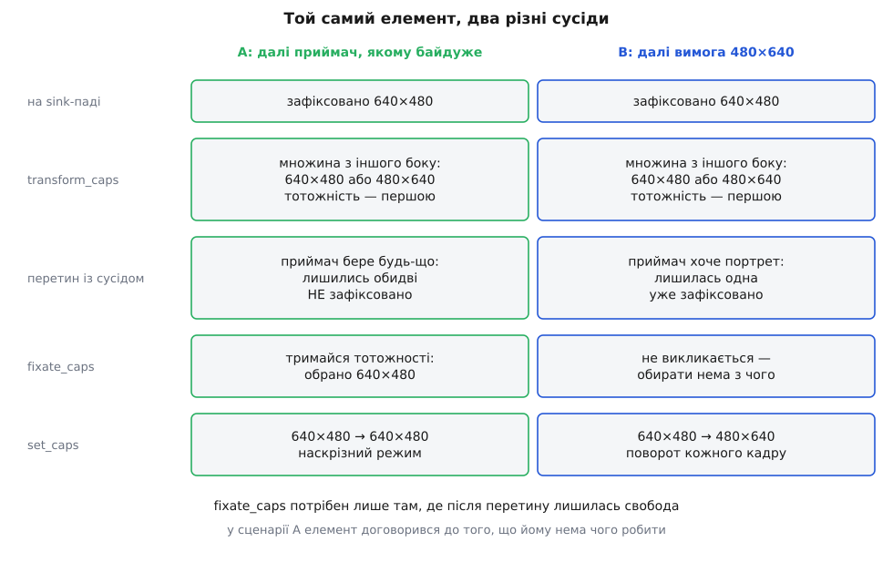

# ⚙️ Елемент, який мусить домовлятися: `demoflip` на GstBaseTransform

Зберемо плагін `demoflip` — елемент, що або пропускає кадр незайманим, або повертає його на чверть оберту, — бо саме поворот змушує елемент вести переговори по-справжньому: він міняє місцями ширину й висоту, а отже, не має права просто переадресувати формат з одного пада на інший.

## Задача

В елемента одна властивість, `mode`, з трьома значеннями:

- `none` — не чіпати кадр узагалі;
- `right` — завжди повертати на 90° за годинниковою стрілкою;
- `auto` — повертати лише тоді, коли цього вимагає той, хто нижче за течією (це типове значення).

Ці три значення навмисно покривають три різні ролі в переговорах. `none` робить елемент прозорим: формат мусить пройти крізь нього без жодної зміни. `right` робить його впертим: він диктує геометрію, і сусідам лишається або погодитись, або відмовитись. А `auto` дає елементові свободу — і саме свобода змушує з'явитися крок, якого в перших двох випадках немає взагалі: коли після всіх перетинів лишилось більше ніж одне можливе рішення, елемент мусить обрати сам.

Щоб код повороту не заступив собою переговори, елемент працює з єдиним форматом пікселів — `GRAY8`, тобто один байт яскравості на піксель і одна площина. Поворот такого кадру — це п'ять рядків із двома циклами. Багатоплощинні формати на кшталт NV12 нічого не змінили б у логіці узгодження, лише додали б арифметики з [кроками рядків і зміщеннями площин](topic:sf-visual/pixel-formats) — там розібрано, чому кадр у пам'яті ніколи не буває просто прямокутником байтів.

## Ідея: чотири запитання й чотири методи

`GstBaseTransform` — це готовий елемент з одним входом і одним виходом, який уже вміє все нудне: керує потоком, стежить за станами, виділяє вихідний буфер, обробляє події. Від підкласу він хоче відповіді на чотири запитання, і кожне з них — окремий метод.

**«Якщо з цього боку буде оце, що ти можеш видати з іншого?»** — `transform_caps`. Це серце участі в переговорах: перетворення множини форматів на множину форматів. Метод кличуть щоразу, коли хтось запитує пад про можливості, — і в один бік, і в другий.

**«Після перетину лишилась свобода — обирай»** — `fixate_caps`. Кличуть лише тоді, коли після зведення обох сторін докупи ще лишилось із чого вибирати.

**«Домовлено, ось обидві сторони»** — `set_caps`. Тут елемент дізнається остаточну пару caps і готується до роботи — або відмовляється, якщо пара виявилась безглуздою.

**«Скільки байтів займає один кадр?»** — `get_unit_size`. Базовий клас мусить виділити вихідний буфер, а розмір кадру виводиться з caps, і знає це тільки підклас.

І вже потім, на кожному кадрі, кличуть `transform`.



*Ліворуч свобода лишилась — і `fixate_caps` вирішує на користь тотожності; праворуч сусід уже все вирішив за нас, і фіксувати нема чого.*

## Скелет: тип, шаблони, властивість

```c
/* gstdemoflip.c — кадр або проходить, або повертається на 90° */
#include <gst/gst.h>
#include <gst/base/gstbasetransform.h>
#include <gst/video/video.h>

GST_DEBUG_CATEGORY_STATIC (demoflip_debug);
#define GST_CAT_DEFAULT demoflip_debug

typedef enum {
  DEMO_FLIP_NONE = 0,   /* нічого не робимо */
  DEMO_FLIP_RIGHT,      /* завжди поворот на 90° за годинниковою */
  DEMO_FLIP_AUTO        /* повертаємо, лише якщо цього хочуть нижче */
} DemoFlipMode;

typedef struct {
  GstBaseTransform parent;

  DemoFlipMode mode;            /* властивість; читати під GST_OBJECT_LOCK */

  GstVideoInfo in_info, out_info;
  gboolean negotiated;
  gboolean rotate;              /* що робити з кадром — вирішує set_caps */
} GstDemoFlip;

typedef struct { GstBaseTransformClass parent_class; } GstDemoFlipClass;

#define GST_TYPE_DEMO_FLIP (gst_demo_flip_get_type ())
#define GST_DEMO_FLIP(o) \
    (G_TYPE_CHECK_INSTANCE_CAST ((o), GST_TYPE_DEMO_FLIP, GstDemoFlip))

G_DEFINE_TYPE (GstDemoFlip, gst_demo_flip, GST_TYPE_BASE_TRANSFORM)

/* Обидва пади обіцяють те саме: GRAY8 будь-якого розміру.
   GST_VIDEO_CAPS_MAKE розгортається у video/x-raw із діапазонами
   width, height і framerate — писати їх руками не треба. */
#define DEMO_FLIP_CAPS GST_VIDEO_CAPS_MAKE ("GRAY8")

static GstStaticPadTemplate sink_tmpl = GST_STATIC_PAD_TEMPLATE ("sink",
    GST_PAD_SINK, GST_PAD_ALWAYS, GST_STATIC_CAPS (DEMO_FLIP_CAPS));
static GstStaticPadTemplate src_tmpl = GST_STATIC_PAD_TEMPLATE ("src",
    GST_PAD_SRC, GST_PAD_ALWAYS, GST_STATIC_CAPS (DEMO_FLIP_CAPS));

enum { PROP_0, PROP_MODE };

/* Щоб `mode` показувався в gst-inspect словами, а не числами,
   перелік треба зареєструвати як тип. */
#define GST_TYPE_DEMO_FLIP_MODE (gst_demo_flip_mode_get_type ())
static GType
gst_demo_flip_mode_get_type (void)
{
  static const GEnumValue values[] = {
    {DEMO_FLIP_NONE,  "Не чіпати кадр",                 "none"},
    {DEMO_FLIP_RIGHT, "Завжди повертати на 90°",        "right"},
    {DEMO_FLIP_AUTO,  "Повертати, лише якщо просять",   "auto"},
    {0, NULL, NULL}
  };
  static gsize t = 0;

  if (g_once_init_enter (&t))
    g_once_init_leave (&t, g_enum_register_static ("DemoFlipMode", values));
  return (GType) t;
}

static void
gst_demo_flip_get_property (GObject * object, guint id,
    GValue * value, GParamSpec * pspec)
{
  GstDemoFlip *self = GST_DEMO_FLIP (object);

  if (id != PROP_MODE) {
    G_OBJECT_WARN_INVALID_PROPERTY_ID (object, id, pspec);
    return;
  }
  GST_OBJECT_LOCK (self);
  g_value_set_enum (value, self->mode);
  GST_OBJECT_UNLOCK (self);
}

static void
gst_demo_flip_set_property (GObject * object, guint id,
    const GValue * value, GParamSpec * pspec)
{
  GstDemoFlip *self = GST_DEMO_FLIP (object);

  if (id != PROP_MODE) {
    G_OBJECT_WARN_INVALID_PROPERTY_ID (object, id, pspec);
    return;
  }

  GST_OBJECT_LOCK (self);
  self->mode = g_value_get_enum (value);
  GST_OBJECT_UNLOCK (self);

  /* Множина, яку ми обіцяємо, щойно змінилась. Самі себе ми
     переузгодити не можемо — просимо базовий клас зробити це
     перед наступним кадром. */
  gst_base_transform_reconfigure_src (GST_BASE_TRANSFORM (self));
}
```

Шаблони падів — це обіцянка «за будь-яких обставин», і в нашому випадку вона симетрична: `GRAY8` будь-якого розміру з обох боків. Обіцянка навмисно ширша за дійсність, бо в шаблоні неможливо висловити зв'язок між падами: «ширина на виході дорівнює висоті на вході» — це не множина, це функція, і жоден статичний рядок такого не запише. Саме тому потрібен `transform_caps`.

## `transform_caps`: множина з протилежного боку

```c
/* Поміняти місцями width і height в одній структурі. */
static void
demo_flip_swap_wh (GstStructure * s)
{
  const GValue *w = gst_structure_get_value (s, "width");
  const GValue *h = gst_structure_get_value (s, "height");
  GValue tw = G_VALUE_INIT, th = G_VALUE_INIT;
  gint par_n, par_d;

  if (w == NULL || h == NULL)
    return;                       /* нема поля — нема обмеження */

  /* Копії обов'язкові: щойно ми запишемо перше поле, чужі
     вказівники всередину структури стають непевними. */
  g_value_init (&tw, G_VALUE_TYPE (w)); g_value_copy (w, &tw);
  g_value_init (&th, G_VALUE_TYPE (h)); g_value_copy (h, &th);
  gst_structure_set_value (s, "width", &th);
  gst_structure_set_value (s, "height", &tw);
  g_value_unset (&tw);
  g_value_unset (&th);

  /* Поворот на чверть оберту перевертає і співвідношення сторін
     пікселя. Якщо воно записане дробом — інвертуємо; якщо там
     діапазон чи список, чесніше зняти обмеження зовсім. */
  if (gst_structure_get_fraction (s, "pixel-aspect-ratio", &par_n, &par_d)) {
    if (par_n != par_d)
      gst_structure_set (s, "pixel-aspect-ratio",
          GST_TYPE_FRACTION, par_d, par_n, NULL);
  } else {
    gst_structure_remove_field (s, "pixel-aspect-ratio");
  }
}

static GstCaps *
gst_demo_flip_transform_caps (GstBaseTransform * base,
    GstPadDirection direction, GstCaps * caps, GstCaps * filter)
{
  GstDemoFlip *self = GST_DEMO_FLIP (base);
  DemoFlipMode mode;
  GstCaps *ret;
  guint i;

  GST_OBJECT_LOCK (self);
  mode = self->mode;
  GST_OBJECT_UNLOCK (self);

  if (mode == DEMO_FLIP_NONE) {
    /* Геометрія не міняється: з іншого боку годиться рівно те саме. */
    ret = gst_caps_ref (caps);
  } else {
    GstCaps *swapped = gst_caps_copy (caps);

    for (i = 0; i < gst_caps_get_size (swapped); i++)
      demo_flip_swap_wh (gst_caps_get_structure (swapped, i));

    if (mode == DEMO_FLIP_RIGHT) {
      ret = swapped;                    /* поворот неминучий */
    } else {
      /* auto: годиться і те, і те. Тотожність ставимо ПЕРШОЮ —
         порядок структур і є порядком переваги. */
      ret = gst_caps_copy (caps);
      gst_caps_append (ret, swapped);   /* append забирає swapped собі */
    }
  }

  /* Фільтр — не порада, а вимога. Той, хто питав, уже знає, що
     йому не потрібне, і не хоче отримати цього у відповіді. */
  if (filter) {
    GstCaps *tmp = gst_caps_intersect_full (filter, ret,
        GST_CAPS_INTERSECT_FIRST);
    gst_caps_unref (ret);
    ret = tmp;
  }

  GST_DEBUG_OBJECT (self, "%s: %" GST_PTR_FORMAT " крізь фільтр %"
      GST_PTR_FORMAT " → %" GST_PTR_FORMAT,
      direction == GST_PAD_SINK ? "sink→src" : "src→sink",
      caps, filter, ret);
  return ret;
}
```

Параметр `direction` — це напрямок того пада, на якому лежать `caps`; повернути треба множину для протилежного пада. У нашому елементі перетворення симетричне — поворот на 90° в один бік і в другий однаково міняє ширину з висотою місцями, — тому на обчислення напрямок не впливає й лишається хіба що в рядку журналу. Але це наша особливість, а не правило. Кодер, наприклад, з боку sink бачить сирі кадри, а з боку src — стиснутий потік, і два напрямки в нього — два зовсім різні обчислення.

Параметр `filter` — той самий фільтр, який дописують до запиту CAPS, щоб не змушувати сусіда будувати величезну множину заради того, що однаково відкинуть. Забути його — найтихіша з можливих помилок: конвеєр працюватиме, бо базовий клас однаково перетне результат із тим, що дозволяє сусід, і зайве відпаде. Аж доки хтось не поставить `capsfilter` над елементом із десятком форматів — і тоді ви побачите, як переговори раптом коштують мілісекунди й будують caps на сотні структур. Помилка тут не в правильності, а в ціні, і тому вона живе в коді роками.

> 🔧 **Навіщо це.** Порядок структур у відповіді — не косметика. У режимі `auto` ми повертаємо `{тотожність, поворот}` саме в такому порядку, і `GST_CAPS_INTERSECT_FIRST` цей порядок бережно тягне крізь перетин. Тому коли сусідові байдуже, вибір впаде на тотожність — і елемент, який мав повертати кадри, тихо перетвориться на пусте місце. Поміняйте два рядки місцями — і той самий конвеєр почне повертати кожен кадр, ніде цього не попросивши.

## `fixate_caps`: тримайся тотожності

```c
static GstCaps *
gst_demo_flip_fixate_caps (GstBaseTransform * base,
    GstPadDirection direction, GstCaps * caps, GstCaps * othercaps)
{
  GstDemoFlip *self = GST_DEMO_FLIP (base);
  GstStructure *ins, *outs;
  DemoFlipMode mode;
  gint w, h;

  GST_OBJECT_LOCK (self);
  mode = self->mode;
  GST_OBJECT_UNLOCK (self);

  /* othercaps наш: прийшов з transfer full. Лишаємо першу структуру
     (вона найбажаніша) і робимо її змінною. */
  othercaps = gst_caps_truncate (othercaps);
  othercaps = gst_caps_make_writable (othercaps);

  ins = gst_caps_get_structure (caps, 0);
  outs = gst_caps_get_structure (othercaps, 0);

  if (gst_structure_get_int (ins, "width", &w) &&
      gst_structure_get_int (ins, "height", &h)) {
    if (mode == DEMO_FLIP_RIGHT) {        /* поворот обов'язковий */
      gint t = w; w = h; h = t;
    }
    /* «Тримайся тотожності»: з усього дозволеного беремо те, що
       найближче до геометрії, за яку не доведеться платити. */
    gst_structure_fixate_field_nearest_int (outs, "width", w);
    gst_structure_fixate_field_nearest_int (outs, "height", h);
  }

  /* Решту полів — типовим правилом: перше значення списку,
     розумна точка діапазону. */
  return gst_caps_fixate (othercaps);
}
```

Правило «тримайся тотожності» звучить як справа смаку, а насправді це єдиний вибір, який елемент здатен зробити чесно. Він не знає, навіщо зібрали конвеєр, який екран стоїть на тому кінці й що для людини важливіше. Зате він точно знає, скільки коштує кожен варіант — і серед однаково дозволених вибирає найдешевший. Тому `videoscale`, маючи 1280×720 на вході й вільний діапазон на виході, обере 1280×720; тому й ми серед двох дозволених орієнтацій беремо ту, що збігається з вхідною.

Зверніть увагу на `mode == DEMO_FLIP_RIGHT`: цільова геометрія обчислюється **з урахуванням того, що елемент збирається зробити**, а не переписується з входу наосліп. У режимі `right` тотожність — це вже не «та сама ширина», а «повернута ширина». Плутанина саме тут дає найзагадковіші поразки: усі поля зафіксовані, помилок немає, а елемент отримує пару caps, яку не вміє виконати.

Ще одна дрібниця, яка коштує вечора: `gst_structure_fixate_field_nearest_int` — не наказ, а прохання. Якщо поле вже зафіксоване, виклик нічого не робить, і це правильно: чуже рішення ми не перебиваємо. Якщо поле — діапазон `[16, 1024]`, а ми просимо 1920, вийде 1024. Ніякої помилки не буде — буде тихо не те, чого ви чекали, і побачити це можна лише в надрукованих caps.

## `set_caps`: тут народжується режим

```c
static gboolean
gst_demo_flip_set_caps (GstBaseTransform * base,
    GstCaps * incaps, GstCaps * outcaps)
{
  GstDemoFlip *self = GST_DEMO_FLIP (base);
  GstVideoInfo in, out;

  self->negotiated = FALSE;

  if (!gst_video_info_from_caps (&in, incaps) ||
      !gst_video_info_from_caps (&out, outcaps))
    goto bad_caps;

  if (in.width == out.width && in.height == out.height)
    self->rotate = FALSE;
  else if (in.width == out.height && in.height == out.width)
    self->rotate = TRUE;
  else
    goto bad_caps;              /* такої пари ми не вміємо */

  self->in_info = in;
  self->out_info = out;
  self->negotiated = TRUE;

  /* Якщо робити нічого — хай базовий клас навіть не кличе нас
     на кадрах, а пропускає буфери повз. */
  gst_base_transform_set_passthrough (base, !self->rotate);

  GST_INFO_OBJECT (self, "узгоджено %dx%d → %dx%d, %s",
      in.width, in.height, out.width, out.height,
      self->rotate ? "поворот" : "наскрізний режим");
  return TRUE;

bad_caps:
  GST_ERROR_OBJECT (self, "пара, якої не буває: %" GST_PTR_FORMAT
      " → %" GST_PTR_FORMAT, incaps, outcaps);
  return FALSE;
}
```

Найважливіше в цьому методі — те, чого в ньому немає. Він жодного разу не дивиться на властивість `mode`. Що елемент робитиме з кадром, вирішує не властивість, а **та пара caps, про яку домовились**: однакова геометрія — нічого не робимо, переставлена — повертаємо. Властивість впливає лише на те, що ми обіцяємо в переговорах.

Ця межа виглядає буквоїдством рівно доти, доки властивість не змінять на ходу. Переговори живуть в одному потоці, `g_object_set` приходить із зовсім іншого, і між зміною властивості й наступним кадром є проміжок, у якому вони не збігаються. Елемент, що дивиться на властивість просто в обробнику кадру, у цьому проміжку запише повернуті пікселі в буфер старої геометрії — тобто вилізе за його межі. Елемент, що дивиться на узгоджені caps, у найгіршому разі пропустить один кадр у старому режимі, а потім `gst_base_transform_reconfigure_src` доведе переговори до кінця.

Виклик `gst_base_transform_set_passthrough` — це і є той самий наскрізний режим, про який елементи говорять як про безкоштовність. Увімкнений, він означає буквально: базовий клас не виділяє вихідного буфера й не кличе `transform`, а віддає той самий буфер далі. Так само влаштований і `videoconvert`, який «нічого не коштує», коли сусіди й так зійшлись на спільному форматі.

Повернути `FALSE` із `set_caps` не соромно, а необхідно. Це означає «цієї пари я не виконаю», і базовий клас перетворить відмову на чесний зрив переговорів замість тихого псування кадрів.

## Скільки байтів у кадрі — і сам поворот

```c
static gboolean
gst_demo_flip_get_unit_size (GstBaseTransform * base, GstCaps * caps,
    gsize * size)
{
  GstVideoInfo info;

  if (!gst_video_info_from_caps (&info, caps))
    return FALSE;

  *size = GST_VIDEO_INFO_SIZE (&info);   /* байтів на один кадр */
  return TRUE;
}

static GstFlowReturn
gst_demo_flip_transform (GstBaseTransform * base, GstBuffer * inbuf,
    GstBuffer * outbuf)
{
  GstDemoFlip *self = GST_DEMO_FLIP (base);
  GstVideoFrame src, dst;
  guint8 *sp, *dp;
  gint x, y, w, h, ss, ds;

  if (G_UNLIKELY (!self->negotiated)) {
    GST_ELEMENT_ERROR (self, CORE, NEGOTIATION, (NULL),
        ("кадр прийшов, а формату ще немає"));
    return GST_FLOW_NOT_NEGOTIATED;
  }

  if (!gst_video_frame_map (&src, &self->in_info, inbuf, GST_MAP_READ))
    return GST_FLOW_ERROR;
  if (!gst_video_frame_map (&dst, &self->out_info, outbuf, GST_MAP_WRITE)) {
    gst_video_frame_unmap (&src);
    return GST_FLOW_ERROR;
  }

  w = GST_VIDEO_FRAME_WIDTH (&src);
  h = GST_VIDEO_FRAME_HEIGHT (&src);
  sp = GST_VIDEO_FRAME_PLANE_DATA (&src, 0);
  dp = GST_VIDEO_FRAME_PLANE_DATA (&dst, 0);
  ss = GST_VIDEO_FRAME_PLANE_STRIDE (&src, 0);
  ds = GST_VIDEO_FRAME_PLANE_STRIDE (&dst, 0);

  /* Поворот за годинниковою: піксель (x, y) їде в (h-1-y, x). */
  for (y = 0; y < h; y++)
    for (x = 0; x < w; x++)
      dp[x * ds + (h - 1 - y)] = sp[y * ss + x];

  gst_video_frame_unmap (&dst);
  gst_video_frame_unmap (&src);
  return GST_FLOW_OK;
}
```

`get_unit_size` виглядає технічною дрібницею, а насправді це друга половина відповіді на питання про формат. Caps кажуть, що означають байти; `get_unit_size` каже, скільки їх. Без нього базовий клас не знає, буфер якого розміру просити для виходу, і зупиняє конвеєр помилкою переговорів про невідомий розмір одиниці — при цілком правильних, уже узгоджених caps. Реалізувати його зобов'язаний кожен, хто працює не на місці, а в окремому вихідному буфері.

Сторожа `!self->negotiated` — це те місце, де `GST_FLOW_NOT_NEGOTIATED` народжується власноруч. Повернене значення поїде проти течії від елемента до елемента, дійде до джерела й зупинить потік. Штовхати буфери, не маючи формату, не можна навіть тоді, коли здається, що ви його вгадали.

Мапування кадру через `GstVideoFrame` дає вказівник на площину й крок рядка — і крок майже ніколи не дорівнює ширині, бо пам'ять вирівнюють. Що саме мапується й чому копії тут немає, розібрано в темі про [буфери й пам'ять конвеєра](topic:sys-media/buffers-and-memory): буфер може лежати в пулі, у пам'яті драйвера чи взагалі бути недоступним для читання вказівником.

## Реєстрація й збірка

```c
static void
gst_demo_flip_class_init (GstDemoFlipClass * klass)
{
  GObjectClass *gobject_class = G_OBJECT_CLASS (klass);
  GstElementClass *element_class = GST_ELEMENT_CLASS (klass);
  GstBaseTransformClass *trans_class = GST_BASE_TRANSFORM_CLASS (klass);

  gobject_class->set_property = gst_demo_flip_set_property;
  gobject_class->get_property = gst_demo_flip_get_property;
  g_object_class_install_property (gobject_class, PROP_MODE,
      g_param_spec_enum ("mode", "Режим", "Що робити з кадром",
          GST_TYPE_DEMO_FLIP_MODE, DEMO_FLIP_AUTO,
          G_PARAM_READWRITE | G_PARAM_STATIC_STRINGS |
          GST_PARAM_MUTABLE_PLAYING));

  gst_element_class_add_static_pad_template (element_class, &sink_tmpl);
  gst_element_class_add_static_pad_template (element_class, &src_tmpl);
  gst_element_class_set_static_metadata (element_class, "Demo flip",
      "Filter/Effect/Video", "Пропускає кадр або повертає на 90°", "Курс");

  trans_class->transform_caps = gst_demo_flip_transform_caps;
  trans_class->fixate_caps    = gst_demo_flip_fixate_caps;
  trans_class->set_caps       = gst_demo_flip_set_caps;
  trans_class->get_unit_size  = gst_demo_flip_get_unit_size;
  trans_class->transform      = gst_demo_flip_transform;
}

static void
gst_demo_flip_init (GstDemoFlip * self)
{
  self->mode = DEMO_FLIP_AUTO;
  self->negotiated = FALSE;
}

static gboolean
plugin_init (GstPlugin * plugin)
{
  GST_DEBUG_CATEGORY_INIT (demoflip_debug, "demoflip", 0, "demoflip");
  return gst_element_register (plugin, "demoflip", GST_RANK_NONE,
      GST_TYPE_DEMO_FLIP);
}

GST_PLUGIN_DEFINE (GST_VERSION_MAJOR, GST_VERSION_MINOR,
    demoflip, "Кадр або проходить, або повертається на 90°",
    plugin_init, "1.0", "LGPL", "demoflip", "https://example.org/")
```

Збирається це однією командою — плагін GStreamer є звичайною динамічною бібліотекою:

```sh
gcc -O2 -Wall -fPIC -shared -o libgstdemoflip.so gstdemoflip.c \
    $(pkg-config --cflags --libs gstreamer-1.0 gstreamer-base-1.0 \
                                gstreamer-video-1.0)

export GST_PLUGIN_PATH=$PWD
gst-inspect-1.0 demoflip
```

`gst-inspect-1.0` друкує не те, що написано в коді, а те, що потрапило в реєстр — і в цьому вся перевірка. Якщо в описі шаблонів помилка, ви побачите її саме тут, ще до першого конвеєра. Як реєстр збирається, чому перший запуск після збірки повільніший і що робити, коли елемента «не видно», — у темі про [модель плагінів і реєстр](topic:sys-media/plugin-model).

## Що друкує `gst-launch-1.0 -v`

Ключ `-v` змушує друкувати caps кожної зв'язки в момент, коли їх узгодили. Це і є прилад для спостереження за переговорами (частину полів нижче замінено на `…`, щоб рядки лишились читаними).

**Сценарій A — приймачу байдуже.** `fakesink` бере будь-що, тому після перетину лишились обидві орієнтації, і вибір зробила фіксація:

```sh
gst-launch-1.0 -v videotestsrc num-buffers=1 \
  ! video/x-raw,format=GRAY8,width=640,height=480 \
  ! demoflip mode=auto ! fakesink
```

```
/GstPipeline:pipeline0/GstDemoFlip:demoflip0.GstPad:sink: caps =
    video/x-raw, format=(string)GRAY8, width=(int)640, height=(int)480, …
/GstPipeline:pipeline0/GstDemoFlip:demoflip0.GstPad:src: caps =
    video/x-raw, format=(string)GRAY8, width=(int)640, height=(int)480, …
```

Обидва пади зійшлись на однаковій геометрії — елемент договорився до того, що йому нема чого робити. Переконатися, що це справді наскрізний режим, а не мовчазний поворот, можна власним журналом: `GST_DEBUG=demoflip:4` покаже рядок із `set_caps`.

**Сценарій B — приймач вимагає портрет.** Той самий рядок із `capsfilter` після елемента:

```sh
gst-launch-1.0 -v videotestsrc num-buffers=1 \
  ! video/x-raw,format=GRAY8,width=640,height=480 \
  ! demoflip mode=auto ! video/x-raw,width=480,height=640 ! fakesink
```

```
… demoflip0.GstPad:src: caps =
    video/x-raw, format=(string)GRAY8, width=(int)480, height=(int)640, …
```

Тепер перетин лишив рівно одну орієнтацію, `fixate_caps` навіть не покликали, а `set_caps` побачив переставлену пару й увімкнув поворот. Той самий елемент, той самий режим `auto` — і геть інша поведінка, задана виключно сусідом.

**Сценарій C — вимоги несумісні.** Джерело замкнене на 640×480, елемент у режимі `none` (тобто зобов'язаний передати геометрію без змін), а приймач вимагає 480×640:

```sh
gst-launch-1.0 videotestsrc \
  ! video/x-raw,format=GRAY8,width=640,height=480 \
  ! demoflip mode=none ! video/x-raw,width=480,height=640 ! fakesink
```

```
ERROR: from element /GstPipeline:pipeline0/GstVideoTestSrc:videotestsrc0:
  Internal data stream error.
… streaming stopped, reason not-negotiated (-4)
```

З'єднати елементи вдалося — статичні шаблони обох сторін цілком сумісні. Розвалилось усе пізніше, на дійсних можливостях, і саме звідси береться різниця між `could not link` і `not-negotiated`. Який елемент здасться першим, залежить від того, хто раніше спробує віддати буфер, тому точний текст помилки може відрізнятися. Надійніший спосіб дивитися — граф конвеєра з узгодженими caps на кожній зв'язці через `GST_DEBUG_DUMP_DOT_DIR`, разом з іншими [способами розглядати конвеєр зсередини](topic:sys-media/pipeline-debugging).

## Ціна повороту

Арифметика повороту гранично проста: один прочитаний і один записаний байт на піксель, тобто O(w·h), і зробити менше неможливо. Уся справжня ціна — у порядку доступу до пам'яті. Читаємо ми вздовж рядка, а пишемо вздовж стовпця, і кожен наступний запис відстоїть від попереднього на цілий крок рядка.

**Умова: кадр 1920×1080, GRAY8, сторінки по 4 КіБ.**

```
кадр                     1920 × 1080 = 2 073 600 байт
крок рядка на виході     1080 байт (вихід — 1080 × 1920)
сторінок у вихідному кадрі   2 073 600 / 4096 ≈ 506

наївний прохід: на КОЖЕН рядок джерела (1920 пікселів)
запис торкається 1920 різних рядків виходу
                 = 1920 × 1080 байт розмаху = увесь кадр
                 = усі 506 сторінок
робочий набір запису   1920 × 64 Б кеш-лінії ≈ 122 880 байт

перший рівень TLB на типовому x86-64 тримає ≈ 64 сторінки
506 ≫ 64 → майже кожен запис іде по трансляцію на другий рівень

прохід блоками 64×64: один блок пише 64 рядки виходу по 64 байти
розмах = 64 × 1080 ≈ 69 120 байт ≈ 17 сторінок
```

Висновок не той, що напрошується: вузьке місце тут не кеш даних — робочий набір одного проходу 122 КБ, і в L2 він поміститься, — а трансляція адрес. Наївний прохід розмазує записи по всіх 506 сторінках кадру, а блочний тримається сімнадцяти, виконуючи рівно стільки ж операцій; звідси й різниця в кілька разів на однаковій арифметиці. Для 640×480 вона майже непомітна — увесь вихідний кадр там 300 КБ і 75 сторінок, — тож ускладнювати код заради неї не варто, доки ви не поміряли.

## Пастки

**Власний шаблон замість переадресації.** Спокуса написати `transform_caps`, який просто повертає `gst_pad_get_pad_template_caps (пад)`, велика: воно ж компілюється й навіть працює на простих конвеєрах. Але такий елемент стає глухою стіною. Запит CAPS від джерела більше не доносить вимог приймача, `capsfilter` після елемента перестає впливати на те, що робить камера, а елемент обіцяє все підряд і виявляє неможливість аж у `set_caps`. Правило просте: `transform_caps` мусить бути **функцією від переданих caps**, а не константою.

**Забутий фільтр.** Розібрано вище: помилка не в правильності, а в ціні. Видно її просто в журналі — `GST_DEBUG=demoflip:5` друкує і що прийшло, і який був фільтр, і що ми повернули. Якщо у відповіді є структури, яких фільтр не дозволяв, фільтр не застосований.

**Витік `GstCaps`.** Тут працює звичайний [підрахунок посилань](topic:sf-lang/reference-counting), тільки записаний у домовленостях про передачу володіння: `transform_caps` віддає результат із transfer full — той, хто покликав, його звільнить; `fixate_caps` **отримує** `othercaps` теж із transfer full — тобто вони наші, і повернути ми зобов'язані рівно одне посилання. Два класичні промахи дзеркальні: `gst_caps_intersect` у циклі без `unref` попереднього результату — і повернення `caps` без `gst_caps_ref`, після чого пад звільнить чуже посилання й програма впаде пізніше, у геть іншому місці. Ловиться це без роздумів:

```sh
GST_TRACERS=leaks GST_DEBUG=GST_TRACER:7 \
  gst-launch-1.0 videotestsrc num-buffers=1 ! demoflip ! fakesink
```

Трасувальник надрукує на виході список об'єктів, що пережили конвеєр. Для caps-коду це найдешевша перевірка з усіх: одна зайва структура в переговорах повторюється на кожному переузгодженні.

**Фіксація не того поля.** У режимі `right` ціль для вихідної ширини — вхідна **висота**. Написати `gst_structure_fixate_field_nearest_int (outs, "width", in.width)` — і при вільному діапазоні на виході елемент сам собі зафіксує геометрію, якої не вміє виконати; `set_caps` чесно поверне `FALSE`, а в журналі буде «пара, якої не буває» на цілком осмислених з вигляду caps. Симптом упізнається одразу: поразка приходить не від сусіда, а від власного елемента.

**Властивість замість узгоджених caps.** Найнебезпечніша з усіх, бо не падає одразу. Якщо `transform` дивиться на `self->mode`, а не на те, що вирішив `set_caps`, то зміна властивості під час роботи дає кадр, записаний у буфер чужої геометрії. Порядок такий: властивість → що ми обіцяємо в `transform_caps` → `gst_base_transform_reconfigure_src` → нові переговори → `set_caps` → і лише тепер нова поведінка. Якщо зміна властивості вимагає іншого формату **на вході** (наш елемент цього не потребує, а от перетворювач кольору — так), потрібен ще й `gst_base_transform_reconfigure_sink`, який пустить подію RECONFIGURE проти течії.

**Читання властивості без замка.** `transform_caps` кличуть із потоку переговорів, `set_property` — з потоку застосунку. `GST_OBJECT_LOCK` навколо читання `mode` тут не педантизм, а єдиний спосіб не отримати посеред обчислення множини значення, якого ніколи не встановлювали.

Ті самі п'ять методів із тими самими назвами живуть і в прив'язках до Rust (`BaseTransformImpl` із `transform_caps` і `fixate_caps`), тож переписати цей елемент мовою з перевіркою володіння під час компіляції можна майже дослівно — і половина пасток зі списку вище зникне разом із ручним підрахунком посилань. Логіка переговорів, утім, лишиться точнісінько та сама: множина з протилежного боку, фільтр, порядок переваги й вибір на користь того, за що не треба платити.
