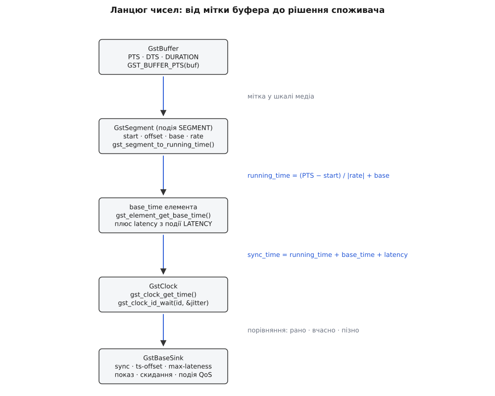

# 📋 Контракт часу GStreamer 1.x: функції, поля, повідомлення

Ця довідка відповідає на одне питання: **яким саме викликом або полем виражена кожна ланка часового ланцюга GStreamer** — від мітки на буфері до миті, коли споживач віддасть кадр на екран. Сигнатури взято з чинної гілки 1.x; там, де щось з'явилося пізніше за 1.0, стоїть позначка випуску. Розділи йдуть у тому порядку, в якому число проходить конвеєр, тож довідку можна читати згори вниз як опис одного обчислення.



*Кожен наступний блок додає до числа рівно одну складову; API нижче згруповано так само.*

## Типи, константи, макроси

| Ім'я | Визначення | Про що пам'ятати |
|---|---|---|
| `GstClockTime` | `guint64`, наносекунди | беззнакове; від'ємного часу в цьому типі не буває |
| `GstClockTimeDiff` | `gint64`, наносекунди | різниці, зсуви, запізнення — усе знакове живе тут |
| `GST_CLOCK_TIME_NONE` | `((GstClockTime) -1)` = 18446744073709551615 | «мітки немає»; це найбільше можливе значення типу |
| `GST_CLOCK_TIME_IS_VALID(t)` | `t != GST_CLOCK_TIME_NONE` | єдиний правильний спосіб перевірити мітку |
| `GST_SECOND` | 1000000000 | одиниця всіх часових полів |
| `GST_MSECOND` · `GST_USECOND` · `GST_NSECOND` | 1000000 · 1000 · 1 | множники для читабельних констант |
| `GST_TIME_FORMAT` | `"u:%02u:%02u.%09u"` | вживається як `"%" GST_TIME_FORMAT` |
| `GST_TIME_ARGS(t)` | розкладає на години, хвилини, секунди, наносекунди | аргументи до попереднього |
| `GST_STIME_FORMAT` · `GST_STIME_ARGS(t)` | те саме зі знаком `+`/`−` (з 1.6) | для `GstClockTimeDiff`: запізнення, jitter, `ts-offset` |
| `GST_CLOCK_DIFF(s, e)` | `(GstClockTimeDiff)(e − s)` | різниця «кінець мінус початок», а не навпаки |

Головна пастка тут не в іменах, а в тому, що `GST_CLOCK_TIME_NONE` — не нуль і не мінус одиниця, а **найбільше беззнакове число**. Тому `pts > threshold` для буфера без мітки істинне завжди, `pts + duration` тихо переповнюється в нуль, а `pts - base` дає майже 18 квінтильйонів наносекунд. Жодне з цих трьох порівнянь не впаде — воно просто дасть безглуздий результат, який виявиться десь далі у вигляді кадру, що «летить» або застряг на годину. Звідси залізне правило: спершу `GST_CLOCK_TIME_IS_VALID`, і лише потім арифметика.

```c
GstClockTime pts = GST_BUFFER_PTS (buf);

if (!GST_CLOCK_TIME_IS_VALID (pts))       /* НЕ «pts == 0» і НЕ «pts < 0» */
  return GST_FLOW_OK;                     /* мітки немає — синхронізувати нема за чим */

g_print ("pts %" GST_TIME_FORMAT "  тривалість %" GST_TIME_FORMAT "\n",
         GST_TIME_ARGS (pts), GST_TIME_ARGS (GST_BUFFER_DURATION (buf)));
```

Перерахунок звичних величин у наносекунди варто робити множенням на макрос, а не літералами з нулями:

```
40 мс                = 40 * GST_MSECOND          =    40 000 000 нс
кадр при 25 к/с      = GST_SECOND / 25           =    40 000 000 нс
кадр при 29.97 к/с   = GST_SECOND * 1001 / 30000 =    33 366 666 нс
1024 відліки при 48 кГц = GST_SECOND * 1024 / 48000 = 21 333 333 нс
```

Порядок множення в третьому й четвертому рядках не косметичний: `GST_SECOND * 1001` ще вміщається в 64 біти, а от `1001 / 30000` у цілих числах дало б нуль. Спершу множення, потім ділення — інакше тривалість кадру перетвориться на порожнє місце.

## GstClock: прочитати час і дочекатися миті

| Сигнатура | Що робить |
|---|---|
| `GstClockTime gst_clock_get_time (GstClock *clock)` | поточне значення шкали; єдина по-справжньому обов'язкова операція годинника |
| `GstClockID gst_clock_new_single_shot_id (GstClock *clock, GstClockTime time)` | замовлення «збуди мене о `time`» (абсолютний час годинника, не тривалість) |
| `GstClockID gst_clock_new_periodic_id (GstClock *clock, GstClockTime start_time, GstClockTime interval)` | те саме, але з повторами кожні `interval` |
| `GstClockReturn gst_clock_id_wait (GstClockID id, GstClockTimeDiff *jitter)` | блокує потік до замовленої миті; `jitter` можна лишити `NULL` |
| `GstClockReturn gst_clock_id_wait_async (GstClockID id, GstClockCallback func, gpointer user_data, GDestroyNotify destroy_data)` | те саме без блокування: у призначену мить викликається `func` |
| `void gst_clock_id_unschedule (GstClockID id)` | скасувати замовлення; той, хто чекає, негайно отримає `GST_CLOCK_UNSCHEDULED` |
| `void gst_clock_id_unref (GstClockID id)` | звільнити замовлення (кожен `new_*_id` треба врівноважити) |
| `GstClockTime gst_clock_get_resolution (GstClock *clock)` | крок шкали в наносекундах — дрібніше цього годинник не розрізняє |
| `gboolean gst_clock_is_synced (GstClock *clock)` · `gboolean gst_clock_wait_for_sync (GstClock *clock, GstClockTime timeout)` | для мережевих годинників: чи вже зійшлися з віддаленим; почекати на це (з 1.6) |

`GstClockReturn` — сім значень плюс одне службове, і два з них плутають найчастіше:

| Значення | Коли повертається |
|---|---|
| `GST_CLOCK_OK` | дочекалися рівно призначеної миті |
| `GST_CLOCK_EARLY` | замовлену мить годинник **уже проминув** до початку чекання |
| `GST_CLOCK_UNSCHEDULED` | замовлення скасували через `gst_clock_id_unschedule()` |
| `GST_CLOCK_BUSY` | цей `id` уже чекають деінде |
| `GST_CLOCK_BADTIME` | у функцію передали неприпустимий час |
| `GST_CLOCK_ERROR` | збій самого годинника |
| `GST_CLOCK_UNSUPPORTED` | операція для цього годинника не реалізована |
| `GST_CLOCK_DONE` | періодичне замовлення відпрацювало всі свої спрацювання |

Назва `GST_CLOCK_EARLY` читається навпаки до того, що сталося: **рано прокинувся не той, хто чекав, а замовлення виявилося запізнілим**. Саме це значення споживач отримує на кожен буфер, чия мить показу минула, — і саме воно вмикає скидання кадру та подію QoS.

Знак `jitter` доповнює картину. Додатне значення — наскільки замовлена мить відстала від годинника (разом із `GST_CLOCK_EARLY`); від'ємне — скільки часу насправді провели в чеканні. Тобто додатний jitter завжди означає запізнення, і його зручно друкувати через `GST_STIME_FORMAT`.

```c
GstClock *clock = gst_element_get_clock (sink);   /* NULL, якщо конвеєр не в PAUSED/PLAYING */
GstClockTime now = gst_clock_get_time (clock);
GstClockID   id  = gst_clock_new_single_shot_id (clock, now + 20 * GST_MSECOND);

GstClockTimeDiff jitter;
GstClockReturn   res = gst_clock_id_wait (id, &jitter);

if (res == GST_CLOCK_EARLY)
  g_print ("мить уже минула на %" GST_STIME_FORMAT "\n", GST_STIME_ARGS (jitter));

gst_clock_id_unschedule (id);   /* з іншого потоку це й є спосіб розбудити чекальника */
gst_clock_id_unref (id);        /* одноразовий id придатний рівно на одне чекання */
gst_object_unref (clock);
```

Два практичні наслідки з цього коду. По-перше, час у замовленні **абсолютний**: передати туди «двадцять мілісекунд» замість «поточний час плюс двадцять мілісекунд» — типова помилка, і вона миттєво дає `GST_CLOCK_EARLY`. По-друге, скасувати чекання зсередини потоку, що спить, неможливо, тому `GstClockID` тримають у структурі, доступній іншому потоку, — інакше зупинити конвеєр без грубого вбивства потоку не вийде.

## Підпорядкування годинника: спостереження й калібрування

Годинник GStreamer уміє йти не сам по собі, а слідом за іншим. Механізм складається з двох половин: збирання пар «мій час — його час» і перерахунок за побудованою прямою.

| Сигнатура | Роль |
|---|---|
| `gboolean gst_clock_set_master (GstClock *clock, GstClock *master)` | увімкнути підпорядкування: годинник сам починає періодично опитувати `master`; `NULL` вимикає |
| `gboolean gst_clock_add_observation (GstClock *clock, GstClockTime internal, GstClockTime external, gdouble *r_squared)` | додати одну пару спостережень власноруч; повертає `TRUE`, коли їх назбиралося досить для регресії |
| `gboolean gst_clock_add_observation_unapplied (…, GstClockTime *internal, GstClockTime *external, GstClockTime *rate_num, GstClockTime *rate_denom)` | те саме, але результат регресії **не застосовується**, а віддається назовні (з 1.6) |
| `void gst_clock_set_calibration (GstClock *clock, GstClockTime internal, GstClockTime external, GstClockTime rate_num, GstClockTime rate_denom)` | поставити перетворення руками |
| `void gst_clock_get_calibration (GstClock *clock, GstClockTime *internal, GstClockTime *external, GstClockTime *rate_num, GstClockTime *rate_denom)` | прочитати чинне перетворення |
| `GstClockTime gst_clock_adjust_unlocked (GstClock *clock, GstClockTime internal)` | застосувати перетворення до довільного значення |
| `GstClockTime gst_clock_unadjust_unlocked (GstClock *clock, GstClockTime external)` | зворотний переклад |

Усе калібрування — це одна пряма з чотирьох чисел:

```
external = (internal − cinternal) · cnum / cdenom + cexternal
```

Пара `cinternal`/`cexternal` каже, які два значення двох шкал вважати однією й тією ж миттю, а дріб `cnum/cdenom` — у скільки разів чужа секунда довша за власну. Тому `gst_clock_set_calibration (clock, x, y, 1, 1)` — це чистий зсув без зміни ходу, а `(x, y, 1000001, 1000000)` — розбіжність ходу на один ppm.

`r_squared` із `gst_clock_add_observation()` — коефіцієнт детермінації тієї ж прямої: 1.0 означає ідеальне влучання всіх точок, а сповзання до 0.9 у локальній мережі зазвичай означає не поганий кварц, а розкид затримок пакетів. Пряму будують [методом найменших квадратів](topic:math-probability/least-squares) — кожне окреме вимірювання зашумлене, а шукана залежність між двома рівномірними годинниками саме лінійна.

Скільки точок брати й як часто, задають три властивості самого об'єкта `GstClock`:

| Властивість | Тип | Типове значення | Сенс |
|---|---|---|---|
| `timeout` | `GstClockTime` | 100 мс (`GST_SECOND / 10`) | період опитування головного годинника |
| `window-size` | `gint` | 32 | скільки останніх спостережень тримати у вікні |
| `window-threshold` | `gint` | 4 | скільки точок мусить назбиратися, перш ніж рахувати регресію |

Множення `timeout` на `window-threshold` дає час, потрібний новому мережевому годиннику, щоб узагалі почати показувати щось осмислене: за типових значень це близько 0.4 с, а до повного вікна — понад три секунди. Саме тому конвеєр, який стартує одразу після створення мережевого годинника, першу секунду грає повз ноти; лікує це `gst_clock_wait_for_sync()` перед стартом.

## Мітки на буфері

| Поле / макрос | Тип | Зміст |
|---|---|---|
| `GST_BUFFER_PTS (buf)` | `GstClockTime` | мить **показу** в шкалі сегмента; єдина мітка, за якою синхронізується споживач |
| `GST_BUFFER_DTS (buf)` | `GstClockTime` | мить **подання декодерові**; потрібна лише там, де кодек переставляє кадри |
| `GST_BUFFER_DTS_OR_PTS (buf)` | `GstClockTime` | `DTS`, якщо він дійсний, інакше `PTS` — саме те, що потрібно мультиплексорам |
| `GST_BUFFER_DURATION (buf)` | `GstClockTime` | тривалість вмісту; `GST_CLOCK_TIME_NONE`, якщо невідома |
| `GST_BUFFER_PTS_IS_VALID (buf)` · `GST_BUFFER_DTS_IS_VALID (buf)` · `GST_BUFFER_DURATION_IS_VALID (buf)` | `gboolean` | перевірки, що звільняють від порівнянь із `GST_CLOCK_TIME_NONE` вручну |
| `GST_BUFFER_OFFSET (buf)` · `GST_BUFFER_OFFSET_END (buf)` | `guint64` | позиція в «рідних» одиницях: номер кадру, номер відліку, зсув у байтах; порожнє значення — `GST_BUFFER_OFFSET_NONE` |
| `GST_BUFFER_FLAG_DISCONT` | прапорець | «потік тут розірвано»: після перемотування, втрати пакетів, склейки джерел |

Обидві мітки — не `running_time` і не час годинника, а координати **всередині сегмента**. Перекласти їх у шкалу конвеєра можна лише разом із подією `SEGMENT`, яка прийшла перед буферами; без неї число на буфері не має адресата. `DURATION` у синхронізації участі не бере взагалі — споживач чекає на початок буфера, а тривалість потрібна тим, хто рахує кінець (мультиплексорам, елементам склейки, логіці «чи є розрив»).

## Годинник, base_time і start_time

Годинник вибирає конвеєр, а `base_time` живе на кожному елементі окремо — саме тому елемент, доданий у вже запущений конвеєр, потребує ручного втручання.

| Сигнатура | Хто це викликає |
|---|---|
| `GstClock *gst_element_provide_clock (GstElement *element)` | конвеєр — щоб зібрати пропозиції від елементів із прапорцем `GST_ELEMENT_FLAG_PROVIDE_CLOCK` |
| `gboolean gst_element_set_clock (GstElement *element, GstClock *clock)` | конвеєр — щоб роздати вибраний годинник |
| `GstClock *gst_element_get_clock (GstElement *element)` | ваш код — щоб дізнатися, за чим елемент нині міряє час |
| `void gst_element_set_base_time (GstElement *element, GstClockTime time)` | ваш код у двох випадках: динамічно доданий елемент і спільний `base_time` між процесами |
| `GstClockTime gst_element_get_base_time (GstElement *element)` | ваш код — щоб перекласти `running_time` у час годинника |
| `void gst_element_set_start_time (GstElement *element, GstClockTime time)` · `GstClockTime gst_element_get_start_time (GstElement *element)` | керування тим, чи перераховувати `base_time` на переходах станів |
| `GstClockTime gst_element_get_current_running_time (GstElement *element)` · `GstClockTime gst_element_get_current_clock_time (GstElement *element)` | зручні обгортки над двома попередніми (з 1.18) |

Функції `gst_pipeline_set_start_time()` не існує — `start_time` належить рівню `GstElement`, і на об'єкті конвеєра викликають саме `gst_element_set_start_time()`. Плутанина тут коштує дорого, бо значення цього поля вирішує долю `base_time`:

| `start_time` конвеєра | Що робиться на PLAYING → PAUSED → PLAYING |
|---|---|
| `0` (типово) | у PAUSED конвеєр запам'ятовує досягнутий `running_time`, у PLAYING видає новий `base_time`, щоб рахунок продовжився з того самого місця; пауза не рахується програним часом |
| `GST_CLOCK_TIME_NONE` | конвеєр не чіпає ні `start_time`, ні `base_time`; `running_time` росте й на паузі — потрібне живим джерелам і будь-якій роздачі `base_time` руками |

Функції самого конвеєра стосуються вже вибору годинника й загального зсуву:

| Сигнатура | Дія |
|---|---|
| `void gst_pipeline_use_clock (GstPipeline *pipeline, GstClock *clock)` | закріпити конкретний годинник назавжди; `NULL` вимикає всяке відлічування часу, і конвеєр біжить якнайшвидше |
| `gboolean gst_pipeline_set_clock (GstPipeline *pipeline, GstClock *clock)` | поставити годинник **на один раз**: наступний вибір може його змінити |
| `void gst_pipeline_auto_clock (GstPipeline *pipeline)` | повернути автоматичний вибір (типова поведінка) |
| `GstClock *gst_pipeline_get_pipeline_clock (GstPipeline *pipeline)` | чинний годинник, навіть коли конвеєр не в PLAYING (з 1.6; до того — `gst_pipeline_get_clock()`) |
| `void gst_pipeline_set_delay (GstPipeline *pipeline, GstClockTime delay)` · `GstClockTime gst_pipeline_get_delay (…)` | додаткова затримка, що додається до `base_time` всіх елементів |
| `void gst_pipeline_set_latency (GstPipeline *pipeline, GstClockTime latency)` · `GstClockTime gst_pipeline_get_latency (…)` | нав'язати конвеєрові конкретну затримку замість обчисленої; `GST_CLOCK_TIME_NONE` повертає автоматику (з 1.6) |

Різниця між `use_clock` і `set_clock` — одна з тих, що мовчки псують складання. Перша прибиває годинник намертво, друга лише підказує вибір, і після появи нового постачальника часу (наприклад, коли підключили звукову карту) конвеєр спокійно перевибере його.

Ось повний набір дій, потрібний, щоб два конвеєри в різних процесах показували одне й те саме одночасно:

```c
/* 1. Спільний годинник: беремо час у процесу-постачальника */
GstClock *net = gst_net_client_clock_new ("net", "192.168.1.10", 8554, 0);
gst_clock_wait_for_sync (net, 30 * GST_SECOND);       /* без цього перші секунди — сміття */
gst_pipeline_use_clock (GST_PIPELINE (pipeline), net);

/* 2. Спільна точка відліку: конвеєр не має права перевибрати base_time */
gst_element_set_start_time (pipeline, GST_CLOCK_TIME_NONE);
gst_element_set_base_time (pipeline, agreed_base);    /* однакове число в усіх учасників */

gst_element_set_state (pipeline, GST_STATE_PLAYING);
```

Обидва кроки обов'язкові й неподільні: спільний годинник без спільного `base_time` дає лише спільну лінійку без спільного нуля, а спільний `base_time` без спільного годинника — два нулі на лінійках, що розходяться.

## GstSegment: перехід від мітки до running_time

| Поле | Тип | Зміст |
|---|---|---|
| `format` | `GstFormat` | одиниця всіх полів структури; для синхронізації — `GST_FORMAT_TIME` |
| `rate` | `gdouble` | швидкість відтворення; від'ємна означає зворотний хід |
| `applied_rate` | `gdouble` | швидкість, **уже вкладена** в самі мітки вищими елементами; на `running_time` не впливає |
| `start` | `guint64` | мітка першого буфера шматка |
| `stop` | `guint64` | мітка останнього буфера; `-1`, якщо кінець невідомий |
| `offset` | `guint64` | скільки від початку шматка вже програно (важливо після перемотування без зміни `start`) |
| `base` | `guint64` | `running_time`, накопичений усіма попередніми сегментами |
| `time` | `guint64` | `stream_time` початку шматка — позиція для повзунка |
| `position` | `guint64` | поточна мітка; її оновлюють джерела, демультиплексори й парсери |
| `duration` | `guint64` | найбільша можлива відстань між `start` і `stop` |

Дві шкали виводяться з цих полів двома різними формулами, і плутати їх не можна: перша неперервна й потрібна для синхронізації, друга стрибає й потрібна людині.

```
rate > 0:   running_time = (position − (start + offset)) / |rate| + base
rate < 0:   running_time = ((stop − offset) − position)  / |rate| + base

applied_rate > 0:  stream_time = (position − start) · |applied_rate| + time
applied_rate < 0:  stream_time = (stop − position)  · |applied_rate| + time
```

`rate` **ділить**, бо описує майбутнє: на подвійній швидкості дві секунди матеріалу займуть одну секунду реального часу. `applied_rate` **множить**, бо описує минуле: якщо вищий елемент уже стиснув мітки вдвічі, то, щоб повернути позицію в матеріалі, їх треба розтягнути назад. Ця асиметрія — не примха, а прямий наслідок того, що одне число дивиться вперед, а друге назад.

| Сигнатура | Призначення |
|---|---|
| `guint64 gst_segment_to_running_time (const GstSegment *segment, GstFormat format, guint64 position)` | переклад мітки в `running_time`; `-1`, якщо позиція поза сегментом |
| `gint gst_segment_to_running_time_full (const GstSegment *segment, GstFormat format, guint64 position, guint64 *running_time)` | те саме, але повертає ще й знак — тобто вміє сказати «ця мітка лежить до початку сегмента» (з 1.6) |
| `guint64 gst_segment_to_stream_time (const GstSegment *segment, GstFormat format, guint64 position)` | переклад у `stream_time` (з 1.8) |
| `guint64 gst_segment_position_from_running_time (const GstSegment *segment, GstFormat format, guint64 running_time)` | зворотний переклад (з 1.8; замінив `gst_segment_to_position()`) |
| `gboolean gst_segment_clip (const GstSegment *segment, GstFormat format, guint64 start, guint64 stop, guint64 *clip_start, guint64 *clip_stop)` | обрізати відрізок за межами сегмента; `FALSE` означає «цей буфер сегментові не належить» |
| `GstEvent *gst_event_new_segment (const GstSegment *segment)` · `void gst_event_parse_segment (GstEvent *event, const GstSegment **segment)` | сегмент у вигляді події, що йде за течією перед буферами |
| `void gst_event_copy_segment (GstEvent *event, GstSegment *segment)` | скопіювати сегмент із події у власну структуру — саме це роблять у зондах на паді |

Звичайна версія `gst_segment_to_running_time()` повертає `-1` і для «мітка поза сегментом», і як ознаку помилки, тож розрізнити «кадр треба викинути» від «щось не так із сегментом» вона не дає. Саме для цього існує `_full`: її знаковий результат каже, з якого боку від сегмента опинилася позиція.

## Запит LATENCY і подія LATENCY

Затримка обчислюється в два ходи: спершу запит іде **проти течії** й збирає числа, потім подія розносить **за течією** одне спільне значення.

| Сигнатура | Хто викликає |
|---|---|
| `GstQuery *gst_query_new_latency (void)` | споживач, коли переходить у PLAYING |
| `void gst_query_set_latency (GstQuery *query, gboolean live, GstClockTime min_latency, GstClockTime max_latency)` | кожен елемент — вписуючи свій внесок поверх того, що відповіли вищі |
| `void gst_query_parse_latency (GstQuery *query, gboolean *live, GstClockTime *min_latency, GstClockTime *max_latency)` | той, хто читає відповідь |
| `gboolean gst_element_query_latency (GstElement *element, gboolean *live, GstClockTime *min_latency, GstClockTime *max_latency)` | зручна обгортка для застосунку |
| `gboolean gst_bin_recalculate_latency (GstBin *bin)` | застосунок, коли на шину прийшло `GST_MESSAGE_LATENCY` |
| `GstEvent *gst_event_new_latency (GstClockTime latency)` · `void gst_event_parse_latency (GstEvent *event, GstClockTime *latency)` | конвеєр — щоб розіслати обчислене число всім споживачам |

Три числа у відповіді означають різні речі. `live` — чи є в гілці джерело, яке не може віддати дані наперед. `min_latency` — скільки часу елемент **мусить** протримати дані, щоб узагалі працювати. `max_latency` — скільки він **здатен** протримати, не втрачаючи нічого; `GST_CLOCK_TIME_NONE` тут читається як «скільки завгодно».

Уздовж однієї гілки числа **додаються** (кожен елемент дописує своє до відповіді вищих), а між гілками конвеєр бере **найбільшу з мінімальних** і **найменшу з максимальних**. Звідси й береться найвідоміше попередження цієї теми:

```
відеогілка (камера 33 мс + кодек 66 мс):   min =  99 мс,  max = ∞
аудіогілка (ALSA, кільцевий буфер 40 мс):  min =  20 мс,  max = 40 мс

latency конвеєра = max(99, 20) =  99 мс     ← щоб устигла найповільніша гілка
стеля            = min(∞, 40)  =  40 мс     ← більше не витримає найтісніша

99 мс > 40 мс  →  на шину падає WARNING домену CORE/CLOCK:
"Impossible to configure latency: max 0:00:00.040000000 < min 0:00:00.099000000.
 Add queues or other buffering elements."
```

Текст попередження прямо називає ліки: додати `queue` у ту гілку, чия стеля виявилася низькою. Обійти обчислення взагалі дозволяє `gst_pipeline_set_latency()` — конвеєр візьме ваше число замість власного, і це єдиний спосіб свідомо купити стійкість ціною затримки.

## Подія QoS

```c
GstEvent *gst_event_new_qos (GstQOSType type,
                             gdouble proportion,
                             GstClockTimeDiff diff,
                             GstClockTime timestamp);

void gst_event_parse_qos (GstEvent *event, GstQOSType *type,
                          gdouble *proportion, GstClockTimeDiff *diff,
                          GstClockTime *timestamp);
```

| Тип | Коли шлють (дослівно за документацією) |
|---|---|
| `GST_QOS_TYPE_OVERFLOW` | вищі елементи виробляють дані **надто швидко** й елемент не встигає їх обробляти; цим же типом позначають буфери, що прийшли вчасно або рано |
| `GST_QOS_TYPE_UNDERFLOW` | вищі елементи виробляють дані **надто повільно** й мали б прискоритися |
| `GST_QOS_TYPE_THROTTLE` | темп обмежив сам застосунок (властивість `throttle-time`) |

| Поле | Знак і сенс |
|---|---|
| `proportion` | довготривала оцінка темпу: < 1.0 — вищі елементи виробляють швидше за реальний час, > 1.0 — не встигають; 1.0 — рівно в темп |
| `diff` | від'ємне — буфер із міткою `timestamp` прийшов вчасно; додатне — наскільки він спізнився |
| `timestamp` | `running_time` того буфера, через який подію відправлено |

Ключ до користування цією подією — у сумі двох останніх полів. Документація формулює це так: усі буфери з міткою **не пізнішою за `timestamp + diff`** так само напевно спізняться. Тобто отримувач події має не абстрактне «щось не встигає», а конкретний рубіж: усе, що лежить до нього, можна не декодувати й не масштабувати. Декодер на цій підставі пропускає двонапрямлені кадри, масштабувальник переходить на дешевший алгоритм, джерело знижує роздільність.

Подію шле споживач, у якого властивість `qos` увімкнена, — і саме тому вона типово мовчить у `filesink` чи `fakesink` і типово працює у відеовікні. Скільки кадрів у результаті пройшло, а скільки згинуло, показує властивість `stats` базового споживача (з 1.18): у структурі лежать лічильники `rendered` і `dropped`.

## Властивості споживача, що керують часом

Типові значення нижче — з `GstBaseSink`, тобто спільна основа всіх споживачів; конкретний елемент має право їх перекрити.

| Властивість | Тип | Типове | Дія |
|---|---|---|---|
| `sync` | `gboolean` | `TRUE` | чи чекати на годиннику взагалі; `FALSE` — віддавати буфери одразу, як прийшли |
| `ts-offset` | `gint64` (нс) | `0` | зсув, що додається до миті показу; додатне значення затримує гілку — ним ловлять розсинхронізацію губ і голосу |
| `max-lateness` | `gint64` (нс) | `-1` (без межі) | наскільки спізнілий буфер ще показувати, а не викидати |
| `qos` | `gboolean` | `FALSE` | чи слати проти течії подію QoS |
| `processing-deadline` | `guint64` (нс) | 20 мс (з 1.16) | скільки часу відводиться конвеєрові на обробку буфера; додається до затримки живого конвеєра |
| `render-delay` | `guint64` (нс) | `0` | відома затримка самого пристрою після віддавання буфера |
| `async` | `gboolean` | `TRUE` | чи виконувати перехід у PAUSED асинхронно (з очікуванням першого буфера) |
| `throttle-time` | `guint64` (нс) | `0` | штучний мінімальний проміжок між буферами |

`GstVideoSink` — основа відеовікон — у чинних випусках перекриває три з них одразу: `processing-deadline` 15 мс, `max-lateness` 5 мс, `qos` увімкнено. Числа малі свідомо: показаний із запізненням кадр нікому не потрібен, а от `filesink` із типовим `max-lateness = -1` не викине нічого ніколи, бо йому нема куди спізнюватися. Перевіряти варто через `gst-inspect-1.0` своєї версії — саме ці значення з часом підкручували.

Аудіоспоживач додає власний набір, бо він ще й підпорядковує годинники:

| Властивість `GstAudioBaseSink` | Типове | Дія |
|---|---|---|
| `provide-clock` | `TRUE` | віддавати назовні годинник, зроблений із лічильника відтворених відліків |
| `slave-method` | `skew` | як підганяти власний хід під чужий: `resample` (перерахунок), `skew` (зсув указівника), `none`, `custom` |
| `alignment-threshold` | 40 мс | розбіжність міток, після якої потік вважають розірваним |
| `discont-wait` | 1 с | скільки чекати підтвердження розриву, перш ніж його оголосити |
| `drift-tolerance` | 40000 мкс | накопичений дрейф, після якого метод `skew` разово править указівник |
| `buffer-time` · `latency-time` | 200000 мкс · 10000 мкс | розмір кільцевого буфера пристрою й розмір одного шматка в ньому |

Останній рядок — це та сама стеля `max_latency`, що з'явилася в прикладі з попереднього розділу: аудіоспоживач фізично не здатен протримати більше, ніж уміщує його кільцевий буфер.

У командному рядку ті самі властивості пишуться просто через крапку з комою елемента:

```sh
# показ без синхронізації — кадри летять якнайшвидше (для перекодування чи аналізу)
gst-launch-1.0 filesrc location=in.mp4 ! decodebin ! videoconvert ! autovideosink sync=false

# затримати звук на 40 мс відносно зображення
gst-launch-1.0 filesrc location=in.mp4 ! decodebin name=d \
    d. ! queue ! videoconvert ! autovideosink \
    d. ! queue ! audioconvert ! alsasink ts-offset=40000000
```

## Повідомлення шини, що стосуються часу

| Повідомлення | Розбір | Що з ним робити |
|---|---|---|
| `GST_MESSAGE_CLOCK_PROVIDE` | `void gst_message_parse_clock_provide (GstMessage *message, GstClock **clock, gboolean *ready)` | суто інформаційне: елемент оголосив, що вміє (або більше не вміє) давати час |
| `GST_MESSAGE_NEW_CLOCK` | `void gst_message_parse_new_clock (GstMessage *message, GstClock **clock)` | конвеєр вибрав годинник; корисне для журналу — одразу видно, чий кварц став головним |
| `GST_MESSAGE_CLOCK_LOST` | `void gst_message_parse_clock_lost (GstMessage *message, GstClock **clock)` | **вимагає дії**: провести конвеєр PLAYING → PAUSED → PLAYING, щоб вибір повторився й розійшлися нові `base_time` |
| `GST_MESSAGE_LATENCY` | окремого розбору не має | **вимагає дії**: викликати `gst_bin_recalculate_latency()` — сам конвеєр цього не робить |
| `GST_MESSAGE_ASYNC_DONE` | `void gst_message_parse_async_done (GstMessage *message, GstClockTime *running_time)` | асинхронний перехід стану завершився; `running_time` показує, на якій позиції конвеєр зупинився |

Два рядки з позначкою «вимагає дії» — це той мінімум, без якого застосунок рано чи пізно застрягне: перший ловить від'єднану звукову карту, другий — камеру чи мережеве джерело, що змінили свою затримку на ходу. Так само їх обробляє й сам `gst-launch-1.0`:

```c
case GST_MESSAGE_CLOCK_LOST:
  gst_element_set_state (pipeline, GST_STATE_PAUSED);
  gst_element_set_state (pipeline, GST_STATE_PLAYING);
  break;

case GST_MESSAGE_LATENCY:
  gst_bin_recalculate_latency (GST_BIN (pipeline));
  break;

case GST_MESSAGE_NEW_CLOCK: {
  GstClock *clock;
  gst_message_parse_new_clock (msg, &clock);       /* годинник належить повідомленню */
  g_print ("годинник конвеєра: %s\n", clock ? GST_OBJECT_NAME (clock) : "немає");
  break;
}
```

Решта часових подій шиною не ходить: `QoS`, `SEGMENT` і `LATENCY`-**подія** живуть усередині конвеєра, і застосунок бачить їх лише через зонд на паді. Що саме несе шина й у якому порядку — розбирає тема про [шину повідомлень](topic:sys-media/bus-and-messages).

## Мінімальний робочий виклик: три числа для кожного буфера

Ця програма друкує для кожного кадру три величини одразу — мітку, `running_time` і фактичне запізнення відносно годинника. Це найкоротший спосіб з'ясувати, яка саме ланка ланцюга поламана: порожня мітка, чужий `base_time` чи розбіжність годинників.

```c
#include <gst/gst.h>

typedef struct { GstSegment seg; GstElement *sink; } Ctx;

static GstPadProbeReturn
probe (GstPad * pad, GstPadProbeInfo * info, gpointer user_data)
{
  Ctx *ctx = user_data;

  if (GST_PAD_PROBE_INFO_TYPE (info) & GST_PAD_PROBE_TYPE_EVENT_DOWNSTREAM) {
    GstEvent *ev = GST_PAD_PROBE_INFO_EVENT (info);
    if (GST_EVENT_TYPE (ev) == GST_EVENT_SEGMENT)
      gst_event_copy_segment (ev, &ctx->seg);       /* сегмент потрібен для перекладу */
    return GST_PAD_PROBE_OK;
  }

  GstBuffer *buf = GST_PAD_PROBE_INFO_BUFFER (info);
  GstClockTime pts = GST_BUFFER_PTS (buf);

  if (!GST_CLOCK_TIME_IS_VALID (pts)) {
    g_print ("буфер без PTS — споживач покаже його одразу\n");
    return GST_PAD_PROBE_OK;
  }

  GstClockTime rt = gst_segment_to_running_time (&ctx->seg, GST_FORMAT_TIME, pts);
  GstClockTime base = gst_element_get_base_time (ctx->sink);
  GstClock *clock = gst_element_get_clock (ctx->sink);
  if (clock == NULL)                                 /* конвеєр ще не в PAUSED/PLAYING */
    return GST_PAD_PROBE_OK;

  GstClockTimeDiff late = GST_CLOCK_DIFF (rt + base, gst_clock_get_time (clock));
  gst_object_unref (clock);

  g_print ("PTS %" GST_TIME_FORMAT "   running %" GST_TIME_FORMAT
           "   запізнення %" GST_STIME_FORMAT "\n",
           GST_TIME_ARGS (pts), GST_TIME_ARGS (rt), GST_STIME_ARGS (late));
  return GST_PAD_PROBE_OK;
}

int
main (int argc, char *argv[])
{
  gst_init (&argc, &argv);

  GstElement *pipeline = gst_parse_launch
      ("videotestsrc is-live=true ! video/x-raw,framerate=25/1 ! "
       "videoconvert ! autovideosink name=out", NULL);
  GstElement *sink = gst_bin_get_by_name (GST_BIN (pipeline), "out");

  Ctx ctx = { 0 };
  gst_segment_init (&ctx.seg, GST_FORMAT_TIME);
  ctx.sink = sink;

  GstPad *pad = gst_element_get_static_pad (sink, "sink");
  gst_pad_add_probe (pad,
      GST_PAD_PROBE_TYPE_BUFFER | GST_PAD_PROBE_TYPE_EVENT_DOWNSTREAM,
      probe, &ctx, NULL);

  gst_element_set_state (pipeline, GST_STATE_PLAYING);
  GstMessage *msg = gst_bus_timed_pop_filtered (GST_ELEMENT_BUS (pipeline),
      10 * GST_SECOND, GST_MESSAGE_ERROR | GST_MESSAGE_EOS);
  if (msg)
    gst_message_unref (msg);

  gst_element_set_state (pipeline, GST_STATE_NULL);
  gst_object_unref (pad);
  gst_object_unref (sink);
  gst_object_unref (pipeline);
  return 0;
}
```

```sh
gcc probe.c -o probe $(pkg-config --cflags --libs gstreamer-1.0)
./probe
```

```
PTS 0:00:00.000000000   running 0:00:00.000000000   запізнення -0:00:00.021374000
PTS 0:00:00.040000000   running 0:00:00.040000000   запізнення -0:00:00.019880000
PTS 0:00:00.080000000   running 0:00:00.080000000   запізнення -0:00:00.019512000
```

Читається цей вивід так. `running` дорівнює `PTS`, бо сегмент починається з нуля й `rate` одиничний, — щойно ви перемотаєте матеріал, два стовпці розійдуться, і саме їхня різниця покаже, що робить сегмент. Запізнення від'ємне, тобто буфери приходять на два десятки мілісекунд раніше своєї миті — це нормальний робочий режим, у якому споживачеві є що чекати. Стійке додатне число в третьому стовпці означає, що конвеєр не встигає, і далі питання лише в тому, яка гілка з'їдає час; нуль у другому стовпці за ненульового `PTS` — що елемент не отримав `base_time`. Що з цим робити далі, коли причина в розмірі черг, розбирає тема про [затримку й буферизацію](topic:sys-media/latency-and-buffering); чому годинник тут монотонний, а не календарний — тема про [монотонний і настінний час](topic:sf-apps/monotonic-vs-wall-time).
