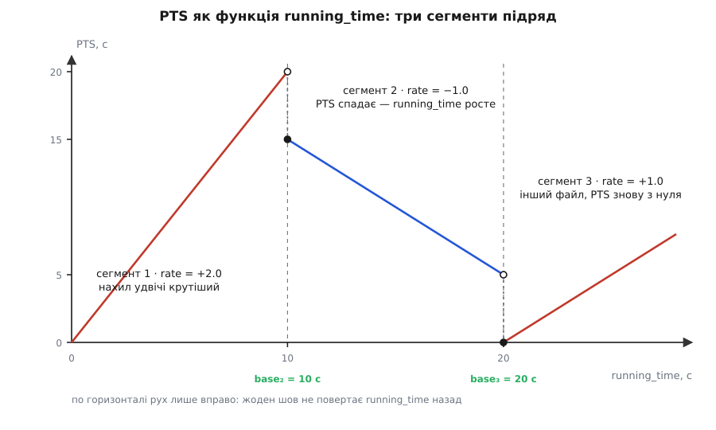
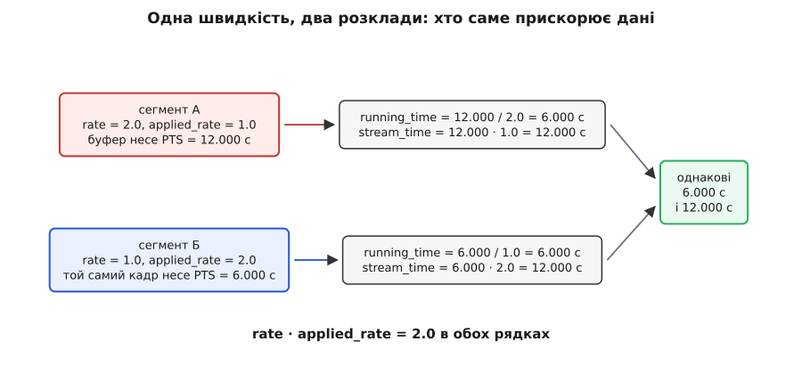

# 🧮 Алгебра сегмента: від мітки буфера до моменту показу

Формула переходу «мітка буфера → `running_time`» насправді не одна, а дві — окрема для прямого ходу й окрема для зворотного, — і тут вони не оголошуються, а виводяться з єдиної вимоги. З того самого виведення випливає, чому `running_time` неможливо відкинути назад жодним ланцюжком перемотувань і чому швидкість відтворення описують двома числами замість одного.

## Сегмент — це відображення, а не опис

Сегмент зручно уявляти описом «що зараз грає». Для арифметики корисніше інше: це набір чисел, що задає **два різні відображення** осі міток буфера на дві інші осі.

```
start         мітка першого буфера сегмента (останнього — при rate < 0)
stop          мітка останнього буфера      (першого   — при rate < 0)
base          running_time, уже накопичений усіма попередніми сегментами
time          stream_time того краю, з якого сегмент починається
rate          швидкість, яку до даних ЩЕ ТРЕБА застосувати
applied_rate  швидкість, яку до даних УЖЕ застосували
offset        скільки сегмента вже програно, якщо seek не чіпав його краю
```

Область визначення обох відображень одна: мітка `p` лежить між `start` і `stop`. А от поля вони беруть **різні**, і жодне поле не бере участі в обох. Перше відображення веде на вісь `running_time` і відповідає за розклад показу; друге веде на вісь `stream_time` і відповідає за те, де стоїть повзунок. Далі — обидва, по черзі.

## Пряма швидкість: три вимоги дають одну формулу

Усередині сегмента швидкість не змінюється — саме це й робить сегмент сегментом; зміна швидкості означає новий сегмент. Тому шукане відображення `r(p)` **лінійне**: сталий нахил плюс сталий доданок. Лишається знайти обидва.

Нахил дає означення швидкості. `rate = 2.0` означає, що за одну секунду реального часу конвеєр проходить дві секунди матеріалу. Отже, одна секунда матеріалу займає `1/|rate|` секунди реального часу, і це рівно нахил:

```
d(running_time) / d(PTS) = 1 / |rate|
```

Перевірка розмірності одразу знімає спокусу помножити замість поділити: секунди матеріалу, поділені на «секунди матеріалу за секунду реального часу», дають секунди реального часу — те, що треба.

Сталий доданок дає означення поля `base`: це `running_time` того краю, з якого сегмент починається. Для додатної швидкості такий край — `start`. Разом:

```
running_time(p) = (p − (start + offset)) / |rate| + base        rate > 0
```

`offset` майже завжди нуль. Він відмінний від нуля лише тоді, коли перемотування змінило один край сегмента, а другий лишило незайманим: тоді частину сегмента вже програно, і `base` цю частину вже містить, тому з міток її треба відняти. У прикладах нижче `offset = 0`, і в тексті він більше не заважатиме.

Звідси **ширина сегмента на осі `running_time`** — скільки реального часу він займе цілком:

```
Δ = (stop − start) / |rate|
```

**Приклад 1: подвійна швидкість.**

```
сегмент:  start = 0.000 с    stop = 20.000 с
          base  = 0.000 с    rate = +2.0

PTS  0.000 →  (0.000 − 0.000) / 2.0 + 0.000 =  0.000 с
PTS  4.000 →  (4.000 − 0.000) / 2.0 + 0.000 =  2.000 с
PTS 12.000 → (12.000 − 0.000) / 2.0 + 0.000 =  6.000 с
PTS 20.000 → (20.000 − 0.000) / 2.0 + 0.000 = 10.000 с

ширина:  Δ = (20.000 − 0.000) / 2.0 = 10.000 с
```

Двадцять секунд матеріалу вкладаються в десять секунд стіни. Жодне поле буфера при цьому не змінилося: прискорення живе виключно в дільнику.

## Зворотний хід: чому формула спирається на stop

При від'ємній швидкості демультиплексор віддає буфери **за спаданням** міток: спочатку той, що ближче до кінця відрізка, останнім — той, що на початку. (Усередині кожної групи кадри однаково доводиться декодувати вперед — без цього двонапрямлені й передбачені кадри нема на що спирати, як розбирає [міжкадрове стиснення](topic:com-signal/inter-frame), — але **до споживача** вони доходять у зворотному порядку.)

Вимога до `running_time` не змінилася ані на йоту: він мусить зростати в порядку доставки, бо ним планують показ, а годинник іде тільки вперед. Але тепер `p` спадає. Якби ми лишили формулу прямого ходу, `running_time` спадав би разом із міткою: перший доставлений буфер потрапив би в далекий кінець відрізка, останній — у `base`. Розклад показу вийшов би перевернутим.

Отже, відображення має бути **спадним по `p`**, а «краєм, з якого сегмент починається», тепер є `stop`. Обидві вимоги задовольняє єдина зміна — відлік ведеться від іншого краю:

```
running_time(p) = ((stop − offset) − p) / |rate| + base          rate < 0
```

Обидві формули — одна й та сама: **відстань від вхідного краю сегмента, поділена на `|rate|`, плюс `base`**. Знак `rate` лише обирає, який край вхідний. Уся різниця між прямим і зворотним ходом уміщається в цьому виборі, і ширина `Δ` в обох випадках однакова.

У цієї симетрії є наслідок із зубами: **`stop` мусить бути відомий**. Якщо його не задано, реалізація пробує підставити `start + duration`; якщо й тривалість невідома, переведення просто не визначене — функція повертає ознаку невдачі. Тому зворотне відтворення потоку невідомої довжини (живої камери, нескінченної мережевої стрічки) не «складне» — воно безглузде: нема точки, від якої відлічувати.

**Приклад 2: зворотне відтворення відрізка.**

```
сегмент:  start = 5.000 с    stop = 15.000 с
          base  = 0.000 с    rate = −1.0

порядок доставки — за спаданням PTS:

PTS 15.000 → (15.000 − 15.000) / 1.0 + 0.000 =  0.000 с
PTS 12.500 → (15.000 − 12.500) / 1.0 + 0.000 =  2.500 с
PTS 10.000 → (15.000 − 10.000) / 1.0 + 0.000 =  5.000 с
PTS  5.000 → (15.000 −  5.000) / 1.0 + 0.000 = 10.000 с

ширина:  Δ = (15.000 − 5.000) / 1.0 = 10.000 с
```

Мітки впали з 15 до 5, `running_time` виріс з 0 до 10. Правило споживача не змінилося жодною літерою — він і не здогадується, що кіно йде задом наперед. Зворотний хід на подвійній швидкості (`rate = −2.0`) відрізняється тільки дільником: `Δ` стане 5.000 с.

## Чому running_time не може піти назад

Тепер твердження, заради якого поле `base` взагалі існує.

**Усередині сегмента.** У порядку доставки відстань від вхідного краю тільки росте: при `rate > 0` мітка віддаляється від `start` угору, при `rate < 0` — від `stop` униз. Ділення на додатне число і додавання сталої порядку не міняють. Тому `running_time` усередині сегмента не спадає, а всі його значення лежать у проміжку `[base, base + Δ]`.

Отже, кожен сегмент займає на осі `running_time` свій відрізок довжиною `Δ` і проходить його зліва направо. Питання монотонності зводиться до одного: як розставлені ці відрізки.

**На шві.** Розставляє їх перемотування, і робить це двома різними способами — залежно від того, чи скидається конвеєр:

```
якщо GST_SEEK_FLAG_FLUSH:
        base = 0                                   /* скидання running_time */
інакше:
        position = обмежити(position, start, stop)
        base = running_time(position)              /* за старим сегментом */
```

**Перемотування без скидання** (а також склейка файлів, де арифметика та сама): новий `base` дорівнює `running_time` тієї позиції, на якій обірвався попередній сегмент. Відрізок нового сегмента починається рівно там, де закінчилися вже віддані значення старого — ні щілини, ні накладання. Монотонність зберігається за побудовою.

**Перемотування зі скиданням** виглядає порушенням: `base` стає нулем, і `running_time` починається спочатку. Але скидання на те й скидання, що викидає з конвеєра все ще не показане, а разом із новим сегментом конвеєр вибирає **новий `base_time`** — за документацією, при переході в READY або при перемотуванні зі скиданням `running_time` конвеєра обнуляється, і точку відліку призначають наново, за поточним показом годинника.

Звідси точне формулювання: монотонний не `running_time` сам по собі, а **сума `running_time + base_time`** — саме те число, яким споживач замовляє момент показу. Між скиданнями `base_time` стала, і вся монотонність лягає на `running_time`; у мить скидання обидва доданки міняються разом, і сума стрибає вперед, до поточного часу годинника. Тому ланцюжок із будь-якої кількості перемотувань, будь-яких швидкостей і будь-яких знаків жодного разу не змусить споживача чекати на момент, що вже минув.

> 🔧 **Навіщо це.** Два різні поля звуться майже однаково, і плутають їх постійно. `segment.base` живе в сегменті, міряється в шкалі `running_time` і відповідає на питання «скільки вже награно попередніми сегментами». `base_time` живе в елементі, міряється в шкалі годинника й відповідає на питання «яким був показ годинника, коли `running_time` дорівнював нулю». Перше переводить вісь медіа в `running_time`, друге — `running_time` у покази годинника. Помилка в кожному з них дає той самий симптом: буфери сиплються назовні миттєво.

**Приклад 3: три сегменти підряд.** Зіб'ємо два попередні приклади в один ланцюг і додамо третій сегмент — інший файл, підклеєний услід.

```
СЕГМЕНТ 1 — файл A, подвійна швидкість
   start = 0.000   stop = 20.000   base = 0.000   rate = +2.0
   Δ₁ = (20.000 − 0.000) / 2.0 = 10.000
   running_time пробігає 0.000 … 10.000, поки PTS іде 0.000 → 20.000

ШОВ 1 — перемотування без скидання у зворотний хід по [5, 15]
   позиція, на якій обірвався сегмент 1:  PTS = 20.000
   base₂ = (20.000 − 0.000) / 2.0 + 0.000 = 10.000

СЕГМЕНТ 2 — той самий файл, назад
   start = 5.000   stop = 15.000   base = 10.000   rate = −1.0
   Δ₂ = (15.000 − 5.000) / 1.0 = 10.000
   PTS 15.000 → (15.000 − 15.000) / 1.0 + 10.000 = 10.000
   PTS 10.000 → (15.000 − 10.000) / 1.0 + 10.000 = 15.000
   PTS  5.000 → (15.000 −  5.000) / 1.0 + 10.000 = 20.000

ШОВ 2 — склейка: далі йде інший файл, уперед, звичайною швидкістю
   base₃ = base₂ + Δ₂ = 10.000 + 10.000 = 20.000

СЕГМЕНТ 3 — файл Б, його PTS знову починаються з нуля
   start = 0.000   stop = 8.000   base = 20.000   rate = +1.0
   PTS 0.000 → (0.000 − 0.000) / 1.0 + 20.000 = 20.000
   PTS 8.000 → (8.000 − 0.000) / 1.0 + 20.000 = 28.000
```

Порівняйте дві колонки. Мітки пробігли 0 → 20, тоді 15 → 5, тоді 0 → 8: тричі стрибнули, один раз змінили напрям, один раз почалися заново з іншого файлу. `running_time` тим часом пройшов від 0.000 до 28.000 без жодного кроку назад, і на кожному шві останнє значення попереднього сегмента точно дорівнює першому значенню наступного. У цьому вся робота склеювального елемента: він не чіпає ні буферів, ні їхніх міток, він лише перераховує `base`.



*Три сегменти на спільній осі: напрям і крутизна змінюються, рух уздовж горизонталі — ні.*

Що буде, якщо `base₃` залишити нулем — типова помилка саморобного джерела? Перший буфер файлу Б попросить показати його на `running_time` 0.000, тобто на двадцять секунд у минулому. Споживач визнає його запізнілим на всі двадцять секунд, скине його разом із наступними за допуском запізнення — і другий файл вилетить назовні миттєво, весь одразу. Симптом характерний саме своєю миттєвістю: не «трохи не так», а «вся склейка за одну мить».

## rate проти applied_rate: хто саме прискорює дані

Швидкість відтворення в сегменті описують двома числами, і документація прямо задає їхній зв'язок: **дійсна швидкість потоку — це добуток `rate · applied_rate`**. Добуток і є тим, що просив користувач. Розклад на множники каже інше — **хто виконує роботу**.

`applied_rate` — швидкість, уже вкладена в дані. Якийсь елемент справді змінив темп: розтягнув звук без зміни висоти, викинув кадри, витягнув їх із джерела частіше. Мітки буферів після нього вже несуть новий темп.

`rate` — швидкість, яку ще належить застосувати. Дані й мітки лишилися вихідними, а прискорення — робота споживача: він просто виймає їх із черги частіше.

Розрізняти доводиться тому, що від цього залежать **обидві** формули, і кожна бере рівно одне з двох чисел. Переведення в `running_time` користується виключно `rate`. Переведення в `stream_time` — виключно `applied_rate`. Причина в кожному випадку вміщається в одне речення. `running_time` стискає те, чого з даними **ще не зробили**, — а це і є `rate`. `stream_time` скасовує те, що з даними **вже зробили**, — а це і є `applied_rate`.

**Приклад 4: один кадр, дві бухгалтерії.** Користувач попросив подвійну швидкість. Кадр, що лежить у матеріалі на 12-й секунді, треба показати. Розклад можливий двома способами.

```
СПОСІБ А — прискорює споживач
   сегмент: start = 0.000  stop = 20.000  time = 0.000  base = 0.000
            rate = 2.0     applied_rate = 1.0
   кадр несе свою вихідну мітку:  PTS = 12.000

   running_time = (12.000 − 0.000) / 2.0 + 0.000 =  6.000 с
   stream_time  = (12.000 − 0.000) · 1.0 + 0.000 = 12.000 с

СПОСІБ Б — прискорення вже вкладено в мітки
   елемент вище переставив мітки: 20 с матеріалу тепер займають 10 с міток
   сегмент: start = 0.000  stop = 10.000  time = 0.000  base = 0.000
            rate = 1.0     applied_rate = 2.0
   той самий кадр несе:  PTS = 6.000

   running_time = (6.000 − 0.000) / 1.0 + 0.000 =  6.000 с
   stream_time  = (6.000 − 0.000) · 2.0 + 0.000 = 12.000 с
```

Обидві осі збіглися: момент показу той самий, позиція повзунка та сама, добуток `rate · applied_rate` в обох розкладах дорівнює 2.0. Саме ця рівність і робить розклад осмисленим — роботу з прискорення можна віддати тому, хто зробить її найкраще (для звуку це той, хто вміє змінювати темп без зміни висоти), і ні розклад показу, ні повзунок передачі не помітять.



*Множники різні, добуток один — і обидві формули дають те саме число.*

Звідси й найтихіша поламка цієї пари. Елемент переставив мітки, але лишив `applied_rate` одиницею. `running_time` вийде правильним — він рахується з нових міток при `rate = 1.0`. А `stream_time` збреше: у прикладі вище він показав би 6.000 замість 12.000. Синхронність ціла, звук із зображенням сходиться, а повзунок повзе вдвічі повільніше за кіно й показує не ту позицію. Шукати таке в синхронізації марно — ламається сусідня формула.

## Окремо про stream_time

`stream_time` — позиція всередині матеріалу в шкалі, зрозумілій людині: те, що показує повзунок і що повертає запит позиції. Формул теж дві, і гілку обирає знак `applied_rate`:

```
stream_time(p) = (p − start) · |applied_rate| + time        applied_rate > 0
stream_time(p) = (stop − p) · |applied_rate| + time         applied_rate < 0
```

Два місця тут варті уваги.

**Множення, а не ділення** — дзеркало до `running_time`. `applied_rate` уже **стиснув** мітки: при `applied_rate = 2.0` одна секунда міток містить дві секунди вихідного матеріалу. Щоб повернутися до матеріалу, розтягуємо назад, тобто множимо. `running_time` дивиться в майбутнє даних і ділить; `stream_time` дивиться в їхнє минуле і множить.

**Гілку обирає `applied_rate`, а не `rate`.** У звичайному сегменті зворотного відтворення `rate` від'ємний, а `applied_rate` — ні: перемотування ставить його в 1.0, бо даних ніхто не чіпав. Працює перша гілка, а `time` після перемотування дорівнює `start`. Перевіримо на сегменті 2 з прикладу 3:

```
сегмент 2: start = 5.000   time = 5.000   applied_rate = +1.0

PTS 15.000 → (15.000 − 5.000) · 1.0 + 5.000 = 15.000 с
PTS 12.500 → (12.500 − 5.000) · 1.0 + 5.000 = 12.500 с
PTS  5.000 → ( 5.000 − 5.000) · 1.0 + 5.000 =  5.000 с
```

`stream_time` спадає з 15.000 до 5.000 — і саме так і треба: поки кіно йде назад, повзунок мусить повзти вліво. Ось найважливіша різниця між двома осями: `stream_time` **не зобов'язаний** бути монотонним і при зворотному ході не є. Він не розклад, а позиція. Через це в синхронізації йому нема чого робити: споживач планує показ виключно за `running_time`, а `stream_time` існує для повзунка, для запиту позиції й для тих ефектів, яким треба знати, на якій секунді фільму вони працюють, — приміром, для накладання, прив'язаного до монтажного плану.

Поза межами `[start, stop]` `stream_time` не визначений — як і `running_time`. Обидва переведення мають, утім, розширений варіант, який замість відмови повертає модуль результату й ознаку знака: «стільки-то **до** початку сегмента». Це не примха: декодерові, що перемотався на ключовий кадр перед точкою перемотування, доводиться декодувати трохи раніше за `start`, і кудись же ці буфери треба віднести на осі.
