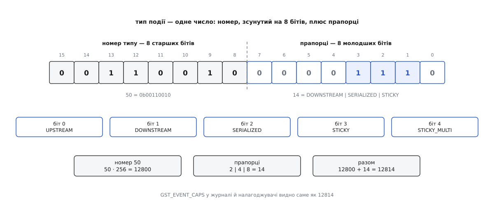

# 📋 Події й запити на падах: типи, сигнатури, володіння

Це настільна довідка по сигналізації в GStreamer 1.x — усі типи подій і запитів із їхніми номерами й прапорцями так, як вони записані в `gst/gstevent.h` і `gst/gstquery.h`, парні конструктори й розбирачі, функції пада та елемента, якими це надсилають, і — окремим стовпцем — хто кому винен `unref`. Останнє тут не додаток: код із переплутаним володінням компілюється без жодного попередження, працює годину й тече, бо подія, послана мільйон разів, лишила по собі мільйон невизволених об'єктів.

Друге, що варто тримати перед очима, — значення поверненого `TRUE`. Воно різне майже в кожній із цих функцій, і майже ніде не означає «сталося те, чого ви хотіли».

## Як прочитати число типу

Тип події й тип запиту — не порядкові номери, а складені числа: старші біти несуть номер, молодші — прапорці поведінки. Тому перевірка «чи ця подія йде проти течії» — це операція над бітами, а не порівняння з переліком.

```c
#define GST_EVENT_NUM_SHIFT   (8)
#define GST_EVENT_MAKE_TYPE(num,flags)  (((num) << GST_EVENT_NUM_SHIFT) | (flags))

typedef enum {
  GST_EVENT_TYPE_UPSTREAM       = 1 << 0,   /* має право йти проти течії */
  GST_EVENT_TYPE_DOWNSTREAM     = 1 << 1,   /* має право йти за течією */
  GST_EVENT_TYPE_SERIALIZED     = 1 << 2,   /* стоїть у черзі разом із буферами */
  GST_EVENT_TYPE_STICKY         = 1 << 3,   /* осідає на паді */
  GST_EVENT_TYPE_STICKY_MULTI   = 1 << 4    /* осідає в кількох примірниках */
} GstEventTypeFlags;

#define GST_EVENT_TYPE_BOTH \
    ((GstEventTypeFlags)(GST_EVENT_TYPE_UPSTREAM | GST_EVENT_TYPE_DOWNSTREAM))
```



*Число типу розбирається на дві частини зсувом на вісім бітів: номер задає порядок, прапорці — поведінку.*

**Умова.** Ви бачите в журналі або в налагоджувачі значення `12814` і хочете знати, що це.

```
12814 ÷ 256 = 50, остача 14      → номер 50, прапорці 14
14 = 8 + 4 + 2                   → STICKY | SERIALIZED | DOWNSTREAM
номер 50 з такими прапорцями     → GST_EVENT_CAPS
```

Вручну цього робити не треба — є готові функції, — але знати розкладку варто, бо саме вона пояснює, чому нумерація йде десятками: між уже наявними типами лишили місце для тих, які винайдуть пізніше.

```c
const gchar *      gst_event_type_get_name  (GstEventType type);
GstEventTypeFlags  gst_event_type_get_flags (GstEventType type);

#define GST_EVENT_TYPE(event)        (GST_EVENT_CAST(event)->type)
#define GST_EVENT_TYPE_NAME(event)   (gst_event_type_get_name (GST_EVENT_TYPE (event)))
#define GST_EVENT_SEQNUM(event)      (GST_EVENT_CAST(event)->seqnum)

#define GST_EVENT_IS_UPSTREAM(ev)    !!(GST_EVENT_TYPE (ev) & GST_EVENT_TYPE_UPSTREAM)
#define GST_EVENT_IS_DOWNSTREAM(ev)  !!(GST_EVENT_TYPE (ev) & GST_EVENT_TYPE_DOWNSTREAM)
#define GST_EVENT_IS_SERIALIZED(ev)  !!(GST_EVENT_TYPE (ev) & GST_EVENT_TYPE_SERIALIZED)
#define GST_EVENT_IS_STICKY(ev)      !!(GST_EVENT_TYPE (ev) & GST_EVENT_TYPE_STICKY)
```

`GST_EVENT_TYPE_NAME()` віддає готовий рядок — саме його варто друкувати в діагностиці замість числа.

Запити влаштовані так само, тільки прапорців у них три: липкість для питання беззмістовна.

```c
#define GST_QUERY_NUM_SHIFT   (8)
#define GST_QUERY_MAKE_TYPE(num,flags)  (((num) << GST_QUERY_NUM_SHIFT) | (flags))

typedef enum {
  GST_QUERY_TYPE_UPSTREAM   = 1 << 0,
  GST_QUERY_TYPE_DOWNSTREAM = 1 << 1,
  GST_QUERY_TYPE_SERIALIZED = 1 << 2
} GstQueryTypeFlags;

const gchar *      gst_query_type_get_name  (GstQueryType type);
GstQueryTypeFlags  gst_query_type_get_flags (GstQueryType type);
```

## Усі типи подій

У стовпці «прапорці»: **↓** — за течією, **↑** — проти течії, **↑↓** — в обидва боки, **S** — серіалізована, **K** — липка, **M** — липка в кількох примірниках.

### Скидання: обидва напрямки

| Константа | № | Прапорці | Що несе | Хто типово шле |
| --- | --- | --- | --- | --- |
| `GST_EVENT_UNKNOWN` | 0 | — | нічого; трапляється лише в неініціалізованій змінній | — |
| `GST_EVENT_FLUSH_START` | 10 | ↑↓ | нічого; сам факт наказу «кидай роботу, відмовляй усім даним» | програма через перемотування, демультиплексор, джерело |
| `GST_EVENT_FLUSH_STOP` | 20 | ↑↓ S | `gboolean reset_time` — чи скидати початок відліку конвеєра | той самий, хто послав `FLUSH_START` |

### За течією, липкі: чинний стан потоку

| Константа | № | Прапорці | Що несе | Хто типово шле |
| --- | --- | --- | --- | --- |
| `GST_EVENT_STREAM_START` | 40 | ↓ S K | `stream_id` — рядок, унікальний для доріжки; окремо `group_id` | джерело або демультиплексор на кожному своєму src-паді |
| `GST_EVENT_CAPS` | 50 | ↓ S K | `GstCaps` — чинний формат даних на цьому паді | будь-який елемент, що виробляє дані |
| `GST_EVENT_SEGMENT` | 70 | ↓ S K | `GstSegment` — темп, формат, `start`, `stop`, `base`, `time`, `position` | джерело; після кожного перемотування — новий |
| `GST_EVENT_STREAM_COLLECTION` | 75 | ↓ S K M | `GstStreamCollection` — перелік доріжок, які має матеріал | `parsebin`, `decodebin3`, демультиплексор |
| `GST_EVENT_TAG` | 80 | ↓ S K M | `GstTagList` — назва, виконавець, бітрейт, кодек | демультиплексор, парсер, кодувальник |
| `GST_EVENT_BUFFERSIZE` | 90 | ↓ S K | підказка про бажані межі розміру буферів; майже ніхто не реалізує | — |
| `GST_EVENT_SINK_MESSAGE` | 100 | ↓ S K M | `GstMessage`, який приймач мусить викласти на шину саме тоді, коли дійде до цього місця потоку | елементи, яким потрібне повідомлення, синхронне з даними |
| `GST_EVENT_STREAM_GROUP_DONE` | 105 | ↓ S K | `group_id` групи, яка більше нічого не дасть — без повного кінця потоку | `parsebin`, `urisourcebin` при переході на наступний матеріал |
| `GST_EVENT_EOS` | 110 | ↓ S K | нічого; сам факт «даних більше не буде» | джерело, коли дочитало |
| `GST_EVENT_TOC` | 120 | ↓ S K M | `GstToc` — зміст матеріалу: розділи, треки, вкладення | демультиплексор |
| `GST_EVENT_PROTECTION` | 130 | ↓ S K M | ідентифікатор системи захисту, ініціалізаційні дані, походження | демультиплексор захищеного контейнера |

Прапорець **M** відрізняє те, чого може бути кілька одночасно. Формат на паді один, і нова подія `CAPS` витісняє стару. А тегів у матеріалі буває кілька наборів — від контейнера, від кодека, від потоку, — і кожен осідає окремо, не витісняючи інших. Саме тому в `gst_pad_get_sticky_event()` є третій аргумент `idx`: для `CAPS` він завжди 0, для `TAG` перебирає збережені.

### За течією, неліпкі: одна подія в потоці

| Константа | № | Прапорці | Що несе | Хто типово шле |
| --- | --- | --- | --- | --- |
| `GST_EVENT_SEGMENT_DONE` | 150 | ↓ S | `GstFormat format`, `gint64 position` — де скінчився заданий відрізок | джерело після перемотування з `GST_SEEK_FLAG_SEGMENT` |
| `GST_EVENT_GAP` | 160 | ↓ S | `GstClockTime timestamp`, `GstClockTime duration` — дірка в потоці | джерело, парсер, аудіодекодер |
| `GST_EVENT_INSTANT_RATE_CHANGE` | 180 | ↓ K | `gdouble rate_multiplier`, `GstSegmentFlags new_flags` | демультиплексор, отримавши відповідне перемотування |

`GST_EVENT_GAP` виглядає дрібницею, але без неї синхронізація зупиняється. Приймач із двома доріжками чекає на пару «звук + відео»; якщо звуку в цьому проміжку просто немає, приймач чекав би вічно. Дірка — це спосіб сказати «даних тут не буде, час іде далі», і синхронізація рухається ([годинник і синхронізація](topic:sys-media/clock-and-sync)).

`GST_EVENT_INSTANT_RATE_CHANGE` — єдина липка подія без прапорця серіалізації. Це навмисно: зміна темпу без перемотування має спрацювати негайно, а не через глибину черг, — але водночас вона описує чинний стан, тож новий партнер мусить її отримати.

### Проти течії: накази й скарги

| Константа | № | Прапорці | Що несе | Хто типово шле |
| --- | --- | --- | --- | --- |
| `GST_EVENT_QOS` | 190 | ↑ | `GstQOSType`, `proportion`, `diff`, `timestamp` | приймач |
| `GST_EVENT_SEEK` | 200 | ↑ | темп, формат, прапорці, тип і значення початку й кінця | програма |
| `GST_EVENT_NAVIGATION` | 210 | ↑ | рух миші, натиск клавіші, команда меню — у власній структурі | вікно приймача |
| `GST_EVENT_LATENCY` | 220 | ↑ | `GstClockTime latency` — затримка, яку конвеєр обрав спільною | конвеєр після зведення запиту про затримку |
| `GST_EVENT_STEP` | 230 | ↑ | `format`, `amount`, `rate`, `flush`, `intermediate` | програма — покадровий перегляд |
| `GST_EVENT_RECONFIGURE` | 240 | ↑ | нічого; наказ «переузгодь формат заново» | елемент, у якого змінилися можливості; новий src-пад |
| `GST_EVENT_TOC_SELECT` | 250 | ↑ | `uid` запису зі змісту, на який перейти | програма |
| `GST_EVENT_SELECT_STREAMS` | 260 | ↑ | `GList` ідентифікаторів потоків, які треба вмикати | програма — у відповідь на `STREAM_COLLECTION` |
| `GST_EVENT_INSTANT_RATE_SYNC_TIME` | 261 | ↑ | момент за наскрізним часом, від якого нова швидкість чинна | елемент, що звів миттєву зміну темпу |

Останні дві пари варто читати разом із [автодобором елементів](topic:sys-media/autoplug-decodebin): `decodebin3` оголошує перелік доріжок подією за течією, програма відповідає вибором проти течії — і жодного окремого API для цього не потрібно, бо канал уже є.

### Власні: шість готових комірок

| Константа | № | Прапорці | Коли брати саме її |
| --- | --- | --- | --- |
| `GST_EVENT_CUSTOM_UPSTREAM` | 270 | ↑ | свій наказ до верхніх елементів |
| `GST_EVENT_CUSTOM_DOWNSTREAM` | 280 | ↓ S | своя позначка, прив'язана до місця в потоці |
| `GST_EVENT_CUSTOM_DOWNSTREAM_OOB` | 290 | ↓ | своє повідомлення вниз, яке має обігнати черги |
| `GST_EVENT_CUSTOM_DOWNSTREAM_STICKY` | 300 | ↓ S K M | свій факт про потік, який мусить дістатися новим гілкам |
| `GST_EVENT_CUSTOM_BOTH` | 310 | ↑↓ S | своє в обидва боки, з місцем у потоці |
| `GST_EVENT_CUSTOM_BOTH_OOB` | 320 | ↑↓ | своє в обидва боки, негайно |

Власна подія — це `GstStructure` з іменем усередині обраної комірки. Вибір комірки й є вибір поведінки: серіалізації та липкості власними руками не додати.

```c
GstStructure *s = gst_structure_new ("my-marker",
                                     "frame", G_TYPE_UINT, n,
                                     "label", G_TYPE_STRING, "cut", NULL);
GstEvent *e = gst_event_new_custom (GST_EVENT_CUSTOM_DOWNSTREAM, s);  /* s з'їдено */

gst_pad_push_event (srcpad, e);                    /* e з'їдено теж */
```

На боці отримувача:

```c
if (gst_event_has_name (event, "my-marker")) {
  const GstStructure *s = gst_event_get_structure (event);   /* НЕ звільняти */
  guint frame;
  gst_structure_get_uint (s, "frame", &frame);
}
```

## Конструктори й розбирачі

Пари `gst_event_new_*` / `gst_event_parse_*` тримають одну домовленість: конструктор або копіює вміст, або забирає його собі назовсім, а розбирач **ніколи** не дає вам нового посилання — він показує те, що лежить усередині події.

```c
GstEvent * gst_event_new_flush_start   (void);
GstEvent * gst_event_new_flush_stop    (gboolean reset_time);
void       gst_event_parse_flush_stop  (GstEvent *event, gboolean *reset_time);

GstEvent * gst_event_new_stream_start  (const gchar *stream_id);
void       gst_event_parse_stream_start(GstEvent *event, const gchar **stream_id);
void       gst_event_set_group_id      (GstEvent *event, guint group_id);
gboolean   gst_event_parse_group_id    (GstEvent *event, guint *group_id);

GstEvent * gst_event_new_caps          (GstCaps *caps);          /* caps: transfer none */
void       gst_event_parse_caps        (GstEvent *event, GstCaps **caps);

GstEvent * gst_event_new_segment       (const GstSegment *segment);   /* копіює */
void       gst_event_parse_segment     (GstEvent *event, const GstSegment **segment);
void       gst_event_copy_segment      (GstEvent *event, GstSegment *segment);

GstEvent * gst_event_new_tag           (GstTagList *taglist);    /* taglist: transfer FULL */
void       gst_event_parse_tag         (GstEvent *event, GstTagList **taglist);

GstEvent * gst_event_new_gap           (GstClockTime timestamp, GstClockTime duration);
void       gst_event_parse_gap         (GstEvent *event, GstClockTime *timestamp,
                                        GstClockTime *duration);

GstEvent * gst_event_new_eos           (void);
GstEvent * gst_event_new_segment_done  (GstFormat format, gint64 position);
GstEvent * gst_event_new_reconfigure   (void);
GstEvent * gst_event_new_latency       (GstClockTime latency);
```

Три верхні рядки цього переліку — три різні відповіді на питання «хто тепер володіє вмістом», і сплутати їх легко, бо сигнатури схожі. `gst_event_new_caps()` бере ваші caps **у користування**: подія додає своє посилання, ваше лишається вашим і його треба звільнити. `gst_event_new_tag()` бере список тегів **назовсім**: після виклику він більше не ваш. `gst_event_new_segment()` не бере нічого — він копіює структуру, тож ваш `GstSegment` може спокійно лежати на стеку.

Накази проти течії:

```c
GstEvent * gst_event_new_qos   (GstQOSType type, gdouble proportion,
                                GstClockTimeDiff diff, GstClockTime timestamp);
void       gst_event_parse_qos (GstEvent *event, GstQOSType *type, gdouble *proportion,
                                GstClockTimeDiff *diff, GstClockTime *timestamp);

typedef enum {
  GST_QOS_TYPE_OVERFLOW  = 0,   /* не встигаємо: даних більше, ніж обробляється */
  GST_QOS_TYPE_UNDERFLOW = 1,   /* даних бракує */
  GST_QOS_TYPE_THROTTLE  = 2    /* навмисне сповільнення на вимогу */
} GstQOSType;

GstEvent * gst_event_new_seek   (gdouble rate, GstFormat format, GstSeekFlags flags,
                                 GstSeekType start_type, gint64 start,
                                 GstSeekType stop_type, gint64 stop);
void       gst_event_parse_seek (GstEvent *event, gdouble *rate, GstFormat *format,
                                 GstSeekFlags *flags,
                                 GstSeekType *start_type, gint64 *start,
                                 GstSeekType *stop_type, gint64 *stop);

GstEvent * gst_event_new_step   (GstFormat format, guint64 amount, gdouble rate,
                                 gboolean flush, gboolean intermediate);
GstEvent * gst_event_new_select_streams (GList *streams);       /* transfer none */
GstEvent * gst_event_new_instant_rate_change (gdouble rate_multiplier,
                                              GstSegmentFlags new_flags);
```

У `gst_event_new_qos()` `proportion` — це частка реального часу, яку з'їдає обробка одного буфера: `1.0` означає «встигаємо рівно», `2.0` — «витрачаємо вдвічі більше часу, ніж маємо». `diff` — знакова різниця між моментом, коли буфер мав з'явитися, і моментом, коли він з'явився насправді; додатне число означає запізнення.

Формат, у якому задають позиції й межі, спільний для подій і запитів:

```c
typedef enum {
  GST_FORMAT_UNDEFINED = 0,
  GST_FORMAT_DEFAULT   = 1,   /* «природна» одиниця елемента: кадри, семпли */
  GST_FORMAT_BYTES     = 2,
  GST_FORMAT_TIME      = 3,   /* наносекунди — те, що вам потрібно в 95 % випадків */
  GST_FORMAT_BUFFERS   = 4,
  GST_FORMAT_PERCENT   = 5
} GstFormat;

#define GST_FORMAT_PERCENT_MAX    G_GINT64_CONSTANT (1000000)
#define GST_FORMAT_PERCENT_SCALE  G_GINT64_CONSTANT (10000)
```

Прапорці й типи перемотування ([перемотування і скидання конвеєра](topic:sys-media/seeking-and-flush)):

```c
typedef enum {
  GST_SEEK_TYPE_NONE = 0,   /* цю межу не чіпати */
  GST_SEEK_TYPE_SET  = 1,   /* абсолютне значення */
  GST_SEEK_TYPE_END  = 2    /* відносно кінця; від'ємне значення — назад від кінця */
} GstSeekType;

GST_SEEK_FLAG_FLUSH        = 1 << 0   /* скинути конвеєр: миттєво, але з розривом */
GST_SEEK_FLAG_ACCURATE     = 1 << 1   /* точна позиція ціною повільного пошуку */
GST_SEEK_FLAG_KEY_UNIT     = 1 << 2   /* дозволено з'їхати на найближчий ключовий кадр */
GST_SEEK_FLAG_SEGMENT      = 1 << 3   /* дійшовши до stop, надіслати SEGMENT_DONE замість EOS */
GST_SEEK_FLAG_TRICKMODE    = 1 << 4   /* дозволено ламати якість заради швидкості */
GST_SEEK_FLAG_SNAP_BEFORE  = 1 << 5
GST_SEEK_FLAG_SNAP_AFTER   = 1 << 6
GST_SEEK_FLAG_INSTANT_RATE_CHANGE = 1 << 10  /* змінити лише темп, не рухаючи позицію */
```

### Порядковий номер: як зв'язати наслідки з причиною

Кожна подія має 32-бітний порядковий номер. Він потрібен, бо одне перемотування породжує цілий виводок подій і повідомлень, і без спільної позначки програма не відрізнить наслідки свіжого перемотування від наслідків попереднього, яке ще не догасло.

```c
guint32  gst_event_get_seqnum (GstEvent *event);
void     gst_event_set_seqnum (GstEvent *event, guint32 seqnum);
guint32  gst_util_seqnum_next (void);
```

Правило для того, хто пише елемент: подія, породжена іншою подією, **успадковує** її номер. Перемотування зі скиданням породжує `FLUSH_START`, `FLUSH_STOP` і новий `SEGMENT` — усім трьом ставлять номер того самого перемотування. Так само номер переходить на повідомлення, які через це з'являться на шині ([шина повідомлень](topic:sys-media/bus-and-messages)).

## Хто кому винен unref

Уся книга правил зводиться до однієї таблиці. «Забирає» означає, що після виклику об'єкт більше не ваш — навіть якщо виклик повернув `FALSE`. Механіку самих посилань розібрано окремо ([підрахунок посилань](topic:sf-lang/reference-counting)).

| Виклик | Що з посиланням |
| --- | --- |
| `gst_event_new_*()` | ви отримали посилання й ним володієте |
| `gst_pad_push_event()` | **забирає** подію завжди, зокрема при `FALSE` |
| `gst_pad_send_event()` | **забирає** подію завжди |
| `gst_pad_event_default()` | **забирає** подію завжди |
| `gst_element_send_event()` | **забирає** подію завжди |
| `gst_pad_store_sticky_event()` | **не забирає**: пад додає своє посилання, ваше лишається вашим |
| `gst_pad_get_sticky_event()` | дає **нове** посилання — `gst_event_unref()` після вжитку |
| `gst_event_parse_*()` | нічого не дає: покажчики вказують усередину події |
| `gst_query_new_*()` | ви отримали посилання й ним володієте |
| `gst_pad_query()`, `gst_pad_peer_query()` | **не забирають** запит — звільняєте ви |
| `gst_pad_query_default()`, `gst_element_query()` | **не забирають** запит |
| `gst_query_parse_nth_allocation_pool()` | дає **нове** посилання на пул — `gst_object_unref()` |
| `gst_query_parse_uri()` | дає **новий** рядок — `g_free()` |
| решта `gst_query_parse_*()` | нічого не дає: покажчики вказують усередину запиту |
| зонд повернув `GST_PAD_PROBE_DROP` | подію звільняє рушій |
| зонд повернув `GST_PAD_PROBE_HANDLED` | подію звільняєте **ви** |

Асиметрія «подію забирають, запит — ні» не примха. Подія летить далі й переживе ваш кадр стека — тримати на неї посилання нема кому. Запит повертається до того, хто його створив, і той його ж і звільняє; зробити інакше означало б віддавати відповідь у щойно звільнену пам'ять.

Дві найпоширеніші помилки виглядають так:

```c
/* ✗ подвійне звільнення: push_event уже забрав подію */
gst_pad_push_event (pad, event);
gst_event_unref (event);

/* ✗ витік: обробник з'їв подію, але не звільнив її */
case GST_EVENT_CUSTOM_DOWNSTREAM:
  my_handle (event);
  return TRUE;             /* треба gst_event_unref (event) перед цим */

/* ✓ переслати ту саму подію двом падам — по посиланню на кожен */
gst_pad_push_event (pad_a, gst_event_ref (event));
gst_pad_push_event (pad_b, event);
```

## Усі типи запитів

| Константа | № | Прапорці | Питання | Хто типово відповідає |
| --- | --- | --- | --- | --- |
| `GST_QUERY_UNKNOWN` | 0 | — | — | — |
| `GST_QUERY_POSITION` | 10 | ↑↓ | де ми зараз | приймач — переводить мітку буфера через свій сегмент |
| `GST_QUERY_DURATION` | 20 | ↑↓ | скільки триває матеріал | демультиплексор; у контейнері зводиться максимумом |
| `GST_QUERY_LATENCY` | 30 | ↑↓ | чи потік живий і які мінімальна й максимальна затримки | кожен елемент додає свій внесок |
| `GST_QUERY_JITTER` | 40 | ↑↓ | лишилося з 0.10; у ядрі не реалізовано | — |
| `GST_QUERY_RATE` | 50 | ↑↓ | лишилося з 0.10; майже не вживається | — |
| `GST_QUERY_SEEKING` | 60 | ↑↓ | чи можна перемотувати в цьому форматі й у яких межах | джерело або демультиплексор |
| `GST_QUERY_SEGMENT` | 70 | ↑↓ | який відрізок відтворюється: темп, формат, межі | конвеєр |
| `GST_QUERY_CONVERT` | 80 | ↑↓ | перевести значення з формату у формат | парсер, демультиплексор |
| `GST_QUERY_FORMATS` | 90 | ↑↓ | які формати ти взагалі розумієш | демультиплексор |
| `GST_QUERY_BUFFERING` | 110 | ↑↓ | наскільки заповнено, у якому режимі, які діапазони вже є | `queue2`, `multiqueue` |
| `GST_QUERY_CUSTOM` | 120 | ↑↓ | своє питання у власній структурі | ваш елемент |
| `GST_QUERY_URI` | 130 | ↑↓ | яка адреса зараз і чи було перенаправлення | джерело |
| `GST_QUERY_ALLOCATION` | 140 | ↓ **S** | як тобі буферизувати: пул, розмір, вирівнювання, метадані | приймач і перетворювачі |
| `GST_QUERY_SCHEDULING` | 150 | ↑ | чи вмієш віддавати дані на вимогу, чи можна перемотувати | джерело |
| `GST_QUERY_ACCEPT_CAPS` | 160 | ↑↓ | чи приймеш саме ці caps — так чи ні | будь-який елемент із падами |
| `GST_QUERY_CAPS` | 170 | ↑↓ | які caps ти можеш, із урахуванням фільтра | будь-який елемент із падами |
| `GST_QUERY_DRAIN` | 180 | ↓ **S** | дай знати, коли все, що в дорозі, оброблено | усі нижні по черзі |
| `GST_QUERY_CONTEXT` | 190 | ↑↓ | чи є вже спільний контекст цього типу | сусіди, потім конвеєр |
| `GST_QUERY_BITRATE` | 200 | ↓ | який номінальний бітрейт *(з 1.16)* | демультиплексор, парсер |
| `GST_QUERY_SELECTABLE` | 210 | ↑↓ | чи вмієш ти сам вибирати потоки *(з 1.22)* | `decodebin3` і подібні |

Серіалізованих запитів рівно два, і обидва мають на це причину, що не зводиться до швидкості. `ALLOCATION` має сенс лише щодо чинного формату, тож мусить стояти між оголошенням формату й першим буфером ([буфери й пам'ять](topic:sys-media/buffers-and-memory)). `DRAIN` цінний не відповіддю, а моментом повернення: він за побудовою чекає, доки перед ним не спорожніє все.

## Конструктори, set- і parse-функції запитів

Запит проходить три руки. Той, хто питає, створює його конструктором. Той, хто відповідає, вписує відповідь функцією `set`. Той, хто питав, читає її функцією `parse`. Тому в більшості типів функції ходять трійками.

```c
GstQuery * gst_query_new_position   (GstFormat format);
void       gst_query_set_position   (GstQuery *q, GstFormat format, gint64 cur);
void       gst_query_parse_position (GstQuery *q, GstFormat *format, gint64 *cur);

GstQuery * gst_query_new_duration   (GstFormat format);
void       gst_query_set_duration   (GstQuery *q, GstFormat format, gint64 duration);
void       gst_query_parse_duration (GstQuery *q, GstFormat *format, gint64 *duration);

GstQuery * gst_query_new_latency    (void);
void       gst_query_set_latency    (GstQuery *q, gboolean live,
                                     GstClockTime min_latency, GstClockTime max_latency);
void       gst_query_parse_latency  (GstQuery *q, gboolean *live,
                                     GstClockTime *min_latency, GstClockTime *max_latency);

GstQuery * gst_query_new_seeking    (GstFormat format);
void       gst_query_set_seeking    (GstQuery *q, GstFormat format, gboolean seekable,
                                     gint64 segment_start, gint64 segment_end);
void       gst_query_parse_seeking  (GstQuery *q, GstFormat *format, gboolean *seekable,
                                     gint64 *segment_start, gint64 *segment_end);

GstQuery * gst_query_new_convert    (GstFormat src_format, gint64 value,
                                     GstFormat dest_format);
void       gst_query_set_convert    (GstQuery *q, GstFormat src_format, gint64 src_value,
                                     GstFormat dest_format, gint64 dest_value);

GstQuery * gst_query_new_segment    (GstFormat format);
void       gst_query_set_segment    (GstQuery *q, gdouble rate, GstFormat format,
                                     gint64 start_value, gint64 stop_value);

GstQuery * gst_query_new_formats    (void);
void       gst_query_set_formatsv   (GstQuery *q, gint n_formats, const GstFormat *formats);

GstQuery * gst_query_new_uri        (void);
void       gst_query_set_uri        (GstQuery *q, const gchar *uri);
void       gst_query_parse_uri      (GstQuery *q, gchar **uri);   /* g_free */
```

У запиті про затримку `live` — не декорація: живе джерело не можна попросити віддати дані швидше, тож приймач мусить чекати сам, і саме через це число конвеєр обирає спільну затримку ([затримка й буферизація](topic:sys-media/latency-and-buffering)).

Буферизація — єдиний запит, де відповідь складається з трьох незалежних наборів, і кожен вписують окремо:

```c
typedef enum {
  GST_BUFFERING_STREAM,      /* нікуди не складаємо, лише невелика черга */
  GST_BUFFERING_DOWNLOAD,    /* качаємо у файл наперед */
  GST_BUFFERING_TIMESHIFT,   /* кільцевий буфер: можна відступити назад */
  GST_BUFFERING_LIVE         /* живий потік, наперед не забігти */
} GstBufferingMode;

GstQuery * gst_query_new_buffering         (GstFormat format);
void     gst_query_set_buffering_percent (GstQuery *q, gboolean busy, gint percent);
void     gst_query_set_buffering_stats   (GstQuery *q, GstBufferingMode mode,
                                          gint avg_in, gint avg_out, gint64 buffering_left);
void     gst_query_set_buffering_range   (GstQuery *q, GstFormat format,
                                          gint64 start, gint64 stop, gint64 estimated_total);
gboolean gst_query_add_buffering_range   (GstQuery *q, gint64 start, gint64 stop);
```

Домовленість про пам'ять і про спосіб роботи:

```c
GstQuery * gst_query_new_allocation   (GstCaps *caps, gboolean need_pool);
void     gst_query_parse_allocation (GstQuery *q, GstCaps **caps, gboolean *need_pool);
void     gst_query_add_allocation_pool  (GstQuery *q, GstBufferPool *pool,
                                         guint size, guint min_buffers, guint max_buffers);
void     gst_query_add_allocation_param (GstQuery *q, GstAllocator *allocator,
                                         const GstAllocationParams *params);
void     gst_query_add_allocation_meta  (GstQuery *q, GType api, const GstStructure *params);
gboolean gst_query_find_allocation_meta (GstQuery *q, GType api, guint *index);

typedef enum {
  GST_SCHEDULING_FLAG_SEEKABLE          = 1 << 0,
  GST_SCHEDULING_FLAG_SEQUENTIAL        = 1 << 1,
  GST_SCHEDULING_FLAG_BANDWIDTH_LIMITED = 1 << 2
} GstSchedulingFlags;

GstQuery * gst_query_new_scheduling (void);
void     gst_query_set_scheduling  (GstQuery *q, GstSchedulingFlags flags,
                                    gint minsize, gint maxsize, gint align);
void     gst_query_add_scheduling_mode (GstQuery *q, GstPadMode mode);
gboolean gst_query_has_scheduling_mode_with_flags (GstQuery *q, GstPadMode mode,
                                                   GstSchedulingFlags flags);
```

`gst_query_find_allocation_meta()` — саме те місце, де елемент дізнається, чи розуміє нижній сусід потрібні метадані. Якщо метадані відеокадру там не знайшлися, віддавати кадр без копіювання нема сенсу: нижній не знає, як прочитати розкладку площин.

Питання про формат і про контекст:

```c
GstQuery * gst_query_new_accept_caps        (GstCaps *caps);
void     gst_query_parse_accept_caps        (GstQuery *q, GstCaps **caps);
void     gst_query_set_accept_caps_result   (GstQuery *q, gboolean result);
void     gst_query_parse_accept_caps_result (GstQuery *q, gboolean *result);

GstQuery * gst_query_new_caps         (GstCaps *filter);   /* filter може бути NULL */
void     gst_query_parse_caps         (GstQuery *q, GstCaps **filter);
void     gst_query_set_caps_result    (GstQuery *q, GstCaps *caps);
void     gst_query_parse_caps_result  (GstQuery *q, GstCaps **caps);

GstQuery * gst_query_new_drain    (void);

GstQuery * gst_query_new_context        (const gchar *context_type);
gboolean gst_query_parse_context_type (GstQuery *q, const gchar **context_type);
void     gst_query_set_context        (GstQuery *q, GstContext *context);
void     gst_query_parse_context      (GstQuery *q, GstContext **context);

GstQuery * gst_query_new_bitrate     (void);
void     gst_query_set_bitrate       (GstQuery *q, guint nominal_bitrate);
GstQuery * gst_query_new_selectable  (void);
void     gst_query_set_selectable    (GstQuery *q, gboolean selectable);
```

Різниця між двома запитами про формат вирішальна для швидкості узгодження. `ACCEPT_CAPS` питає про **один** конкретний набір і повертає «так» або «ні» — дешево. `CAPS` просить **усе, що можна**, і відповідь треба будувати, обходячи весь ланцюг нижче; на розгалуженому конвеєрі це дорого. Тому елемент, який може обійтися першим, не має слати другий ([узгодження caps](topic:sys-media/caps-negotiation)).

## Функції надсилання й що означає їхнє TRUE

```c
gboolean gst_pad_push_event    (GstPad *pad, GstEvent *event);
gboolean gst_pad_send_event    (GstPad *pad, GstEvent *event);
gboolean gst_pad_event_default (GstPad *pad, GstObject *parent, GstEvent *event);
gboolean gst_element_send_event(GstElement *element, GstEvent *event);

gboolean gst_pad_query         (GstPad *pad, GstQuery *query);
gboolean gst_pad_peer_query    (GstPad *pad, GstQuery *query);
gboolean gst_pad_query_default (GstPad *pad, GstObject *parent, GstQuery *query);
gboolean gst_element_query     (GstElement *element, GstQuery *query);
```

Чотири перші відрізняються не результатом, а тим, **звідки** починається шлях, і плутанина між ними — типова причина «подія нікуди не дійшла».

`gst_pad_push_event()` віддає подію **партнерові** цього пада: те, що ви штовхаєте зі свого src-пада, потрапить на sink-пад сусіда. Це виклик для того, хто **всередині** елемента.

`gst_pad_send_event()` віддає подію **цьому самому** падові — тобто його власній обробній функції, ніби подія щойно прибула ззовні. Це виклик для того, хто **зовні**: програма, що має покажчик на sink-пад приймача, шле перемотування саме так.

`gst_pad_event_default()` — типова обробка, яку викликають із власної обробної функції для всього, чого ви не перехопили. Вона й робить розсилання на протилежний бік елемента.

`gst_element_send_event()` не має справи з падами взагалі: ви даєте подію елементові, а той сам вирішує, куди її подіти. Для звичайного елемента типова поведінка — знайти відповідний пад; для контейнера правило перевернуте відносно очікуваного, і це варто запам'ятати дослівно:

```
подія за течією   → контейнер шле її СВОЇМ ДЖЕРЕЛЬНИМ елементам
подія проти течії → контейнер шле її СВОЇМ ПРИЙМАЧАМ
```

Перевернутість тільки здається дивною. Подія за течією мусить пройти весь ланцюг згори вниз — отже, впустити її треба **на самому верху**, у джерело. Подія проти течії має піднятися знизу вгору — отже, впускати її треба **в приймач**. Саме тому перемотування, послане конвеєрові, доходить до джерела: воно спершу потрапляє в приймачі, а звідти піднімається падами. Результат контейнер зводить логічним «і»: `TRUE` лише тоді, коли всі опитані діти відповіли `TRUE`; якщо потрібних дітей у ньому взагалі немає — теж `TRUE`.

Тепер найважливіше — що означає повернене число.

| Виклик | `TRUE` означає | `FALSE` означає |
| --- | --- | --- |
| `gst_pad_push_event()` | подію взяли в роботу (для липкої — щонайменше зберегли на паді) | партнера немає, пад скидає дані, або обробник відмовив |
| `gst_pad_send_event()` | обробна функція пада повернула успіх | пад скидає дані, або обробник відмовив |
| `gst_element_send_event()` | усі опитані діти відповіли успіхом | хоч один відмовив |
| `gst_pad_query()`, `gst_pad_peer_query()` | у запит **вписано** відповідь — її можна читати | ніхто не відповів; поля запиту читати **не можна** |
| `gst_element_query()` | те саме: відповідь у запиті | ніхто в конвеєрі не знає |

Дві пастки тут коштують найбільше часу.

**`TRUE` на події — не підтвердження наміру.** Перемотування може повернути `TRUE` просто тому, що подію взяв демультиплексор, — а стрибок ще навіть не почався й може не вдатися. Чи він удався, видно лише з того, що потече конвеєром далі: нове оголошення координат часу й буфери з новими мітками.

**`FALSE` на запиті — не помилка.** Питання про позицію на конвеєрі, який ще не дійшов до паузи, чесно провалюється: приймач ще не отримав системи координат часу, тож переводити мітку йому нема в що ([стани конвеєра](topic:sys-media/states-lifecycle)). Читати після `FALSE` те, що лежить у запиті, — читати сміття: `set`-функції ніхто не викликав.

Скорочення для найчастіших питань, які самі створюють і звільняють запит:

```c
gboolean gst_element_query_position (GstElement *element, GstFormat format, gint64 *cur);
gboolean gst_element_query_duration (GstElement *element, GstFormat format, gint64 *duration);
gboolean gst_element_query_convert  (GstElement *element, GstFormat src_format,
                                     gint64 src_val, GstFormat dest_format, gint64 *dest_val);
gboolean gst_element_seek_simple    (GstElement *element, GstFormat format,
                                     GstSeekFlags seek_flags, gint64 seek_pos);
```

## Липкі події: три функції

```c
GstEvent *    gst_pad_get_sticky_event  (GstPad *pad, GstEventType event_type, guint idx);
void          gst_pad_sticky_events_foreach (GstPad *pad,
                                             GstPadStickyEventsForeachFunction func,
                                             gpointer user_data);
GstFlowReturn gst_pad_store_sticky_event (GstPad *pad, GstEvent *event);

typedef gboolean (*GstPadStickyEventsForeachFunction) (GstPad *pad, GstEvent **event,
                                                       gpointer user_data);
```

`gst_pad_get_sticky_event()` — найдешевший спосіб дізнатися чинний стан пада ззовні, без жодного втручання в елемент. Аргумент `idx` має сенс лише для типів із прапорцем **M**; для решти він завжди 0. Повернене посилання ваше — звільняйте.

Обхід дає покажчик **на покажчик**: `event` можна не лише прочитати, а й замінити або обнулити. Повернене `FALSE` з функції-відвідувача перериває обхід.

`gst_pad_store_sticky_event()` кладе подію на пад, **не** надсилаючи її партнерові й не забираючи ваше посилання. Повертає не `gboolean`, а `GstFlowReturn`: `GST_FLOW_OK` — збережено, `GST_FLOW_FLUSHING` — пад саме скидає дані, `GST_FLOW_EOS` — потік уже скінчився.

## Зонди на події й запити

Зонд ставлять на пад із маскою типів; для сигналізації важать чотири біти й дві готові маски.

```c
GST_PAD_PROBE_TYPE_EVENT_DOWNSTREAM = 1 << 6
GST_PAD_PROBE_TYPE_EVENT_UPSTREAM   = 1 << 7
GST_PAD_PROBE_TYPE_EVENT_FLUSH      = 1 << 8    /* без нього скидання зонд НЕ побачить */
GST_PAD_PROBE_TYPE_QUERY_DOWNSTREAM = 1 << 9
GST_PAD_PROBE_TYPE_QUERY_UPSTREAM   = 1 << 10

GST_PAD_PROBE_TYPE_EVENT_BOTH = EVENT_DOWNSTREAM | EVENT_UPSTREAM
GST_PAD_PROBE_TYPE_QUERY_BOTH = QUERY_DOWNSTREAM | QUERY_UPSTREAM
GST_PAD_PROBE_TYPE_ALL_BOTH   = DATA_BOTH | QUERY_BOTH
```

Окремий біт на скидання — не дрібниця. `EVENT_DOWNSTREAM` і `EVENT_UPSTREAM` події скидання **не** ловлять; хто хоче бачити початок і кінець скидання, мусить додати `EVENT_FLUSH` явно.

```c
typedef enum {
  GST_PAD_PROBE_DROP,      /* далі не пускати; рушій звільнить сам, той, хто слав, дістане TRUE */
  GST_PAD_PROBE_OK,        /* нічого не вирішую, хай працює типова поведінка */
  GST_PAD_PROBE_REMOVE,    /* зняти цей зонд, дані пропустити */
  GST_PAD_PROBE_PASS,      /* блокувальному зонду: пропустити цей елемент і стати на наступному */
  GST_PAD_PROBE_HANDLED    /* я відповів сам; подію звільняю Я, запит вважається успішним */
} GstPadProbeReturn;

#define GST_PAD_PROBE_INFO_EVENT(d)  ...
#define GST_PAD_PROBE_INFO_QUERY(d)  ...
```

`GST_PAD_PROBE_HANDLED` і є той механізм, яким із програми дописують те, чого елемент не вміє: відповісти на запит замість нього. Для запиту повернене `HANDLED` означає, що той, хто питав, дістане `TRUE`, — отже, до цього ви зобов'язані вписати в запит осмислену відповідь відповідною `set`-функцією. Для події `HANDLED` поводиться як `DROP`, з однією різницею: звільнити подію мусите ви самі.

## Мінімальний робочий виклик

Зонд, який друкує кожну подію й кожен запит на паді, а на питання про затримку відповідає замість елемента фіксованим числом. Ставиться на sink-пад будь-якого елемента, нічого в ньому не змінюючи. Про те, у якій нитці спрацює кожна гілка, — окремо ([потоки виконання й черги](topic:sys-media/threads-and-queues)).

```c
static GstPadProbeReturn
trace_signals (GstPad *pad, GstPadProbeInfo *info, gpointer user_data)
{
  if (GST_PAD_PROBE_INFO_TYPE (info) & GST_PAD_PROBE_TYPE_EVENT_BOTH) {
    GstEvent *e = GST_PAD_PROBE_INFO_EVENT (info);

    g_print ("подія %-14s seqnum=%u  %s%s\n",
             GST_EVENT_TYPE_NAME (e), GST_EVENT_SEQNUM (e),
             GST_EVENT_IS_SERIALIZED (e) ? "у черзі" : "позачергова",
             GST_EVENT_IS_STICKY (e) ? ", липка" : "");
    return GST_PAD_PROBE_OK;                 /* нічого не чіпаємо */
  }

  if (GST_PAD_PROBE_INFO_TYPE (info) & GST_PAD_PROBE_TYPE_QUERY_BOTH) {
    GstQuery *q = GST_PAD_PROBE_INFO_QUERY (info);

    if (GST_QUERY_TYPE (q) == GST_QUERY_LATENCY) {
      gst_query_set_latency (q, TRUE, 40 * GST_MSECOND, 200 * GST_MSECOND);
      return GST_PAD_PROBE_HANDLED;          /* відповідь уже в запиті → той, хто питав, дістане TRUE */
    }
    g_print ("запит %s\n", gst_query_type_get_name (GST_QUERY_TYPE (q)));
    return GST_PAD_PROBE_OK;
  }
  return GST_PAD_PROBE_OK;
}

/* установлення */
GstPad *sinkpad = gst_element_get_static_pad (sink, "sink");
gulong  id = gst_pad_add_probe (sinkpad,
                                GST_PAD_PROBE_TYPE_EVENT_BOTH |
                                GST_PAD_PROBE_TYPE_EVENT_FLUSH |
                                GST_PAD_PROBE_TYPE_QUERY_BOTH,
                                trace_signals, NULL, NULL);
gst_object_unref (sinkpad);
```

І дзеркальний бік — надсилання перемотування в готовий конвеєр із власним порядковим номером, щоб потім упізнати його наслідки на шині:

```c
GstEvent *seek = gst_event_new_seek (1.0, GST_FORMAT_TIME,
                                     GST_SEEK_FLAG_FLUSH | GST_SEEK_FLAG_KEY_UNIT,
                                     GST_SEEK_TYPE_SET, 10 * GST_SECOND,
                                     GST_SEEK_TYPE_NONE, GST_CLOCK_TIME_NONE);
guint32 sn = gst_util_seqnum_next ();
gst_event_set_seqnum (seek, sn);

if (!gst_element_send_event (pipeline, seek))     /* seek уже з'їдено */
  g_printerr ("перемотування не взяв ніхто\n");
/* gst_event_unref (seek) тут БУЛО Б помилкою */
```

Далі на шині з'являться повідомлення з тим самим `sn` — за ним і відрізняють наслідки цього перемотування від наслідків попереднього, яке ще догасає.
