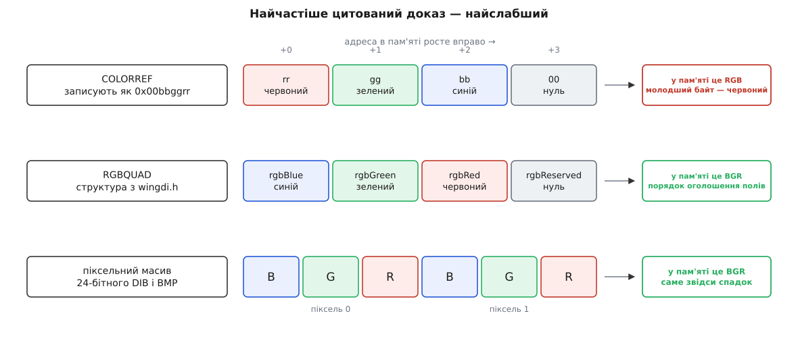

# 📜 Синій попереду: звідки в OpenCV узявся BGR

Кожен, хто зводить OpenCV із будь-якою іншою бібліотекою зображень, платить за одну домовленість кінця дев'яностих: трибайтовий піксель тут — це синій, зелений, червоний, а не навпаки. Ця вставка розбирає, звідки взявся такий порядок, що з цієї історії справді задокументовано, а що переказують з уст в уста вже чверть століття — і чому найгучніший «доказ» походження при першій же перевірці розсипається.

Почати варто з незручного. **Проєктного документа про це рішення немає.** Ані в архівах OpenCV, ані в матеріалах Intel не знайти сторінки, де хтось порівнює два порядки й обґрунтовує вибір. Усе, що ми маємо, — це задокументовані сліди в коді й у сусідніх форматах плюс усні пояснення самих розробників, переказані з других рук. З цього можна скласти правдоподібну картину, і нижче вона складається, але видавати її за протокол наради не можна.

## Бібліотека, що народилася всередині чужої бібліотеки

OpenCV розпочали 1999 року як дослідницьку ініціативу Intel: ідея прискорити дослідження зору відкритим і вилизаним під процесор кодом належала Гері Бредскі (Gary Bradski), дослідникові Intel. Альфу показали на конференції CVPR 2000, між 2001 і 2005 вийшло п'ять бета-версій, а версія 1.0 — аж 2006-го. Основну масу коду й оптимізацій писала команда інженерів у російських підрозділах Intel — лабораторії в Нижньому Новгороді, з якої згодом виросла компанія Itseez; довголітнім головним супровідником бібліотеки був Вадим Пісаревський (Vadim Pisarevsky). 2016 року Intel купила Itseez назад. Дати й організаційний ланцюжок тут — тверда частина історії; ролі окремих людей описано в мемуарних текстах і передмовах, не в корпоративних документах.

Важливо, що бібліотека народилася не на порожньому місці. У Intel уже була комерційна **IPL — Image Processing Library**, вилизана під MMX, і OpenCV від початку писали як надбудову над нею та поруч із нею. Слід цього спорідення досі стоїть у заголовках OpenCV відкритим текстом: базовий тип зображення старого C-інтерфейсу зветься `IplImage`, тобто буквально «зображення IPL», а його структуру переписали з IPL майже без змін. Ось вона, у чинному файлі `modules/core/include/opencv2/core/types_c.h`:

```c
int  nChannels;      /**< Most of OpenCV functions support 1,2,3 or 4 channels */
char colorModel[4];  /**< Ignored by OpenCV */
char channelSeq[4];  /**< ditto */
int  dataOrder;      /**< 0 - interleaved color channels, 1 - separate color channels.
                          cvCreateImage can only create interleaved images */
int  widthStep;      /**< Size of aligned image row in bytes.    */
```

Придивіться до другої й третьої стрічки — це найцінніший документ у всій історії. `colorModel` і `channelSeq` — по чотири символи кожен: IPL записувала колірну модель і **послідовність каналів у сам знімок**. Зображення везло з собою власний паспорт: тут написано `"RGB"`, а тут `"BGR"`, і кожна функція могла спитати. OpenCV поля зберегла — інакше б не збігалася двійкова розкладка структури, — але читати їх перестала. Коментар каже це прямо: *ignored by OpenCV*.

Ось де справжня точка розгалуження. Рішенням було не «беремо BGR замість RGB». Рішенням було **перестати питати зображення про порядок і зафіксувати один порядок на всю бібліотеку**. Порядок переїхав із даних у домовленість. Яка саме з двох літерних послідовностей замерзла — обставина другорядна; те, що вона замерзла *поза даними*, — саме це коштує досі.

> 🔧 **Навіщо це.** Коли ви шукаєте, чому кадр приїхав із синіми обличчями, корисно знати: питати нема кого. У `cv::Mat` немає поля з порядком каналів, як немає його і в `IplImage` — точніше, воно є, але порожнє й декоративне. Порядок доведеться встановити з документації сусідньої системи, а не з самих даних, і жодна перевірка в коді його не викриє.

## Windows, який справді ходив задом наперед

Чому ж замерз саме BGR. Найпоширеніше пояснення показує на Windows і цитує `COLORREF` — тип, яким GDI задає колір, «у шістнадцятковій формі `0x00bbggrr`». Виглядає як готовий доказ: ось воно, синє попереду. І тут аргумент розвалюється при першій перевірці.

Документація Microsoft каже далі те, чого зазвичай не цитують: молодший байт `COLORREF` містить червоний, другий — зелений, третій — синій. А `COLORREF` — це звичайний `DWORD`, тридцятидвобітове число. На x86 числа лежать у пам'яті [молодшим байтом уперед](topic:hw-arch/endianness), тож байти того самого `COLORREF` ідуть за адресами як **червоний, зелений, синій**. Запис `0x00bbggrr` — це число на папері, де старший розряд пишуть ліворуч; у пам'яті воно RGB. Найгучніший доказ доводить протилежне тому, задля чого його наводять.

Але справжній BGR у Windows таки є — просто не там, куди показують пальцем. Структура `RGBQUAD` із `wingdi.h` оголошена так:

```c
typedef struct tagRGBQUAD {
  BYTE rgbBlue;
  BYTE rgbGreen;
  BYTE rgbRed;
  BYTE rgbReserved;
} RGBQUAD;
```

Поля структури лежать у пам'яті в порядку оголошення — отже, тут байти справді йдуть синій, зелений, червоний. І те саме в піксельному масиві некомпресованого 24-бітного DIB та файлу BMP: кожен піксель зберігається як синій, зелений, червоний, і так від часів `BITMAPINFOHEADER`, тобто від початку дев'яностих. Оце — тверда, задокументована частина.



*Різниця між тим, як число записують, і тим, як воно лежить у пам'яті: `0x00bbggrr` — це запис, а не розкладка. Справжній BGR у Windows живе в `RGBQUAD` і в піксельному масиві DIB.*

## Чому апаратура пішла за екраном

Лишається питання, чому BGR виявився поширеним серед виробників камер і фреймграберів того часу — а він таки був поширений, це підтверджує кожен, хто застав ті SDK.

Ланцюжок причин відновлюється так. На Windows дев'яностих єдиний практичний спосіб показати спійманий кадр на екрані — віддати його GDI як DIB, викликом `SetDIBitsToDevice` або `StretchDIBits`. Якщо граббер пише в буфер одразу в розкладці DIB, шлях «камера → екран» коштує нуль перетворень. Якщо ні — кожен кадр отримує зайвий повний прохід із читанням і записом. За пропускної здатності пам'яті тих років і двадцяти п'яти кадрів на секунду цей прохід був відчутною статтею витрат, а не дрібницею. Тому виробник, який хотів, щоб його плата «просто працювала» в демонстраційній програмі, віддавав BGR. Шлях виведення продиктував формат захоплення, а формат захоплення продиктував [порядок компонент у пакетному буфері](topic:sf-visual/pixel-formats), який побачила IPL, а за нею й OpenCV.

Доказовий статус цього абзацу треба назвати чесно: ланцюжок спирається на задокументовані ланки — розкладку DIB, склад GDI-API, реальну поширеність BGR у тодішніх SDK, — але жодного документа виробника з формулюванням «ми обрали BGR через GDI» не існує. Це реконструкція, і вона правдоподібна саме тому, що кожна її ланка перевіряється окремо.

## Що сказав сам Бредскі

Найчастіше цитовані слова про походження BGR узагалі не з документації. Вони походять із розмови на конференції, яку переказав Сатья Малік (Satya Mallick) у себе в блозі: на питання, чому не RGB, Бредскі відповів аналогією про ширину залізничної колії, успадковану нібито від римських колісниць, — тобто стандарт живе довше за причину, яка його породила. Змістова частина відповіді така: тоді BGR був поширений серед виробників камер і постачальників програм, і бібліотека просто пішла за оточенням.

Іронія подвійна: сюжет про залізничну колію сам є хрестоматійним міським переказом із хисткою доказовою базою — тож історію про успадковані легенди переказують легендою. Але як образ інерції вона працює, і саме як образ її й ужито.

Тож остаточний облік доказів виглядає так:

- **Тверда документація.** Порядок байтів у DIB, BMP і `RGBQUAD`. Розкладка `COLORREF` — і те, що вона RGB у пам'яті. Поля `colorModel`/`channelSeq` в `IplImage` разом із поміткою «ignored». Дати проєкту. Те, що OpenCV віддає BGR донині.
- **Правдоподібна реконструкція.** Ланцюжок «GDI → буфери грабберів → IPL → OpenCV».
- **Усна традиція.** Слова Бредскі про поширеність BGR — переказ із других рук, без протоколу, листа в розсилці чи внутрішнього документа.
- **Не існує взагалі.** Жодного знайденого тексту, де порядок обирали б свідомо й обґрунтовували.

Правильна коротка відповідь на «чому BGR» звучить тому не «так вирішили», а **«так дісталося»**: порядок не обирали — його підібрали з оточення разом із кодом IPL, а тоді перестали записувати в дані й тим самим зробили незмінним.

## Чому не переробили

Зламати цю домовленість пізніше було вже неможливо, і причина тонша за звичайне «багато коду».

Уявіть, що завтра `imread` починає повертати RGB. Тип не змінився — той самий `CV_8UC3`. Розмір не змінився. Жодна сигнатура не поїхала, жоден компілятор нічого не скаже, жоден тест на падіння не спрацює, жоден виняток не полетить. Зміниться лише те, що в людей на знімках стануть сині обличчя — а в половині конвеєрів навіть цього ніхто не побачить, бо кадр іде не на екран, а в детектор. **Зміна, яка виробляє коректні дані з неправильним змістом, не мігрується інструментами взагалі**: немає за що зачепитися ані статичному аналізатору, ані компіляторові, ані рантайму. Ось чому BGR пережив три великі версії бібліотеки — не тому, що хтось його боронив, а тому, що безпечного шляху геть від нього не існує.

Але компроміс усе-таки з'явився, і він теж задокументований — у чинному `imgcodecs.hpp`:

```cpp
IMREAD_COLOR_BGR = 1,    //!< If set, always convert image to the 3 channel BGR color image.
IMREAD_COLOR     = 1,    //!< Same as IMREAD_COLOR_BGR.
IMREAD_COLOR_RGB = 256,  //!< If set, always convert image to the 3 channel RGB color image.
```

Читається це майже як зізнання. Старе ім'я `IMREAD_COLOR` лишили зі значенням 1 і поруч завели чесніше `IMREAD_COLOR_BGR` із тим самим значенням — щоб у коді нарешті було видно, що саме береться. А для RGB прорубали окремі двері під новим номером 256. Новий елемент переліку не ламає нікого; зміна змісту старого зламала б усіх мовчки. Іншого шляху й не було.

## Скільки це коштує сьогодні

Практично кожен споживач кадру поза OpenCV чекає RGB: Pillow, matplotlib, `QImage::Format_RGB888`, попередня обробка майже будь-якої нейромережі, `format=RGB` у GStreamer. Розбіжність оплачується однією з двох валют — або повним проходом `cvtColor` по кадру, або мовчазно неправильним результатом.

Друга валюта дорожча. Мережа, навчена на RGB, від BGR не падає — вона просто працює гірше на відсоток чи кілька, і причина цього не видна ні в журналі, ні в метриках: точність провалилася, а стек-трейсу немає, бо помилки немає. Такі речі шукають тижнями.

І найдорожче тут — не літери. `CV_8UC3` каже «три байти на піксель» і жодного слова про те, який із них синій; форма `(H, W, 3)` у NumPy мовчить так само. Порядок їде поруч із даними — в головах і в документації. Там, де сусідня система порядок таки записує в дані — а GStreamer записує, `format=BGR` у caps стоїть чорним по білому, — розбіжність принаймні можна вимовити й узгодити. Там, де мовчать обидві сторони, вона виявляється лише синіми обличчями.

IPL уміла записати порядок у сам знімок і тримала для цього чотири байти. OpenCV ці чотири байти лишила в структурі, але читати перестала — і платить за це двадцять шість років поспіль.

---

**Джерела.** [COLORREF (Win32, Microsoft Learn)](https://learn.microsoft.com/en-us/windows/win32/gdi/colorref) · [RGBQUAD (wingdi.h)](https://learn.microsoft.com/en-us/windows/win32/api/wingdi/ns-wingdi-rgbquad) · [BMP file format (Wikipedia)](https://en.wikipedia.org/wiki/BMP_file_format) · [OpenCV — історія (Wikipedia)](https://en.wikipedia.org/wiki/OpenCV) · [`types_c.h`, структура `IplImage`](https://raw.githubusercontent.com/opencv/opencv/4.x/modules/core/include/opencv2/core/types_c.h) · [`imgcodecs.hpp`, `ImreadModes`](https://raw.githubusercontent.com/opencv/opencv/4.x/modules/imgcodecs/include/opencv2/imgcodecs.hpp) · [Why does OpenCV use BGR color format? (LearnOpenCV)](https://learnopencv.com/why-does-opencv-use-bgr-color-format/)
